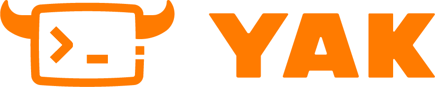
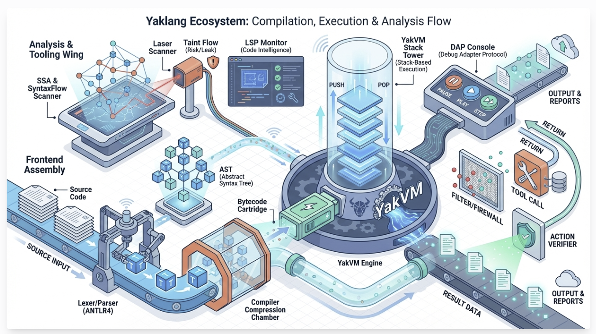
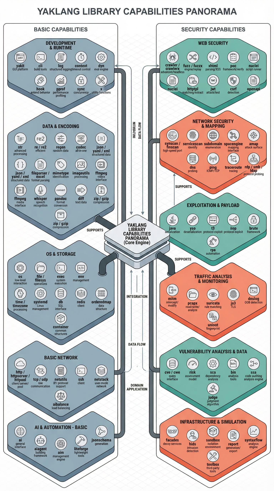
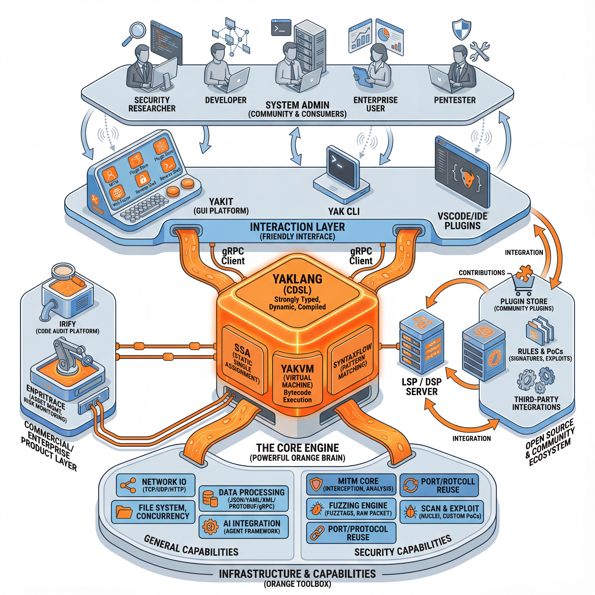
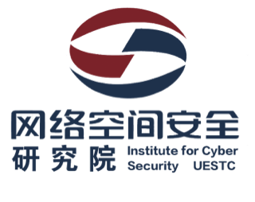

<p align="center">
  <a href="https://yaklang.io/"></a> 
<h2 align="center">DSL designed for CyberSecurity Domain</h2>
<p align="center">

<a href="https://github.com/yaklang/yaklang/releases">
<a href="https://github.com/yaklang/yaklang/graphs/contributors">
<a href="https://github.com/yaklang/yaklang/releases/">
<a href="https://github.com/yaklang/yaklang/issues">
<a href="https://deepwiki.com/yaklang/yaklang"></a>
<a href="https://github.com/yaklang/yaklang/blob/main/LICENSE.md">
</p>

<p align="center">
  <a href="#Quick Start">Quick Start</a> •
  <a href="https://yaklang.com/docs/intro">Official Documentation</a> •
  <a href="https://github.com/yaklang/yaklang/issues">Feedback</a> •
  <a href="https://yaklang.com/api-manual/intro">API Reference</a> •
  <a href="#Contributing Code">Contributing Code</a> •
  <a href="#Community ">Community</a> •
  <a href="#Project Architecture">Project Architecture</a> 
</p>

<p align="center">
:book:Languages: <a href="https://github.com/yaklang/yaklang/blob/main/README.md">English</a> • 
 <a href="https://github.com/yaklang/yaklang/blob/main/README_ZH.md">中文</a> 
</p>

---

# YAK: A CDSL-Centric Cybersecurity Technology Stack

YAK is a large-scale cybersecurity technology stack built around a domain-specific language. It spans compiler technology, security infrastructure, vulnerability analysis, and many other areas. Its compiler core components include:

- CDSL Yaklang: a domain-specific language for cybersecurity
- YakVM: a dedicated virtual machine for the cybersecurity DSL
- YAK SSA: a static single assignment form optimized for static analysis
- SyntaxFlow: a DSL for syntax pattern matching and vulnerability signature modeling
- LSP DSP Server: language-server-protocol and debug-server-protocol services



## CDSL-Yaklang

CDSL stands for Cybersecurity Domain Specific Language.

The Yaklang team combined the philosophy of domain-specific languages to create the CDSL concept and built the Yak (also called Yaklang) language around it to power infrastructure and ecosystem development.

Yaklang is a high-level programming language designed for the cybersecurity field. It offers strong typing with dynamic characteristics and supports both bytecode compilation and interpreted execution.

Its runtime depends only on YakVM, delivering "write once, run anywhere" execution as long as YakVM is deployed.

Yaklang became fully open source in 2023 under the academic guidance of the School of Cyberspace Security at the University of Electronic Science and Technology of China. The Yaklang.io R&D team iterated on it for years, covering extensive foundational security capabilities and supporting macOS, Linux, and Windows out of the box.

### Advantages of CDSL-Yaklang

- Simplicity: CDSL-based security products naturally separate business intent from capability layers, keeping solutions intuitive.
- Usability: Non-specialists can build security products with CDSL and avoid the information gap common in engineering-heavy tooling.
- Flexibility: A CDSL can be used standalone or embedded. Users write DSL scripts to implement strategies and detection rules that directly express their reasoning without excessive boilerplate.

## YAK Capability Infrastructure

Yaklang's infrastructure revolves around two cores—general-purpose capabilities plus security capabilities. The foundational layer provides development and runtime support on par with Go/Python, covering operating systems and storage, network I/O, data and encoding processing, AI and automation, and comprehensive application frameworks. The upper security layer targets the full cybersecurity lifecycle: web security, network mapping and scanning, exploit payloads, traffic analysis and monitoring, vulnerability data and analytics, and infrastructure simulation. Clear dependency relationships connect the two—foundational HTTP, regex, filesystem, and concurrency libraries underpin crawlers, PoCs, fuzzers, Nuclei-compatible engines, traffic interception, and fingerprint recognition, while vertical security modules feed improvements back into the base.

The overall design emphasizes modularity, composability, and extensibility: from CLI/logging/context/performance profiling to JSON/YAML/XML, media processing, speech recognition, and document conversion; from TCP/UDP/TLS/SSH, user-space network stacks, and intelligent payload delivery to AI agent frameworks and lightweight application construction. Together they form a scripting- and engineering-friendly ecosystem that lets developers build general-purpose software, security testing workflows, offensive/defensive simulations, and automation pipelines with one language and library stack.



Within this capability infrastructure, Yaklang already provides complete general-purpose and security foundations. What brings these capabilities to diverse roles and turns them into productivity is the user ecosystem and interaction layer. Through a unified language (Yaklang), virtual machine and compilation/execution engine (YAKVM), and tooling for development and security work, the foundational libraries become visual, orchestratable, and extensible workflows. The core entry point, Yakit, is both a GUI platform and Yaklang IDE: it unifies script editing, runtime debugging, log monitoring, workflow orchestration, plugin management, rule/PoC reuse, data analysis, and report generation so developers, security researchers, enterprise teams, and system administrators can collaborate within a single workspace and project capabilities into practical scenarios.

# YAK User Ecosystem and Yakit

A key application in the YAK ecosystem is Yakit. It is more than a graphical entry point—it is Yaklang's native IDE that converts the infrastructure's general-purpose and security capabilities into deliverable productivity through visualization, modularization, and orchestration. Visit https://github.com/yaklang/yakit to explore the project and download releases.

* Role coverage: security researchers, developers, system administrators, enterprise users, penetration testers, and more can access the Yaklang capability stack through a unified interaction layer.
* Interaction-layer components:
  * Yakit (GUI/IDE): Yaklang's flagship entry and IDE with code editing, runtime debugging, visual workflow orchestration, logs/events, plugin marketplace, rule/PoC management, data analytics, and reporting.
  * Yak CLI: scripting and pipeline integration for CI/CD and automation scenarios.
  * VSCode/IDE plugins: extensions for mainstream editors that provide syntax highlighting, LSP/DSP features, syntax-flow analysis, and static auditing hints.
  * Engine and platform: the Yaklang core language plus the YAKVM execution engine, offering a strongly typed, dynamic, compilable runtime tuned for high-concurrency security workloads.
  * SSA and SyntaxFlow: foundational layers for code auditing and static analysis.
  * IRify: a Yak-based auditing platform that supports multi-language analysis and report generation.
  * Capability delivery: network I/O, concurrency, filesystem, data processing/parsing, and specialized engines (MITM, fuzzing, scanning and exploitation, port/protocol multiplexing) are organized through the interaction layer into repeatable workflows.



- Why choose Yakit as the IDE:
  - Unified development experience: authoring Yak scripts, dependency management, local execution, remote execution, log inspection, and performance profiling all happen inside Yakit.
  - Direct access to security capabilities: crawlers, fuzzers, Nuclei compatibility, MITM/traffic analysis, fingerprint recognition, PoC validation, and report generation are integrated as native plugins and modules, reducing glue code and context switching.
  - Workflow and automation: integrations with AI agents, task orchestration, and rule/PoC marketplaces weave general-purpose and security capabilities into reusable, scenario-driven solutions.
  - Team collaboration and extensibility: the plugin store and community ecosystem support sharing scripts, rules, and best practices. Enterprises can wrap Yakit or integrate it into existing platforms through secondary development and third-party integrations.
- Relationship with CLI/VSCode:
  - Yak CLI focuses on automation, batch work, and pipelines, making it suitable for CI/CD or operations systems.
  - VSCode/IDE plugins target developers who prefer mainstream editors and provide lightweight editing and auditing assistance.
  - All three share the same language and capability stack, with Yakit offering the most complete visualization and operations features.

## Yaklang Command-Line Software

YAK can also be used from the command line, which is convenient for professionals and developers.

### Install via command line

Follow the guidance at **https://www.yaklang.com/** or **https://www.yaklang.io/**, or execute:

#### macOS / Linux

```bash
bash <(curl -sS -L http://oss.yaklang.io/install-latest-yak.sh)
```

#### Windows

```bash
powershell (new-object System.Net.WebClient).DownloadFile('https://yaklang.oss-cn-beijing.aliyuncs.com/yak/latest/yak_windows_amd64.exe','yak_windows_amd64.exe') && yak_windows_amd64.exe install && del /f yak_windows_amd64.exe
```

## Community

1. Use the Yaklang or Yakit issue trackers to discuss topics or share feedback in either English or Chinese—we respond as quickly as possible.
2. Users in mainland China can follow the "Yak Project" WeChat public account to join the community and group chats.

## Contributing Code

This is an advanced topic—please make sure you understand Yaklang's overall structure before contributing.

If you intend to modify the core syntax of Yaklang or YakVM, contact the R&D team first.

If you only want to extend libraries or fix bugs, feel free to submit a PR (ideally with unit tests) to help us maintain quality.

## Project Members

### Maintainer

[v1ll4n](https://github.com/VillanCh): Yak Project Maintainer.

### yaklang Core Developers / Active Contributors

1. [z3](https://github.com/OrangeWatermelon)
2. [Longlone](https://github.com/way29)
3. [Go0p](https://github.com/Go0p)
4. [Matrix-Cain](https://github.com/Matrix-Cain)
5. [bcy2007](https://github.com/bcy2007)
6. [naiquan](https://github.com/naiquann)
7. [Rookie-is](https://github.com/Rookie-is)
8. [wlingze](https://github.com/wlingze)

## Open-Source License

This repository uses the AGPL, a strict and contagious open-source license. If you use this codebase, your derived code must also be open source.

1. Mandatory open sourcing of network services: any service you operate with this code must publish its source to uphold open-source principles online.
2. Other terms match the GPL: free open source, open modification, and open derivatives.

This repository is intended for personal open-source research and learning.

## Acknowledgements

The project is academically advised by Professor Zhang Xiaosong from the School of Cyberspace Security at the University of Electronic Science and Technology of China.

<h3 align="center">

</h3>

### Fundamental Theory

1. Alonzo Church, "A set of postulates for the foundation of logic", Annals of Mathematics, 33(2), 346-366, 1932.
2. Dana Scott, Christopher Strachey, "Toward a mathematical semantics for computer languages", Proceedings of the Symposium on Computers and Automata, Microwave Research Institute Symposia Series Vol. 21, New York, 1971.
3. Henk Barendregt, Wil Dekkers, Richard Statman, Lambda Calculus with Types, Perspectives in Logic. Cambridge University Press, 2013.
4. Braun, M., Buchwald, S., Hack, S., Leißa, R., Mallon, C., Zwinkau, A. (2013). Simple and Efficient Construction of Static Single Assignment Form. In: Jhala, R., De Bosschere, K. (eds) Compiler Construction. CC 2013. Lecture Notes in Computer Science, vol 7791. Springer, Berlin, Heidelberg.

### Engineering Technology

1. Terence Parr, "The Definitive ANTLR 4 Reference", Pragmatic Bookshelf, 2013.
2. Terence Parr, "Simplifying Complex Networks Using Temporal Pattern Mining: The Case of AT&T's Observed Data Network", Dissertation, 1995.
3. Terence Parr, Russell Quong, "ANTLR: A Predicated-LL(k) Parser Generator", Journal of Software Practice and Experience, July 1995.
4. Google Inc., "Protocol Buffers", https://developers.google.com/protocol-buffers, 2020.
5. Google Inc., "gRPC", https://grpc.io/, 2020.
6. Microsoft Inc., "Monaco Editor", https://microsoft.github.io/monaco-editor/, 2020.
