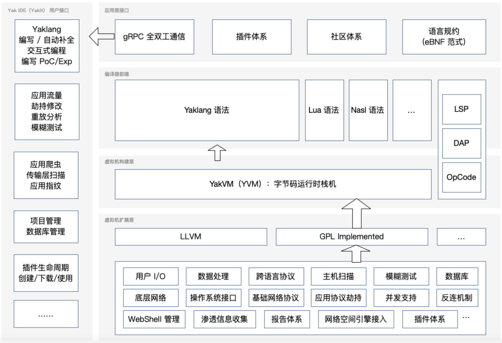

# CDSL-Yaklang: Cybersecurity Domain-Specific Language

为了加速安全产品和安全工具的工程化研发，我们创建了一门新的语言（Yaklang），并且同时实现了一个栈虚拟机（YakVM）。

In order to improve the development process of security products and hacking tools, we have created a new language (
Yaklang) and implemented a stack-based virtual machine (YakVM) for this language.

Yaklang 是一门图灵完备的编程语言，其语法由上下文无关文法定义。它运行在 YakVM 上。

Yaklang is a Turing-complete procedural language defined by context-free grammar. It runs on YakVM.

## 为什么要做 DSL? (Why DSL?)

1. 提高生产力。DSL 设计简洁高效,专注于解决特定问题,可以大大提高开发效率和生产力。

1. 改善抽象能力。DSL 可以帮助开发者利用高层抽象构建解决方案,不需要处理底层细节,提高开发效率。

1. 可维护性好。DSL 语言简单明了,代码也更加清晰易读,这有利于代码的维护和扩展。

1. 可靠性高。DSL 专注一定领域,语言和语义都更加精确,这有助于编写出更加可靠的程序。

1. 易于嵌入。DSL可以很容易地嵌入到一门宿主语言中,实现起来非常方便。

### Translation:

Improved productivity. DSL is designed to be concise and efficient, focusing on solving specific problems, which can greatly improve development efficiency and productivity.

Improved abstraction. DSL can help developers build solutions using high-level abstractions without dealing with low-level details, improving development efficiency.

High maintainability. DSL languages are simple and clear, and the code is also more readable, which is beneficial for code maintenance and expansion.

High reliability. DSL focuses on a certain field, the language and semantics are more precise, which helps to write more reliable programs.

Easy to embed. DSL can be easily embedded in a host language, which is very convenient to implement.

## 项目架构 / Project Architecture



## 快速开始 / Quick Start

### （推荐中文用户）通过 Yakit 来使用 Yaklang / Use Yaklang via Yakit

Yakit (https://github.com/yaklang/yakit) 是 Yaklang.io 团队官方出品的开源 Yaklang IDE，它可以帮助你快速上手 Yaklang 语言。

Yakit (https://github.com/yaklang/yakit) is the official open source Yaklang IDE released by the Yaklang.io team. It can help you get started with the Yaklang language quickly.

同时 Yakit 也能将绝大部分安全工程师需要的核心功能图形化。他是免费的，你可以通过 [下载安装 Yakit](https://www.yaklang.com/products/download_and_install)，来开始使用 Yaklang。

At the same time, Yakit can also visualize most of the core functions needed by security engineers. It is free, you can start using Yaklang by [downloading and installing Yakit] (https://www.yaklang.com/products/download_and_install).

### 通过命令行来安装使用

通过命令行来安装使用 Yaklang 请遵循：**https://www.yaklang.com/** 或 **https://www.yaklang.io/** 的指引，或直接执行

Install and use Yaklang via the command line, please follow: **https://www.yaklang.com/** or **https://www.yaklang.io/**, or directly execute

#### MacOS / Linux

```bash
bash <(curl -sS -L http://oss.yaklang.io/install-latest-yak.sh)
```

#### Windows

```bash
powershell (new-object System.Net.WebClient).DownloadFile('https://yaklang.oss-cn-beijing.aliyuncs.com/yak/latest/yak_windows_amd64.exe','yak_windows_amd64.exe') && yak_windows_amd64.exe install && del /f yak_windows_amd64.exe
```

## 社区 / Community

1. 你可以在 yaklang 或者 yakit 的 issues 中添加你想讨论的内容或者你想表达的东西，英文或中文均可，我们会尽快回复
2. 国内用户可以使用 WeChat 加入群组
3. 国际用户可以使用 Discord 加入社区

## 贡献你的代码 / Contribute your code

这是一个高级话题，在贡献你的代码之前，确保你对 Yaklang 整个项目结构有所了解。

This is an advanced topic. Before contributing your code, make sure you have an understanding of the entire Yaklang project structure.

在贡献代码时，如果你希望修改 Yaklang 或 YakVM 本身的核心语法部分，最好与研发团队取得联系。

When contributing code, if you want to modify the core syntax part of Yaklang or YakVM itself, it is best to contact the R&D team.

如果您仅仅想要增加库的功能，或者修复一些库的 Bug，那么您可以直接提交 PR，当然 PR 中最好包含对应的单元测试，这很有助于提升我们的代码质量。

If you just want to add functionality to the library, or fix some bugs in the library, then you can submit a PR directly. Of course, the PR should preferably include the corresponding unit test, which is very helpful to improve our code quality.

## 项目成员 / Project Members

### Maintainer

[v1ll4n](https://github.com/VillanCh): Yak Project Maintainer.

### yaklang 核心开发者 / Active yaklang core developers

1. z3
2. Longlone
3. Go0p
4. zwh-china
5. bcy2007
6. naiquan

## 开源许可证 / Open Source LICENSE

本仓库代码版本使用 AGPL 开源协议，这是一个严格的开源协议，且具有传染性，如果您使用了本仓库的代码，那么您的代码也必须开源。

1. 强制开源网络服务:要求提供网络服务的源代码必须开源。保证开源理念在网络环境下的实践。
2. 其他条款与 GPL 相同:开源免费、开源修改、衍生开源等。

本项目开源仓库仅应该作为个人开源和学习使用。


The code version in this repository uses the AGPL open source license, which is a strict open source license and is infectious. If you use the code in this repository, your code must also be open source.

1. Mandatory open source network services: Requires the source code of network services to be open source. Ensures the practice of open source philosophy in network environments.
2. Other terms are the same as GPL: open source free, open source modification, derived open source, etc.

This open source repository should only be used for personal open source and learning.

## 鸣谢 / Acknowledgments

本项目经由[电子科技大学](https://www.uestc.edu.cn)张小松([网络空间安全学院](https://www.scse.uestc.edu.cn/))教授学术指导。

This project is academically guided by Professor Zhang Xiaosong ([scse.uestc.edu.cn](https://www.scse.uestc.edu.cn/)), [University of Electronic Science and Technology of China](https://www.uestc.edu.cn).


### 基础理论学科 / Basic theoretical disciplines

1. Alonzo Church, "A set of postulates for the foundation of logic", Annals of Mathematics, 33(2), 346-366, 1932.
2. Dana Scott, Christopher Strachey, "Toward a mathematical semantics for computer languages", Proceedings of the Symposium on Computers and Automata, Microwave Research Institute Symposia Series Vol. 21, New York, 1971.
3. Henk Barendregt, Wil Dekkers, Richard Statman, lambda Calculus with Types, Perspectives in Logic. Cambridge University Press, 2013.

### 工程技术 / Engineering Technology

1. Terence Parr, "The Definitive ANTLR 4 Reference", Pragmatic Bookshelf, 2013. 
2. Terence Parr, "Simplifying Complex Networks Using Temporal Pattern Mining: The Case of AT&T's Observed Data Network", Dissertation, 1995.
3. Terence Parr, Russell Quong, "ANTLR: A Predicated-LL(k) Parser Generator", Journal of Software Practice and Experience, July 1995.
4. Google Ins, "Protocol Buffers", https://developers.google.com/protocol-buffers, 2020.
5. Google Ins, "gRPC", https://grpc.io/, 2020.
6. Microsoft Ins, "Monaco Editor", https://microsoft.github.io/monaco-editor/, 2020.
