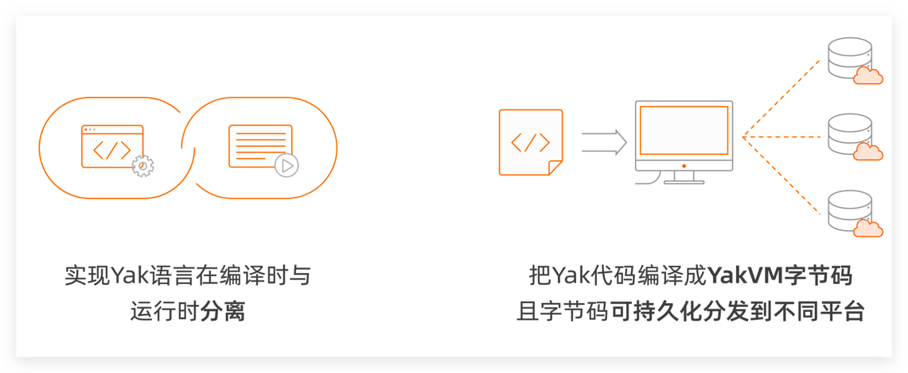
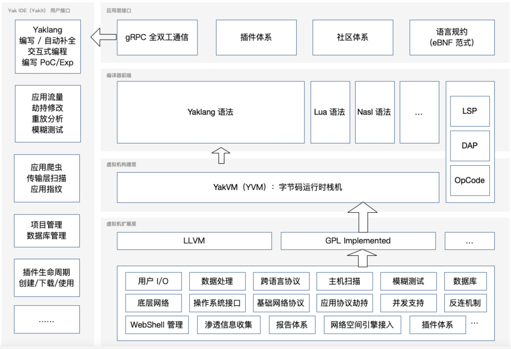

<p align="center">
  <a href="https://yaklang.io/"></a> 
 <h2 align="center">CDSL：Cybersecurity Domain Specific Language</h2>
<p align="center">

<a href="https://github.com/yaklang/yaklang/releases">
<a href="https://github.com/yaklang/yaklang/graphs/contributors">
<a href="https://github.com/yaklang/yaklang/releases/">
<a href="https://github.com/yaklang/yaklang/issues">
<a href="https://github.com/yaklang/yaklang/discussions">
<a href="https://github.com/yaklang/yaklang/blob/main/LICENSE.md">
</p>

<p align="center">
  <a href="#Quick Start">Quick Start</a> •
  <a href="https://yaklang.io/docs/intro">Official Documentation</a> •
  <a href="https://github.com/yaklang/yaklang/issues">Feedback</a> •
  <a href="https://yaklang.io/docs/api/global_buildin_ops/">API Reference</a> •
  <a href="#Contributing Code">Contributing Code</a> •
  <a href="#Community ">Community</a> •
  <a href="#Project Architecture">Project Architecture</a> 
</p>

<p align="center">
 :book:Language selection： <a href="https://github.com/yaklang/yaklang/blob/main/README_EN.md">English</a> • 
  <a href="https://github.com/yaklang/yaklang/blob/main/README.md">中文</a> 
</p>

---
# CDSL-Yaklang Introduction

CDSL: Cybersecurity Domain Specific Language, a programming language specifically designed for the field of cybersecurity.

The Yaklang team integrated the concept of "Domain Specific Language" and built the concept of CDSL, which serves as the core of the Yak (also known as Yaklang) language for developing infrastructure and language ecosystem.

Yak is an advanced computer programming language specifically developed for the field of cybersecurity, with a focus on being easy to write and distribute. It combines the features of strong typing, dynamic typing, and supports both compiled bytecode and interpreted execution at runtime.

The runtime environment of the Yak language relies solely on YakVM, enabling the "write once, run anywhere" feature. As long as there is a deployment of YakVM, Yak language programs can be executed quickly in any environment.

<h3 align="center">
  </a>
</h3>

The Yak language initially existed as an "embedded language" within a host program. However, under the academic guidance of the School of Cyberspace Security at the University of Electronic Science and Technology of China, the Yaklang.io development team spent two years iterating and transforming the language. They successfully developed the YakVM virtual machine, allowing the language to run independently without relying on a host language. In 2023, Yak was fully open-sourced. It supports mainstream operating systems such as macOS, Linux, and Windows.


## Advantages of Yaklang.

The Yak programming language, built based on the CDSL concept in the field of network security, encompasses almost all the advantages of DSL. It is designed as a specialized programming language for the development of security capabilities, implementing most common security functionalities, and enabling various security capabilities to complement, merge, and evolve with each other. This language aims to enhance the productivity of security professionals.

CDSL offers several advantages in the field of network security:

- Simplicity: Building security products using CDSL allows for a better separation of business logic and capabilities, resulting in more intuitive solutions.

- Usability: Even non-specialists can use CDSL to construct security products, avoiding information gaps that may arise during the engineering of security products.

- Flexibility: CDSL is designed to be used either as a standalone language or in embedded systems. Users can write DSL scripts based on their specific needs to implement specific strategies and detection rules. This often allows users to showcase their thought processes without being constrained by extraneous knowledge.

In addition, as a programming language specifically designed for network security development, Yak language provides many special features to help users quickly build network security applications:

1. Man-in-the-middle interception of library functions.

2. Advanced port scanning and service fingerprinting capabilities.

3. Encryption and decryption libraries for network security.

4. Support for China's commercial cryptographic systems, including the SM2 elliptic curve public key cryptographic algorithm, SM4 block cipher algorithm, SM3 cryptographic hash algorithm, and more.

<h3 align="center">
  </a>
</h3>

## Project Architecture



## Quick Start

- ### Use Yaklang via Yakit

Yakit (https://github.com/yaklang/yakit) is the official open source Yaklang IDE released by the Yaklang.io team. It can help you get started with the Yaklang language quickly.

At the same time, Yakit can also visualize most of the core functions needed by security engineers. It is free, you can start using Yaklang by [downloading and installing Yakit] (https://www.yaklang.com/products/download_and_install).


You can visit the [official documentation](https://yaklang.io/products/intro/) of Yakit for more information.


- ### To install and use via the command line

Install and use Yaklang via the command line, please follow: **https://www.yaklang.com/** or **https://www.yaklang.io/**, or directly execute

#### macOS / Linux

```bash
bash <(curl -sS -L http://oss.yaklang.io/install-latest-yak.sh)
```

#### Windows

```bash
powershell (new-object System.Net.WebClient).DownloadFile('https://yaklang.oss-cn-beijing.aliyuncs.com/yak/latest/yak_windows_amd64.exe','yak_windows_amd64.exe') && yak_windows_amd64.exe install && del /f yak_windows_amd64.exe
```

## Community

1. You can add the topics you want to discuss or express in Yaklang or Yakit's issues, in either English or Chinese, and we will reply as soon as possible.
2. Chinese users can join the group through WeChat.
   <h3 align="center">
   </a>
   </h3>
3. International users can join the community through Discord.

## Contributing Code

This is an advanced topic. Before contributing your code, make sure you have an understanding of the entire Yaklang project structure.

When contributing code, if you want to modify the core syntax part of Yaklang or YakVM itself, it is best to contact the R&D team.

If you just want to add functionality to the library, or fix some bugs in the library, then you can submit a PR directly. Of course, the PR should preferably include the corresponding unit test, which is very helpful to improve our code quality.

## Project Members

### Maintainer

[v1ll4n](https://github.com/VillanCh): Yak Project Maintainer.

### Active yaklang core developers

1. [z3](https://github.com/OrangeWatermelon)
2. [Longlone](https://github.com/way29)
3. [Go0p](https://github.com/Go0p)
4. [Matrix-Cain](https://github.com/Matrix-Cain)
5. [bcy2007](https://github.com/bcy2007)
6. [naiquan](https://github.com/naiquann)
7. [Rookie-is](https://github.com/Rookie-is)
8. [wlingze](https://github.com/wlingze)

## Open Source LICENSE

The code version in this repository uses the AGPL open source license, which is a strict open source license and is infectious. If you use the code in this repository, your code must also be open source.

1. Mandatory open source network services: Requires the source code of network services to be open source. Ensures the practice of open source philosophy in network environments.
2. Other terms are the same as GPL: open source free, open source modification, derived open source, etc.

This open source repository should only be used for personal open source and learning.

## Acknowledgments

This project is supervised by Professor Xiaosong Zhang from the University of Electronic Science and Technology of China ([UESTC](https://www.uestc.edu.cn)) and the School of Cybersecurity ([SCSE](https://www.scse.uestc.edu.cn)).
<h3 align="center">

</h3>

### Basic theoretical disciplines

1. Alonzo Church, "A set of postulates for the foundation of logic", Annals of Mathematics, 33(2), 346-366, 1932.
2. Dana Scott, Christopher Strachey, "Toward a mathematical semantics for computer languages", Proceedings of the Symposium on Computers and Automata, Microwave Research Institute Symposia Series Vol. 21, New York, 1971.
3. Henk Barendregt, Wil Dekkers, Richard Statman, Lambda Calculus with Types, Perspectives in Logic. Cambridge University Press, 2013.
4. Braun, M., Buchwald, S., Hack, S., Leißa, R., Mallon, C., Zwinkau, A. (2013). Simple and Efficient Construction of Static Single Assignment Form. In: Jhala, R., De Bosschere, K. (eds) Compiler Construction. CC 2013. Lecture Notes in Computer Science, vol 7791. Springer, Berlin, Heidelberg.

### Engineering Technology

1. Terence Parr, "The Definitive ANTLR 4 Reference", Pragmatic Bookshelf, 2013.
2. Terence Parr, "Simplifying Complex Networks Using Temporal Pattern Mining: The Case of AT&T's Observed Data Network", Dissertation, 1995.
3. Terence Parr, Russell Quong, "ANTLR: A Predicated-LL(k) Parser Generator", Journal of Software Practice and Experience, July 1995.
4. Google Inc., "Protocol Buffers", https://developers.google.com/protocol-buffers, 2020.
5. Google Inc., "gRPC", https://grpc.io/, 2020.
6. Microsoft Inc., "Monaco Editor", https://microsoft.github.io/monaco-editor/, 2020.


## Star History

[](https://star-history.com/#yaklang/yaklang&Date)

