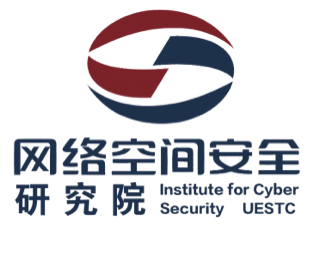

<p align="center">
  <a href="https://yaklang.io/"></a> 
 <h2 align="center">DSL designed for CyberSecurity Domain</h2>
<p align="center">

<a href="https://github.com/yaklang/yaklang/releases">
<a href="https://github.com/yaklang/yaklang/graphs/contributors">
<a href="https://github.com/yaklang/yaklang/releases/">
<a href="https://github.com/yaklang/yaklang/issues">
<a href="https://deepwiki.com/yaklang/yaklang"></a>
<a href="https://github.com/yaklang/yaklang/blob/main/LICENSE.md">
</p>

<p align="center">
  <a href="#Quick Start">Quick Start</a> •
  <a href="https://yaklang.com/docs/intro">Official Documentation</a> •
  <a href="https://github.com/yaklang/yaklang/issues">Feedback</a> •
  <a href="https://yaklang.com/api-manual/intro">API Reference</a> •
  <a href="#Contributing Code">Contributing Code</a> •
  <a href="#Community ">Community</a> •
  <a href="#Project Architecture">Project Architecture</a> 
</p>

<p align="center">
:book:Languages： <a href="https://github.com/yaklang/yaklang/blob/main/README.md">English</a> • 
  <a href="https://github.com/yaklang/yaklang/blob/main/README_ZH.md">中文</a> 
</p>

---

# YAK: 以 CDSL 为核心的网络安全领域技术体系

YAK 是一个具有极大规模网络安全技术栈，以领域限定语言为主的网络安全技术栈，涉及编译器技术，网络安全基础设施，漏洞分析技术等诸多领域。其编译器核心组件包含：

- CDSL Yaklang: 网络安全领域限定语言
- YakVM: 网络安全领域限定语言的虚拟机
- YAK SSA: 静态分析友好的静态单赋值形式
- SyntaxFlow: 语法模式匹配DSL与漏洞特征代码描述语言
- LSP DSP Server: 语言服务器协议服务器与调试协议服务器


## CDSL-Yaklang

CDSL：Cybersecurity Domain Specific Language，全称网络安全领域编程语言。

Yaklang 团队综合“领域限定语言”的思想，构建了CDSL的概念，并以此为核心构建了Yak(又称Yaklang)语言来构建基础设施和语言生态。

Yaklang 是一门针对网络安全领域研发的易书写，易分发的高级计算机编程语言。Yaklang 具备强类型、动态类型的经典类型特征，兼具编译字节码和解释执行的运行时特征。

Yaklang 的运行时环境只依赖于 YakVM，可以实现“一次编写，处处运行”的特性，只要有YakVM部署的环境，都可以快速执行 Yaklang 程序。

Yaklang 在 2023 年完全开源，在电子科技大学网络空间安全学院学术指导下，由 Yaklang.io 研发团队进行长达多年的迭代，覆盖大量信息安全领域基础能力，支持各类主流操作系统：macOS，Linux，Windows 可做到开箱即用。

### CDSL-Yaklang 的优势

基于CDSL概念构建的网络安全领域编程语言 Yaklang 被设计为针对安全能力研发领域的专用编程语言，实现了常见的大多数安全能力，可以让各种各样的安全能力彼此之间“互补，融合，进化”；提高安全从业人员的生产力。

- 简洁性：使用CDSL构建的安全产品更能实现业务和能力的分离，并且解决方案更加直观；

- 易用性：非专业的人员也可以使用CDSL构建安全产品，而避免安全产品工程化中的信息差；

- 灵活性：CDSL一般被设计为单独使用和嵌入式使用均可，用户可以根据自己的需求去编写DSL脚本以实现特定的策略和检测规则，这往往更能把用户的思路展示出来，而不必受到冗杂知识的制约；

## YAK 能力基础设施

Yaklang 的基础设施围绕“通用能力 + 安全能力”两大核心构建：底层的基础能力提供与 Go/Python 等通用语言相当的开发与运行时支持，涵盖操作系统与存储、网络 IO、数据与编码处理、AI 与自动化以及完善的开发框架；其上的安全能力则面向网络安全全流程，覆盖 Web 安全、网络测绘与扫描、漏洞利用与载荷、流量分析与监测、漏洞数据与分析以及基础设施与仿真。两者之间通过明确的依赖与支持关系耦合——例如基础的 http、正则、文件系统与并发库为爬虫、PoC、Fuzz、Nuclei 兼容引擎、流量拦截与指纹识别等安全模块提供稳固底座；而安全能力又以垂直领域应用的形式反哺基础设施的演进。整体设计强调模块化、可组合、可扩展：从 CLI/日志/上下文/性能分析到 JSON/YAML/XML、图像/音视频、语音识别与文档转换，再到 TCP/UDP/TLS/SSH、用户态网络栈与智能负载，再到 AI Agent 框架与轻量化应用构建，最终形成面向脚本编排与工程化的完整生态，使开发者能够以统一语言和库体系，高效地构建通用程序与安全测试、攻防仿真与自动化流程。


在“能力基础设施”中，Yaklang 已经提供了完整的通用与安全能力的底座。真正让这些能力触达不同角色并形成生产力的，是上层的用户生态与交互层：通过统一的语言（Yaklang）、虚拟机与编译执行引擎（YAKVM）、以及面向开发与安全工作的工具链，将基础库转化为可视化、可编排、可扩展的工作流。核心入口 Yakit 既是 GUI 平台，也是 Yaklang 的集成开发环境（IDE）：它把脚本编辑、运行调试、日志观测、任务编排、插件管理、规则/PoC 复用、数据分析与报告生成等能力整合在一个界面中，使开发者、安全研究员、企业用户与系统管理员能够在统一的工作台上协作与复用，从而将“能力”顺畅投射到“场景”。

# YAK 用户生态与 Yakit

YAK 生态中重要的一个软件是 Yakit，它不只是一个图形化入口，更是 Yaklang 的原生 IDE：让基础设施中的通用与安全能力，通过可视化、插件化与编排化的方式，快速转换为可交付的开发与安全生产力。 用户可以在 https://github.com/yaklang/yakit 查看该项目以及下载使用。

* 角色覆盖：安全研究员、开发者、系统管理员、企业用户、渗透测试员等多角色，通过统一的交互层进入 Yaklang 能力体系。
* 交互层组件：
  * Yakit（GUI/IDE）：Yaklang 的旗舰入口与 IDE，提供代码编辑器、运行时调试、可视化任务编排、日志与事件面板、插件市场、规则与 PoC 管理、报表导出等。
  * Yak CLI：用于脚本化与流水线集成，便于在 CI/CD 与自动化环境中调用 Yaklang 能力。
  * VSCode/IDE 插件：面向主流编辑器的扩展，支持语法高亮、LSP/DSP 能力、语法流分析与静态审计提示。
  * 引擎与平台：Yaklang 核心语言与编译执行引擎（YAKVM），强类型、动态、可编译，适配高并发与安全场景。
  * SSA 与 SyntaxFlow：面向代码审计与静态分析的底层能力。
  * IRify：基于 Yak 技术栈的代码审计平台，支持多语言审计与报告生成。
  * 能力落地：网络 IO、并发、文件系统、数据处理与解析、安全专用引擎（MITM、Fuzz、扫描与利用、端口/协议复用）等能力，通过交互层被组织为可重复的流程。


- 为什么选择 Yakit 作为 IDE：
  - 一体化开发体验：从编写 Yak 脚本、依赖管理、本地运行与远程执行，到日志观测与性能分析，均在 Yakit 中完成。
  - 安全能力直达：爬虫、Fuzz、Nuclei 兼容、MITM/流量分析、指纹识别、PoC 验证、报表生成等能力以插件与模块形式原生集成，减少“胶水代码”和环境切换。
  - 工作流与自动化：与 AI Agent、任务编排、规则/PoC 市场联动，可将通用能力与安全能力编织成可复用的场景化方案。
  - 团队协作与扩展：插件商店与社区生态支持共享脚本、规则与最佳实践，企业可以通过二次封装与三方集成将 Yakit 接入现有平台。
- 与 CLI/VSCode 的关系：
  - Yak CLI 侧重于自动化、批处理与流水线，适合集成到 CI/CD 或运维体系。
  - VSCode/IDE 插件面向习惯主流编辑器的开发者，提供轻量的编辑与审计辅助。
  - 三者共享同一语言与能力栈，Yakit 作为 IDE 提供最完整的可视化与运维能力。


## Yaklang 命令行软件

YAK 也可以通过命令行来使用，这对专业用户和开发者来说非常友好：

- ### 通过命令行来安装使用

通过命令行来安装使用 Yaklang 请遵循：**https://www.yaklang.com/** 或 **https://www.yaklang.io/** 的指引，或直接执行

#### macOS / Linux

```bash
bash <(curl -sS -L http://oss.yaklang.io/install-latest-yak.sh)
```

#### Windows

```bash
powershell (new-object System.Net.WebClient).DownloadFile('https://yaklang.oss-cn-beijing.aliyuncs.com/yak/latest/yak_windows_amd64.exe','yak_windows_amd64.exe') && yak_windows_amd64.exe install && del /f yak_windows_amd64.exe
```

## 社区

1. 你可以在 Yaklang 或者Yakit 的 issues 中添加你想讨论的内容或者你想表达的东西，英文或中文均可，我们会尽快回复
2. 国内用户可以关注我们微信公众号 "Yak Project" 来加入社区与群聊。

## 贡献你的代码

这是一个高级话题，在贡献你的代码之前，确保你对 Yaklang 整个项目结构有所了解。

在贡献代码时，如果你希望修改 Yaklang 或 YakVM 本身的核心语法部分，最好与研发团队取得联系。

如果您仅仅想要增加库的功能，或者修复一些库的 Bug，那么您可以直接提交 PR，当然 PR 中最好包含对应的单元测试，这很有助于提升我们的代码质量。

## 项目成员

### Maintainer

[v1ll4n](https://github.com/VillanCh): Yak Project Maintainer.

### yaklang 核心开发者 / Active yaklang core developers

1. [z3](https://github.com/OrangeWatermelon)
2. [Longlone](https://github.com/way29)
3. [Go0p](https://github.com/Go0p)
4. [Matrix-Cain](https://github.com/Matrix-Cain)
5. [bcy2007](https://github.com/bcy2007)
6. [naiquan](https://github.com/naiquann)
7. [Rookie-is](https://github.com/Rookie-is)
8. [wlingze](https://github.com/wlingze)


## 开源许可证

本仓库代码版本使用 AGPL 开源协议，这是一个严格的开源协议，且具有传染性，如果您使用了本仓库的代码，那么您的代码也必须开源。

1. 强制开源网络服务:要求提供网络服务的源代码必须开源。保证开源理念在网络环境下的实践。
2. 其他条款与 GPL 相同:开源免费、开源修改、衍生开源等。

本项目开源仓库仅应该作为个人开源和学习使用。

## 鸣谢

本项目经由[电子科技大学](https://www.uestc.edu.cn)张小松([网络空间安全学院](https://www.scse.uestc.edu.cn/))教授学术指导。

<h3 align="center">

</h3>

### 基础理论学科

1. Alonzo Church, "A set of postulates for the foundation of logic", Annals of Mathematics, 33(2), 346-366, 1932.
2. Dana Scott, Christopher Strachey, "Toward a mathematical semantics for computer languages", Proceedings of the Symposium on Computers and Automata, Microwave Research Institute Symposia Series Vol. 21, New York, 1971.
3. Henk Barendregt, Wil Dekkers, Richard Statman, Lambda Calculus with Types, Perspectives in Logic. Cambridge University Press, 2013.
4. Braun, M., Buchwald, S., Hack, S., Leißa, R., Mallon, C., Zwinkau, A. (2013). Simple and Efficient Construction of Static Single Assignment Form. In: Jhala, R., De Bosschere, K. (eds) Compiler Construction. CC 2013. Lecture Notes in Computer Science, vol 7791. Springer, Berlin, Heidelberg.

### 工程技术

1. Terence Parr, "The Definitive ANTLR 4 Reference", Pragmatic Bookshelf, 2013.
2. Terence Parr, "Simplifying Complex Networks Using Temporal Pattern Mining: The Case of AT&T's Observed Data Network", Dissertation, 1995.
3. Terence Parr, Russell Quong, "ANTLR: A Predicated-LL(k) Parser Generator", Journal of Software Practice and Experience, July 1995.
4. Google Inc., "Protocol Buffers", https://developers.google.com/protocol-buffers, 2020.
5. Google Inc., "gRPC", https://grpc.io/, 2020.
6. Microsoft Inc., "Monaco Editor", https://microsoft.github.io/monaco-editor/, 2020.
