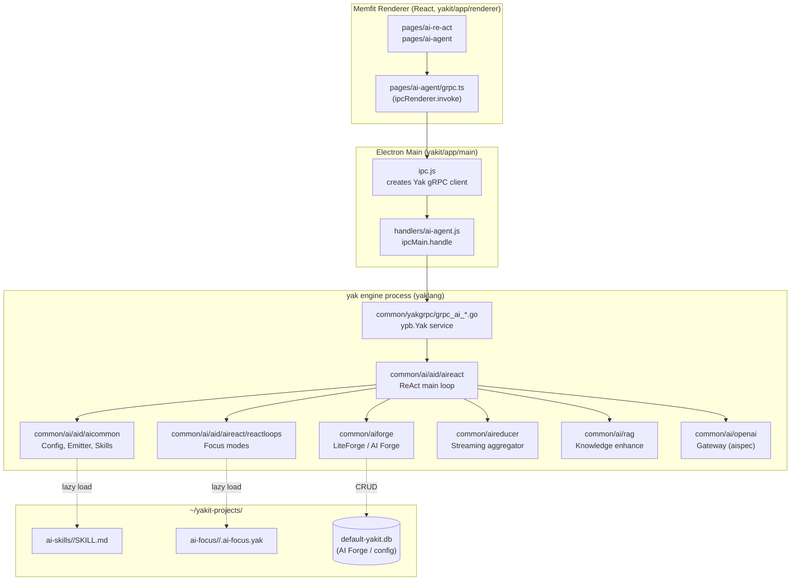

# Memfit AI ↔ yaklang AI 关系总览

> 给 AI / 新人开发者快速理清「Memfit 桌面端」与「yaklang AI 内核」的边界、依赖、改动入口。
>
> 改任何 AI 相关代码之前，强烈建议先读完这一篇，避免在错误的层级上动刀。

## 1. 一句话定位

**Memfit AI 是 yaklang AI 的 Electron 壳；不直连 Go 代码，全部走本机 yak gRPC（默认 `127.0.0.1:8087`）。**

- Memfit AI 桌面端（`yakit/` 仓库）= 产品 / 品牌
- yak 引擎（`yaklang/` 仓库）= 实现 / 内核

二者的耦合点**只有 ypb.proto 定义的 gRPC 接口**。改 RPC 字段必须同时改 proto + Go server + yakit IPC handler + renderer。

## 2. 整体架构



## 3. yaklang 侧子模块速查

### 3.1 `common/ai/aid/` 系列（核心 AI 编排）

| 子目录 | 定位 | 关键入口 | 对外暴露 |
|---|---|---|---|
| `aicommon/` | 运行时配置（`Config`）、`Emitter`、事件输入通道、`AIInvokeRuntime`、`AIEngineOperator` 注册中心 | `NewConfig`、`WithEventHandler`、`WithEventInputChanx`、`WithAutoTieredAICallback` | `init()` 注册 ReAct 工厂；通过 `aiskillloader` 自动发现 ai-skills |
| `aicommon/aiskillloader/` | AutoSkillLoader 实现：扫盘 `SKILL.md` + 60s 冷却 | `AutoSkillLoader.RefreshFromDirs` / `AllSkillMetas` | 由 `aicommon.Config` 自动初始化 |
| `aireact/` | ReAct 引擎主体：主循环、prompt 渲染、内置 actions、感知 / 反思 / 自旋检测 | `NewReAct`、`ReAct.SendInputEvent`、`WithBuiltinTools` | 通过 `init()` 把自己注册成 `aicommon.AIEngineOperator` 工厂 |
| `aireact/reactloops/` | Focus mode 体系：Loop 工厂注册、`LoopAction`、`LoopActionHandlerOperator`、所有 `loop_xxx/` 实现 | `RegisterLoopFactory`、`GetAllLoopMetadata`、`GetLoopMetadata`、`CreateLoopByName` | gRPC `QueryAIFocus` 直接读 |
| `aireact/reactloops/reactloops_yak/` | Yak 专注模式基础设施：embed 内置 + 用户目录懒扫 | `LoadAllFromEmbed`、`LoadSingleFile`、`EnsureUserFocusModesLoaded` | gRPC `QueryAIFocus` / `StartAIReAct` 入口调 `EnsureUserFocusModesLoaded` |
| `aireact/reactloops/loop_xxx/` | 17+ 个领域专注模式（`loop_default` / `loop_intent` / `loop_http_fuzztest` / `loop_smart_qa` / ...） | 每个 `init()` 调 `RegisterLoopFactory` | 由 `reactinit/init.go` 空白 import 触发注册 |
| `aitool/` | 工具抽象（`aitool.Tool`、`aitool.ToolOption`） | `WithStringParam`、`NewObjectSchema` | 所有 action / tool 用它来声明参数 schema |
| `aitool/buildinaitools/yakscripttools/yakscriptforai/` | 内置 yak 脚本工具（含 `do_http_request.yak` 等） | embed FS | 由 `WithBuiltinTools` 注入 ReAct |
| `aimem/` | AI 中长期记忆（关键词 + HNSW 索引） | `MemoryStore` 等 | ReAct 在多轮间用 |

### 3.2 与 `common/ai/aid/` 平级但同等重要的包

| 路径 | 定位 | 关键入口 | 对外暴露 |
|---|---|---|---|
| `common/aiforge/` | **LiteForge / AI Forge** 实现（**不在 `common/ai/`**） | `LiteForge.Invoke`、`InvokeSpeedPriority` / `InvokeQualityPriority` | gRPC `QueryAIForge` / `CreateAIForge` 等；DB CRUD |
| `common/aireducer/` | 流式聚合 / 长文本压缩（**不在 `common/ai/`**） | `NewReducerFromReader` / `NewReducerFromString` | yak DSL `Exports` 暴露给脚本 |
| `common/ai/rag/` | RAG：向量库、HNSW、knowledgebase、`RagEnhanceKnowledgeManager` | `NewRagEnhanceKnowledgeManager`、`NewRAGSystem` | gRPC `RAGCollectionSearch` 等；ReAct 通过 `WithEnhanceKnowledgeManager` 接入 |
| `common/ai/aispec/` | 上层 AI 抽象：`AIClient`、`Chat`、`StructuredStream` | `AIConfig`、`ChatBase` | 所有 gateway 客户端（openai/chatglm/...）实现该接口 |
| `common/ai/openai/` | OpenAI 兼容网关（同名子目录还有 chatglm / moonshot / ollama / deepseek / gemini / tongyi / volcengine / siliconflow / openrouter / dashscopebase / comate / aibalance / chatglm 等） | `GatewayClient.Chat` | 由 `aiconfig` 配置选择 |
| `common/ai/localmodel/` | 本机模型进程管理 | 配置导出 | `aiconfig` |
| `common/ai/embedding/` | embedding 客户端 | — | RAG 内部用 |

### 3.3 命名陷阱（容易踩的坑）

- **`liteforge` 实现在 `common/aiforge/`**，**不在** `common/ai/liteforge/`（不存在该目录）
- **`aireducer` 在 `common/aireducer/`**，**不在** `common/ai/aireducer/`
- **`aiforge` 在 `common/aiforge/`**，**不在** `common/ai/aiforge/`
- 上面三个目录是**与 `common/ai/` 平级**的顶层包；改它们不会污染 `common/ai/` 的测试
- `aireact` 通过 `init()` 注册到 `aicommon` 工厂，新增 `loop_xxx/` 必须在 [reactinit/init.go](aid/aireact/reactloops/reactinit/init.go) 加空白 import

## 4. gRPC 接口边界（关键 RPC 速查）

定义：[common/yakgrpc/yakgrpc.proto](../yakgrpc/yakgrpc.proto)；服务名：`ypb.Yak`。

| RPC | server 文件 | 调用的 common/ai 函数 | renderer / IPC 入口 |
|---|---|---|---|
| `StartAIReAct` (stream) | [grpc_ai_re-act.go](../yakgrpc/grpc_ai_re-act.go) `(*Server).StartAIReAct` | `aireact.NewReAct(...)` + `inputEvent.SafeFeed` + `rag.NewRagEnhanceKnowledgeManager` + `reactloops_yak.EnsureUserFocusModesLoaded` | `yakit/app/main/handlers/ai-agent.js` 的 `start-ai-re-act` IPC，renderer `pages/ai-re-act/hooks/useChatIPC.ts` 的 `ipcRenderer.invoke('start-ai-re-act', ...)` |
| `QueryAIFocus` (unary) | [grpc_ai_focus.go](../yakgrpc/grpc_ai_focus.go) `(*Server).QueryAIFocus` | `reactloops_yak.EnsureUserFocusModesLoaded` + `reactloops.GetAllLoopMetadata` | `pages/ai-agent/grpc.ts` 的 `grpcQueryAIFocus`，UI 在 `aiFocusMode/AIFocusMode.tsx` 与 `aiChatMention/AIChatMention.tsx` 中调用 |
| `QueryAIForge` / `CreateAIForge` / `UpdateAIForge` / ... | [grpc_ai_forge.go](../yakgrpc/grpc_ai_forge.go) | `common/aiforge` + DB（`yakit.AIForge`） | renderer Forge 管理页（`pages/ai-agent/...`） |
| `RAGCollectionSearch` / `CreateRAGCollection` / ... | [grpc_rag_collection.go](../yakgrpc/grpc_rag_collection.go) | `common/ai/rag` 配置 + 流式搜索 | renderer RAG 知识库页 |
| `ListAiModel` | [grpc_ai.go](../yakgrpc/grpc_ai.go) `(*Server).ListAiModel` | `common/ai/aispec` + 各 gateway 客户端 | 模型选择面板 |
| `StartMcpServer` / `ListMcp...` | [grpc_mcp*.go](../yakgrpc/) | `common/mcp` | MCP 配置面板 |

## 5. yakit 接入路径（Memfit 桌面端的 3 层结构）

```
[Renderer React]                           ← yakit/app/renderer/src/main/src/
  pages/ai-re-act/         ReAct 主聊天 + 专注模式
  pages/ai-agent/          AI Agent 聊天 + Forge / 工具
    components/aiChatMention/AIChatMention.tsx     专注模式 mention 面板
  pages/ai-re-act/aiFocusMode/AIFocusMode.tsx     专注模式下拉
  pages/ai-agent/grpc.ts   grpcXxx 函数（统一封装 ipcRenderer.invoke）
  pages/ai-re-act/hooks/useChatIPC.ts             流式会话 hook
        ↓ ipcRenderer.invoke('start-ai-re-act' / 'QueryAIFocus' / ...)
[Electron Main IPC]                         ← yakit/app/main/
  handlers/ai-agent.js     ipcMain.handle 把 IPC 转 gRPC
  ipc.js                   getClient() 返回 ypb.Yak gRPC client（默认 127.0.0.1:8087）
        ↓ getClient().StartAIReAct() / QueryAIFocus()
[yak engine gRPC server]                    ← yaklang/common/yakgrpc/
  grpc_ai_re-act.go        StartAIReAct → aireact.NewReAct
  grpc_ai_focus.go         QueryAIFocus → reactloops.GetAllLoopMetadata
  grpc_ai_forge.go         AI Forge CRUD
  grpc_rag_collection.go   RAG 集合 / 搜索
        ↓
[common/ai 实现层]                          ← yaklang/common/ai/ + common/aiforge/ + common/aireducer/
```

> **renderer 不直接 import yaklang Go 代码**。所有调用必须经过 IPC → gRPC。
> 改 RPC 字段必须同步：proto / yaklang server / yakit handler / yakit grpc.ts。

## 6. 用户扩展点全景（可以零编译扩展能力的入口）

| 扩展点 | 路径 | 加载机制 | 文档 |
|---|---|---|---|
| **AI Skills**（领域知识 / agent skills） | `~/yakit-projects/ai-skills/<name>/SKILL.md` | `AutoSkillLoader` 60s 冷却懒扫，`aicommon.NewConfig` 中触发 | [aicommon/aiskillloader/](aid/aicommon/aiskillloader/) |
| **Yak Focus Mode**（用户专注模式，本特性） | `~/yakit-projects/ai-focus/<name>/<name>.ai-focus.yak` | `EnsureUserFocusModesLoaded` 5s 冷却懒扫，gRPC `QueryAIFocus` / `StartAIReAct` 触发 | [aid/aireact/reactloops/docs/13-yak-focus-mode.md](aid/aireact/reactloops/docs/13-yak-focus-mode.md) |
| **AI Forge** | DB（`default-yakit.db` 中的 `ai_forges` 表） | gRPC CRUD，运行期通过 `aiforge.QueryForgeByName` 取 | [aid/aireact/reactloops/docs/07-liteforge.md](aid/aireact/reactloops/docs/07-liteforge.md) |
| **Yak script tools** | `aid/aitool/buildinaitools/yakscripttools/yakscriptforai/` | embed FS + `WithBuiltinTools` | [aid/aitool/buildinaitools/](aid/aitool/buildinaitools/) |
| **MCP Server** | DB / 注册 | gRPC `StartMcpServer` 等 | `common/mcp/` |
| **`.cursor/skills` / `.claude/skills` 等** | `$HOME` / `$CWD` 下的 well-known 目录 | `consts.GetAllAISkillsDirs` | `common/consts/global.go` |

## 7. 常见任务 → 改哪里 索引

| 我想做的事 | 最少改动入口 |
|---|---|
| **加一个新的 yak focus mode（用户级）** | 在 `~/yakit-projects/ai-focus/<name>/<name>.ai-focus.yak` 写文件 → 等 5s → UI 自动出现 |
| **加一个新的 yak focus mode（内置，所有用户都有）** | `common/ai/aid/aireact/reactloops/reactloops_yak/focus_modes/<name>/<name>.ai-focus.yak` → embed.FS 自动打包 |
| **加一个新的 Go 实现的 focus mode** | 新建 `common/ai/aid/aireact/reactloops/loop_<name>/init.go` → 在 [reactinit/init.go](aid/aireact/reactloops/reactinit/init.go) 加空白 import → 见 [docs/10-build-your-own-loop.md](aid/aireact/reactloops/docs/10-build-your-own-loop.md) |
| **加一个新 RPC** | 改 `ypb.proto` → server 实现在 `common/yakgrpc/grpc_ai_xxx.go` → yakit `handlers/ai-agent.js` 加 IPC → renderer `grpc.ts` 加封装 |
| **加一个新 RAG 集合 / 知识入口** | `common/ai/rag/` 加导出 + `grpc_rag_collection.go` 加 RPC |
| **加一个新工具（yak 脚本形式）** | `aid/aitool/buildinaitools/yakscripttools/yakscriptforai/<name>/<name>.yak` → embed |
| **加一个新工具（Go 实现）** | `aid/aitool/buildinaitools/` 加 `aitool.Tool` 实现 + 注册 |
| **改 prompt 模板** | `aid/aireact/reactloops/prompts/loop_template.tpl` 或具体 `loop_xxx/prompts/persistent_instruction.txt` |
| **加一个新 LiteForge** | `common/aiforge/` 写 `LiteForge` 实现 → 通过 `WithLiteForgeAt` 等接入 |
| **改 AI 提供方（gateway）** | `common/ai/openai/` / `chatglm/` / ... 同级目录新增 / 修改 `gateway.go` |
| **想看用户配置 AI 模型时走哪里** | `common/ai/aid/aicommon/aiconfig/` + `aispec.AIConfig` |
| **想做记忆 / RAG 的事** | `common/ai/aid/aimem/`（短期）+ `common/ai/rag/`（长期） |
| **改 Memfit UI 的专注模式选择面板** | `yakit/app/renderer/src/main/src/pages/ai-re-act/aiFocusMode/AIFocusMode.tsx` |
| **改 yak engine 启动参数（如 yakit-projects HOME）** | `common/consts/global.go`：`GetDefaultYakitBaseDir`、`GetDefaultAISkillsDir`、`GetDefaultYakitAIFocusDir` |

## 8. 常见误区 / 注意事项

- **Renderer 不能直接 import yaklang Go 代码**。所有调用必须经过 IPC → gRPC。这是最容易在新人代码 review 中出现的错误方向。
- **`StartAIReAct` 不是普通 unary**，是双向流。第一帧必须 `IsStart=true` 携带 `Params`，后续帧是用户输入 / hot-patch / 中断信号。
- **`QueryAIFocus` 返回 `IsHidden=true` 的 focus mode 会被过滤**。如果用户报告"在 UI 看不到我注册的 focus mode"，先检查 `__IS_HIDDEN__` 是否设错了。
- **`aireact` 在 `init()` 里把 `NewReAct` 注册到 `aicommon.RegisterReActAIEngineOperator`**。所以任何 import 路径上有 `aireact` 的程序都会自动有 ReAct 实现。
- **gRPC server 默认监听 `127.0.0.1:8087`**。IPC bridge 在 `yakit/app/main/ipc.js` 里写死。如果改端口要同步改两侧。
- **`aireducer` 不是 RPC 暴露**。它是 yak DSL `Exports` + `aid/` 内部长文本压缩用的工具。要在 yak 脚本里用 `aireducer.NewReducerFromString(...)`。
- **AI Skills 的 60s 冷却 vs Yak Focus Mode 的 5s 冷却**：前者跨多轮会话稳态后再扫一次代价大；后者是开发期高频迭代，5s 足够。两者机制独立，互不影响。
- **删除磁盘上的 user yak focus mode 不会反注册**。设计选择：加性注册，重启 yak 引擎清理。
- **`common/ai/aid/aireact` 的测试需要 `_ "github.com/yaklang/yaklang/common/yak"` 空白 import** 才能让 yaklang 标准库（`str` / `log` / `sprintf`）在 isolated yak 引擎里可用。

## 9. 进一步阅读

### 文档
- [aid/aireact/reactloops/README.md](aid/aireact/reactloops/README.md) — focus mode 体系总览
- [aid/aireact/reactloops/docs/01-architecture.md](aid/aireact/reactloops/docs/01-architecture.md) — ReActLoop 架构
- [aid/aireact/reactloops/docs/13-yak-focus-mode.md](aid/aireact/reactloops/docs/13-yak-focus-mode.md) — Yak 专注模式开发指南
- memfit-home `docs/help/focus-mode-dev/` — 面向产品 / 用户的版本

### 关键源码
- gRPC：[common/yakgrpc/grpc_ai_re-act.go](../yakgrpc/grpc_ai_re-act.go) / [grpc_ai_focus.go](../yakgrpc/grpc_ai_focus.go) / [grpc_ai_forge.go](../yakgrpc/grpc_ai_forge.go)
- ReAct：[aid/aireact/re-act.go](aid/aireact/re-act.go)
- Focus mode 注册：[aid/aireact/reactloops/register.go](aid/aireact/reactloops/register.go)
- Yak focus mode 注册：[aid/aireact/reactloops/yak_focus_mode_register.go](aid/aireact/reactloops/yak_focus_mode_register.go)
- 用户目录懒扫描：[aid/aireact/reactloops/reactloops_yak/user_dir_loader.go](aid/aireact/reactloops/reactloops_yak/user_dir_loader.go)
- Skills loader：[aid/aicommon/aiskillloader/auto_loader.go](aid/aicommon/aiskillloader/auto_loader.go)
- 路径常量：[common/consts/global.go](../consts/global.go) — `GetDefaultYakitBaseDir` / `GetDefaultAISkillsDir` / `GetDefaultYakitAIFocusDir`

### yakit 侧关键文件（参考用）
- `yakit/app/main/ipc.js` — Electron 主进程 gRPC client 创建
- `yakit/app/main/handlers/ai-agent.js` — IPC 转 gRPC handler
- `yakit/app/renderer/src/main/src/pages/ai-agent/grpc.ts` — renderer 侧 gRPC 封装
- `yakit/app/renderer/src/main/src/pages/ai-re-act/aiFocusMode/AIFocusMode.tsx` — 专注模式下拉组件
- `yakit/app/renderer/src/main/src/pages/ai-agent/components/aiChatMention/AIChatMention.tsx` — 提及面板组件

---

> 任何对 AI 主链路的改动，都先在脑子里跑一遍：「用户从 UI 点了什么 → IPC 走哪条 → gRPC 哪个 RPC → server 调用 common/ai 的哪个函数」，把要改的层级想清楚再下手。
