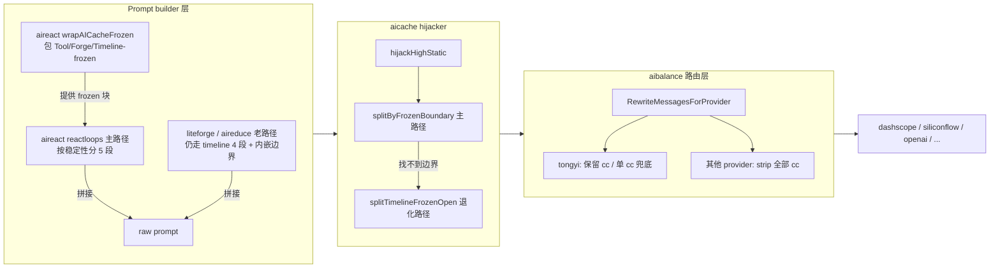

# aicache 缓存切割指南 (CACHE_BOUNDARY_GUIDE)

> 本指南说明 aicache 体系如何用 prompt 内嵌的边界标签 + role 拆分实现
> dashscope 显式缓存的双 cc 命中 (~70% prefix cache hit)。
> 配合 `TONGYI_CACHE_REPORT.md` §7.7 / §7.7.7 / §7.7.8 系列实测分析阅读。

---

## 1. 概念

### 1.1 四类标签

| 标签 | 形态 | 角色 | 谁负责写 |
| --- | --- | --- | --- |
| `<\|AI_CACHE_SYSTEM_high-static\|>` | 外层 (顶级) | 标记"此段属于 system prompt, 极少变" | prompt builder (例如 reactloops, aireduce) |
| `<\|PROMPT_SECTION_xxx\|>` | 外层 (顶级) | 标记非 system 段的归属 (`semi-dynamic` / `timeline` / `timeline-open` / `dynamic`) | prompt builder |
| `<\|AI_CACHE_FROZEN_semi-dynamic\|>` | **顶级 / 跨段** | 标记"此段已字节冻结, 适合作 prefix cache" (一级缓存边界) | aireact 主路径直接由 prompt builder 写; 老路径 (liteforge 等) 仍由 `aicommon.TimelineRenderableBlocks.RenderWithFrozenBoundary` 内嵌写 |
| `<\|AI_CACHE_SEMI_semi\|>` | **顶级 / 跨段** | 标记"此段中等稳定, 也适合作 prefix cache" (二级缓存边界, P1 双 cache 边界) | aireact 主路径由 `wrapAICacheSemi` 注入到 PROMPT_SECTION_semi-dynamic 外层 |

> 说明: `PROMPT_SECTION_timeline-open` 是 aireact "按稳定性分层" 路径下新增段名,
> 仅含 timeline 末桶 + Current Time + Workspace + (可选) midterm prefix; 与老
> `PROMPT_SECTION_timeline` 段名共存, 由 splitter / hijacker 同时识别为 "timeline 类"
> section, SectionHashCount 各自独立计数。

### 1.2 边界标签字面量

#### 1.2.1 一级 frozen 边界

```
<|AI_CACHE_FROZEN_semi-dynamic|>
... frozen 段内容 (字节稳定) ...
<|AI_CACHE_FROZEN_END_semi-dynamic|>
... 易变段 (timeline-open + dynamic) ...
```

- **tag name**: `AI_CACHE_FROZEN`
- **nonce**: `semi-dynamic` (语义: 稳定性介于 high-static 与完全 open 之间)
- 这对标签字面量字节恒定, 不含动态值

#### 1.2.2 二级 semi 边界 (P1 双 cache 边界)

```
<|AI_CACHE_FROZEN_semi-dynamic|> ... <|AI_CACHE_FROZEN_END_semi-dynamic|>
<|AI_CACHE_SEMI_semi|>
<|PROMPT_SECTION_semi-dynamic|>
... Skills + Schema + CacheToolCall (字节稳定, 跨 turn 不变) ...
<|PROMPT_SECTION_END_semi-dynamic|>
<|AI_CACHE_SEMI_END_semi|>
... timeline-open + dynamic (易变) ...
```

- **tag name**: `AI_CACHE_SEMI`
- **nonce**: `semi` (与 `semi-dynamic` 区分; tagName 不同, 即使 nonce 相同也不冲突)
- 双层嵌套设计: 内层 `PROMPT_SECTION_semi-dynamic` 让 splitter 仍能识别段归属;
  外层 `AI_CACHE_SEMI` 给 hijacker 一对字节恒定的二级边界
- 进入 user2 消息, hijacker 主动给它打 ephemeral cc (与 user1 frozen 段并列两个
  cache 锚点, 提升前缀缓存覆盖率)

### 1.3 与 `<|PROMPT_SECTION_semi-dynamic\|>` 的区别

虽然 nonce 都是 `semi-dynamic`, 但 **tag name 不同**, 所以 `aitag.SplitViaTAG`
会把它们识别为完全不同的两种 block, 互不干扰:

- `<|PROMPT_SECTION_semi-dynamic|>` 是顶级 4 段切片之一 (语义: "整段的稳定性是中等")
- `<|AI_CACHE_FROZEN_semi-dynamic|>` 是 user 区内嵌的 cache 边界 (语义: "此处之前是 frozen, 之后是 open")
- `<|AI_CACHE_SEMI_semi|>` 是 user 区内嵌的二级 cache 边界 (语义: "此处之前是 frozen, 中间是 semi-dynamic, 之后是 open")

---

## 2. 整体架构

### 2.1 prompt 流水线



#### 2.1.1 aireact 主路径的 5 段拼接顺序

aireact "按稳定性分层" 路径产出的 raw prompt 顺序是固定的 (P1 双 cache 边界):

```
SYSTEM     <|AI_CACHE_SYSTEM_high-static|>...<|AI_CACHE_SYSTEM_END_high-static|>
FROZEN     <|AI_CACHE_FROZEN_semi-dynamic|>
             # Tool Inventory (top N tools)
             # AI Blueprint Inventory (forge list, 可选)
             # Timeline Memory (Frozen Prefix)   reducer + 非末 interval
           <|AI_CACHE_FROZEN_END_semi-dynamic|>
SEMI       <|AI_CACHE_SEMI_semi|>
             <|PROMPT_SECTION_semi-dynamic|>
               <|SKILLS_CONTEXT_skills_context|>...<|SKILLS_CONTEXT_END_skills_context|>
               <|SCHEMA|>...
               # CACHE_TOOL_CALL (用占位符字面量 nonce "[current-nonce]" 渲染, 跨轮字节稳定)
               <|DIRECT_TOOL_ROUTING_[current-nonce]|>...<|DIRECT_TOOL_ROUTING_END_[current-nonce]|>
               <|CACHE_TOOL_CALL_[current-nonce]|>
                 <|TOOL_<name>_[current-nonce]|>...<|TOOL_<name>_END_[current-nonce]|>
                 ...footer 含 TOOL_PARAM_*_[current-nonce] 示例 + 占位符语义说明 + AITAG 规则...
               <|CACHE_TOOL_CALL_END_[current-nonce]|>
             <|PROMPT_SECTION_END_semi-dynamic|>
           <|AI_CACHE_SEMI_END_semi|>
OPEN       <|PROMPT_SECTION_timeline-open|>
             # Timeline Memory (Open Tail)        最末 interval + midterm prefix
             # Current Time
             # Workspace Context
           <|PROMPT_SECTION_END_timeline-open|>
DYNAMIC    <|PROMPT_SECTION_dynamic_<turnNonce>|>
             <|USER_QUERY_<turnNonce>|>...<|USER_QUERY_END_<turnNonce>|>
             AutoContext / UserHistory / ExtraCapabilities / SessionEvidence /
             ReactiveData / InjectedMemory
           <|PROMPT_SECTION_dynamic_END_<turnNonce>|>
```

设计意图:

- **FROZEN 块字节稳定**: Tool / Forge / Timeline-frozen 三类内容跨 turn 几乎不变,
  整体被 `<|AI_CACHE_FROZEN_semi-dynamic|>...<|AI_CACHE_FROZEN_END_semi-dynamic|>`
  包裹, 让 hijacker 用单次 IndexOf 就能精准切到 user1 的字节边界。
- **SEMI 块也字节稳定 (P1 升级)**: SkillsContext + Schema + CacheToolCall 三类内容
  跨 turn 同样字节稳定 (CacheToolCall 内的 nonce 一律使用占位符字面量
  "[current-nonce]", 与 turn nonce 解耦). 整体被
  `<|AI_CACHE_SEMI_semi|>...<|AI_CACHE_SEMI_END_semi|>` 包裹形成第二条 cache
  边界, hijacker 切到 user2 并打 ephemeral cc, 形成 4 段
- **占位符 + 双注册兜底 (P1 增强)**: 字面量选 "[current-nonce]" 是给 LLM 的语义
  提示 — LLM 看到方括号占位符会更容易理解为"应该替换为 prompt 上下文里的当前
  turn nonce"; 即使 LLM 不替换、直接照抄字面量, ActionMaker 端也通过
  `LoopAITagField.ExtraNonces` 双注册 (turn nonce + "[current-nonce]") 兜底
  解析, 任一种 LLM 行为都能正确捕获 TOOL_PARAM_xxx 的内容. 该 nonce 候选追加
  是字段级精准的, 不会扩散到 USER_QUERY 等其他 AITAG.
  消息结构 (system+cc, user1+cc, user2+cc, user3 无 cc).
- **SkillsContext 不进 FROZEN 块**: skill 的 0->1 加载 / 焦点切换会改写
  "Currently Loaded Skills" 上半段, 字节级不稳到 frozen 标准。但稳定到"中等"够用,
  归入 SEMI 块.
- **Schema 在 SEMI 段**: schema 跨 react loop 切换会变化, 把它和 SkillsContext
  归为同一中等稳定段, 不污染 FROZEN 字节边界。
- **CacheToolCall 在 SEMI 段 (P1 物理迁移)**: 历史上该块位于 dynamic/REFLECTION,
  内含 turn nonce 导致每轮变化无法缓存. 现迁到 SEMI 段并改用稳定 nonce 渲染,
  随 SEMI 段一起进入二级 cache 命中.
- **Timeline 末桶在 OPEN**: 最末 interval 桶仍在写入, midterm 检索结果也只在
  perception 触发时出现 — 全部归到 OPEN 段, hijacker 不缓存这段。

### 2.2 三层职责分工

| 层 | 输入 | 输出 | 责任 |
| --- | --- | --- | --- |
| **Prompt builder** (reactloops / aireduce / Timeline) | 业务数据 | raw prompt with `AI_CACHE_FROZEN` boundary | 决定哪段已字节冻结, 用边界标签声明 |
| **aicache hijacker** | raw prompt | `[system+cc, user1+cc, user2]` 3 段消息 | 识别边界切 3 段, 给 system+user1 自管打 ephemeral cc |
| **aibalance rewriter** | 3 段 (含 cc) 或客户端 messages | 上游可接受的最终 messages | 按 provider 分发: tongyi 保留 / 其他 strip |

---

## 3. 切割算法 (核心)

### 3.0 切割优先级 (P1 双 cache 边界)

```text
build4SegmentMessages   <- frozen + semi 双边界都齐 (主路径)
   |
   v   切不出 -> 退化
build3SegmentMessages   <- 仅 frozen 边界 (含 timeline 内部解析退化)
   |
   v   切不出 -> 退化
build2SegmentMessages   <- 兼容退化, 整段拼成单条 user
```

`hijackHighStatic` 调用顺序 = 4 -> 3 -> 2; 任一 builder 返回 nil 都会顺次降级。

### 3.1 hijacker `splitByFrozenBoundary` 伪代码

```text
function splitByFrozenBoundary(splitResult):
    # 1. 把所有非 high-static block.Raw 顺序拼接
    all = ""
    for blk in splitResult.GetOrderedBlocks():
        if blk is high-static:
            continue
        all += blk.Raw

    # 2. 在 all 中找一对完整边界标签
    startIdx = all.indexOf("<|AI_CACHE_FROZEN_semi-dynamic|>")
    if startIdx < 0:
        return None          # 没有 START, 退化

    rest = all[startIdx + len(START_TAG):]
    endRel = rest.indexOf("<|AI_CACHE_FROZEN_END_semi-dynamic|>")
    if endRel < 0:
        return None          # 只有 START 没 END, 退化

    endIdx = startIdx + len(START_TAG) + endRel + len(END_TAG)

    # 3. 切割
    user1 = trim(all[:endIdx])    # 含 START + frozen 内容 + END 标签自身
    user2 = trim(all[endIdx:])    # END 之后的所有内容

    if user1 == "" or user2 == "":
        return None

    return user1, user2
```

### 3.2 关键设计决策

| 决策 | 原因 |
| --- | --- |
| user1 包含 `<\|AI_CACHE_FROZEN_END_semi-dynamic\|>` 标签自身 | END 标签字面量恒定, 让 user1 拥有干净的字节边界, dashscope 才能把它当作稳定 prefix |
| 只找第一对完整边界, 不管嵌套 | 简单可预测, 避免歧义; 上游 builder 有责任不嵌套 |
| 找不到边界 -> 退化到 timeline 内部解析 | 老版本 caller 没插边界也能继续工作, 不破坏向后兼容 |
| 退化路径仍能切 3 段也接 fallback | 任何 caller 都能拿到 §7.7 的双 cc 收益 |

### 3.3 hijacker `splitBySemiBoundary` 伪代码 (P1 双 cache 边界)

```text
function splitBySemiBoundary(splitResult):
    # 1. 把所有非 high-static block.Raw 顺序拼接
    all = concat(non_high_static_blocks)

    # 2. 找 frozen START 与 frozen END
    frozenStart = all.indexOf("<|AI_CACHE_FROZEN_semi-dynamic|>")
    if frozenStart < 0: return None
    frozenEndRel = all[frozenStart+len(START):].indexOf("<|AI_CACHE_FROZEN_END_semi-dynamic|>")
    if frozenEndRel < 0: return None
    frozenEnd = frozenStart + len(START) + frozenEndRel + len(END)

    # 3. 在 frozenEnd 之后找 semi START 与 semi END
    semiStartRel = all[frozenEnd:].indexOf("<|AI_CACHE_SEMI_semi|>")
    if semiStartRel < 0: return None         # 退化到 3 段
    semiStart = frozenEnd + semiStartRel
    semiEndRel = all[semiStart+len(SEMI_START):].indexOf("<|AI_CACHE_SEMI_END_semi|>")
    if semiEndRel < 0: return None
    semiEnd = semiStart + len(SEMI_START) + semiEndRel + len(SEMI_END)

    # 4. 三段切割
    user1 = trim(all[:frozenEnd])           # 含 frozen START~END
    user2 = trim(all[frozenEnd:semiEnd])    # 含 semi START~END
    user3 = trim(all[semiEnd:])             # semi END 之后
    if any(u == "" for u in (user1, user2, user3)): return None

    return user1, user2, user3
```

`build4SegmentMessages` 拿到三段后输出 `[system+cc, user1+cc, user2+cc, user3]`,
三个 cache_control 都打 ephemeral; 任一前置条件失败都返回 nil 让 hijacker 退化到
`build3SegmentMessages`。

---

## 4. 4 种典型场景

### 4.1 场景 A — aireact 主路径 (按稳定性分 5 段)

**输入 prompt** (aireact reactloops 产出):

```
<|AI_CACHE_SYSTEM_high-static|>
A-system
<|AI_CACHE_SYSTEM_END_high-static|>

<|AI_CACHE_FROZEN_semi-dynamic|>
# Tool Inventory ...
# AI Blueprint Inventory ...
# Timeline Memory (Frozen Prefix)
<|TIMELINE_r1t1|>Timeline-Reducer<|TIMELINE_END_r1t1|>
<|TIMELINE_b3t100|>Timeline-ITEM1<|TIMELINE_END_b3t100|>
<|TIMELINE_b3t200|>Timeline-ITEM2<|TIMELINE_END_b3t200|>
<|AI_CACHE_FROZEN_END_semi-dynamic|>

<|PROMPT_SECTION_semi-dynamic|>
<|SKILLS_CONTEXT_skills_context|>...<|SKILLS_CONTEXT_END_skills_context|>
<|SCHEMA|>...
<|PROMPT_SECTION_END_semi-dynamic|>

<|PROMPT_SECTION_timeline-open|>
# Timeline Memory (Open Tail)
<|TIMELINE_b3t300|>Timeline-ITEM3-Open<|TIMELINE_END_b3t300|>
# Current Time
2026-05-04 11:00:00
# Workspace Context
OS/Arch: darwin/arm64
<|PROMPT_SECTION_END_timeline-open|>

<|PROMPT_SECTION_dynamic_q|>
<|USER_QUERY_q|>DEF<|USER_QUERY_END_q|>
<|PROMPT_SECTION_dynamic_END_q|>
```

**hijacker 切分结果** (3 段 messages):

| 角色 | 内容 (示意) | cache_control | 缓存语义 |
| --- | --- | --- | --- |
| system | `<|AI_CACHE_SYSTEM_high-static|>A-system<|AI_CACHE_SYSTEM_END_high-static|>` | `{"type":"ephemeral"}` | 短前缀缓存 (system 段) |
| user1 | `<|AI_CACHE_FROZEN_semi-dynamic|>`<br/>`# Tool Inventory ...`<br/>`# AI Blueprint Inventory ...`<br/>`# Timeline Memory (Frozen Prefix)`<br/>`<|TIMELINE_r1t1|>...<|TIMELINE_b3t100|>...<|TIMELINE_b3t200|>...`<br/>`<|AI_CACHE_FROZEN_END_semi-dynamic|>` | `{"type":"ephemeral"}` | 长前缀缓存 (system + frozen 段) |
| user2 | `<|PROMPT_SECTION_semi-dynamic|>...SkillsContext + Schema...<|PROMPT_SECTION_END_semi-dynamic|>`<br/>`<|PROMPT_SECTION_timeline-open|>...Timeline 末桶 + Time + Workspace...<|PROMPT_SECTION_END_timeline-open|>`<br/>`<|PROMPT_SECTION_dynamic_q|>...<|PROMPT_SECTION_dynamic_END_q|>` | (无) | 易变段, 不缓存 |

预期命中率: 双 cc ~70% (E14 实测), 单 cc ~32%。

**与老路径对比**: aireact 主路径把 frozen 块从原来的"嵌入 timeline 段内"提到顶级,
hijacker 不再需要解析 timeline 内嵌 nonce 即可切割; SkillsContext 与 Schema 被
迁出 frozen 块, 它们的 turn 级变化不会污染 user1 字节边界。

### 4.1.1 场景 A' — 老路径 (liteforge / aireduce 4 段)

老 caller 仍用 4 段拼接, frozen 边界内嵌在 timeline 段中:

```
<|AI_CACHE_SYSTEM_high-static|>...<|AI_CACHE_SYSTEM_END_high-static|>
<|PROMPT_SECTION_semi-dynamic|>B-semi-static<|PROMPT_SECTION_END_semi-dynamic|>
<|PROMPT_SECTION_timeline|>
<|AI_CACHE_FROZEN_semi-dynamic|>
<|TIMELINE_r1t1|>...<|TIMELINE_b3t200|>...
<|AI_CACHE_FROZEN_END_semi-dynamic|>
<|TIMELINE_b3t300|>Timeline-ITEM3-Open<|TIMELINE_END_b3t300|>
<|PROMPT_SECTION_END_timeline|>
<|PROMPT_SECTION_dynamic_q|>DEF<|PROMPT_SECTION_dynamic_END_q|>
```

hijacker 切割结果与场景 A 等价 (user1 仍以 frozen END 标签结束); 区别仅在 user1
里 Tool / Forge 被夹带在 PROMPT_SECTION_semi-dynamic 内, frozen 段只含 timeline
内容。两条路径在缓存友好性上一致, 但主路径把更多 Tool/Forge 字节稳定内容也纳入
frozen 块, 长 prefix 缓存收益略大。

### 4.2 场景 B — 边界存在但 frozen 段在 PROMPT_SECTION_semi-dynamic 内 (无 timeline)

**输入**:

```
<|AI_CACHE_SYSTEM_high-static|>...<|AI_CACHE_SYSTEM_END_high-static|>

<|PROMPT_SECTION_semi-dynamic|>
intro-text
<|AI_CACHE_FROZEN_semi-dynamic|>
frozen-content
<|AI_CACHE_FROZEN_END_semi-dynamic|>
tail-text
<|PROMPT_SECTION_END_semi-dynamic|>
```

**hijacker 切分**: 仍 3 段, frozen 在 user1 (含 END), tail-text 在 user2。
**说明**: 边界标签**不依赖**于 timeline section, 任何 caller 都可以在任何位置插入它来声明缓存边界。

### 4.3 场景 C — 没有边界标签 (老版本 caller)

**输入**:

```
<|AI_CACHE_SYSTEM_high-static|>...
<|PROMPT_SECTION_timeline|>
<|TIMELINE_r1t1|>...<|TIMELINE_b3t100|>...<|TIMELINE_b3t200|>...<|TIMELINE_b3t300|>...
<|PROMPT_SECTION_END_timeline|>
```

**hijacker 切分**: 退化到 `splitTimelineFrozenOpen`, 解析 timeline 内嵌 TIMELINE
子标签按 `last-b-is-open` 约定切, 仍能拿到 3 段。
**说明**: 退化路径保证向后兼容, 但精度依赖 timeline 内部 nonce 模式 (`b{N}t{...}` / `r{key}t{...}`)。

### 4.4 场景 D — 残缺/异常边界

| 场景 | hijacker 行为 |
| --- | --- |
| 只有 START 没有 END | 退化到 timeline 内部解析 |
| 只有 END 没有 START | 退化 (找不到 START) |
| START 在 END 之后 | 退化 (从 START 后找不到 END) |
| 边界完整但 frozen 段 trim 后为空 | 退化 |
| 边界完整但 open 段 trim 后为空 | 退化 |

### 4.5 场景 E — frozen + semi 双边界 4 段切分 (P1 主路径)

**输入 prompt** (aireact reactloops 主路径产出):

```
<|AI_CACHE_SYSTEM_high-static|>...<|AI_CACHE_SYSTEM_END_high-static|>

<|AI_CACHE_FROZEN_semi-dynamic|>
# Tool / Forge / Timeline-Frozen
<|AI_CACHE_FROZEN_END_semi-dynamic|>

<|AI_CACHE_SEMI_semi|>
<|PROMPT_SECTION_semi-dynamic|>
... Skills + Schema + CacheToolCall (用占位符 nonce "[current-nonce]" 渲染) ...
<|PROMPT_SECTION_END_semi-dynamic|>
<|AI_CACHE_SEMI_END_semi|>

<|PROMPT_SECTION_timeline-open|>...<|PROMPT_SECTION_END_timeline-open|>
<|PROMPT_SECTION_dynamic_<turnNonce>|>...<|PROMPT_SECTION_dynamic_END_<turnNonce>|>
```

**hijacker 切分结果** (4 段 messages):

| 角色 | 内容 (示意) | cache_control | 缓存语义 |
| --- | --- | --- | --- |
| system | `<\|AI_CACHE_SYSTEM_high-static\|>...<\|AI_CACHE_SYSTEM_END_high-static\|>` | `{"type":"ephemeral"}` | 短前缀缓存 (system 段) |
| user1 | `<\|AI_CACHE_FROZEN_semi-dynamic\|>...<\|AI_CACHE_FROZEN_END_semi-dynamic\|>` | `{"type":"ephemeral"}` | 长前缀缓存 (system + frozen 段) |
| user2 | `<\|AI_CACHE_SEMI_semi\|>...<\|AI_CACHE_SEMI_END_semi\|>` (Skills + Schema + CacheToolCall) | `{"type":"ephemeral"}` | 长前缀缓存 (system + frozen + semi 段) |
| user3 | timeline-open + dynamic | (无) | 易变段, 不缓存 |

**aibalance 路由**:
- tongyi 显式缓存 model: 4 段都 pass-through, 三个 cc 全部到达 dashscope
- 非 tongyi: 三个 cc 全部 strip, 文本完整保留

**对照场景 A** (P0 单 frozen 边界): 仅 user1 一个 cache 锚点; P1 双边界给到上游
两个候选 cache 锚点, 即使 dashscope 实际只命中前 N 个, 命中容量与稳定性都更高。

**退化路径**: 仅缺 semi START/END 任一条件 (例如 SEMI 内 trim 后为空) -> 退化
到 `build3SegmentMessages` 仍能拿到 frozen 段 cc 收益。

---

## 5. provider-aware cc strip (aibalance 兜底)

### 5.1 行为矩阵

| provider type | 客户端自带 cc | hijacker 自管 cc | aibalance 行为 | 上游收到 |
| --- | --- | --- | --- | --- |
| tongyi (white-list model) | 是 | (任一) | pass-through | 客户端 / hijacker 的 cc 原样保留 |
| tongyi (white-list model) | 否 | 否 | 给最末 system 注入 baseline 单 cc | system 带 cc |
| tongyi (非 white-list model) | (任一) | (任一) | pass-through | 客户端 / hijacker cc 原样保留 |
| siliconflow / openai / anthropic / 等其他 | (任一) | (任一) | **strip 全部 cc** | 完全无 cc |

### 5.2 设计逻辑

> hijacker 一律打 cc, aibalance 兜底 strip。

这样的好处:

- **hijacker 简化**: 不需要知道下游是不是 tongyi, 一律打 cc 即可
- **跨 provider 安全**: aibalance 在路由到非 tongyi provider 时强制 strip,
  避免 dashscope 风格 cc 透传到 OpenAI / Anthropic 引发 400 / 误计费
- **客户端 SDK 友好**: 外部 SDK 自带 cc 也会被 strip, 不会泄漏到不识别的服务端

### 5.3 关键 API

```go
// 主入口 (aibalance/server.go 调用)
func RewriteMessagesForProvider(messages, providerType, modelName) []ChatDetail

// 分发到的两个子函数
func RewriteMessagesForExplicitCache(messages, providerType, modelName) []ChatDetail  // tongyi
func StripCacheControlFromMessages(messages) []ChatDetail                              // 其他

// 判断函数
func IsCacheControlAwareProvider(providerType string) bool   // 当前仅 tongyi
func IsTongyiExplicitCacheModel(providerType, model string) bool  // tongyi + white-list model
```

---

## 6. 维护清单

### 6.1 改动哪一层就一定要同步检查的清单

| 改动 | 必须同步更新的位置 |
| --- | --- |
| 改 frozen 边界 tag name / nonce | `aicommon.TimelineFrozenBoundaryTagName` + `aicache.frozenBoundaryTagName` (两处常量必须字节一致) + `aireact.wrapAICacheFrozen` 字面量 |
| 改 semi 边界 tag name / nonce (P1) | `aicommon.SemiDynamicCacheBoundaryTagName` + `aicache.semiBoundaryTagName` (两处常量必须字节一致) + `aireact.wrapAICacheSemi` 字面量 |
| 改 CACHE_TOOL_CALL 稳定 nonce | `aicommon.RecentToolCacheStableNonce` + `aitool/buildinaitools.RecentToolCacheStableNonce` (两处必须字节一致) + `reactloops.syncRecentToolParamAITagFields` LoopAITagField.Nonce 注册 |
| 加新 cc-aware provider | `aibalance.IsCacheControlAwareProvider` (注意可能要调整 strip 行为) |
| 加新 dashscope 显式缓存 model | `aibalance.dashscopeExplicitCacheModels` map |
| 加新切割锚点策略 | `aicache.build3SegmentMessages` 主路径分支 + 测试 |
| Timeline 渲染加新 frozen 类型 block | `TimelineRenderableBlocks.RenderWithFrozenBoundary` / `RenderFrozenOnly` / `RenderOpenOnly` 的 frozen / open 判定逻辑 |
| 改 aireact 段顺序 / 段内容分配 | `aireact/prompt_loop_materials.go` 的 `buildTaggedPromptSections` + 三个 observation builder + `prompts/loop/*.txt` 模板 |
| 改 SkillsContext 结构 | `aicommon.aiskillloader.SkillsContextManager.renderWithTag` 必须保持 "Currently Loaded + Available" 双段结构, registry listing 字节稳定 |

### 6.2 跨包字面量同步表

| 字面量 | 包 / 文件 |
| --- | --- |
| `AI_CACHE_FROZEN` | `aicommon.TimelineFrozenBoundaryTagName` + `aicache.frozenBoundaryTagName` + `aireact.wrapAICacheFrozen` 引用 |
| `semi-dynamic` (作为 frozen boundary nonce) | `aicommon.TimelineFrozenBoundaryNonce` + `aicache.frozenBoundaryNonce` |
| `AI_CACHE_SEMI` (P1 二级 cache 边界 tagName) | `aicommon.SemiDynamicCacheBoundaryTagName` + `aicache.semiBoundaryTagName` + `aireact.wrapAICacheSemi` 引用 |
| `semi` (作为 semi boundary nonce) | `aicommon.SemiDynamicCacheBoundaryNonce` + `aicache.semiBoundaryNonce` |
| `AI_CACHE_SYSTEM` | `aicache.tagAICacheSystem` + `aicache.aicacheSystemTagName` |
| `high-static` | `aicache.SectionHighStatic` + `aicache.aicacheSystemNonce` |
| `PROMPT_SECTION` | `aicache.tagPromptSection` |
| `timeline` (老段名) | `aicache.SectionTimeline` |
| `timeline-open` (aireact 主路径段名) | `aicache.SectionTimelineOpen` + `aireact.promptSectionTimelineOpen` |
| `TIMELINE` | `aicache.timelineInnerTagName` + `aicommon.TimelineDumpDefaultAITagName` |
| `[current-nonce]` (CACHE_TOOL_CALL 占位符字面量 nonce) | `aicommon.RecentToolCacheStableNonce` + `aitool/buildinaitools.RecentToolCacheStableNonce` |

### 6.3 测试覆盖

| 测试包 | 测试名前缀 | 覆盖范围 |
| --- | --- | --- |
| `aicommon` | `TestRenderWithFrozenBoundary_*` | RenderWithFrozenBoundary 5 种边界场景 |
| `aicommon` | `TestTimelineDump_*FrozenBoundary*` | Timeline.Dump 端到端边界注入 |
| `aicommon` | `TestAIChatToAICallbackType_*` | user UsageCallback 透传 (P1-D1) |
| `aicommon` | `TestWithInheritTieredAICallback_*` | 子 Config 继承父 userUsageCallback (P1-D2) |
| `aicache` | `TestHijack_FrozenBoundary_*` | hijacker 边界切割 6 种场景 (用户案例 + 退化 + 字节稳定) |
| `aicache` | `TestHijack_SemiBoundary_*` | hijacker 双 cache 边界 4 段切分 (P1) |
| `aicache` | `TestHijack_3SegSplit_*` | 退化路径 (timeline 内部解析) 7 种场景 |
| `aicache` | `TestHijack_FixtureFourSection` | 真实生产 fixture 兼容 (000005 / 000010 / 000060) |
| `aicache` | `TestSplit_*` | splitter 4 段切片 + hash 稳定性 |
| `aiforge` | `TestLiteForgePrompt_*` | LiteForge 模板 4 段切片 + 跨调用 high-static 稳定 |
| `aireact` | `TestSplit_VerificationPrompt_*` | verification.txt 4 段包装回归 (P0-A1) |
| `aireact` | `TestSplit_IntervalReviewPrompt_*` | interval-review.txt 4 段包装回归 (P0-A3) |
| `aireact` | `TestSplit_AIReviewToolCallPrompt_*` | ai-review-tool-call.txt 4 段包装回归 (P0-A4) |
| `aid` | `TestSplit_TaskSummaryPrompt_*` | task-summary.txt 4 段包装回归 (P0-A2) |
| `aicommon` | `TestSplit_PlanReviewPrompt_*` | ai-review-plan.txt 4 段包装回归 (P0-A4) |
| `aicommon` | `TestSplit_TaskReviewPrompt_*` | ai-review-task.txt 4 段包装回归 (P0-A4) |
| `aibalance` | `TestRewriteForProvider_*` | provider-aware 分发 |
| `aibalance` | `TestStripCacheControl_*` | strip 行为 + 零副作用 |
| `aibalance` | `TestIsCacheControlAwareProvider` | provider 白名单 |

---

## 6.4 新增 prompt 模板 checklist (P0-A 经验沉淀)

> 本项目曾因 6 个大模板 (verification / task-summary / interval-review /
> ai-review-{plan,task,tool-call}) 没有用 PROMPT_SECTION 包装, 在 cachebench
> 中产出 1.5 MB raw/noise 字节, 把上游真实命中率压到 1.10%。所有新增模板
> 必须按下表对齐分段, 否则 splitter 把整段判为 raw, 缓存全部失效。

### 6.4.1 必做项

- [ ] **不允许整段散文**: 模板根节点必须由 `<|AI_CACHE_SYSTEM_high-static|>` 或
      `<|PROMPT_SECTION_xxx|>` 之一包裹, 没有 wrapper 的内容会被识别为 raw/noise
- [ ] **不允许自定义外层 tag**: `<|BACKGROUND_xxx|>` / `<|INSTRUCTIONS_xxx|>`
      等私有 tagName 不会被 splitter 识别为 section, 必须放在 4 段 wrapper 内
- [ ] **段内禁止跨段污染**: high-static 段内不允许出现任何模板变量 (`{{ . }}`),
      schema/instructions/系统时间等都属于 semi-dynamic 或 dynamic
- [ ] **dynamic 段必须带 nonce**: `<|PROMPT_SECTION_dynamic_{{.Nonce}}|>` 形式,
      避免 splitter 把 dynamic 当作可缓存
- [ ] **timeline 必须拆 frozen + open**: 用 `TimelineDumpFrozenOpen` 接口拿到
      frozen / open 字符串, 分别送进 `<|AI_CACHE_FROZEN_semi-dynamic|>` 与
      `<|PROMPT_SECTION_timeline-open|>`, 不要再用单一 `<|PROMPT_SECTION_timeline|>`
- [ ] **时间戳必须分钟粒度**: `time.Now().Format("2006-01-02 15:04")`, 严禁用
      `time.Now().String()` (会带纳秒, 必然击穿 high-static / semi-dynamic 缓存)
- [ ] **加 splitter 单测**: 至少 1 条 `TestSplit_<TemplateName>_*`, 断言
      - `aicache.Split(rendered)` 输出多段 chunk
      - 不出现 `aicache.SectionRaw`
      - 跨调用 (不同 nonce / 不同 dynamic 输入) 下 high-static 段 hash 稳定

### 6.4.2 4 段段落语义对照表 (写新模板时按此分配内容)

| 段名 | 语义 | 典型内容 |
| --- | --- | --- |
| `high-static` | byte-stable 跨调用 (会话级) | 角色设定 / TRAITS / Execution Protocol / Output Schema 通用文案 |
| `semi-dynamic` | 跨同一上下文稳定, 跨上下文变化 | per-forge SCHEMA / 加载的 SkillsContext / Instruction / 持久记忆 / 当前时间 (分钟级) / OS / WorkingDir |
| `timeline` (frozen) | timeline 末桶之前的字节冻结块 | 由 `RenderWithFrozenBoundary` 自动产出 |
| `timeline-open` | timeline 末桶 + 历史 PREV_USER_INPUT + SESSION_ARTIFACTS 列表 | 渐增数据, 不进 frozen |
| `dynamic` | 单次调用变化 | USER_QUERY / 当前 task / iteration index / TodoSnapshot / payload / nonce |

### 6.4.3 LiteForge 调用方约定 (P0-B4)

写 LiteForge 调用时优先使用对应 ConfigOption, 不要把所有内容都塞 `WithLiteForge_Prompt`:

- `WithLiteForge_StaticInstruction(s)` -> 进 semi-dynamic 段 (静态指令、CRITICAL RULES)
- `WithLiteForge_DynamicInstruction(s)` (`WithLiteForge_Prompt` 别名) -> 进 dynamic 段 (用户输入、本次特有上下文)

---

## 7. 计费/缓存收益参考

> 详见 `TONGYI_CACHE_REPORT.md` 各节实测数据。

| 策略 | 命中率 | 单次净 token 成本 | 实测来源 |
| --- | --- | --- | --- |
| 无 cc | 0% | 100% | E1 / E10 baseline |
| 单 cc (system) | ~32% | 约 78% | E14 r1 |
| 双 cc (system + user1 frozen prefix) | ~70% | 约 65% | E14 r3 |
| 滥用 cc (任意位置打) | 命中浮动大 | 可能 +25% (cache_creation 计费) | E11 / E12 反例 |

frozen boundary 是双 cc 命中率从 32% 提升到 70% 的关键: 它让 hijacker 拿到精准
切割锚点, 不再依赖 timeline 内部 nonce 解析, 因此可以在更宽泛的 prompt 形态
(不限于 timeline) 也能切出"system + frozen + open" 三段。
