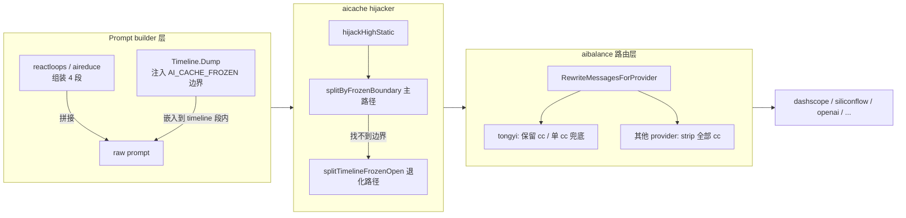

# aicache 缓存切割指南 (CACHE_BOUNDARY_GUIDE)

> 本指南说明 aicache 体系如何用 prompt 内嵌的边界标签 + role 拆分实现
> dashscope 显式缓存的双 cc 命中 (~70% prefix cache hit)。
> 配合 `TONGYI_CACHE_REPORT.md` §7.7 / §7.7.7 / §7.7.8 系列实测分析阅读。

---

## 1. 概念

### 1.1 三类标签

| 标签 | 形态 | 角色 | 谁负责写 |
| --- | --- | --- | --- |
| `<\|AI_CACHE_SYSTEM_high-static\|>` | 外层 (顶级) | 标记"此段属于 system prompt, 极少变" | prompt builder (例如 reactloops, aireduce) |
| `<\|PROMPT_SECTION_xxx\|>` | 外层 (顶级) | 标记 4 段 (high-static / semi-dynamic / timeline / dynamic) 的归属 | prompt builder |
| `<\|AI_CACHE_FROZEN_semi-dynamic\|>` | **内嵌 / 跨段** | 在 user 区任意位置标记"此段已字节冻结, 适合作 prefix cache" | `aicommon.TimelineRenderableBlocks.RenderWithFrozenBoundary` 等 |

### 1.2 边界标签字面量

```
<|AI_CACHE_FROZEN_semi-dynamic|>
... frozen 段内容 (字节稳定) ...
<|AI_CACHE_FROZEN_END_semi-dynamic|>
... open 段内容 (易变) ...
```

- **tag name**: `AI_CACHE_FROZEN`
- **nonce**: `semi-dynamic` (语义: 稳定性介于 high-static 与完全 open 之间)
- 这对标签字面量字节恒定, 不含动态值

### 1.3 与 `<|PROMPT_SECTION_semi-dynamic\|>` 的区别

虽然 nonce 都是 `semi-dynamic`, 但 **tag name 不同**, 所以 `aitag.SplitViaTAG`
会把它们识别为完全不同的两种 block, 互不干扰:

- `<|PROMPT_SECTION_semi-dynamic|>` 是顶级 4 段切片之一 (语义: "整段的稳定性是中等")
- `<|AI_CACHE_FROZEN_semi-dynamic|>` 是 user 区内嵌的 cache 边界 (语义: "此处之前是 frozen, 之后是 open")

---

## 2. 整体架构

### 2.1 prompt 流水线



### 2.2 三层职责分工

| 层 | 输入 | 输出 | 责任 |
| --- | --- | --- | --- |
| **Prompt builder** (reactloops / aireduce / Timeline) | 业务数据 | raw prompt with `AI_CACHE_FROZEN` boundary | 决定哪段已字节冻结, 用边界标签声明 |
| **aicache hijacker** | raw prompt | `[system+cc, user1+cc, user2]` 3 段消息 | 识别边界切 3 段, 给 system+user1 自管打 ephemeral cc |
| **aibalance rewriter** | 3 段 (含 cc) 或客户端 messages | 上游可接受的最终 messages | 按 provider 分发: tongyi 保留 / 其他 strip |

---

## 3. 切割算法 (核心)

### 3.1 hijacker `splitByFrozenBoundary` 伪代码

```text
function splitByFrozenBoundary(splitResult):
    # 1. 把所有非 high-static block.Raw 顺序拼接
    all = ""
    for blk in splitResult.GetOrderedBlocks():
        if blk is high-static:
            continue
        all += blk.Raw

    # 2. 在 all 中找一对完整边界标签
    startIdx = all.indexOf("<|AI_CACHE_FROZEN_semi-dynamic|>")
    if startIdx < 0:
        return None          # 没有 START, 退化

    rest = all[startIdx + len(START_TAG):]
    endRel = rest.indexOf("<|AI_CACHE_FROZEN_END_semi-dynamic|>")
    if endRel < 0:
        return None          # 只有 START 没 END, 退化

    endIdx = startIdx + len(START_TAG) + endRel + len(END_TAG)

    # 3. 切割
    user1 = trim(all[:endIdx])    # 含 START + frozen 内容 + END 标签自身
    user2 = trim(all[endIdx:])    # END 之后的所有内容

    if user1 == "" or user2 == "":
        return None

    return user1, user2
```

### 3.2 关键设计决策

| 决策 | 原因 |
| --- | --- |
| user1 包含 `<\|AI_CACHE_FROZEN_END_semi-dynamic\|>` 标签自身 | END 标签字面量恒定, 让 user1 拥有干净的字节边界, dashscope 才能把它当作稳定 prefix |
| 只找第一对完整边界, 不管嵌套 | 简单可预测, 避免歧义; 上游 builder 有责任不嵌套 |
| 找不到边界 -> 退化到 timeline 内部解析 | 老版本 caller 没插边界也能继续工作, 不破坏向后兼容 |
| 退化路径仍能切 3 段也接 fallback | 任何 caller 都能拿到 §7.7 的双 cc 收益 |

---

## 4. 4 种典型场景

### 4.1 场景 A — 用户给的标准例子 (含完整 4 类 block)

**输入 prompt**:

```
<|AI_CACHE_SYSTEM_high-static|>
A-system
<|AI_CACHE_SYSTEM_END_high-static|>

<|PROMPT_SECTION_semi-dynamic|>
B-semi-static
<|PROMPT_SECTION_END_semi-dynamic|>

<|PROMPT_SECTION_timeline|>
<|AI_CACHE_FROZEN_semi-dynamic|>
<|TIMELINE_r1t1|>Timeline-Reducer<|TIMELINE_END_r1t1|>
<|TIMELINE_b3t100|>Timeline-ITEM1<|TIMELINE_END_b3t100|>
<|TIMELINE_b3t200|>Timeline-ITEM2<|TIMELINE_END_b3t200|>
<|AI_CACHE_FROZEN_END_semi-dynamic|>
<|TIMELINE_b3t300|>Timeline-ITEM3-Open<|TIMELINE_END_b3t300|>
<|PROMPT_SECTION_END_timeline|>

<|PROMPT_SECTION_dynamic_q|>
DEF
<|PROMPT_SECTION_dynamic_END_q|>
```

**hijacker 切分结果** (3 段 messages):

| 角色 | 内容 (示意) | cache_control | 缓存语义 |
| --- | --- | --- | --- |
| system | `<|AI_CACHE_SYSTEM_high-static|>A-system<|AI_CACHE_SYSTEM_END_high-static|>` | `{"type":"ephemeral"}` | 短前缀缓存 (system 段) |
| user1 | `<|PROMPT_SECTION_semi-dynamic|>B-semi-static...<|PROMPT_SECTION_END_semi-dynamic|>`<br/>`<|PROMPT_SECTION_timeline|>`<br/>`<|AI_CACHE_FROZEN_semi-dynamic|>`<br/>`<|TIMELINE_r1t1|>...<|TIMELINE_b3t100|>...<|TIMELINE_b3t200|>...`<br/>`<|AI_CACHE_FROZEN_END_semi-dynamic|>` | `{"type":"ephemeral"}` | 长前缀缓存 (system + frozen 段) |
| user2 | `<|TIMELINE_b3t300|>Timeline-ITEM3-Open<|TIMELINE_END_b3t300|>`<br/>`<|PROMPT_SECTION_END_timeline|>`<br/>`<|PROMPT_SECTION_dynamic_q|>DEF<|PROMPT_SECTION_dynamic_END_q|>` | (无) | 易变段, 不缓存 |

预期命中率: 双 cc ~70% (E14 实测), 单 cc ~32%。

### 4.2 场景 B — 边界存在但 frozen 段在 PROMPT_SECTION_semi-dynamic 内 (无 timeline)

**输入**:

```
<|AI_CACHE_SYSTEM_high-static|>...<|AI_CACHE_SYSTEM_END_high-static|>

<|PROMPT_SECTION_semi-dynamic|>
intro-text
<|AI_CACHE_FROZEN_semi-dynamic|>
frozen-content
<|AI_CACHE_FROZEN_END_semi-dynamic|>
tail-text
<|PROMPT_SECTION_END_semi-dynamic|>
```

**hijacker 切分**: 仍 3 段, frozen 在 user1 (含 END), tail-text 在 user2。
**说明**: 边界标签**不依赖**于 timeline section, 任何 caller 都可以在任何位置插入它来声明缓存边界。

### 4.3 场景 C — 没有边界标签 (老版本 caller)

**输入**:

```
<|AI_CACHE_SYSTEM_high-static|>...
<|PROMPT_SECTION_timeline|>
<|TIMELINE_r1t1|>...<|TIMELINE_b3t100|>...<|TIMELINE_b3t200|>...<|TIMELINE_b3t300|>...
<|PROMPT_SECTION_END_timeline|>
```

**hijacker 切分**: 退化到 `splitTimelineFrozenOpen`, 解析 timeline 内嵌 TIMELINE
子标签按 `last-b-is-open` 约定切, 仍能拿到 3 段。
**说明**: 退化路径保证向后兼容, 但精度依赖 timeline 内部 nonce 模式 (`b{N}t{...}` / `r{key}t{...}`)。

### 4.4 场景 D — 残缺/异常边界

| 场景 | hijacker 行为 |
| --- | --- |
| 只有 START 没有 END | 退化到 timeline 内部解析 |
| 只有 END 没有 START | 退化 (找不到 START) |
| START 在 END 之后 | 退化 (从 START 后找不到 END) |
| 边界完整但 frozen 段 trim 后为空 | 退化 |
| 边界完整但 open 段 trim 后为空 | 退化 |

---

## 5. provider-aware cc strip (aibalance 兜底)

### 5.1 行为矩阵

| provider type | 客户端自带 cc | hijacker 自管 cc | aibalance 行为 | 上游收到 |
| --- | --- | --- | --- | --- |
| tongyi (white-list model) | 是 | (任一) | pass-through | 客户端 / hijacker 的 cc 原样保留 |
| tongyi (white-list model) | 否 | 否 | 给最末 system 注入 baseline 单 cc | system 带 cc |
| tongyi (非 white-list model) | (任一) | (任一) | pass-through | 客户端 / hijacker cc 原样保留 |
| siliconflow / openai / anthropic / 等其他 | (任一) | (任一) | **strip 全部 cc** | 完全无 cc |

### 5.2 设计逻辑

> hijacker 一律打 cc, aibalance 兜底 strip。

这样的好处:

- **hijacker 简化**: 不需要知道下游是不是 tongyi, 一律打 cc 即可
- **跨 provider 安全**: aibalance 在路由到非 tongyi provider 时强制 strip,
  避免 dashscope 风格 cc 透传到 OpenAI / Anthropic 引发 400 / 误计费
- **客户端 SDK 友好**: 外部 SDK 自带 cc 也会被 strip, 不会泄漏到不识别的服务端

### 5.3 关键 API

```go
// 主入口 (aibalance/server.go 调用)
func RewriteMessagesForProvider(messages, providerType, modelName) []ChatDetail

// 分发到的两个子函数
func RewriteMessagesForExplicitCache(messages, providerType, modelName) []ChatDetail  // tongyi
func StripCacheControlFromMessages(messages) []ChatDetail                              // 其他

// 判断函数
func IsCacheControlAwareProvider(providerType string) bool   // 当前仅 tongyi
func IsTongyiExplicitCacheModel(providerType, model string) bool  // tongyi + white-list model
```

---

## 6. 维护清单

### 6.1 改动哪一层就一定要同步检查的清单

| 改动 | 必须同步更新的位置 |
| --- | --- |
| 改边界 tag name / nonce | `aicommon.TimelineFrozenBoundaryTagName` + `aicache.frozenBoundaryTagName` (两处常量必须字节一致) |
| 加新 cc-aware provider | `aibalance.IsCacheControlAwareProvider` (注意可能要调整 strip 行为) |
| 加新 dashscope 显式缓存 model | `aibalance.dashscopeExplicitCacheModels` map |
| 加新切割锚点策略 | `aicache.build3SegmentMessages` 主路径分支 + 测试 |
| Timeline 渲染加新 frozen 类型 block | `TimelineRenderableBlocks.RenderWithFrozenBoundary` 的 frozen / open 判定逻辑 |

### 6.2 跨包字面量同步表

| 字面量 | 包 / 文件 |
| --- | --- |
| `AI_CACHE_FROZEN` | `aicommon.TimelineFrozenBoundaryTagName` + `aicache.frozenBoundaryTagName` |
| `semi-dynamic` (作为 frozen boundary nonce) | `aicommon.TimelineFrozenBoundaryNonce` + `aicache.frozenBoundaryNonce` |
| `AI_CACHE_SYSTEM` | `aicache.tagAICacheSystem` + `aicache.aicacheSystemTagName` |
| `high-static` | `aicache.SectionHighStatic` + `aicache.aicacheSystemNonce` |
| `PROMPT_SECTION` | `aicache.tagPromptSection` |
| `TIMELINE` | `aicache.timelineInnerTagName` + `aicommon.TimelineDumpDefaultAITagName` |

### 6.3 测试覆盖

| 测试包 | 测试名前缀 | 覆盖范围 |
| --- | --- | --- |
| `aicommon` | `TestRenderWithFrozenBoundary_*` | RenderWithFrozenBoundary 5 种边界场景 |
| `aicommon` | `TestTimelineDump_*FrozenBoundary*` | Timeline.Dump 端到端边界注入 |
| `aicache` | `TestHijack_FrozenBoundary_*` | hijacker 边界切割 6 种场景 (用户案例 + 退化 + 字节稳定) |
| `aicache` | `TestHijack_3SegSplit_*` | 退化路径 (timeline 内部解析) 7 种场景 |
| `aicache` | `TestHijack_FixtureFourSection` | 真实生产 fixture 兼容 (000005 / 000010 / 000060) |
| `aibalance` | `TestRewriteForProvider_*` | provider-aware 分发 |
| `aibalance` | `TestStripCacheControl_*` | strip 行为 + 零副作用 |
| `aibalance` | `TestIsCacheControlAwareProvider` | provider 白名单 |

---

## 7. 计费/缓存收益参考

> 详见 `TONGYI_CACHE_REPORT.md` 各节实测数据。

| 策略 | 命中率 | 单次净 token 成本 | 实测来源 |
| --- | --- | --- | --- |
| 无 cc | 0% | 100% | E1 / E10 baseline |
| 单 cc (system) | ~32% | 约 78% | E14 r1 |
| 双 cc (system + user1 frozen prefix) | ~70% | 约 65% | E14 r3 |
| 滥用 cc (任意位置打) | 命中浮动大 | 可能 +25% (cache_creation 计费) | E11 / E12 反例 |

frozen boundary 是双 cc 命中率从 32% 提升到 70% 的关键: 它让 hijacker 拿到精准
切割锚点, 不再依赖 timeline 内部 nonce 解析, 因此可以在更宽泛的 prompt 形态
(不限于 timeline) 也能切出"system + frozen + open" 三段。
