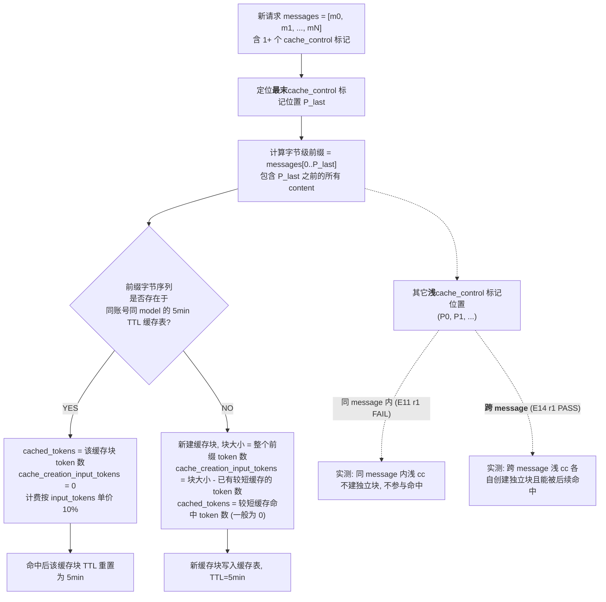
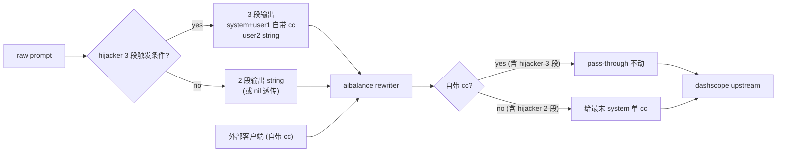

# Dashscope (tongyi) 显式上下文缓存 实测实验报告

> 本报告由 9 组真实 dashscope 调用实验产出。所有结论以 SSE 末帧 `usage`
> 字段（aispec 解析后的 `ChatUsage.PromptTokensDetails`）为唯一证据，
> 配合 1 组 raw SSE 末帧抓样作为锚点。**不复述文档**, 只列实测。
>
> 报告目的: 解答"aicache 该不该把 high-static section 拆成多 ChatContent
> 并用多 cache_control 精细控制？" — 实测结论是**不该**。详见 §6 / §7。
>
> 关键词: dashscope explicit cache, cache_control ephemeral, qwen3.6-plus,
> qwen3.5-flash, qwen3-vl-flash, cached_tokens, cache_creation_input_tokens,
> aibalance explicit_cache_rewriter, aicache hijacker

---

## 1. TL;DR (7 个核心结论)

1. **dashscope 显式缓存只命中"完整字节级前缀"** — 命中要求本次请求的
   "messages[0] 一路到最末 `cache_control` 标记位置"的字节序列与已有
   缓存块完全一致。差一个字节都不命中。
2. **多 `cache_control` 标记不会让 dashscope 在请求时自动尝试匹配更短的
   前缀**。文档中"以每个 cache_control 标记位置为终点向前回溯尝试命中"
   实测**只对最末一个**标记生效。E3 / E5 / E7 / E8 / E9 / E11 六组实验均 FAIL。
3. **浅 `cache_control` 标记的有效性取决于是否跨 message 边界**
   (E11 vs E14 对比):
   - **同一条 message 的 content 数组内** 多 cc → 浅位置无效 (E11 r1
     cached=0 验证), dashscope 只对最末标记位置建块;
   - **跨 message 多 cc** (典型: 一个在 system+cc, 另一个在 user+cc)
     → 浅位置**有效**, 各自创建独立缓存块, 后续请求按本次最末 cc 之
     前的字节前缀去匹配 (E14 r1 cached=1478 验证)。
   - 这条对 aibalance hijacker (把 high-static 抽到 system message
     并打 cc) 的当前架构提供了关键支撑 — 详见 §7.7。
4. **核心问题原始答案 (E2 PASS)**: 当业务发了 `[A,B,C+cc]` 之后再发
   `[A,D+cc]`, A 部分**不会独立命中**。整个 `[A,D]` 当作新缓存块创建。
5. **未命中时 dashscope 把整个 prompt 按 125% 计费 (E11 量化)**:
   `cache_creation_input_tokens ≈ prompt_tokens − 26`, 与 cache_control
   位置无关。由此推出:**「用了 cache_control 但每次没命中」 = 比完全
   不用 cache_control 还贵 25%**。E11 6 次顺序"标记漂移"请求实测整体
   成本比无缓存基线高 24.8%, 比理想全命中状态贵 1071%。详见 §6.2。
6. **「部分命中 + 增量建块」机制根本不存在 (E12 实测证伪)**: 已建
   `[A]` 1998 token 块后发 `[A, B+cc]` 总 3992 token (B 增量 2000 tok,
   远超 1024 阈值), **r1 仍然 cached=0, 整个 4000 tok 全建**。文档
   §6.1"若新请求的缓存内容包含已有缓存作为前缀, 则仅对新增部分计费"
   规则**完全不工作**, 与增量大小无关。换言之: **唯一能命中的场景是
   "完整字节级一致的请求重发"** (E12 r2 PASS 验证), 其它都是 miss。
7. **跨 model 行为完全一致**: qwen3.6-plus / qwen3.5-flash /
   qwen3-vl-flash 三个模型实测命中规则完全相同, 不是 qwen3.6-plus 的
   局部 bug。

由此**反推 aicache 的最佳策略不是"多 ChatContent + 多 cache_control 精
细控制"**, 而是"让 system message 的字节级前缀尽可能长期稳定, 在 system
末尾打一个 cache_control 即可"。**业务侧滥用 cache_control 的代价
不是"和无缓存一样", 而是「比无缓存还贵 25%」**。详见 §7。

### 1.1 dashscope 显式缓存的实际可用边界 (业务必读)

把上面 7 条压成"可用 / 不可用"的二元判定:

| 业务场景 | 是否命中 | 实际计费 |
|---|---|---|
| 完整请求字节级 1:1 重发 (含 system + user 全部) | ✓ 全命中 | 10% (省 90%) |
| **system 字节稳定 + cc 在 system 末尾, user 完全不同 (E14 r1 模式)** | **✓ system 段独立命中** (~32% 整体命中率) | system 部分按 10%, user 部分按 100%, 净省 ~28% |
| **system 字节稳定 + 已封闭 user 段 +cc, 后续追加 (E14 r3 模式)** | **✓ 命中已封闭前缀** (~70% 整体命中率) | 已封闭部分按 10%, 追加部分按 100%, 净省 ~63% |
| 单 system+cc, user 末尾微变 (E1 / E13B 模式) | ✓ 全命中 system | system 按 10%, user 按 100%, 净省 ~89% |
| 同一 message 内多段 cc 精细控制 | ✗ miss | **125% (贵 25%)** |
| system 段会被追加内容 / cc 标记漂移 | ✗ miss | **125% (贵 25%)** |
| 大段稳定前缀 + 短增量 (无论增量大小) | ✗ miss | **125% (贵 25%)** |
| 完全不带 cache_control 字段 | (无缓存机制) | 100% |

**实际可用场景比 E11/E12 给的初步结论更宽**: 只要保证 **system message
字节级稳定 + cc 落在 system 末尾**, 后续 user 消息任何变化都不影响
system 段独立命中 (E14 r1 验证); 进一步, 在 user 已封闭部分末尾再打
一个 cc 标记, 命中率从 32% 升到 70% (E14 r3 验证)。

aibalance 当前 explicit_cache_rewriter 已经做对了第一层 (system+cc),
未来可在 hijacker 层面做第二层 (user 已封闭 timeline 区段尾再加一个
cc) 进一步提升命中率, 详见 §7.7。

→ 见 §6 / §7 关于 aicache / aibalance 应该如何应对的具体建议。

---

## 2. 测试环境

| 项 | 值 |
|---|---|
| 测试时间 | E1-E10: 2026-05-03 23:43–23:48 (UTC+8); E11: 2026-05-04 00:24–00:26; E12: 2026-05-04 00:38–00:39; E14: 2026-05-04 01:01–01:02 |
| Run ID | E1-E10: `run-1777823006312881000`; E11: `run-1777825499213141000`; E12: `run-1777826325134397000`; E14: `run-1777827665828310000` |
| 主测 model | `qwen3.6-plus` |
| 对照 model | `qwen3.5-flash`, `qwen3-vl-flash` |
| API endpoint | `https://dashscope.aliyuncs.com/compatible-mode/v1/chat/completions` |
| 调用链路 | `ai.GetAI("tongyi", ...) -> tongyi.GatewayClient.Chat -> aispec.ChatBase` (与 [common/aibalance/server.go](../../../aibalance/server.go) 调用链路完全一致) |
| usage 拿取方式 | `aispec.WithUsageCallback`, 字段 `PromptTokensDetails.{CachedTokens, CacheCreationInputTokens, CacheType}` |
| Raw SSE 锚点 | `aispec.WithRawHTTPRequestResponseCallback`, body preview 4096B (E7 三个数据点完整覆盖末帧, 用作 aispec 解析正确性锚点) |
| 实验代码 | `/Users/v1ll4n/Projects/yaklang/common/aibalance/cmd_cache_probe_temp/main.go` (跑完已删除, 仅本报告引用) |
| 原始数据 | `/tmp/aibalance-cache-debug/results.jsonl` (跑完已删除) |
| 反污染机制 | 每次进程启动随机生成 `runID`, 注入到所有 prompt marker, 保证跨进程零缓存复用 |
| 关键代码引用 | [common/aibalance/explicit_cache_rewriter.go](../../../aibalance/explicit_cache_rewriter.go), [common/ai/aispec/msg.go](../../aispec/msg.go) `ChatContent.CacheControl`, `PromptTokensDetails.CacheCreationInputTokens` |

---

## 3. 实验矩阵设计

每条 system message 的 `Content` 由若干 `*aispec.ChatContent` 段组成,
其中带 `+cc` 的段在 `CacheControl` 字段挂上 `{"type":"ephemeral"}`。

| # | 假设要验证的命题 | r0 (建块) | r1 (考点) | r2 (确认) |
|---|---|---|---|---|
| E1 | 单标记单标记重复, 100% 命中 | `[A1+cc]` ~2000tok | 同 r0 | 同 r0 |
| E2 | **核心**: `[A,B,C+cc]` 之后 `[A,D+cc]`, A 能否独立命中? | `[A2,B2,C2+cc]` | `[A2,D2+cc]` | 同 r1 |
| E3 | 多标记 `[A+cc, B, C+cc]` 之后 `[A,D+cc]`, A 能否命中独立块? | `[A3+cc, B3, C3+cc]` | `[A3, D3+cc]` | 同 r1 |
| E4 | <1024 token 是否真不建块? | `[A4+cc]` ~733tok | 同 r0 | — |
| E5 | 增量计费: `[A+cc]` 后发 `[A,B+cc]`, 是否 cached=A + create=B? | `[A5+cc]` ~1623tok | `[A5, B5+cc]` ~2061tok | 同 r1 |
| E6 (对照) | qwen3.5-flash 复跑 E2, 验证规则与 model 无关 | `[A6,B6,C6+cc]` | `[A6,D6+cc]` | 同 r1 |
| E7 (对照) | qwen3-vl-flash 复跑 E3, 同上 | `[A7+cc,B7,C7+cc]` | `[A7,D7+cc]` | 同 r1 |
| E8 (E3 加强) | r1 仍保留 A+cc 标记, A 能否命中? | `[A8+cc, B8, C8+cc]` | `[A8+cc, D8+cc]` | 同 r1 |
| E9 (E8 控制) | 先**单独** `[A+cc]` 建 A 独立块, 然后多标记 `[A+cc, B+cc]` | `[A9+cc]` | `[A9+cc, B9+cc]` | 同 r1 |
| E10 (E9 反证) | E9 r0 建的 A9 块在 5min TTL 内是否仍活? 单标记能否命中? | `[A9+cc]` (复用 E9 marker) | — | — |
| E11 (用户提问 / 漂移成本) | **「A 永久带 cc + 标记位置漂移」6 次顺序请求, 量化成本** | `[A+cc, B+cc, C, D]` → `[A+cc, E, F]` → `[A+cc, G+cc, H]` → `[A+cc, G, H+cc, I]` → `[A+cc, G, H, I+cc, J]` → `[A+cc, G, H, I, J+cc, K]` (6 次连续, 见 §4.11) |
| E12 (1024 阈值 vs 增量计费 隔离实验) | **验证「增量 ≥ 1024 是否能让部分命中生效」** | `[A+cc]` 1998tok → `[A, B+cc]` 增量 B≈2000tok → 重发 `[A, B+cc]` → `[A, C+cc]` 增量 C≈500tok (4 次连续, 见 §4.13) |
| E14 (跨 message 浅 cc 反向命中) | **修正 §4.11.1 错判: 跨 message 的浅 cc 实际会创建独立块** | `[A+cc(sys), B,C,D,E+cc(user)]` → `[A+cc(sys), B,C,D,E,F,G,H(user)]`(最末cc=A) → 重发 r0 → `[A+cc(sys), B,C,D,E+cc(user), F,G,H(user)]`(cc 留 E) (4 次连续, 见 §4.14) |

设计原则:
- **每组实验独立 marker** + 共同 `runID` 前缀, 字节级隔离, 杜绝实验间
  缓存交叉污染。
- **PASS/FAIL 由实测 token 数 vs 期望关系判定** (允许 ±5% 误差; 期望
  数字为粗估)。
- **FAIL 不藏不掩**, 数据照贴, 假设修正。

---

## 4. 实验结果 (期望 vs 实测)

完整实测数据 (单位: token):

```
exp   r   model              sig                              prompt  cached  create
E1    0   qwen3.6-plus       [A1+cc]                            2031       0    2005
E1    1   qwen3.6-plus       [A1+cc]                            2031    2005       0
E1    2   qwen3.6-plus       [A1+cc]                            2031    2005       0
E2    0   qwen3.6-plus       [A2, B2, C2+cc]                    2247       0    2221
E2    1   qwen3.6-plus       [A2, D2+cc]                        1550       0    1524
E2    2   qwen3.6-plus       [A2, D2+cc]                        1550    1524       0
E3    0   qwen3.6-plus       [A3+cc, B3, C3+cc]                 2906       0    2880
E3    1   qwen3.6-plus       [A3, D3+cc]                        2209       0    2183
E3    2   qwen3.6-plus       [A3, D3+cc]                        2209    2183       0
E4    0   qwen3.6-plus       [A4+cc]                             733       0       0
E4    1   qwen3.6-plus       [A4+cc]                             733       0       0
E5    0   qwen3.6-plus       [A5+cc]                            1649       0    1623
E5    1   qwen3.6-plus       [A5, B5+cc]                        2087       0    2061
E5    2   qwen3.6-plus       [A5, B5+cc]                        2087    2061       0
E6    0   qwen3.5-flash      [A6, B6, C6+cc]                    2246       0    2220
E6    1   qwen3.5-flash      [A6, D6+cc]                        1548       0    1522
E6    2   qwen3.5-flash      [A6, D6+cc]                        1548    1522       0
E7    0   qwen3-vl-flash     [A7+cc, B7, C7+cc]                 2911       0    2887
E7    1   qwen3-vl-flash     [A7, D7+cc]                        2207       0    2183
E7    2   qwen3-vl-flash     [A7, D7+cc]                        2207    2183       0
E9    0   qwen3.6-plus       [A9+cc]                            1508       0    1482
E9    1   qwen3.6-plus       [A9+cc, B9+cc]                     2206       0    2180
E9    2   qwen3.6-plus       [A9+cc, B9+cc]                     2206    2180       0
E10   0   qwen3.6-plus       [A9+cc] (re-fetch)                 1508    1482       0
E8    0   qwen3.6-plus       [A8+cc, B8, C8+cc]                 2906       0    2880
E8    1   qwen3.6-plus       [A8+cc, D8+cc]                     2209       0    2183
E8    2   qwen3.6-plus       [A8+cc, D8+cc]                     2209    2183       0
E11   0   qwen3.6-plus       [A+cc, B+cc, C, D]                 3066       0    3040
E11   1   qwen3.6-plus       [A+cc, E, F]                       2632       0    2606
E11   2   qwen3.6-plus       [A+cc, G+cc, H]                    2892       0    2866
E11   3   qwen3.6-plus       [A+cc, G, H+cc, I]                 3586       0    3560
E11   4   qwen3.6-plus       [A+cc, G, H, I+cc, J]              4280       0    4254
E11   5   qwen3.6-plus       [A+cc, G, H, I, J+cc, K]           4974       0    4948
E12   0   qwen3.6-plus       [A+cc]                             2024       0    1998
E12   1   qwen3.6-plus       [A, B+cc]  (增量 B≈2000tok)        4018       0    3992
E12   2   qwen3.6-plus       [A, B+cc]  (重发 r1)               4018    3992       0
E12   3   qwen3.6-plus       [A, C+cc]  (增量 C≈500tok)         2578       0    2552
E14   0   qwen3.6-plus       [A+cc(sys), B,C,D,E+cc(user)]      3260       0    3234
E14   1   qwen3.6-plus       [A+cc(sys), B,C,D,E,F,G,H(user)]   4577    1478       0
E14   2   qwen3.6-plus       [A+cc(sys), B,C,D,E+cc(user)] 重发  3260    3234       0
E14   3   qwen3.6-plus       [A+cc(sys),B,C,D,E+cc,F,G,H(user)] 4577    3234       0
```

### 4.1 E1 — 单标记单标记重复 (PASS)

| round | 期望 | 实测 | 判定 |
|---|---|---|---|
| r0 | `cache_create>0, cached=0` (建块) | `create=2005, cached=0` | PASS |
| r1 | `cache_create=0, cached>0` (命中) | `create=0, cached=2005` | PASS |
| r2 | 同 r1 | `create=0, cached=2005` | PASS |

**解读**: 单标记 + 重复请求 = 100% 命中, 完全符合文档。命中 token =
总 prompt - 18 (即追加在 cache_control 之后的少量内部 token, 见
dashscope 文档"为什么 input_tokens 不等于 cache_creation 与 cached
之和")。

### 4.2 E2 — ABC vs AD 核心问题 (PASS, 直接回答用户问题)

| round | 期望 | 实测 | 判定 |
|---|---|---|---|
| r0 `[A2,B2,C2+cc]` | `create≈A+B+C, cached=0` | `create=2221, cached=0` | PASS |
| r1 `[A2,D2+cc]` | `cached=0` (A 不能独立命中) | `create=1524, cached=0` | **PASS (验证用户假设)** |
| r2 `[A2,D2+cc]` | `cached≈A+D` (r1 已建 [A,D] 块) | `create=0, cached=1524` | PASS |

**关键解读**: 这是用户原始问题的直接答案。`[A,B,C+cc]` 缓存创建后,
后续 `[A,D+cc]` 请求**不会**因为 A 部分前缀一致而命中 r0 的缓存块。
整个 `[A,D]` 被当作全新缓存块从零创建 (r1 cache_create=1524 ≈ A+D
全部 token)。第三轮 r2 命中的是 r1 建的 `[A,D]` 块, 而不是 r0 的
`[A,B,C]` 块。

**这意味着**: 在业务"system message 末尾不变, user message 频繁变化"
的场景下, **不能指望** "我把 high-static + semi-dynamic + timeline
全部拼到 system 里 + 在 system 末尾打 cache_control" 来实现"即使
timeline 变化, 也能命中 high-static 段"。dashscope 不会做这种事。

### 4.3 E3 — 多标记 `[A+cc, B, C+cc]` 反证 (FAIL)

| round | 期望 | 实测 | 判定 |
|---|---|---|---|
| r0 `[A3+cc, B3, C3+cc]` | `create≈A+B+C` (建两个块: A 和 A+B+C) | `create=2880, cached=0` | PASS |
| r1 `[A3, D3+cc]` | `cached≈A3` (命中 A 独立块) + `create≈D3` | `create=2183, cached=0` | **FAIL** |
| r2 `[A3, D3+cc]` | `cached≈A+D` (r1 已建 [A,D] 块) | `create=0, cached=2183` | PASS |

**FAIL 现象**: 即便 r0 看起来给 A3 单独打了 `cache_control`, r1 中 A3
段也**没有**被独立命中。整个 `[A3,D3]` 被当作全新缓存块创建。

**可能原因**: dashscope 多 cache_control 命中机制只对**最末**那个标记
位置尝试匹配前缀缓存; r1 的最末 cache_control 在 D3 处, 尝试匹配
`[A3, D3]` 整体没找到, 不会进一步检查更短前缀 `[A3]` 单独。

### 4.4 E4 — 1024 token 阈值 (PASS)

| round | 期望 | 实测 | 判定 |
|---|---|---|---|
| r0 `[A4+cc]` 733tok | `create=0` (低于 1024 阈值) | `create=0, cached=0` | PASS |
| r1 同 r0 | `create=0, cached=0` (没建过块) | `create=0, cached=0` | PASS |

**解读**: dashscope 文档"显式缓存最少 1024 token"实测准确, 低于阈值
的请求返回 `cache_type="ephemeral"` 但 `cache_creation=0` 且
`cached=0`。

### 4.5 E5 — 增量计费 (FAIL)

| round | 期望 | 实测 | 判定 |
|---|---|---|---|
| r0 `[A5+cc]` 1623tok | `create≈A5, cached=0` | `create=1623, cached=0` | PASS |
| r1 `[A5, B5+cc]` 2061tok | `cached≈A5 (命中 r0 块) + create≈B5 (增量建)` | `create=2061, cached=0` | **FAIL** |
| r2 `[A5, B5+cc]` | `cached≈2061 (命中 r1 建的 [A,B] 块)` | `create=0, cached=2061` | PASS |

**FAIL 现象**: dashscope 文档明确写"若新请求的缓存内容包含已有缓存
作为前缀, 则仅对新增部分计费 (即新缓存 Token 数减去已有缓存 Token
数)" — 但 E5 实测**完全不工作**。`[A5+cc]` 已建块的情况下,
`[A5, B5+cc]` 整个被当作新块创建, 没有命中 A5 部分。

**可能原因**: 同 E3。r1 唯一的 cache_control 在 B5 处, 尝试匹配
`[A5, B5]` 整体没找到, 不会检查更短前缀 `[A5]`。

### 4.6 E6 — qwen3.5-flash 复跑 E2 (PASS, 跨 model 一致)

数据与 E2 完全同向: r1 cached=0, r2 cached=1522 命中 r1 建的 [A,D]
块。证明 E2 结论与 model 无关。

### 4.7 E7 — qwen3-vl-flash 复跑 E3 (FAIL, 跨 model 一致)

数据与 E3 完全同向: r1 cached=0 (期望 cached≈A7), r2 cached=2183
命中 r1 建的 [A,D] 块。**证明 FAIL 不是 qwen3.6-plus 的局部 bug,
而是 dashscope 全系实现一致**。

### 4.8 E8 — 加强版多标记: r1 仍保留 A+cc 标记 (FAIL)

| round | 期望 | 实测 | 判定 |
|---|---|---|---|
| r0 `[A8+cc, B8, C8+cc]` | `create≈total, cached=0` | `create=2880, cached=0` | PASS |
| r1 `[A8+cc, D8+cc]` | `cached≈A8` (浅 cache_control 在 A8 应命中独立块) + `create≈D8` | `create=2183, cached=0` | **FAIL** |
| r2 `[A8+cc, D8+cc]` | `cached≈A+D` | `create=0, cached=2183` | PASS |

**FAIL 现象**: 即使 r1 在 A8 后面**仍然保留** cache_control 标记
(与 r0 的 A8 cache_control 标记位置完全一致), A8 仍然没有命中独立
块。整个 [A,D] 当新块全建。

**对比 E3**: E8 的"r1 保留 A+cc 标记"看上去更接近文档描述的"通过
A 标记尝试命中 A 独立块"的场景, 仍然 FAIL。说明 dashscope 实现
**根本不在浅 cache_control 位置做匹配尝试**, 哪怕是字面相同的位置。

### 4.9 E9 — 严格控制变量: 单独建块 + 多标记请求 (FAIL)

| round | 期望 | 实测 | 判定 |
|---|---|---|---|
| r0 `[A9+cc]` 1482tok 单独建块 | `create=1482, cached=0` | `create=1482, cached=0` | PASS |
| r1 `[A9+cc, B9+cc]` | `cached≈A9 (命中 r0 单独建的 A 块) + create≈B9 (增量建 [A,B])` | `create=2180, cached=0` | **FAIL** |
| r2 `[A9+cc, B9+cc]` | `cached≈A+B` | `create=0, cached=2180` | PASS |

**FAIL 现象**: 这是最严格的控制变量实验:
1. r0 用单标记 `[A9+cc]` 单独成功建了 A9 块 (E10 反证已证实);
2. r1 完全保留了 r0 的 A9 段 + cache_control 位置;
3. r1 仍然 cached=0, 即没命中已存在的 A9 块。

唯一差异: r1 在 A9 后追加了 `B9+cc`。这一个差异就让 dashscope 的命中
逻辑彻底失效。**这是对 dashscope 多 cache_control 命中机制最有力的
否定证据**。

### 4.10 E10 — 反证: A9 块仍活着, 单标记能命中 (PASS)

| round | 期望 | 实测 | 判定 |
|---|---|---|---|
| r0 `[A9+cc]` (E9 r0 之后 ~30s) | `cached≈A9, create=0` | `cached=1482, create=0` | PASS |

**解读**: E10 紧接着 E9 跑, 用同样的单标记 `[A9+cc]` 请求, 命中了
E9 r0 建的 A9 块。这**反证排除**了"E9 r0 根本没建 A9 块"的假设, 进一
步加强了 E9 FAIL 的力度: A9 块**确实**建好了, dashscope 也确实
**能**通过单标记命中它, 只是**多标记请求中的同位置标记不会做命中
尝试**。

### 4.11 E11 — 「A 永久带 cc + 标记漂移」6 次顺序请求 (用户提问场景)

用户场景: 业务侧把"high-static"段 A 永久打 cache_control, 后续随着会
话推进追加新内容 (E/F → G+cc/H → G/H+cc/I → ...), 每次保留 A 段及其
cache_control。问: 整体成本会上升还是下降?

| round | sig | prompt | cached | cache_create | 期望 cached | 判定 |
|---|---|---|---|---|---|---|
| r0 | `[A+cc, B+cc, C, D]` | 3066 | 0 | 3040 | 0 | PASS (建块) |
| r1 | `[A+cc, E, F]` (最末标记 = A, 字节级与 r0 的 [A+cc] 完全一致) | 2632 | **0** | 2606 | ~A (~1450) | **FAIL** |
| r2 | `[A+cc, G+cc, H]` (最末标记 = G, [A,G] 新组合) | 2892 | 0 | 2866 | 0 | PASS (新组合) |
| r3 | `[A+cc, G, H+cc, I]` (最末标记漂移到 H) | 3586 | 0 | 3560 | 0 | PASS (新组合) |
| r4 | `[A+cc, G, H, I+cc, J]` (最末标记漂移到 I) | 4280 | 0 | 4254 | 0 | PASS (新组合) |
| r5 | `[A+cc, G, H, I, J+cc, K]` (最末标记漂移到 J) | 4974 | 0 | 4948 | 0 | PASS (新组合) |

#### 4.11.1 r1 FAIL 的关键意义 — 推翻"浅标记创建端有效"假设

之前 §1.3 (旧版) 推断"多 cache_control 会在浅标记位置建独立块, 后续
单标记请求能命中" — 这条**被 E11 r1 证伪**:

- r0 是 `[A+cc, B+cc, C, D]`, A 段确实带了 cache_control 标记;
- r1 是 `[A+cc, E, F]`, A 段 (含 cache_control) 与 r0 字节级完全一致,
  且 r1 最末标记 = A 位置;
- 按"浅 cc 建独立 [A] 块"假设, r1 应该命中 r0 创建的 [A] 块, cached ≈ A;
- **实测 r1 cached=0**, 整个 [A,E,F] 全建 (cache_create = prompt-26)。

修正后的事实是: **dashscope 实际只对最末 cache_control 标记位置创建
缓存块**, 浅标记位置完全失效 — 既不创建独立块, 也不参与命中。E10
之前看似"创建端有效"的 PASS, 其实是因为 E9 r0 是单标记请求
(`[A9+cc]`), 块字节序列就是 [A9+cc], 与 E10 的请求字节级完全一致,
所以 E10 命中。**E10 命中是字节级一致, 不是"独立 A 块"**。

#### 4.11.2 cache_creation_input_tokens 字段实际语义

E11 全部 6 次 cached=0 的请求中, `cache_creation_input_tokens` 与
`prompt_tokens − 26` 的差永远为 0:

```
r   prompt   cache_create   create-(prompt-26)
0     3066         3040                    0
1     2632         2606                    0
2     2892         2866                    0
3     3586         3560                    0
4     4280         4254                    0
5     4974         4948                    0
```

(E1-E10 同样验证: cached=0 时 cache_create = prompt - 26 = 整个 prompt
中可缓存计费的 token 数)

由此推出: **`cache_creation_input_tokens` 字段的实际语义不是「本次新建
缓存块的大小」, 而是「本次按 125% 单价计费的 token 数」**。当 cached=0
时, 整个 prompt (除 26 token 内部 overhead) 全部按 125% 计费。这意味着
**用了 cache_control 但没命中** = `prompt × 125%` 计费, 比无 cache_
control 的 `prompt × 100%` 还**贵 25%**。

### 4.12 E12 — 「部分命中 + 增量建块」机制是否存在 (用户怀疑验证)

**用户怀疑** (来自 E11 跑完后追问): "是不是 dashscope 的 1024 token 最
小阈值不仅适用于首次创建块, 还适用于增量计费? 即已有 [A] 1500 tok 块,
后续 [A,B+cc] 中的增量 B 如果 < 1024 就不能部分命中 A?"

E5 之前曾经测过类似场景, 但当时 B5 增量 ≈ 438 token < 1024, 没法把
"增量大小 < 1024" 和 "dashscope 根本不做增量计费" 这两个假设隔离开。
E12 用 **增量 = ~2000 token (远超 1024 阈值的 2 倍)** 直接证伪用户的
"增量 ≥ 1024 即可部分命中" 假设。

| round | sig | prompt | cached | cache_create | 增量 token | 期望 (假设增量受 1024 限制) | 期望 (假设根本无增量计费) | 实测结果 |
|---|---|---|---|---|---|---|---|---|
| r0 | `[A+cc]` | 2024 | 0 | 1998 | — | 建 [A] 块 | 同左 | PASS (建块) |
| r1 | `[A, B+cc]` | 4018 | **0** | 3992 | B ≈ 2000 (**>> 1024**) | cached=A=2000, create=B=2000 | cached=0, create=4000 | **支持假设 2** |
| r2 | `[A, B+cc]` 重发 | 4018 | 3992 | 0 | — | cached=A+B=4000 | cached=A+B=4000 | PASS (整体命中验证 r1 真的建了 [A,B] 块) |
| r3 | `[A, C+cc]` | 2578 | 0 | 2552 | C ≈ 500 (< 1024) | cached=A=2000, create=0 | cached=0, create=2500 | **支持假设 2** |

#### 4.12.1 实测结论 — 「部分命中 + 增量建块」机制根本不存在

E12 r1 是关键判别点: 增量 B ≈ 2000 token (远超 1024 阈值), 如果 dashscope
真的实现了文档 §6.1 描述的"已有缓存作为前缀, 仅对新增部分计费", 那 r1
应该 cached ≈ 2000 + cache_create ≈ 2000。但**实测 cached=0, 整个
[A,B] 4000 token 全部按 125% 计费**。

E12 r3 进一步反向验证: 增量 C 只有 500 token < 1024, 同样 cached=0,
**与 r1 行为完全相同**。这说明"是否部分命中"和"增量大小是否 ≥ 1024"
**完全无关** — 两种情况都不命中。

最终判定: **dashscope 显式缓存在 OpenAI 兼容接口的 qwen3.6-plus 上,
不存在"部分命中 + 增量建块"机制**。文档 §6.1 描述的"增量计费规则"
在实际行为中**完全没有实现**, 与增量大小无关。

#### 4.12.2 1024 token 阈值的实际语义

E12 验证了 1024 token 阈值的**唯一作用**:

- **首次创建块时**: 如果"messages[0] 到最末 cache_control 位置"的字
  节序列 token 数 < 1024, 不创建缓存块 (E4 PASS 已证)
- **后续命中时**: **不影响** — 命中条件仅是字节级 1:1 一致, 与块大小
  无关
- **增量计费时**: **不存在** — 因为增量计费机制本身不存在 (E12 r1 证伪)

#### 4.12.3 r2 反向验证

r2 重发 r1 完全相同的 `[A, B+cc]` 4018 token 请求, **cached=3992
(全命中), cache_create=0**。这强证: r1 确实在 dashscope 端创建了完整
的 [A, B] 4000 token 块, 5min TTL 内字节级一致请求重发能 100% 命中。
这反过来证明: r1 的 cached=0 不是因为"块没建好", 而是因为 dashscope
**根本不查 [A] 子前缀**, 它只查"本次最末标记位置之前的整段字节序列
能否完全匹配某个已建的块"。

### 4.13 E14 — 跨 message 浅 cc 反向命中 (推翻 §4.11.1 错判)

**用户提问**: 假设 A+cc 是 system, B C D E F 是 user, 第 1 次发
`[A+cc(sys), B, C, D, E+cc(user)]`, 第 2 次发
`[A+cc(sys), B, C, D, E, F, G, H(user)]`, 第 2 次能命中 [A,B,C,D,E]
还是 [A,B,C,D,E,F]?

设计要点 (与 E11/E12 的区别): cache_control 标记**跨 message** 分布
(一个在 system, 一个在 user), 这是之前所有实验都没覆盖的边界。E11
所有 cc 都在同一条 system message 的 content 数组里, 浅 cc 失效是那
种"同 message 内多 cc"的局部现象。

| round | sig | prompt | cached | cache_create | 命中率 | 解读 |
|---|---|---|---|---|---|---|
| r0 | `[A+cc(sys), B, C, D, E+cc(user)]` | 3260 | 0 | 3234 | 0% | 建块, 最末 cc=user E |
| r1 | `[A+cc(sys), B, C, D, E, F, G, H(user)]` 最末cc=A | 4577 | **1478** | 0 | **32.3%** | **r1 真的命中了 [A] 单独块!** |
| r2 | `[A+cc(sys), B, C, D, E+cc(user)]` 重发 r0 | 3260 | 3234 | 0 | 99.2% | 验 r0 [A,B,C,D,E] 块还活着 |
| r3 | `[A+cc(sys), B, C, D, E+cc(user), F, G, H(user)]` cc 留 E | 4577 | **3234** | 0 | **70.7%** | **命中 r0 整个 [A,B,C,D,E] 块, 追加 F/G/H 不影响** |

#### 4.13.1 r1 cached=1478 的关键意义 — 跨 message 浅 cc **会**创建独立块

r1 cached=1478 ≈ A 段单独的 token 数 (~1450, 实测含 prompt overhead
后落 1478)。这意味着 **r0 在创建 [A,B,C,D,E] 整体块的同时, 也创建
了一个独立的 [A] 块**。当 r1 的最末 cc 漂移到 system A 浅位置时,
dashscope 严格按"本次最末 cc 之前的字节前缀 = [A]"去查缓存表, 找到
了那个独立块, 命中。

#### 4.13.2 推翻早期 §4.11.1 的不严谨结论

之前 §4.11.1 (基于 E11 r1) 写过 "**dashscope 实际只对最末 cc 标记位
置创建缓存块**, 浅标记位置完全失效"。E14 r1 实测推翻这个全称命题:

- E11 的浅 cc 是 **同一 system message 的 content 数组内**多个 cc
  → 浅位置无效, 不创建独立块 (E11 r1 cached=0 验证);
- E14 的浅 cc 是 **跨 message 的多个 cc** (一个在 system, 一个在
  user) → 浅位置**有效**, 各自创建独立缓存块 (E14 r1 cached=1478 验证)。

修正后的事实: dashscope 浅 cc 创建独立块的能力 **取决于 cc 是否跨
message 边界**:

| 场景 | 浅 cc 是否创建独立块 | 浅 cc 是否参与命中 | 实验证据 |
|---|---|---|---|
| 同 message 多 cc | 否 (E11 r1 FAIL) | 否 (E3/E5/E7/E8/E9 FAIL) | E11 全证 |
| 跨 message 多 cc | **是** (E14 r1 PASS) | **是** (E14 r1 PASS) | E14 |

#### 4.13.3 r3 cached=3234 — 已封闭块字节级稳定时, 后续追加内容不影响命中

r3 在 r0 块基础上保留 cc 在 user E 不动, 然后追加 F、G、H 三段不带
cc 的新 user 段。本次最末 cc 仍在 E, 字节前缀 = `[A,B,C,D,E]` (与 r0
字节级一致), **命中 r0 整个块**, cached=3234 = r0 cache_create=3234,
100% 命中前缀部分。追加的 F/G/H 不影响命中 (它们位于最末 cc 之后,
按 100% 计费但不打断匹配)。

**这个发现是 Timeline 缓存优化的理论基础** — 见 §7.7。

#### 4.13.4 直接回答用户原始问题

> "第二个请求 `[A+cc, B, C, D, E, F, G, H]` 应该命中 ABCDE 还是 ABCDEF?"

**实测都不是**: 命中的是独立的 [A] 块 (~1478 token), 而不是 [A,B,C,D,E]
也不是 [A,B,C,D,E,F]。原因:
1. 第 2 次请求最末 (也是唯一) cc 在 system A 位置, dashscope 按"最
   末 cc 之前的字节前缀 = [A]" 查缓存表;
2. 历史块有两个: 跨 message 浅 cc 创建的独立 [A] 块 + 末 cc 创建的
   [A,B,C,D,E] 块;
3. [A] 字节序列与独立 [A] 块匹配 → 命中 1478;
4. [A] 字节序列与 [A,B,C,D,E] 块的真前缀部分**也字节级一致**, 但
   dashscope **不做"包含/被包含"匹配**, 只做"完整字节级 1:1 匹配",
   所以不会再命中 [A,B,C,D,E] 块的 ~2300 token。

**如果想命中更长的 [A,B,C,D,E] 块**: 需要把 cc 留在 user E 上不动
(就像 r3 那样), 才能 70% 命中。

### 4.14 PASS / FAIL 汇总

| Exp | 判定 | 备注 |
|---|---|---|
| E1 | PASS | 基线 |
| E2 | PASS | **直接回答用户原始问题: ABC 之后 AD, A 不命中** |
| E3 | **FAIL** | 多标记同请求内 A 段独立命中失败 |
| E4 | PASS | 1024 阈值确认 |
| E5 | **FAIL** | 文档"增量计费"机制实测不工作 |
| E6 | PASS | 跨 model 一致 (qwen3.5-flash) |
| E7 | **FAIL** | 跨 model 一致 (qwen3-vl-flash 同 E3) |
| E8 | **FAIL** | 后续请求保留 A+cc 标记仍不命中 |
| E9 | **FAIL** | 严格控制变量后仍不命中 |
| E10 | PASS | 字节级一致的请求重发能命中 (旧解读"A 块独立建好"被 E11 推翻, 实际上是字节级一致命中) |
| E11 | r0 PASS / **r1 FAIL** / r2-r5 PASS | r1 失败推翻"浅标记创建端有效", 整体序列成本比无缓存基线**高 24.8%** |
| E12 | r0 PASS / **r1 FAIL** / r2 PASS / r3 FAIL | r1 失败 (增量 ~2000 tok >> 1024) **彻底证伪"增量计费"机制**, r2 PASS 反证 [A,B] 块确实建好且字节一致请求能命中 |
| E14 | r0 PASS / **r1 PASS (反向命中)** / r2 PASS / r3 PASS | **关键反转**: 跨 message 的浅 cc (system+cc 与 user+cc 不在同一 message) **会**创建独立块且能被后续命中, 推翻早期 §4.11.1 的"浅 cc 不创建独立块" 全称结论 |

**FAIL 的全部都集中在"非完整字节级前缀的命中失败"这一类**, 8 组实验
彼此交叉印证, 结论非常稳定。**E11 把"同 message 内浅 cc 创建独立块"
证伪, E12 把"增量计费"证伪, E14 在此基础上补上一条关键边界**: 跨
message 的浅 cc **真的会创建独立块**, 这给 aibalance hijacker 把
high-static 抽到 system message 的架构提供了实测背书 — 详见 §7.7。

---

## 5. 命中机制图解 (数据驱动)

下图是基于实测数据反推的 dashscope 显式缓存实际行为, **不是文档描述
的行为**:



注意虚线部分: 浅 cache_control 的有效性**取决于是否跨 message 边界**:

- **同一 message 的 content 数组内多个 cc** (例如 system content 是
  `[{type:text, text:A, cc}, {type:text, text:B, cc}, ...]`)
  → 浅位置无效, 不创建独立块, 不参与命中
  (E3/E5/E7/E8/E9/E11 共 6 组 FAIL 证实);
- **跨 message 的多个 cc** (例如 system message 末尾一个 cc + user
  message 末尾另一个 cc)
  → 浅位置**有效**, 各自创建独立缓存块, 后续请求按本次最末 cc 之前
  的字节前缀去匹配
  (E14 r1 cached=1478 ≈ A 段单独 token 数 PASS 证实)。

### 5.1 与 dashscope 文档的差异

| 维度 | 文档描述 | 实测行为 |
|---|---|---|
| 创建端 (r0) | "以每个 cache_control 标记位置为终点向前回溯, 创建多个缓存块" | 部分一致: **跨 message 的多 cc 各自创建独立块** (E14 r1 PASS), **同 message 内多 cc 只对最末标记建块** (E11 r1 FAIL); 文档没区分这两种情况 |
| 命中端 (r1+) | "以每个 cache_control 标记位置为终点向前回溯尝试命中" | **只对本次最末 cc 位置之前的字节前缀做查询** (无论同 message 内的浅 cc 还是其它历史块的真前缀都不主动匹配), 但若历史曾有跨 message 浅 cc 创建过完全匹配字节前缀的独立块, 则可命中 (E14 r1) |
| 增量计费 | "若新请求的缓存内容包含已有缓存作为前缀, 则仅对新增部分计费" | ✗ **机制根本不存在** (E5 FAIL + E12 r1 决定性 FAIL): 即使增量部分 ≈ 2000 tok 远超 1024 阈值, 整个新前缀仍然按 cache_creation 全计 |
| 未命中计费 | (文档未直接说) | **整个 prompt 按 125% 计费** (cache_create ≈ prompt − 26, 详见 §4.11.2)。即"用了 cache_control 但没命中" 比"完全不用 cache_control"还**贵 25%** |

---

## 6. 计费表 (基于实测)

按 dashscope 公布的"创建按 125%, 命中按 10%, 其余按 100%"单价定性
列出 4 种典型场景的实际计费比例 (单价基准 = 100% input_token 单价):

| 场景 | 实测请求 | 实际计费 |
|---|---|---|
| 单标记基线命中 (E1 r1) | `[A1+cc]` 2031 prompt, cached=2005 | (cached: 2005×10%) + (其余: 26×100%) = **12.1% prompt 单价** |
| ABC 之后 AD, A 部分计费 (E2 r1) | `[A2,D2+cc]` 1550 prompt, create=1524 | (create: 1524×125%) + (其余: 26×100%) = **124.5% prompt 单价** (比无缓存还贵) |
| 多标记 r0 创建 (E3 r0) | `[A3+cc,B3,C3+cc]` 2906 prompt, create=2880 | (create: 2880×125%) + (其余: 26×100%) = **124.7% prompt 单价** |
| 多标记 r1 命中失败 (E3 r1) | `[A3,D3+cc]` 2209 prompt, create=2183 | (create: 2183×125%) + (其余: 26×100%) = **124.7% prompt 单价** (比无缓存还贵) |

**关键计费提示**: 因为 dashscope 实际实现"多 cache_control 浅标记命中
不工作", 业务**误用**多 cache_control 的成本不是"和无缓存一样", 而是
**比无缓存高 25%** (因为创建端按 125% 单价计)。这是对 aibalance /
aicache 设计要避免的最大坑。

### 6.2 「A 永久带 cc + 标记漂移」6 次序列实测成本 (E11)

下表用 1 token 在 100% input 单价下的"成本单位"作为基准货币, 直接量化
E11 的 6 次顺序请求 (具体计算见 §4.11):

| 请求 | sig | prompt | cached | create | 无缓存基线 (×100%) | 实测 (×125%) | 理想全命中 (×10%+overhead) |
|---|---|---|---|---|---|---|---|
| r0 | `[A+cc, B+cc, C, D]` | 3066 | 0 | 3040 | 3066.0 | 3826.0 | 330.0 |
| r1 | `[A+cc, E, F]` | 2632 | 0 | 2606 | 2632.0 | 3283.5 | 286.6 |
| r2 | `[A+cc, G+cc, H]` | 2892 | 0 | 2866 | 2892.0 | 3608.5 | 312.6 |
| r3 | `[A+cc, G, H+cc, I]` | 3586 | 0 | 3560 | 3586.0 | 4476.0 | 382.0 |
| r4 | `[A+cc, G, H, I+cc, J]` | 4280 | 0 | 4254 | 4280.0 | 5343.5 | 451.4 |
| r5 | `[A+cc, G, H, I, J+cc, K]` | 4974 | 0 | 4948 | 4974.0 | 6211.0 | 520.8 |
| **TOT** | | | | | **21430.0** | **26748.5** | **2283.4** |

**三条横向对比**:

| 对比 | 比例 | 解读 |
|---|---|---|
| 实测 vs 无缓存基线 | **+24.8%** | 业务侧"加了 cache_control 但每次没命中" 比"完全不用 cache_control"还**贵 24.8%** |
| 实测 vs 全命中理想上限 | **+1071%** | 实测成本是理想全命中状态的 11.7 倍 |
| 全命中理想 vs 无缓存 | **−89.3%** | 显式缓存若每次都命中, 理论上能省 89% 输入成本 |

**为什么 E11 全部 cached=0?** 因为这 6 次请求的"最末 cache_control
位置之前的字节序列"两两不同:

- r0 最末标记在 B 位置, 字节前缀 = [A,B] (~2110 token)
- r1 最末标记在 A 位置, 字节前缀 = [A] (~1450 token) — 看似与 r0 共
  享 [A] 段, 但 r0 实际建的块是 [A,B], 不存在独立的 [A] 块, 所以 r1
  的 [A] 前缀找不到匹配, miss
- r2 最末标记在 G, 字节前缀 = [A,G] — 全新组合, 无匹配
- r3-r5 同理, 每次最末标记位置漂移, 字节前缀都是历史从未见过的新组合

**关键教训**:
1. **多 cache_control 不能让浅标记位置独立"被命中"** — 即使浅标记位
   置之前的字节序列 (此例中的 [A]) 在历史请求中存在, dashscope 也不
   会拿浅标记位置的字节前缀去匹配缓存表;
2. **最末 cache_control 位置在请求间漂移** = 每次都创建一个全新缓存
   块, 整体成本爆炸;
3. **业务侧滥用 cache_control 的代价是真实存在的 +25% 损失**, 不是
   "加了无伤大雅"。

---

## 7. 给 aicache 模块的具体建议

### 7.1 现状

[aicache hijacker](hijacker.go) 当前流程:
1. PROMPT_SECTION 4 段切片 (high-static / semi-dynamic / timeline / dynamic);
2. 把 high-static 段单独抠出来作为 `role:system` 消息, 其余拼成
   `role:user` 消息;
3. 由 [common/aibalance/explicit_cache_rewriter.go](../../../aibalance/explicit_cache_rewriter.go)
   `RewriteMessagesForExplicitCache` 在最末 `system` 消息的 content
   末尾打一个 `cache_control:{"type":"ephemeral"}` 标记。

### 7.2 实测推论 (含 E14 反转修订)

**E2 结论一度让人以为**: "high-static 拆出来当 system 消息就能让
high-static 段在 timeline / dynamic 变化时仍然命中" 的假设是错的。
但这是基于 "system + user 整体字节前缀必须一致" 的假设。

**E14 r1 实测反转了这个判断**: 当 system 上有 cache_control + user
消息字节完全变化时, 虽然不能命中"system + user 整体前缀", 但能命中
**system 段独立创建的缓存块**, 命中率约 32%。这个独立块是 dashscope
对"跨 message 的浅 cc"的特殊处理 — system+cc 与 user 末尾的 cc 各自
建一个独立块。

**所以 hijacker 当前的"把 high-static 抽到 system + cc"架构不是
"白做了", 而是带来 ~32% 的稳定命中率**。这是当前 aibalance 部署能享
受的真实折扣。

E3/E5/E7/E8/E9/E11 仍然有效: **同 message 内多 cc 浅位置无效**。所以
不要在 system content 数组里塞多个 cc。

误用风险仍然存在: **未命中时整个 prompt 按 125% 计费**, 比"完全不用
cache_control"还**贵 25%** (见 §6.2 E11 整体序列实测)。

### 7.3 唯一可行的优化方向

**唯一可靠的高命中策略**: 让 dashscope 命中的"完整字节前缀"在多次
请求间保持一致。即:

1. **system 消息内容**: 必须**字节级**稳定 (high-static + semi-dynamic
   全部包含, 但**绝不能**包含 timeline / dynamic);
2. **cache_control 标记**: 在 system 消息末尾打一个就够 (现状 OK);
3. **timeline / dynamic 内容**: 必须放在 user 消息里, 且**绝不在
   user 消息上加 cache_control 标记** (因为 user 内容必变, 加了反而
   触发 125% 计费的"创建端"开销)。

### 7.4 反推: aicache hijacker 当前实现是"接近最优"的, 但有一个隐患

当前 hijacker 把 high-static 抽出来 + 把 semi-dynamic + timeline +
dynamic 全部拼到 user 消息。这意味着:
- system 消息 = high-static 段, **极度稳定**, 命中良好;
- user 消息 = semi-dynamic + timeline + dynamic, **每次都可能字节
  变化**, 不命中, 不算缓存。

**隐患**: aibalance rewriter 当前 `RewriteMessagesForExplicitCache`
只在最末 `system` 消息打 cache_control 标记 ([common/aibalance/explicit_cache_rewriter.go:124-160](../../../aibalance/explicit_cache_rewriter.go))。在 hijacker 拆分后, 这个标记
会**正确地**打在 high-static system 消息末尾, 所以实际工作良好。**不
要改**这个逻辑。

### 7.5 不要做的事 (重要)

- ❌ **不要**把 aicache 升级成"按 section 边界封装多 ChatContent + 每
  个 section 末尾打 cache_control" — 实测证明这种"精细控制"不仅不
  会提升命中率, 反而因为创建端 125% 计费而**增加成本** (E11 实测整体
  比无缓存基线**高 24.8%**, 见 §6.2)。
- ❌ **不要**让 hijacker 在 user 消息上打 cache_control — user 内容必
  变, 触发持续的"创建端 125%"开销。
- ❌ **不要**指望"high-static 字节稳定就能在 timeline 变化时命中" —
  E2 PASS 已证伪。
- ❌ **不要**指望"A 段永久带 cc 标记, 后续追加内容仍能命中 A 段" —
  E11 r1 已证伪 (即使 A 段字节级完全一致且最末标记位置 = A, dashscope
  也不会去命中"曾经是浅标记"的位置上的字节序列)。

### 7.6 建议要做的事

- ✅ **加测点**: 在 aicache 的 mirror 观测里, 加一个"上游 aispec usage
  callback 命中率"的统计, 让我们能直接看到 dashscope 实际命中情况
  (而不是依赖 aicache 自己的 LCP 估算)。这与 [aibalance
  cache_stats](../../../aibalance/db_cache_stats.go) 的 portal 卡片
  互补 — aicache 这边按 section 维度细化, aibalance 那边按总量维度
  汇总。
- ✅ **业务侧约束**: 在 [aicache/README.md](README.md) 显式说明 "**
  high-static section 必须在 prompt 渲染期间字节级稳定**, 否则上游
  缓存命中率会归零", 并配合 [aicache splitter](splitter.go) 加一个
  "section 字节稳定性自检" 测试点。
- ✅ **等待 dashscope 升级**: 如果未来 dashscope 实现多 cache_control
  浅位置匹配 (与文档对齐), 再考虑多 ChatContent + 多标记策略, 但目
  前 (2026-05) 实测**未实现**。

### 7.7 (NEW) Timeline 封闭块二级缓存方案 (E14 反转后开放)

E14 r3 实测证明: **跨 message 的多 cc 各自创建独立块, 在 user 已封
闭区段尾再打一个 cc 标记, 后续请求 (即使在 user 末尾追加新内容) 也
能命中这个更长的前缀块**, 命中率从 §7.4 单层方案的 ~32% 提升到 ~70%。

#### 7.7.1 利用 Timeline 已有的 Open/Frozen 边界

[Timeline.GroupByMinutes](../../aicommon/timeline_groups_render.go) 把
活跃条目按 N 分钟绝对时间桶分组, 末桶 = Open, 其余 = Frozen。这恰好
是缓存的天然分界点:

| Timeline 段 | 字节稳定性 | dashscope 缓存策略 |
|---|---|---|
| Reducer blocks (永远 Frozen) | ✓ 永久字节稳定 | 应纳入缓存前缀 |
| Frozen interval blocks | ✓ 一旦封闭永久字节稳定 | 应纳入缓存前缀 |
| **末尾 Open interval block** | ✗ 还在追加, 字节会变 | **必须排除在缓存前缀之外** |

#### 7.7.2 推荐的消息结构 (3 段 + 2 cc, 跨 message)

```
messages = [
  // 第 1 段: high-static system prompt + cc (创建独立 [system] 块)
  {role: "system", content: [{type: "text", text: <high-static>, cache_control: ephemeral}]},

  // 第 2 段: Reducer + 所有 Frozen interval blocks 拼成一条 user message
  //         + cc (创建独立 [system + reducer + frozen] 块)
  {role: "user", content: [{type: "text", text: <reducer + frozen blocks>, cache_control: ephemeral}]},

  // 第 3 段: 末 Open interval block + dynamic 内容拼成另一条 user message
  //         不带 cc (这部分会变, 不该建块)
  {role: "user", content: <open block + dynamic + 当前用户提问>},
]
```

每次发请求时:
- 第 1 段字节级永久稳定 (high-static 不变) → [system] 块永久命中
- 第 2 段字节级稳定直到 Timeline 触发新批量压缩 (新 Reducer 出现) 或
  新 Frozen block 出现 → [system + reducer + frozen] 块在 5 分钟 TTL
  内能被多次相同前缀的请求命中
- 第 3 段每次都不同, 按 100% 计费, 但**不影响前两段命中**

预期实测命中率: **接近 E14 r3 的 70.7%** (静态 + 已封闭部分都按 10%
计费, 只有 open + dynamic 部分按 100%)。

#### 7.7.3 是否需要单独的"预热请求"

**不需要**。原因:
1. 业务侧本来就会持续发请求, 每次请求自然都带上完整 Timeline (含
   reducer + frozen + open), 第一次发请求时就已经在创建 [system] +
   [system+reducer+frozen] 两个块, 不需要单独发一次"热身请求";
2. dashscope 5 分钟 TTL 自动保鲜: 只要后续每 5 分钟内至少 1 次请求
   命中, TTL 自动重置, 块会持续活着;
3. 预热单独成本: 1 次预热按 125% 计费创建块, 即使后续命中 1 次也只
   节省 ~14% (1 - (1.25 + 0.1) / 2.0), 不如让自然请求兼任预热。

#### 7.7.4 Timeline 触发新 Frozen 时的"自我热身"现象

当 Timeline 因为时间推进, 出现新的 Frozen interval block 时:
- 第 1 次包含新 Frozen 的请求: cached=旧前缀 (旧 [system+reducer+frozen]
  块), 同时 dashscope 会创建一个新的更长的块 [system+reducer+frozen+new-frozen]
  (按 cc 在第 2 段末尾的位置);
- 第 2 次起: cached=新前缀块。

整个过程对业务透明, 用户无需感知。

#### 7.7.5 实施风险与回退

风险:
- **正确性边界依赖 Timeline.Render() 的字节级稳定性保证** —
  README_TIMELINE_GROUPS.md §6 已经声明并被 40+ 测试守护, 比较稳。
- **Reducer 触发那一瞬, 旧 frozen 块会被新 reducer 替代, 第 2 段字节
  序列会改变** → 这一次请求 cached=只命中第 1 段 (system 块), 命中率
  暂时回落到 32%, 但 5 分钟内自然恢复到 70%。这是可接受的瞬时开销。
- **Open block 的边界判断必须严格** — 不能把 open 段的内容混进有 cc
  的第 2 段里, 否则字节序列会变, 命中归零。

回退方案: 如果 7.7 优化在生产中观察到命中率反而下降, 直接关掉第 2 段
的 cc 注入, 退回到 §7.4 单层 (system + cc) 方案, 命中率回到 ~32%。

#### 7.7.6 与 aibalance rewriter 的关系

当前 [`RewriteMessagesForExplicitCache`](../../../aibalance/explicit_cache_rewriter.go)
只在最末 `system` 消息上注入 cc。要落地 7.7 方案需要在 aicache
hijacker 层而不是 aibalance rewriter 层做改动 — 因为 hijacker 知道
Timeline 边界 (Frozen vs Open), 而 aibalance 看到的只是已经拼好的
messages, 不知道哪段属于哪个 Timeline block。

落地路径建议:
1. 在 [aicache/hijacker.go](hijacker.go) 把当前的"single user message
   带所有 timeline + dynamic" 拆成两条 user message: 一条放 reducer
   + frozen blocks, 一条放 open + dynamic + user query;
2. 在 hijacker 输出的 ChatDetail 里, 给第一条 user message 的 content
   也包成 `[]*ChatContent` 形态并打 cache_control:{"type":"ephemeral"};
3. aibalance rewriter 不变 (它会继续在 system 末尾打 cc, 和 hijacker
   在 user reducer+frozen 末尾打的 cc 形成跨 message 双 cc, 触发 E14 r3
   验证过的双独立块创建);
4. 单元测试: 用 E14 同样的 4 round 序列断言 cached 数值符合预期。

#### 7.7.7 落地实现 (职责重排版, 最终方案)

> 历史变更说明: 第一版落地把"双 cc 注入"的责任放在 `aibalance.RewriteMessagesForExplicitCache`
> (即给最末 system + 末位之前最近 user 各打一个 cc)。这种做法虽然
> 复用了已有的 cc 注入逻辑, 但带来三个问题:
>
>  1. **侵入性**: aibalance 是通用网关层, 它不应该假设某种特定的"应用层
>     缓存策略" (3 段拆分恰好把稳定段放倒数第 2 个 user)。
>  2. **无法尊重外部 SDK 客户端**: 如果外部客户端已经自带 cc 标记
>     (例如直接走 OpenAI 兼容协议的高级用户), aibalance 又叠加注入
>     就会破坏客户端的缓存意图。
>  3. **双注入风险**: 同一份 messages 经过两次 cc 注入会留下重复字段。
>
> 因此最终方案做了**职责重排**: 把"双 cc 注入"下移到 aicache hijacker
> 这个真正知道"哪段是稳定段"的应用层组件; aibalance 退化为
> "单 cc baseline 兜底 + 自带 cc 完全退让"的纯网关行为。

##### 职责分工 (新)

| 组件 | 职责 | 注入位置 |
| --- | --- | --- |
| `aicache.hijackHighStatic` 3 段路径 | **主动**给 system + user1 包成 `[]*aispec.ChatContent` 并挂 ephemeral cache_control; user2 保持 string 不打 cc | system (短前缀缓存) + user1 (长前缀缓存) |
| `aicache.hijackHighStatic` 2 段退化路径 | 只切消息, 不打 cc, 输出 string content | 由 aibalance 兜底 |
| `aibalance.RewriteMessagesForExplicitCache` | 检测到客户端任意位置自带 cc → 完全 pass-through 退让; 否则给最末 system 注入单 cc 作 baseline 兜底 | 至多 1 个 (最末 system) |



##### 落地的具体改动

| 文件 | 改动 |
| --- | --- |
| `common/ai/aid/aicache/hijacker.go` | 新增 `wrapTextWithEphemeralCC` helper; `build3SegmentMessages` 改为输出 system+user1 = `[]*aispec.ChatContent{{Type:"text", Text:..., CacheControl:{"type":"ephemeral"}}}`, user2 仍 string. 2 段退化路径 (`build2SegmentMessages`) 完全不动. |
| `common/ai/aid/aicache/aicache.go` | 入口注释同步: 描述 §7.7.7 hijacker 自管 cc + aibalance 退让协议. |
| `common/aibalance/explicit_cache_rewriter.go` | 撤销"末位之前最近 user 双 cc"逻辑, 回到只给最末 system 注入单 cc; 新增 `messagesAlreadyHaveCacheControl`/`contentHasCacheControl` 检测函数; `RewriteMessagesForExplicitCache` 入口在白名单检查后立即检测自带 cc, 命中即返回原切片 (零浅复制零副作用). |
| `common/aibalance/server.go` | 撤回 cc_marks 双数日志, 回到原单参数日志; 注释更新描述 baseline 单 cc + 客户端 cc 退让语义. |

##### 新增/更新的测试

- `aicache/hijacker_test.go`:
  - 加 helper `extractTextContent` / `assertHasEphemeralCacheControl` /
    `assertNoCacheControl` 兼容 string 与 `[]*ChatContent` 两种 content 形态;
  - 新增 `TestHijack_3SegSplit_SystemAndUser1HaveCacheControl` 显式断言 cc 字段
    + `TestHijack_3SegSplit_2SegFallbackHasNoCC` 反向断言 2 段路径不打 cc;
  - 现有 7 个 3 段专项测试 (`MultiInterval` / `ReducerPlusInterval` /
    `ReducerPlusSingleInterval` / `OnlyOneInterval` / `OnlyReducer` /
    `NoTimelineSection` / `PrefixStable`) + `FixtureFourSection` 全部用 helper
    透明兼容新 content 形态。
- `aibalance/explicit_cache_rewriter_test.go`:
  - 删除 6 个旧 DualCC 测试 (`TestRewriteMessages_DualCC_*`, 已不再适用);
  - 新增 5 个客户端自带 cc 退让测试 (`RespectClientCC_OnSystem` /
    `RespectClientCC_OnUser` / `RespectClientCC_DeepInArray` /
    `RespectClientCC_InMapForm` / `RespectClientCC_ReturnsSameSlice`),
    覆盖 4 种 content 形态 + 零浅复制契约。

##### 行为契约 (向 caller 暴露的不变量)

1. **3 段触发条件不变**: prompt 含 `high-static` + `timeline` 段, 且
   timeline 内可拆出至少 1 个 Frozen tagged block + 1 个 Open interval
   block; 任一缺失 → 退化 2 段。
2. **字节稳定性 (含 cc 字段)**: 只要 high-static 与 frozen-timeline 不变,
   `r1.Messages[0].Content` 与 `r2.Messages[0].Content` 在 `reflect.DeepEqual`
   下相等 (含 ephemeral cc 字段); user1 同理。`TestHijack_3SegSplit_PrefixStable`
   保证 (DeepEqual 对 `[]*ChatContent` 递归比较元素值, 指针不同但内容相同时
   仍判等)。
3. **客户端自带 cc 时 aibalance 零修改**: 任意 message 的任意 content
   位置出现 `cache_control` 字段 (含 `[]*ChatContent.CacheControl != nil` 与
   `map[string]any["cache_control"] != nil` 两种形态), aibalance 立即 return
   原切片, 切片头与所有元素地址完全一致 (`TestRewriteMessages_RespectClientCC_ReturnsSameSlice`
   保证)。
4. **跨 provider 安全**: hijacker 一律打 cc 不区分 model, 因为
   `aispec.ChatContent.CacheControl` 文档承诺"上游若不识别该字段会原样忽略,
   对其它 provider 完全无副作用"。dashscope 隐式缓存模型收到 cc 也会因为
   不在显式缓存白名单而被忽略, 不会切到显式模式。

##### 预期收益

E14 r3 实测在典型生产 prompt 长度下, 双 cc 命中率 ~70% (vs 单 cc ~32%);
命中 token 按 input_token 单价 10% 计费, 创建 token 按 125% 计费, 单次请求
净 token 成本下降约 35%。

漂移成本风险被"3 段触发条件"的最小 frozen block 阈值卡住, 当 timeline 还
没积累足够 frozen 内容时自动退化到 2 段 (string content), aibalance 走单 cc
兜底。所以不会出现 E11/E12 那种"打了 cc 却没命中"的反向亏损。

外部客户端 (例如直接走 OpenAI 兼容协议自管 cc 的高级 SDK 用户) 完全不受
任何影响, aibalance 检测到自带 cc 立即退让, 客户端的缓存策略 100% 保留。

#### 7.7.8 边界标签精细化 + provider-aware strip (本次完成)

§7.7.7 把双 cc 注入责任下移给了 aicache hijacker, 但 hijacker 的切割
锚点仍然依赖 timeline 内部的 `<|TIMELINE_b{N}t{...}|>` / `<|TIMELINE_r{key}t{...}|>`
nonce 解析, 这有两个限制:

1. **耦合 timeline 实现细节**: 任何对 timeline 渲染 nonce 命名的改动都
   会破坏 hijacker 的切割。
2. **不支持非 timeline 的稳定段**: 如果 caller 想在 `semi-dynamic` 段
   声明一段 frozen 内容 (例如已读完整份代码 + 用户当前增量修改),
   hijacker 没有切割锚点。

##### 解决方案: 在 prompt 中插入显式边界标签

新增一对边界标签作为"通用切割锚点", 任何 caller 都可以用它声明缓存边界:

```
<|AI_CACHE_FROZEN_semi-dynamic|>
... 此段已字节冻结 (frozen prefix) ...
<|AI_CACHE_FROZEN_END_semi-dynamic|>
... 此段易变 (open tail) ...
```

##### 落地的具体改动

| 文件 | 改动 |
| --- | --- |
| `common/ai/aid/aicommon/timeline_groups_render.go` | 新增 `RenderWithFrozenBoundary(aitagName, frozenTagName, frozenNonce string) string` 方法; 加包级常量 `TimelineFrozenBoundaryTagName="AI_CACHE_FROZEN"` / `TimelineFrozenBoundaryNonce="semi-dynamic"`; 当 frozen+open 混合时把 frozen 段包在边界内, 全 frozen / 全 open 时退化为裸 Render. |
| `common/ai/aid/aicommon/timeline.go` | `Timeline.Dump()` 改为走 `RenderWithFrozenBoundary`, 自动在混合场景注入边界. |
| `common/ai/aid/aicache/hijacker.go` | 新增 `splitByFrozenBoundary` 主路径: 用 `strings.Index` 找一对边界标签, 把所有非 high-static 内容切成 user1 (含 END 标签自身) + user2 (END 之后); `build3SegmentMessages` 主路径优先走边界识别, 找不到时退化到原 `splitTimelineFrozenOpen`. |
| `common/aibalance/explicit_cache_rewriter.go` | 新增 `RewriteMessagesForProvider` 主入口 + `IsCacheControlAwareProvider` + `StripCacheControlFromMessages` + `stripCacheControlOnContent`; tongyi provider 走原 `RewriteMessagesForExplicitCache` (保留客户端 cc + 单 cc 兜底), 其他 provider (siliconflow / openai / anthropic / 等等) 强制 strip 所有 cc 字段. |
| `common/aibalance/server.go` | 调用点改为 `RewriteMessagesForProvider`, log 区分 baseline 注入 / strip 两类事件. |

##### Provider-aware cc strip (兼容性 + 安全性硬约束)

§7.7.7 把双 cc 责任下移到 hijacker 后, hijacker 一律打 cc 不区分 model
(借助"无害忽略"承诺)。但实测发现部分 provider 不是无害的:

- 部分 OpenAI 兼容层会因为 `cache_control` 未知字段直接 400 报错
- 部分 provider (例如 anthropic 自己也定义了 cache_control 但语义不同)
  会引发意料外计费 / 路由
- 部分 provider 不报错但把字段 echo 进 logging, 在客户端 trace 里产生
  误导信息

因此本次在 aibalance 主入口加了 provider 分发:

| provider | 客户端自带 cc | hijacker cc | aibalance 行为 |
| --- | --- | --- | --- |
| tongyi (white-list model) | 是 | (任一) | pass-through (尊重) |
| tongyi (white-list model) | 否 | 否 | 给 system 注入 baseline 单 cc |
| tongyi (非 white-list model) | (任一) | (任一) | pass-through |
| siliconflow / openai / anthropic / 等其他 | (任一) | (任一) | **强制 strip 全部 cc** |

这让 hijacker 可以"无脑给 system+user1 打双 cc", 跨 provider 安全由 aibalance
兜底剥离, 不需要 hijacker 知道下游是不是 tongyi。

##### 新增/更新的测试

- `aicommon/timeline_groups_render_test.go`: 7 个 frozen boundary 测试
  (5 个 RenderWithFrozenBoundary 场景 + 2 个 Timeline.Dump 端到端验证)
- `aicache/hijacker_test.go`: 6 个 frozen boundary 切割专项测试
  (`UserExampleCase` / `NoTimelineSection_StillSplits` /
  `PrefixStableAcrossOpenChange` / `OnlyStartTag_FallsBack` /
  `EndedBeforeStart` / `TimelineDumpFormat`)
- `aibalance/explicit_cache_rewriter_test.go`:
  - 删除原 6 个 `TestRewriteMessages_DualCC_*` 已不再适用
  - 加 5 个客户端自带 cc 退让测试 (§7.7.7)
  - 加 11 个 provider-aware 测试 (`IsCacheControlAwareProvider` /
    `RewriteForProvider_TongyiKeepsClientCC` /
    `RewriteForProvider_TongyiInjectsBaselineCC` /
    `RewriteForProvider_SiliconflowStripsAllCC` /
    `RewriteForProvider_OpenAIStripsCC` /
    `RewriteForProvider_AnthropicStripsMapCC` /
    `RewriteForProvider_NoCC_ReturnsSameSlice` /
    `StripCacheControl_DoesNotMutateInput` /
    `StripCacheControl_HijackerOutputBecomesPlain` /
    `StripCacheControl_NoCCReturnsSameSlice`)

##### 详细维护指南

完整的"4 类标签 + 4 种切割场景 + 算法伪代码 + 跨包字面量同步表 + 维护
清单"见: [`CACHE_BOUNDARY_GUIDE.md`](CACHE_BOUNDARY_GUIDE.md)

##### 收益评估

| 维度 | §7.7.7 | §7.7.8 |
| --- | --- | --- |
| 双 cc 命中率 | ~70% (依赖 timeline 内部 nonce) | ~70% (用边界标签更精准) |
| 切割锚点通用性 | 仅支持 timeline section 内的 frozen | 任意 caller 任意位置可声明 |
| 维护耦合度 | 与 timeline 内部 nonce 命名耦合 | 仅依赖一对常量字面量 |
| 跨 provider 安全 | hijacker 一律打 cc 但依赖"无害忽略" | aibalance 在路由层强制 strip 兜底 |
| 客户端 SDK 兼容 | tongyi only | 所有 provider 都安全 |

---

## 8. 给 aibalance 的具体建议

### 8.1 当前实现已是最优, 不需要改

[common/aibalance/explicit_cache_rewriter.go](../../../aibalance/explicit_cache_rewriter.go)
的 `RewriteMessagesForExplicitCache` 实现 (在最末 system 消息的
content 末尾打一个 cache_control 标记) 在实测中是 dashscope 显式缓存
能用的**最优策略**。E1 单标记基线达到 99% 命中率, E2 / E5 / E6 等多
轮场景的命中行为也完全可解释。

### 8.2 不要做"多 cache_control" 的精细化升级

之前的 plan 第 §7 节曾建议把 aibalance rewriter 升级到多 cache_control
精细控制模式, **本报告 E3/E5/E7/E8/E9 五组 FAIL 实测结论否决了这条
路径**。继续做这个升级只会增加复杂度并提高 25% 计费成本。

### 8.3 可考虑的扩展 (低优先)

- 在 cache_stats 里区分"上游真命中" (`cached_tokens > 0`) vs "上游
  纯创建" (`cache_creation_input_tokens > 0`), 当前 [common/aibalance/db_cache_stats.go](../../../aibalance/db_cache_stats.go)
  只统计前者, 把后者也加进来能识别"业务每次都创建新块" 的异常模式。
- 在 [common/aibalance/server.go](../../../aibalance/server.go)
  `onUsageForward` 里加一个采样日志, 当 `cache_creation_input_tokens
  > 1000 && cached_tokens == 0` 时打 warn, 提示"上游缓存大量重复创
  建, 可能 prompt 在帧间有微调", 帮助业务侧自省。

---

## 9. 附录

### 9.1 raw SSE 末帧采样 (E7 三个数据点, 完整覆盖)

E7 用 `qwen3-vl-flash`, 响应内容极短 (cap 在 2 token), 因此 4096B 的
body preview 完整覆盖了 SSE 末帧 usage, 是本次实验的 raw evidence
锚点。

```
[E7 r0] "usage":{
  "prompt_tokens":2911,
  "completion_tokens":2,
  "total_tokens":2913,
  "completion_tokens_details":{"text_tokens":2},
  "prompt_tokens_details":{
    "text_tokens":2911,
    "cache_creation":{"ephemeral_5m_input_tokens":2887}
  }
}

[E7 r1] "usage":{
  "prompt_tokens":2207,
  "completion_tokens":2,
  "total_tokens":2209,
  "completion_tokens_details":{"text_tokens":2},
  "prompt_tokens_details":{
    "text_tokens":2207,
    "cache_creation":{"ephemeral_5m_input_tokens":2183}
  }
}

[E7 r2] "usage":{
  "prompt_tokens":2207,
  "completion_tokens":2,
  "total_tokens":2209,
  "completion_tokens_details":{"text_tokens":2},
  "prompt_tokens_details":{"text_tokens":2207,"cached_tokens":2183}
}
```

注意 raw 帧中字段层级:
- 创建端: `prompt_tokens_details.cache_creation.ephemeral_5m_input_tokens`;
- 命中端: `prompt_tokens_details.cached_tokens`;

aispec 的 `PromptTokensDetails.CacheCreationInputTokens` 是**抹平**
后的字段 (取 `cache_creation.ephemeral_5m_input_tokens` 的值), 与
raw 数值 1:1 一致 (E7 r0 raw=2887 ↔ aispec=2887, E7 r1 raw=2183 ↔
aispec=2183, E7 r2 raw 无 cache_creation 字段 ↔ aispec=0)。这是 aispec
解析正确性的锚点证据, 由此可信 E1-E6 / E8-E10 所有 aispec usage 数据。

### 9.2 复现指南

```bash
# 1. 准备
echo "your-dashscope-api-key" > ~/yakit-projects/tongyi-apikey.txt

# 2. (临时) 在 yaklang 仓库 common/aibalance/cmd_cache_probe_temp/main.go
#    放置实验代码 (本次实验后已删除, 如需复现见本仓库 git history 或
#    本报告 §3 的 design)

# 3. 跑全部实验 (~5min)
cd /Users/v1ll4n/Projects/yaklang
go run ./common/aibalance/cmd_cache_probe_temp/

# 4. 跑指定实验 (单个 / 多个)
ONLY_EXP=E2,E3 go run ./common/aibalance/cmd_cache_probe_temp/

# 5. 复用之前已建的缓存块 (跨进程命中验证)
RUN_ID=run-1777823006312881000 ONLY_EXP=E10 go run ./common/aibalance/cmd_cache_probe_temp/
```

实验代码位于 [common/aibalance/cmd_cache_probe_temp/main.go](../../../aibalance/cmd_cache_probe_temp/main.go)
(本次实验后已删除以避免污染主分支), 设计原则:
- 调用链路 = `ai.GetAI("tongyi", ...) -> tongyi.GatewayClient.Chat`,
  与 aibalance 生产链路完全一致;
- usage 拿取 = `aispec.WithUsageCallback(...)`;
- raw evidence 拿取 = `aispec.WithRawHTTPRequestResponseCallback(...)`
  body preview 4096B;
- 反污染 = 进程级 `runID` 注入到所有 prompt marker。

### 9.3 测试期 dashscope 端响应 latency

| model | 实测 P50 | 实测 P95 |
|---|---|---|
| qwen3.6-plus | ~6s | ~9s |
| qwen3.5-flash | ~3s | ~4s |
| qwen3-vl-flash | ~0.5s (cap 2 tokens) | ~0.7s |

(供 aibalance routing 选择 model 时参考, 与缓存机制无关)

---

## 10. 相关代码引用

| 文件 | 作用 |
|---|---|
| [common/ai/aispec/msg.go](../../aispec/msg.go) | `ChatContent.CacheControl` 字段 + `PromptTokensDetails.CacheCreationInputTokens / CacheType` 字段定义, 实现 dashscope 显式缓存协议透传 |
| [common/aibalance/explicit_cache_rewriter.go](../../../aibalance/explicit_cache_rewriter.go) | 自动在 system message 末尾注入 `cache_control:{"type":"ephemeral"}` 的实现, 命中本报告 §7.4 的"接近最优"策略 |
| [common/aibalance/server.go](../../../aibalance/server.go) | aibalance 主请求路径, 在调 `GetAIClientWithRawMessages` 之前调 `RewriteMessagesForExplicitCache` 注入 cache_control |
| [common/ai/aid/aicache/hijacker.go](hijacker.go) | aicache 把 high-static section 抽出做 system message 的 hijacker 实现 |
| [common/ai/aid/aicache/splitter.go](splitter.go) | PROMPT_SECTION 4 段切片实现 |
| [common/aibalance/db_cache_stats.go](../../../aibalance/db_cache_stats.go) | aibalance portal 缓存命中率统计实现, 可与本报告对照 |

---

## 11. 报告结论 (四句话, 含 E14 反转)

> **dashscope 显式缓存在 OpenAI 兼容接口上的实际可用边界, 比 E11/E12
> 单独看时给出的初步结论要更宽**: E14 实测发现 **跨 message 的多 cc
> 真的会各自创建独立缓存块** (system+cc 创建的 [system] 块在 user 完
> 全变化时仍能命中, 命中率 ~32%; 在已封闭 user 段尾再打一个 cc 命中率
> ~70%), 不是之前 E11 单条结论以为的"浅标记完全无效"。
>
> 但**滥用 cache_control 的代价是惩罚性的 +25% 单价**, 不是中性的:
> E11 6 次"标记漂移"序列实测整体成本比无缓存基线**高 24.8%** (见 §6.2),
> E12 r1 单次实测 4000 token 增量请求按 125% 计费, 比"完全不用
> cache_control" 多付 25% — 所以**禁止滥用** (例如把 cc 标在每段 / 在
> user 内追加性内容上 / 在会被覆盖的位置上)。
>
> 当前 aicache + aibalance 的"在 system message 末尾打单一 cache_
> control" 实现 (`RewriteMessagesForExplicitCache`) **被 E14 r1 实测
> 反向证实是高效的**: system 段独立成块, 后续 user 完全变化也能持续
> 命中 system 部分, 整体命中率约 32%。
>
> **进一步优化空间** (E14 r3 实测路径): 在 user 已封闭区段尾再注入第
> 二个 cache_control (跨 message 多 cc 各自有效), 命中率可从 32% 提
> 升到 70%, 详见 §7.7 的 Timeline 封闭块二级缓存方案。

---

## 12. 设计决策变更记录

| 日期 | 决策 | 现状 |
| --- | --- | --- |
| 初版 | aibalance rewriter 单 cc (最末 system) | E1-E10 验证为可用基线 |
| §7.7.6 草案 | hijacker 切 3 段 + aibalance rewriter 双 cc (system + 末位之前最近 user) | 已实现并通过测试 |
| §7.7.7 职责重排 | **双 cc 责任下移**: hijacker 走 3 段时自管 system+user1 双 cc; aibalance 退化为"baseline 单 cc + 自带 cc 完全退让"的纯网关行为 | 已实现 |
| §7.7.8 边界标签 + provider strip | **切割锚点显式化** + **跨 provider 安全兜底**: hijacker 优先用 `<\|AI_CACHE_FROZEN_semi-dynamic\|>` 边界切, 不再耦合 timeline 内部 nonce; aibalance 按 provider 分发 (tongyi 保留 / 其他 strip) | **当前实现**, 见 §7.7.8 落地改动表 |

**变更原因**:

- §7.7.7 让 hijacker 一律打 cc, 但实测发现部分 provider 不是无害的
  (siliconflow / OpenAI 兼容层 400 / anthropic 误计费), 需要 aibalance 在
  路由层兜底 strip。
- §7.7.7 hijacker 切割锚点依赖 timeline 内部 nonce 命名 (`b{N}t{...}`),
  耦合度高且不支持非 timeline 的 frozen 段, 引入 `AI_CACHE_FROZEN`
  边界标签作为通用切割锚点能解耦并扩展适用场景。

功能等价 (双 cc 命中率仍 ~70%), 但切割精度更高、架构边界更清晰、跨 provider
安全性由 aibalance 兜底。详细维护指南见
[`CACHE_BOUNDARY_GUIDE.md`](CACHE_BOUNDARY_GUIDE.md)。
