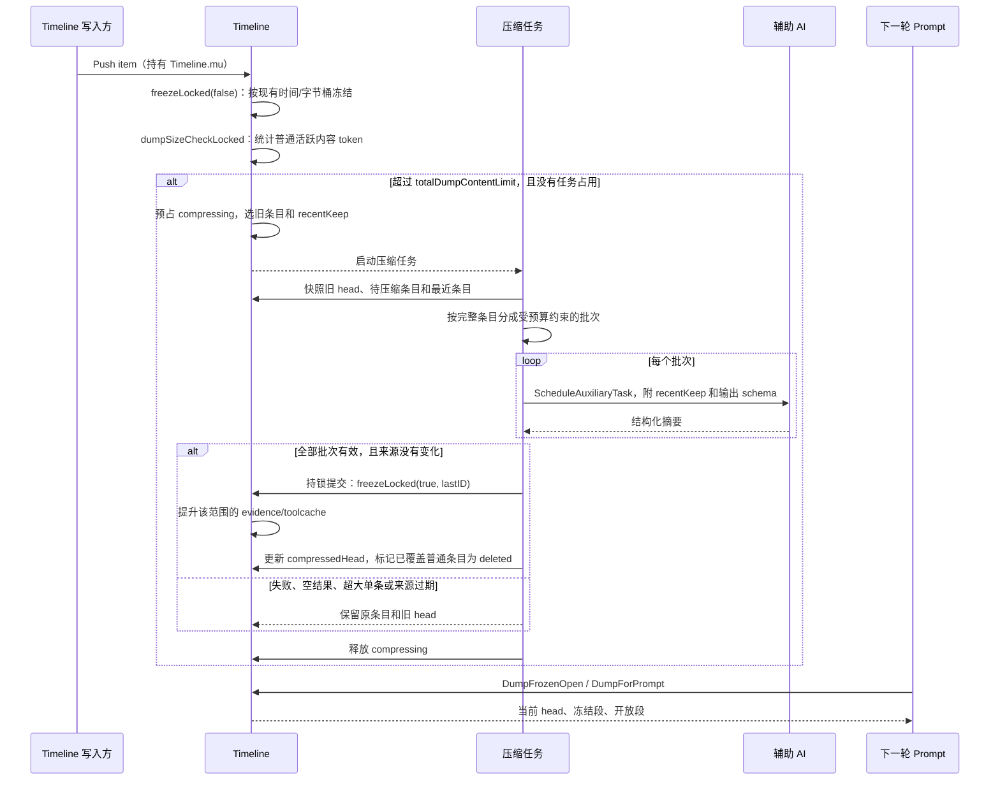
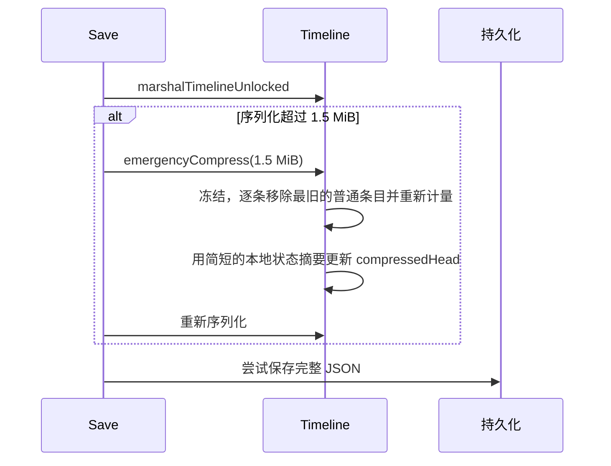
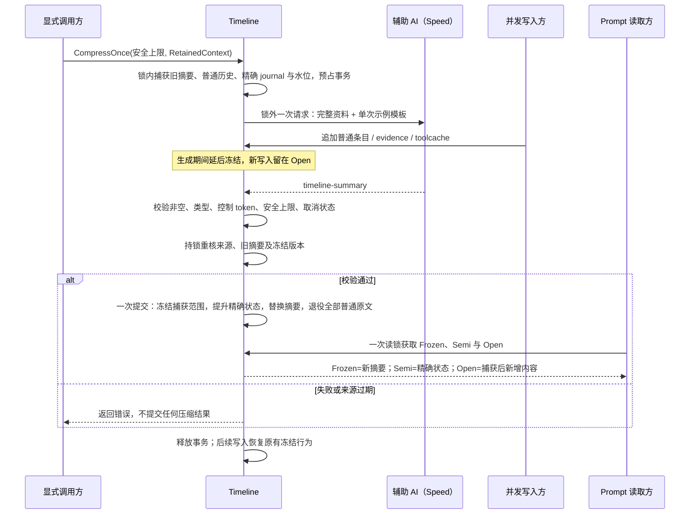

# Timeline 压缩现状

入口和实现集中在 `timeline_compression.go`，主 Timeline 的追加入口在 `timeline.go`，冻结和提升在 `timeline_freeze.go`，持久化格式在 `timeline_marshal.go`。压缩相关测试按 `timeline_compression*_test.go` 查找；evidence、toolcache 的生命周期断言仍在各自的专属测试中。

## 正常的 AI 压缩

当前触发量取自 `calculateActualContentSizeLocked`：它统计普通活跃条目的缩减后文本，不计 promotable item 和旧 head。`SetTimelineContentLimit` 只设置阈值；追加条目时才执行检查。测试或内部调用方也可通过 `compressForSizeLimit()` 主动检查。触发后约保留最新 `currentSize / 6` 的原始内容。reducer 输入按完整条目切为最多约 80 KiB 的批次，recentKeep 参考内容最多约 16 KiB；所有批次成功才提交。历史摘要保存在 `compressedHead`，旧版 head 进入 `compressedHistory` 供追溯；投影中的 head 标签保持稳定。

**目前仍有独立冻结。** 每次追加先调用 `freezeLocked(false)`；3 分钟时间桶或 64 KiB 默认字节桶可在 AI 压缩前改变 Frozen/Open 分界。本次整理没有改变这些策略，也没有将正常冻结与压缩合并为唯一触发。压缩任务提交时的强制冻结、提升和条目退役则在同一把锁下完成。

## 保存体积的兜底

紧急路径不调用 AI，只保留简短状态，因此语义损失比正常摘要大。它只作为保存体积兜底：AI 调度器缺失、请求失败或返回空结果，不再把普通压缩自动转为紧急删除。若紧急路径仍无法降到保存上限，`Save` 会明确记录这一点并尝试保存完整 JSON；代码没有截断 JSON。

## 后续调整的边界

### 新压缩方案：完整快照、单次摘要、原子提交（尚未切换生产入口）

`Timeline.CompressOnce(TimelineCompressionOptions)` 显式执行新流程。按最新确认，**旧摘要 + 全部普通 Frozen/Open 历史统一替换成一份摘要**，不保留最近原文，不再用六分之一或固定长度作为输出目标。

- `MaxInputTokens` / `MaxSummaryTokens` 是调用方给出的技术安全上限，不是期望输出长度，不写入提示词。超限返回错误并保留历史，不分批、不截断。
- `RetainedContext` 是下一轮仍独立保留的实际上下文（例如 USER_QUERY、TODO），由调用方提供；Timeline 不猜测主循环的字段。此阶段仅提供接口与 mock 验证，实际主循环接线在后续步骤。
- 输入模板为 `prompts/timeline/compression.txt`，含一个示例，要求保留实际进展、依据、关键发现、独有约束、失败教训和未完成调用；避免抄写独立保留的上下文。输出 Schema 为同目录 `compression.json`，仅包含 `@action` 与非空 `summary`。
- evidence/toolcache 的精确 journal 从摘要输入与退役列表中排除。当前上下文中提及相同工具或 evidence，不意味着相关历史调查结论可以删除。

快照包含完整原文，不复用单条 shrink，也不经可能丢失超长单行的展示渲染器。历史原生交互按专用条目校验完整 assistant + N tools；请求副本去除有效 projection nonce 并 JSON 编码，历史调用不能在辅助请求中展开。所有原文都进入摘要资料，不切分工具交互。

来源校验覆盖捕获水位以内的修改、删除、回退、晚插入、精确状态更改、时间戳和旧摘要变化；水位以后的追加允许继续。失败不撤销调用方已做的更改，只是不覆盖它们。成功后旧 head 仍按现有机制归档追溯，不进入下一轮 Prompt；普通原文在两个索引中退役，保存恢复后也不会复活。

正常成功仅一次逻辑 AI 调度，没有分批或 head refine；底层失败重试仍由 Config 策略控制。没有接入 Push 或自动阈值，所以本轮不改变现有生产触发行为。

测试均为 Timeline 与 mock AI：
- `timeline_compression_snapshot_test.go`：完整来源、旧摘要、精确状态隔离、完整工具交互、长正文、快照隔离。
- `timeline_compression_summary_test.go`：新模板、资料分区、历史角色不投影、完整大输入、一次请求、无副作用与错误输出。
- `timeline_compression_transaction_test.go`：原子提交、并发追加与冲突、取消/超限/失败保留、重复压缩、恢复与 fork 隔离。

设置 `YAK_TIMELINE_COMPRESSION_EXAMPLES_DIR` 并运行 `TestTimelineCompressionTransactionReviewExample` 可导出完整压缩前视图、实际 mock 请求、mock 响应与压缩后视图。它们验证状态转换，不代表真实模型摘要质量或远端缓存命中率。

### 当前生产路径仍待处理的边界

- 压缩阈值是普通活跃条目的局部计数，不能直接当作整个模型请求的 token 上限。
- `MaxTimelineSaveSize` 是独立的序列化体积上限。提高正常压缩阈值前，需要同步评估这个保护和数据库容量。
- 大于单批输入预算的单个条目仍保持原文并报警，尚无可靠的条目内部拆分方案。
- `compressedHistory` 会随摘要次数增长，并参与持久化，但不参与当前 Prompt。它过大时，逐条删除普通历史也未必能把保存体积降到上限；需要单独制定历史保留策略。
- `perDumpContentLimit` 只在旧持久化结构和拷贝路径中保留，当前压缩触发不读取它；本轮没有改变旧存档的反序列化兼容。
- 改动冻结周期时，要同时观察 evidence/toolcache 的提升时机，以及 Frozen/Open 布局对缓存的影响。
