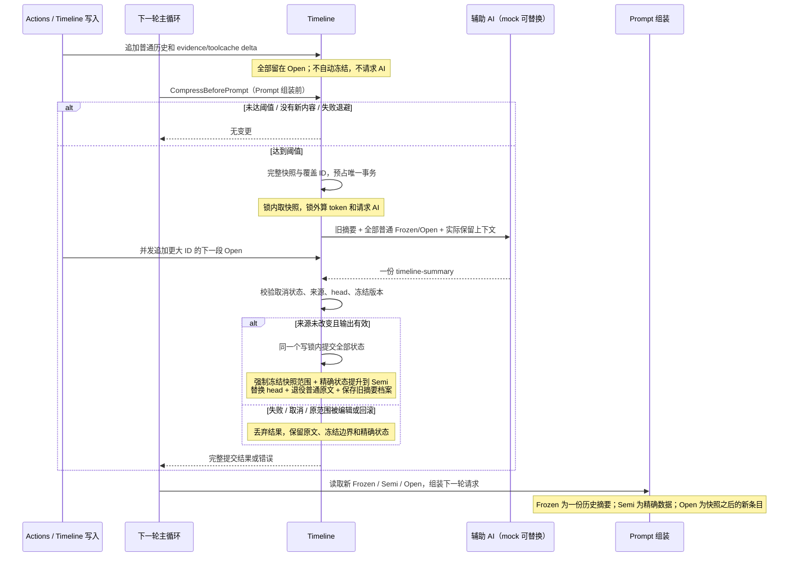

# Timeline 压缩：一次检查、一次摘要、一次提交

## 当前生产路径

主循环在 `generateLoopPrompt` 内、`AssembleLoopPrompt` 前调用 `compressTimelineBeforePrompt`，同步等待 `CompressBeforePrompt`。上一轮 actions 已完成，新一轮请求尚未组装。Push、渲染、Save、恢复、fork/merge 均不会自行发起 AI 压缩，也不会按时间或字节桶自动提升状态。

阈值沿用 `WithTimelineContentLimit` / `SetTimelineContentLimit` 的 token 配置，默认 Config 为 50 × 1024。它表示**触发阈值**，不是压缩后的目标体积。计算范围是旧摘要 + 全部普通 Frozen/Open + 尚未提升的精确状态 delta；已经提升到 Semi 的精确状态不计入可压缩范围。非正阈值关闭自动检查。没有新普通条目或待提升 delta 时，不重复压缩同一个 head。

本次没有改成 100K，也没有恢复“六分之一”或“保留最近原文”的算法。摘要按模板保留有用事实，不固定输出长度。256K 输入 / 16K 摘要是 Prompt 前压缩检查 的技术安全上限，可通过 `TimelineCompressionOptions` 覆盖；超过上限报错并保留完整原文，不截断、不拆批。

这不是“先 FreezeAll，再压缩”：事务提交前仍显示原布局，成功时只发布一次冻结版本。只有精确 delta、没有普通历史的特殊情况无需 AI，直接一次提交精确状态提升。

## 请求和输出

模板：`prompts/timeline/compression.txt`；输出协议：`prompts/timeline/compression.json`。

一次请求包含 `previous_summary`、`history_to_summarize` 和调用方传入的 `retained_context`。主循环传实际用户输入、冻结用户上下文、TODO、任务指令，避免摘要重复这些未被压缩的字段。evidence/tool schema 不进入待替换文本。历史中的 assistant + N tools 作为完整历史记录输入；只在请求副本去掉 projection nonce 并 JSON 编码，原 Timeline 不改写。

模型返回 `{"@action":"timeline-summary","summary":"历史摘要正文"}`。空值、非字符串、错误 action、超上限、带进程 projection nonce 的输出均拒绝。本实现只调度一次摘要任务，没有 batch/head-refine 二次调用；网络与解析重试仍服从原 Config 策略，因此不能把“一次事务”等同于所有异常下严格一次 HTTP 发包。

## 故障与并发边界

- 多个 Prompt 前压缩检查 遇到同一活动事务会等待；等待可取消。阈值计算之后再次核对快照，避免刚提交就被另一调用方重复压缩。
- 失败退避在唤醒等待者之前发布。同一失败快照不自动重复；新增内容后至少冷却一分钟再尝试。`CompressOnce` 是显式重试入口。
- 更大 ID 的并发追加留在下一段 Open；来源范围内插入、编辑、删除、回滚或 ID 重排导致旧摘要失效，拒绝提交。
- AI 期间不持有 Timeline 写锁；调用异常会释放事务占用。未提交状态不进入序列化或 fork。
- `TruncateAfter` 对落在当前摘要内部的回滚位置 返回错误并保持原状；摘要不能精确恢复某一部分原文。摘要之后的 Open 可正常回滚。删除采用双索引写时复制，避免恢复后幽灵条目和副本相互污染。
- fork 边界来自同一份序列化快照。合并先检查全部 ID 冲突；分支摘要作为新增历史条目写入父 Timeline，不能覆盖父分支并行产生的摘要/事实。
- 只有摘要、没有活跃原文的恢复仍保留并重排覆盖水位，避免新事件被错误归到 Frozen。

## 保存约束

`Save` 只序列化完整当前状态并写数据库；已删除旧 1.5 MiB 应用层限制、紧急裁剪和历史摘要自动清空。存储错误记录日志，内存内容不变。SQLite 的真实保存测试写入超过该旧上限的数据，逐字比对保存和恢复内容；这不代表无限存储保证。

旧摘要档案仍完整保留，只用于追溯，不叠加到当前 prompt。没有新增自动清理策略。旧外部归档元数据不再读取或写入；旧 reducer 格式仍一次性迁移为当前摘要。

## Timeline 接口审查

| 接口组 | 审查结果与边界 |
| --- | --- |
| PushText / PushTextWithPromptProjection / PushToolResult / PushUserInteraction | 仅追加；移除自动冻结和压缩；时间戳碰撞递增，不在锁内 sleep |
| PushPromotable / evidence 操作 / toolcache 写入与 reuse | 独立 delta 留在 Open；Prompt 前压缩检查 提交统一提升；精确数据不被摘要替代 |
| Dump / DumpForPrompt / DumpFrozenOpen / RenderTimelineFrozenOpen / GroupByMinutes / 最近消息视图 / UI 输出 | 只读呈现；读操作不改变冻结版本，不请求 AI；最近视图的裁剪属于调用方视图预算，不是 Timeline 压缩 |
| Freeze / FreezeAll / FreezeSnapshot | 保留显式导入/检查原语及兼容测试；全仓生产调用检索没有主链调用；Prompt 前压缩检查 不先调用这些方法，防止双提交 |
| SetTimelineContentLimit / bucket 配置 | token 阈值控制 Prompt 前压缩检查；桶配置只影响布局或显式冻结，不独立触发生产冻结 |
| SoftDelete / TruncateAfter | 双索引一致、写时复制；回滚跨摘要水位拒绝；会使活动压缩快照失效 |
| CopyReducibleTimelineWithMemory / CreateSubTimeline | 不复制压缩中任务；提交和删除不修改共享条目；摘要历史单独克隆 |
| ForkForTask / MergeBack / Diff | fork 水位与内容一致；冲突预检查；分支结果不覆盖父摘要；普通合并不自动冻结 |
| MarshalTimeline / UnmarshalTimeline / ReassignIDs | 保留精确状态与冻结水位；事务句柄不持久化；重排先构造再发布，非法 generator 保留原状态 |
| Save / ClearRuntimeConfig / SoftBindConfig / AICaller 配置 | Save 不压缩/裁剪；恢复绑定配置与调用器后，由下一轮 Prompt 前压缩检查 处理 |
| OrderInsertId / OrderInsertTs / GetIdToTimelineItem | 底层索引入口保留内部构建用途；直接修改底层对象不属于受支持的并发写协议，生产写入应使用 Push/状态接口 |

## 文件与清理结果

压缩实现集中在 `timeline_compression_{before_prompt,snapshot,summary,transaction,freeze,persistence,restore}.go`。主循环入口在 `reactloops/timeline_compression_before_prompt.go`。相关测试统一在 `timeline_compression_*_test.go`；普通 Timeline/evidence/toolcache 的非压缩生命周期测试仍留在自己的模块。

已移除：Push 异步 dumpSizeCheck、batch/recent-tail 切分、head-refine、旧 reducer 模板/结构化摘要裁剪、保存时 emergencyCompress、1.5 MiB 限制、无效 perDumpContentLimit、旧外部归档类型、存储配置及专用分表路径、旧 forkProtectedMaxID/autoCompressDisabled 开关。仅为旧算法断言批次数、固定比例、紧急裁剪、伪造压缩状态的测试删除，有效恢复/投影/精确状态断言迁移到新事务测试。

## 测试定位

| 验证范围 | 文件 |
| --- | --- |
| 阈值、增长、一次提交、退避、并发等待、重复检查 | `timeline_compression_before_prompt_test.go` |
| 快照内容、完整 assistant/tools、nonce、超长原文 | `timeline_compression_snapshot_test.go` |
| 模板、单次调度、输出协议与上限 | `timeline_compression_summary_test.go` |
| 原子提交、并发追加、来源失效、取消、失败保持、mock 样例 | `timeline_compression_transaction_test.go` |
| 精确 evidence/toolcache 的 Open→Semi 与恢复 | `timeline_compression_evidence_test.go`、`timeline_compression_toolcache_test.go` |
| 实际 SQLite 大快照、保存失败、摘要水位、回滚/副本隔离 | `timeline_compression_persistence_test.go` |
| ID 重排、显式冻结、历史视图/摘要渲染 | `timeline_compression_restore_test.go`、`timeline_compression_freeze_test.go`、`timeline_compression_views_test.go`、`timeline_compression_render_test.go` |
| 压缩分支的合并、冲突无部分写入 | `timeline_compression_fork_test.go` |
| 下一轮 Prompt 实际读取已提交摘要 | `reactloops/timeline_compression_before_prompt_test.go` |

本轮只使用本地 mock 和 SQLite，不请求真实模型；缓存命中率提升需要后续实测，不能由这些测试直接推断。
