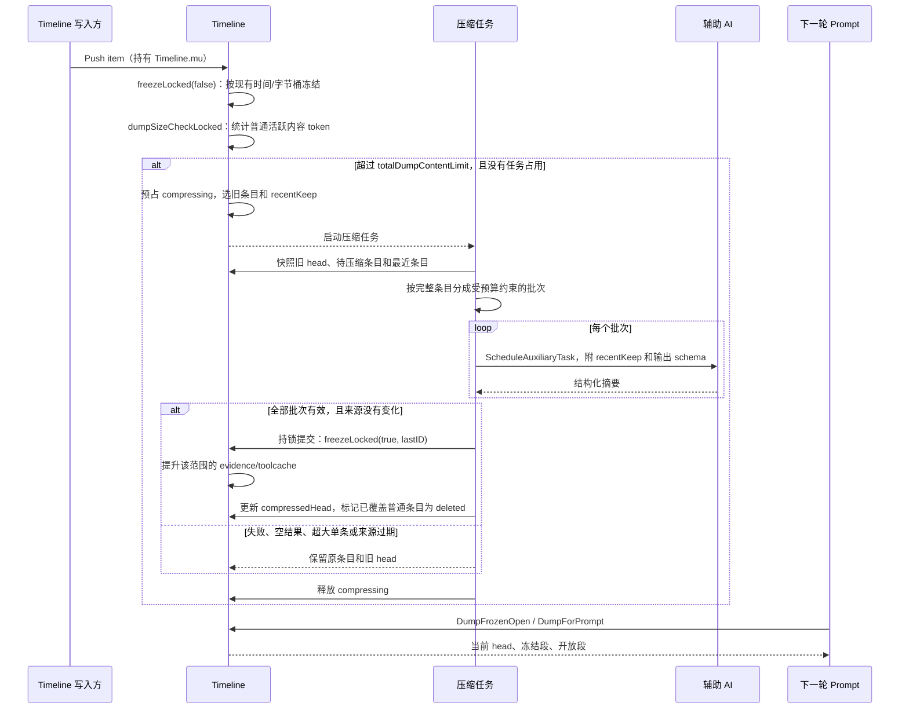
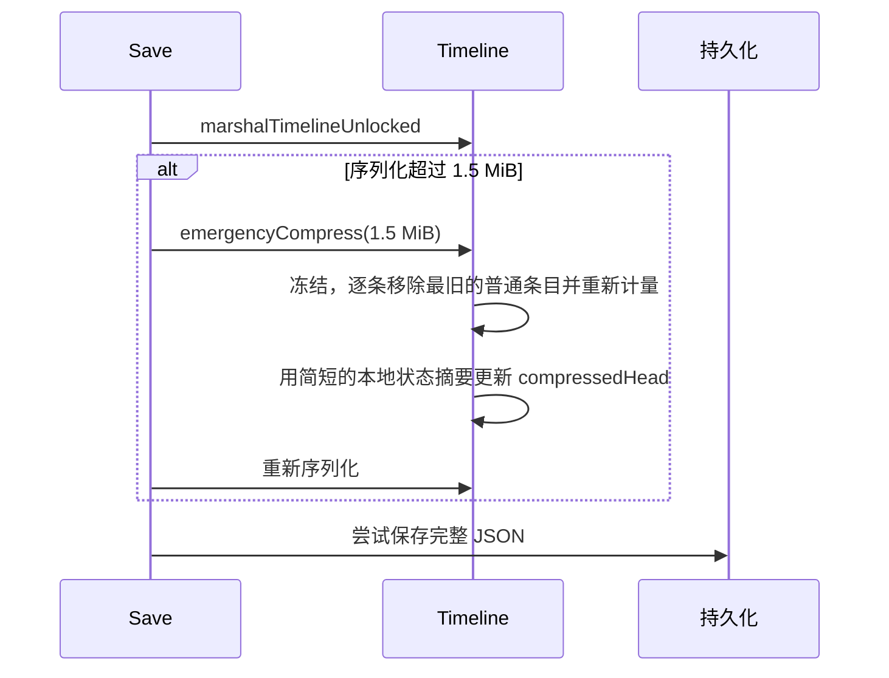

# Timeline 压缩现状

入口和实现集中在 `timeline_compression.go`，主 Timeline 的追加入口在 `timeline.go`，冻结和提升在 `timeline_freeze.go`，持久化格式在 `timeline_marshal.go`。压缩相关测试按 `timeline_compression*_test.go` 查找；evidence、toolcache 的生命周期断言仍在各自的专属测试中。

## 正常的 AI 压缩

当前触发量取自 `calculateActualContentSizeLocked`：它统计普通活跃条目的缩减后文本，不计 promotable item 和旧 head。`SetTimelineContentLimit` 只设置阈值；追加条目时才执行检查。测试或内部调用方也可通过 `compressForSizeLimit()` 主动检查。触发后约保留最新 `currentSize / 6` 的原始内容。reducer 输入按完整条目切为最多约 80 KiB 的批次，recentKeep 参考内容最多约 16 KiB；所有批次成功才提交。历史摘要保存在 `compressedHead`，旧版 head 进入 `compressedHistory` 供追溯；投影中的 head 标签保持稳定。

**目前仍有独立冻结。** 每次追加先调用 `freezeLocked(false)`；3 分钟时间桶或 64 KiB 默认字节桶可在 AI 压缩前改变 Frozen/Open 分界。本次整理没有改变这些策略，也没有将正常冻结与压缩合并为唯一触发。压缩任务提交时的强制冻结、提升和条目退役则在同一把锁下完成。

## 保存体积的兜底

紧急路径不调用 AI，只保留简短状态，因此语义损失比正常摘要大。它只作为保存体积兜底：AI 调度器缺失、请求失败或返回空结果，不再把普通压缩自动转为紧急删除。若紧急路径仍无法降到保存上限，`Save` 会明确记录这一点并尝试保存完整 JSON；代码没有截断 JSON。

## 后续调整的边界

### 新压缩方案第 1 步：范围和预算（尚未接入生产）

`buildCompressionSnapshot(summaryReserve)` 只构建独立快照，不冻结、不提升、不删除，也不调用 AI。生产仍使用上文的原有入口。

1. 读锁内复制当前摘要、普通 Frozen/Open 条目和覆盖水位 `ThroughID`；条目按 ID 排序，并保存原始序列化内容，供后续提交阶段检查来源是否变化。Evidence/toolcache 的 promotable 条目只记录在 `ExactItemIDs`，不进入摘要输入和候选删除列表。
2. 释放锁后计算预算：`TargetTokens = InputTokens / 6`，其中 `InputTokens` 包含旧摘要和完整普通历史。计量使用本地 tokenizer，不是网关账单，也不包含未来最终块的外层包装。
3. 先扣除调用方显式指定的摘要最低预算，再从末尾按完整条目选择连续最近原文；剩余预算全部留给摘要。原文保留完整正文，不使用旧的单条 shrink 结果，也不经过可能丢失超长单行的展示渲染器。
4. 当前原生交互的一个 assistant 和全部 N 个 tool 回执已经存于同一专用条目。快照校验其完整协议，再整条保留或整条进入待摘要区；普通用户文本中的标签不解释成协议。最近完整条目放不下、回放损坏或预算不足时返回错误，原 Timeline 不变。
5. 未来提交只能处理 `Items[:RecentStart]` 中明确列出的普通条目，不能直接删除所有 `ID <= ThroughID`。快照建立后追加的条目不在该范围，留给下一段 Open。真正冻结及原子提交留到后续步骤实现。

验收集中在 `timeline_compression_snapshot_test.go`：旧摘要参与预算、精确状态排除、快照与后续追加隔离、完整 assistant + 多 tool 的真实投影、超长正文与错误边界。最终摘要生成后仍需校验实际输出和最终块包装的总预算；本步骤不承诺模型输出必然符合六分之一目标。

### 当前生产路径仍待处理的边界

- 压缩阈值是普通活跃条目的局部计数，不能直接当作整个模型请求的 token 上限。
- `MaxTimelineSaveSize` 是独立的序列化体积上限。提高正常压缩阈值前，需要同步评估这个保护和数据库容量。
- 大于单批输入预算的单个条目仍保持原文并报警，尚无可靠的条目内部拆分方案。
- `compressedHistory` 会随摘要次数增长，并参与持久化，但不参与当前 Prompt。它过大时，逐条删除普通历史也未必能把保存体积降到上限；需要单独制定历史保留策略。
- `perDumpContentLimit` 只在旧持久化结构和拷贝路径中保留，当前压缩触发不读取它；本轮没有改变旧存档的反序列化兼容。
- 改动冻结周期时，要同时观察 evidence/toolcache 的提升时机，以及 Frozen/Open 布局对缓存的影响。
