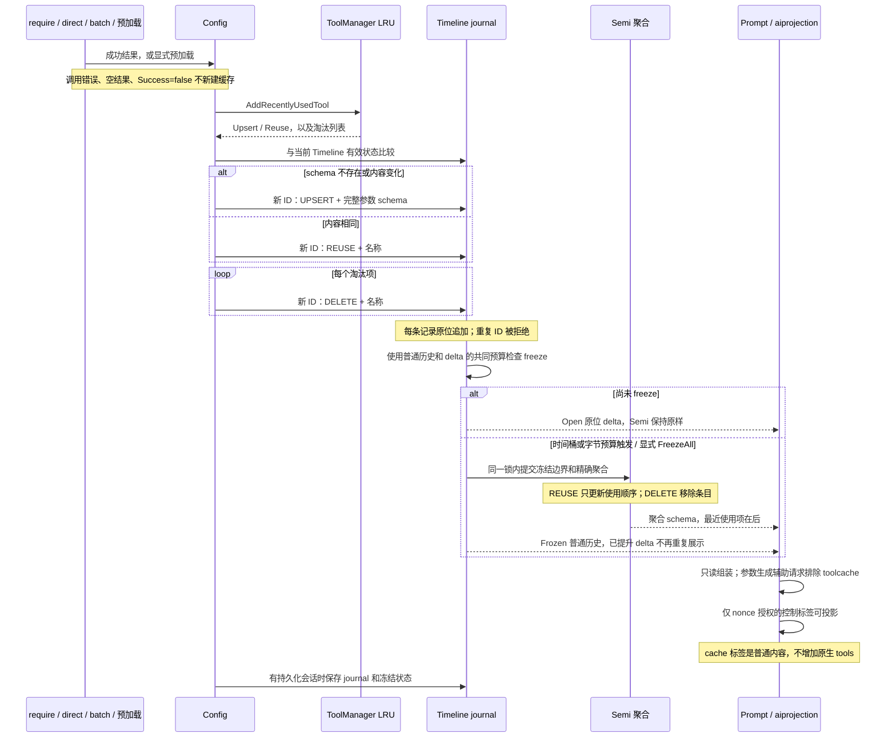
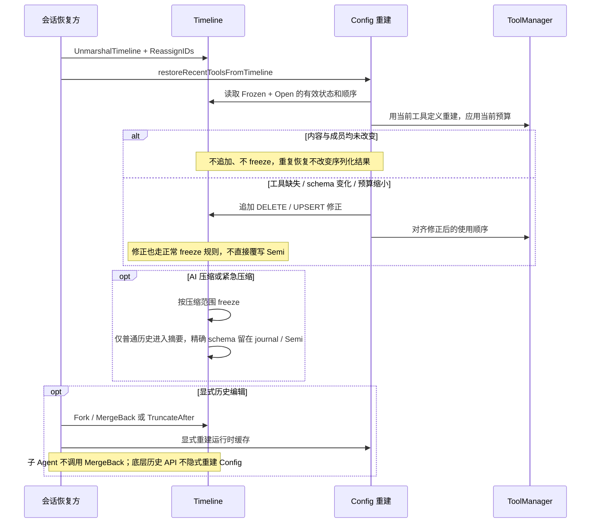

# Tool-call cache 生命周期审查

本轮范围：recent-tool cache 的会话写入、Timeline journal、freeze、prompt 投影、持久化恢复、淘汰、压缩与显式 fork/回滚重建。它是参数 schema 缓存，不是工具授权表；实际调用仍须经过当前工具查找、参数校验和审核。

## 写入与展示

## 恢复、压缩和历史编辑

## 审查与清理结果

| 环节 | 结论与处理 | 测试入口 |
|---|---|---|
| require/direct/batch | 删除三处分散的成功判断，统一到 `recordSuccessfulToolCache`；修复 require 对失败 result 的缓存 | `loopinfra/timeline_toolcache_action_test.go`；批量 handler 用例；ReAct require→direct 用例 |
| 显式预加载 | 浏览器和推荐工具均走 `RecordRecentlyUsedTool`；不是一次执行，不套用 result 条件 | `TestAttachedBrowserResourcePromotesBridgeTools`、`TestPreloadSingleRecommendedTool` |
| 参数 schema | 删除挑选少数字段的旧渲染逻辑，保留 allOf 等约束和原始 description；普通业务字段 `params` 不再误解包；去掉共享 schema 中强加的文本协议说明 | `buildinaitools/timeline_toolcache_schema_test.go` |
| LRU 与预算 | 保留底层管理职责，返回 detached mutation/snapshot；保留一个超预算最新项以允许继续执行 | `buildinaitools/timeline_toolcache_manager_test.go` |
| Journal 不可覆盖 | 拒绝已有 ID，避免覆盖冻结记录及破坏双索引；更新只能使用新 ID | `TestTimelineToolCacheRejectsOverwriteOfExistingID` |
| Open / Semi | 复用只追加小 delta；排序在对应 delta freeze 后变化；渲染不触发提升 | `timeline_toolcache_test.go`、`timeline_toolcache_lifecycle_test.go` |
| 共同 freeze | evidence、普通历史和 cache delta 共用预算；边界与聚合同时提交 | `TestTimelineToolCacheInPlaceAndSharedFreeze`、`timeline_freeze_test.go` |
| 恢复与淘汰 | 恢复待冻结 reuse/delete；清理缺失工具和预算淘汰；schema 更新写新 delta；文本历史不能复活缓存 | `timeline_toolcache_runtime_test.go` |
| 压缩 | 补充真实单次摘要与原子提交路径；精确 schema 不进入摘要，恢复后仍能追加 REUSE | `timeline_compression_toolcache_test.go` |
| Fork / 回滚 | 测试明确包含历史操作后的显式缓存重建；不把底层 Timeline 操作误称为自动 Config 同步 | `TestTimelineToolCacheRuntimeForkMergeAndRollback` |
| 投影与参数生成 | cache 不能声明原生工具；文本和 function-call 参数生成均排除缓存，普通文本相似标签不被误删 | `aireact/timeline_toolcache_prompt_test.go`、`prompt_tool_params_functioncall_test.go` |
| 实际执行与持久化 | 文本与 native loop 都实际执行两次工具，产生一份 schema + REUSE；跨持久化会话 require→direct | `aireact/timeline_toolcache_execution_test.go`、`TestReAct_DirectlyCallTool_PersistentSession` |

合并重复去重断言，删除重复的简单排序测试；统一核心测试名为 `TestTimelineToolCache*`，管理器测试集中至 `timeline_toolcache_manager_test.go`。未为了减少文件而删除 nil、防篡改快照、超预算、并发、恶意标签等边界测试。

已移除的旧路径仍不存在：`ForcePromoteAll`、`HasPromotableKind`、独立 Open `Promoted State Updates`、绕开 Timeline 的会话 fallback、可见内容 HTML 转义。`high_static_section.txt` 不修改。

## 必须保留的内容与边界

- 原始 control journal 支持恢复、重放和回滚；不是可以直接丢弃的重复 schema。长期 journal 大小不等于 LRU 当前预算，压缩也不擅自清除这些记录。
- 旧快照缺少 `LastUsedItemID` 时按 `SourceItemID` 排序，以及旧 promotion watermark 到 freeze 状态的迁移，均有兼容测试，保留。
- 文本模式的 `TOOL_PARAM_*` 解析仍有实际调用，保留；它与 cache 标签共同使用的信息性后缀不是 projection nonce。
- 能力管理器的共享政策没有在这次局部审查中重写。多个不同 Timeline 若共用同一个 ToolManager，其运行时 LRU 仍共享；本轮“并发一致”测试针对同一 Timeline 的写入，fork 隔离测试使用独立 manager。不能据此宣称不同 Timeline 的运行时缓存已经完全隔离。独立 LRU 与共享能力注册表的拆分需要单独定策。
- `MergeBack` / `TruncateAfter` 不隐式调用 Config 重建；图中明确画出了额外调用。生产阶段合并和子 Agent 上下文有各自边界，不能把测试中的显式重建当成生产自动回调。

## 验证

采用本地 mock，无真实模型请求。回归覆盖管理器、Timeline、ReAct loop、action handler、两种 prompt 协议及持久化会话；另构建整个 `common/ai/aid/...` 包树。运行结果由本次审查回复记录。

2026-09-27 本地验证：112 项顶层定向测试通过（包含两种调用协议、真实压缩路径与跨会话恢复），五个包均通过；`go build -p 1 ./common/ai/aid/...` 通过。三个新增缺陷回归在修复前失败，修复后通过。未运行真实模型评测，未将本地回归结果解释为线上缓存命中率提升。
