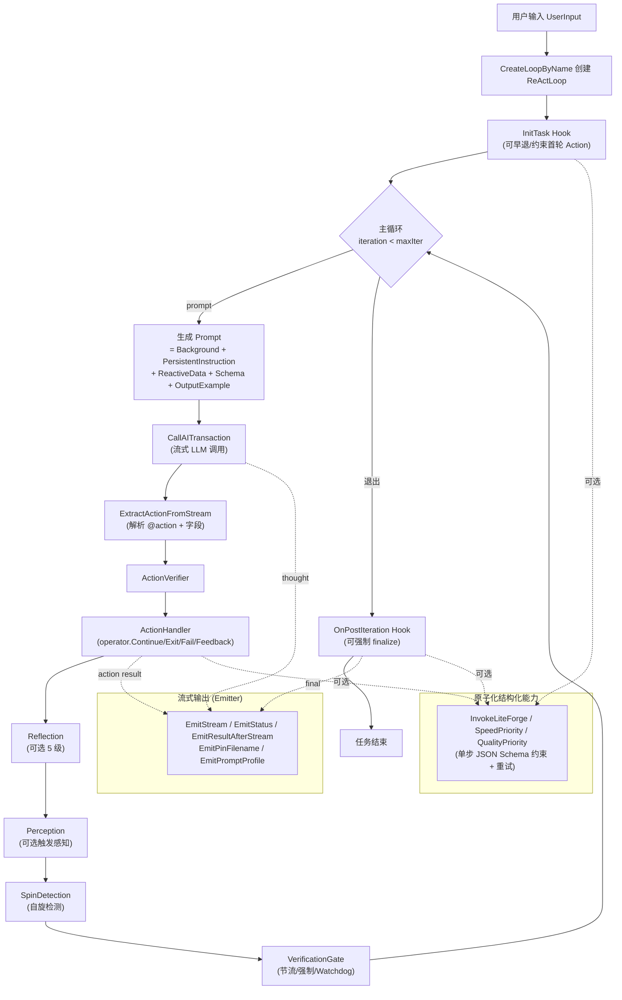

# ReActLoops 专注模式 / Focus Mode

> 高度可定制化的 AI 原子任务执行系统：把 ReAct 的非确定性 LLM 推理与确定性的工程能力（Hook、LiteForge、验证门、自旋检测）拼成可组合的领域子循环。

## 一句话定位

`reactloops` 不是一个普通的 Agent 框架，它解决的核心问题是：

**"如何让大模型驱动的多步任务，在保持灵活性的同时，能用工程化手段约束、注入、验证、终止？"**

每一个 `loop_xxx/` 目录就是一种 **专注模式（focus mode）** ——围绕某个领域（HTTP 模糊测试、流量分析、代码审计、SyntaxFlow 规则、Yaklang 代码生成、知识增强问答……）封装好 prompt、actions、初始化逻辑、收尾逻辑、流式 UI 事件，让上层只需要 `CreateLoopByName(name, invoker, opts...)` 即可启动一个高度自治但又有"边界"的子循环。

## 概念图



五大扩展点：

1. **Prompt 系统**：模板 `prompts/loop_template.tpl` + `PersistentInstruction` + `ReactiveData` + `OutputExample` + 动态 Schema。
2. **Action 体系**：内置 / loopinfra 通用 / 从 Tool 派生 / 从子 Loop 派生 四种来源。
3. **生命周期 Hook**：`InitTask` / `OnPostIteraction` / `OnLoopInstanceCreated` / 异步任务回调。
4. **Emitter 流式输出**：把任务进度、思考、结果以事件流推给 UI。
5. **确定性机制**：感知（Perception）+ 反思（Reflection）+ 自旋检测（SpinDetection）+ 验证门（VerificationGate）。

## 已注册的专注模式速查

下表按推荐学习顺序排列，复杂度从低到高。

| 名称 | 用途 | 复杂度 | 关键定制点 |
|------|------|--------|-----------|
| [loop_default](loop_default) | 通用 ReAct 入口，没有领域定制 | 低 | 几乎只用了默认 actions，是入门示例 |
| [loop_intent](loop_intent) | 深度意图识别 + 推荐能力 | 低 | `WithDisableLoopPerception`、`WithReactiveDataBuilder`、自定义意图 action |
| [loop_smart_qa](loop_smart_qa) | 智能问答（带知识增强） | 中 | 启用 RAG、自定义 finalize |
| [loop_knowledge_enhance](loop_knowledge_enhance) | 知识库检索增强答案 | 中 | 多步 LiteForge 评估 |
| [loop_internet_research](loop_internet_research) | 联网研究 | 中 | 自定义 web_search action + finalize 总结 |
| [loop_dir_explore](loop_dir_explore) | 目录探索 | 中 | LiteForge 抽路径、限定 actions |
| [loop_report_generating](loop_report_generating) | 报告生成 | 中 | LiteForge 判断改文件 vs 新建 |
| [loop_ai_skill_audit](loop_ai_skill_audit) | AI 技能审计 | 中 | 自定义 audit state |
| [loop_yaklangcode](loop_yaklangcode) | Yaklang 代码生成 | 中 | 多步 LiteForge + 样本 grep |
| [loop_write_python_script](loop_write_python_script) | Python 脚本生成 | 中 | 类似 yaklangcode 但语种不同 |
| [loop_syntaxflow_rule](loop_syntaxflow_rule) | SyntaxFlow 规则编写 | 中 | 多步 LiteForge 分阶段规划 |
| [loop_java_decompiler](loop_java_decompiler) | Java 反编译辅助 | 中 | 专门的反编译相关 actions |
| [loop_code_security_audit](loop_code_security_audit) | 代码安全审计 | 高 | 多阶段（scan/verify）、特殊 finding 事件 |
| [loop_http_flow_analyze](loop_http_flow_analyze) | HTTP 流量分析 | 高 | 强制 finalize fallback、多种 match action |
| [loop_infosec_recon](loop_infosec_recon) | 信息安全侦察 | 高 | 多工具组合、复杂 init |
| [loop_plan](loop_plan) | 文档化任务规划 | 高 | 多步 LiteForge、生成 plan 文档 |
| [loop_http_fuzztest](loop_http_fuzztest) | HTTP 模糊测试（最复杂） | **极高** | **所有扩展点几乎都用到**，推荐作为模板 |

> **新人推荐路径**：先读 [loop_default](loop_default/base.go) 理解最小骨架 → 读 [loop_intent](loop_intent/init.go) 理解 ContextProvider → 读 [loop_http_flow_analyze](loop_http_flow_analyze/init.go) 理解 finalize hook → 最后挑战 [loop_http_fuzztest](loop_http_fuzztest/init.go)。

## 文档索引

| 文档 | 内容 |
|------|------|
| [docs/01-architecture.md](docs/01-architecture.md) | `ReActLoop` 字段分组、主循环走读、状态机、`LoopActionHandlerOperator` 语义 |
| [docs/02-options-reference.md](docs/02-options-reference.md) | 所有 `With*` 选项分组完整参考（默认值/示例/源码引用） |
| [docs/03-prompt-system.md](docs/03-prompt-system.md) | `loop_template.tpl` 占位符、两层渲染、PersistentInstruction / ReactiveData / OutputExample / Schema |
| [docs/04-actions.md](docs/04-actions.md) | `LoopAction` 数据结构、4 种来源、流式字段、operator 控制 |
| [docs/05-hooks-and-lifecycle.md](docs/05-hooks-and-lifecycle.md) | `InitTask` / `OnPostIteraction` / `OnLoopInstanceCreated` / 异步任务钩子 |
| [docs/06-emitter-and-streaming.md](docs/06-emitter-and-streaming.md) | `Emitter` 结构、流式机制、事件速查表、UX 最佳实践 |
| [docs/07-liteforge.md](docs/07-liteforge.md) | LiteForge 定位、API、三档优先级、在各 loop_xxx 的应用、实战示例 |
| [docs/08-determinism-mechanisms.md](docs/08-determinism-mechanisms.md) | 感知 / 反思 / 自旋检测 / 验证门四件套 + 调参组合 |
| [docs/09-capabilities.md](docs/09-capabilities.md) | Capability 体系、`ExtraCapabilitiesManager`、`load_capability` 的 4 种身份、子 loop 作为能力 |
| [docs/10-build-your-own-loop.md](docs/10-build-your-own-loop.md) | **重头戏**：12 步端到端教程 + checklist，所有样板代码 |
| [docs/11-case-studies.md](docs/11-case-studies.md) | 17 个 loop_xxx 横向对比表 + 5 个重点细讲 |
| [docs/12-debugging-and-observability.md](docs/12-debugging-and-observability.md) | `YAKIT_AI_WORKSPACE_DEBUG`、调试产物、prompt observation、timeline、测试基建 |
| [docs/13-yak-focus-mode.md](docs/13-yak-focus-mode.md) | **进阶**：用 Yak 脚本（`*.ai-focus.yak`）写专注模式 + sidekick 自动加载 + `yak ai-focus` CLI + 三种调试模式 + `~/yakit-projects/ai-focus/` 用户扩展目录 |

## 最小上手样板

下面是一个**最简单**的自定义专注模式，只为说明骨架。生产级实现请参考 [loop_http_fuzztest/init.go](loop_http_fuzztest/init.go)。

```go
package loop_my_focus

import (
    _ "embed"
    
    "github.com/yaklang/yaklang/common/ai/aid/aicommon"
    "github.com/yaklang/yaklang/common/ai/aid/aireact/reactloops"
    "github.com/yaklang/yaklang/common/ai/aid/aitool"
    "github.com/yaklang/yaklang/common/log"
)

//go:embed prompts/persistent_instruction.txt
var instruction string

func init() {
    err := reactloops.RegisterLoopFactory(
        "my_focus",
        func(r aicommon.AIInvokeRuntime, opts ...reactloops.ReActLoopOption) (*reactloops.ReActLoop, error) {
            preset := []reactloops.ReActLoopOption{
                reactloops.WithMaxIterations(20),
                reactloops.WithAllowToolCall(true),
                reactloops.WithAllowRAG(false),
                reactloops.WithPersistentInstruction(instruction),

                reactloops.WithRegisterLoopAction(
                    "my_custom_action",
                    "do something specific to my domain",
                    []aitool.ToolOption{
                        aitool.WithStringParam("target", aitool.WithParam_Required(true)),
                    },
                    func(loop *reactloops.ReActLoop, action *aicommon.Action) error {
                        if action.GetString("target") == "" {
                            return utils.Error("target is required")
                        }
                        return nil
                    },
                    func(loop *reactloops.ReActLoop, action *aicommon.Action, op *reactloops.LoopActionHandlerOperator) {
                        target := action.GetString("target")
                        log.Infof("processing target: %s", target)
                        op.Feedback("done with target: " + target)
                        op.Continue()
                    },
                ),

                reactloops.WithInitTask(func(loop *reactloops.ReActLoop, task aicommon.AIStatefulTask, op *reactloops.InitTaskOperator) {
                    log.Info("my_focus init")
                }),

                reactloops.WithOnPostIteraction(func(loop *reactloops.ReActLoop, iteration int, task aicommon.AIStatefulTask, isDone bool, reason any, op *reactloops.OnPostIterationOperator) {
                    if !isDone {
                        return
                    }
                    log.Info("my_focus finalize")
                }),
            }
            preset = append(preset, opts...)
            return reactloops.NewReActLoop("my_focus", r, preset...)
        },
        reactloops.WithLoopDescription("my custom focus mode"),
        reactloops.WithLoopDescriptionZh("我的自定义专注模式"),
    )
    if err != nil {
        panic(err)
    }
}
```

然后在 [reactinit/init.go](reactinit/init.go) 加一行空白 import：

```go
import (
    _ "github.com/yaklang/yaklang/common/ai/aid/aireact/reactloops/loop_my_focus"
)
```

完整教程见 [docs/10-build-your-own-loop.md](docs/10-build-your-own-loop.md)。

## 常见任务索引

| 任务 | 看哪一章 |
|------|----------|
| 想加一个新工具 | [04-actions.md](docs/04-actions.md) 来源 3：从 Tool 派生 |
| 想插入一个确定性 LLM 调用（结构化抽参） | [07-liteforge.md](docs/07-liteforge.md) |
| 想自定义 prompt | [03-prompt-system.md](docs/03-prompt-system.md) |
| 想嵌套调用另一个专注模式 | [04-actions.md](docs/04-actions.md) 来源 4 + [09-capabilities.md](docs/09-capabilities.md) |
| 想在循环结束时强制写一个 Markdown 报告 | [05-hooks-and-lifecycle.md](docs/05-hooks-and-lifecycle.md) `OnPostIteraction` |
| 想让模型在执行后自检 | [08-determinism-mechanisms.md](docs/08-determinism-mechanisms.md) Reflection / Verification |
| 想防止模型重复调用同一个 action | [08-determinism-mechanisms.md](docs/08-determinism-mechanisms.md) Spin Detection |
| 想让 UI 实时显示思考过程 | [06-emitter-and-streaming.md](docs/06-emitter-and-streaming.md) |
| 想从零写一个新专注模式 | [10-build-your-own-loop.md](docs/10-build-your-own-loop.md) |
| 想知道某个具体 loop 怎么实现的 | [11-case-studies.md](docs/11-case-studies.md) |
| 出问题想调试 | [12-debugging-and-observability.md](docs/12-debugging-and-observability.md) |
| 想用 yak 脚本写专注模式（不重新编译） | [13-yak-focus-mode.md](docs/13-yak-focus-mode.md) |

## 核心约定

- **空白 import 注册**：所有 `loop_xxx/` 子包通过 `init()` 调 `RegisterLoopFactory`，最终在 [reactinit/init.go](reactinit/init.go) 用 `_` import 触发副作用。新增 loop 必须更新这里。
- **不允许循环依赖**：`loop_xxx/` 子包只能依赖 `reactloops`、`loopinfra`、`aicommon`、`aiforge`，不允许互相依赖。如要嵌套，使用 `WithActionFactoryFromLoop(name)` 或 `ExecuteLoopTaskIF`。
- **三大调用优先级**：`InvokeLiteForge`（quality 默认）、`InvokeSpeedPriorityLiteForge`（速度优先）、`InvokeQualityPriorityLiteForge`（强制 quality）。详见 [07-liteforge.md](docs/07-liteforge.md)。
- **日志要求**：项目规则要求 `log` 输出全部使用英文；中文允许出现在注释和 prompt 中。

## 维护

- 模块路径：`common/ai/aid/aireact/reactloops/`
- 入口：[register.go](register.go)、[reactloop.go](reactloop.go)、[exec.go](exec.go)
- 测试：`*_test.go` + [reactloopstests/](reactloopstests) 集成测试

---

**进一步阅读**：从 [docs/01-architecture.md](docs/01-architecture.md) 开始。
