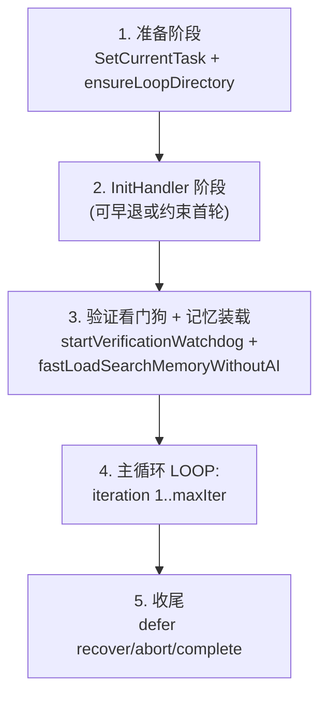
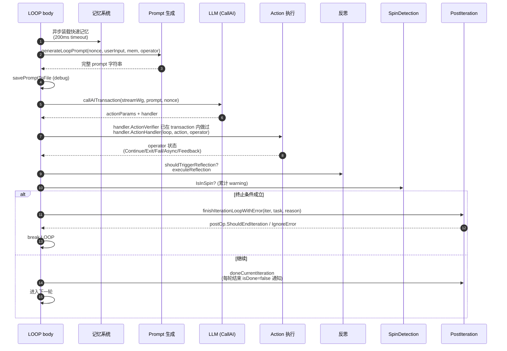
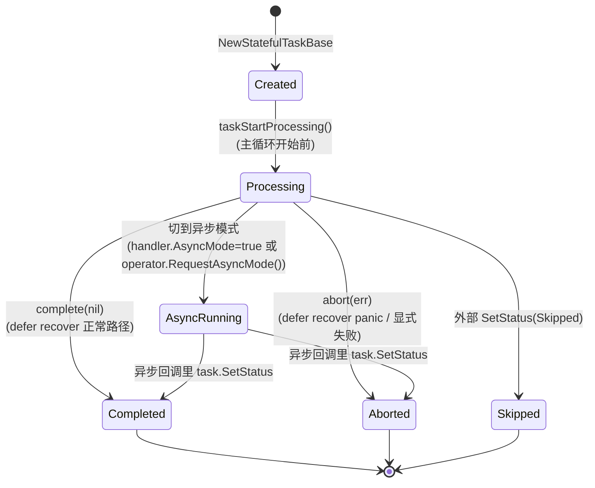
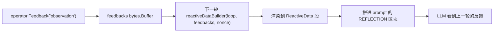

# 01. 架构与执行流程

> 回到 [README](../README.md)

本章是理解整个系统的基础。读完后你应该能回答：

- `ReActLoop` 这个对象的"灵魂"是什么？
- 一个用户输入到底是怎样在 `LOOP:` 里被处理的？
- 状态机有几个状态、退出条件有几种？
- `LoopActionHandlerOperator` 的每个方法到底语义是什么？

## 1.1 `ReActLoop` 字段分组

`ReActLoop` 定义在 [reactloop.go](../reactloop.go)。它的字段非常多，但按职责可以分成 9 组：

### A. 运行时与配置

| 字段 | 类型 | 作用 |
|------|------|------|
| `invoker` | `aicommon.AIInvokeRuntime` | 上层 ReAct 运行时，提供 `CallAI` / `EmitResult` / `AddToTimeline` 等基础设施 |
| `config` | `aicommon.AICallerConfigIf` | AI 调用配置（model 选择、retry、timeline、emitter） |
| `emitter` | `*aicommon.Emitter` | 流式事件发射器（参见 [06-emitter-and-streaming.md](06-emitter-and-streaming.md)） |
| `loopName` | `string` | 当前 loop 注册名（用于 timeline / debug 目录前缀） |
| `maxIterations` | `int` | 最大迭代次数，默认 100 |

### B. Prompt Provider（懒求值，每轮重新计算）

| 字段 | 类型 | 作用 |
|------|------|------|
| `persistentInstructionProvider` | `ContextProviderFunc` | 持久指令（长期规则） |
| `reflectionOutputExampleProvider` | `ContextProviderFunc` | 输出示例（含反思格式） |
| `reactiveDataBuilder` | `FeedbackProviderFunc` | 上一轮反馈 + 各 loop 自己的动态状态 |
| `loopPromptGenerator` | `ReActLoopCoreGenerateCode` | 极少使用，覆盖整个 prompt 生成逻辑 |
| `toolsGetter` | `func() []*aitool.Tool` | 在基础 prompt 模板里展示工具列表 |

详见 [03-prompt-system.md](03-prompt-system.md)。

### C. 能力开关（决定注册哪些 loopinfra 内置 action）

全部是 `func() bool`，因为开关可能在运行时变化（如异步任务切换后禁用 plan）：

```go
allowAIForge      func() bool
allowPlanAndExec  func() bool
allowRAG          func() bool
allowToolCall     func() bool
allowUserInteract func() bool
allowSkillLoading func() bool
allowSkillViewOffset func() bool
```

这些 getter 在 `NewReActLoop` 末尾决定是否把 `require_ai_blueprint` / `request_plan_execution` / `knowledge_enhance` / `require_tool` / `ask_for_clarification` / 技能相关 action 加进 `r.actions`。详见 [04-actions.md](04-actions.md)。

### D. Action 注册表

| 字段 | 类型 | 作用 |
|------|------|------|
| `actions` | `*omap.OrderedMap[string, *LoopAction]` | 直接实例（具体 LoopAction） |
| `loopActions` | `*omap.OrderedMap[string, LoopActionFactory]` | 工厂模式（按需懒创建，如子 loop 派生的 action） |
| `actionFilters` | `[]func(*LoopAction) bool` | 在 `generateSchemaString` 里决定哪些 action 暴露给 AI |
| `initActionMustUse` | `[]string` | 由 `InitTaskOperator.NextAction` 设置，仅首轮约束 |
| `initActionDisabled` | `[]string` | 由 `InitTaskOperator.RemoveNextAction` 设置 |

### E. 流式字段解析

| 字段 | 类型 | 作用 |
|------|------|------|
| `streamFields` | `*omap.OrderedMap[string, *LoopStreamField]` | JSON 字段流（如 `human_readable_thought`） |
| `aiTagFields` | `*omap.OrderedMap[string, *LoopAITagField]` | AI tag 流（如 `<FINAL_ANSWER>`） |

详见 [06-emitter-and-streaming.md](06-emitter-and-streaming.md)。

### F. 任务与生命周期回调

| 字段 | 类型 | 作用 |
|------|------|------|
| `currentTask` | `aicommon.AIStatefulTask` | 当前正在执行的任务 |
| `taskMutex` | `*sync.Mutex` | 保护 `currentTask` |
| `onTaskCreated` | `func(task)` | 任务创建后回调 |
| `onAsyncTaskTrigger` | `func(action, task)` | 切到异步模式时 |
| `onAsyncTaskFinished` | `func(task)` | 异步任务完成 |
| `onPostIteration` | `[]func(...)` | **每轮**结束 + **整个循环**结束都会调用 |
| `onLoopInstanceCreated` | `func(loop)` | `CreateLoopByName` 拿到工厂返回值后立即回调 |
| `initHandler` | `func(loop, task, op)` | 主循环开始之前的初始化 |

详见 [05-hooks-and-lifecycle.md](05-hooks-and-lifecycle.md)。

### G. 验证与确定性机制

| 字段 | 类型 | 作用 |
|------|------|------|
| `periodicVerificationInterval` | `int` | 周期性验证的迭代间隔 |
| `verificationRuntimeSnapshot` | `*VerificationRuntimeSnapshot` | 上次验证的快照（用于节流） |
| `verificationMutex` | `*sync.Mutex` | 保护快照 |
| `verificationWatchdogTimer` | `*time.Timer` | 看门狗，长期无验证活动则强制触发 |
| `sameActionTypeSpinThreshold` | `int` | 同 action type 自旋阈值，默认 3 |
| `sameLogicSpinThreshold` | `int` | AI 深度自旋检测阈值 |
| `consecutiveSpinWarnings` | `int` | 当前连续自旋警告数 |
| `maxConsecutiveSpinWarnings` | `int` | 最大允许的连续警告，超过则强退 |
| `enableSelfReflection` | `bool` | 是否开启反思 |
| `perception` | `*perceptionController` | 感知层控制器（可被 `WithDisableLoopPerception` 关闭） |

详见 [08-determinism-mechanisms.md](08-determinism-mechanisms.md)。

### H. 记忆与历史

| 字段 | 类型 | 作用 |
|------|------|------|
| `memorySizeLimit` | `int` | 记忆池大小上限（字节） |
| `currentMemories` | `*omap.OrderedMap[string, *MemoryEntity]` | 当前记忆池 |
| `memoryTriage` | `aicommon.MemoryTriage` | 记忆检索器 |
| `historySatisfactionReasons` | `[]*satisfactionRecord` | 验证满意度历史 |
| `actionHistory` | `[]*ActionRecord` | 已执行的 action 列表（用于自旋检测） |
| `actionHistoryMutex` | `*sync.Mutex` | 保护 actionHistory |
| `currentIterationIndex` | `int` | 当前迭代序号 |

### I. 杂项

| 字段 | 类型 | 作用 |
|------|------|------|
| `vars` | `*omap.OrderedMap[string, any]` | loop 内部 KV 状态（动作之间共享） |
| `extraCapabilities` | `*ExtraCapabilitiesManager` | 动态发现的能力（参见 [09-capabilities.md](09-capabilities.md)） |
| `skillsContextManager` | `*aiskillloader.SkillsContextManager` | 技能上下文 |
| `noEndLoadingStatus` | `bool` | 结束时是否发 `loadingStatus("end")` |
| `useSpeedPriorityAI` | `bool` | 主循环用 `CallSpeedPriorityAI` 还是 `CallAI` |

源码参见 [reactloop.go:50-158](../reactloop.go)。

## 1.2 `Execute` 入口

`ReActLoop` 提供两个入口：

```go
func (r *ReActLoop) Execute(taskId string, ctx context.Context, userInput string) error
func (r *ReActLoop) ExecuteWithExistedTask(task aicommon.AIStatefulTask) (finalError error)
```

`Execute` 是包装：

```go
func (r *ReActLoop) Execute(taskId string, ctx context.Context, userInput string) error {
    task := aicommon.NewStatefulTaskBase(taskId, userInput, ctx, r.GetEmitter())
    if r.onTaskCreated != nil {
        r.onTaskCreated(task)
    }
    err := r.ExecuteWithExistedTask(task)
    if task.IsAsyncMode() {
        return err
    }
    task.Finish(err)
    return err
}
```

源码 [exec.go:90-119](../exec.go)。

`ExecuteWithExistedTask` 是真正的主体。它分四个阶段：



## 1.3 主循环 `LOOP:` 详细走读

源码 [exec.go:588-675](../exec.go) 是主循环的脊柱。每一轮干这些事：



每一步对应代码：

| 步骤 | 代码位置 |
|------|----------|
| 1. 异步快速记忆 | [exec.go:609-625](../exec.go) `waitMem` |
| 2. 生成 prompt | [exec.go:628-640](../exec.go) `generateLoopPrompt` |
| 3. debug 保存 prompt | [exec.go:641-645](../exec.go) `savePromptToFile` / `savePromptObservationToFile` |
| 4. 调用 AI | [exec.go:647-651](../exec.go) `callAITransaction` |
| 5. 校验 + 提取 Action | `callAITransaction` 内部 `ExtractActionFromStream` + `ActionVerifier` |
| 6. 执行 Handler | [exec.go ~692-750](../exec.go) |
| 7. 反思 | [reflection.go](../reflection.go) `executeReflection` |
| 8. 自旋检测 | [spin_detection.go](../spin_detection.go) `IsInSpin` |
| 9. 结束/继续判断 | 依赖 `operator.IsTerminated()`、`IsContinued()` |

## 1.4 状态机

任务状态在 `aicommon.AIStatefulTask` 上维护，主循环里的转换是：



参考 [exec.go:483-520](../exec.go) 的 `complete` / `abort` 闭包定义。

## 1.5 退出条件

主循环可能因为以下原因退出：

| 退出原因 | 触发位置 | 是否报错 |
|----------|----------|----------|
| `operator.Exit()` | Action handler 显式调用 | 否（成功退出） |
| `operator.Fail(err)` | Action handler 失败 | 是（带错误） |
| `iterationCount > maxIterations` | 循环顶部检查 | 是；除非 `OnPostIteration.IgnoreError()` |
| `task.GetContext().Done()` | 多处（generateLoopPrompt 之前 / waitMem 中） | 是（context cancel） |
| `transactionErr != nil` | `callAITransaction` 返回错误 | 是 |
| `OnPostIterationOperator.EndIteration()` | OnPostIteraction 回调里调用 | 取决于回调 |
| `initOperator.IsDone()` | InitHandler 阶段 | 否（早退） |
| `initOperator.IsFailed()` | InitHandler 阶段 | 是（带错误） |
| 切到异步模式 | `handler.AsyncMode==true` 或 `operator.RequestAsyncMode()` | 否（return nil，任务异步完成） |
| panic | defer recover | 是（被转成 abort） |

## 1.6 `LoopActionHandlerOperator` 完整语义

源码 [action_operator.go:11-143](../action_operator.go)。这是 ActionHandler 与主循环通信的**唯一**通道。

### 核心方法

```go
operator.Continue()                // 当前轮成功结束，进入下一轮
operator.Exit()                    // 当前轮成功结束，退出整个循环（任务 Completed）
operator.Fail(reason any)          // 当前轮失败，退出循环（任务 Aborted）
operator.Feedback(any)             // 累加反馈到缓冲区，下一轮通过 ReactiveData 注入 prompt
operator.GetFeedback() *bytes.Buffer
operator.DisallowNextLoopExit()    // 阻止下一轮 LLM 选择 finish/exit
operator.RequestAsyncMode()        // 动态切到异步（如 load_capability 解析为 forge）
operator.MarkSilence(b...)         // 不发"完成"loadingStatus
operator.SetReflectionLevel(level) // 强制本轮反思级别
operator.SetReflectionData(k, v)   // 反思时附带数据
operator.GetTask() AIStatefulTask
operator.GetContext() context.Context
```

### 互斥语义

`Continue` / `Exit` / `Fail` 三者用 `terminateOperateOnce` 保证只有第一次调用生效。这意味着如果你在 handler 里写：

```go
operator.Feedback("step 1 done")
operator.Continue()
operator.Exit() // 这一行不会生效，因为 Continue 已经先到
```

第二次操作会被静默丢弃。这是有意设计：让你只能选择一种"终止语义"。

### `Continue` 的细节

`Continue` 表示"当前 action 处理完毕，继续主循环"。它**不**意味着任务完成。任务完成必须靠：

- `operator.Exit()`（成功退出）
- 验证门返回 `Satisfied=true` 后某些 action 会调 `operator.Exit()`（如 `enhance_knowledge_answer`、`tool_compose`、`request_verification`）
- 反思建议 + 后续轮次中模型选择 `finish` / `directly_answer`
- 达到 `maxIterations`

### `Feedback` 的传递路径



各 loop 的 `reactiveDataBuilder` 通常会读 `feedbacker.String()`，再叠加自己 loop 状态（如 [loop_http_fuzztest/init.go](../loop_http_fuzztest/init.go) 的 `reactive_data.txt` 模板）。

## 1.7 `InitTaskOperator` 完整语义

源码 [action_operator.go:226-322](../action_operator.go)。这是初始化阶段的专用 operator。

```go
op.Done()                    // 早退（如 init handler 已经直接处理完用户输入）
op.Failed(err)               // 初始化失败，退出
op.Continue()                // 默认行为，继续主循环
op.NextAction(actions...)    // 下一轮（首轮）必须使用这些 action 之一
op.RemoveNextAction(actions...)  // 下一轮禁用这些 action
```

`Done` / `Failed` 用 `operateOnce` 保证只生效一次。`NextAction` / `RemoveNextAction` 累加，**仅在首轮 schema 中生效**（设置后 `initActionApplied=false`，主循环第一轮使用后置为 `true` 不再约束）。

典型用法见 [loop_http_fuzztest/init.go:128-184](../loop_http_fuzztest/init.go)：

```go
if 没有可测试的 HTTP 请求 {
    operator.Done() // 不进主循环，直接结束
    return
}
```

## 1.8 `OnPostIterationOperator` 完整语义

源码 [action_operator.go:155-224](../action_operator.go)。

```go
op.EndIteration(reason ...any)  // 强制结束循环
op.IgnoreError()                // 即使因 max iter 等原因结束，也不返回错误
op.DeferAfterCallbacks(fn)      // 在所有回调链跑完后再执行
```

**关键设计**：`onPostIteration` 是 **回调列表**（`[]func(...)`），多个 hook 顺序执行。如果一个全局 hook（比如 `EmitReActFail/Success`）需要看完所有 hook 设置后才决定，就用 `DeferAfterCallbacks`。

## 1.9 一轮 Reasoning → Action → Observation 是怎么实现的

学术上的 ReAct 三元组在本实现里**不是显式分三步**，而是：

| 三元组 | 在 reactloops 中的对应 |
|--------|------------------------|
| Reasoning（思考） | LLM 流式输出的 `human_readable_thought` 字段 + reasoning 流（被映射到 `re-act-loop-thought` 节点） |
| Action（行动） | LLM 输出的 `@action` 字段，由 `ExtractActionFromStream` 解析后调对应 `LoopAction.ActionHandler` |
| Observation（观察） | Action handler 通过 `operator.Feedback(...)` 写入缓冲区，**下一轮**通过 `ReactiveData` 注入 prompt |

也就是说：**Observation 不是同步处理，而是延迟到下一轮 Prompt**。这是个朴素但有效的设计——避免 inline 字符串拼接，让"观察"成为 prompt 的一部分而不是 LLM 的另一段输出。

## 1.10 进一步阅读

- [02-options-reference.md](02-options-reference.md)：所有 `With*` 选项的全集
- [04-actions.md](04-actions.md)：Action 的 4 种来源与 operator 的实战使用
- [05-hooks-and-lifecycle.md](05-hooks-and-lifecycle.md)：Hook 的具体场景
- [08-determinism-mechanisms.md](08-determinism-mechanisms.md)：本文未展开的反思 / 自旋 / 验证细节
