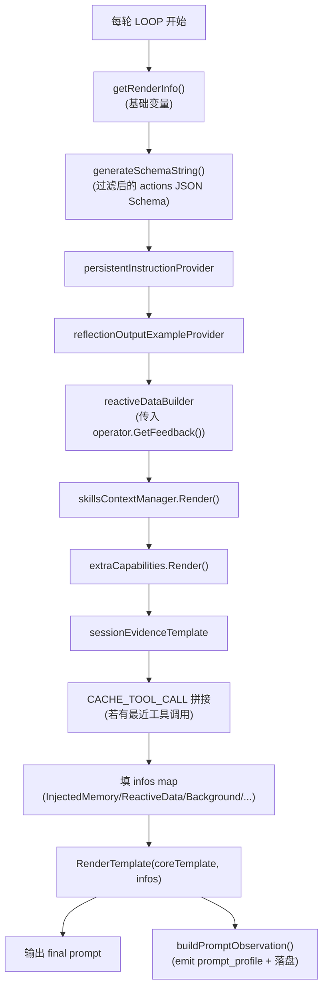
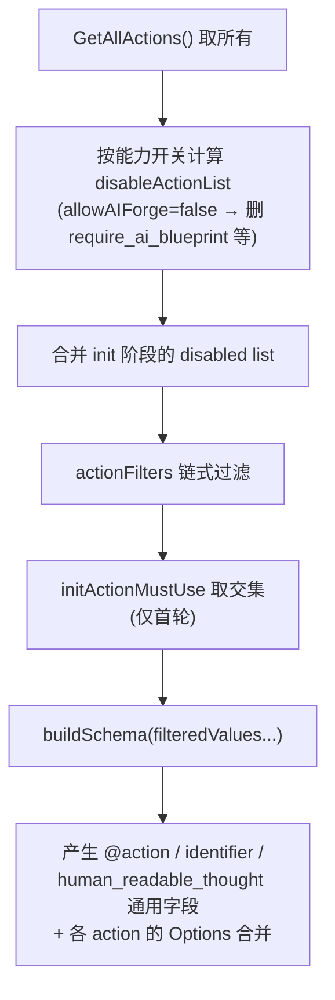

# 03. Prompt 系统

> 回到 [README](../README.md) | 上一章：[02-options-reference.md](02-options-reference.md) | 下一章：[04-actions.md](04-actions.md)

本章解释每一轮主循环 prompt 是怎么"长"出来的：模板长什么样、占位符从哪儿来、谁在两层渲染、如何防注入、如何调试。

读完本章你应该能：

- 看懂 [prompts/loop_template.tpl](../prompts/loop_template.tpl) 的所有占位符
- 知道在不同 hook 里如何注入自己的 prompt 段
- 理解 nonce / `<|TAG|>` 防注入约定
- 掌握 prompt 调试技巧

## 3.1 总览

每一轮主循环里 [`generateLoopPrompt`](../prompt.go) 是 prompt 的总入口。源码 [prompt.go:126-250](../prompt.go) 描述了完整流程：



**两层渲染**的含义：

1. **第一层**：`PersistentInstruction`、`OutputExample`、`ReactiveData` 自身可以是 Go template 字符串，使用 `getRenderInfo` 提供的变量渲染。
2. **第二层**：上一步渲染出的字符串，作为变量再喂给 `coreTemplate` ([prompts/loop_template.tpl](../prompts/loop_template.tpl)) 一起渲染。

这样 loop 编写者可以在自己的 prompt 里用 `{{ .CurrentTime }}`、`{{ .OSArch }}` 这些通用变量。

## 3.2 核心模板：`prompts/loop_template.tpl`

完整内容（已经很短，46 行）：

```46:46:common/ai/aid/aireact/reactloops/prompts/loop_template.tpl
{{ .Background }}

<|USER_QUERY_{{ .Nonce }}|>
{{ .UserQuery }}
<|USER_QUERY_END_{{ .Nonce }}|>

{{/*----------------------------------------  额外能力（ExtraCapabilities - from intent recognition）------------------*/}}
{{ if .ExtraCapabilities }}<|EXTRA_CAPABILITIES_{{ .Nonce }}|>
{{ .ExtraCapabilities }}
<|EXTRA_CAPABILITIES_END_{{ .Nonce }}|>{{ end }}
```

完整模板按段落如下：

| 段落 | 占位符 | 来源 |
|------|--------|------|
| 顶部 | `{{ .Background }}` | `getRenderInfo()` 渲染 background 模板 |
| USER_QUERY | `{{ .UserQuery }}` | 用户输入原文 |
| EXTRA_CAPABILITIES | `{{ .ExtraCapabilities }}` | `extraCapabilities.Render(nonce)` |
| PERSISTENT | `{{ .PersistentContext }}` | `persistentInstructionProvider(loop, nonce)` |
| SessionEvidence | `{{ .SessionEvidence }}` | 渲染 [prompts/session_evidence.txt](../prompts/session_evidence.txt) |
| SkillsContext | `{{ .SkillsContext }}` | `skillsContextManager.Render(nonce)` |
| REFLECTION | `{{ .ReactiveData }}` | `reactiveDataBuilder(loop, feedbacker, nonce)` |
| INJECTED_MEMORY | `{{ .InjectedMemory }}` | `r.GetCurrentMemoriesContent()` |
| 响应格式说明 | 固定文案 | 模板硬编码 |
| SCHEMA | `{{ .Schema }}` | `generateSchemaString(disallowExit)` |
| OUTPUT_EXAMPLE | `{{ .OutputExample }}` | `reflectionOutputExampleProvider(loop, nonce)` |

**所有 `<|XXX_{{.Nonce}}|>` 标签是为了防止 prompt 注入**：用户输入永远夹在 `<|USER_QUERY_<nonce>|>` ... `<|USER_QUERY_END_<nonce>|>` 之间，nonce 是每轮随机的 4 字符串（`utils.RandStringBytes(4)`，[exec.go:522](../exec.go)）。LLM 看到的 `<|USER_QUERY_aB3x|>` 这样的 tag 不会被用户提前伪造，也不会被 LLM 提前学到固定值。

## 3.3 `getRenderInfo()` 提供的变量

源码 [prompt_info.go](../prompt_info.go)（如未单独出现，即在 reactloop.go 附近）。返回 `(background string, infos map[string]any, err error)`。

`infos` 包含：

| 变量名 | 含义 | 来源 |
|--------|------|------|
| `Nonce` | 当前 nonce | 由 `generateLoopPrompt` 注入 |
| `OSArch` | 操作系统架构 | runtime |
| `CurrentTime` | 当前时间 | `time.Now` |
| `WorkingDir` | 工作目录 | `os.Getwd` |
| `Tools` | 工具列表 | `r.toolsGetter()` |
| `TopTools` | 摘要后的工具 | 同上但省略详情 |
| `AllowPlan` | 是否允许 plan | `r.allowPlanAndExec()` |
| `AllowKnowledgeEnhanceAnswer` | 是否允许 RAG | `r.allowRAG()` |
| `AllowAIForge` | 是否允许蓝图 | `r.allowAIForge()` |
| `AllowToolCall` | 是否允许工具 | `r.allowToolCall()` |
| `AllowUserInteract` | 是否允许问用户 | `r.allowUserInteract()` |
| `LoopName` | 当前 loop 名 | `r.loopName` |
| `UserInput` | 用户输入 | `task.GetUserInput()` |

这些变量在你的 `WithPersistentInstruction` 模板里都可以用：

```text
You are running in {{ .OSArch }} at {{ .CurrentTime }}.
Working directory: {{ .WorkingDir }}.
Available actions are described below. Always reply with valid JSON.
```

## 3.4 `PersistentInstruction`：长期指令

**用途**：放永远不变的规则——AI 的角色、领域知识、写作风格、必须遵守的输出约定。

**位置**：渲染到 `<|PERSISTENT_<nonce>|>` ... `<|PERSISTENT_END_<nonce>|>`。

**最小用法**：

```go
//go:embed prompts/persistent_instruction.txt
var instruction string

reactloops.WithPersistentInstruction(instruction)
```

**自定义 Provider**：如果你要在不同轮次根据 loop 状态生成不同指令：

```go
reactloops.WithPersistentContextProvider(func(loop *reactloops.ReActLoop, nonce string) (string, error) {
    state := loop.Get("audit_state")
    base := basicInstruction
    if state == "verifying" {
        base += "\n\nYou are now in VERIFICATION phase. Do not start new scans."
    }
    return utils.RenderTemplate(base, map[string]any{"Nonce": nonce})
})
```

**实战示例**：[loop_http_fuzztest/prompts/persistent_instruction.txt](../loop_http_fuzztest/prompts/persistent_instruction.txt) 是个完整的 HTTP fuzz 角色扮演 prompt，定义了"你是一个高级 Web 安全研究员"的人设、Fuzz 工作流、报告格式约定。

## 3.5 `ReactiveData`：动态反应数据

**用途**：每轮变化的上下文——上一轮的反馈、loop 当前状态、最近的事件。

**位置**：渲染到 `<|REFLECTION_<nonce>|>` ... `<|REFLECTION_END_<nonce>|>`（**注意是 REFLECTION 标签，不要被名字迷惑**——它和反思机制无关，只是模板段落名）。

**Provider 签名**：

```go
type FeedbackProviderFunc func(loop *ReActLoop, feedbacker *bytes.Buffer, nonce string) (string, error)
```

`feedbacker` 是 `operator.Feedback(...)` 累积下来的 bytes，前一轮 action 写入，本轮可读。

**最小用法**：仅把 feedbacker 内容输出：

```go
reactloops.WithReactiveDataBuilder(func(loop *reactloops.ReActLoop, feedbacker *bytes.Buffer, nonce string) (string, error) {
    return feedbacker.String(), nil
})
```

**完整用法**：把 loop 自定义状态混入，并用 embed 模板渲染。参考 [loop_http_fuzztest/init.go:52-92](../loop_http_fuzztest/init.go) 与 [loop_http_fuzztest/prompts/reactive_data.txt](../loop_http_fuzztest/prompts/reactive_data.txt)。

简化代码：

```go
//go:embed prompts/reactive_data.txt
var reactiveDataTemplate string

reactloops.WithReactiveDataBuilder(func(loop *reactloops.ReActLoop, feedbacker *bytes.Buffer, nonce string) (string, error) {
    return utils.RenderTemplate(reactiveDataTemplate, map[string]any{
        "Nonce":           nonce,
        "Feedback":        feedbacker.String(),
        "OriginalRequest": loop.Get("original_request"),
        "DiffResult":      loop.Get("diff_result"),
        "RecentActions":   loop.GetRecentActionsSummary(5),
    })
})
```

**特殊：CACHE_TOOL_CALL**

`generateLoopPrompt` 内部还会自动追加：

- `renderRecentToolRoutingHint(nonce)`：教 LLM 优先用 `directly_call_tool` 命中缓存
- `tm.GetRecentToolsSummary(...)` 包成 `<|CACHE_TOOL_CALL_<nonce>|>`：列出最近用过的工具及参数

这部分**不需要 loop 关心**，只要 `aiToolManager.HasRecentlyUsedTools()` 为真就自动生效。

## 3.6 `OutputExample`：输出示例与反思格式

**用途**：给 LLM 看几个标准输出片段，引导格式正确。**反思**机制开启后，反思的 OutputFormat 也来自这里。

**位置**：渲染到 `<|OUTPUT_EXAMPLE_<nonce>|>` ... `<|OUTPUT_EXAMPLE_END_<nonce>|>`。

**最小用法**：

```go
//go:embed prompts/output_example.txt
var outputExample string

reactloops.WithReflectionOutputExample(outputExample)
```

**自动叠加机制**：`WithReflectionOutputExample` 内部会**遍历 `loop.loopActions`**（即 `WithActionFactoryFromLoop` 注册的子 loop 派生 action），把它们各自的 `OutputExamples` 字段也拼到末尾。这样：

- 你只需要写本 loop 自己的示例
- 子 loop 的示例（在它们的 `LoopMetadata.OutputExamplePrompt` 或 `LoopAction.OutputExamples` 中）会自动被合并

源码 [options.go:222-256](../options.go)。

## 3.7 `Schema`：动态 JSON Schema

**位置**：渲染到 `<|SCHEMA_<nonce>|>` ... `<|SCHEMA_<nonce>|>` 内的 ` ```jsonschema ... ``` `。

**生成器**：[prompt.go:36-124](../prompt.go) 的 `generateSchemaString(disallowExit bool)`。流程：



**生成的 schema 永远包含三个公共字段**（[action.go:46-67](../action.go)）：

| 字段 | 含义 |
|------|------|
| `@action` | enum，必须是某个 action 的 ActionType |
| `identifier` | 短 snake_case 标识，写入日志/调试目录路径 |
| `human_readable_thought` | 可选，简短说明 |

每个 action 的参数（`LoopAction.Options`）会一起合并进 schema。**所有 action 的字段都拍平到同一层**，这是设计取舍：让 LLM 输出更简单（不嵌套），但要求 action 的参数名不冲突。

`x-@action-rules` 字段（schema 扩展）会列出每个 action 的 description（或者 `LoopMetadata.UsagePrompt` 覆盖），让 LLM 看到选哪个 action 的提示。

### `disallowExit` 的语义

如果上一轮 handler 调了 `operator.DisallowNextLoopExit()`，本轮 schema 会过滤掉 `finish` action，强制模型继续。常用于"工具刚跑完，不能马上结束"。

## 3.8 防注入设计

| 风险 | 防御 |
|------|------|
| 用户输入伪造 `<|TAG|>` 干扰 schema | 每轮 nonce 4 字符随机 |
| 用户输入越界 `<|USER_QUERY_END|>` | nonce 让 END tag 也变化 |
| 多个 loop 共享 prompt 串扰 | 每个 loop 自己的渲染独立 |
| Memory 注入恶意 prompt | `InjectedMemory` 也包在 `<|INJECTED_MEMORY_<nonce>|>` 内 |

## 3.9 prompt 可观测性

`generateLoopPrompt` 末尾有：

```go
observation := buildPromptObservation(r.loopName, nonce, prompt, sections)
r.SetLastPromptObservation(observation)
status := observation.BuildStatus(1 * 1024)
r.SetLastPromptObservationStatus(status)
r.emitPromptObservationStatus(status)
```

`buildPromptObservation` 给每个段落计算 token 数、字节数。`emitPromptObservationStatus` 把摘要通过 Emitter 发到 `prompt_profile` 节点（前端可以看到每段的开销）。

debug 模式（`YAKIT_AI_WORKSPACE_DEBUG=1`）下还会落盘 markdown：`debug/<loop_name>/prompts/<iteration>.md`。

## 3.10 调试技巧

### 看完整 prompt

```bash
export YAKIT_AI_WORKSPACE_DEBUG=1
yak run-react.yak

ls debug/loop_http_fuzztest/prompts/
# 1.md  2.md  3.md ...
```

### 看每段 token 占比

观察前端 `prompt_profile` 事件，或者在 CLI 模式下：

```go
log.Infof("prompt section build report:\n%s", observation.RenderCLIReport(120))
```

会输出形如：

```text
section            tokens  bytes
Background           512   1850
PersistentContext    320   1200
ReactiveData         180    640
Schema              1240   4520
...
```

### 临时跳过 perception / reflection

在调试 prompt 大小时，先关掉感知/反思，缩短 prompt：

```go
WithDisableLoopPerception(true)
WithEnableSelfReflection(false)
```

### 占位符调试

模板渲染失败一般有两类错：

- 引用了 `infos` 里没有的变量 → `RenderTemplate` 返回 error
- 自定义模板里写了 `{{` 没匹配 `}}` → 同上

把出错的 provider 换成 `func(...) (string, error) { return template, nil }`（即不渲染）能快速定位。

## 3.11 进一步阅读

- [02-options-reference.md](02-options-reference.md)：`WithPersistentInstruction` / `WithReactiveDataBuilder` 等
- [04-actions.md](04-actions.md)：`Schema` 是怎么从 action 来的
- [12-debugging-and-observability.md](12-debugging-and-observability.md)：`prompt_profile` 事件 + workspace debug
