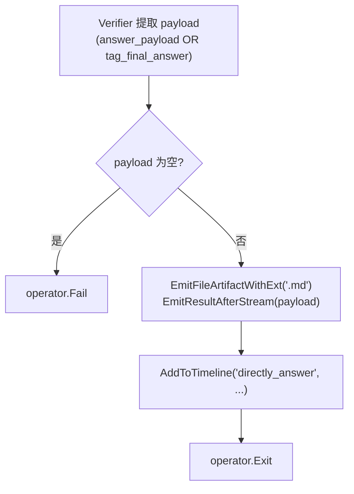
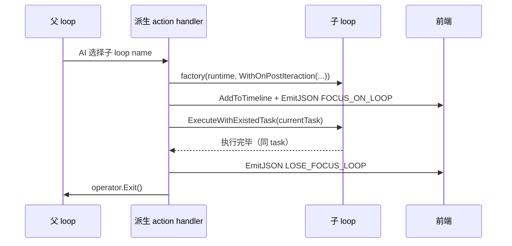

# 04. Action 体系

> 回到 [README](../README.md) | 上一章：[03-prompt-system.md](03-prompt-system.md) | 下一章：[05-hooks-and-lifecycle.md](05-hooks-and-lifecycle.md)

`LoopAction` 是专注模式的"原子动作单元"。这一章覆盖：

- `LoopAction` 数据结构
- 4 种 action 来源（内置 / loopinfra / 从 Tool / 从子 Loop）
- 流式字段两种（`StreamFields` JSON 字段流 vs `AITagStreamFields` XML 标签流）
- ActionHandler 的 operator 控制
- 实战示例

## 4.1 `LoopAction` 数据结构

源码 [action.go:13-27](../action.go)：

```go
type LoopAction struct {
    AsyncMode         bool                  // 是否切到异步模式（plan / forge 经常需要）
    ActionType        string `json:"type"`  // 唯一标识，写入 schema enum
    Description       string `json:"description"` // 给 LLM 的解释
    Options           []aitool.ToolOption   // 参数 schema（拍平到 schema 顶层）
    ActionVerifier    LoopActionVerifierFunc
    ActionHandler     LoopActionHandlerFunc
    StreamFields      []*LoopStreamField    // JSON 字段流
    AITagStreamFields []*LoopAITagField     // XML 标签流
    OutputExamples    string `json:"output_examples,omitempty"` // 给 reflection example 用
}
```

回调签名：

```go
type LoopActionVerifierFunc func(loop *ReActLoop, action *aicommon.Action) error
type LoopActionHandlerFunc  func(loop *ReActLoop, action *aicommon.Action, operator *LoopActionHandlerOperator)
```

### Verifier 与 Handler 的分工

| 阶段 | 职责 |
|------|------|
| Verifier | 校验 action 参数是否完整、合法。返回 error 触发 LLM 重试（在 `CallAITransaction` 包装下） |
| Handler | 真正执行业务逻辑。通过 `operator` 决定下一步循环走向 |

**Verifier 必须无副作用**（除了往 `loop.Set` 写解析后的参数）：因为它会在 transaction 重试时被多次调用。

**Handler 可以有副作用**：执行工具、emit 事件、修改 loop 变量。但 handler 一旦执行成功，就要明确告诉主循环下一步：`Continue` / `Exit` / `Fail` / `RequestAsyncMode`。

## 4.2 来源 1：内置 actions

源码 [action_buildin.go](../action_buildin.go)。**所有专注模式都自动具备这两个**：

### `finish`

立即结束循环，任务标记为 `Completed`。Handler 实现：

```go
ActionHandler: func(loop *ReActLoop, action *aicommon.Action, operator *LoopActionHandlerOperator) {
    loop.invoker.AddToTimeline("finish", "AI decided mark the current Task is finished")
    operator.Exit()
}
```

LLM 输出 `{"@action": "finish"}` 即可触发。**不**会输出 markdown 答案——它依赖 timeline 上已经积累的工具产出和系统自动生成的总结。

### `directly_answer`

输出一段 Markdown 给用户。和 `finish` 的区别：**强制提供答案内容**，无论是 `answer_payload` 字段（短答案）还是 `<|FINAL_ANSWER|>` AITag（长答案）。

源码 [action_buildin.go:26-90](../action_buildin.go)。Handler 流程：



**专注模式经常覆盖 `directly_answer`**（用 `WithOverrideLoopAction`）以加自己的"会话保存"或"finalize 摘要"，例子见 [loop_http_fuzztest/action_directly_answer.go](../loop_http_fuzztest/action_directly_answer.go)。

## 4.3 来源 2：loopinfra 通用 actions

[loopinfra/](../loopinfra) 包含一批跨 loop 复用的标准 action。通过 `loopinfra/register.go` 的 `init()` 全局注册，按需在 loop 工厂里通过 `WithAllowXxx` 开关启用。

源码 [loopinfra/register.go:7-20](../loopinfra/register.go)：

```go
func init() {
    reactloops.RegisterAction(loopAction_toolRequireAndCall)        // require_tool
    reactloops.RegisterAction(loopAction_directlyCallTool)          // directly_call_tool
    reactloops.RegisterAction(loopAction_AskForClarification)       // ask_for_clarification
    reactloops.RegisterAction(loopAction_EnhanceKnowledgeAnswer)    // knowledge_enhance
    reactloops.RegisterAction(loopAction_RequestPlanAndExecution)   // request_plan_execution
    reactloops.RegisterAction(loopAction_RequireAIBlueprintForge)   // require_ai_blueprint
    reactloops.RegisterAction(loopAction_toolCompose)               // tool_compose
    reactloops.RegisterAction(loopAction_LoadingSkills)             // loading_skills
    reactloops.RegisterAction(loopAction_ChangeSkillViewOffset)     // change_skill_view_offset
    reactloops.RegisterAction(loopAction_LoadSkillResources)        // load_skill_resources
    reactloops.RegisterAction(loopAction_SearchCapabilities)        // search_capabilities
    reactloops.RegisterAction(loopAction_LoadCapability)            // load_capability
}
```

### loopinfra action 速查表

| ActionType | 异步? | 文件 | 何时启用 | 触发条件 |
|------------|-------|------|----------|----------|
| `require_tool` | 否 | `action_tool_require_and_call.go` | `allowToolCall=true` | LLM 选择需要先发现/确认工具的场景 |
| `directly_call_tool` | 否 | `action_directly_call_tool.go` | `allowToolCall=true` 且 `aiToolManager.HasRecentlyUsedTools()` | 缓存命中，跳过 require_tool 直接调用 |
| `tool_compose` | 是 | `action_tool_compose.go` | `allowToolCall=true` | 多工具串行/并行编排 |
| `ask_for_clarification` | 否 | `action_ask_for_clarification.go` | `allowUserInteract=true` | 信息不足问用户 |
| `knowledge_enhance` | 否 | `action_enhance_knowledge_answer.go` | `allowRAG=true` | RAG 检索回答 |
| `request_verification` | 否 | `action_request_verification.go` | 总是 | AI 主动要求验证当前结果 |
| `request_plan_execution` | 是 | `action_request_plan_execution.go` | `allowPlanAndExec=true` | 切到任务规划模式 |
| `require_ai_blueprint` | 是 | `action_require_ai_blueprint_forge.go` | `allowAIForge=true` | 启动一个 forge 蓝图 |
| `loading_skills` | 否 | `action_loading_skills.go` | `allowSkillLoading=true` | 加载未加载的技能 |
| `change_skill_view_offset` | 否 | `action_change_skill_view_offset.go` | `allowSkillViewOffset=true` | 翻看技能内容长视图 |
| `load_skill_resources` | 否 | `action_load_skill_resources.go` | 与 skill 相关 | 加载技能资源 |
| `search_capabilities` | 否 | `action_search_capabilities.go` | 总是（有 ExtraCapabilities 时） | 搜索新能力 |
| `load_capability` | 动态 | `action_load_capability.go` | 总是（有 ExtraCapabilities 时） | 加载能力（4 种身份：tool/forge/skill/focus_mode） |

> `异步?` 列标"是"的 action 会在切到异步任务时返回 `nil`，主循环进入 `AsyncRunning` 状态，由 action 自己的回调最终设置任务状态。"动态"表示 handler 内部按需调 `operator.RequestAsyncMode()`。

详见 [09-capabilities.md](09-capabilities.md) 关于 `load_capability` 的 4 种身份。

### loopinfra action 设计模式

阅读 [loopinfra/](../loopinfra) 下的 action 时，会发现一些一致模式：

1. **结尾几乎都调 `MaybeVerifyUserSatisfaction`**：通用工具 action 在执行成功后会触发节流验证，避免无意义的重复。参考 [loopinfra/tool_call_common.go](../loopinfra/tool_call_common.go) 的 `handleToolCallResult`。
2. **失败不直接 Fail，而是设置 Reflection level=Critical**：如 [action_from_tool.go:152-161](../action_from_tool.go) 的工具失败处理，让 AI 反思后重试不同工具。
3. **emit 文件而不仅是事件**：长输出（如知识增强答案、规划文档）通过 `EmitFileArtifactWithExt` 落盘，前端可下载。

## 4.4 来源 3：从 Tool 派生

源码 [action_from_tool.go](../action_from_tool.go)。函数签名：

```go
func ConvertAIToolToLoopAction(tool *aitool.Tool) *LoopAction
```

或便捷选项：

```go
func WithRegisterLoopActionFromTool(tool *aitool.Tool) ReActLoopOption
```

**用途**：把任何 `aitool.Tool` 直接当作 loop 的 action 给 LLM 调用，绕过 `require_tool` 的发现-确认流程。适合 loop 已经知道自己一定要用某些固定工具。

**关键实现要点**：

- Verifier 调 `tool.ValidateParams(params)` 做 schema 校验。校验失败会 `AddToTimeline("[PARAMETER_VALIDATION_ERROR]", ...)`，让 AI 看见错误并重试。
- Handler 内部容错处理：工具失败**不会**调 `operator.Fail`，而是 `SetReflectionLevel(Critical)` + `Continue`，让 AI 反思后选择别的方案（[action_from_tool.go:152-161](../action_from_tool.go)）。
- Handler 末尾调 `MaybeVerifyUserSatisfaction`：如果验证返回 `Satisfied=true` 直接 `operator.Exit()`。
- 多种参数提取格式兼容：handler 同时支持 `{"@action":"tool", "params":{...}}`（标准） / `{"@action":"tool", x:1, y:2}`（拍平）等多种 LLM 输出。

**示例**：

```go
preset = append(preset, reactloops.WithRegisterLoopActionFromTool(myTool))
```

## 4.5 来源 4：从子 Loop 派生

源码 [action_from_loop.go:11-73](../action_from_loop.go)。函数签名：

```go
func ConvertReActLoopFactoryToActionFactory(name string, factory LoopFactory) func(r aicommon.AIInvokeRuntime) (*LoopAction, error)
```

或便捷选项（推荐）：

```go
func WithActionFactoryFromLoop(name string) ReActLoopOption
```

**用途**：把另一个已注册的 loop 当作本 loop 的一个 action。调用时**复用同一个 task**，子 loop 跑完后调用方 loop 主动 `operator.Exit()`。



注意几个特点：

- **共享 task**：子 loop 拿到的是父 loop 的 `currentTask`，所以 `EmitFileArtifact`、`AddToTimeline` 都写到同一个会话。
- **共享 OnPostIteraction**：子 loop 工厂调用时把父 loop 的 `onPostIteration` 传进去，让全局 hook（如 EmitReActFail/Success）依然生效。
- **FOCUS_ON_LOOP / LOSE_FOCUS_LOOP 事件**：UI 看见这两个事件就能展示"切换到子专注模式"。
- **子 loop 跑完父 loop 直接 Exit**：因为子 loop 已经处理完用户问题。

**用例**：

```go
preset = append(preset, reactloops.WithActionFactoryFromLoop("loop_intent"))
```

## 4.6 流式字段：两种风格

### `LoopStreamField`（JSON 字段流）

源码 [action_field.go:7-13](../action_field.go)：

```go
type LoopStreamField struct {
    FieldName     string                  // JSON 字段名
    AINodeId      string                  // 推送到哪个 NodeId
    Prefix        string                  // 在内容前加前缀
    ContentType   string                  // text_markdown / yak_code / ...
    StreamHandler LoopStreamFieldHandler  // 可选自定义处理
}
```

**何时用**：LLM 输出的是标准 JSON，你想在某个字段流到时实时推送。例如：

```json
{
  "@action": "directly_answer",
  "answer_payload": "## 分析结果\n\n经过测试..."
}
```

把 `answer_payload` 注册为 stream field，LLM 还没输出完整 JSON 时，前端就开始看到 markdown 内容流入。

### `LoopAITagField`（XML 标签流）

源码 [action_field.go:15-20](../action_field.go)：

```go
type LoopAITagField struct {
    TagName      string  // tag 名（如 FINAL_ANSWER）
    VariableName string  // 内容存到 loop.Get(VariableName)
    AINodeId     string
    ContentType  string
}
```

**何时用**：JSON 字符串里塞长 markdown 容易因转义出问题（换行、引号、code fence）。所以 ReAct 约定 LLM 可以输出 `<|TAG_<nonce>|>...content...<|TAG_END_<nonce>|>` 形式包在 JSON 之外，避免 JSON 转义。

```text
{"@action": "directly_answer", "human_readable_thought": "give final answer"}

<|FINAL_ANSWER_aB3x|>
## 分析结果

测试发现以下问题...

```python
def example():
    pass
```
<|FINAL_ANSWER_END_aB3x|>
```

提取到的内容存入 `loop.Get("tag_final_answer")`，并实时流到 NodeId。

### 选哪个？

| 场景 | 推荐 |
|------|------|
| 字段是简单字符串、不含特殊字符 | `StreamFields` |
| 字段是长 markdown / 代码 / HTTP packet | `AITagStreamFields` |
| 一个内容字段两种都给（LLM 自选） | 两个都注册（`directly_answer` 就是这样） |
| 多段独立内容（如 `<GEN_PACKET>` + `<GEN_MODIFIED_PACKET>`） | 多个 `AITagStreamFields` |

[loop_http_fuzztest/init.go:42-44](../loop_http_fuzztest/init.go) 是多 AITag 字段的例子：

```go
reactloops.WithAITagFieldWithAINodeId("GEN_PACKET", generatedPacketContentField, "http_flow", aicommon.TypeCodeHTTPRequest),
reactloops.WithAITagFieldWithAINodeId("GEN_MODIFIED_PACKET", modifiedPacketContentField, "http_flow", aicommon.TypeCodeHTTPRequest),
```

## 4.7 ActionHandler 中的 operator 控制

`LoopActionHandlerOperator` 的方法在 [01-architecture.md](01-architecture.md#16-loopactionhandleroperator-完整语义) 已经列过。这里聚焦"什么场景该用什么"。

### 决策表

| 场景 | 调什么 |
|------|--------|
| 普通成功，继续下一轮 | `operator.Continue()` |
| 任务完成 | `operator.Exit()` |
| 任务失败，无救 | `operator.Fail(err)` |
| 工具失败但还能换工具 | `operator.SetReflectionLevel(Critical)` + `Continue()` |
| 想阻止 LLM 下一轮选 finish/exit | `operator.DisallowNextLoopExit()`（仅本次有效） |
| 把这一轮观察到的事实告诉下一轮 | `operator.Feedback("...")` |
| 解析参数后判定是异步任务（如 forge） | `operator.RequestAsyncMode()` |
| 不发本次完成 loadingStatus | `operator.MarkSilence()` |
| 自定义反思级别 | `operator.SetReflectionLevel(level)` |

### 互斥规则

`Continue` / `Exit` / `Fail` 由 `terminateOperateOnce` 保护，**只有第一次生效**。下面这种代码：

```go
operator.Continue()
operator.Fail(err) // 无效
```

第二次调用被静默丢弃。所以**不要先 Continue 再判失败**。要么先判失败再 Continue：

```go
if err != nil {
    operator.Fail(err)
    return
}
operator.Continue()
```

### Feedback 的最佳实践

```go
operator.Feedback(fmt.Sprintf("scan %s found %d issues", target, len(issues)))
```

下一轮 prompt 的 `<|REFLECTION_<nonce>|>` 段会包含这条信息，LLM 看到后会调整下一步行动。

**坏的实践**：把整个工具输出全塞进 Feedback。这会导致 prompt 爆炸。改成：

- 摘要后再 Feedback
- 或者把详情用 `EmitFileArtifact` 持久化，Feedback 里只放文件名引用

## 4.8 实战：覆盖 directly_answer

参考 [loop_http_fuzztest/action_directly_answer.go](../loop_http_fuzztest/action_directly_answer.go)，关键差别：

| 标准版 | HTTP fuzz 覆盖版 |
|--------|------------------|
| Verifier 接受 `answer_payload` 或 `tag_final_answer` 任一个 | Verifier **拒绝同时提供两者**（`utils.Error("...exactly one of...")`） |
| Handler 仅 emit + timeline | Handler 还调 `recordLoopHTTPFuzzMetaAction` / `markLoopHTTPFuzzDirectlyAnswered` / `persistLoopHTTPFuzzSessionContext`（持久化会话） |
| timeline 行只有 user input + answer | timeline 还附 current request summary / merge summary / review decision |

**重写思路**：复制原版结构，加上自己的 finalize 调用，最后还是 `operator.Exit()`。

## 4.9 实战：自定义 action

```go
reactloops.WithRegisterLoopAction(
    "scan_target",
    "对目标 URL 进行扫描，把发现的资产写入 loop 状态",
    []aitool.ToolOption{
        aitool.WithStringParam("target_url",
            aitool.WithParam_Required(true),
            aitool.WithParam_Description("Target URL to scan, must include scheme")),
        aitool.WithIntegerParam("depth",
            aitool.WithParam_Default(2)),
    },
    func(loop *reactloops.ReActLoop, action *aicommon.Action) error {
        target := action.GetString("target_url")
        if target == "" {
            return utils.Error("target_url is required")
        }
        if !strings.HasPrefix(target, "http") {
            return utils.Error("target_url must include scheme")
        }
        loop.Set("scan_target_url", target)
        return nil
    },
    func(loop *reactloops.ReActLoop, action *aicommon.Action, op *reactloops.LoopActionHandlerOperator) {
        target := loop.Get("scan_target_url")
        depth := action.GetInt("depth")
        if depth <= 0 {
            depth = 2
        }
        log.Infof("scanning %s depth=%d", target, depth)
        results, err := myScanner.Scan(target, depth)
        if err != nil {
            op.SetReflectionLevel(reactloops.ReflectionLevel_Critical)
            op.Feedback(fmt.Sprintf("scan failed: %v, try smaller depth or different target", err))
            op.Continue()
            return
        }
        loop.Set("scan_results", results)
        op.Feedback(fmt.Sprintf("found %d assets in %s", len(results), target))
        op.Continue()
    },
)
```

## 4.10 进一步阅读

- [05-hooks-and-lifecycle.md](05-hooks-and-lifecycle.md)：在 Hook 里如何配合 Action
- [06-emitter-and-streaming.md](06-emitter-and-streaming.md)：StreamFields / AITagFields 的事件流细节
- [09-capabilities.md](09-capabilities.md)：`load_capability` 的 4 种身份
- [10-build-your-own-loop.md](10-build-your-own-loop.md)：把 action 接入端到端教程
