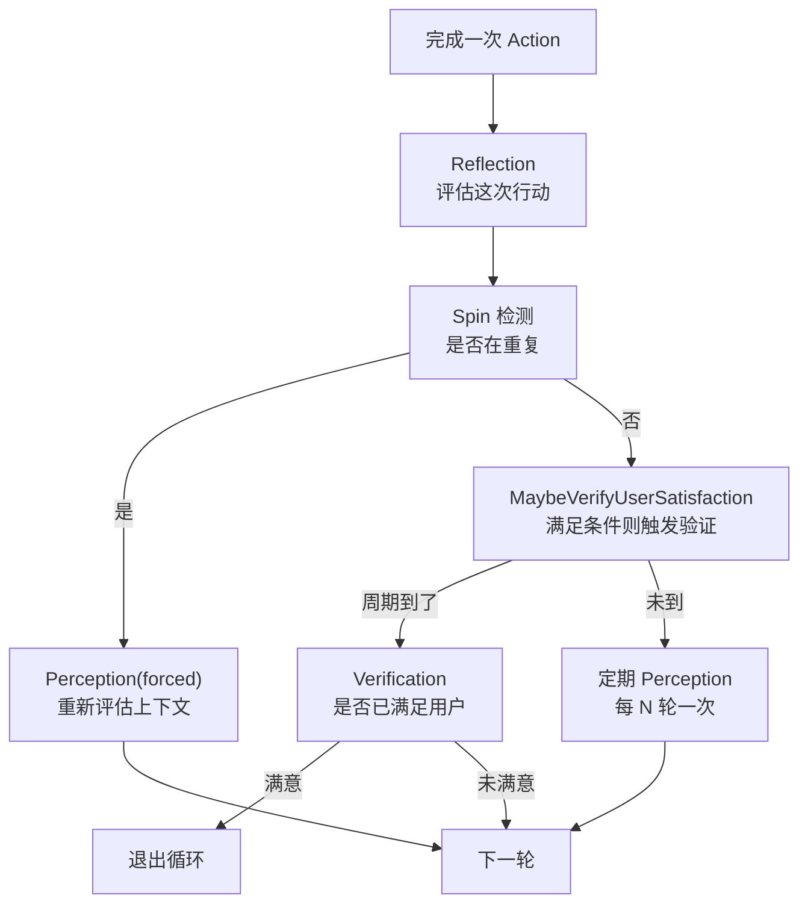
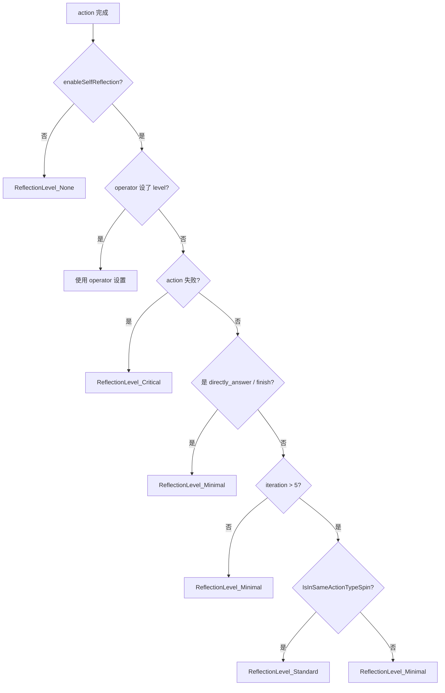
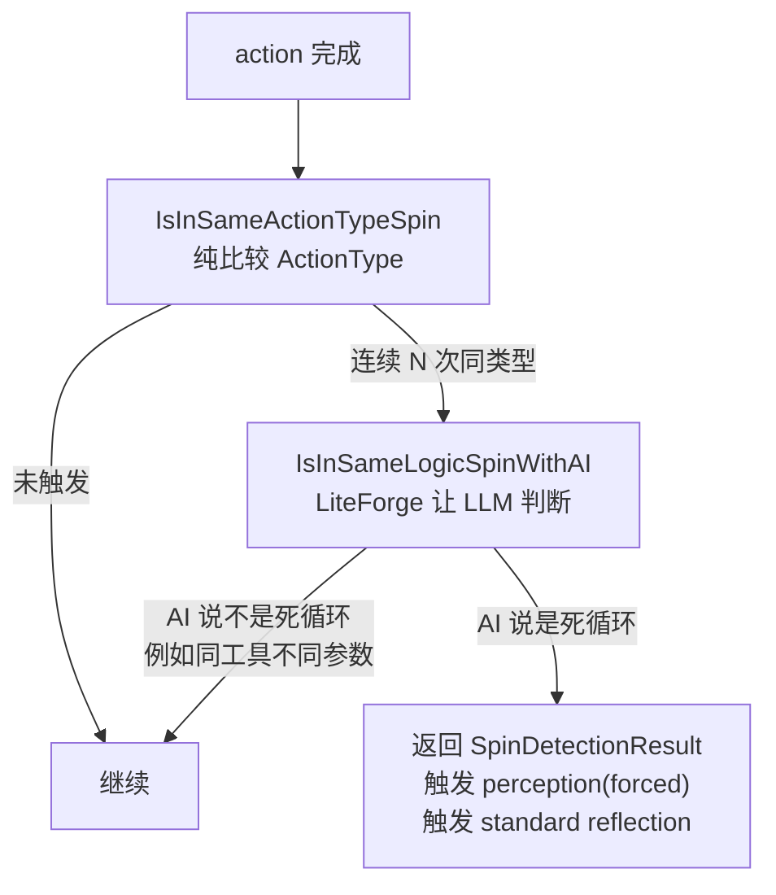

# 08. 确定性四件套：感知 / 反思 / 自旋 / 验证门

> 回到 [README](../README.md) | 上一章：[07-liteforge.md](07-liteforge.md) | 下一章：[09-capabilities.md](09-capabilities.md)

ReAct 主循环本质上是非确定的：LLM 推理 → 选 action → 执行 → 再推理。如果不加约束，循环可能：

- **跑偏**：每轮主题都飘
- **死循环**：同一个 action 重复几十次
- **空转**：LLM 自我安慰式回答，没真正解决问题
- **过度执行**：用户已经满意了还在跑

reactloops 通过四件套机制把"非确定 LLM"挤回"可承诺工程"：

| 机制 | 解决问题 | 触发频率 | 主要源码 |
|------|----------|----------|----------|
| **Perception 感知** | 跑偏、上下文漂移 | 周期性 + 事件触发 | [perception.go](../perception.go) |
| **Reflection 反思** | 行动质量、根因分析 | 每轮可选 | [reflection.go](../reflection.go) |
| **Spin Detection 自旋** | 死循环、重复执行 | 触发式 | [spin_detection.go](../spin_detection.go) |
| **Verification Gate 验证门** | 用户满意 / 任务完成度 | 周期性 + AI 主动 + watchdog | [verification_gate.go](../verification_gate.go) |

四件套**协同**工作：



## 8.1 Perception 感知层

### 核心命题

> "AI Agent 现在到底在做什么？" 这个问题用结构化方式回答，可以让下一轮 prompt 含有"我自己是怎么看当前情况的"，避免漂移。

### 数据结构

源码 [perception.go:47-57](../perception.go)：

```go
type PerceptionState struct {
    Topics          []string  `json:"topics"`           // 当前任务的话题
    Keywords        []string  `json:"keywords"`         // 关键词
    OneLinerSummary string    `json:"summary"`          // 一句话概述
    ConfidenceLevel float64   `json:"confidence"`       // 0-1 的置信度
    Changed         bool      `json:"changed"`          // 与上次对比是否变化
    Epoch           int       `json:"epoch"`
    LastTrigger     string    `json:"last_trigger"`
    LastUpdateAt    time.Time `json:"last_update_at"`
    PrevTopicsHash  string    `json:"prev_topics_hash"` // 用于哈希比对
}
```

### 五种触发器

源码 [perception.go:22-27](../perception.go)：

| 常量 | 含义 | 触发时机 |
|------|------|----------|
| `PerceptionTriggerPostAction` | action 完成后 | 每轮主循环 |
| `PerceptionTriggerVerification` | 验证后 | `MaybeTriggerPerceptionAfterVerification` |
| `PerceptionTriggerForced` | 主动强制 | `ForcePerceptionUpdate` |
| `PerceptionTriggerSpinDetected` | 检测到自旋 | spin_detection 协同 |
| `PerceptionTriggerLoopSwitch` | 子 loop 切换 | 跨 loop 时重置 |

### 节流策略

不会每轮都跑（贵）。`ShouldUpdate` 决定是否真的更新：

- `Forced` / `SpinDetected` / `LoopSwitch` 立即更新
- 否则比较 `topics` 哈希，若没变化则跳过
- 默认 30 秒最小间隔，5 分钟最大间隔

### 输出去向

- 写到 `loop.GetPerceptionState()`
- 渲染进下一轮 prompt 的 `<|REFLECTION_<nonce>|>` 段（合并到 reactiveData）
- 触发后续 capability 重排

### 配置

| Option | 作用 |
|--------|------|
| `WithDisableLoopPerception(true)` | 完全禁用感知（成本敏感场景） |
| `WithExtraCapabilities(ec)` | 给 perception 提供候选能力池 |

### 使用示例

```go
// 主动触发
loop.ForcePerceptionUpdate("custom_reason")

// 读取
state := loop.GetPerceptionState()
log.Infof("current topic: %s, confidence: %.2f", state.OneLinerSummary, state.ConfidenceLevel)
```

## 8.2 Reflection 反思

### 核心命题

> 每个 action 完成后让 LLM 自评："这次行动有效吗？环境变化了什么？要不要换策略？"

### 五个反思级别

源码 [reflection.go:17-30](../reflection.go)：

| Level | 含义 | 是否调 AI | 何时触发 |
|-------|------|-----------|----------|
| `ReflectionLevel_None` | 不反思 | 否 | `enableSelfReflection=false` |
| `ReflectionLevel_Minimal` | 仅记录 | 否 | 内置 action / 高迭代非反思轮 / 默认 |
| `ReflectionLevel_Standard` | 评估基本影响 | 是 | SPIN 检测触发 |
| `ReflectionLevel_Deep` | 详细分析 | 是 | 关键 action |
| `ReflectionLevel_Critical` | 失败根因 | 是 | action 失败 / 显式设置 |

### 触发逻辑

源码 [reflection.go:51-98](../reflection.go) `shouldTriggerReflection`：



### 反思输出

调 AI 的 level（Standard 及以上）会：

1. 用 LiteForge 让 LLM 评估
2. 提取 `suggestions` 字段流式输出到 `re-act-loop-thought` 节点（用户看得到反思过程）
3. 结果写入 `reflectionData`，影响下一轮的 `<|REFLECTION_<nonce>|>` 段

### 在 Action Handler 内主动设置

```go
ActionHandler: func(loop *ReActLoop, action *aicommon.Action, op *LoopActionHandlerOperator) {
    // ...
    if importantStep {
        op.SetReflectionLevel(reactloops.ReflectionLevel_Deep)
        op.SetReflectionData(map[string]any{
            "key_observation": "...",
        })
    }
    op.Continue()
}
```

### 配置

| Option | 默认值 | 说明 |
|--------|--------|------|
| `WithEnableSelfReflection(true)` | `true` | 总开关 |

> **注意**：成本敏感场景可以 `WithEnableSelfReflection(false)`，但失去重要的根因分析能力。

## 8.3 Spin Detection 自旋检测

### 核心命题

> 同一个 action 连续跑 N 次（参数也类似），多半是 LLM 卡住了。要先廉价检测、再 AI 复核、最后强制干预。

### 两层检测

源码 [spin_detection.go:24-54](../spin_detection.go)：



### 第一层：阈值检测

```go
// 默认阈值 3：连续 3 次相同 ActionType 触发
WithSameActionTypeSpinThreshold(3)
```

非常便宜，不调 AI，纯计数。

### 第二层：AI 逻辑检测

源码 [spin_detection.go:84-130](../spin_detection.go)：

```go
type SpinDetectionResult struct {
    IsSpinning       bool     `json:"is_spinning"`
    Reason           string   `json:"reason"`
    Suggestions      []string `json:"suggestions"`
    NextActions      []string `json:"next_actions"`
    ActionType       string   `json:"action_type"`
    ConsecutiveCount int      `json:"consecutive_count"`
}
```

LiteForge prompt 包含：最近 N 次 action 的参数 + timeline 摘要。LLM 决定：

- 同工具不同参数（在做不同事）→ 不是死循环
- 同工具同参数 → 是死循环
- 同工具循环渐进（参数微调）→ 看 timeline 是否真的有进展

### 配置

```go
WithSameActionTypeSpinThreshold(3)           // 第一层阈值，默认 3
WithSameLogicSpinThreshold(5)                // 第二层取最近 5 次给 AI 判断
WithMaxConsecutiveSpinWarnings(2)            // 累计 2 次警告后强制中断
WithUseSpeedPriorityAICallback(true)         // 用 speed 模型（默认 quality）
```

### 触发后果

1. **强制 perception**：`PerceptionTriggerSpinDetected` 立即重新评估上下文
2. **Standard reflection**：让 LLM 反思"我是不是卡住了"
3. **`MaxConsecutiveSpinWarnings` 累计**：达阈值后主动中止 loop（避免烧钱）

## 8.4 Verification Gate 验证门

### 核心命题

> "用户的目标是否已经达成？" 这是个**关键决策**，不能让 LLM 在主循环里随便说"我觉得行了"就 finish。

### 三种触发方式

源码 [verification_gate.go:141-201](../verification_gate.go)：

| 方法 | 触发主体 | 节流 | 用途 |
|------|----------|------|------|
| `VerifyUserSatisfactionNow` | 显式调用 | 无 | AI 主动调 `request_verification` action |
| `MaybeVerifyUserSatisfaction` | tool / action 后自动 | 有（节流） | 减少冗余验证 |
| `request_verification` action | LLM 自己 | 无 | LLM 觉得任务完成时主动验证 |
| `Watchdog` 定时器 | 系统兜底 | 2 分钟无活动 | 防 idle 空转 |

### `MaybeVerifyUserSatisfaction` 的节流条件

源码 [verification_gate.go:172-200](../verification_gate.go)：必须满足以下任一：

1. 周期到了（`ShouldTriggerPeriodicCheckpointOnIteration`，默认每 N 轮）
2. 上次验证已经过了 30 秒（`verificationAutoTriggerMaxSnapshotAge`）
3. prompt token 数变化 > 500（`verificationAutoTriggerMinPromptDelta`）

否则直接跳过，不调 LLM。

### 验证输出

`VerifySatisfactionResult` 内容：

| 字段 | 含义 |
|------|------|
| `Satisfied` | true → 任务完成 |
| `Reasoning` | LLM 的判断理由 |
| `OutputFiles` | 生成的关键文件路径（自动 `EmitPinFilename` + 注册为 ContextProvider） |
| `Evidence` / `EvidenceOps` | 留存证据，注入到下一轮 prompt 的 `<|SESSION_EVIDENCE_<nonce>|>` 段 |
| `NextMovements` | 若不满意，给出建议下一步 |
| `CompletedTaskIndex` | 已完成的子任务标识 |

`Satisfied=true` 时，watchdog 调用方会 `task.Finish(nil)` 退出循环。

### Watchdog 兜底

源码 [verification_gate.go:203-268](../verification_gate.go)：

```go
verificationWatchdogIdleTimeout = 2 * time.Minute
```

如果 2 分钟没人调 `MaybeVerifyUserSatisfaction`（极端情况下 loop 在干别的或者卡住了），自动触发一次强制验证。常见在异步任务路径（async mode）中防止"任务跑完了但 loop 没退"。

### 配置

```go
WithPeriodicVerificationInterval(2)  // 每 2 轮触发一次自动验证（默认值在 aicommon.DefaultPeriodicVerificationInterval）
```

## 8.5 四件套调参组合

不同场景需要不同组合。下面给三套预设。

### 组合 A：成本控制型

适用场景：批量自动化扫描、无人值守任务、token 敏感。

```go
reactloops.WithEnableSelfReflection(false)         // 关掉所有 AI 反思
reactloops.WithDisableLoopPerception(true)         // 关闭感知
reactloops.WithSameActionTypeSpinThreshold(2)      // 严格自旋阈值
reactloops.WithMaxConsecutiveSpinWarnings(1)       // 一次警告就退出
reactloops.WithUseSpeedPriorityAICallback(true)    // spin 检测用快模型
reactloops.WithPeriodicVerificationInterval(5)     // 每 5 轮才验证一次
reactloops.WithMaxIterations(20)                   // 限制 20 轮
```

特点：少调 AI，但失去自我修正能力。

### 组合 B：严格质量型

适用场景：渗透测试、金融审计、关键报告。

```go
reactloops.WithEnableSelfReflection(true)          // 开启反思
reactloops.WithSameActionTypeSpinThreshold(3)      // 标准
reactloops.WithMaxConsecutiveSpinWarnings(3)       // 给 LLM 多次自纠机会
reactloops.WithPeriodicVerificationInterval(2)     // 频繁验证
reactloops.WithMaxIterations(100)                  // 默认值即可
```

特点：每个关键节点都验证，发现偏差立刻反思。

### 组合 C：快迭代型

适用场景：开发调试、用户在线交互、对话型任务。

```go
reactloops.WithEnableSelfReflection(true)
reactloops.WithSameActionTypeSpinThreshold(5)      // 较宽松，允许试错
reactloops.WithMaxConsecutiveSpinWarnings(5)
reactloops.WithUseSpeedPriorityAICallback(true)    // 反思用快模型
reactloops.WithPeriodicVerificationInterval(3)
```

特点：用户体验流畅，允许反复试错但有上限。

## 8.6 在 Hook 里读 / 写四件套状态

### 在 InitTask 里强制初始 perception

```go
WithInitTask(func(loop *reactloops.ReActLoop, task aicommon.AIStatefulTask, op *reactloops.InitTaskOperator) {
    // 强制初始化感知（loop_switch 触发器，确保下一轮 prompt 有上下文）
    loop.ForcePerceptionUpdate("init_task_bootstrap")
    op.Continue()
})
```

### 在 Action Handler 里调高反思级别

```go
ActionHandler: func(loop *ReActLoop, action *aicommon.Action, op *LoopActionHandlerOperator) {
    err := doSomethingDangerous(...)
    if err != nil {
        op.SetReflectionLevel(reactloops.ReflectionLevel_Critical)
        op.SetReflectionData(map[string]any{
            "error": err.Error(),
            "context": "tried doSomething with X",
        })
        op.Continue()  // 让 AI 反思后下一轮自己换策略
        return
    }
    op.Continue()
}
```

### 在 Action Handler 里强制验证

```go
ActionHandler: func(loop *ReActLoop, action *aicommon.Action, op *LoopActionHandlerOperator) {
    // 完成关键步骤后立即验证
    result, _ := loop.VerifyUserSatisfactionNow(
        loop.GetCurrentTask().GetContext(),
        loop.GetCurrentTask().GetUserInput(),
        false,
        "Completed phase 1 of analysis",
    )
    if result != nil && result.Satisfied {
        op.Exit()  // 用户满意了，直接退出
        return
    }
    op.Continue()
}
```

### 在 OnPostIteraction 里读 spin 状态

```go
WithOnPostIteraction(func(loop *reactloops.ReActLoop, iteration int, task aicommon.AIStatefulTask, isDone bool, reason any, op *reactloops.OnPostIterationOperator) {
    if isDone {
        return
    }
    if isInSpin, result := loop.IsInSpin(); isInSpin {
        log.Warnf("spin detected: %s", result.Reason)
        // 主动注入 reactiveData 提示
        // ...
    }
})
```

## 8.7 协同案例：HTTP fuzz 的四件套用法

`loop_http_fuzztest` 的典型场景：

1. **Init**：bootstrap fuzz 上下文 → `ForcePerceptionUpdate("loop_switch")` 重置感知
2. **每轮主循环**：
   - LLM 选 action（如 `set_http_request` / `fuzz_request`）
   - Reflection 默认 Minimal（成本控制）
   - Spin 阈值 = 3（同样的 fuzz 参数 3 次就警告）
3. **触发 spin**：自动 perception(forced) 重看任务、Standard reflection 让 LLM 反思
4. **Verify**：每 2 轮自动验证。AI 也可以主动 `request_verification` 提前 ack
5. **Finalize**：`OnPostIteraction(isDone=true)` 不论是否 verify 都生成总结

各机制各司其职，组合起来既不会漏掉关键判断，也不会狂烧 token。

## 8.8 进一步阅读

- [05-hooks-and-lifecycle.md](05-hooks-and-lifecycle.md)：hook 中调用四件套
- [07-liteforge.md](07-liteforge.md)：感知 / 自旋 / 反思底层都用 LiteForge
- [02-options-reference.md](02-options-reference.md)：所有四件套 With* 选项
- 源码：
  - [perception.go](../perception.go)
  - [reflection.go](../reflection.go)
  - [spin_detection.go](../spin_detection.go)
  - [verification_gate.go](../verification_gate.go)
