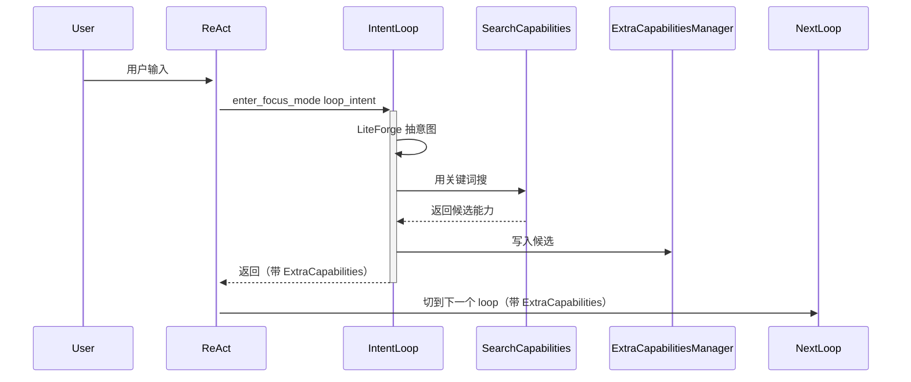
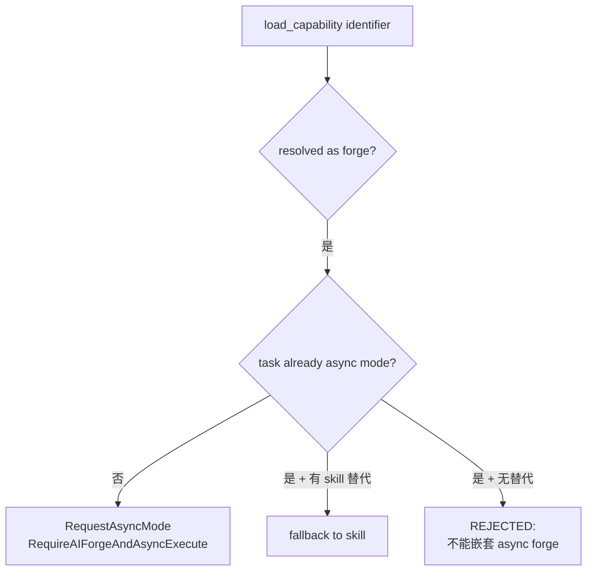
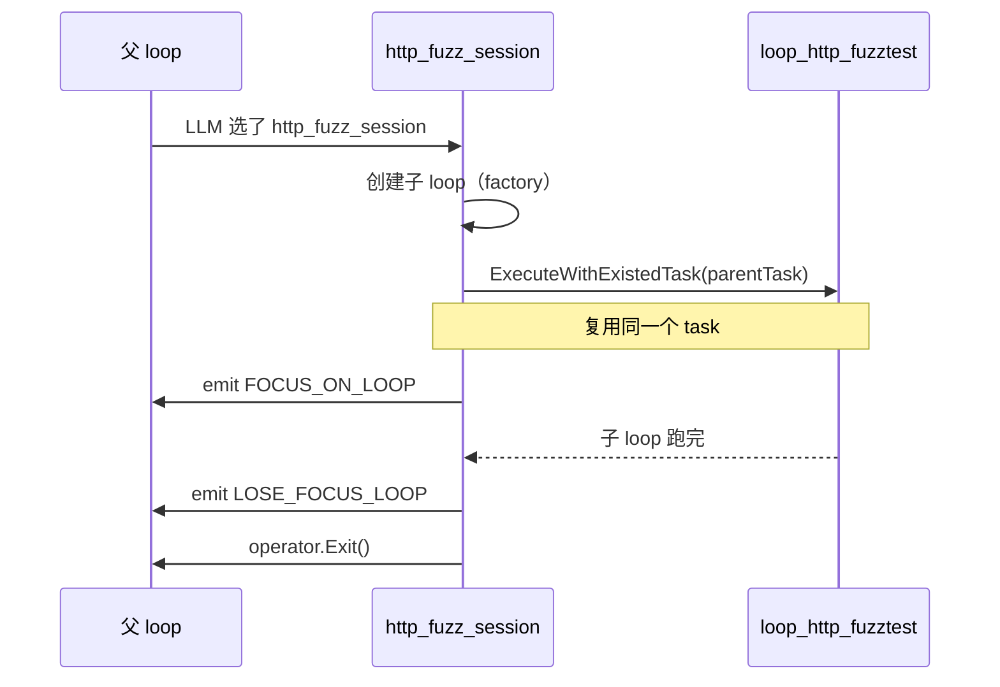
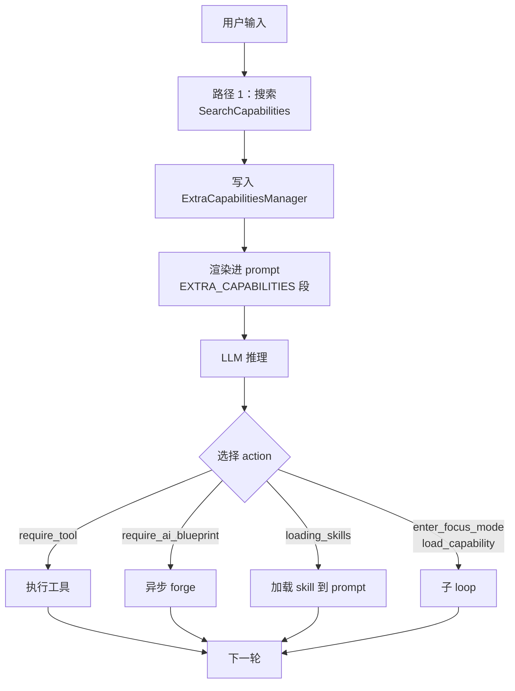

# 09. Capabilities：能力体系与发现

> 回到 [README](../README.md) | 上一章：[08-determinism-mechanisms.md](08-determinism-mechanisms.md) | 下一章：[10-build-your-own-loop.md](10-build-your-own-loop.md)

reactloops 把所有"AI 可调用的资源"统一抽象为**能力（Capability）**：

| 类型 | 含义 | 调用方式 |
|------|------|----------|
| `tool` | 单步工具 | `require_tool` action |
| `forge` | AI 蓝图（多步流程） | `require_ai_blueprint` action / async exec |
| `skill` | 上下文加载的技能（SKILL.md） | `loading_skills` action / 自动加载 |
| `focus_mode` | 子专注模式（另一个 ReActLoop） | `enter_focus_mode` / `load_capability` |

本章讲清楚这套体系：发现、注入、调用、子 loop 即能力。

## 9.1 数据结构

### `CapabilityDetail`

源码 [capability_search.go:22-26](../capability_search.go)：

```go
type CapabilityDetail struct {
    CapabilityName string `json:"capability_name"`
    CapabilityType string `json:"capability_type"`  // tool / forge / skill / focus_mode
    Description    string `json:"description"`
}
```

### `CapabilitySearchResult`

```go
type CapabilitySearchResult struct {
    SearchResultsMarkdown   string  // 完整 markdown 报告
    ContextEnrichment       string  // 给下一轮 prompt 用
    MatchedToolNames        []string
    MatchedForgeNames       []string
    MatchedSkillNames       []string
    MatchedFocusModeNames   []string
    RecommendedCapabilities []string
    CatalogMatchedNames     []string
    Details                 []CapabilityDetail
}
```

### 类型使用指南

源码 [capability_search.go:50-55](../capability_search.go) 给每种类型固定的"使用提示"：

| 类型 | 中英文使用提示 |
|------|----------------|
| `tool` | 通过 `require_tool` 调用指定工具 / Use `require_tool` to invoke the tool |
| `forge` | 通过 `require_ai_blueprint` 调用蓝图 / Use `require_ai_blueprint` to execute the blueprint |
| `skill` | 技能会被自动加载到上下文 / Skills are auto-loaded into context |
| `focus_mode` | 通过 `enter_focus_mode` 进入专注模式 / Use `enter_focus_mode` to enter focus mode |

## 9.2 三路能力发现

### 路径 1：BM25 + 子串匹配（最快）

源码 [capability_search.go:80-88](../capability_search.go)：

```go
searchToolsAndForges(query, keywords, limit, result, &markdown)  // BM25 over tool/forge names + descriptions
searchSkillsFromLoader(r, query, limit, result, &markdown)       // skill loader 提供
searchFocusModes(query, result, &markdown)                       // 注册表里的 loop_xxx
```

不调 AI，纯查找索引。

### 路径 2：能力目录匹配（catalog match）

```go
catalog := BuildCapabilityCatalog(r)  // 全量打包：所有 tools/forges/skills/focus_modes 的名字 + 描述
matched := MatchIdentifiersFromCapabilityCatalog(r, catalog, query)  // LiteForge 让 LLM 选
verified := VerifyCapabilityIdentifiers(loop, matched)               // 二次校验，过滤幻觉
```

`catalog` 太长时分块（`CapabilityCatalogChunkSize = 30 * 1024`）。每块跑一次 LiteForge。

### 路径 3：直接子串匹配（兜底）

`MatchCapabilitiesByText` 在 catalog 上做不调 AI 的纯字符串匹配。

### 调用入口：`SearchCapabilities`

```go
result, err := reactloops.SearchCapabilities(invoker, loop, reactloops.CapabilitySearchInput{
    Query:               "HTTP fuzz",
    Queries:             []string{"sql injection", "xss"},
    IncludeCatalogMatch: true,
    Limit:               10,
})
```

后续 `ApplyCapabilitySearchResult(invoker, loop, result)` 把搜索结果写入 `loop` 状态：

```go
loop.Set("capability_search_results", result.SearchResultsMarkdown)
loop.Set("matched_tool_names", strings.Join(result.MatchedToolNames, ","))
// ...
```

下一轮 prompt 渲染时这些 key 会被 `WithVar/WithVars` 系统拉进去。

## 9.3 ExtraCapabilitiesManager

### 是什么

reactloops 顶层的 prompt 已经塞满了"核心工具列表"。如果意图识别又发现了 50 个候选工具，**不能挤进核心列表**（核心列表稳定决定了 ReAct 的人格）。

`ExtraCapabilitiesManager` 给"动态发现的能力"一个独立段：

源码 [extra_capabilities.go:31-50](../extra_capabilities.go)：

```go
type ExtraCapabilitiesManager struct {
    tools      []*aitool.Tool
    forges     []ExtraForgeInfo
    skills     []ExtraSkillInfo
    focusModes []ExtraFocusModeInfo
    MaxExtraTools int  // 默认 50
    // ... 去重 set
}
```

### 在 prompt 中的位置

`<|EXTRA_CAPABILITIES_<nonce>|>...<|EXTRA_CAPABILITIES_END_<nonce>|>` 段（参考 [prompts/loop_template.tpl](../prompts/loop_template.tpl)）：

```text
<|EXTRA_CAPABILITIES_<nonce>|>
## Tools (工具)
- xxx_tool: ...

## Forges / Blueprints (AI 蓝图)
- yyy_forge: ...

## Skills (技能)
- zzz: ...

## Focus Modes (专注模式)
- loop_xxx: ...
<|EXTRA_CAPABILITIES_END_<nonce>|>
```

LLM 看到 EXTRA_CAPABILITIES 时知道："这些是按需推荐的，不是默认必须用的"。

### 注册

```go
ec := reactloops.NewExtraCapabilitiesManager()
ec.AddTools(tool1, tool2, tool3)
ec.AddForges(reactloops.ExtraForgeInfo{Name: "...", Description: "..."})
ec.AddSkills(reactloops.ExtraSkillInfo{Name: "...", Description: "..."})
ec.AddFocusModes(reactloops.ExtraFocusModeInfo{Name: "loop_xxx", Description: "..."})

// 注入到 loop
factory := reactloops.GetLoopFactory("loop_default")
loop, _ := factory(invoker, reactloops.WithExtraCapabilities(ec))
```

### 在意图识别后动态填充

典型流程：



参考 [loop_intent/](../loop_intent) 的实现。

## 9.4 `load_capability` 的 4 种身份

`load_capability` 是 reactloops 最强的"meta action"：用户/LLM 给一个标识符，系统自动判断它是什么类型并执行对应逻辑。

源码 [loopinfra/action_load_capability.go:81-112](../loopinfra/action_load_capability.go) 的核心 dispatch：

```go
switch resolvedType {
case aicommon.ResolvedAs_Tool:
    handleLoadTool(loop, invoker, ctx, identifier, op)
case aicommon.ResolvedAs_Forge:
    handleLoadForgeWithSkillFallback(loop, invoker, ctx, identifier, op, hasSkillAlt)
case aicommon.ResolvedAs_Skill:
    handleLoadSkill(loop, invoker, identifier, op)
case aicommon.ResolvedAs_FocusedMode:
    handleLoadFocusMode(loop, invoker, ctx, identifier, op)
default:
    handleLoadUnknown(loop, invoker, ctx, identifier, op)
}
```

### 9.4.1 Tool 身份

走 `invoker.ExecuteToolRequiredAndCall(taskCtx, identifier)`：

```go
result, directly, err := invoker.ExecuteToolRequiredAndCall(taskCtx, identifier)
handleToolCallResult(loop, taskCtx, invoker, identifier, result, directly, err, op)
```

行为等价于 `require_tool` action，会触发完整的 8 个 `tool_call_*` 事件。

### 9.4.2 Forge 身份（含 Skill fallback）

源码 [loopinfra/action_load_capability.go:135-196](../loopinfra/action_load_capability.go)：



- forge 默认是**异步执行**：`op.RequestAsyncMode()` + `task.SetAsyncMode(true)` + `RequireAIForgeAndAsyncExecute`
- 不允许嵌套异步：当前 task 已经是 async 时拒绝
- 拒绝时优雅降级：如果同名 skill 存在，自动 fallback 到 skill 加载

### 9.4.3 Skill 身份

源码 [loopinfra/action_load_capability.go:199-268](../loopinfra/action_load_capability.go)：

```go
mgr := loop.GetSkillsContextManager()
err := mgr.LoadSkill(identifier)
// 失败时 reflection critical
// 成功时 emit reference material + 推荐相关能力
```

skill 的特点是**加载到 prompt 上下文**：之后每轮 prompt 都包含 SKILL.md 的内容（`<|SKILLS_CONTEXT_<nonce>|>` 段）。

### 9.4.4 Focus Mode 身份（最关键）

源码 [loopinfra/action_load_capability.go:272-333](../loopinfra/action_load_capability.go)：

```go
subTask := aicommon.NewStatefulTaskBase(
    invoker.GetCurrentTaskId()+"_focus_"+identifier,
    userInput,
    taskCtx,
    cfg.GetEmitter(),
)
_, err := invoker.ExecuteLoopTaskIF(identifier, subTask, opts...)
```

注意：

1. **创建子 task**：和当前 task 不是同一个，避免相互污染
2. **复用同一个 emitter / config**：UI 看到的还是同一个流
3. **同步执行**：等子 loop 跑完才返回（`enter_focus_mode` 也是这个语义）
4. **失败时不退出主 loop**：`Continue` + Critical reflection，让 LLM 换策略

### 9.4.5 Unknown fallback

源码 [loopinfra/action_load_capability.go:337+](../loopinfra/action_load_capability.go)：

未知标识符会跑一个 1-iteration 的 intent recognition loop，让 LLM 帮忙找最相关的真名。

**重复保护**：如果同一个 unknown identifier 已经被试过，直接 BLOCK，强制 LLM 换策略。

## 9.5 子 Loop 即能力

把 `loop_xxx` 当作一个 LoopAction 注入到当前 loop。这是 reactloops 真正"组合化"的核心。

### 方式 A：`load_capability` 走 focus_mode 分支（前面讲过）

LLM 自由选择。适合用户/LLM 显式驱动。

### 方式 B：`enter_focus_mode` action

注册在 [loopinfra/action_enter_focus_mode.go](../loopinfra/action_enter_focus_mode.go)（如有）。比 `load_capability` 更显式，参数固定要求一个 `focus_mode_name`。

### 方式 C：`ConvertReActLoopFactoryToActionFactory`（编译期组合）

源码 [action_from_loop.go:11-69](../action_from_loop.go)：

```go
factory := reactloops.GetLoopFactory("loop_http_fuzztest")
actionFactory := reactloops.ConvertReActLoopFactoryToActionFactory("http_fuzz_session", factory)

// 在你的 loop 注册时
loopFactory := func(invoker aicommon.AIInvokeRuntime, opts ...reactloops.ReActLoopOption) (*reactloops.ReActLoop, error) {
    action, err := actionFactory(invoker)
    if err != nil { return nil, err }
    
    presetOpts := []reactloops.ReActLoopOption{
        reactloops.WithOverrideLoopAction(action),
        // 注意 action.ActionType = "http_fuzz_session"
    }
    return reactloops.NewReActLoop(invoker, append(presetOpts, opts...)...)
}
```

调用流程：



关键：**子 loop 用的是同一个 task**（不像 `load_capability` 创建子 task）。这意味着 timeline、verify 状态都共享。父 loop 在子 loop 退出后立即 `Exit()`，所以一般是"专注模式之间互相切换"的语义。

## 9.6 完整的 capability 生命周期



## 9.7 实战：让自己的 loop 能调用工具

最简单：

```go
reactloops.NewReActLoop(invoker,
    reactloops.WithAllowToolCall(true),  // 默认 true
    // 默认就有 require_tool / tool_compose / load_capability 等 action
)
```

加扩展能力（来自意图识别）：

```go
ec := reactloops.NewExtraCapabilitiesManager()
ec.AddTools(myCustomTools...)
loop, _ := factory(invoker,
    reactloops.WithExtraCapabilities(ec),
)
```

完全自定义工具集（不用扩展能力，直接注册到核心）：

```go
for _, tool := range myCustomTools {
    loopOpts = append(loopOpts, reactloops.WithRegisterLoopActionFromTool(tool))
}
```

注：核心 vs 扩展的取舍——核心进每轮 prompt 必发，扩展是按需加载。**核心列表 < 20 个**比较合理。

## 9.8 进一步阅读

- [03-prompt-system.md](03-prompt-system.md)：EXTRA_CAPABILITIES 段在 prompt 中的位置
- [04-actions.md](04-actions.md)：ConvertReActLoopFactoryToActionFactory 详解
- [11-case-studies.md](11-case-studies.md)：loop_intent 是 capability 发现的典范
- 源码：
  - [capability_search.go](../capability_search.go)
  - [extra_capabilities.go](../extra_capabilities.go)
  - [loopinfra/action_load_capability.go](../loopinfra/action_load_capability.go)
  - [action_from_loop.go](../action_from_loop.go)
