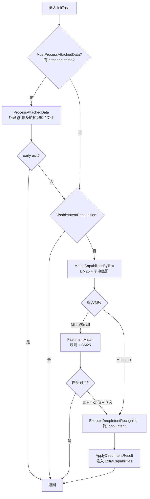

# 11. 案例研究：17 个专注模式横向对比

> 回到 [README](../README.md) | 上一章：[10-build-your-own-loop.md](10-build-your-own-loop.md) | 下一章：[12-debugging-and-observability.md](12-debugging-and-observability.md)

reactloops 目录下当前已注册 17 个专注模式。本章给出横向对比表，并对其中 5 个**最有学习价值**的 loop 做深度拆解。

## 11.1 横向对比表

| 注册名 | 复杂度 | Hook 用法 | 自定义 action 数 | 覆盖 directly_answer | LiteForge 用法 | 流式字段数 | 关键 prompt 文件 | 用途 |
|--------|--------|-----------|------------------|----------------------|---------------|-----------|------------------|------|
| [loop_default](../loop_default) | 低 | InitTask 处理 attached data + 意图识别 | 0（共享通用 actions） | 否 | DeepIntent 调用 | 0 | persistent_instruction | 通用 ReAct 入口 |
| [loop_intent](../loop_intent) | 中 | InitTask + OnPostIteraction | 2（query_capabilities, finalize_enrichment） | 否（用 finalize_enrichment 替代） | DeepIntent 实现 | 多 | persistent_instruction + reactive_data | 内部意图识别 |
| [loop_smart_qa](../loop_smart_qa) | 中 | InitTask | 7（search_knowledge, web_search 等） | 否（用 final_answer） | 否 | 多 | persistent_instruction | 智能问答 |
| [loop_knowledge_enhance](../loop_knowledge_enhance) | 中 | OnPostIteraction（finalize fallback） | 1（search） | 否 | finalize fallback | 1 | persistent_instruction | 知识库增强 |
| [loop_plan](../loop_plan) | 高 | InitTask + OnPostIteraction | 8（output_facts, search_knowledge, scan_port 等） | 否（用 finish_exploration） | 多个 LiteForge 步骤生成文档/计划 | 多（含 AITag） | persistent + plan_from_document + guidance_document | 任务规划 |
| [loop_http_fuzztest](../loop_http_fuzztest) | 极高 | InitTask + OnPostIteraction | 9（set_http_request, fuzz_method, fuzz_path 等） | 是 | 初始化 + finalize 多次 | 多（AITag + Stream） | persistent + reactive_data + reflection_output_example | HTTP 安全模糊测试 |
| [loop_http_flow_analyze](../loop_http_flow_analyze) | 高 | OnPostIteraction（强制 fallback） | 4（filter, match, get_detail, output_findings） | 是 | finalize fallback | 多 | persistent + reactive_data | HTTP 流量分析 |
| [loop_code_security_audit](../loop_code_security_audit) | 极高 | InitTask + 多阶段 | 多（phase1 + phase2 扫描） | 是 | 多个 phase 内部 | 多 | persistent + 多 phase | 代码安全审计 |
| [loop_syntaxflow_rule](../loop_syntaxflow_rule) | 高 | InitTask（LiteForge 抽参数） | 多 | 是 | 强 | 多 | persistent + reactive_data | SyntaxFlow 规则编写 |
| [loop_yaklangcode](../loop_yaklangcode) | 高 | InitTask（LiteForge 解析需求） | 多（grep_yaklang_samples, gen_code 等） | 是 | 强 | 多（含 yaklang_code_editor） | persistent + reactive_data | yak 代码生成 |
| [loop_write_python_script](../loop_write_python_script) | 高 | InitTask | 多 | 是 | 是 | 多 | persistent + reactive_data | python 脚本生成 |
| [loop_internet_research](../loop_internet_research) | 中 | OnPostIteraction（finalize fallback） | 多（web_search 等） | 否 | finalize fallback | 多 | persistent | 互联网调研 |
| [loop_dir_explore](../loop_dir_explore) | 中 | InitTask | 多（filesystem 操作） | 否 | 是 | 多 | persistent | 目录探索 |
| [loop_java_decompiler](../loop_java_decompiler) | 高 | InitTask + OnPostIteraction | 多（decompile_jar 等） | 是 | 是 | 多 | persistent | Java 反编译 |
| [loop_ai_skill_audit](../loop_ai_skill_audit) | 中 | InitTask | 多 | 是 | 是 | 多 | persistent | AI 技能审计 |
| [loop_report_generating](../loop_report_generating) | 高 | InitTask（LiteForge 抽报告意图） | 多 | 是 | 强 | 多 | persistent | 报告生成 |
| [loop_infosec_recon](../loop_infosec_recon) | 高 | InitTask + OnPostIteraction | 多（recon 系列） | 是 | 是 | 多 | persistent | 信息安全侦察 |

> **复杂度判定**：
> - 低：< 50 行 init.go，几乎只用默认配置
> - 中：50-150 行 init.go，有几个自定义 action
> - 高：150-300 行 init.go，多 hook + LiteForge
> - 极高：>300 行 init.go 且有专门的子目录（actions、prompts、辅助函数）

## 11.2 推荐学习顺序

按递增复杂度：

1. **[loop_default](../loop_default)**：理解最简形态
2. **[loop_smart_qa](../loop_smart_qa)**：理解 ActionFilter + 自定义 actions
3. **[loop_knowledge_enhance](../loop_knowledge_enhance)**：理解 finalize fallback 模式
4. **[loop_intent](../loop_intent)**：理解内部 loop + meta 行为
5. **[loop_http_flow_analyze](../loop_http_flow_analyze)**：理解多 action + finalize fallback
6. **[loop_plan](../loop_plan)**：理解多 LiteForge 编排
7. **[loop_http_fuzztest](../loop_http_fuzztest)**：理解极端定制化（终极目标）

下面给 5 个最值得细看的 loop 做深度拆解。

---

## 11.3 深度拆解 1：loop_default

### 角色

通用入口。当用户输入没有明显的领域意图时，ReAct 默认进这个 loop。

### 入口

源码 [loop_default/init.go](../loop_default/init.go)。注意它**没有自己的 init.go 主 factory**，而是在另一个文件（参考 [loop_default/](../loop_default) 目录）注册。

### init 流程

源码 [loop_default/init.go:11-101](../loop_default/init.go) 的 `buildInitTask`：



### 学到什么

- **InitTask 是 ReAct 框架最重要的扩展点**：在不动主循环的前提下做"引导环境"
- **能力发现的级联**：先快后慢、先便宜后贵
- **`loop_default → loop_intent` 同栈调用**：演示了 reactloops 的组合化

---

## 11.4 深度拆解 2：loop_intent

### 角色

内部意图识别 loop。`loop_default` 的深度路径会调用它。`WithLoopIsHidden(true)` 表示前端不暴露。

### 关键配置

源码 [loop_intent/init.go:24-94](../loop_intent/init.go)：

```go
reactloops.WithDisableLoopPerception(true)        // 不需要感知层
reactloops.WithAllowRAG(false)
reactloops.WithAllowAIForge(false)
reactloops.WithAllowPlanAndExec(false)
reactloops.WithAllowToolCall(false)               // 不允许调真工具
reactloops.WithAllowUserInteract(false)           // 不允许问用户
reactloops.WithUseSpeedPriorityAICallback(true)   // 用快模型
reactloops.WithMaxIterations(1)                   // 只跑一轮！
reactloops.WithActionFilter(...)                  // 只允许 query_capabilities + finalize_enrichment
```

### 学到什么

- **专注模式可以是"一次性"的**：`MaxIterations=1` + 严格 action filter = 只做一件事
- **关闭多余能力**：感知 / RAG / 工具调用都关掉，把 token 全用在意图识别
- **`WithLoopIsHidden`**：前端不显示，但是父 loop 可以调用
- **Speed priority**：意图识别要快，质量可接受即可
- **组合 OnPostIterationHook 强制 finalize**：就算 LLM 没主动调 `finalize_enrichment`，hook 兜底

---

## 11.5 深度拆解 3：loop_smart_qa

### 角色

智能问答。用户提问，系统结合知识库 / 网络 / 文件 / 持久记忆 给答案。

### 关键配置

源码 [loop_smart_qa/init.go:35-95](../loop_smart_qa/init.go)：

```go
reactloops.WithAllowRAG(false)              // 通过自己的 search_knowledge action 控制
reactloops.WithAllowAIForge(false)
reactloops.WithAllowPlanAndExec(false)
reactloops.WithAllowToolCall(false)         // 关掉通用工具，只用自己注册的
reactloops.WithMaxIterations(5)              // 限制 5 轮
reactloops.WithActionFilter(...)            // 白名单：search_knowledge, web_search, read_file, find_files, grep_text, search_persistent_memory, final_answer
// 注册 7 个自定义 action
knowledgeSearchAction(r),
webSearchAction(r),
readFileAction(r),
findFilesAction(r),
grepTextAction(r),
memorySearchAction(r),
finalAnswerAction(r),
```

### 学到什么

- **白名单胜过黑名单**：明确允许哪些 actions，拒绝其他所有
- **不用通用工具**：`WithAllowToolCall(false)` 然后自己注册定制版（更可控、更易测试）
- **`final_answer` 替代 `directly_answer`**：自定义命名让 prompt 更直观
- **5 轮迭代**：限制成本，逼 LLM 聚焦

---

## 11.6 深度拆解 4：loop_plan

### 角色

任务规划。生成结构化的多步执行计划，结合知识库 / 文件系统 / 互联网信息 / SMART 思维框架。

### 关键配置

源码 [loop_plan/init.go:72-176](../loop_plan/init.go)：

```go
reactloops.WithAllowRAG(false)
reactloops.WithAllowToolCall(false)
reactloops.WithAllowAIForge(false)
reactloops.WithAllowPlanAndExec(false)
// 关键：用 PersistentContextProvider 而不是简单的 Instruction
reactloops.WithPersistentContextProvider(func(loop, nonce) (string, error) {
    return utils.RenderTemplate(persistentInstruction, map[string]any{
        "Nonce": nonce, "UserInput": ..., "PlanPrompt": planPrompt,
    })
})
// AITag 字段：让 LLM 输出 facts 段
reactloops.WithAITagFieldWithAINodeId(PlanFactsAITagName, ..., aicommon.TypeTextMarkdown),
reactloops.WithMaxIterations(PlanMaxIterations),  // 4
// 8 个 action：
finishExploration(r), outputFactsAction(r), searchKnowledge(r),
readFileAction(r), findFilesAction(r), grepTextAction(r),
webSearchAction(r), scanPortAction(r), simpleCrawlerAction(r),
```

### 关键设计

#### 末轮 action 收紧

```go
isLastIteration := currentIter+1 >= maxIter
if isLastIteration {
    for _, name := range infoGatheringActions {
        loop.RemoveAction(name)
    }
    // 强制只能 finish_exploration
}
```

最后一轮**动态删除**所有信息收集 action，强制 LLM 收尾。这是 reactloops 的高级用法。

#### 多次 LiteForge 编排

`finish_exploration` 触发后，`OnPostIteraction` 会调多个 LiteForge：

1. `generateGuidanceDocument`：把 facts + evidence 转成结构化文档
2. `generatePlanFromDocument`：再把文档转成可执行计划
3. 流式输出到不同 NodeId

源码 [loop_plan/generate_document_and_plan.go](../loop_plan/generate_document_and_plan.go)。

### 学到什么

- **PersistentContextProvider vs PersistentInstruction**：后者是字符串，前者是动态渲染（每轮都跑一次）
- **末轮强制收尾**：LLM 不主动 finish 时，框架强行剥夺它的选项
- **多 LiteForge 串联**：复杂的"工程化生成"用 LiteForge 拆步
- **AITagField 用于结构化 markdown 输出**：facts 段比 JSON 字段流更适合 markdown

---

## 11.7 深度拆解 5：loop_http_fuzztest（终极复杂度）

### 角色

HTTP 安全模糊测试。所有 reactloops 扩展点几乎都用上了。

### 文件结构

```text
loop_http_fuzztest/
├── init.go                        # 主 factory（120+ 行 With* 组合）
├── action_directly_answer.go      # 覆盖默认 directly_answer
├── action_set_http_request.go     # 设置目标请求
├── action_patch_http_request.go   # 单点细粒度修改
├── action_modify_http_request.go  # 整包重写
├── action_fuzz_method.go          # method fuzz
├── action_fuzz_path.go            # path fuzz
├── action_fuzz_header.go          # header fuzz
├── action_fuzz_get_params.go      # GET 参数 fuzz
├── action_fuzz_body.go            # body fuzz
├── action_fuzz_cookie.go          # cookie fuzz
├── action_generate_and_send.go    # 自由生成
├── init.go (init_task)            # 复杂的初始化
├── finalize.go                    # 复杂的 finalize
├── session_*.go                   # 会话持久化
├── http_request_*.go              # HTTP 包工具
├── prompts/                       # 多个 prompt 文件
└── *_test.go                      # 测试
```

### 关键配置（init.go:35-119）

```go
preset := []reactloops.ReActLoopOption{
    reactloops.WithAllowRAG(false),
    reactloops.WithAllowToolCall(true),
    
    // 两种 AITag：生成的包 / 修改后的包
    reactloops.WithAITagFieldWithAINodeId("GEN_PACKET", ..., aicommon.TypeCodeHTTPRequest),
    reactloops.WithAITagFieldWithAINodeId("GEN_MODIFIED_PACKET", ..., aicommon.TypeCodeHTTPRequest),
    
    // 覆盖 directly_answer
    reactloops.WithOverrideLoopAction(loopActionDirectlyAnswerHTTPFuzztest),
    
    // 复杂的 InitTask（160+ 行）
    reactloops.WithInitTask(buildInitTask(r)),
    
    // 复杂的 finalize
    BuildOnPostIterationHook(r),
    
    reactloops.WithMaxIterations(int(r.GetConfig().GetMaxIterationCount())),
    reactloops.WithAllowUserInteract(r.GetConfig().GetAllowUserInteraction()),
    reactloops.WithPersistentInstruction(instruction),
    reactloops.WithReflectionOutputExample(outputExample),
    
    // 复杂的 ReactiveData：20+ 个状态字段渲染
    reactloops.WithReactiveDataBuilder(...),
    
    // 9 个自定义 action
    setHTTPRequestAction(r), patchHTTPRequestAction(r), modifyHTTPRequestAction(r),
    fuzzMethodAction(r), fuzzPathAction(r), fuzzHeaderAction(r),
    fuzzGetParamsAction(r), fuzzBodyAction(r), fuzzCookieAction(r),
    generateAndSendPacketAction(r),
}
```

### 关键设计

#### InitTask：bootstrap 上下文

源码 [loop_http_fuzztest/init.go:128-184](../loop_http_fuzztest/init.go)（不同于注册的 init.go）：

1. 检查是否已有 HTTP 请求（来自上轮 session）
2. 没有则用 LiteForge 从用户输入抽取 raw HTTP / URL
3. 抽取失败时尝试从历史 session 恢复
4. 都失败 → emit "请提供 HTTP 包" + `op.Done()` 早退
5. 成功 → 再用 LiteForge 生成"测试要点 + 灵感提示"流到 `quick_plan` NodeId

#### Override directly_answer

源码 [loop_http_fuzztest/action_directly_answer.go](../loop_http_fuzztest/action_directly_answer.go)：

```go
ActionVerifier: func(loop, action) error {
    // 验证：不能同时用 payload 字段和 FINAL_ANSWER tag
    // 验证：必须有内容
}
ActionHandler: func(loop, action, op) {
    // 区分内容来源（payload / tag）
    // EmitFileArtifact + EmitResultAfterStream
    // 持久化会话上下文
    // 添加 timeline 元事件
    // op.Exit()
}
```

#### Finalize：自动总结

源码 [loop_http_fuzztest/finalize.go:13-28](../loop_http_fuzztest/finalize.go)：

```go
func BuildOnPostIterationHook(invoker aicommon.AIInvokeRuntime) reactloops.ReActLoopOption {
    return reactloops.WithOnPostIteraction(func(loop, iteration, task, isDone, reason, op) {
        if !isDone { return }
        persistLoopHTTPFuzzSessionContext(loop, "post_iteration")
        
        // 已经回答过就不重复
        if hasLoopHTTPFuzzFinalAnswerDelivered(loop) || 
           hasLoopHTTPFuzzDirectlyAnswered(loop) || 
           getLoopHTTPFuzzLastAction(loop) == "directly_answer" {
            return
        }
        
        // 否则强制生成 fallback 总结
        finalContent := generateLoopHTTPFuzzFinalizeSummary(loop, reason)
        deliverLoopHTTPFuzzFinalizeSummary(loop, invoker, finalContent)
        
        if reasonErr, ok := reason.(error); ok && strings.Contains(reasonErr.Error(), "max iterations") {
            op.IgnoreError()
        }
    })
}
```

#### 复杂的 ReactiveData

每轮都把 20+ 个状态字段拉进 prompt：

- `OriginalRequest` / `OriginalRequestSummary`
- `CurrentRequestSummary` / `PreviousRequestSummary`
- `RequestChangeSummary` / `RequestModificationReason`
- `RepresentativeRequest` / `RepresentativeResponse`
- `DiffResult` / `VerificationResult`
- `SecurityKnowledge`
- `RecentActionsSummary` / `TestedPayloadSummary`
- `FuzztagReference` / `PayloadGroupsReference`

### 学到什么

- **极端定制化的极限**：所有 reactloops 扩展点都能用
- **session 持久化**：跨 task 状态保留（数据库存储）
- **多次 LiteForge 编排**：init / finalize / 中间状态生成都用
- **AITagField 输出 HTTP 包**：`TypeCodeHTTPRequest` 让前端按 HTTP 格式渲染
- **状态密集型 ReactiveData**：每轮 prompt 都包含完整运行时状态
- **Override + Verifier**：自定义 directly_answer 加严格校验

---

## 11.8 其他 loop 速览

### loop_knowledge_enhance

知识库增强。简单的 single-action loop（`search`）+ 强 finalize fallback。**学习 finalize 模式的最佳示例**。

### loop_internet_research

互联网调研。多个 web_search action 组合 + finalize 生成 markdown 报告。

### loop_dir_explore

目录探索。filesystem 操作 + 文件树渲染。**学习如何处理大量返回数据的最佳示例**。

### loop_code_security_audit

代码安全审计。多 phase 设计：phase1 扫描发现问题 → phase2 验证 → phase3 报告。**学习多 phase loop 切换**。

### loop_syntaxflow_rule

SyntaxFlow 规则编写。强 InitTask 用 LiteForge 抽取规则需求。

### loop_yaklangcode

yak 代码生成。AITag 输出 yak 代码到专用 editor 节点。**学习 `code_yaklang` ContentType**。

### loop_write_python_script

类似 yaklangcode，但目标是 python。

### loop_java_decompiler

Java 反编译。集成 jar 处理工具 + LiteForge 分析结果。

### loop_ai_skill_audit

AI 技能审计。检查已有 skill 库的覆盖率。

### loop_report_generating

报告生成。集成模板 + 多源数据 + LiteForge 渲染。

### loop_infosec_recon

信息安全侦察。集成 nmap / dnslog / 子域名 / 端口扫描等。

---

## 11.9 模式总结

从横向对比中提取的几个**通用模式**：

### 模式 A：白名单 ActionFilter

`loop_smart_qa` / `loop_intent` / `loop_plan` 都用 `WithActionFilter` 严格白名单。**这是控制 loop 范围的最强武器**。

### 模式 B：Finalize Fallback

`loop_knowledge_enhance` / `loop_http_fuzztest` / `loop_http_flow_analyze` / `loop_internet_research` 都有 `OnPostIteraction(isDone=true)` 强制兜底。

```go
if hasDelivered { return }
useLiteForge to generate report
EmitFileArtifact + EmitResultAfterStream
IgnoreError on max iterations
```

### 模式 C：Override directly_answer

复杂 loop（fuzztest / flow_analyze / 多个代码生成 loop）用 `WithOverrideLoopAction(customDirectlyAnswer)` 实现自定义最终输出语义。

### 模式 D：InitTask 用 LiteForge

`loop_http_fuzztest` / `loop_syntaxflow_rule` / `loop_yaklangcode` 在 init 阶段用 LiteForge 处理用户输入：抽参数、提取上下文、生成 quick_plan。

### 模式 E：末轮收紧

`loop_plan` 在最后一轮删除所有信息收集 action。这是**框架级强制收尾**的范例。

### 模式 F：内部 Loop（Hidden）

`loop_intent` 用 `WithLoopIsHidden(true)` + `MaxIterations=1` + Speed priority。**给"内部预处理"的标准做法**。

### 模式 G：状态密集 ReactiveData

`loop_http_fuzztest` 把 20+ 状态字段都注入到每轮 prompt。**适合状态密集的工程化任务**。

## 11.10 进一步阅读

- [10-build-your-own-loop.md](10-build-your-own-loop.md)：自己造一个
- [05-hooks-and-lifecycle.md](05-hooks-and-lifecycle.md)：InitTask / OnPostIteraction 详解
- [09-capabilities.md](09-capabilities.md)：loop_intent 的 capability 发现机制
