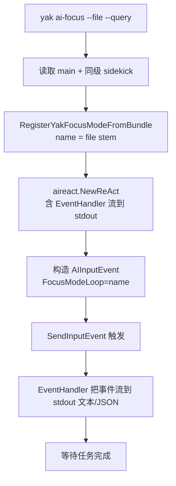

# 13. Yak 专注模式（Yak Focus Mode）

> 回到 [README](../README.md) | 上一章：[12-debugging-and-observability.md](12-debugging-and-observability.md)

> **不能因为是 yak 脚本就阉割任何 ReActLoop 能力。**
>
> 脚本作者只需要写 yak，无需懂 Go：声明式配置 + 钩子函数 + action 列表，三层契约。

前面 12 章讲的是 **Go 端**怎么写 `loop_xxx/`。本章讲一个完全不同的入口：直接用 **Yak 脚本**编写专注模式。Go 端构造一座桥（[../yak_focus_mode_constants.go](../yak_focus_mode_constants.go) 等），把所有 `With*` 选项映射成 Yak 脚本里的 `__DUNDER__` 常量、`focusXxx` 钩子、`__ACTIONS__` 列表三层契约。

读完本章你会知道：

- Yak 专注模式的三层契约模型与对应的 Go 选项
- `<name>.ai-focus.yak` 主文件 + 同级 sidekick 自动加载机制
- `yak ai-focus` CLI 命令一行直跑你的 yak 专注模式
- 三个内置示例：`hello_yak` / `yak_scan_demo` / `comprehensive_showcase`
- 编写时常见坑（`loop.Get` vs `loop.GetVariable`、isolated 引擎 sidekick 副作用）

## 13.1 为什么需要 Yak 专注模式？

Go 实现的专注模式有两个不便：

1. **写起来重**：要建子包、写 init.go、写 prompt 模板文件、修改 [reactinit/init.go](../reactinit/init.go)，最后还要重新编译 yaklang 二进制。
2. **不便分发**：用户要扩展专注模式，必须 PR 到 yaklang 主仓或自己 fork 编译。

Yak 专注模式解决这两个问题：

- **写一个 `.ai-focus.yak` 即可**，命令行直跑：`yak ai-focus --file my.ai-focus.yak --query "..."`
- **零编译**：脚本即配置即代码，可以分发、热改、版本化
- **能力对等**：Go 端能用的 `With*` 选项基本都能在 Yak 端用 dunder 常量或 focusXxx 钩子表达

## 13.2 三层契约模型

| 层 | Yak 形式 | 用途 |
|---|---|---|
| 静态声明（Boot 期） | `__DUNDER__` 大写常量 | 元数据 + 数值/布尔阈值 + Prompt 文本 + `__VARS__` 初始变量 |
| 行为定义（Run 期） | `focusXxx` 风格闭包函数 | 与 loop 实例强绑定的钩子、动态 getter、prompt 生成器 |
| Action 注册 | `__ACTIONS__` 列表（dict 内嵌闭包） | 自定义 action 的 verifier/handler、参数 schema |

Boot 与 Run 双相执行：

- **Boot 相**：扫描 `*.ai-focus.yak`，跑一次只读 caller 把 metadata dunder 抽出来注册到 loops 注册表（`RegisterLoopFactory`）。
- **Run 相**：每次 `CreateLoopByName` 时，**新建独立 antlr4yak 引擎**重跑一遍主脚本 + sidekick，把全部 `__DUNDER__` / `focusXxx` / `__ACTIONS__` 抽出来转成 `[]ReActLoopOption`，最后 `NewReActLoop`。每个 loop 实例的 yak 引擎独立隔离；loop 销毁时通过 `WithOnLoopRelease` 自动回收。

源码：[../yak_focus_mode_register.go](../yak_focus_mode_register.go)。

## 13.3 完整契约表

所有常量名以代码常量形式集中收口在 [../yak_focus_mode_constants.go](../yak_focus_mode_constants.go)，下表是给脚本作者的速查。

### 13.3.1 元数据 dunder（Boot 期一次性读取，转 `LoopMetadataOption`）

| Yak 常量 | Go 选项 | 类型 | 说明 |
|---|---|---|---|
| `__NAME__` | 注册名（loops 注册表 key） | string | 不设置则取文件 stem |
| `__VERBOSE_NAME__` | `WithVerboseName` | string | 英文展示名 |
| `__VERBOSE_NAME_ZH__` | `WithVerboseNameZh` | string | 中文展示名 |
| `__DESCRIPTION__` | `WithLoopDescription` | string | 英文描述 |
| `__DESCRIPTION_ZH__` | `WithLoopDescriptionZh` | string | 中文描述 |
| `__USAGE_PROMPT__` | `WithLoopUsagePrompt` | string | schema 使用说明 |
| `__OUTPUT_EXAMPLE__` | `WithLoopOutputExample` | string | 示例输出 |
| `__IS_HIDDEN__` | `WithLoopIsHidden` | bool | 是否对用户隐藏 |

实现：[../yak_focus_mode_metadata.go](../yak_focus_mode_metadata.go)。

### 13.3.2 静态配置 dunder（Run 期读取，转 `ReActLoopOption`）

#### Prompt 与文本

| Yak 常量 | Go 选项 |
|---|---|
| `__PERSISTENT_INSTRUCTION__` | `WithPersistentInstruction` |
| `__REFLECTION_OUTPUT_EXAMPLE__` | `WithReflectionOutputExample` |
| `__TOOL_CALL_INTERVAL_REVIEW_EXTRA_PROMPT__` | `WithToolCallIntervalReviewExtraPrompt` |

#### 数值与开关阈值

| Yak 常量 | Go 选项 | 类型 |
|---|---|---|
| `__MAX_ITERATIONS__` | `WithMaxIterations` | int |
| `__PERIODIC_VERIFICATION_INTERVAL__` | `WithPeriodicVerificationInterval` | int |
| `__SAME_ACTION_TYPE_SPIN_THRESHOLD__` | `WithSameActionTypeSpinThreshold` | int |
| `__SAME_LOGIC_SPIN_THRESHOLD__` | `WithSameLogicSpinThreshold` | int |
| `__MAX_CONSECUTIVE_SPIN_WARNINGS__` | `WithMaxConsecutiveSpinWarnings` | int |
| `__MEMORY_SIZE_LIMIT__` | `WithMemorySizeLimit` | int |
| `__NO_END_LOADING_STATUS__` | `WithNoEndLoadingStatus` | bool |
| `__USE_SPEED_PRIORITY_AI__` | `WithUseSpeedPriorityAICallback` | bool |
| `__DISABLE_LOOP_PERCEPTION__` | `WithDisableLoopPerception` | bool |
| `__ENABLE_SELF_REFLECTION__` | `WithEnableSelfReflection` | bool |

#### 能力开关（静态版）

| Yak 常量 | Go 选项 |
|---|---|
| `__ALLOW_RAG__` | `WithAllowRAG` |
| `__ALLOW_AI_FORGE__` | `WithAllowAIForge` |
| `__ALLOW_PLAN_AND_EXEC__` | `WithAllowPlanAndExec` |
| `__ALLOW_TOOL_CALL__` | `WithAllowToolCall` |
| `__ALLOW_USER_INTERACT__` | `WithAllowUserInteract` |

#### 初始变量与流式字段

| Yak 常量 | Go 选项 | 形式 |
|---|---|---|
| `__VARS__` | `WithVars(map[string]any)` | yak dict |
| `__AI_TAG_FIELDS__` | 多次 `WithAITagFieldWithAINodeId` | dict 列表（`tagName` / `variableName` / `aiNodeId` / `contentType`） |

实现：[../yak_focus_mode_options_static.go](../yak_focus_mode_options_static.go)。

### 13.3.3 动态钩子 focusXxx（与 loop 实例强绑定）

| Yak 钩子 | Go 选项 | 优先级 |
|---|---|---|
| `focusInitTask` | `WithInitTask` | — |
| `focusPostIteration` | `WithOnPostIteraction` | — |
| `focusOnTaskCreated` | `WithOnTaskCreated` | — |
| `focusOnAsyncTaskTrigger` | `WithOnAsyncTaskTrigger` | — |
| `focusOnAsyncTaskFinished` | `WithOnAsyncTaskFinished` | — |
| `focusGeneratePrompt` | `WithLoopPromptGenerator` | — |
| `focusPersistentContext` | `WithPersistentContextProvider` | 高于 `__PERSISTENT_INSTRUCTION__` |
| `focusReflectionOutputExample` | `WithReflectionOutputExampleContextProvider` | 高于 `__REFLECTION_OUTPUT_EXAMPLE__` |
| `focusReactiveData` | `WithReactiveDataBuilder` | — |
| `focusActionFilter` | `WithActionFilter` | — |
| `focusAllowRAG` | `WithAllowRAGGetter` | 高于 `__ALLOW_RAG__` |
| `focusAllowAIForge` | `WithAllowAIForgeGetter` | 高于 `__ALLOW_AI_FORGE__` |
| `focusAllowPlanAndExec` | `WithAllowPlanAndExecGetter` | 高于 `__ALLOW_PLAN_AND_EXEC__` |
| `focusAllowToolCall` | `WithAllowToolCallGetter` | 高于 `__ALLOW_TOOL_CALL__` |
| `focusAllowUserInteract` | `WithUserInteractGetter` | 高于 `__ALLOW_USER_INTERACT__` |

> **优先级规则**：动态 focusXxx getter 同时存在时，会**覆盖**对应的静态 `__DUNDER__`。这样脚本作者既可以"先写一个静态默认值，必要时挂一个 getter 来根据 loop 实时状态决定"。

实现：[../yak_focus_mode_options_dynamic.go](../yak_focus_mode_options_dynamic.go)。

### 13.3.4 Action 注册 `__ACTIONS__`

`__ACTIONS__` 是一个 dict 列表，每条形如：

```yak
{
    "type":           "scan_target",
    "description":    "scan a target URL",
    "asyncMode":      false,
    "outputExamples": `{"@action":"scan_target","target":"https://example.com"}`,
    "options": [
        {"name": "target", "type": "string", "required": true,
         "help": "the target URL to scan"},
    ],
    "verifier": func(loop, action) {
        target = action.GetString("target")
        if target == "" {
            return error("target is required")
        }
        loop.Set("current_target", target)
        return nil
    },
    "handler": func(loop, action, op) {
        target = loop.GetVariable("current_target")
        op.Feedback(f"scanning ${target}")
        op.Continue()
    },
    "aiTagFields": [
        {"tagName": "...", "variableName": "...",
         "aiNodeId": "...", "contentType": "text_markdown"},
    ],
}
```

字段映射：

| dict key | Go 选项参数 |
|---|---|
| `type` | action 类型名 |
| `description` | action 描述 |
| `options` | 转 `[]aitool.ToolOption` |
| `verifier` | `WithRegisterLoopAction` 的 verifier 闭包 |
| `handler` | `WithRegisterLoopAction` 的 handler 闭包 |
| `asyncMode` | `WithRegisterLoopActionAsync(true)` |
| `outputExamples` | action 输出示例 |
| `aiTagFields` | `WithRegisterLoopActionWithStreamField` |

`__OVERRIDE_ACTIONS__` 与 `__ACTIONS__` 同结构，作用是**替换**已注册的同名 action（例如自定义 `directly_answer` 的校验）。`__ACTIONS_FROM_TOOLS__` / `__ACTIONS_FROM_LOOPS__` 是字符串列表，用于把已有工具或子 loop 包装成 action。

实现：[../yak_focus_mode_actions.go](../yak_focus_mode_actions.go) + [../yak_focus_mode_action_options.go](../yak_focus_mode_action_options.go)。

## 13.4 文件命名与 sidekick 机制

### 13.4.1 命名约定

| 文件 | 角色 |
|---|---|
| `<name>.ai-focus.yak` | 主文件，每个 focus mode 有且仅有一个 |
| `*.yak`（同级目录其它 yak 文件） | sidekick 插件，自动加载 |

`<name>` 推导规则：文件名 stem 即为 name。例如 `comprehensive_showcase.ai-focus.yak` → name = `comprehensive_showcase`。

### 13.4.2 目录形态范例

```
focus_modes/
  hello_yak/
    hello_yak.ai-focus.yak
  yak_scan_demo/
    yak_scan_demo.ai-focus.yak
    tool-in-my-focus.yak       # sidekick：自定义扫描工具
    helpers-format.yak         # sidekick：格式化函数
  comprehensive_showcase/
    comprehensive_showcase.ai-focus.yak
    tool-helpers.yak           # sidekick 1
    utils-prompt.yak           # sidekick 2
```

### 13.4.3 加载策略

采用**「字典序拼接 + 一次性执行」**：

1. 扫描主文件同级目录所有 `.yak` 文件（排除 `.ai-focus.yak` 自身）
2. 按文件名字典序排序（确定性输出）
3. 把 sidekick 内容拼接到主文件**之前**作为完整代码块一次性执行
4. 这样 sidekick 中的顶层 `func` / `var` 在主文件中作为全局符号直接可用

源码：[../reactloops_yak/loader.go](../reactloops_yak/loader.go) + [../reactloops_yak/embed.go](../reactloops_yak/embed.go)。

> **注意事项**
>
> - **sidekick 顶层只做声明，不做有副作用调用**（boot 期会跑全部代码，副作用会拖慢启动并污染 metadata 抽取）。
> - **sidekick 命名冲突**：多个 sidekick 顶层定义同名变量会被字典序后加载者覆盖，请避免。
> - **`.ai-focus.yak` 后缀的 yak 文件不会被当 sidekick**：扫描器会过滤。

## 13.5 CLI 命令：`yak ai-focus`

源码：[common/yak/cmd/yakcmds/ai_focus.go](../../../../../yak/cmd/yakcmds/ai_focus.go)。

### 13.5.1 用法

```bash
yak ai-focus --file my_focus.ai-focus.yak --query "测试我的专注模式"

yak ai-focus --file ./focus_modes/yak_scan_demo/yak_scan_demo.ai-focus.yak \
             --query "扫描 https://example.com"

yak ai-focus --file my_focus.ai-focus.yak --query "..." --max-iter 10 --json
```

### 13.5.2 命令行参数

| Flag | 类型 | 说明 |
|---|---|---|
| `--file` `-f` | string | 必需。`.ai-focus.yak` 主文件路径 |
| `--query` `-q` | string | 必需。用户查询语句 |
| `--max-iter` | int | 可选。覆盖 `__MAX_ITERATIONS__` |
| `--json` | bool | 可选。事件以 JSON 行式输出（默认人类可读文本） |
| `--ai-type` | string | 可选。AI 提供方（chatglm / openai 等） |
| `--debug` | bool | 可选。开启 debug 日志 |
| `--timeout` | duration | 可选。整个会话超时 |

### 13.5.3 执行流程



## 13.6 三个内置示例

源码目录：[../reactloops_yak/focus_modes/](../reactloops_yak/focus_modes/)。

### 13.6.1 hello_yak（最小骨架）

[../reactloops_yak/focus_modes/hello_yak/hello_yak.ai-focus.yak](../reactloops_yak/focus_modes/hello_yak/hello_yak.ai-focus.yak)

```yak
__VERBOSE_NAME__ = "Hello Yak"
__DESCRIPTION__  = "minimal yak focus mode example"
__MAX_ITERATIONS__     = 5
__ALLOW_USER_INTERACT__ = false

__VARS__ = {"greeting_count": 0}

focusInitTask = func(loop, task, op) {
    log.info("hello_yak init: query=%v", task.GetUserInput())
    op.Continue()
}

focusPostIteration = func(loop, iter, task, isDone, reason, op) {
    if isDone {
        log.info("hello_yak finished at iter=%d", iter)
    }
}
```

读这个文件理解：dunder 元数据 + 静态阈值 + 2 个核心钩子。

### 13.6.2 yak_scan_demo（自定义 action + sidekick）

主文件：[../reactloops_yak/focus_modes/yak_scan_demo/yak_scan_demo.ai-focus.yak](../reactloops_yak/focus_modes/yak_scan_demo/yak_scan_demo.ai-focus.yak)

sidekicks：
- [../reactloops_yak/focus_modes/yak_scan_demo/tool-in-my-focus.yak](../reactloops_yak/focus_modes/yak_scan_demo/tool-in-my-focus.yak)
- [../reactloops_yak/focus_modes/yak_scan_demo/helpers-format.yak](../reactloops_yak/focus_modes/yak_scan_demo/helpers-format.yak)

主要演示：

- 在 `__ACTIONS__` 中定义 `scan_target` / `summarize_scan` 两个自定义 action
- verifier 校验输入并写入 loop var（`loop.Set("current_target", ...)`）
- handler 调用 sidekick 函数（`isLikelyURL`、`runReachabilityCheck`、`formatScanSummary`）
- 多个 sidekick 文件按字典序拼接

### 13.6.3 comprehensive_showcase（覆盖几乎全部能力）

主文件：[../reactloops_yak/focus_modes/comprehensive_showcase/comprehensive_showcase.ai-focus.yak](../reactloops_yak/focus_modes/comprehensive_showcase/comprehensive_showcase.ai-focus.yak)

sidekicks：
- [../reactloops_yak/focus_modes/comprehensive_showcase/tool-helpers.yak](../reactloops_yak/focus_modes/comprehensive_showcase/tool-helpers.yak)
- [../reactloops_yak/focus_modes/comprehensive_showcase/utils-prompt.yak](../reactloops_yak/focus_modes/comprehensive_showcase/utils-prompt.yak)

包含的元素：

| 类别 | 包含什么 |
|---|---|
| 元数据 dunder | `__VERBOSE_NAME__` / `__VERBOSE_NAME_ZH__` / `__DESCRIPTION__` / `__USAGE_PROMPT__` / `__OUTPUT_EXAMPLE__` |
| Prompt 文本 | `__PERSISTENT_INSTRUCTION__` / `__REFLECTION_OUTPUT_EXAMPLE__` |
| 阈值 | `__MAX_ITERATIONS__` / `__PERIODIC_VERIFICATION_INTERVAL__` / `__ENABLE_SELF_REFLECTION__` / `__SAME_ACTION_TYPE_SPIN_THRESHOLD__` / `__MAX_CONSECUTIVE_SPIN_WARNINGS__` / `__MEMORY_SIZE_LIMIT__` |
| 能力开关 | `__ALLOW_RAG__` / `__ALLOW_TOOL_CALL__` / `__ALLOW_USER_INTERACT__` |
| 初始变量 / 流字段 | `__VARS__` / `__AI_TAG_FIELDS__` |
| 钩子 | `focusInitTask` / `focusOnLoopInstanceCreated` / `focusPostIteration` / `focusReactiveData` / `focusPersistentContext` |
| Action | `__ACTIONS__`（`showcase_step` / `summarize_findings`） |

> **使用方式**：直接复制 `comprehensive_showcase` 整个目录作为模板，删掉用不到的元素，留下你需要的部分。

## 13.7 调试 FAQ

### Q1：脚本里调用 `str.HasPrefix` / `log.info` 报 `cannot call undefined(nil) as function`？

A：`yaklang.New()` 创建的 isolated yak 引擎不会自动注册全局 yaklangLibs。你的 Go 启动入口需要 import 一次 `_ "github.com/yaklang/yaklang/common/yak"` 触发 [common/yak/script_engine.go](../../../../../yak/script_engine.go) 中的全部 `yaklang.Import` 注册。`yak ai-focus` CLI 已经处理；自己写测试 / 嵌入用法时如果遇到，加一行空白 import 即可。e2e 测试参考：[../reactloops_yak/e2e_test.go](../reactloops_yak/e2e_test.go)。

### Q2：`loop.Get(name)` 返回字符串 "[]" 而不是 `[]any`？

A：用 `loop.GetVariable(name)` 替代。

- `loop.Get(name)` 返回**字符串化**的值（用于日志/Prompt），列表会被 `String()` 成 `"[]"`，地图会被 string 化。
- `loop.GetVariable(name)` 返回**原生 yak/Go 值**（`[]any` / `map[string]any` 等），可以继续用 `append` / `for ... range` / 索引。

凡是需要进一步操作（append / 索引 / 遍历 / 数学运算）的 var，都要用 `loop.GetVariable`。下面这种代码必然炸：

```yak
findings = loop.Get("scan_findings")     // BAD: 返回 "[]"
findings = append(findings, ...)         // panic: not iterable
```

正确写法：

```yak
findings = loop.GetVariable("scan_findings")  // OK: 返回 []any
if findings == nil { findings = [] }
findings = append(findings, finding)
loop.Set("scan_findings", findings)
```

### Q3：mock AI 测试时怎么干净退出 loop？

A：让 mock 返回 `{"@action":"finish"}`。`directly_answer` 需要 `answer_payload` 参数（不是 `answer`），写错会报 `answer_payload is required for ActionDirectlyAnswer but empty`。

### Q4：sidekick 顶层不小心写了 IO/网络调用？

A：boot 期会跑全部代码（含 sidekick）一次以抽取 metadata，副作用会让启动变慢，且报错会污染整个注册流程。**sidekick 顶层只做声明（`func` / `var` / 常量）**，运行期才能调用的逻辑放进 focusXxx 钩子或 action handler。

### Q5：boot 期脚本编译错误如何排查？

A：直接 `yak my_focus.ai-focus.yak` 跑一次，纯声明的脚本应该不报错。yak vm 报错信息会指向具体行。`yak ai-focus` 的 boot 错误也会带上文件名和行号。

### Q6：怎么知道我的 verifier / handler 真的被调用了？

A：在闭包里加 `log.info("verifier called for %v", action.GetString("target"))`，日志带 [INFO] 前缀流到 stdout。配合 `--debug` 还能看到 ReActLoop 内部的事件流（解析、验证、动作执行各阶段）。

### Q7：verifier 返回 error 后会怎样？

A：会被 ReAct loop 当成 AI 事务失败，触发重试（默认 1 次）；超过重试上限后 `loop.Execute` 返回错误，错误消息**包含**你 `error("...")` 里的文本。如果你想让 verifier 拒绝就直接终止，可以在 verifier 里 `loop.Set` 一个 flag，然后在 handler 用 `op.Fail("...")` / `op.Exit()`。

### Q8：动态钩子和静态 dunder 同时设置怎么办？

A：动态 focusXxx 优先。例如同时写了 `__ALLOW_TOOL_CALL__ = true` 和 `focusAllowToolCall = func() { return false }`，运行时取 `false`。这是**故意设计**的：默认值用静态、特殊路径用动态 getter。

### Q9：每个 loop 实例的 yak 引擎会泄漏吗？

A：不会。`reactloops` 通过 `WithOnLoopRelease`（[../options.go](../options.go)）注册回收钩子，loop 销毁时调 `caller.Close()` 关闭 yak 引擎。详见 [../yak_focus_mode_register.go](../yak_focus_mode_register.go) 中的 `LoopFactory` 实现。

## 13.8 何时选 Yak、何时选 Go？

| 场景 | 选哪个 |
|---|---|
| 内置主流程的 loop（如 `loop_http_fuzztest`） | Go：性能、IDE 支持、深度集成 |
| 需要复杂多步 LiteForge / Capability 嵌套 | Go：类型系统更强、与现有桥更顺 |
| 用户自定义、需要分发的领域专注模式 | Yak：零编译、易分发、CLI 直跑 |
| 快速 demo / PoC / 教学示例 | Yak：单文件就能跑 |
| 短期调研：先验证 prompt 逻辑、稳定后回迁 Go | Yak：迭代成本低 |

> 经验法则：**Yak 用于扩展，Go 用于内核**。Yak 专注模式跑久了发现稳定且高频用、想优化性能或加深度集成时，再回迁到 Go 包形式。

## 13.9 测试基建速览

测试样板汇总：

| 测试文件 | 关注点 |
|---|---|
| [../yak_focus_mode_caller_test.go](../yak_focus_mode_caller_test.go) | 钩子提取 / 超时 / panic 捕获 / sidekick 拼接 / 引擎隔离 |
| [../yak_focus_mode_register_test.go](../yak_focus_mode_register_test.go) | 双相注册 / 显式 `__NAME__` / 重复注册拒绝 / sidekick bundle / boot 失败不泄漏 |
| [../yak_focus_mode_actions_test.go](../yak_focus_mode_actions_test.go) | dict → `[]aitool.ToolOption` / verifier&handler 桥接 / async / panic 恢复 / override / from_tools / from_loops |
| [../reactloops_yak/loader_test.go](../reactloops_yak/loader_test.go) | embed + dir 双模、空目录、错误后缀、idempotent |
| [common/yak/cmd/yakcmds/ai_focus_test.go](../../../../../yak/cmd/yakcmds/ai_focus_test.go) | CLI 文件校验 + 注册 + 事件输出（人类可读 / JSON） |
| [../reactloops_yak/e2e_test.go](../reactloops_yak/e2e_test.go) | 端到端：mock AI 驱动 ReActLoop，断言 verifier/handler 真的被调用 |

写自己的 yak focus mode 测试时，强烈推荐复制 `e2e_test.go` 的 `mockAIScript` 模式。

## 13.10 进一步阅读

- 源码入口：[../yak_focus_mode_register.go](../yak_focus_mode_register.go)
- 常量约定：[../yak_focus_mode_constants.go](../yak_focus_mode_constants.go)
- Caller 实现：[../yak_focus_mode_caller.go](../yak_focus_mode_caller.go)
- Loader（embed + dir 双模）：[../reactloops_yak/loader.go](../reactloops_yak/loader.go)
- CLI：[common/yak/cmd/yakcmds/ai_focus.go](../../../../../yak/cmd/yakcmds/ai_focus.go)

---

> 上一章：[12-debugging-and-observability.md](12-debugging-and-observability.md) | 回到 [README](../README.md)
