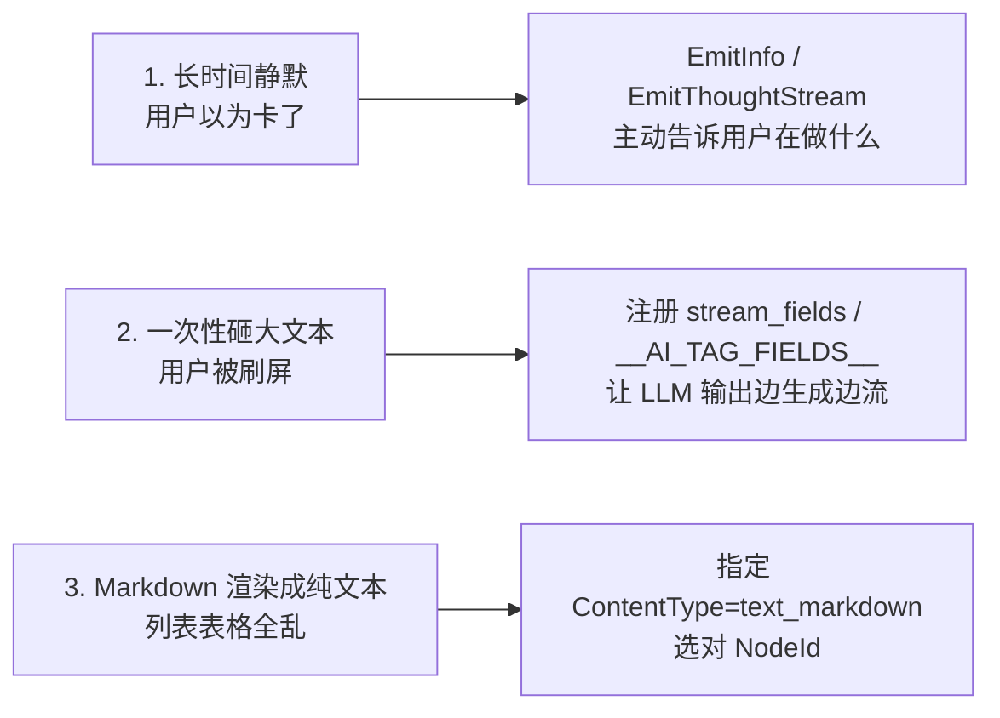
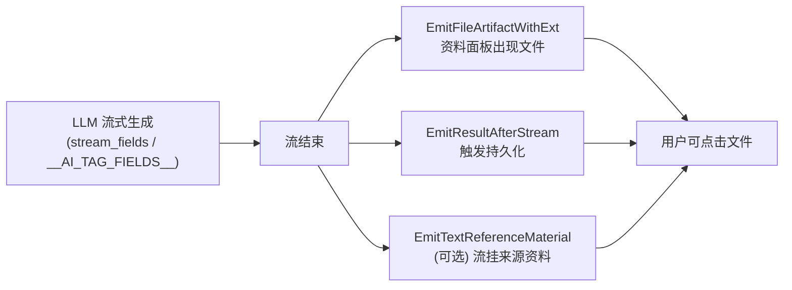

# 14. 流式输出与 UX 实战 / Emitter Practical Guide

> 回到 [README](../README.md) | 上一章：[13-yak-focus-mode.md](13-yak-focus-mode.md)

> **「能不能流出来」决定用户是否信任你的 Agent。**
>
> 一个专注模式如果只在最后一刻砸出大段文字，用户的体感是「卡了 30 秒，然后弹了一坨」。
> 一个专注模式如果边算边流，用户的体感是「它在思考、它在写、它快好了」。
> **这两种体验对应同样的算力消耗、同样的最终内容。差别只在于你是否用对了 emitter。**

第 [06 章](06-emitter-and-streaming.md) 把 `Emitter` 的结构、事件类型、流机制讲清楚了，是参考手册。
本章是**专注模式作者的实战指南**，回答三个问题：

1. **写 yak 专注模式时**，怎么用最少的代码让 UI 流出来？
2. **写 Go `loop_xxx` 时**，什么时候用配置驱动、什么时候手写 emit？
3. **遇到「不流」「断流」「样式不对」**怎么排查？

读完你会拿到：

- 两种范式（**配置驱动**与**命令式**）的决策表
- yak 侧 `__ACTIONS__` 中 `stream_fields` / loop 级 `__AI_TAG_FIELDS__` 的精确字段名（这一点容易踩坑）
- Go 侧 `loop.GetEmitter()` / `loop.GetInvoker()` 的高频方法清单
- ContentType 与 NodeId 的命名规范
- 调试流式 UX 的三种武器
- 八条踩坑总结

## 14.1 一句话定位

> **专注模式作者只需要做对三件事，UI 就会很好看：**
> 1. **配置 LLM 生成的内容如何变成流**（`stream_fields` 或 `__AI_TAG_FIELDS__`）
> 2. **挑对 NodeId 与 ContentType**（决定前端把流挂在哪、按什么渲染）
> 3. **任务结束时调三个 emit**：`EmitResultAfterStream`、`EmitFileArtifactWithExt`、`EmitTextReferenceMaterial`（终局三连，让结果"被记住"）

剩下的"思考流""加载状态""工具调用进度"由框架自动处理，**你不需要管**。

## 14.2 用户感知什么 / 失败 UX 的三种症状



| UX 症状 | 用户体感 | 根因 | 修法 |
|---|---|---|---|
| 长时间静默 | 「卡了，要不要重启？」 | hook 里跑 LiteForge / 慢工具不告知 | 流之前 `EmitThoughtStream(...)` 一句话 |
| 一次性砸大文本 | 「滚动条飞了」 | `directly_answer` 只用 `answer_payload` 短字段，结果 LLM 写了 1KB | 同时注册 `FINAL_ANSWER` AITag |
| Markdown 渲染成纯文本 | 「列表怎么没缩进」 | NodeId 缺省、ContentType 没设 | 配 `aiNodeId` + `contentType: "text_markdown"` |
| 关键结果不出现在「资料」面板 | 「分析结果丢了」 | 没调 `EmitFileArtifactWithExt` | 终局三连 |
| 重启后看不到上一次结果 | 「记忆没了」 | 没调 `EmitResultAfterStream`（持久化触发器） | 终局三连 |

## 14.3 两种范式：配置驱动 vs 命令式

> 你只需要看一张决策表，不要硬背所有 API。

| 你想流什么？ | 选哪个 | 为什么 |
|---|---|---|
| LLM 输出 JSON 里某个字段（如 `"summary"`） | **action 级 `stream_fields`** | 框架边解析 JSON 边推流，**最常用** |
| LLM 输出 JSON 之外的长 Markdown / 代码 / HTTP 报文 | **loop 级 `__AI_TAG_FIELDS__`**（yak）/ `WithAITagFieldWithAINodeId`（Go） | 不受 JSON escape 限制，可发任意长内容 |
| Hook 里跑 LiteForge / 调外部工具的进度 | **`emitter.EmitThoughtStream(...)`**（Go） | 用户能看到「系统正在做什么」 |
| 工具结果 / 命令输出（非 LLM） | **`emitter.EmitInfo(...)` / `EmitToolCallStd(...)`**（Go） | 直推到 UI |
| 状态键值（loading / progress） | **`emitter.EmitStatus(key, val)`**（Go） | 前端 watch 这个 key |
| 文件路径 pin（让用户能点击打开） | **`emitter.EmitPinFilename(path)`**（Go） / `EmitFileArtifactWithExt(...)`（invoker） | 文件管理面板会高亮 |

**两种范式的边界**：

- **配置驱动**＝告诉框架：「LLM 生成 X 字段时帮我推到 Y NodeId」。yak 与 Go 都支持，**yak 强烈推荐用这个**。
- **命令式**＝你直接拿到 `*aicommon.Emitter` 调方法。**Go 侧主战场**；yak 也能调（反射），但仅限**类型简单**的方法。

## 14.4 配置驱动：精确字段名与示例

### 14.4.1 Action 级 `stream_fields`（最常用）

**目的**：让 LLM 在写 JSON 的某个字段时，**字符还没写完就开始流**到指定 NodeId。

#### Go 侧

```go
reactloops.WithRegisterLoopActionWithStreamField(
    "summarize_scan",
    "summarize all scan findings into markdown",
    []aitool.ToolOption{},
    []*reactloops.LoopStreamField{
        {
            FieldName:   "summary",
            AINodeId:    "scan-summary",
            ContentType: aicommon.TypeTextMarkdown,
            // Prefix:   "",                  // 可选：流前置内容
        },
    },
    verifier,
    handler,
)
```

源码：[../action_field.go](../action_field.go) `LoopStreamField` 结构体。

#### Yak 侧

`__ACTIONS__` dict 里加 `stream_fields` 列表，**dict 键名与 Go 结构体字段名不同**（这是高频踩坑点）：

```yak
__ACTIONS__ = [
    {
        "type":        "summarize_scan",
        "description": "summarize all scan findings into markdown",
        "options":     [],
        "stream_fields": [
            {
                "field":        "summary",        // = LoopStreamField.FieldName
                "node_id":      "scan-summary",   // = LoopStreamField.AINodeId
                "content_type": "text_markdown",  // = LoopStreamField.ContentType
                // "prefix":    "",               // 可选
            },
        ],
        "verifier": func(loop, action) { return nil },
        "handler":  func(loop, action, op) {
            summary = action.GetString("summary")
            log.info("scan summary length=%d", len(summary))
            op.Continue()
        },
    },
]
```

| Yak dict 键 | Go 字段 | 必填 | 说明 |
|---|---|---|---|
| `field` | `FieldName` | 是 | 必须**等于 LLM 输出 JSON 中的字段名** |
| `node_id` | `AINodeId` | 是 | 前端 UI 元素 ID（见 14.7） |
| `content_type` | `ContentType` | 否 | 渲染方式（见 14.6），默认 `default` |
| `prefix` | `Prefix` | 否 | 流前置文本，例如 `"## 扫描结果\n\n"` |

源码：[../yak_focus_mode_actions.go](../yak_focus_mode_actions.go) `parseActionStreamFields`。

### 14.4.2 Loop 级 `__AI_TAG_FIELDS__`（长 Markdown / 代码场景）

**目的**：让 LLM 在 JSON 之外用 `<|TAG_xxx|>...<|/TAG_xxx|>` 包裹长内容，**不受 JSON escape 限制**。

#### Go 侧

```go
reactloops.WithAITagFieldWithAINodeId(
    "FINAL_ANSWER",                  // 标签名
    "tag_final_answer",              // 解析后存到 loop.GetVariable("tag_final_answer")
    "re-act-loop-answer-payload",    // NodeId
    aicommon.TypeTextMarkdown,       // ContentType
)
```

LLM 输出形如：

```text
{"@action": "directly_answer"}

<|FINAL_ANSWER_aB3x|>
## 报告
- 发现 3 个高危漏洞
- ...
<|FINAL_ANSWER_END_aB3x|>
```

#### Yak 侧

放在 `.ai-focus.yak` **顶层**（不在 `__ACTIONS__` 里）：

```yak
__AI_TAG_FIELDS__ = [
    {
        "tag":          "FINAL_ANSWER",
        "var":          "tag_final_answer",
        "node_id":      "re-act-loop-answer-payload",
        "content_type": "text_markdown",
    },
    {
        "tag":          "SHOWCASE_NOTE",
        "var":          "showcase_note",
        "node_id":      "showcase_note_stream",
        "content_type": "text_markdown",
    },
]
```

> **键名兼容**：解析器同时接受**短名**与**驼峰名**，下表两列都能用，但**整个项目内保持一致**：

| 短名（推荐） | 驼峰名（兼容） | Go 选项参数 | 说明 |
|---|---|---|---|
| `tag` | `TagName` | tag 名称 | LLM 必须输出对应的 `<\|TAG_..\|>...<\|TAG_END_..\|>` |
| `var` | `variable_name` / `VariableName` | yak 中 `loop.GetVariable(var)` 取出抽取结果 |
| `node_id` | `AINodeId` | 前端节点 ID |
| `content_type` | `ContentType` | 渲染方式 |

源码：[../yak_focus_mode_options_static.go](../yak_focus_mode_options_static.go) `parseAITagFieldEntry`。

> **核对清单**：写完后先在 CLI 跑一次（`yak ai-focus --file ... --query ... --json | grep -E "stream_start|stream\b" | head`），看看：
> - `event_writer_id` / `node_id` 是否落在你期望的位置
> - `content_type` 字段值是否正确
> - 流是否在 LLM 写到一半时就出现（不是等到最后）

### 14.4.3 配置驱动 = 框架替你做这些事

```mermaid
sequenceDiagram
    participant LLM
    participant Loop as ReActLoop (exec.go)
    participant Field as StreamField/AITagField
    participant Em as Emitter
    participant UI

    LLM->>Loop: 流式输出 JSON / `<\|TAG\|>` ...
    Loop->>Field: 实时解析字段
    Field->>Em: EmitStreamEventWithContentType<br/>(node_id, reader, content_type)
    Em->>UI: STREAM_START → STREAM chunks → 完成回调
```

源码 [exec.go:236-250](../exec.go) 是这个串联的发生地。

## 14.5 命令式 emitter：Go 主用 + yak 反射可用面

### 14.5.1 Go 侧入口

| 你在哪里 | 拿到 emitter | 拿到 invoker |
|---|---|---|
| `WithInitTask` 闭包 | `loop.GetEmitter()` | `loop.GetInvoker()` |
| `WithOnPostIteraction` 闭包 | `loop.GetEmitter()` | `loop.GetInvoker()` |
| `LoopActionHandlerFunc` 闭包 | `loop.GetEmitter()` | `loop.GetInvoker()` |
| `LoopActionVerifierFunc` 闭包 | `loop.GetEmitter()` | `loop.GetInvoker()` |
| `*LoopActionHandlerOperator` | **没有** GetEmitter | **没有** GetInvoker |

> **关键**：`operator`（即 `op`）只负责控制循环（`Continue/Exit/Fail/Feedback`），它**没有** emitter；要从 `loop` 拿。这与第一直觉相反，**经常踩**。

### 14.5.2 高频「类型友好」方法（yak/Go 都能调）

下面这些方法签名只用 `string`/`int`/`bool`/`any`，**反射调用没坑**，所以 yak 闭包里也能直接调：

| 方法 | 签名 | 用途 |
|---|---|---|
| `EmitInfo(fmtTpl string, items ...any)` | 结构化 INFO 日志 | 状态广播 |
| `EmitWarning(fmtTpl string, items ...any)` | 结构化 WARN 日志 | 警告 |
| `EmitError(fmtTpl string, items ...any)` | 结构化 ERROR 日志 | 错误 |
| `EmitStatus(key string, value any)` | `STRUCTURED` 事件 | 推任意状态键值 |
| `EmitThoughtStream(taskId, fmtTpl string, items ...any)` | 思考短句 | 「我正在做 X」 |
| `EmitJSON(typeName EventType, id string, i any)` | 任意类型 JSON 事件 | 通用通道 |
| `EmitStructured(id string, i any)` | `EVENT_TYPE_STRUCTURED` | 结构化面板 |
| `EmitPinFilename(path string)` | 文件 pin | 让用户点击打开 |
| `EmitPinDirectory(path string)` | 目录 pin | 同上 |
| `EmitResult(nodeId string, result any, success bool)` | 结果事件 | 简单结果（无前置流） |

#### Go 示例

```go
reactloops.WithOnPostIteraction(func(
    loop *reactloops.ReActLoop, iter int,
    task aicommon.AIStatefulTask, isDone bool, reason any,
    op *reactloops.OnPostIterationOperator,
) {
    em := loop.GetEmitter()
    if isDone {
        em.EmitInfo("focus mode finished at iter=%d", iter)
        em.EmitStatus("my_focus_done", true)
        return
    }
    em.EmitThoughtStream(task.GetIndex(), "checking iteration %d", iter)
})
```

#### Yak 示例（反射调用）

```yak
focusPostIteration = func(loop, iter, task, isDone, reason, op) {
    em = loop.GetEmitter()
    if isDone {
        em.EmitInfo("focus finished at iter=%v", iter)
        em.EmitStatus("my_focus_done", true)
        return
    }
    em.EmitThoughtStream(task.GetIndex(), "checking iteration %v", iter)
}
```

> **yak 里能调的范围**：凡是 `*aicommon.Emitter` 上**只接受 string/int/bool/any** 的方法，都能直接调。
> 但凡涉及 `io.Reader` / `time.Time` / `chan` / 函数回调的方法（如 `EmitStreamEvent`、`EmitTextMarkdownStreamEvent`、`EmitToolCallStd`），**别在 yak 里硬塞**——交给配置驱动（14.4）由框架替你做。

### 14.5.3 关于「`EmitMarkdownStream` 与 `EmitDefaultStream`」

**注意命名**：项目里没有这两个方法的简写名。**真实方法名**是：

| 简写惯称 | 实际方法 | 何时用 |
|---|---|---|
| `EmitMarkdownStream` | `EmitTextMarkdownStreamEvent(nodeId, reader, taskIndex, ...)` | 把一个 `io.Reader` 流当作 markdown 推 |
| `EmitDefaultStream` | `EmitDefaultStreamEvent(nodeId, reader, taskIndex, ...)` | 同上但 ContentType 走 `default`，不做 markdown 处理 |
| 通用 | `EmitStreamEventWithContentType(nodeId, reader, taskIndex, contentType, callback)` | 任意 ContentType |

这些方法**都需要 `io.Reader`**，**只在 Go 侧实用**。yak 想发流，**全部走配置驱动**（14.4），让框架在解析 LLM 输出时帮你调它们。

源码：[../../../aicommon/emitter.go](../../../aicommon/emitter.go) + [../../../aicommon/stream.go](../../../aicommon/stream.go)。

### 14.5.4 「invoker」的特殊职责：终局结果与文件落盘

`loop.GetInvoker()` 拿到的是 `aicommon.AIInvokeRuntime`，它有几个 emitter 没有但**任务终局必须**的方法：

| 方法 | 用途 | 触发的 UI 行为 |
|---|---|---|
| `EmitFileArtifactWithExt(name, ext, content string)` | 把内容当文件 pin | 资料面板出现可点击的文件 |
| `EmitResultAfterStream(payload any)` | 落地最终结果 | 触发持久化 / 重启可见 |
| `EmitTextReferenceMaterial(streamId, materials)` | 把流的来源资料挂上 | 用户可查「这段总结基于哪些原始数据」 |

**终局三连示意**（参考 `directly_answer` 内置实现 [../action_buildin.go](../action_buildin.go)）：

```go
ActionHandler: func(loop *reactloops.ReActLoop, action *aicommon.Action, op *reactloops.LoopActionHandlerOperator) {
    invoker := loop.GetInvoker()
    payload := loop.Get("directly_answer_payload")

    invoker.EmitFileArtifactWithExt("directly_answer", ".md", payload)
    invoker.EmitResultAfterStream(payload)
    op.Exit()
}
```

## 14.6 ContentType 选用指南（决定前端怎么渲染）

| ContentType（aicommon.Type*） | 字符串值 | 前端渲染 | 典型场景 |
|---|---|---|---|
| `TypeTextMarkdown` | `"text_markdown"` | Markdown（标题/列表/代码块/链接） | 报告、说明、最终答案 |
| `TypeTextPlain` | `"text_plain"` | 纯文本 | 日志、命令输出 |
| `TypeCodeYaklang` | `"code_yaklang"` | Yak 代码高亮 | `loop_yaklangcode` 生成代码 |
| `TypeCodeHTTPRequest` | `"code_http_request"` | HTTP 报文格式化 | `loop_http_fuzztest` 改包 |
| 缺省 | `"default"` | 与浏览器原生一致 | 不确定时用它 |

> **常见错配**：注册 `content_type: "text_markdown"` 但 LLM 输出的是 raw JSON 字符串 → 前端把 `\n` 渲成字面字符。**修法**：让 LLM 在 prompt 里被告知"这个字段直接写 markdown，不要再 escape"，或换用 AITag。

源码：[../../../aicommon/types.go](../../../aicommon/types.go) 中 `Type*` 常量定义。

## 14.7 NodeId 命名规范（决定前端挂在哪）

| 已有 NodeId | 用途 |
|---|---|
| `re-act-loop-thought` | 思考流（reasoning） |
| `re-act-loop-answer-payload` | 最终答案（`directly_answer` 双路绑定到这里） |
| `re-act-loading-status-key` | 加载状态 key |
| `directly_call_tool_params` | 工具参数流 |
| `prompt_profile` | prompt 段落开销 |
| `http_flow` | HTTP 请求/响应 |
| `yaklang_code_editor` | yak 代码 |
| `quick_plan` | 快速规划思路 |
| `reference_material` | 引用资料 |

**自定义命名建议**：

- 用 **kebab-case**，加业务前缀：`scan-summary`、`fuzz-payload-stream`、`audit-finding-detail`
- **同一个语义只用一个 NodeId**：`directly_answer` 同时注册 `answer_payload`（StreamField）+ `FINAL_ANSWER`（AITag）但都指向 `re-act-loop-answer-payload`，前端只挂一个元素，自动收到「短答案」或「长答案」
- **不要把不同语义流到同一个 NodeId**（前端会拼接 / 错位）

## 14.8 终局三连：让结果「被记住」



#### Go：参考 `loop_http_flow_analyze` 把流与资料关联

参考 [../loop_http_flow_analyze/finalize.go](../loop_http_flow_analyze/finalize.go)：

```go
aicommon.WithGeneralConfigStreamableFieldEmitterCallback(
    []string{"summary"},
    func(key string, r io.Reader, emitter *aicommon.Emitter) {
        event, _ := emitter.EmitStreamEventWithContentType(
            "re-act-loop-answer-payload",
            utils.JSONStringReader(r),
            taskID,
            aicommon.TypeTextMarkdown,
            func() {},
        )
        if event != nil {
            streamId := event.GetStreamEventWriterId()
            emitter.EmitTextReferenceMaterial(streamId, contextMaterials)
        }
    },
),
```

> 不仅流出，还把 context materials 作为 reference material 关联——用户可以查看"这个总结基于哪些原始数据"。

## 14.9 三个真实样板

### 14.9.1 Go 内置：`directly_answer` 双路绑定同 NodeId

**为什么是好样板**：演示了「同一 UI 元素，两种 LLM 输出方式都能流」的优雅写法。

参考 [../action_buildin.go](../action_buildin.go) `loopAction_DirectlyAnswer`：

```go
var loopAction_DirectlyAnswer = &LoopAction{
    ActionType:  "directly_answer",
    Description: "Answer the user directly via 'answer_payload' or FINAL_ANSWER tag.",
    AITagStreamFields: []*LoopAITagField{
        {
            TagName:      "FINAL_ANSWER",
            VariableName: "tag_final_answer",
            AINodeId:     "re-act-loop-answer-payload",
            ContentType:  aicommon.TypeTextMarkdown,
        },
    },
    StreamFields: []*LoopStreamField{
        {
            FieldName:   "answer_payload",
            AINodeId:    "re-act-loop-answer-payload",
            ContentType: aicommon.TypeTextMarkdown,
        },
    },
    ActionHandler: func(loop *ReActLoop, action *aicommon.Action, operator *LoopActionHandlerOperator) {
        invoker := loop.GetInvoker()
        payload := loop.Get("directly_answer_payload")
        invoker.EmitFileArtifactWithExt("directly_answer", ".md", payload)
        invoker.EmitResultAfterStream(payload)
    },
}
```

### 14.9.2 Go 复杂场景：`loop_http_fuzztest` 多通道流

**为什么是好样板**：演示了「HTTP 包流」「思考流」「修包结果流」并存。

入口：[../loop_http_fuzztest/init.go](../loop_http_fuzztest/init.go)。
重点看 init 阶段先 `EmitThoughtStream("Initialized fuzz request from extracted HTTP packet.")`，让用户**立即**有反馈。

### 14.9.3 Yak 配置驱动：`comprehensive_showcase`

**为什么是好样板**：演示 yak 侧 loop 级 `__AI_TAG_FIELDS__`、`__VARS__`、`focusXxx` 钩子全套。

参考 [../reactloops_yak/focus_modes/comprehensive_showcase/comprehensive_showcase.ai-focus.yak](../reactloops_yak/focus_modes/comprehensive_showcase/comprehensive_showcase.ai-focus.yak)：

```yak
__AI_TAG_FIELDS__ = [
    {"tag": "SHOWCASE_NOTE", "var": "showcase_note",
     "node_id": "showcase_note_stream", "content_type": "text_markdown"},
]

focusInitTask = func(loop, task, op) {
    em = loop.GetEmitter()
    em.EmitThoughtStream(task.GetIndex(), "showcase init: query=%v", task.GetUserInput())
    op.Continue()
}
```

LLM 在输出 `<|SHOWCASE_NOTE_xxx|>...<|SHOWCASE_NOTE_END_xxx|>` 时，前端 `showcase_note_stream` 节点自动接 markdown 流，**yak 脚本零代码**。

## 14.10 调试 UX 的三种武器

> **看不见就改不对**。流式 UX 的所有 bug 都是「事件没发对」或「事件没被消费」。

### 14.10.1 武器 1：CLI `--json` 看事件流

```bash
yak ai-focus --file my_focus.ai-focus.yak --query "..." --json \
  | jq -c 'select(.Type == "stream" or .Type == "stream_start") | {Type, NodeId, ContentType, len: (.StreamDelta // "" | length)}'
```

输出长这样：

```json
{"Type":"stream_start","NodeId":"scan-summary","ContentType":"text_markdown","len":0}
{"Type":"stream","NodeId":"scan-summary","ContentType":"text_markdown","len":12}
{"Type":"stream","NodeId":"scan-summary","ContentType":"text_markdown","len":35}
...
```

**看什么**：
- `NodeId` 是不是你期望的？写错了字段名时这里会缺
- `ContentType` 是不是 `text_markdown`？没设的话是 `default`
- 间隔时间是不是合理？太久 = LLM 在憋（要么 prompt 太复杂，要么用 `EmitThoughtStream` 主动告知）

### 14.10.2 武器 2：Memfit UI 直跑

把 `.ai-focus.yak` 放到 `~/yakit-projects/ai-focus/<name>/` 下，启动 Memfit → 选你的 focus mode → 实时观察：
- 思考节点是否实时滚动
- 最终答案是不是 markdown 渲染（列表、表格、代码高亮）
- 文件 pin 是不是出现在右侧资料面板

具体步骤见 [13-yak-focus-mode.md 13.10 节 → 「方式 2：Memfit UI 调试」](13-yak-focus-mode.md)。

### 14.10.3 武器 3：`YAKIT_AI_WORKSPACE_DEBUG` + prompt 检查

```bash
export YAKIT_AI_WORKSPACE_DEBUG=1
yak ai-focus --file my_focus.ai-focus.yak --query "..."
ls $YAKIT_AI_WORKSPACE/  # 每轮 prompt / response 落盘
```

如果 LLM 没输出对应字段或 tag，就是 prompt 没带这个字段进入。

## 14.11 八条踩坑总结

> 写完后逐条核对，能避开 80% 的 UX bug。

1. **yak 里 `stream_fields` 的键是 `field` / `node_id` / `content_type`**——不是 `FieldName` / `AINodeId` / `ContentType`。源码 [yak_focus_mode_actions.go](../yak_focus_mode_actions.go) 是真理。
2. **`__AI_TAG_FIELDS__` 在 loop 顶层，不在 `__ACTIONS__` 内部**。它是 loop 级配置。
3. **`op` 没有 emitter** —— 必须 `loop.GetEmitter()`。
4. **yak 别在闭包里硬塞 `io.Reader`** —— 流交给配置驱动。`loop.GetEmitter().EmitInfo(...)` / `EmitStatus(...)` 这种简单签名是 OK 的。
5. **NodeId 不要随手起** —— 同一语义复用同一个 NodeId（如答案统一用 `re-act-loop-answer-payload`），前端才能挂在同一个 UI 元素。
6. **ContentType 与实际内容必须匹配** —— `text_markdown` 但发 raw JSON 字符串 = 渲染崩。
7. **`directly_answer` 不要同时填 `answer_payload` 与 `FINAL_ANSWER`** —— 二选一互斥（在 prompt 里强调）。同时填会触发框架级警告。
8. **终局三连不可省** —— 没有 `EmitFileArtifactWithExt` 资料面板就没东西；没有 `EmitResultAfterStream` 重启后看不到结果。

## 14.12 进一步阅读

- [06-emitter-and-streaming.md](06-emitter-and-streaming.md)：`Emitter` 完整结构、60+ Emit 方法分类、reactloops 各阶段事件清单 —— 当本章不够用时去查
- [04-actions.md](04-actions.md)：`LoopAction` 数据结构、流式字段在 action 内的位置
- [13-yak-focus-mode.md](13-yak-focus-mode.md)：yak 专注模式三层契约（dunder / focusXxx / `__ACTIONS__`）+ 三种调试模式
- [12-debugging-and-observability.md](12-debugging-and-observability.md)：`YAKIT_AI_WORKSPACE_DEBUG`、prompt 落盘、timeline diff
- 真实代码样板：
  - Go 双路绑定：[../action_buildin.go](../action_buildin.go) `loopAction_DirectlyAnswer`
  - Go 复杂多通道：[../loop_http_fuzztest/init.go](../loop_http_fuzztest/init.go)
  - Go 流 + 资料关联：[../loop_http_flow_analyze/finalize.go](../loop_http_flow_analyze/finalize.go)
  - Yak 配置驱动：[../reactloops_yak/focus_modes/comprehensive_showcase/comprehensive_showcase.ai-focus.yak](../reactloops_yak/focus_modes/comprehensive_showcase/comprehensive_showcase.ai-focus.yak)

---

**"用户能看到 = 用户相信你。"**
**配置驱动让 LLM 的输出实时变成 UI 流；命令式让你的工程化进度变成 UI 通知；终局三连让结果被记住。**
**这就是 Emitter 的全部哲学。**
