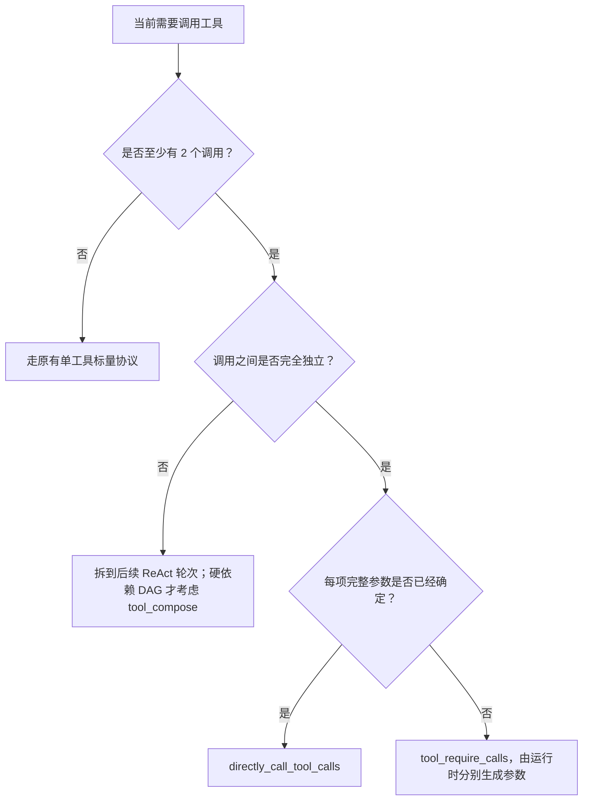
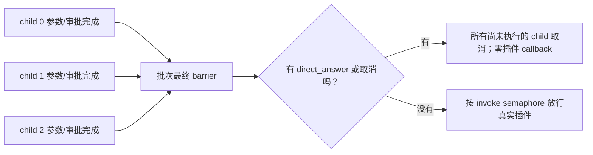
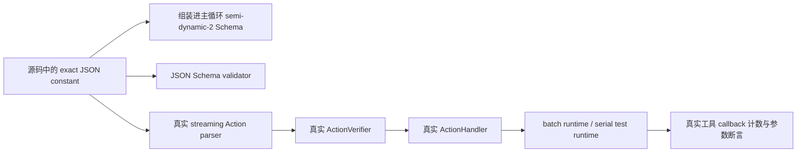
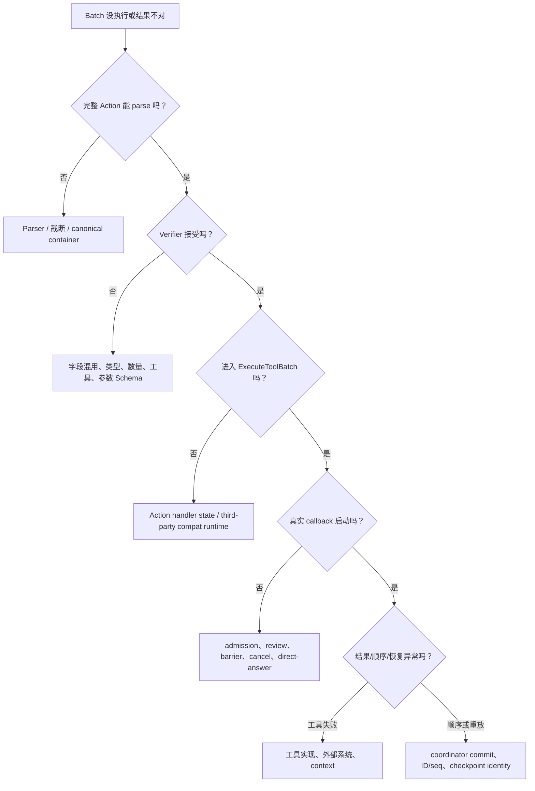

# 19. ReAct Action 数组并发工具调用：业务、协议、实现与测试全解

> 回到 [README](../README.md) | 相关章节：[03 Prompt 系统](03-prompt-system.md) · [04 Action 体系](04-actions.md) · [06 Emitter 与流式输出](06-emitter-and-streaming.md) · [08 确定性机制](08-determinism-mechanisms.md) · [12 调试与可观测性](12-debugging-and-observability.md)

## 文档元信息

| 项目 | 内容 |
|------|------|
| 主题 | 让现有 `directly_call_tool` / `require_tool` Action 在一次模型决策中承载多个彼此独立的真实工具调用，并由运行时安全地并发执行 |
| 面向读者 | 产品、业务、AI 应用研发、ReAct 运行时研发、工具开发者、测试与运维人员 |
| 代码范围 | `aicommon`、`aireact`、`reactloops/loopinfra`、`aitool`、`jsonextractor` |
| 协议形态 | **一个 Action + 一个对象数组**；不是模型厂商原生 `tool_calls[]`，也不是 `tool_compose` DAG |
| 兼容策略 | 原有单工具标量字段继续可用；批量字段为可选增量能力；第三方旧 Runtime 自动串行兼容 |
| 默认上限 | 每批最多 8 项；参数生成并发 2；插件执行并发 3 |
| 文档依据 | 当前实现代码、真实 Prompt 拼装测试、真实 Action parser/verifier/handler 测试、并发与恢复测试 |
| 最后核验 | 2026-08-11，完整受影响包普通测试通过，关键新增路径 `-race` 通过 |

---

## 0. 先用一句人话讲清楚

以前，AI 想读取两个互不相关的文件，通常要这样做：

1. 第一轮决定读取 `go.mod`；
2. 等工具执行完；
3. 第二轮再决定读取 `README.md`；
4. 再等工具执行完；
5. 第三轮才能一起分析结果。

现在，AI 可以在**同一轮**输出一个 `directly_call_tool` Action，并在其中放入两个独立调用：

```json
{
  "@action": "directly_call_tool",
  "identifier": "parallel_project_reads",
  "directly_call_tool_calls": [
    {
      "tool_name": "read_file",
      "params": {"path": "/workspace/go.mod"},
      "identifier": "read_go_mod"
    },
    {
      "tool_name": "read_file",1
      "params": {"path": "/workspace/README.md"},
      "identifier": "read_readme"
    }
  ]
}
```

运行时会把数组拆成两个 child call，安全地并发执行；等两个都结束后，再把按原数组顺序整理好的结果一次性交给下一轮 AI。

最重要的限定是：

> **只有彼此独立、无需先看其中一个结果再决定另一个参数的调用，才能放进同一批。**

### 0.1 不同角色怎么读

这是一篇刻意写得很完整的变更文档，不要求所有人从头读到尾：

| 读者 | 推荐章节 |
|------|----------|
| 产品、业务、项目负责人 | 0、1、2、3、12、18、22 |
| Prompt / Agent 研发 | 2、3、5、9、11、15.2–15.3 |
| Runtime / ToolCaller 研发 | 4、6、7、8、10、14 |
| 工具开发者 | 3、7、10、11、18.3–18.7 |
| 测试人员 | 3.5、12、15、16、21 |
| 运维/线上支持 | 10、12、16、18、19 |
| Code reviewer | 6、8、14、15、17、21 |

### 0.2 术语速查

| 术语 | 本文中的人话含义 |
|------|------------------|
| Action | 模型一轮输出的一个结构化决定，例如 `directly_call_tool` |
| scalar / 标量形式 | 旧协议：一个 Action 只写一个工具名/一份参数 |
| batch / 批次 | 一个 Action 的 calls 对象数组，包含 2–8 个 child |
| child call | 数组中的一项真实工具调用 |
| direct | 模型已经给出完整工具参数，跳过参数生成 |
| require | 模型只点名工具，运行时还要生成参数 |
| canonical object | 模型完整闭合后的原始嵌套 JSON 根对象，不是流式扁平缓存 |
| admission / 预准入 | 真实插件开始前的工具解析、guard、参数修改与校验 |
| ToolCaller | 项目中负责一项工具参数、审批、执行、结果和 checkpoint 的成熟管线 |
| callback | 工具真正开始工作的函数边界；读文件、发 HTTP、写外部系统等副作用从这里发生 |
| gate / semaphore | 决定一个 child 何时可以进入某阶段的并发门/限流槽 |
| barrier | 所有 child 必须先会合，确认批次级条件后才能继续的屏障 |
| settled | 一个 child 已经得到最终状态：成功、失败或取消，不再处于等待中 |
| all-settled | 普通 child 失败不取消独立兄弟；等所有项都有最终状态再汇总 |
| emitter | 把工具卡、日志、状态和结果事件发送给 UI 的对象 |
| Timeline | 供用户、下一轮模型和恢复逻辑观察的执行时间线 |
| checkpoint | 保存 AI 事务、审批或工具结果的恢复记录 |
| replay | 崩溃恢复时复用已完成 checkpoint，而不是再次审批/再次执行副作用 |
| `direct_answer` | 审批明确要求停止该批工具并由 AI 直接回答；它是批次级终止 |

---

## 1. 为什么业务上需要它

### 1.1 原系统不是“不会调用多个工具”，而是“一轮只能决定一个”

项目原有工具体系已经很成熟：

- `directly_call_tool`：AI 已经知道工具，而且可以直接给出参数；
- `require_tool`：AI 先点名工具，运行时再用一次子 AI 事务生成参数；
- ToolCaller：负责参数生成、人工审批、调用、stdout/stderr、checkpoint、timeline；
- ReAct 主循环：一轮模型输出一个 Action，执行完后进入下一轮观察。

真正的限制在于：**一个 Action 原来只表达一个工具调用**。所以即使业务上有三个完全独立的查询，AI 也必须消耗三轮“思考 → 调用 → 观察”。

这会带来四类成本：

1. **用户等待时间变长**：独立 I/O 被人为串行化；
2. **模型调用次数增加**：每个工具之间都多一次主循环决策；
3. **上下文噪声增加**：每一轮都要重新携带 Prompt、Timeline、Schema；
4. **业务吞吐下降**：文件读取、独立搜索、多目标查询无法利用天然并行性。

### 1.2 一个典型业务例子

用户要求：

> “对比项目的 `go.mod`、`README.md` 和 `config.yaml`，告诉我运行依赖和文档是否一致。”

这三个读取动作不存在数据依赖：读取 `README.md` 不需要先知道 `go.mod` 的内容。

旧流程的示意耗时：

```text
模型轮次 1 -> read go.mod      -> 等待完成
模型轮次 2 -> read README.md   -> 等待完成
模型轮次 3 -> read config.yaml -> 等待完成
模型轮次 4 -> 汇总
```

新流程：

```text
模型轮次 1 -> 一次声明 3 个 read_file
               ├─ read go.mod
               ├─ read README.md
               └─ read config.yaml
             -> 全部 settled、按声明顺序汇总
模型轮次 2 -> 汇总
```

这里的收益不是承诺“必然快 3 倍”。真实耗时仍受审批、并发上限、工具本身、网关限流影响。业务上可以确定的是：

- 不再为三个已知独立动作强制消耗三轮主决策；
- 插件执行阶段可以重叠；
- 结果仍保持稳定、有序、可恢复，而不是用完成顺序换速度。

### 1.3 设计目标

本次改动明确追求以下目标：

| 目标 | 人话解释 |
|------|----------|
| 保留原 Action 心智 | AI 仍然一轮输出一个 `@action`，只是某些 Action 多一个数组字段 |
| 真并发 | 不是把多个名字塞进文本再逐个执行，而是运行时真的用独立 child 并发调用 |
| 先安全、后并发 | 参数、工具、guard、审批没有过关之前，不启动插件副作用 |
| 有界并发 | 不因模型一次输出很多项就无限创建高成本调用 |
| 结果稳定 | 即使第 2 项先完成，最终反馈、历史和 Timeline 仍按模型声明顺序 |
| 可取消 | 任务取消、审批中止、`direct_answer` 都能阻止尚未开始的副作用 |
| 可恢复 | 崩溃重启后不会把 A 的 checkpoint 误当成 B；已完成且身份匹配的审批/工具 checkpoint 可直接 replay |
| 兼容旧系统 | 单工具标量协议不变；不支持 batch interface 的第三方 runtime 串行执行 |
| Prompt 可执行 | 教给 AI 的示例不是“文档伪代码”，CI 会真的解析、校验并执行同一份 JSON |
| 不借用 `tool_compose` | 并发真实调用与意图 DAG 是两种协议、两套配置、两条执行路径 |

### 1.4 明确不做什么

为了避免需求被误解，本次实现**没有**做这些事：

- 没有改成 OpenAI/其他模型厂商响应中的原生 `tool_calls[]`；
- 没有让模型在一个 turn 里输出多个顶层 Action；
- 没有让同批 child 互相引用前一个 child 的结果；
- 没有让多个审批弹窗同时争抢用户；
- 没有复用 `ToolComposeConcurrency`；
- 没有把工具定义成“默认都并发安全”；
- 没有删除或改变原有单次 `directly_call_tool` / `require_tool` 用法。

---

## 2. 三个容易混淆的概念

### 2.1 Action 数组并发：本次实现

模型仍输出一个 Action：

```text
一个 ReAct turn
└── 一个 @action
    └── 一个 calls 数组
        ├── child 0：真实工具 + 独立参数边界
        ├── child 1：真实工具 + 独立参数边界
        └── child N：真实工具 + 独立参数边界
```

运行时负责 fan-out、审批、并发、join。

### 2.2 模型厂商原生 `tool_calls[]`：不是本次实现

某些模型 API 会返回类似：

```json
{
  "tool_calls": [
    {"id": "call_1", "function": {"name": "foo", "arguments": "{}"}},
    {"id": "call_2", "function": {"name": "bar", "arguments": "{}"}}
  ]
}
```

那是 Provider 协议层的结构化工具调用。本次能力工作在项目现有 ReAct Action 协议层：模型输出的仍是普通 JSON Action。二者未来可以互相适配，但本实现不依赖 Provider 是否支持原生工具调用。

### 2.3 `tool_compose`：表达依赖图，不承载最终参数

`tool_compose` 表达的是：

> “先做 A，A 的产物再喂给 B；或者描述一个带依赖关系的意图 DAG。”

它不要求模型直接给出每个真实插件调用的完整最终参数，后续仍会通过自己的流程生成参数。

本次 Action 数组表达的是：

> “这些真实调用彼此独立；每一项的工具和参数边界已经确定；现在可以安全地展开并发。”

### 2.4 一张选择表

| 场景 | 应选入口 | 原因 |
|------|----------|------|
| 只有 1 个工具 | 原标量 `directly_call_tool` 或 `require_tool` | 数组最少 2 项，没有必要引入 batch |
| 2–8 个独立调用，完整参数已知 | `directly_call_tool_calls` | 直接预检并发执行 |
| 2–8 个独立调用，但参数还需运行时生成 | `tool_require_calls` | 参数生成有界并发，之后统一审批/执行 |
| B 的参数依赖 A 的输出 | 拆到后续 ReAct 轮次，或真正需要时使用 `tool_compose` | 不能把依赖伪装成并发 |
| 操作不可逆，彼此会修改同一资源 | 通常拆为单次调用 | 顺序和审批比并发更重要 |
| 长文本参数依赖 AI-TAG | 使用原标量直调 | batch 中 AI-TAG 无 child index，无法可靠归属 |



---

## 3. 对外协议：模型到底应该输出什么

### 3.1 共同规则

两种 batch 都先遵守 ReAct Action 的公共外壳：

| 顶层字段 | 必填 | 含义 |
|----------|------|------|
| `@action` | 是 | `directly_call_tool` 或 `require_tool` |
| `identifier` | 是 | 标识**整个 Action**，用于日志/历史；建议短 snake_case |
| `human_readable_thought` | 否 | 面向人的简短行动说明 |

不要混淆两个层级的 identifier：顶层 `identifier` 表示整次模型决策；数组 item 的 `identifier` 表示某一个 child 的 destination/artifact 用途，非空时要求批内唯一。

无论 direct 还是 require，batch 都遵守这些规则：

1. 顶层仍只有一个 `@action`；
2. 数组至少 2 项；
3. 协议硬上限 8，部署配置可以调低；
4. 数组顺序就是模型声明顺序，后续结果和历史按它排序；
5. child `identifier` 在同一批中不能重复；
6. 不能同时使用新数组字段与旧标量字段；
7. 不能同时出现 direct 数组和 require 数组；
8. 每个数组 item 使用严格白名单，item 中未声明字段会被拒绝；顶层 Action Schema 为兼容其他通用字段仍允许额外属性；
9. Action 必须完整闭合，截断 JSON 不允许执行；
10. 业务依赖无法完全靠 JSON Schema 判断，模型和上层业务仍必须遵守“同批独立”原则。

### 3.2 `directly_call_tool_calls`

适用条件：

- 工具已经确定；
- 每个 child 都能提供完整内联 JSON 参数；
- child 之间互不依赖。

字段定义：

| 字段 | 必填 | 类型 | 含义 | 示例 |
|------|------|------|------|------|
| `tool_name` | 是 | string | 精确工具名 | `read_file` |
| `params` | 是 | object | 该工具的完整参数；无参工具也要写 `{}` | `{"path":"/a"}` |
| `identifier` | 否 | string | child 的短用途标识；建议 snake_case；同批唯一 | `read_go_mod` |
| `expectations` | 否 | string | 预估耗时或超时预期 | `~1s` |
| `reason` | 否 | string | 面向用户的简短调用原因 | `读取模块定义` |

生产 Prompt 中使用的精确示例：

```json
{
  "@action": "directly_call_tool",
  "identifier": "parallel_project_reads",
  "human_readable_thought": "并发读取两个独立文件",
  "directly_call_tool_calls": [
    {
      "tool_name": "read_file",
      "params": {"path": "/workspace/go.mod"},
      "identifier": "read_go_mod",
      "expectations": "~1s",
      "reason": "读取模块定义"
    },
    {
      "tool_name": "read_file",
      "params": {"path": "/workspace/README.md"},
      "identifier": "read_readme",
      "expectations": "~1s",
      "reason": "读取项目说明"
    }
  ]
}
```

对应代码常量和 Schema 位于 [tool_batch_action.go](../loopinfra/tool_batch_action.go) 的 `directlyCallToolBatchOutputExampleJSON` 与 `directlyCallToolBatchSchemaOption`。

#### 运行时内部会转换成什么

模型不需要输出 `Index`、`Mode`、`BatchID` 或 `ExecutionCallID`。Verifier 会生成内部对象：

```go
request := &aicommon.ToolBatchRequest{
    Calls: []aicommon.ToolBatchCall{
        {
            Index:        0,
            Mode:         aicommon.ToolCallModeDirect,
            ToolName:     "read_file",
            Params:       aitool.InvokeParams{"path": "/workspace/go.mod"},
            Identifier:   "read_go_mod",
            Expectations: "~1s",
            Reason:       "读取模块定义",
        },
        {
            Index:        1,
            Mode:         aicommon.ToolCallModeDirect,
            ToolName:     "read_file",
            Params:       aitool.InvokeParams{"path": "/workspace/README.md"},
            Identifier:   "read_readme",
            Expectations: "~1s",
            Reason:       "读取项目说明",
        },
    },
}
```

随后 Runtime 才会补充稳定的 `BatchID` 和每个 child 的 `ExecutionCallID`。DTO 定义见 [tool_batch.go](../../../aicommon/tool_batch.go)。

### 3.3 `tool_require_calls`

适用条件：

- 已经知道要用哪些工具；
- 但每项参数仍需运行时根据任务上下文分别生成；
- child 之间互不依赖。

字段定义：

| 字段 | 必填 | 类型 | 含义 | 示例 |
|------|------|------|------|------|
| `tool_name` | 是 | string | 需要申请/生成参数的精确工具名 | `grep` |
| `identifier` | 否 | string | child 的短用途标识；同批唯一 | `find_auth_handlers` |
| `reason` | 否 | string | 为什么要调用该工具 | `搜索认证处理逻辑` |
| `params` | **禁止** | — | require 模式由运行时生成，模型不能预填 | — |

生产 Prompt 中使用的精确示例：

```json
{
  "@action": "require_tool",
  "identifier": "parallel_project_search",
  "human_readable_thought": "并发准备两个独立搜索",
  "tool_require_calls": [
    {
      "tool_name": "grep",
      "identifier": "find_auth_handlers",
      "reason": "搜索认证处理逻辑"
    },
    {
      "tool_name": "read_file",
      "identifier": "read_project_config",
      "reason": "读取独立项目配置"
    }
  ]
}
```

运行时可能分别生成：

```json
{
  "child_index": 0,
  "tool_name": "grep",
  "generated_params": {
    "path": "/workspace",
    "pattern": "auth"
  }
}
```

```json
{
  "child_index": 1,
  "tool_name": "read_file",
  "generated_params": {
    "path": "/workspace/project.json"
  }
}
```

这两个“参数生成 AI 事务”可以并发，但真实插件调用必须等参数、审批和最终 barrier 全部满足后才开始。

### 3.4 原有单工具协议仍然合法

单次 direct：

```json
{
  "@action": "directly_call_tool",
  "identifier": "read_one_file",
  "directly_call_tool_name": "read_file",
  "directly_call_tool_params": {
    "path": "/workspace/go.mod"
  },
  "directly_call_reason": "读取模块定义"
}
```

单次 require：

```json
{
  "@action": "require_tool",
  "identifier": "search_auth",
  "tool_require_payload": "grep",
  "tool_call_reason": "搜索认证逻辑"
}
```

新旧协议不是“新版本覆盖旧版本”，而是：

```text
1 个调用  -> 标量字段
2–N 个独立调用 -> 数组字段
```

### 3.5 明确非法的输入

#### 非法 1：数组只有一项

```json
{
  "@action": "directly_call_tool",
  "identifier": "invalid_single_direct_batch",
  "directly_call_tool_calls": [
    {"tool_name": "read_file", "params": {"path": "/a"}}
  ]
}
```

预期错误：

```text
directly_call_tool_calls requires at least 2 independent calls;
use the legacy scalar fields for one call
```

#### 非法 2：新数组和旧标量混用

```json
{
  "@action": "directly_call_tool",
  "identifier": "invalid_mixed_direct_forms",
  "directly_call_tool_name": "read_file",
  "directly_call_tool_params": {"path": "/scalar"},
  "directly_call_tool_calls": [
    {"tool_name": "read_file", "params": {"path": "/a"}},
    {"tool_name": "read_file", "params": {"path": "/b"}}
  ]
}
```

预期错误：

```text
directly_call_tool_calls cannot be combined with legacy directly_call_tool_* fields
```

#### 非法 3：require child 自带 `params`

```json
{
  "@action": "require_tool",
  "identifier": "invalid_require_with_params",
  "tool_require_calls": [
    {"tool_name": "grep", "params": {"pattern": "auth"}},
    {"tool_name": "read_file"}
  ]
}
```

预期错误：

```text
tool_require_calls[0]: unknown fields: params
```

#### 非法 4：同时输出 direct 和 require 两种数组

```json
{
  "@action": "directly_call_tool",
  "identifier": "invalid_cross_mode_batch",
  "directly_call_tool_calls": [
    {"tool_name": "read_file", "params": {"path": "/a"}},
    {"tool_name": "read_file", "params": {"path": "/b"}}
  ],
  "tool_require_calls": [
    {"tool_name": "grep"},
    {"tool_name": "read_file"}
  ]
}
```

预期错误：

```text
directly_call_tool_calls cannot be combined with require_tool fields
```

#### 非法 5：`params` 是数组，不是对象

```json
{
  "@action": "directly_call_tool",
  "identifier": "invalid_params_container",
  "directly_call_tool_calls": [
    {"tool_name": "read_file", "params": []},
    {"tool_name": "read_file", "params": {"path": "/b"}}
  ]
}
```

预期错误：

```text
params must be a non-null JSON object
```

#### 非法 6：JSON 流被截断

```text
{"@action":"directly_call_tool","directly_call_tool_calls":[
  {"tool_name":"read_file","params":{"path":"/a"}},
  {"tool_name":
```

即使流里已经出现合法的 `@action` 和第一个 child，也不能执行。Parser 会记录“canonical object 未完成”，Verifier 失败，AI Transaction 可以重试模型响应；任何插件副作用都不会开始。

#### 业务上非法但 JSON 结构可能合法：同批存在依赖

```json
{
  "@action": "directly_call_tool",
  "identifier": "invalid_dependent_calls",
  "directly_call_tool_calls": [
    {
      "tool_name": "find_file",
      "params": {"path": "/workspace", "pattern": "*.yaml"}
    },
    {
      "tool_name": "read_file",
      "params": {"path": "使用上一项找到的文件"}
    }
  ]
}
```

第二项参数依赖第一项输出，这不是可并发 batch。正确做法是先执行 `find_file`，观察真实路径后再在后续 ReAct 轮次调用 `read_file`；只有明确需要一次性表达硬依赖 DAG 时才考虑 `tool_compose`。

### 3.6 为什么 batch direct 不支持 AI-TAG 参数

原有长参数可以用类似 `TOOL_PARAM_content` 的 AI-TAG 在 JSON 外流式传输。但旧映射是：

```text
TOOL_PARAM_content -> __aitag__content
```

它没有 child index。两个 child 都有 `content` 时，运行时无法可靠判断标签属于第 0 项还是第 1 项。

因此 batch direct 的规则是：

- `params` 必须完整内联在每个数组 item；
- 长 Markdown、代码或大文本参数继续使用单次标量直调；
- 不使用平行的 `tool_name[]` / `params[]`，避免数组错位。

---

## 4. 从 Prompt 到结果：完整生命周期

```mermaid
sequenceDiagram
    participant Loop as ReAct 主循环
    participant Prompt as Prompt / Schema
    participant Model as 模型
    participant Tx as AI Transaction
    participant Parser as Action Parser
    participant Verifier as ActionVerifier
    participant Handler as ActionHandler
    participant Batch as ExecuteToolBatch
    participant Caller as child ToolCaller
    participant Tool as 真实插件

    Loop->>Prompt: 拼装本轮 Schema 与精确 batch 示例
    Prompt->>Model: 一轮只请求一个 Action
    Model-->>Tx: 流式输出带 calls 数组的 JSON
    Tx->>Parser: ExtractActionFromStream
    Parser->>Parser: 等完整 canonical object / 拒绝截断
    Parser-->>Verifier: 完整 Action
    Verifier->>Verifier: 严格数组、字段、工具、参数校验
    Verifier-->>Tx: 暂存 ToolBatchRequest，无插件副作用
    Tx->>Tx: 保存本次 AI 响应 checkpoint
    Tx-->>Loop: transaction 成功
    Loop->>Handler: 执行已验证 Action
    Handler->>Batch: ExecuteToolBatch(ctx, task, request)
    Batch->>Batch: 分配稳定 ID/seq，direct 全批预检
    par 每个 child
        Batch->>Caller: 独立 ToolCaller + 独立 emitter/context
        Caller->>Caller: require 参数生成（有界并发）
        Caller->>Caller: 审批（按数组顺序）
        Caller->>Batch: 到达最终 barrier
        Batch->>Caller: 获取 invoke 并发槽
        Caller->>Tool: 真实 callback
        Tool-->>Caller: ToolResult
        Caller-->>Batch: indexed outcome
    end
    Batch->>Batch: 等全部 child settled
    Batch->>Loop: 按模型 index 提交 Task/Timeline/反馈
    Loop->>Model: 下一轮一次观察整个 batch
```

### 4.1 为什么 Verifier 和真实执行必须分开

ReAct 的 AI Transaction 会在解析或校验失败时重试模型响应。若 Verifier 一边解析一边启动工具，会出现危险情况：

```text
第 1 次模型响应 -> child A 已执行副作用 -> child B JSON 截断 -> transaction 重试
第 2 次模型响应 -> child A 再执行一次
```

所以实现严格遵守：

- Transaction 内：收流、完整解析、协议校验、构造不可变 `ToolBatchRequest`；
- Transaction 成功并保存 AI response checkpoint 后：ActionHandler 才启动 batch；
- 普通 child 执行失败：变成 child outcome，**不重试整次模型 Action**。

主循环中解析/Verifier 位于 [exec.go](../exec.go) 的 `callAITransaction` postHandler，ActionHandler 在 transaction 返回成功之后才调用。

### 4.2 一轮模型只观察一次 batch

任一 child 先完成都不会立即触发下一轮模型。运行时必须先 `wg.Wait()`，再按数组顺序提交结果。这样下一轮模型看到的是一个完整观察，而不是：

```text
child 1 先完成 -> 模型提前做决定 -> child 0 随后又回来改变事实
```

---

## 5. 解析层：为什么不能直接复用旧的 `GetString("tool_name")`

### 5.1 旧流式 parser 有一个“扁平兼容缓存”

ActionMaker 为了让单字段尽早可读，会把嵌套字段回调扁平保存。例如模型正在输出：

```json
{
  "directly_call_tool_calls": [
    {"tool_name": "read_file", "params": {"path": "/a"}},
    {"tool_name": "grep", "params": {"pattern": "auth"}}
  ]
}
```

如果继续用普通顶层 `GetString("tool_name")`，两个 item 都叫 `tool_name`，扁平缓存无法表达它们的归属关系，很容易把第一个工具名与第二个参数拼在一起。

### 5.2 新增 canonical-only 读取

[action.go](../../../aicommon/action.go) 新增：

- `WaitParseResult(ctx)`：等待真实 parser 完成，并返回截断/读取/取消错误；
- `LookupCanonicalParam(key)`：只从完整根对象读取，不回退到扁平缓存；
- `DecodeStrictObjectArray(raw)`：严格要求“数组中的每项都是 non-null、string-key object”；空 item `{}` 会在后续因为缺少 `tool_name` 被 verifier 拒绝；
- `GetCanonicalObjectArray(key)`：区分字段缺失、字段为 null、字段类型错误。

Batch verifier 只从 canonical root 或 canonical `next_action` 读取数组。

### 5.3 为什么要区分 `{}` 和 `[]`

无参工具的合法 direct 参数是：

```json
{"tool_name": "no_arg_tool", "params": {}}
```

而这个是非法的：

```json
{"tool_name": "no_arg_tool", "params": []}
```

旧 `jsonextractor` 在空容器没有 key 时可能把空 object 误判为空 array。现在流式状态机会保留容器类型，`rawValueFormatter` 通过 map key kind 区分空 object 与空 array。实现见 [formatter.go](../../../../../jsonextractor/formatter.go) 与 [stream_extractor.go](../../../../../jsonextractor/stream_extractor.go)。

### 5.4 Verifier 的完整校验顺序

Direct batch：

```text
等待完整 parse
  -> 确认字段真的是 object array
  -> 拒绝标量混用/require 字段混用
  -> 校验 2..configuredMax
  -> 拒绝未知 item 字段
  -> 校验 tool_name/identifier/expectations/reason 类型
  -> 同批 identifier 去重
  -> params 必须是 object
  -> strictBatchParams 深拷贝参数
  -> 工具必须存在
  -> 每项 tool.ValidateParams
  -> 构造 ToolBatchRequest
```

Require batch：

```text
等待完整 parse
  -> 确认字段真的是 object array
  -> 拒绝标量混用/direct 字段混用
  -> 校验 2..configuredMax
  -> item 只允许 tool_name/identifier/reason
  -> 同批 identifier 去重
  -> 工具必须存在
  -> 构造无 Params 的 ToolBatchRequest
```

Verifier 实现见 [tool_batch_action.go](../loopinfra/tool_batch_action.go) 的 `parseDirectToolBatchAction` 和 `parseRequireToolBatchAction`。

---

## 6. 运行时架构：不是“把旧 handler 套一层 goroutine”

### 6.1 为什么最直觉的做法是错的

最直觉的实现可能是：

```go
for _, call := range calls {
    go invoker.ExecuteToolRequiredAndCall(ctx, call.ToolName)
}
```

这段伪代码看起来完成了并发，却破坏了原系统的几个重要假设：

- 原高层 handler 会读取或临时切换 `currentTask`；多个 goroutine 会把任务上下文串线；
- 原 task emitter 的 `Set/Pop` 是作用域式用法，并不适合多个重叠作用域；
- 参数生成、审批、invoke、checkpoint 和 timeline 原来被一个 ToolCaller 串起来，不能只并发其中一个外壳；
- 谁先完成就谁先写 Task/Timeline，会让恢复序号和用户看到的顺序随机变化；
- 某一项审批选择 `direct_answer` 时，其他工具可能已经开始产生副作用；
- 进程恢复后 goroutine 调度顺序可能变化，按“谁先抢到序号”保存的 checkpoint 会错配。

因此本实现增加的是一个真正的 **batch coordinator**。它负责批次级不变量，而每个 child 仍复用成熟的 ToolCaller 管线。

### 6.2 统一内部 DTO

[tool_batch.go](../../../aicommon/tool_batch.go) 定义了两种模式共用的内部协议：

```go
type ToolBatchRequest struct {
    BatchID string
    Calls   []ToolBatchCall
}

type ToolBatchCall struct {
    Index           int
    Mode            ToolCallMode // direct / require
    ToolName        string
    Params          aitool.InvokeParams
    Identifier      string
    Expectations    string
    Reason          string
    ExecutionCallID string // 只允许 runtime 填写
}
```

这样 Action 层只负责把模型 JSON 变成“已验证请求”，运行时不再猜字段含义。`directly_call_tool` 与 `require_tool` 的差异被收敛在 `Mode` 和 `Params` 上：

| 模式 | 进入 runtime 时有什么 | runtime 还要做什么 |
|------|-----------------------|--------------------|
| direct | 工具、完整参数、说明信息 | 全批预检、审批、真实调用 |
| require | 工具、说明信息；没有参数 | 分别生成参数、审批、真实调用 |

`ToolBatchInvokeRuntime` 是一个可选扩展接口，而不是强行给庞大的 `AIInvokeRuntime` 增加必实现方法。这样旧集成不会因为接口变化而编译失败。

### 6.3 调度器的八个阶段

生产 Runtime 的入口是 [invoke_toolcall_batch.go](../../invoke_toolcall_batch.go) 中的 `ExecuteToolBatch`。

```text
阶段 1：验证 runtime、task、context、批量数量
阶段 2：按数组 index 预留稳定 ID、checkpoint seq、result ID、artifact ordinal
阶段 3：解析工具；direct 做整批 guard / mutator / params validation
阶段 4：创建独立的参数生成 gate、审批有序 gate、最终 barrier、invoke gate
阶段 5：每个 child 建立自己的 ToolCaller、context、emitter、call ID
阶段 6：require 参数生成可并发；状态型 mutator 和人工审批按 index 有序
阶段 7：所有 child 到达 barrier 后，真实插件按 invoke 上限有界并发
阶段 8：等待全部 child settled，coordinator 按 index 提交共享状态
```

下面逐个解释“为什么”。

### 6.4 direct 为什么先做“整批 admission”

Direct 模式下，参数已经由模型提供，因此 runtime 能在任何卡片、pipe、artifact 或插件 callback 之前检查整批：

```text
resolve tool
  -> tool invoke guard
  -> params mutator
  -> tool.ValidateParams
```

假设输入：

```json
{
  "directly_call_tool_calls": [
    {"tool_name": "write_file", "params": {"path": "/a", "content": "A"}},
    {"tool_name": "write_file", "params": {"content": "B"}}
  ]
}
```

第二项缺少 `path`。如果边校验边执行，第一项可能已经写盘，随后第二项才失败。当前语义是：

```text
child 0 -> cancelled: tool batch admission failed before execution
child 1 -> validation_failed: missing path
真实 write_file callback 总数 -> 0
```

这叫“整批零执行保证”。代码位于 `ExecuteToolBatch` 的 direct preflight；测试 `TestExecuteToolBatch_DirectAdmissionFailureStartsNothing` 会直接统计 callback 数，确保不是只看返回值“像没执行”。

需要准确理解：这个原子性只覆盖 **真实插件开始之前的 admission**。一旦全部通过并进入真实并发调用，普通 child 失败采用 all-settled；系统不承诺对已经成功的外部副作用做跨工具事务回滚。

### 6.5 require 的参数生成为什么可以并发

Require 模式每项都要运行一次参数生成 AI 事务。两个独立 child 的参数生成不互相依赖，因而可以重叠：

```text
child 0: build grep params       ─────────────┐
child 1: build read_file params  ────────┐    │
child 2: 等待 param slot                 │    │
                                         ▼    ▼
                                   分别得到 proposal
```

参数生成有独立的 `tool_batch_param_concurrency`，默认 2。它与真实插件执行并发度分开，因为二者消耗的资源不同：前者占模型网关/Token，后者占本机或外部工具资源。

PromptManager 的动态渲染状态仍可能共享，因此实现只用一个很短的 `promptMu` 串行“构造参数 Prompt”这一步；真正耗时的参数 AI transaction 在 Prompt 构造完成后释放锁，并受 param semaphore 有界并发。这样既不让不同 task/loop 的 Prompt 材料串线，也不把整个参数生成阶段错误地串行化。

测试 `TestExecuteToolBatch_RequireBoundsParamGenerationSeparately` 记录参数 AI 的 active/max-active、child context 是否正确以及工具最终调用总数；它证明参数事务确实达到配置并发且所有 child 最终执行。真实工具 active 并发上限由 direct bounded-concurrency 测试单独覆盖。

### 6.6 为什么 mutator 和审批仍按模型数组顺序

参数生成可以并发，但某些 mutator 会读取或修改 loop 状态；人工审批更不能同时弹出 N 张卡让用户争抢。因此有两个 ordered stage：

- **参数 mutator**：即使 child 1 先生成完，也等 child 0 完成自己的有序 turn；
- **人工 review**：同一时刻最多一个 pending endpoint，严格按 index 展示。

示例：

```text
实际参数生成完成顺序：2 -> 0 -> 1
mutator 应用顺序：      0 -> 1 -> 2
审批卡出现顺序：        0 -> 1 -> 2
插件完成顺序：          可以是 1 -> 2 -> 0
最终反馈顺序：          0 -> 1 -> 2
```

这里不是把整个批次串行化。只有涉及共享状态或人的小阶段按序；耗时更高的参数 AI 事务和真实插件仍可并发。

`orderedBatchStage` 还处理了一个容易死锁的边界：如果 child 0 在到达审批前失败，它仍会在 defer 中完成自己的 turn，child 1 不会永远等一个不存在的审批。

### 6.7 最终 barrier 是什么

所有 child 在“参数准备 + 可能递归的 wrong-tool/wrong-params 审批”结束后，都必须到达最终 barrier：



它解决的核心业务问题是：用户在审批第 2 项时选择“不要继续调用工具，直接回答”，第 1 项不能已经偷偷执行完。

`toolBatchBarrier` 会先发布 batch-wide `direct` 位，再取消 worker，防止“取消信号和 barrier 同时 ready”时某个 sibling 随机穿过 gate。每次获得 gate 后还会二次检查 `ctx.Err()`，因为 Go 的 `select` 在多个 case 同时 ready 时不会承诺选择取消分支。

测试 `TestExecuteToolBatch_DirectAnswerCancelsWholeBatchBeforeAnyInvoke` 和 `TestToolBatchBarrier_DirectAnswerAbortsReadySibling` 专门制造这个竞态窗口，并断言真实插件 callback 数为 0。

### 6.8 真正的 invoke 是有界并发

通过 barrier 后，每个 child 申请 `tool_batch_invoke_concurrency` 槽位。默认最多 3 个真实插件同时运行。

如果一批有 8 项，默认不会一下启动 8 个外部请求，而是近似：

```text
时间片 1：child 0 / 1 / 2 running；3..7 queued
时间片 2：谁完成，谁释放槽；下一个 index 等候者进入
时间片 3：直到全部 settled
```

这是最大活动数上限，不是执行顺序承诺。调度器允许后项先完成，但结果观察仍按 index。

### 6.9 child 为什么必须有独立 context 和 emitter

每个 child 会获得：

- 稳定的 `ExecutionCallID`；
- 从 task emitter 派生、关联自己 `ProcessId` 的 child emitter；
- 自己的 ToolCaller 与 context；
- 自己预留的参数事务、审批、工具、watcher、result、artifact 序号。

运行时不会并发交换 `ReAct.currentTask`，也不会 `SetEmitter/PopEmitter` 修改共享 task emitter。事件可以交错，但能通过 `ProcessId/CallToolID` 正确归属到 child。

### 6.10 worker 只写自己的格子，coordinator 统一提交

每个 worker 只写：

```go
result.Outcomes[i]
```

它不会同时向 Task、Timeline 的有序集合追加结果。全部 worker `Wait()` 后，coordinator 才按 `i=0..N-1` 提交。

假设：

```text
模型声明：A(index 0), B(index 1), C(index 2)
完成顺序：C -> A -> B
```

最终仍然是：

```text
1. A: done
2. B: done
3. C: done
```

稳定顺序对用户可读性重要，更是 checkpoint replay、artifact 命名、历史比较和测试可重复性的基础。

---

## 7. 失败、审批与取消：每一种“没执行完”是什么意思

### 7.1 最终 outcome stage

内部结果定义见 [tool_batch.go](../../../aicommon/tool_batch.go)：

| Stage | 人话含义 | 是否可能有真实插件副作用 |
|-------|----------|--------------------------|
| `validation_failed` | 协议之后的 runtime guard 或参数校验没有通过 | direct admission 下不会 |
| `prepare_failed` | 找工具、生成参数、修复参数、创建 ToolCaller 等准备过程失败 | 当前 child 未开始真实 callback |
| `invoke_failed` | 已进入真实工具路径，但返回错误、失败结果或空结果 | **可能有**；外部系统是否部分写入由工具自身决定 |
| `cancelled` | 外部 context、任务、batch direct-answer 或 sibling 终止导致取消 | 若在运行中取消，工具可能已经开始；若在 barrier 前则没有 |
| `done` | 工具返回成功结果 | 有预期副作用或读取结果 |

`queued/preparing/reviewing/running` 是生命周期状态词；当前 `ToolBatchResult` 返回的是 settled 结果，通常不会把这些中间值作为最终 stage。

### 7.2 普通 child 失败采用 all-settled

Independent batch 的核心是“兄弟互不依赖”。因此一个普通失败不应取消其余项：

```text
child 0: grep 参数生成失败   -> prepare_failed
child 1: read_file 成功      -> done
child 2: stat 成功           -> done
batch 顶层                  -> 正常结算，进入下一轮
```

下一轮 AI 会同时看到成功和失败，可以决定只补救失败项。测试 `TestExecuteToolBatch_RequireParamFailureIsAllSettled` 故意让一项参数生成失败，并断言两个 sibling 仍实际执行。

Direct 的“全批 admission 失败零执行”与这里并不矛盾：

- admission 阶段发现确定性的无效输入：整批不启动；
- 通过 admission 后，真实执行期间发生普通错误：all-settled。

### 7.3 `direct_answer` 是批次级终止

人工审批可以明确选择：不继续工具，直接由 AI 回答用户。这不是某个 child 的普通失败，而是用户改变了整批策略：

```text
任一 child 审批 -> direct_answer
  -> 标记 ToolBatchResult.DirectlyAnswer=true
  -> 取消 sibling workers
  -> barrier 阻止所有尚未开始的插件
  -> ActionHandler 调用 invoker.DirectlyAnswer(...)
  -> operator.Exit()
```

这里尤其不能把“审批修复失败”误判成 `direct_answer`。`wrong_tool` / `wrong_params` 的子 AI 或递归执行失败会作为当前 child error 返回；只有审批 handler 明确给出 `direct_answer` 才触发批次级终止。

### 7.4 `wrong_tool` 和 `wrong_params` 如何工作

审批人可能认为：

- 工具选错了：`wrong_tool`；
- 工具对，但参数需要重做：`wrong_params`；
- 参数稍改后同意：approve with edit；
- 直接同意：approve。

`wrong_tool` 会选择替换工具，然后递归进入替换工具自己的参数生成和审批。此时：

- 最终结果的 `RequestedTool` 保留模型最初选择；
- `FinalTool` 记录实际执行工具；
- 参数 mutator 接收的是**当前最终工具**，不能仍按原工具名修改；
- 外层预留的参数 transaction seq 只能消费一次，递归修复必须使用新 seq，避免 replay 到旧工具的参数响应；
- 当前 child 的递归审批结束前，不会放行后续 index 的审批卡。

测试覆盖 review checkpoint 的 direct、wrong params、wrong tool replay，以及 `TestExecuteToolBatch_DirectWrongToolMutatesEachFinalProposalExactlyOnce`，防止一次 proposal 被重复修改。

### 7.5 外部 context/task 取消

取消会贯穿：

```text
batch ctx
  -> worker ctx
  -> 参数生成 AIRequest
  -> gateway 重试与等待
  -> review sub-AI
  -> ordered/semaphore/barrier wait
  -> ToolCaller
  -> 真实工具 callback ctx
```

每一个 admission boundary 在拿到许可后都会再次检查 context，避免同时 ready 的竞态。底层 `ExecuteToolWithCapture` 还会在创建 callback goroutine **之前**检查预取消 context，因此“任务已经取消但 callback 仍被启动”会被测试直接抓住。

外部取消与普通 child 失败的顶层语义不同：`ExecuteToolBatch` 最终会返回 `ctx.Err()`，ActionHandler 写 batch error feedback。已经开始的外部工具能否立即停止，仍取决于工具是否正确监听 context；运行时至少保证不会继续放行尚未开始的 child。

### 7.6 人工审批为什么不是并发 3

`tool_batch_invoke_concurrency=3` 不代表同时出现 3 张人工卡。当前审批语义固定为：

```text
pending review 数 = 1
顺序 = 模型数组 index
```

原因很现实：

- 多张卡同时等待会让审批顺序、checkpoint 顺序和 UI 焦点不可预测；
- `wrong_tool` 可能递归产生新卡，需要占住当前 child 的 review turn；
- 等审批本身不应占用真实 invoke semaphore，否则用户思考时会阻塞已批准的调用槽。

### 7.7 长工具的 interval review

长时间运行的工具仍支持 interval review。它会周期性询问是否继续或取消，但为了不让“计时触发的非确定事件”扰乱批次恢复序号：

- interval review AIRequest 使用 detached checkpoint；
- continue/cancel 日志不占用主 Timeline 的恢复序号；
- stdout/stderr snapshot 使用锁保护；
- 只有明确 cancel 才终止工具，review 子流程出错默认继续。

### 7.8 第三方 Runtime 的安全兼容

如果 invoker 实现了 `ToolBatchInvokeRuntime`，走原生并发 coordinator。

如果旧 Runtime 只实现原有单次接口，则 [tool_batch_action.go](../loopinfra/tool_batch_action.go) 会：

1. 记录 `[TOOL_BATCH_COMPAT]`；
2. 使用同一份已严格验证的 request；
3. 按 index 串行调用旧接口；
4. 保留 `direct_answer`、取消、空结果和结果汇总语义。

选择串行是兼容边界，不是性能 bug。旧 Runtime 没有声明自己的 task/emitter/checkpoint 是否并发安全，框架不能擅自并发它。

---

## 8. Checkpoint 与崩溃恢复：并发以后为什么仍能“接着跑”

### 8.1 并发恢复最危险的错法

旧串行世界可以近似把 checkpoint 理解为：

```text
第 101 号 -> 第一个工具
第 102 号 -> 第二个工具
```

并发后若让 worker 自己抢 `AcquireId()`：

```text
本次运行：B 先抢到 101，A 得到 102
崩溃恢复：A 先抢到 101，B 得到 102
```

如果恢复只看 seq，就可能把 B 的已完成结果发给 A。这比重复执行更危险，因为表面看起来“恢复成功”，实际数据已经串调用。

### 8.2 admission 时预留所有确定性位置

Coordinator 在启动 goroutine 前，按模型 index 固定预留：

```text
batch seed seq
child 0:
  param transaction seq
  review seq
  tool checkpoint seq
  watcher seq
  result ID
  artifact ordinal
child 1:
  同样一组
...
```

所以完成顺序再乱，也不改变恢复布局。

`BatchID` 和 `ExecutionCallID` 使用 runtime ID、batch seed、child index 等稳定信息做 SHA-256 派生。模型不能提供或覆盖内部 execution ID，避免重复/恶意 provider ID 污染事件和恢复命名空间。

### 8.3 checkpoint 不只看 seq，还校验“身份证”

恢复工具结果时会比对：

```text
batch_id
call_index
call_tool_id
tool_name
params
```

人工审批恢复同样校验这组身份材料。出现以下任一变化都不能静默套用旧结果：

- 同一个 index 换了工具；
- 参数被改了；
- checkpoint 来自另一个 batch；
- call ID 不一致；
- review 卡属于另一个 proposal。

测试 `TestExecuteToolBatch_ReviewCheckpointIdentityMismatchIsRejected` 和 ToolCaller invoke identity mismatch 测试专门构造“seq 相同但请求不同”的情况。

### 8.4 fresh request replay 为什么仍能命中

恢复时内存里的 `BatchID` / `ExecutionCallID` 可能丢失，Action 会重新解析成一个新的 request 对象。只要：

- runtime ID 相同；
- 起始 sequence 相同；
- 模型数组顺序与内容相同；

就会重新派生出字节一致的 ID 和 seq 布局。`TestExecuteToolBatch_FreshRequestReplaysStableCheckpointIdentity` 使用全新的 request 和 runtime 恢复一个**已经 finished** 的 checkpoint，并断言插件计数不再增加。

### 8.5 审批决定也必须持久化

仅保存“曾经出现过审批卡”是不够的；恢复时还必须知道用户选择了什么。现在 review checkpoint 会保存并重放：

- approve / edited params；
- direct answer；
- wrong params 的修复结果；
- wrong tool 的替换路径。

命中 finished review checkpoint 时，不重复发卡、不再次等待用户，直接应用已经保存且身份匹配的决定。

### 8.6 取消不能伪装成成功 checkpoint

一个已取消 child 不能因为 cancel callback 返回了一个对象，就保存成 `Finished + Success`。当前规则是：

- 取消后的 `ToolResult.Success=false`；
- 不保存 finished-success 工具 checkpoint；
- coordinator 不把 `cancelled` 结果提交为成功 Task/Timeline 结果；
- 下次恢复时由未完成状态决定是否继续，而不是错误跳过。

### 8.7 恢复不变量总结

| 不变量 | 业务意义 |
|--------|----------|
| ID/seq 按 index 预分配 | goroutine 调度变化不影响恢复 |
| review/tool checkpoint 校验完整身份 | 不会把别的 child 结果套过来 |
| finished review 直接 replay | 不重复打扰审批人 |
| finished tool 直接 replay | 不重复真实副作用 |
| repair 使用新的参数 seq | 换工具后不会拿到旧工具参数 |
| interval review detached | 时间抖动不移动主恢复序号 |
| cancelled 不写成功完成 | 恢复不会漏掉未真正完成的调用 |

### 8.8 必须如实说明的 crash window：checkpoint 不是跨外部系统的 exactly-once 事务

框架只有在工具返回并把 checkpoint 标记为 `Finished` 后，才能在下次启动时安全 replay。存在一个经典窗口：

```text
外部 API 已经完成写入
  -> 本进程尚未来得及保存 finished checkpoint
  -> 进程崩溃
  -> 恢复时看到 unfinished
  -> 调用可能再次执行
```

因此准确承诺是：

- **已完成且身份匹配**的 checkpoint 不重复审批/调用；
- 身份不匹配的 checkpoint 拒绝套用；
- unfinished checkpoint 会继续调用路径，框架不能证明外部副作用是否已经发生；
- 写工具仍应使用幂等键、业务事务、去重 token 或可安全重试设计。

Batch 的稳定 ID 可以作为工具构造幂等键的材料，但当前框架不会自动把所有外部系统变成 exactly-once。

---

## 9. Prompt 到底放在哪里，为什么 AI 看到的示例确实能执行

这是本次改动最重要的“模型教学”设计之一。

### 9.1 Prompt 需要同时回答两个不同问题

对模型来说，必须分别教：

1. **什么时候用 batch**：这是稳定的策略知识；
2. **具体 JSON 怎么写**：这是随 Action 是否启用、部署限额变化的 wire format。

如果把两者全塞到静态大段里，字段改名后旧示例很容易继续污染缓存 Prompt；如果只给 JSON Schema，模型又可能不知道何时该用 batch、何时该用 `tool_compose`。

### 9.2 位置一：冻结/高静态区教“何时用”

稳定选择原则位于：

- [frozen_block_section.txt](../../../aicommon/prompts/prefix/frozen_block_section.txt) 的 Tool Inventory 规则；
- [high_static_section.txt](../../../aicommon/prompts/prefix/high_static_section.txt) 的工具调用策略；
- ReAct base prompt 的对应规则。

这里教给模型的语义是：

```text
2–8 个彼此独立的真实调用 -> 普通 Action batch
已知完整参数             -> directly_call_tool_calls
仍需生成参数             -> tool_require_calls
有硬数据依赖             -> 后续 turn 或 tool_compose
所有 child settled 后     -> 才进入下一轮
```

这部分相对稳定，适合放在高缓存命中区。

### 9.3 位置二：`semi-dynamic-2` Schema 教“逐字怎么写”

精确 JSON 示例直接定义在 [tool_batch_action.go](../loopinfra/tool_batch_action.go)：

```go
const directlyCallToolBatchOutputExampleJSON = `...`
const requireToolBatchOutputExampleJSON = `...`
```

同一个常量被放入对应数组 property 的 Schema description。完整主循环组装时，这些 property 会进入 `semi-dynamic-2` 的 `<SCHEMA>` 段。

选择这里有三个原因：

- 只有 `directly_call_tool` / `require_tool` 真正在本轮可用时，字段和示例才出现；
- 部署把最大批量从 8 调低到 3 时，Schema 的 `maxItems` 会同步变成 3；
- 示例常量和 production verifier 在同一代码模块，协议修改更容易被 CI 同步发现。

### 9.4 为什么不能只依赖 `LoopAction.OutputExamples`

两个 Action 也保留 `OutputExamples`，方便自定义 renderer 使用。但当前主循环的 `WithOutputExample` 自动拼装路径主要遍历 loop 自定义 actions；内置 direct/require Action 不应把“是否进入主 Prompt”寄托在这条隐含路径上。

因此权威教学位置是：

> **Action property description → assembled main-loop `semi-dynamic-2` Schema section。**

这不是重复文案，而是保证“字段存在时示例一定随字段出现”。

### 9.5 `maxItems` 如何与真实配置一致

协议硬上限是 8，但部署可能配置：

```go
aicommon.WithToolBatchMaxCalls(3)
```

[prompt.go](../prompt.go) 的 `applyToolBatchSchemaMaxItems` 会在完整 Schema 生成后，把两个数组字段的 `maxItems` 下调到 3。Verifier 和 Runtime 读取同一配置并做 2..8 clamp。

模型因此不会被教成一次输出 8 项，随后每次又被部署 runtime 拒绝。

### 9.6 CI 是怎样证明“不是伪代码”的

精确示例经历以下生产链路：



关键测试：

| 测试 | 它真正证明什么 |
|------|----------------|
| `TestToolCallPromptExamples_ParseAndVerifyExactBytes` | direct/require 的 scalar + batch 四份 Prompt 常量原始字节都能通过 production stream parser、Schema 和 verifier |
| `TestToolBatchSchema_DeclaresStrictObjectArrays` | 数组、required、`additionalProperties=false`、min/max 真的写进 Schema |
| `TestToolBatchPromptExamples_ExecuteActualToolCallbacks` | 同一份示例经过 handler 后确实到达工具 callback，不只是“能 parse” |
| `TestToolScalarPromptExamples_ExecuteActualToolCallbacks` | 两份单调用示例继续走旧 scalar handler 并到达真实工具 callback，没有被 batch 接入挤掉 |
| `TestToolCallExamplesAreInAssembledMainLoopSchema` | scalar + batch 四份 exact example 都出现在完整主循环的正确 section，不是仅存在于孤立 action 对象 |
| `TestGenerateSchema_ToolBatchMaxItemsMatchesRuntimeConfig` | 模型看到的上限与部署 runtime 上限一致 |

这形成了一条重要的维护约束：

> 以后如果改字段名、required 规则或示例，不能只更新 Prompt 文本；同一份 exact bytes 必须继续走 parser → verifier → handler → callback 的 CI 闭环。

### 9.7 模型应该看到的完整选择提示

面向 Prompt 维护者，可以把教学目标概括为下面这段人话；生产中实际使用的是前述英文稳定规则和 Schema exact JSON：

```text
你每轮只能输出一个 Action。
如果只有一个工具，使用原标量字段。
如果有 2–8 个彼此独立的真实调用：
- 参数已完整确定，使用 directly_call_tool_calls，每项内联 tool_name + params；
- 参数仍需生成，使用 tool_require_calls，每项只写 tool_name，不要写 params。
数组顺序是最终观察顺序。不要混用标量和数组。
如果后一个调用需要前一个调用的输出，不要放入同一批；拆到后续轮次，
只有明确的硬依赖 DAG 才考虑 tool_compose。
```

---

## 10. 配置：控制“每批多少项”和“同时跑多少项”

### 10.1 三个独立配置

| Config Key | Go Option | 默认值 | 有效范围 | 控制什么 |
|------------|-----------|-------:|---------:|----------|
| `tool_batch_max_calls` | `WithToolBatchMaxCalls` | 8 | 2–8 | 模型一次 Action 最多声明多少 child |
| `tool_batch_param_concurrency` | `WithToolBatchParamConcurrency` | 2 | 1–8 | require 参数生成 AI 事务最大并发 |
| `tool_batch_invoke_concurrency` | `WithToolBatchInvokeConcurrency` | 3 | 1–8 | 真实插件 callback 最大并发 |

示例：

```go
cfg := aicommon.NewConfig(
    context.Background(),
    aicommon.WithToolBatchMaxCalls(6),
    aicommon.WithToolBatchParamConcurrency(2),
    aicommon.WithToolBatchInvokeConcurrency(3),
)
```

`ConvertConfigToOptions(parent)` 会把三项传播给 child config，避免子任务静默回默认。

### 10.2 三个数字为什么不能合并成一个

一个配置同时控制三件事会产生反直觉行为：

- 允许模型声明 8 项，不代表网关应同时做 8 次参数生成；
- 网关可以承受 4 路参数生成，不代表本机可以同时跑 4 个重工具；
- 人工 review 仍固定串行，不受 invoke concurrency 影响。

因此可以有这样的合理部署：

```text
max calls = 8
param concurrency = 2
invoke concurrency = 3
review pending = 1（固定）
```

### 10.3 边界值如何处理

公共 Option 会 clamp：

```text
WithToolBatchMaxCalls(1)  -> 2
WithToolBatchMaxCalls(99) -> 8
ParamConcurrency(0)       -> 1
InvokeConcurrency(99)     -> 8
```

Schema、Verifier、Runtime 都再次把 max calls 约束到 2..8，避免直接写底层 KV 时出现“Prompt 允许、Runtime 拒绝”或反过来的差异。

### 10.4 与 `ToolComposeConcurrency` 完全独立

调整 batch 配置不会改变 `ToolComposeConcurrency`；调整 `ToolComposeConcurrency` 也不会影响 Action 数组。

测试 `TestConfig_ToolBatchOptionsClampAndPropagateIndependently` 明确断言：即使 batch invoke concurrency 设置为 6，compose concurrency 仍保持自己的默认值 2。

### 10.5 业务调参建议

| 场景 | 建议起点 | 原因 |
|------|----------|------|
| 本地只读文件/轻量查询 | max 8，param 2，invoke 3–4 | I/O 可重叠，风险较低 |
| 外部 API 有严格 QPS | invoke 1–2 | 防止批量触发供应商限流 |
| 参数生成模型昂贵 | param 1–2 | 控制 Token 和网关并发 |
| 重 CPU / 大内存工具 | invoke 1 | batch 仍减少主模型轮次，但插件串行保护机器 |
| 含人工审批 | 保持默认 | review 本身固定有序，盲目提高 invoke 对等待阶段无帮助 |
| 不熟悉的第三方 Runtime | 无需强开 | 未实现 batch interface 时自动串行兼容 |

调参应同时观察 P95 工具耗时、网关 429、取消率、审批等待时间、外部 API 限流和宿主机资源，而不是只追求“active 数越高越好”。

---

## 11. 它在 AI Capability 与 Tool Call 体系中的位置

### 11.1 Capability 解决“系统有什么能力”，batch 解决“这一轮怎么调用工具”

项目把 AI 可用资源统一看作 Capability：

| Capability 类型 | 典型调用入口 | 能否放进本次 batch |
|-----------------|--------------|--------------------|
| tool | `require_tool` / `directly_call_tool` | **能**，本次能力只扩展这一类 |
| forge / blueprint | `require_ai_blueprint` 等 | 不能 |
| skill | 加载上下文 | 不能，它不是一次插件 callback |
| focus mode | `enter_focus_mode` / `load_capability` | 不能，它是另一个 ReActLoop |

因此完整链路是：

```text
Capability 搜索/加载
  -> 找到并启用可用 tools
  -> Prompt 展示当前工具 inventory 和 Action Schema
  -> 模型决定 scalar 还是 batch
  -> Verifier 从 AiToolManager 解析每个精确工具名
  -> ToolCaller 执行参数生成/审批/插件调用
```

Batch 没有替代 Capability 发现，也不会把 forge、skill、focus mode 伪装成普通工具并发。

更多能力发现背景见 [09 Capabilities](09-capabilities.md)。

### 11.2 Tool Manager 是协议与执行之间的权威目录

模型写出 `tool_name` 后，Verifier 会通过 `GetAiToolManager()` 查找：

- direct：工具必须存在，并立即按该工具 Schema 校验 `params`；
- require：工具必须存在，但参数由运行时生成；
- 未知工具：整项在进入 handler 前被拒绝；
- direct 工具不在 recently-used cache：发 warning，但只要 manager 中真实存在，不把 cache miss 当成不存在。

这避免两个极端：

- 完全相信模型名字，直到插件执行时才发现工具不存在；
- 把 recently-used cache 错当成完整工具白名单，导致明明已启用的工具无法直调。

### 11.3 recently-used cache 的作用

Recently-used cache 主要帮助 Prompt 与调用路径管理，不是 batch 的安全边界：

```text
manager 中不存在 -> verifier error
manager 中存在但 recent cache 未命中 -> warning，runtime 仍解析并调用
成功完成 -> 记录为 recently used
```

Batch 结果 handler 会把每个成功 `FinalTool` 更新回 recent cache。人工 `wrong_tool` 后记录的是实际成功工具，而不是只记录模型最初名字。

### 11.4 MCP 工具仍走统一解析逻辑

Runtime 的 `resolveToolForCall` 服务 `executeToolCallInternal` 的 scalar 路径和 batch；旧 `directly_call_tool` Action handler 还有自己的等价 prepare/resolver 路径。共同语义包括：

- 配置禁止 MCP 时直接拒绝；
- 若工具管理器里只是 MCP pending stub，会等待后台连接替换成 live tool；
- 等待过程接受 child context，任务取消后不会继续卡住整个 batch；
- 超时或连接失败只结算对应 child，direct admission 的具体规则仍按前文处理。

### 11.5 Guard、Params Mutator 与 ToolCaller 没有被绕开

Batch 不是一条“高速但少检查”的旁路。它仍复用：

- `CheckToolInvokeGuard`：策略层是否允许调用；
- `ApplyToolInvokeParamsMutators`：注入/修正参数；
- `Tool.ValidateParams`：工具 Schema 校验；
- ToolCaller 的 review、wrong-tool、wrong-params、interval review；
- stdout/stderr capture、result、artifact、timeline、checkpoint。

精确到模式：direct admission 的 guard 能看到模型给出的完整 params；require 在生成参数前先以工具名和 nil params 做 guard，最终生成参数随后再经过 mutator 与工具 Schema validation。若某项安全策略必须按**最终 require 参数**判断，应把检查放到 ToolCaller 最终 proposal / 工具自身校验边界，而不要假设前置 guard 已看到尚未生成的参数。

区别只是这些能力被重新放进一个明确的批次调度模型：可以安全并行的并行，必须确定性的有序，必须全员完成的 barrier/join。

### 11.6 Provider 原生 tool call 不在这条链路中

底层模型 Provider 即使支持原生 `tool_calls[]`，也不代表 ReAct Action 自动消费它。本次入口是项目自己的 Action JSON：

```text
模型文本/JSON流 -> ActionMaker -> ActionVerifier -> ToolBatchRequest
```

而不是：

```text
Provider tool_calls[] -> 直接 ExecuteToolBatch
```

这样做保留了现有 Prompt、Action、Transaction、审批和恢复体系。未来若接入 Provider 原生多 tool calls，应该新增一层明确适配，而不是偷偷把两种协议混在 callback marker 中。

---

## 12. 实际结果、Timeline、History 和统计会长什么样

### 12.1 内部 `ToolBatchResult`

假设三个调用中第二个失败，第三个先完成，最终内部结果仍按 index：

```json
{
  "batch_id": "tool-batch-...",
  "outcomes": [
    {
      "index": 0,
      "call_id": "tool-call-...",
      "requested_tool": "read_file",
      "final_tool": "read_file",
      "stage": "done",
      "result": {"name": "read_file", "success": true}
    },
    {
      "index": 1,
      "call_id": "tool-call-...",
      "requested_tool": "grep",
      "final_tool": "grep",
      "stage": "invoke_failed",
      "result": {"name": "grep", "success": false, "error": "permission denied"}
    },
    {
      "index": 2,
      "call_id": "tool-call-...",
      "requested_tool": "stat",
      "final_tool": "stat",
      "stage": "done",
      "result": {"name": "stat", "success": true}
    }
  ]
}
```

说明：Go 的 `Err error` 字段不序列化；对外摘要会优先显示 `Err`，否则显示 `ToolResult.Error`。

### 12.2 下一轮模型收到的 feedback

ActionHandler 会生成稳定的人类可读摘要：

```text
Tool batch finished: 3 calls
1. read_file: done
2. grep: invoke_failed: permission denied
3. stat: done
```

它同时：

- 写入 Timeline `[TOOL_BATCH_RESULT]`；
- 通过 `operator.Feedback(summary)` 成为下一轮观察；
- 对成功工具更新 recent cache；
- 统一触发一次 satisfaction verification；
- 最后只调用一次 `operator.Continue()`。

不会发生“每完成一个 child 就触发一次下一轮 AI”。

### 12.3 batch 顶层错误

如果是外部 context 取消、runtime 未初始化等 batch 级错误：

```text
tool batch execution failed before completion: context canceled
```

写入 `[TOOL_BATCH_ERROR]`，反馈后继续主循环的既有错误处理语义。普通 child 的 `prepare_failed/invoke_failed` 不升级成该顶层错误。

### 12.4 `direct_answer` 输出

如果审批明确中断并要求直接回答：

```text
ToolBatchResult.DirectlyAnswer = true
```

Handler 不再生成普通 batch summary，而是调用：

```text
在并发工具调用审批中，用户中断了该批次并要求直接回答。
不要继续执行该批次中的其他工具。
```

随后把答案写入 `directly-answer` Timeline 并 `operator.Exit()`。

### 12.5 Action History 既记录“一次决策”，也记录“N 次调用”

以前 `ActionRecord` 只有单个 `ToolName`。现在保留兼容字段并增加：

```json
{
  "action_type": "directly_call_tool",
  "action_name": "parallel_project_reads",
  "tool_name": "read_file",
  "tool_names": ["read_file", "read_file", "stat"],
  "tool_call_count": 3,
  "iteration_index": 4
}
```

语义是：

- `ToolName`：第一项，供旧消费者继续工作；
- `ToolNames`：所有 child，按模型数组顺序；
- `ToolCallCount`：真实声明数，不能再把整个 batch 永远算成 1 次工具调用；
- `ActionParams`：深拷贝 canonical 嵌套数组，后续 mutator 不会改写历史。

### 12.6 Value Feedback 与 Subagent 统计

Value feedback 投影同样携带全部工具，摘要可读成：

```text
directly_call_tool(read_file,read_file,stat) -> finish
```

Subagent pipeline 的工具预算/统计按 child 数计算。例如一个含 5 项的 Action 计为 5 次工具调用，不再计为 1。

测试 [tool_batch_history_test.go](../tool_batch_history_test.go) 覆盖 direct/require 数组提取、旧标量兼容、深拷贝和 value feedback 投影。

### 12.7 事件顺序承诺的精确边界

跨 child 的实时日志可以交错，这是并发的正常表现：

```text
child 0 start
child 1 start
child 1 stdout
child 0 stdout
child 1 terminal
child 0 terminal
```

系统承诺的是：

- 每个 child 内部 start → param/log → result → terminal 的 happens-before；
- child 通过稳定 `ExecutionCallID/ProcessId` 分组；
- batch 最终结果、Task、Timeline 汇总、History 按模型 index；
- 下一轮晚于所有 child settled。

系统不承诺把所有实时事件伪装成全局串行；那会牺牲实时性，也不必要。

---

## 13. 再次明确：为什么这不是 `tool_compose`

用户特别要求“不被 `tool_compose` 干扰”，因此这里从代码和业务两个角度把边界写死。

### 13.1 两种输入表达的不是一件事

普通独立 batch：

```json
{
  "@action": "directly_call_tool",
  "identifier": "parallel_read_and_search",
  "directly_call_tool_calls": [
    {
      "tool_name": "read_file",
      "params": {"path": "/a"}
    },
    {
      "tool_name": "grep",
      "params": {"path": "/b", "pattern": "auth"}
    }
  ]
}
```

它直接表达两个真实调用和最终参数。

`tool_compose` 的节点更接近：

```json
{
  "call_id": "find_config",
  "tool_name": "find_file",
  "call_intent": "找到配置文件",
  "depends_on": []
}
```

节点描述工具和意图/依赖，没有本次真实插件的最终 `params`。执行时还要进入 require 路径生成参数。

### 13.2 代码路径完全不同

```text
Action batch
  -> parseDirect/RequireToolBatchAction
  -> ToolBatchRequest
  -> ToolBatchInvokeRuntime.ExecuteToolBatch
  -> child ToolCaller

tool_compose
  -> workflow DAG node
  -> depends_on 调度
  -> ExecuteToolRequiredAndCall(node.ToolName)
  -> 再生成参数
```

Batch handler 不创建 compose DAG，不读取 `depends_on`，不读取 `ToolComposeConcurrency`。

### 13.3 决策例子

#### 应用 batch

> 同时查北京和上海的天气。

两项参数在调用前都确定，互不依赖。

#### 不应应用 batch

> 先查客户 ID，再用客户 ID 查询订单。

第二项参数只有第一项返回后才能得到。应拆到下一轮，或者在必须一次表达硬依赖时使用 DAG。

#### 不应应用 `tool_compose`

> 同时读取两个固定文件，而且模型已经知道两个 path。

使用 compose 会把已经知道的参数丢回参数生成流程，增加模型调用和不确定性。

### 13.4 配置隔离是防止未来重新混淆的工程护栏

| 普通 batch | compose |
|------------|---------|
| `tool_batch_max_calls` | DAG 自己的节点/策略限制 |
| `tool_batch_param_concurrency` | `ToolComposeConcurrency` 不控制它 |
| `tool_batch_invoke_concurrency` | `ToolComposeConcurrency` |
| 没有依赖图 | 有 `depends_on` |
| 所有 child join 后下一轮 | 按 DAG readiness 调度 |

[tool_batch.go](../../../aicommon/tool_batch.go) 的文件级注释和配置独立性测试都把这条边界固定下来。

### 13.5 一句话选择法

```text
能在调用前一次写出每项真实参数，且彼此不需要看结果 -> direct batch
知道每项工具，但参数分别还要生成，且彼此独立         -> require batch
后一项必须吃前一项产物                             -> 后续 turn / tool_compose
```

---

## 14. 代码驱动导读：从哪个文件读起

下面不是简单罗列文件，而是按一次请求真实经过的顺序给出阅读地图。

### 14.1 总链路

```text
Prompt 策略与 Schema
  ↓
模型流式 Action JSON
  ↓
jsonextractor / ActionMaker
  ↓
direct / require batch verifier
  ↓
ToolBatchRequest
  ↓
AI Transaction 成功、保存模型响应
  ↓
ActionHandler
  ↓
ExecuteToolBatch coordinator
  ↓
N 个 child ToolCaller
  ↓
ordered review + final barrier + bounded invoke
  ↓
ToolBatchResult
  ↓
Task / Timeline / Feedback / History / Value Feedback
```

### 14.2 文件与职责表

| 层 | 文件 | 关键入口 | 改动解决的问题 |
|----|------|----------|----------------|
| 容器解析 | [stream_extractor.go](../../../../../jsonextractor/stream_extractor.go)、[bufstack.go](../../../../../jsonextractor/bufstack.go)、[formatter.go](../../../../../jsonextractor/formatter.go) | `PushContainer`、`rawValueFormatter` | 保留 object/array 类型，尤其区分空 `{}` 与 `[]` |
| Action 完整性 | [action.go](../../../aicommon/action.go) | `WaitParseResult`、`LookupCanonicalParam`、`DecodeStrictObjectArray` | 不用扁平缓存猜 batch；拒绝截断和伪数组 |
| Batch DTO/配置 | [tool_batch.go](../../../aicommon/tool_batch.go) | `ToolBatchRequest`、`ToolBatchResult`、`ToolBatchInvokeRuntime` | 给 direct/require 一个统一、独立于 compose 的内部协议 |
| Action wire format | [tool_batch_action.go](../loopinfra/tool_batch_action.go) | 四个 exact JSON 常量（每个 Action 各含 scalar + batch）、Schema option | 同时保留单调用协议并定义批量字段、严格 item 结构、数量上限 |
| Direct 接入 | [action_directly_call_tool.go](../loopinfra/action_directly_call_tool.go) | verifier / handler | 优先识别数组，没数组时保持原标量行为 |
| Require 接入 | [action_tool_require_and_call.go](../loopinfra/action_tool_require_and_call.go) | verifier / handler | 同上；require item 禁止 params |
| Transaction 边界 | [exec.go](../exec.go) | AI transaction postHandler、ActionHandler dispatch | Transaction 内只解析校验，真实副作用放到成功后 |
| Prompt Schema | [prompt.go](../prompt.go) | `applyToolBatchSchemaMaxItems` | 模型可见最大项数与部署配置一致 |
| Prompt 稳定规则 | [frozen_block_section.txt](../../../aicommon/prompts/prefix/frozen_block_section.txt)、[high_static_section.txt](../../../aicommon/prompts/prefix/high_static_section.txt) | Tool Inventory / call mode 文案 | 教模型独立 batch 与依赖 DAG 的选择边界 |
| Batch 调度 | [invoke_toolcall_batch.go](../../invoke_toolcall_batch.go) | `ExecuteToolBatch` | 稳定预留、direct admission、并发 gates、barrier、ordered commit |
| 单 child 管线 | [toolcall.go](../../../aicommon/toolcall.go) | `ToolCaller`、gates、review、beforeInvoke | 复用参数生成/审批/工具执行，并允许 batch 注入调度点 |
| 真实 invoke/replay | [toolcall_invoke.go](../../../aicommon/toolcall_invoke.go) | tool checkpoint、callback、cancel | 校验 checkpoint 身份，取消不伪装成功 |
| 审批决策 | [toolcall_review.go](../../../aicommon/toolcall_review.go) | wrong tool / wrong params / direct answer | 区分 child-local 修复失败与 batch-wide direct-answer |
| 审批存储 | [endpoint_manager.go](../../../aicommon/endpoint_manager.go)、[endpoint.go](../../../aicommon/endpoint.go) | reserved review seq、response replay | 固定审批顺序；finished 且身份匹配时不重复发卡 |
| AI 子事务 context | [request.go](../../../aicommon/request.go)、[transaction.go](../../../aicommon/transaction.go)、[config_ai_wrapper.go](../../../aicommon/config_ai_wrapper.go) | request context、reserved seq、retry waits | 取消能终止参数生成/重试，恢复能命中预留 AI 事务 |
| 底层工具取消 | [tool_result.go](../../../aitool/tool_result.go) | `ExecuteToolWithCapture` | pre-cancel 不启动 callback；取消不读并发 goroutine 的 buffer |
| Built-in 工具快照 | [buildin.go](../../../aitool/buildinaitools/buildin.go) | 全局工具发布/读取 | 并发读取工具目录时无 slice alias/race |
| 历史 | [reactloop.go](../reactloop.go)、[exec.go](../exec.go) | `ActionRecord`、`extractToolNamesFromAction` | 一次 Action 正确记录所有 child |
| Value feedback | [value_feedback.go](../../../aicommon/value_feedback.go)、[value_feedback_hook.go](../value_feedback_hook.go) | `ToolNames` / `ToolCallCount` | 评价和摘要不丢批次后续工具 |
| Subagent 统计 | [subagent_pipeline.go](../subagent_pipeline.go) | child count | 工具预算按真实 child 数计算 |

### 14.3 最推荐的阅读顺序

如果只想快速理解，不要从最大文件开始。建议：

1. 先读 [tool_batch.go](../../../aicommon/tool_batch.go)：知道内部输入输出和配置；
2. 再读 [tool_batch_action.go](../loopinfra/tool_batch_action.go)：知道模型协议与严格校验；
3. 看 [invoke_toolcall_batch_test.go](../../invoke_toolcall_batch_test.go)：先通过测试理解承诺；
4. 再读 [invoke_toolcall_batch.go](../../invoke_toolcall_batch.go)：把 barrier、ordered stage、semaphore 对回测试；
5. 最后按需下钻 ToolCaller、checkpoint、review 和 prompt 文件。

### 14.4 核心实现的伪代码

下面不是可编译替代品，而是把生产代码压缩成便于评审的结构：

```go
func ExecuteToolBatch(ctx, task, request) (*ToolBatchResult, error) {
    validateBatchSize(request)

    // 在任何 goroutine 前固定恢复布局。
    works := reserveStableIdentityAndSequences(request)

    // direct 可以整批提前验证；失败则 0 callback。
    if directAdmissionFailed := preflightAllDirectCalls(works); directAdmissionFailed {
        return settledAdmissionFailure(works), nil
    }

    paramGate := semaphore(paramConcurrency)
    reviewOrder := orderedStage(len(works))
    finalBarrier := barrier(len(works))
    invokeGate := semaphore(invokeConcurrency)

    outcomes := make([]ToolCallOutcome, len(works))
    for i := range works {
        go func(i int) {
            caller := newChildToolCaller(
                task, childEmitter(i), childContext(i),
                paramGate, reviewOrder,
                beforeInvoke(finalBarrier, invokeGate),
                reservedCheckpointMetadata(i),
            )
            outcomes[i] = settle(caller.Call(...))
        }(i)
    }

    waitAllChildren()
    commitTaskAndTimelineInIndexOrder(outcomes)
    return &ToolBatchResult{Outcomes: outcomes}, ctx.Err()
}
```

评审这段逻辑时，应始终问四个问题：

1. 副作用前是否已完成该完成的全批检查？
2. 取消和 direct-answer 能否穿过任何 gate？
3. worker 是否写了共享的有序状态？
4. 恢复身份是否依赖完成顺序？

---

## 15. 测试驱动说明：每个测试在防哪一种真实事故

### 15.1 为什么这里必须测试驱动

并发工具调用最危险的 bug 往往不是“每次都报错”，而是：

- 只有在特定流式分片边界下把 child 参数串线；
- 只有 child 1 恰好先完成时 Timeline 顺序漂移；
- 只有 context 与 semaphore 同时 ready 时取消失效；
- 只有崩溃后 goroutine 调度变化时 checkpoint 错配；
- 只有人工选择 wrong-tool 后第二次恢复才重放错参数；
- Prompt 示例看起来正确，但从未进入完整主循环或真实 callback。

因此测试不是实现之后的装饰，而是协议和不变量的可执行说明。

### 15.2 Parser 测试

文件：[action_parse_safety_test.go](../../../aicommon/action_parse_safety_test.go)、[formatter_empty_container_test.go](../../../../../jsonextractor/formatter_empty_container_test.go)

| 测试 | Given / When / Then | 防止的事故 |
|------|---------------------|------------|
| `TestActionWaitParseResultRejectsTruncatedCanonicalObject` | 已看到 `@action` 但根 JSON 未闭合 → 等待结束 → 返回 parse error | 半个 batch 被当成完整请求执行 |
| `TestActionParseErrorPropagatesThroughSynchronousExtractors` | 同步提取入口收到截断/reader error → 原样传播 | 上层误以为只需 verifier 重试某个字段 |
| `TestActionWaitParseResultAcceptsCompleteCanonicalObject` | 完整对象闭合 → 等待成功 | 安全修复没有误杀合法流 |
| `TestActionWaitParseResultReportsCallerCancellationBeforeParserCompletion` | parser 未完成但 caller ctx 取消 → 返回 context error | 永久等待模型或误报 parse success |
| `TestDecodeStrictObjectArray` | 输入 null/object/scalar/混合 item/合法 object array | Go 宽松转换把非法结构伪装成调用数组 |
| `TestCanonicalObjectArrayDoesNotUseFlattenedNestedFields` | 两个 item 使用同名 key → 只读 canonical root | child 0 工具名与 child 1 参数串线 |
| `TestGetCanonicalObjectArrayDistinguishesOmittedAndInvalid` | 字段缺失与字段类型错误分别输入 | “没用 batch”与“想用但写错”被混为一谈 |
| `TestRawValueFormatterPreservesEmptyContainerKinds` | `{}` 与 `[]` 都为空 | 无参工具合法对象被误判成非法数组 |

### 15.3 Action 协议与 exact Prompt 测试

文件：[tool_batch_action_test.go](../loopinfra/tool_batch_action_test.go)、[tool_batch_prompt_integration_test.go](../../tool_batch_prompt_integration_test.go)

| 测试 | 核心断言 | 防止的事故 |
|------|----------|------------|
| `TestToolCallPromptExamples_ParseAndVerifyExactBytes` | 四份 Prompt 常量（direct/require × scalar/batch）逐字经过 production streaming parser、Schema、Verifier | 新增 batch 示例后把原 scalar 用法教丢，或示例只是“长得像 JSON”但生产 parser 实际不接受 |
| `TestToolBatchSchema_DeclaresStrictObjectArrays` | `type=array`、`minItems=2`、`maxItems=8`、required、unknown field 禁止 | Prompt Schema 与 verifier 各说各话 |
| `TestToolBatchMaxCalls_ClampsRawConfigToPublishedSchema` | 直接写原始 KV 后，verifier 使用的 `toolBatchMaxCalls()` 仍把 99→8、1→2 | 绕过公共 Option 后 verifier 数量边界失控；完整 Schema 同步由 schema stability 测试覆盖 |
| `TestDirectToolBatchVerifier_RejectsAmbiguousOrInvalidBatchBeforeHandler` | 混用、重复 identifier、未知字段、坏 params、单项等全部拒绝 | 模糊输入进入有副作用 handler |
| `TestRequireToolBatchVerifier_RejectsParamsAndMixedForms` | require child 带 params、与 scalar/direct 混用时拒绝 | 模型偷偷改变 require 的职责边界 |
| `TestToolBatchVerifier_RejectsTruncatedAction` | 截断 exact action 无法过 verifier | parser 安全规则在 Action 接入层被绕开 |
| `TestToolBatchActionHandler_UsesBatchRuntimeOnce` | 一份已验证 request 只调用一次 batch runtime | N 个 child 被错误展开成 N 次顶层 handler/operator |
| `TestToolBatchSerialFallback_SettlesNilAndDirectAnswerOutcomes` | 旧 runtime 空结果、direct-answer、剩余取消都有明确定义 | 兼容分支与生产 batch 语义漂移 |
| `TestToolBatchPromptExamples_ExecuteActualToolCallbacks` | exact bytes → verifier → handler → 工具 callback，参数逐项断言 | 只覆盖 parser、从未证明能执行 |
| `TestToolScalarPromptExamples_ExecuteActualToolCallbacks` | scalar exact bytes → 旧 handler → 单个真实工具 callback | batch 接入意外破坏或掩盖既有单调用路径 |
| `TestToolCallExamplesAreInAssembledMainLoopSchema` | 完整主 Prompt 的 `semi-dynamic-2` 中存在四份 exact bytes | 常量挂在 Action 上，但模型根本看不到；或者模型只看到 batch 看不到 scalar |
| `TestGenerateSchema_ToolBatchMaxItemsMatchesRuntimeConfig` | 配置 3 时两个字段都展示 `maxItems=3` | 模型总输出 8，runtime 总拒绝 4..8 |

### 15.4 调度与业务语义测试

文件：[invoke_toolcall_batch_test.go](../../invoke_toolcall_batch_test.go)

| 测试 | 场景 | 必须成立的结果 |
|------|------|----------------|
| `TestExecuteToolBatch_RejectsScalarRequest` | runtime 被直接传入 1 项 | 拒绝；单项必须走原协议 |
| `TestExecuteToolBatch_DirectBoundedConcurrencyAndOrderedCommit` | 故意让后项先完成 | active 不超过上限；outcomes 与 Task commit 仍按 index；Timeline 摘要的排序是 handler 中另一处显式实现 |
| `TestExecuteToolBatch_DirectAdmissionFailureStartsNothing` | 一项 direct 参数非法 | 所有真实 callback 计数为 0 |
| `TestExecuteToolBatch_FreshRequestReplaysStableCheckpointIdentity` | 新 request/新 runtime 从相同起始序号恢复 | 已完成工具不再调用，稳定 ID 命中 |
| `TestExecuteToolBatch_ReviewCardsFollowModelArrayOrder` | 参数准备完成顺序打乱 | 审批卡仍按 0,1,... 展示 |
| `TestExecuteToolBatch_ReviewCheckpointIdentityMismatchIsRejected` | seq 一样但 tool/params/identity 不同 | 拒绝错误 checkpoint，不静默套用 |
| `TestExecuteToolBatch_RequireBoundsParamGenerationSeparately` | 多个 require child | 参数 AI active 数服从 param limit，不受 invoke limit 混淆 |
| `TestExecuteToolBatch_RequireParamFailureIsAllSettled` | 一项参数生成失败 | sibling 继续；失败项 `prepare_failed` |
| `TestExecuteToolBatch_RequireParamCancellationDoesNotRetry` | 参数 AI 事务中取消 | callback 只发生一次，不进入 transaction retry |
| `TestExecuteToolBatch_DirectAnswerCancelsWholeBatchBeforeAnyInvoke` | 审批选择直接回答 | 全批真实工具 callback 为 0 |
| `TestExecuteToolBatch_CancellationReachesRunningChildren` | 两个 child 都已运行时取消 task | 两个 running child 都收到 ctx、结果标为 cancelled，且不提交 finished tool checkpoint |
| `TestToolBatchBarrier_DirectAnswerAbortsReadySibling` | sibling 与 direct bit 在竞态窗口同时 ready | sibling 不能穿过 barrier |

### 15.5 审批、修复与恢复加固测试

文件：[invoke_toolcall_batch_hardening_test.go](../../invoke_toolcall_batch_hardening_test.go)

| 测试 | 它验证的深层不变量 |
|------|--------------------|
| `TestExecuteToolBatch_ManualReviewCheckpointReplay_DirectAnswer` | direct-answer 决定恢复后不重复发卡，且仍终止整批 |
| `TestExecuteToolBatch_ManualReviewCheckpointReplay_WrongParams` | 参数修复的人工决定可重放，不重新询问 |
| `TestExecuteToolBatch_ManualReviewCheckpointReplay_WrongTool` | 换工具路径、最终工具与嵌套审批可恢复 |
| `TestExecuteToolBatch_DirectWrongToolMutatesEachFinalProposalExactlyOnce` | 原工具和替换工具 proposal 各只应用一次正确 mutator |
| `TestExecuteToolBatch_ReviewRepairFailuresAreChildLocal` | wrong-tool/wrong-params 子 AI 失败不伪装成 direct-answer，siblings 继续 |
| `TestToolCaller_CancellationAfterAdmissionBoundariesSkipsCallbacks` | 在不同 gate 获准与取消的竞态边界，pre-invoke callback 仍为 0 |

辅助测试：

- [toolcall_batch_sequence_test.go](../../../aicommon/toolcall_batch_sequence_test.go)：预留参数 transaction seq 只消费一次，递归 repair 不复用；
- [invoke_toolcall_interval_checkpoint_test.go](../../invoke_toolcall_interval_checkpoint_test.go)：interval review 不移动主 checkpoint 序号；
- [invoke_toolcall_review_context_test.go](../../invoke_toolcall_review_context_test.go)：wrong-tool/wrong-params/interval 子 AI 使用 owning task 与 child context，不读取 decoy current task；
- ToolCaller invoke tests：checkpoint identity mismatch 必须失败。

### 15.6 Race 与共享状态测试

| 测试 | 保护的共享资源 |
|------|----------------|
| `TestExecuteToolWithCapture_PreCancelledContextDoesNotStartCallback` | callback goroutine、stdout/stderr buffer |
| `TestAllAIToolsSnapshotConcurrentPublishAndRead` | 全局 built-in tool slice 的发布与读取 |
| batch tests 的 `-race` 运行 | outcomes、barrier、ordered stage、endpoint、emitter/task 归属 |
| review context 测试的 `-race` 运行 | PromptManager、currentTask/currentLoop 隔离 |

Race detector 不是性能 benchmark；它用于证明这些共享内存路径没有未同步读写。业务顺序仍由普通断言另外验证。

### 15.7 History 与统计测试

[tool_batch_history_test.go](../tool_batch_history_test.go) 覆盖：

- legacy `@action:"object"` wrapper 能根据 canonical 数组推断真实 action；
- direct/require batch 提取全部工具名；
- `ToolName` 保留第一项兼容；
- `ToolCallCount` 等于 child 数；
- 嵌套 params 深拷贝，原 Action 后续修改不污染历史；
- value feedback 和 subagent 统计使用全部 child。

### 15.8 如何为未来改动补测试

新增字段、stage 或审批决策时，至少问：

```text
1. exact Prompt 示例是否更新，并仍能真实执行？
2. Schema、canonical parser、verifier、runtime 是否对同一字段给出同一类型？
3. 非法输入是否在任何 side effect 前失败？
4. child 1 先完成时结果是否仍稳定？
5. ctx 在每个 gate 前/后取消时 callback 是否可能启动？
6. crash 后用 fresh request 是否能 replay？
7. seq 相同但 tool/params 不同时是否拒绝？
8. 普通 child error 与 batch-wide terminal 是否被正确区分？
9. -race 是否覆盖新增共享状态？
10. 旧标量路径和第三方 serial fallback 是否保持兼容？
```

---

## 16. 验证命令与当前结果

### 16.1 受影响包普通测试

```bash
go test \
  ./common/jsonextractor \
  ./common/ai/aid/aitool \
  ./common/ai/aid/aitool/buildinaitools \
  ./common/ai/aid/aicommon \
  ./common/ai/aid/aireact \
  ./common/ai/aid/aireact/reactloops \
  ./common/ai/aid/aireact/reactloops/loopinfra \
  -count=1
```

当前核验结果：全部通过。

其中较慢的包来自真实 AI transaction / ReAct 测试基建，不应因为耗时较长而只保留局部单测；完整普通包测试负责发现新 batch 对旧 scalar、prompt、review 和 task 生命周期的回归。

### 16.2 关键路径 Race 测试

```bash
go test -race ./common/ai/aid/aireact \
  -run '^(TestExecuteToolBatch.*|TestToolBatchBarrier.*|TestToolCaller_CancellationAfterAdmissionBoundariesSkipsCallbacks|TestToolCallReviewSubAIHonorsCallContextCancellation|TestIntervalReviewUsesDetachedCheckpointSequence|TestToolCallExamplesAreInAssembledMainLoopSchema)$' \
  -count=1

go test -race ./common/ai/aid/aireact/reactloops/loopinfra \
  -run '^(TestToolBatch.*|TestDirectToolBatch.*|TestRequireToolBatch.*)$' \
  -count=1

go test -race ./common/ai/aid/aicommon \
  -run '^(TestAction.*|TestDecodeStrict.*|TestCanonical.*|TestToolCaller_ParamTransactionReservedSeqIsConsumedOnce|TestConfig_ToolBatch.*)$' \
  -count=1

go test -race ./common/ai/aid/aireact/reactloops \
  -run '^TestGenerateSchema_ToolBatchMaxItemsMatchesRuntimeConfig$' \
  -count=1

go test -race ./common/ai/aid/aitool \
  -run '^TestExecuteToolWithCapture_PreCancelledContextDoesNotStartCallback$' \
  -count=1

go test -race ./common/ai/aid/aitool/buildinaitools \
  -run '^Test(AllAIToolsSnapshotConcurrentPublishAndRead|GetAllToolsReturnsSliceCopy)$' \
  -count=1
```

当前核验结果：全部通过。

macOS 链接阶段可能出现既有的 `LC_DYSYMTAB` warning；本次核验中它不是 test failure，也不是 race report。真正的 race failure 会包含 `WARNING: DATA RACE` 和冲突栈。

### 16.3 文档/补丁卫生

```bash
git diff --check
```

用于检查尾随空格和补丁格式。本次文档最终提交前也应核对：

- Markdown fence 是否成对；
- 相对源码链接是否存在；
- 文档中的四个 exact JSON（direct/require × scalar/batch）是否与源码常量一致；
- 测试名是否仍存在；
- README 索引和 Action 总览是否链接本章。

### 16.4 如何只跑一个业务承诺

例如只验证“direct admission 失败时零 callback”：

```bash
go test ./common/ai/aid/aireact \
  -run '^TestExecuteToolBatch_DirectAdmissionFailureStartsNothing$' \
  -count=1 -v
```

只验证“Prompt exact JSON 真实执行”：

```bash
go test ./common/ai/aid/aireact/reactloops/loopinfra \
  -run '^TestToolBatchPromptExamples_ExecuteActualToolCallbacks$' \
  -count=1 -v
```

只验证“finished checkpoint 在 fresh request 恢复时不会重复调用”：

```bash
go test ./common/ai/aid/aireact \
  -run '^TestExecuteToolBatch_FreshRequestReplaysStableCheckpointIdentity$' \
  -count=1 -v
```

---

## 17. 改动清单：这次具体改了哪些类别

### 17.1 新增的核心文件

| 文件 | 作用 |
|------|------|
| [tool_batch.go](../../../aicommon/tool_batch.go) | DTO、stage、配置、可选 runtime interface |
| [tool_batch_action.go](../loopinfra/tool_batch_action.go) | 两个 Action 数组协议、exact examples、strict verifier、handler、serial fallback |
| [invoke_toolcall_batch.go](../../invoke_toolcall_batch.go) | 生产 batch coordinator、barrier、ordered stages、semaphores、稳定恢复布局 |
| [action_parse_safety_test.go](../../../aicommon/action_parse_safety_test.go) | canonical object、截断、严格数组、取消测试 |
| [tool_batch_action_test.go](../loopinfra/tool_batch_action_test.go) | exact Prompt → parser → Schema → verifier → handler → callback |
| [invoke_toolcall_batch_test.go](../../invoke_toolcall_batch_test.go) | 并发、顺序、admission、all-settled、取消、恢复 |
| [invoke_toolcall_batch_hardening_test.go](../../invoke_toolcall_batch_hardening_test.go) | 审批 replay、修复、mutator、竞态边界 |
| [tool_batch_prompt_integration_test.go](../../tool_batch_prompt_integration_test.go) | 完整主循环 Prompt section 集成测试 |
| [tool_batch_history_test.go](../tool_batch_history_test.go) | History、value feedback、统计与深拷贝 |

### 17.2 修改的既有核心模块

#### Action/parser

- Action 增加真实 parse completion、parse error 和 canonical-only API；
- jsonextractor 保留空 object/array 的容器类型；
- 同步 extractor 传播 reader/截断错误。

#### direct / require Action

- 两个原 Action 增加各自数组 option；
- verifier 先尝试 batch，batch 不存在时继续旧 scalar；
- handler 从 loop typed state 读取已验证 request；
- scalar 协议和既有 fallback 不删除。

#### ToolCaller

- 增加参数生成 gate、review gate、beforeInvoke；
- 支持 runtime 预留 checkpoint/result/artifact 序号；
- 支持 batch identity metadata；
- 支持对“当前最终工具”应用 mutator；
- review checkpoint 保存并重放真实决定；
- 修复 wrong-tool/wrong-params 错误传播。

#### Context 与 transaction

- AIRequest 可携带 child context、detached checkpoint、reserved seq；
- gateway retry、限流等待、response wait 都监听 request context；
- review sub-AI、参数子 AI、interval review 显式使用 owning task，而不是共享 `currentTask`。

#### 共享状态与 Race

- Endpoint map 加锁并深拷贝；
- built-in tool 列表用 snapshot + RWMutex；
- callback capture 预取消时不启动 goroutine；
- stdout/stderr snapshot 同步；
- batch child 使用派生 emitter，不 swap task emitter。

#### Prompt、History、统计

- 稳定 Prompt 明确 batch 与 compose 边界；
- Schema property 注入 exact executable JSON；
- Schema `maxItems` 跟随 config；
- ActionRecord / ValueFeedbackAction 记录全部 ToolNames 和数量；
- subagent 工具计数按 child 数。

### 17.3 为什么改动看起来比“加两个数组字段”大

Wire format 只增加两个数组字段，但真正安全的并发要求把隐含的串行假设显式化：

```text
完整解析假设       -> parseDone / canonical-only
共享 currentTask   -> 显式 owning task
共享 emitter scope -> immutable child emitter
自然完成顺序       -> 预留 seq + ordered commit
一次只有一个审批   -> ordered review gate
工具前无全批屏障   -> final barrier
取消只在外层检查   -> 每个 admission boundary 二次检查
单工具历史字段     -> ToolNames / ToolCallCount
```

如果只改 JSON，而不改这些基础假设，功能可能在 happy path demo 中工作，却无法在审批、取消、恢复和 race 下可靠上线。

---

## 18. 兼容、上线与已知边界

### 18.1 向后兼容承诺

| 对象 | 兼容方式 |
|------|----------|
| 模型旧输出 | 原 scalar direct/require 字段继续解析和执行 |
| 第三方 `AIInvokeRuntime` | 不强制实现新方法；缺少 batch interface 时串行 fallback |
| 旧 History 消费者 | `ToolName` 保留第一项；新消费者读取 `ToolNames` |
| 旧 Value Feedback | 单工具记录仍按原方式投影；批量增加而不替换字段 |
| scalar ToolCaller | 不注入 batch gates/options 时保持原管线 |
| compose | 配置、DAG、执行入口完全不变 |

### 18.2 推荐上线顺序

当前实现没有单独的 `NativeToolBatchMode=off/shadow/on` 开关；batch 字段随 direct/require Action Schema 一起对模型可见。因此生产 rollout 可采用：

1. 先在测试/低风险 loop 启用工具 Action；
2. `tool_batch_max_calls=2`、`param concurrency=1`、`invoke concurrency=1` 验证协议闭环与旧串行等价性；
3. 观察 Prompt 中模型是否只把独立调用组批；
4. 将 invoke concurrency 提到 2–3，优先只读/幂等工具场景；
5. 再逐步提高 max calls；
6. 长期监控 429、审批取消、child failure、checkpoint mismatch、compat fallback 和 P95。

如果业务必须独立关闭 batch、但仍保留 scalar 工具调用，需要在 Action Schema/Verifier 增加专用 feature gate；当前 `max_calls` 最小值 2，不应把它误当作关闭开关。关闭整个 `allowToolCall` 会连 scalar 一起关闭。

### 18.3 已知边界 1：程序不能自动证明“彼此独立”

JSON Schema 能检查字段和参数，无法理解两个操作是否会修改同一业务对象。下面虽然结构合法，业务上可能不安全：

```json
{
  "directly_call_tool_calls": [
    {"tool_name": "update_user", "params": {"id": 42, "status": "active"}},
    {"tool_name": "update_user", "params": {"id": 42, "status": "disabled"}}
  ]
}
```

当前工具定义没有统一的 `parallel_safe / serialize_by_key / exclusive` 元数据供 scheduler 自动分组。Prompt、guard 和业务调用方必须避免把同资源冲突操作放入同批。高风险或不可逆工具建议继续 scalar 审批。

### 18.4 已知边界 2：batch direct 不支持 AI-TAG

原因见 3.6。需要长文本 AI-TAG 时使用 scalar，直到协议增加 child-scoped tag identity。

### 18.5 已知边界 3：direct 与 require 不能混在同一个数组

当前一个 Action 只能选择一种模式。假设：

- A 参数已知；
- B 参数需生成；

不能输出“半 direct 半 require”的混合 item。可以：

- 两项都走 require，让 runtime 分别准备；或
- 拆成不同 ReAct 轮次。

这个约束减少了 admission、barrier 和 Prompt 语义的歧义。

### 18.6 已知边界 4：人工审批仍串行

这是刻意的确定性与 UX 选择。批量越大、每项都需人工 review 时，整体等待时间不会接近“最慢工具一次”的理想值；实际瓶颈会转移到用户审批。

### 18.7 已知边界 5：没有跨工具事务回滚

所有 child 通过 barrier 后，真实工具会并发。若 child 0 已成功写入、child 1 随后执行失败，框架不会自动撤销 child 0。需要原子性的业务应：

- 使用一个本身具备事务语义的工具封装；
- 或保持单次有序调用；
- 或由业务层提供补偿操作。

### 18.8 已知边界 6：Provider 原生多 tool calls 尚未接入 ReAct batch

本能力不消费 Provider 的原生 `tool_calls[]`。未来接入时需要：

- 结构化多 call collector；
- AID request/response plumbing；
- 明确 native calls 与 Action 文本谁具有权威性；
- 确保不会同时解析文本 Action 再执行一遍；
- 复用本批次 runtime，而不是 legacy marker 拼接。

### 18.9 scalar Schema 的兼容对齐

`directly_call_tool_params` 的真实 scalar parser/handler 一直兼容 JSON object 与 JSON 编码字符串。为让模型最自然地输出 object，同时不破坏历史输出，Action Schema 现在也明确声明为 `object|string`：

- 新提示词和 exact scalar 示例推荐直接输出 JSON object；
- 历史 JSON 编码字符串仍可继续解析执行；
- batch item 的 `params` 仍严格只接受 object，不因为 scalar 的兼容性而放宽。

CI 会让 object 形式的 scalar exact 示例经过 Schema、parser、verifier、handler 和真实 callback，防止 Schema 与运行时再次漂移。

---

## 19. 故障排查手册

| 现象/错误 | 通常原因 | 排查与处理 |
|-----------|----------|------------|
| `requires at least 2 independent calls` | 数组只有 1 项 | 改用原 scalar 字段 |
| `cannot be combined with legacy ... fields` | 同一 Action 同时写了 scalar 和 array | 二选一，删除另一组字段 |
| `cannot be combined with require_tool fields` | direct 与 require 混装 | 按参数是否已知选择一种模式 |
| `unknown fields: params` | 在 require child 中预填参数 | 删除 params；或整批改 direct 并为每项给完整 object |
| `params must be a non-null JSON object` | params 是 null/string/array | 使用 JSON object；无参工具写 `{}` |
| `tool_name ... is unavailable` | 工具未启用、名字幻觉、MCP 不可用 | 查 Tool Manager/Capability 搜索结果和精确名称 |
| `tool batch contains N calls, maximum is M` | 模型输出超过部署上限 | 检查 assembled Schema 的 `maxItems` 与 config；不要只改 Prompt 文案 |
| 出现 `[TOOL_BATCH_COMPAT]` | Runtime 未实现 `ToolBatchInvokeRuntime` | 功能仍正确但串行；要并发需实现可选接口并保证 task/emitter 安全 |
| 审批卡看起来仍串行 | 设计如此 | 参数生成/插件调用可并发，人工 pending review 固定为 1 |
| 日志显示 child 2 先结束 | 正常完成交错 | 看最终 `[TOOL_BATCH_RESULT]` 是否仍按 index；用 call ID 分组实时事件 |
| 一项失败但兄弟继续 | 普通 all-settled 语义 | 只有 admission failure、direct-answer、外部取消会批次级阻止 |
| direct admission 失败后一项显示 cancelled | 另一项触发全批零执行 | 查看真正的 `validation_failed` child 原因 |
| 审批 direct-answer 后没有工具结果 | 正常 | barrier 保证零 callback，系统转为直接回答并退出 Action |
| checkpoint identity mismatch | seq 命中但 batch/call/tool/params 不同 | 不要强行忽略；检查 runtime ID、起始 seq、数组顺序和 request 是否变化 |
| 恢复后又弹审批卡 | review response 未正确保存或身份不匹配 | 检查 review checkpoint materials/response 与 batch metadata |
| 取消后外部系统仍有部分副作用 | 工具已开始或工具不监听 ctx | 区分 pre-invoke 保证与运行中取消；修复工具 context/幂等设计 |
| MCP child 长时间 preparing | pending stub 等待 live connection | 查看 MCP enable 配置、连接日志和 init timeout；task cancel 应能结束等待 |
| 参数 AI 遇到 429 | param concurrency/网关限制过高 | 降低 `tool_batch_param_concurrency`，检查 retry 与取消日志 |
| 宿主机负载过高 | invoke concurrency 对工具太激进 | 降低 `tool_batch_invoke_concurrency`；重 CPU 工具可设为 1 |

### 19.1 最小诊断信息

报告问题时至少带上：

```text
1. 完整 canonical Action JSON（脱敏后）
2. assembled Schema 中两个 batch 字段及 maxItems
3. 三个 batch config 值
4. Runtime 是否实现 ToolBatchInvokeRuntime
5. BatchID、每个 ExecutionCallID、index、requested/final tool、stage
6. 是否发生人工 review / wrong-tool / wrong-params / direct-answer
7. 是否为 crash replay，起始 runtime ID/seq 是否一致
8. [TOOL_BATCH_RESULT] / [TOOL_BATCH_ERROR] / [TOOL_BATCH_COMPAT]
9. 是否有 context cancel、deadline、MCP pending、429
10. 聚焦测试和 -race 输出
```

### 19.2 先判断问题属于哪一层



---

## 20. 常见问题（FAQ）

### Q1：为什么不是 `tool_names` 和 `params_array` 两个平行数组？

因为平行数组很容易错位：第 2 个工具与第 3 份参数配对，类型系统也无法在每项内约束不同工具的附加信息。对象数组把工具、参数、原因、identifier 放在同一边界里。

### Q2：同一个工具能在一批里调用多次吗？

能。例如同时读取三个不同文件。`tool_name` 可以重复；非空 child `identifier` 不能重复，参数各自独立。

### Q3：为什么数组至少要 2 项？

一项没有并发价值，而且会让模型在 scalar/array 之间无意义漂移。单项沿用成熟的旧协议，也减少 Prompt 和 History 兼容复杂度。

### Q4：为什么 direct 每项无参也必须写 `params:{}`？

这样“参数已经完整确定”在协议上没有歧义。字段缺失可能意味着模型忘写，显式 `{}` 才表示工具确实无参数。

### Q5：require 为什么绝对不能带 params？

Require 的职责就是让运行时基于任务上下文和工具 Schema 生成参数。允许可选 params 会产生“部分给、部分生成、谁覆盖谁”的复杂协议。参数完整时应选 direct。

### Q6：可以一个 Action 同时放 direct 和 require 吗？

不能。当前模式以 Action 为边界，避免两套 admission/参数生成语义混杂。需要时拆轮次，或都走 require。

### Q7：真实完成顺序会影响下一轮模型吗？

不会。下一轮发生在所有 child settled 后，feedback 按模型数组 index 排序。

### Q8：一项失败为什么不取消全部？

因为同批定义为彼此独立。普通失败应该让成功信息保留下来；只有 direct admission 的确定性无效输入、明确 direct-answer 和外部取消是批次级终止。

### Q9：这是不是保证整批原子性？

不是数据库事务。它保证 direct admission 失败和 barrier 前 direct-answer 时零真实 callback；不保证真实并发调用开始后跨外部系统回滚。

### Q10：提高 invoke concurrency 是否一定更快？

不一定。外部 QPS、CPU、磁盘、审批和参数 AI 都可能成为瓶颈。过高并发还会增加限流和尾延迟。

### Q11：为什么审批按 index，而不让先准备好的先审批？

为了 UI 可预期、checkpoint 稳定和恢复一致。参数生成完成顺序是运行时偶然性，不应决定人类看到的业务顺序。

### Q12：为什么 next turn 必须等所有 child？

否则模型可能根据不完整事实提前行动，随后迟到结果又推翻判断。一次决策对应一次完整 observation，更符合 ReAct 语义。

### Q13：第三方 Runtime 为什么不自动 goroutine 并发？

因为它没有声明 emitter、task、checkpoint 是否并发安全。框架宁可安全串行，也不替第三方做无法验证的假设。

### Q14：为什么 Prompt exact example 放 Schema description？

因为它应与 Action availability、字段结构和部署 `maxItems` 同时出现。仅放静态区容易陈旧，仅放 built-in OutputExamples 又不能保证当前主循环一定拼入。

### Q15：CI 真的执行 Prompt 里的示例吗？

是。同一个源码常量会经过 production streaming parser、Schema、Verifier、Handler，并最终断言真实工具 callback 的次数和参数；另一个集成测试确认它在 assembled main-loop 的 `semi-dynamic-2` 中。

### Q16：为什么还需要 Race 测试，普通测试不是都通过了吗？

普通测试验证业务结果；Race detector 验证共享内存访问。一个程序可能每次断言都碰巧正确，但仍存在会在生产负载下爆发的数据竞争。

### Q17：BatchID 为什么不直接用模型给的 identifier？

顶层/child identifier 是业务标签，可以重复于其他 turn，也可能被模型省略。内部 ID 必须稳定、唯一、可恢复且不受模型污染，因此由 runtime 派生。

### Q18：什么时候仍应坚持 scalar？

只有一个调用、调用有顺序依赖、同资源写冲突、需要 AI-TAG 长参数、不可逆高风险操作、或业务要求逐项观察后再决定时。

### Q19：checkpoint 是否保证外部写工具 exactly-once？

不保证。finished 且身份匹配的 checkpoint 会 replay，不再调用；但如果外部写入已经成功、进程却在保存 finished checkpoint 前崩溃，恢复会把它视为 unfinished 并可能重试。写工具仍需幂等键、事务或业务去重。

---

## 21. 验收清单

### 21.1 产品/业务验收

- [ ] 能用一句话解释：一次 Action 声明多个独立真实调用，全部结算后统一观察；
- [ ] 能区分 direct batch、require batch、后续 ReAct turn、`tool_compose`；
- [ ] 明确一项真实执行失败不会自动回滚已成功 sibling；
- [ ] 高风险/同资源写操作不会仅为了速度强行组批；
- [ ] 用户审批 `direct_answer` 后不会继续调用该批次工具。

### 21.2 Prompt/协议验收

- [ ] 稳定区说明“何时使用”；`semi-dynamic-2` Schema 说明“具体怎么写”；
- [ ] exact direct/require JSON 来自源码常量；
- [ ] `minItems=2`，`maxItems` 与配置一致且不超过 8；
- [ ] direct item 必须 `tool_name + params object`；
- [ ] require item 禁止 params；
- [ ] scalar/batch、direct/require 互斥；
- [ ] 截断、null、伪数组、item 未知字段在 handler 前失败。

### 21.3 Runtime 验收

- [ ] direct 全批 admission 失败时 callback 数为 0；
- [ ] 参数生成与真实 invoke 使用独立并发上限；
- [ ] review 按 index 且最多一个 pending；
- [ ] 所有 child 到 barrier 前无真实 callback；
- [ ] direct-answer 先发布 batch bit 再取消 workers；
- [ ] worker 只写自己的 outcome；共享结果 join 后按 index 提交；
- [ ] child 使用显式 task/context/derived emitter，不 swap `currentTask`/task emitter；
- [ ] 外部取消能终止 AI retry、gate wait 和未启动 callback。

### 21.4 恢复验收

- [ ] 所有 child seq/ID 在启动 goroutine 前预留；
- [ ] fresh request 能派生同一身份并 replay；
- [ ] tool/review checkpoint 校验 batch/index/call/tool/params；
- [ ] wrong-tool/wrong-params repair 不复用已消费参数 seq；
- [ ] 已完成审批不重复发卡；
- [ ] 已完成工具不重复产生副作用；
- [ ] 已向业务明确 unfinished checkpoint 的 crash window；写工具具备幂等键、去重或安全重试设计；
- [ ] cancelled 不写 finished-success checkpoint；
- [ ] interval review 不扰动主恢复序号。

### 21.5 数据与可观测性验收

- [ ] 实时事件可按 `ExecutionCallID/ProcessId` 分 child；
- [ ] 最终 summary、Task、Timeline、History 按模型 index；
- [ ] `ActionRecord.ToolNames/ToolCallCount` 完整；
- [ ] 旧消费者仍能读第一项 `ToolName`；
- [ ] Value feedback 和 subagent 统计按 child 数；
- [ ] compat runtime 有明确 `[TOOL_BATCH_COMPAT]` 标识。

### 21.6 CI 验收

- [ ] exact Prompt bytes 的 parse/schema/verifier 测试通过；
- [ ] exact Prompt bytes 的真实 callback 测试通过；
- [ ] assembled main-loop Prompt section 测试通过；
- [ ] parser/container tests 通过；
- [ ] scheduler/review/replay/cancel tests 通过；
- [ ] 受影响包普通测试通过；
- [ ] 关键路径 `go test -race` 通过；
- [ ] `git diff --check` 通过。

---

## 22. 最终总结

这次改动表面上是在两个旧 Action 中增加数组：

```text
directly_call_tool_calls
tool_require_calls
```

真正完成的是一条端到端、可上线的批次语义：

```text
模型知道何时组批
  -> Prompt 给出真实可执行 JSON
  -> 流式 parser 等完整 canonical object
  -> Verifier 在副作用前严格拒绝歧义
  -> Transaction 先保存模型响应
  -> Runtime 按 index 预留恢复身份
  -> 可以并行的参数/插件有界并行
  -> 必须确定的 mutator/审批保持有序
  -> 最终 barrier 阻止 direct-answer 之前的副作用
  -> 全部 settled 后按模型顺序提交
  -> History、Timeline、Value Feedback 正确记录 N 个 child
  -> CI 从 exact Prompt 一直跑到真实 callback、取消和 crash replay
```

最简业务描述仍然是：

> **一次决策，多路独立取数，统一安全回收。**

而最重要的工程边界是：

> **它扩展的是 `directly_call_tool` / `require_tool` 的真实工具调用协议；它不是 Provider 原生 `tool_calls[]`，更不是不承载最终参数的 `tool_compose`。**
