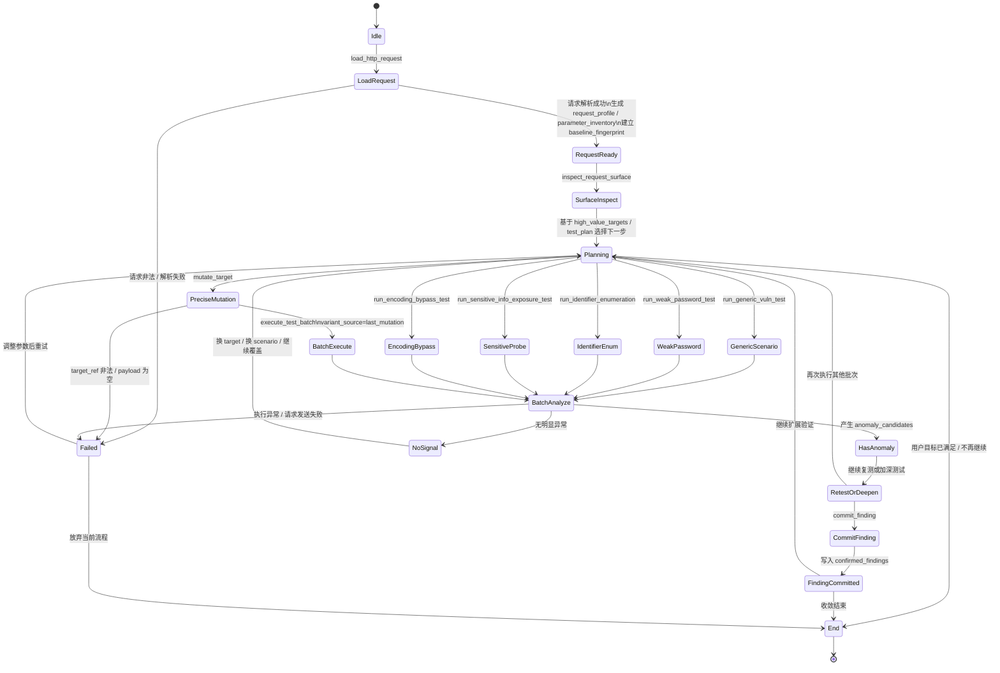
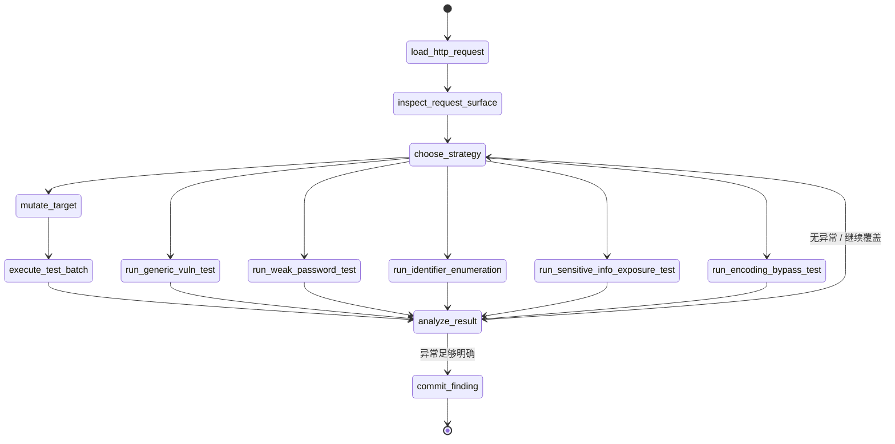

# Current HTTP Fuzz Loop State Machine

本文档描述当前 `http_fuzz` loop 的实际实现流程，对应代码主要在：

- `init.go`
- `actions.go`
- `state.go`

## Full State Machine

## Main Path

## Notes

- 当前实现更偏“收敛式循环”，不是严格硬编码的终态机。
- `End` 通常来自 AI 判断“目标已满足”或“继续收益较低”。
- `commit_finding` 是当前实现里最明确的收敛动作。
- 即使出现 `Failed`，很多情况下也会回到 `Planning`，而不是直接终止整个 loop。
