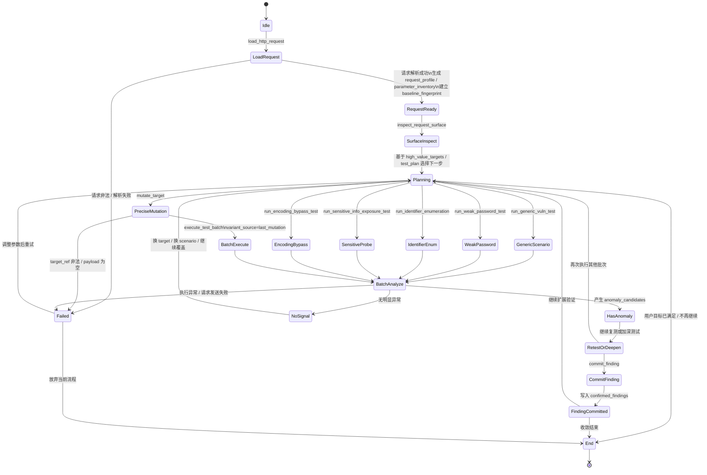
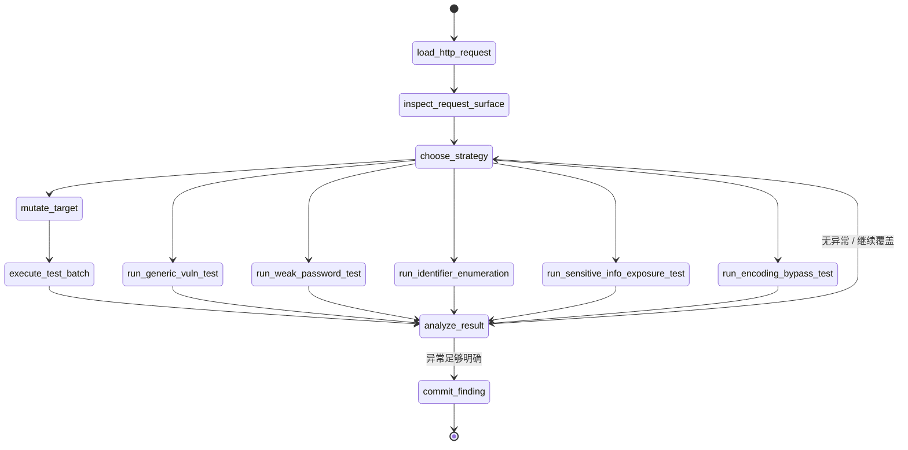

# HTTP Fuzz Loop State Machine

当前 `http_fuzz` loop 的执行流程更接近“收敛式状态机”。

- 先加载请求并建立基线
- 再分析请求面并选择测试策略
- 执行精确变异或场景化测试
- 根据结果回到规划、继续深入，或提交 finding 后结束

## 完整状态机

## 典型主流程

## 状态含义

- `Idle`
  - loop 刚创建，还没有请求上下文

- `LoadRequest`
  - 解析原始 HTTP 请求
  - 初始化 `request_profile`、`parameter_inventory`、`high_value_targets`
  - 尝试发送基线请求，建立 `baseline_fingerprint`

- `RequestReady`
  - 已具备完整请求上下文，可以进入分析和测试

- `SurfaceInspect`
  - 输出结构化请求面，帮助 AI 选择高价值目标

- `Planning`
  - 根据 `test_plan`、`coverage_map`、`anomaly_candidates` 决定下一步

- `PreciseMutation`
  - 用 `mutate_target` 保存精确 target 和 payload 计划

- `BatchExecute`
  - 用 `execute_test_batch` 执行上一步准备好的 mutation

- `GenericScenario / WeakPassword / IdentifierEnum / SensitiveProbe / EncodingBypass`
  - 直接以场景动作触发一次测试批次

- `BatchAnalyze`
  - 生成响应指纹
  - 对比基线
  - 提取异常信号
  - 更新 `attempt_history`、`coverage_map`、`anomaly_candidates`

- `NoSignal`
  - 当前批次没有明显异常，回到规划阶段继续覆盖

- `HasAnomaly`
  - 当前批次发现明显异常，进入复测或收敛阶段

- `CommitFinding`
  - 将 `anomaly_candidates` 固化为 `confirmed_findings`

- `End`
  - 达到收敛条件或 AI 决定停止

## 当前实现的结束特征

当前版本没有单独实现一个强制 `Done` 判定器，结束更多依赖以下情形：

- 用户目标已经覆盖
- 已有足够明确的 `confirmed_findings`
- 连续多轮无新信号
- AI 判断继续测试收益较低

因此它是“可回退到 Planning 的收敛式 loop”，不是一次线性跑完的固定流程。
