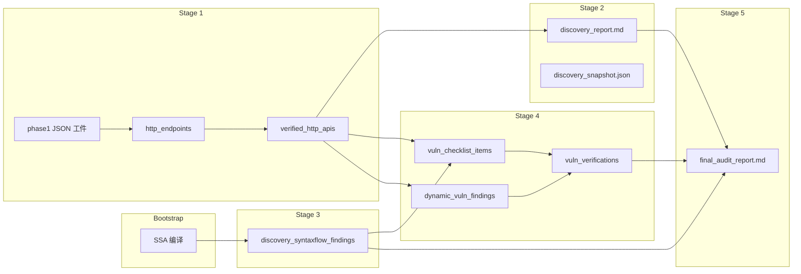

# 静动闭环安全审计（`ssa_api_discovery`）流水线梳理

> 基于 `loop_ssa_api_discovery` 源码梳理，日期：2026-06-09  
> 编排入口：`init_task.go` → `buildInitTask`  
> 注册名：`schema.AI_REACT_LOOP_NAME_SSA_API_DISCOVERY`（内部 action 仍为 `ssa_api_discovery`）

---

## 1. 总览

本专注模式面向 **本地源码 + 远程靶机** 双输入，在单一 SQLite 会话中串联：

| 侧 | 能力 |
|----|------|
| **静态** | SSA 编译、攻击面/API 发现、SyntaxFlow 规则扫描 |
| **动态** | HTTP 探测、鉴权获取、静态 finding 发包验证、深度挖掘 / 灰盒批量检测 |
| **闭环** | 静态发现 → 关联端点 → 动态验证 → 交叉印证 → 总报告 |

数据库：`{workDir}/ssa_discovery/session.sqlite3`（独立 SQLite，不混入 Yakit 主库）。

### 1.1 两种运行模式

| 模式 | 常量 | 行为 |
|------|------|------|
| **full_pipeline** | `SsaDiscoveryModeFullPipeline` | 跑五阶段流水线（可限 `max stage`） |
| **qa_review** | `SsaDiscoveryModeQAReview` | 仅注入 QA 提示词，`op.Continue()`，**不跑五阶段** |

路由逻辑见 `bootstrap_preflight.go`：启发式（Code path、靶机、关键词）→ 不确定时 LiteForge `ssa_discovery_route`。

### 1.2 五阶段编排（`init_task.go`）

**注意：内部文件名 `phase4_*` / `phase5_*` / `phase6_*` 与用户阶段号错位一位。**

```
Bootstrap（InitTask 内）
  ↓
Stage 1  攻击面发现（runPhase1Redesigned）
  ↓
Stage 2  发现快照 + discovery_report（finalizePhase1DiscoveryArtifacts，程序化）
  ↓
Stage 3  SyntaxFlow 静态扫描（phase4EnsureSyntaxFlowScan）
  ↓
Stage 4  动态验洞四步（runPhase5Pipeline：Step0→Step3）
  ↓
Stage 5  最终审计报告（runPhase6FinalReport）
```

| 用户阶段 | 入口函数 | 内部文件名 |
|----------|----------|------------|
| Stage 1 | `runPhase1Redesigned` | `phase1_*` |
| Stage 2 | `finalizePhase1DiscoveryArtifacts` | `phase2_report.go` |
| Stage 3 | `phase4EnsureSyntaxFlowScan` | `phase4_*` |
| Stage 4 | `runPhase5Pipeline` | `phase5_*` / `phase4_deep_mining_*` |
| Stage 5 | `runPhase6FinalReport` | `phase6_*` |

`PipelineMaxStage`（1–5，默认 5）控制**顺序执行到第 N 阶段后结束**，不跳步。

---

## 2. Bootstrap（InitTask 前半段）

**文件**：`bootstrap_runtime.go`、`bootstrap_preflight.go`、`focus_bootstrap.go`、`ssa_session_compile.go`

| 步骤 | 做什么 | 输入 | 输出 |
|------|--------|------|------|
| 路由 | `ClassifySsaDiscoveryRoute` | 用户首条消息 | `ssa_discovery_mode` |
| 字段补全 | `EnrichParsedForFullPipeline` | 文本 / 历史 SQLite / LiteForge | `Code path`、`Target` |
| 运行时 | `BootstrapDiscoveryRuntimeFromParsed` | 解析结果 | `Runtime` + SQLite |
| SSA | `ssaapi.ParseProjectFromPath` | 代码根目录 | `SSAProgramName`、`SSACompileOK` |
| 靶机探活 | `ProbeTarget` | Target URL | `TargetReachable` 等 |
| 专注模式准备 | `PrepareSsaApiDiscoveryFocusMode` | — | 注册嵌入式 Yak 工具、同步 SyntaxFlow 内置规则 |

**会话 phase**：`initialized` → `ssa_done`

---

## 3. Stage 1 — 攻击面发现（`runPhase1Redesigned`）

**文件**：`phase1_pipeline.go` 及子模块

细粒度多智能体管线：

```
Prep（程序化）
  ↓
tech_arch 技术架构 ReAct
  ↓
T1 routing_probe 路由探测 ReAct + gate
  ↓
T2 component_map 组件映射 ReAct
  ↓
F1 feature_inventory 功能清单 ReAct（覆盖率不全则硬失败）
  ↓
A1/A2/A3 auth chain 鉴权链 ReAct
  ↓
X1 failure_semantics 失败语义 ReAct + gate
  ↓
C1 auth_calibration 鉴权校准 ReAct（条件：需鉴权 + 靶机可达，硬闸门）
  ↓
RunEndpointHarvestForSession（Prep 静态 hint）+ runPhase1FeatureWorkChain 统一单元调度
  ↓
AssembleApiCatalogFromDB / writeRouteCandidatesFromDB / RunPhase1FullApiVerificationGate
  ↓
WritePhase1DiscoveryReport
```

### 3.1 Prep（程序化）

| 功能节点 (EN / 中文) | 文件 | 产出（结构化 JSON） |
|---------------------|------|---------------------|
| `RunBuildProjectProfile` 项目画像 | `phase1_project_profile.go` | `project_profile.json` |
| `RunBuildBackendScope` 后端范围 | `backend_scope.go` | `backend_scope.json`、`api_preanalysis.json` |
| `BuildJavaBusinessScopeInventory` Java 业务范围 | `phase1_java_scope_inventory.go` | `java_business_scope_inventory.json` |
| `BuildCodeUnitRegistry` 可分配源码单元 | `phase1_code_unit_registry.go` | `code_unit_registry.json` |
| `RunEndpointHarvestForSession` 静态路由 harvest（仅 hint） | `phase1_static_route_hints.go` | `static_route_hints.json` + `http_endpoints` 表（**不参与 gate 计数**） |
| `SupplementStaticRouteHints` 静态路由补充（端点<5） | `phase1_static_supplement.go` | `static_route_hints.json` + `http_endpoints` 表 |
| `writeMinimalPhase1PrepBundle` prep 摘要 | `phase1_prep.go` | `phase1_prep_bundle.json` |

### 3.2 ReAct 子循环一览

所有 Phase1 ReAct 子循环 MaxIterations 默认 100（`ssaDiscoveryMaxIterations`），子任务运行器 `runPhase1ReActLoop`（`phase1_react_context.go`）。

| 标签 | 功能节点 | 子循环名 | Playbook | 产出（类型） |
|------|----------|----------|----------|--------------|
| TA | `runPhase1TechArchReAct` 技术架构 | `ssa_api_discovery_phase1_tech_arch` | `phase1_tech_arch_playbook.txt` | `tech_architecture.json` **结构化** |
| T1 | `runPhase1RoutingProbeReAct` 路由探测 | `ssa_api_discovery_routing_probe` | `phase1_routing_probe_playbook.txt` | `routing_profile.json` **结构化** |
| T2 | `runPhase1ComponentMapReAct` 组件映射 | `ssa_api_discovery_component_map` | `phase1_component_map_playbook.txt` | `component_package_map.json` **结构化** |
| F1 | `runPhase1FeatureInventoryReAct` 功能清单 | `ssa_api_discovery_feature_inventory` | `phase1_feature_inventory_playbook.txt` | `feature_inventory.json`（含 `surface_kind` + `entry_files`）**结构化** |
| A1 | `runPhase1AuthRealmReAct` 鉴权域 | `ssa_api_discovery_auth_realm` | `phase1_auth_realm_playbook.txt` | `auth_realm_inventory.json` **结构化** |
| A2 | `runPhase1AuthMechanismReAct` 鉴权机制 | `ssa_api_discovery_auth_mechanism` | `phase1_auth_mechanism_playbook.txt` | 内存（传给 A3） |
| A3 | `runPhase1AuthSurfaceReAct` 鉴权面 | `ssa_api_discovery_auth_surface` | `phase1_auth_surface_playbook.txt` | `auth_surface_map.json`、`auth_evidence.json` **结构化** |
| X1 | `runPhase1FailureSemanticsReAct` 失败语义 | `ssa_api_discovery_failure_semantics` | `phase1_failure_semantics_playbook.txt` | `failure_semantics.json` **结构化** |
| C1 | `runPhase1AuthCalibrationChain` 鉴权校准 | `ssa_api_discovery_auth_calibration` | `phase1_auth_calibration_playbook.txt` | `auth_calibration.json`、`auth_state.json` **结构化** + `auth_credentials` 表 |
| V | `runPhase1FeatureApiChain` → `runPhase1FeatureWorkChain` | `ssa_api_discovery_feature_verify`（子任务 `phase1_http_api_unit_*`） | `phase1_feature_api_unit_playbook.txt` | `feature_api_map.json` + `verified_http_apis` 表 |

**两阶段边界**：Phase Auth（A1→A2→A3→C1 串行，唯一登录入口）完成后，`EnsureAuthReadyBeforeFeatureWork` 通过才进入 Phase Feature。Feature 单元内部线性 S1 前缀 → S2 路径 → S3 参数 → S4 验证（**只读 `auth_credential_id`，禁止登录**）。并发默认 4（`YAK_SSA_API_DISCOVERY_CONTROLLER_VERIFY_CONCURRENT`）。

F1 硬闸门：`code_unit_registry` 100% 分配至 `entry_files`（无 bootstrap 候补）。Gate 仅统计 unit 产物 + `verified_http_apis` 探针证据，**禁止** `code_reading_plan` / `http_endpoints` 候补通过。

### 3.3 闸门与报告

| 函数 | 行为 |
|------|------|
| `verifyRoutingProbeGate` | 路由 profile 可加载、mount_prefix 非空；警告级 |
| `verifyFailureSemanticsGate` | 失败语义文件合法；警告级 |
| `EvaluatePhase1AuthCalibrationReadiness` | 鉴权校准通过；**硬失败**（需鉴权 + 靶机可达时） |
| `RunPhase1FullApiVerificationGate` | registry 单元全部 completed、`http_api` 路由有探针证据、`code_only` 有代码分析产物；**硬失败** |
| `WritePhase1DiscoveryReport` | 写出 `phase1_discovery_report.md` **报告** |

**Stage 1 结束**：`markSessionPhase(api_verified)`；契约检查 `enforcePhase1Contract`（`pipeline_contract.go`）。

---

## 4. Stage 2 — 发现快照与报告

**文件**：`phase2_report.go` — **全程序化，无 ReAct**

| 输入 | 输出 | 类型 |
|------|------|------|
| `ExportDiscoverySnapshotJSON` | `discovery_snapshot.json` | **结构化 JSON**（DB 全表导出镜像） |
| `writeDiscoveryReportProgrammatic` | `discovery_report.md` | **Markdown 报告** |

HTTP 确认真源 = **`verified_http_apis`（verified=true）**；`http_endpoints` 为候选对照。

契约 `enforcePhase2Contract`：snapshot ≥32B、含 `verified_http_apis`、report ≥512B、verified 计数与 DB 一致。

---

## 5. Stage 3 — SyntaxFlow 静态扫描

**文件**：`phase4_syntaxflow_react.go`、`phase4_syntaxflow_scan.go`

```
phase4EnsureSyntaxFlowScan
  ├─ ReAct: ssa_api_discovery_phase4_syntaxflow（AI 构造 filter）
  ├─ tryPhase4FallbackScans（程序化：语言内置 → 全表规则）
  └─ RunSyntaxFlowScan(..., "ensure_summary") 兜底
```

| 硬依赖 | 说明 |
|--------|------|
| `SSACompileOK` + `SSAProgramName` | 否则 waiver `syntaxflow_ssa_failed` |

| 输出 | 类型 |
|------|------|
| `discovery_syntaxflow_findings` 表 | **结构化数据**（DB） |
| `discovery_sessions.syntax_flow_scan_meta_json` | **结构化数据**（DB 字段） |
| `syntaxflow_summary.json` | **结构化 JSON**（`store.SyntaxflowSummaryPath`） |

**不调用 Yak 工具**；使用原生 Go `syntaxflow_scan.Scan`。

**会话 phase**：`vuln_scanned`

---

## 6. Stage 4 — 动态漏洞验证（四步走）

**文件**：`init_task.go` `runPhase5Pipeline` + `phase4_*.go` + `phase5_step*.go`

**用户开关**：`phase4_mode: deep_mining`（**默认**）或 `phase4_mode: batch_scan`（legacy 灰盒批量）

```
Step 0  静态发现 → 待检清单（程序化 + report_generating）
Step 1  鉴权凭证同步（程序化 refresh Phase1 auth_credentials）
Step 2  静态 finding 动态验证（ReAct 或 skip waiver）
Step 3  深度挖掘（默认）或 batch_scan（legacy）
        BridgeAllConfirmedDynamicFindings → vuln_verifications
```

| Step | 功能节点 | 类型 | 子循环 / 实现 | 主要写 |
|------|----------|------|---------------|--------|
| **0** | `runPhase5Step0Checklist` | 程序化 + 报告 | `report_generating` | `vuln_checklist_items`、`vuln_checklist.json`（**结构化**）、`step0_vuln_checklist.md`（**报告**） |
| **1** | `runPhase4Step1AuthSync` | **程序化** | — | `step1_auth_result.md`（**报告**） |
| **2** | `runPhase4Step2StaticVerify` | ReAct **或跳过** | `ssa_api_discovery_phase5_step2_verify` | `vuln_verifications`（**结构化**）、`step2_static_verify.md`（**报告**） |
| **3** | `runPhase4DeepMining` / `runPhase4Step3BatchScan` | ReAct | `ssa_api_discovery_phase4_deep_mining_{id}` / `ssa_api_discovery_phase5_step3_greybox` | `endpoint_vuln_probes`、`dynamic_vuln_findings`（**结构化**）、`step3_greybox_scan.md`（**报告**） |

**Probe 目标**（`ListProbeTargets`）：`verified_http_apis`（verified=true 且 `full_sample_url` 非空）。

**豁免码**（`discovery_sessions.pipeline_waivers_json`）：

| Code | 何时 |
|------|------|
| `static_verify_skipped` | Step2 无高优 checklist |
| `auth_credentials_missing` | Step1 无凭证但 auth_surface 显示需鉴权 |
| `deep_mining_no_targets` | 0 probe targets |
| `greybox_skipped` | 靶机不可达 |
| `syntaxflow_ssa_failed` | Stage 3 SSA 失败 |

**深度挖掘硬闸门**：`finalize_endpoint_deep_mining` 要求 `vuln_type_registry` 全量类型均有 `endpoint_vuln_probes` 记录。

**会话 phase**：Step 内 `phase5_step0_done` 等 → 结束 `vuln_verified`

---

## 7. Stage 5 — 最终审计报告

**文件**：`phase6_final_report.go`

| 输入 | 输出 |
|------|------|
| 再导出 snapshot；`discovery_report.md`、`syntaxflow_summary.json`、Phase4 各 step 报告 | **`final_audit_report.md`**（**Markdown 报告**） |
| ReAct 失败时 | `generatePipelineFallbackReport` 程序化兜底 |

ReAct 子循环：`report_generating`（子任务 `phase6_final_report`）。

**会话 phase**：`pipeline_report_done`

---

## 8. 阶段间数据依赖



### 8.1 关键真源与对照表

| 数据 | 真源 / 主写阶段 | 下游消费者 |
|------|----------------|------------|
| **`verified_http_apis`** | Stage 1 V | Stage 2/4/5 报告、`ListProbeTargets`、deep_mining |
| `http_endpoints` | Stage 1 harvest/verify | 候选对照、关联 SF finding |
| `discovery_syntaxflow_findings` | Stage 3 | Step0/2、报告 |
| `vuln_checklist_items` | Step0 | Step2 验证参考 |
| `auth_credentials` | Stage 1 C1 / Step1 | Step2/3 |
| `vuln_verifications` | Step2、bridge | Stage 5 |
| `dynamic_vuln_findings` | Step3 | bridge、报告 |

### 8.2 结构化数据 vs 报告

| 类型 | 示例 |
|------|------|
| **结构化 JSON / DB** | 所有 `*.json` 工件、`verified_http_apis`、`discovery_syntaxflow_findings`、`vuln_checklist_items`、`vuln_verifications`、`endpoint_vuln_probes`、`dynamic_vuln_findings` |
| **Markdown 报告** | `phase1_discovery_report.md`、`discovery_report.md`、`step0~3_*.md`、`final_audit_report.md` |
| **结构化镜像** | `discovery_snapshot.json`（DB 导出，非真源） |

---

## 9. 主路径活跃子循环一览

| 子循环 | 调用点 |
|--------|--------|
| `ssa_api_discovery_phase1_tech_arch` | Stage 1 TA |
| `ssa_api_discovery_routing_probe` | Stage 1 T1 |
| `ssa_api_discovery_component_map` | Stage 1 T2 |
| `ssa_api_discovery_feature_inventory` | Stage 1 F1 |
| `ssa_api_discovery_auth_realm` / `_mechanism` / `_surface` | Stage 1 A1/A2/A3 |
| `ssa_api_discovery_failure_semantics` | Stage 1 X1 |
| `ssa_api_discovery_auth_calibration` | Stage 1 C1 |
| `ssa_api_discovery_feature_verify` | Stage 1 V（按控制器） |
| `ssa_api_discovery_api_probe` | Stage 1 V 内 probe action |
| `ssa_api_discovery_phase4_syntaxflow` | Stage 3 |
| `ssa_api_discovery_phase5_step2_verify` | Stage 4 Step2 |
| `ssa_api_discovery_phase4_deep_mining_{id}` | Stage 4 Step3（deep_mining） |
| `ssa_api_discovery_phase5_step3_greybox` | Stage 4 Step3（batch_scan） |
| `report_generating` | Stage 2 报告、Stage 4 各 step 报告、Stage 5 |

---

## 10. 嵌入式 Yak 工具：主路径 vs 仅注册

| 工具 | 主路径自动调用 | 说明 |
|------|----------------|------|
| `route_core_harvest` | Stage 1（端点<5 时 `SupplementStaticRouteHints`） | 静态路由 hints |
| `vuln_batch_scan` | Stage 4 Step3（`phase4_mode: batch_scan`） | legacy 灰盒批量 |
| 其余 Phase1 Yak 工具 | ❌ | 已废弃，见冗余清理清单 |

---

## 11. SQLite 表读写矩阵（摘要）

| 表 | 主写 | 主读 |
|----|------|------|
| `discovery_sessions` | 全程 Update | 全程 |
| `discovery_events` | Bootstrap、gates、warnings | snapshot |
| `http_endpoints` | Stage 1 harvest/verify | 质量门、报告 |
| **`verified_http_apis`** | **Stage 1 V / probe** | **Stage 2/4/5、ListProbeTargets** |
| `discovery_syntaxflow_findings` | Stage 3 | Step0/2、报告 |
| `vuln_checklist_items` | Step0 | Step2、报告 |
| `auth_credentials` | Stage 1 C1 / Step1 | Step2/3 |
| `vuln_verifications` | Step2、bridge | Stage 5 |
| `dynamic_vuln_findings` | Step3 | bridge、报告 |
| `endpoint_vuln_probes` | Step3 deep_mining | 报告 |
| `phase_artifacts` | Stage 1 prep / 各 ReAct commit | 报告 |

---

## 12. 按 max stage 的实际产出

| maxStage | 执行到 | 典型产物 | 会话 phase |
|----------|--------|----------|------------|
| 1 | Stage 1 结束 | `verified_http_apis`、Phase1 工件 | `api_verified` |
| 2 | + Stage 2 | `discovery_report.md`、`discovery_snapshot.json` | `api_verified` |
| 3 | + SyntaxFlow | `discovery_syntaxflow_findings` | `vuln_scanned` |
| 4 | + Stage 4 四步 | `vuln_verifications`、`dynamic_vuln_findings` | `vuln_verified` |
| 5 | + Stage 5 | `final_audit_report.md` | `pipeline_report_done` |

---

## 附录：关键源文件索引

| 主题 | 文件 |
|------|------|
| 编排器 | `init_task.go` |
| 注册与专注模式元数据 | `init.go` |
| 路由 / 模式 | `bootstrap_preflight.go` |
| Stage 1 | `phase1_pipeline.go`、`phase1_*_react.go`、`phase1_controller_verify_react.go` |
| 契约检查 | `pipeline_contract.go` |
| Stage 2 报告 | `phase2_report.go` |
| SyntaxFlow | `phase4_syntaxflow_react.go`、`phase4_syntaxflow_scan.go` |
| 动态验洞 | `phase5_step0_checklist.go` … `phase5_step3_greybox.go`、`phase4_deep_mining*.go` |
| Probe 目标 | `probe_targets.go` |
| 数据模型 | `store/models.go`、`store/repo.go` |
