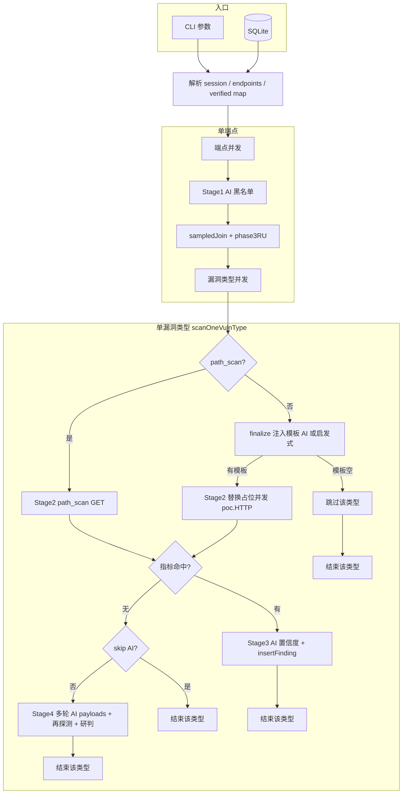
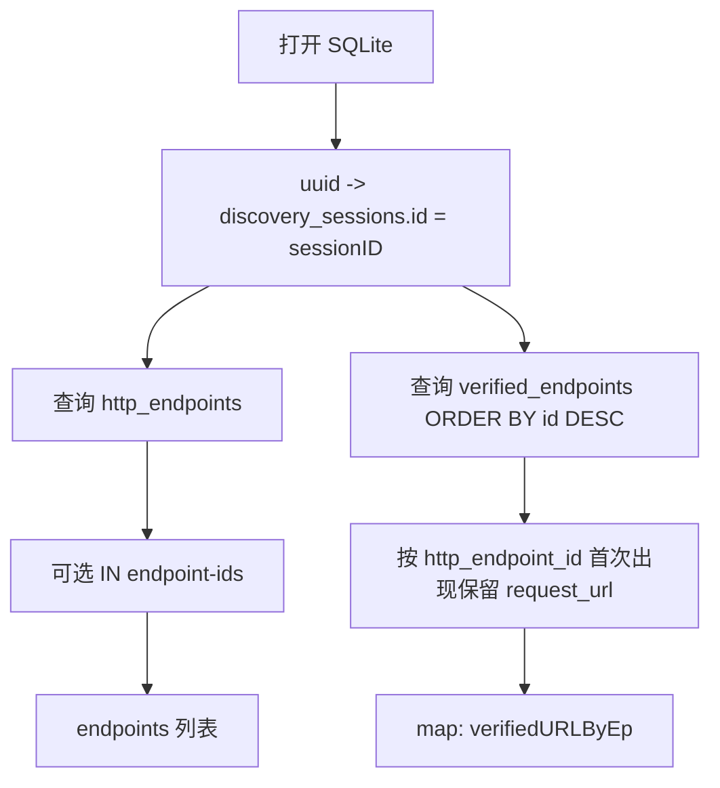
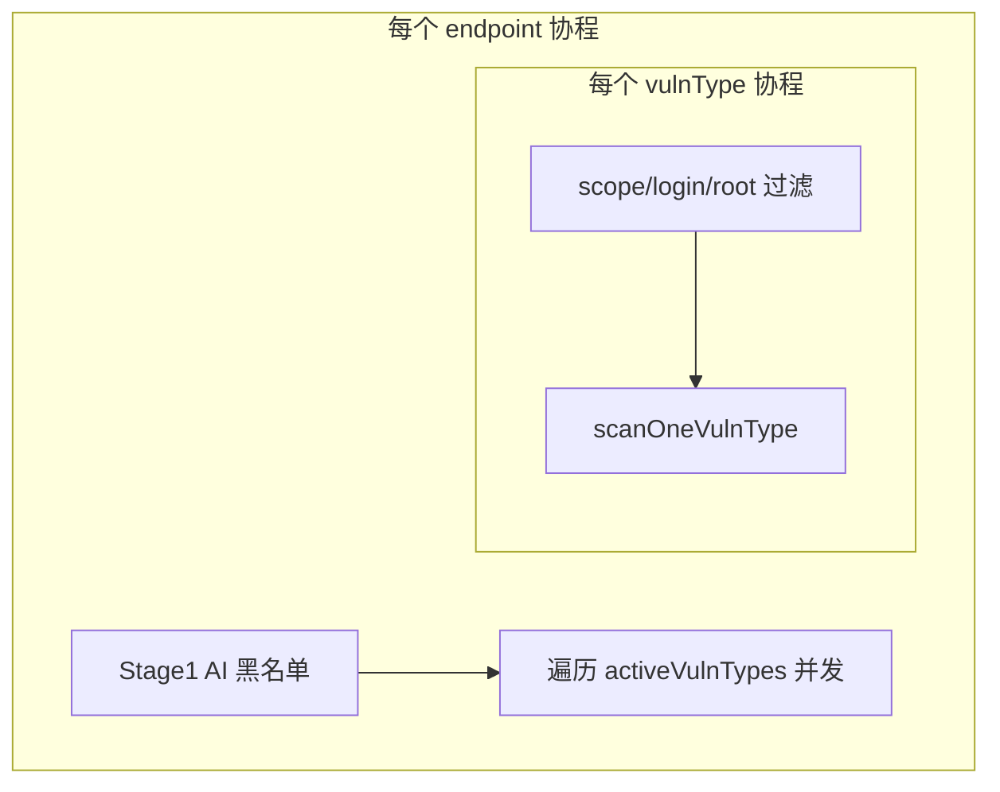
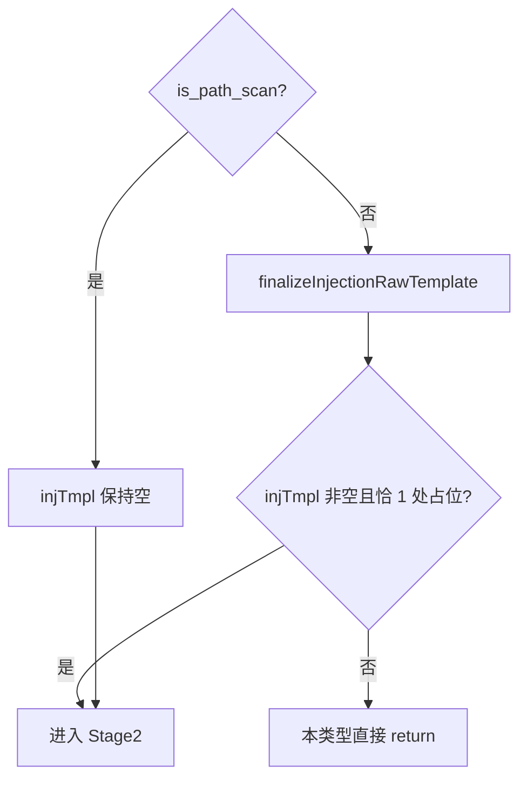

# vuln_batch_scan 流程说明（输入 / 输出 / 与设计对照）

本文档对应脚本：`vuln_batch_scan.yak`。占位符固定为 **`{TEST_payload}`**（常量 `testPlaceholderToken`）。HTTPS 与否由 **`--base-url`** 是否以 `https://` 开头推导（`baseHttps`）。

---

## 一、命令行入口参数（全局输入）

| 参数 | 必填 | 默认值 | 含义 |
|------|------|--------|------|
| `--sqlite-path` | 是 | - | `session.sqlite3` 绝对路径 |
| `--session-uuid` | 是 | - | `discovery_sessions.uuid` |
| `--base-url` | 是 | - | 目标站点 Base URL（用于拼 URL、`Host`、HTTPS 标志） |
| `--endpoint-ids` | 否 | 空 | 逗号分隔的 `http_endpoints.id`；空表示该 session 下全部 |
| `--concurrent` | 否 | `8` | HTTP 层并发（payload 级 worker 使用） |
| `--timeout` | 否 | `12` | 单次 `poc.*` 超时秒数 |
| `--host-throttle-ms` | 否 | `100` | 每个发包 worker 发包前 `sleep`（毫秒） |
| `--auth-header` | 否 | 空 | 形如 `Authorization: Bearer xxx`，会转成 `poc.replaceHeader` |
| `--api-desc` | 否 | 空 | JSON 字符串，拼进 AI prompt（经 `apiDescText` 包装） |
| `--ai-concurrent` | 否 | `2` | **`aiWg`** 限流：`ai.Chat` 最大并发 |
| `--skip-ai-review` | 否 | false | 打开后：跳过黑名单 AI、跳过注入模板 AI、跳过置信度 AI、跳过多轮载荷 AI；启发式整包仍可用于非 path_scan |
| `--react-max-rounds` | 否 | `3` | Stage 4 最大轮数（含约束 `0..32`） |
| `--ai-payloads-per-round` | 否 | `5` | 每轮 AI 生成载荷条数（含约束 `1..40`） |

**脚本内派生全局量**：`sessionID`（由 uuid 查库）、`endpointIds` 过滤后的 `http_endpoints` 行集、`verifiedURLByEp`（见下）。

### 总览流程图

---

## 二、数据库读取与映射（启动阶段）

### 2.1 输入

- `sqlitePath`、`sessionUUID`、`endpointIds`

### 2.2 步骤与输出

| 产出 | 类型 | 说明 |
|------|------|------|
| `sessionID` | int | 当前扫描会话主键 |
| `endpoints[]` | 行集 | `id, method, path_pattern, handler_class` |
| `verifiedURLByEp` | `map[id字符串]request_url` | Phase3 校准 URL；同端点多条时保留 **id 更大（更新）** 那条 |

### 2.3 每条端点上的「校准 URL」（进入后续阶段的公共输入）

对每个 `ep`：

| 变量 | 含义 |
|------|------|
| `phase3RU` | `verifiedURLByEp[sprint(ep.id)]`，可能为空 |
| `sampledJoin` | 若 `phase3RU` 非空则用之；否则 `joinURL(baseURL, samplePathLiteral(path_pattern))` |

`samplePathLiteral`：把路径里的 `*`、`:param`、`<...>`、`{...}` 等占位换成字面 `1` 等，与 Phase3 样本化思路一致。

---

## 三、顶层并发结构（谁调谁）

四层并发：**端点 goroutine** → **漏洞类型 goroutine** → **payload goroutine** → **AI 调用（`aiWg`）**。

---

## 四、Stage 1：AI 黑名单（按端点，一次）

### 4.1 输入

| 字段 | 来源 |
|------|------|
| `meth` | `http_endpoints.method`（转大写） |
| `path_pattern` | `http_endpoints.path_pattern` |
| `handler` | `handler_class` |
| `apiDescText` | `"\n- API 描述: "+apiDesc`（若未传 api-desc 则为附加空逻辑前的空串包装） |

### 4.2 输出

| 产出 | 说明 |
|------|------|
| `blacklist[]` | 漏洞类型 key 列表；`skipAiReview` 时为空（不调用 AI） |
| `blCsv` | 形如 `,sqli,xss,` 的字符串，用于 `Contains(",vtKey,")` 快速过滤 |

后续每个 `vtKey ∈ activeVulnTypes`，若在黑名单中则 **不进入** `scanOneVulnType`。

---

## 五、漏洞类型门禁（VT 协程内，非 AI）

在调用 `scanOneVulnType` 之前：

| 条件 | 行为 |
|------|------|
| `vDef.scope == "login_only"` 且端点非登录特征 | `return` |
| `vDef.scope == "root_only"` 且端点非根路径特征 | `return` |

**说明**：当前实现的 **`activeVulnTypes`** 仅包含：`sqli, xss, cmdi, ssrf, path_traversal, ssti, xxe, deserialization, backend_leak, info_leak, file_include`。其中 `backend_leak` / `info_leak` 为 `is_path_scan`，其余为 Congin 式整包或 GET 启发式。

---

## 六、`scanOneVulnType`：单端点 × 单漏洞类型

### 6.1 函数入参

| 参数 | 含义 |
|------|------|
| `epID` | `http_endpoints.id` |
| `meth` | 端点方法（大写） |
| `pathPattern` | 路径模式 |
| `handler` | handler 类名 |
| `sampledJoinURL` | 上文 `sampledJoin`（校准优先的完整 URL） |
| `phase3RU` | 原始 Phase3 `request_url`（可为空，供 AI 模板上下文） |
| `epStr` | 人类可读端点摘要 |
| `vtKey` | 漏洞类型 key |
| `vDef` | `vulnTypeRegistry[vtKey]` |
| `apiDescText` | 同 Stage 1 |

### 6.2 前置退出条件

| 条件 | 结果 |
|------|------|
| `vDef.payloads` 为空 | 立即 `return`（该类型不产生任何探测） |
| `vDef.indicators` 为空 | 立即 `return` |

### 6.3 注入模板 `injTmpl`（Congin：先模板，后替换）

**`finalizeInjectionRawTemplate` 内部顺序**（非 path_scan）：

1. **`aiInferInjectionPacketTemplate`**（若 `skipAiReview` 则跳过，直接走 2）  
   - 输入：方法、path、校准 URL、phase3 URL、handler、漏洞 key/名、api 描述等。  
   - 输出：模型 JSON 中的 `request_raw`，且全文 **`{TEST_payload}` 出现次数必须 = 1**。
2. 若 1 失败：**`buildHeuristicInjectionPacket(meth, sampledJoinURL, vDef)`**  
   - **`content_type` 非空**：POST 风格，`Content-Type` 为注册表值，Body 为单占位（如 XML）。  
   - **`scope == "no_get"`**（Congin 对齐）：**强制 POST+Body** 启发式；若方法为 GET/HEAD/OPTIONS 会在包内 **升格为 POST**；Body 一般为 `{"fuzz":"{TEST_payload}"}` 或上述 XML 分支。  
   - 否则：**GET**，请求行 URI 带 `fuzz={TEST_payload}`（或 `&fuzz=`）。

**输出**：`injTmpl` 字符串；`sendRawHTTPProbe` 要求替换后 **不再含** `{TEST_payload}` 才发请求。

---

## 七、Stage 2：内置 `payloads` 并发探测

### 7.1 输入

- `payloadList`、`inds`、`injTmpl`（非 path_scan）、`isPs`、`sampledJoinURL`、`meth`、…

### 7.2 单 payload 分支

| 模式 | HTTP 行为 | `url`（展示 / 入库 request_url） | `request_raw`（入库，截断） |
|------|-----------|-----------------------------------|------------------------------|
| `is_path_scan` | `poc.Get(joinURL(baseURL, pay))` | `joinURL(baseURL, pay)` | `path_scan probe: ...`（短描述） |
| 非 path_scan | `sub = ReplaceAll(injTmpl, "{TEST_payload}", pay)` → `poc.HTTP(sub, …)` | `guessURLFromProbablePacket(sub)` | `truncateStr(sub, 4000)` |

### 7.3 输出

- **`hitResults[]`**：仅当响应 `body` 命中 `checkIndicators` 中任一条时追加；元素含 `payload, url, req_raw, rsp_snippet, evidence, status_code` 等。

---

## 八、Stage 3：命中后的 AI 置信度（可选）

### 8.1 输入

- 每个 `hit` 的：`vtName, vtKey, payload, url, req_raw, rsp_snippet, ep_info`

### 8.2 输出

- `aiConfidenceReview` → `is_real, confidence, analysis`（`skipAiReview` 时固定为「跳过」且 `is_real=true, confidence=50`）。
- 取 **confidence 最大** 的一条作为 `bestHit`。
- **`status`**：`confirmed`（≥70）、`false_positive`（≤25）、否则 `uncertain`。
- **`insertFinding`** 写入 SQLite（见第十节）。

若 Stage 3 写入成功，**不再进入 Stage 4**（Stage 4 条件为 Stage 2 后 `len(hitResults)==0`）。

---

## 九、Stage 4：多轮 AI 生成载荷（仅当 Stage 2 全未命中且未 `--skip-ai-review`）

### 9.1 每轮输入

| 输入 | 说明 |
|------|------|
| `aiGeneratePayloadBatch(..., sampledJoinURL, injTmpl, ...)` | `injTmpl` 非空时会把 **模板节选（≤900 字符）** 写入 prompt，令模型针对 **整包单点替换** 生成载荷 |
| `builtinSnippet` / `failHist` | 内置载荷摘要 + 历史轮次失败说明 |

### 9.2 每轮输出与探测

- 模型返回 `payloads[]`（长度需为 `aiPayloadsPerRound`）。
- 每个 payload：**与 Stage 2 相同** 的发包分支（path_scan vs `injectPayloadIntoRawPacket` + `sendRawHTTPProbe`）。
- 若本轮有命中：同样走 **AI 置信度** 与 **`insertFinding`**，然后 **`return` 离开 `scanOneVulnType`**（不再进行后续轮次）。

---

## 十、落库：`dynamic_vuln_findings`（`insertFinding`）

| 列（概念） | 典型来源 |
|------------|----------|
| `session_id` | `sessionID` |
| `http_endpoint_id` | `epID` |
| `vuln_type` | `vtKey` |
| `severity` | `vDef.severity` |
| `confidence` | Stage 3/4 AI 分值 |
| `payload` | 命中的那条字符串 |
| `request_url` | `hit.url` / `guessURLFromProbablePacket` 或 path_scan 的完整 URL |
| `request_raw` | 截断后的整包或 path 探测说明 |
| `response_raw` | 响应 body 截断（`rsp_snippet`，约 2000） |
| `evidence` | 命中的 indicator 拼接 |
| `status` | `confirmed` / `uncertain` / `false_positive` |
| `ai_analysis` | 模型研判或轮次标签 |

---

## 十一、关键辅助函数 I/O（便于与你的设计逐项对照）

| 函数 | 输入要点 | 输出要点 |
|------|----------|----------|
| `joinURL(base, path)` | base + 路径或绝对 URL | 完整 URL 字符串 |
| `injectPayloadIntoRawPacket(tmpl, pay)` | 模板、`pay` | 全文替换 `{TEST_payload}` |
| `sendRawHTTPProbe(packet)` | 替换后包文 | `nil` 或 `{body, status_code}`；占位未删尽则不发 |
| `probePathScan(pay)` | 路径片段 payload | GET `baseURL+pay`，同上返回结构 |
| `guessURLFromProbablePacket` | 替换后 raw 首行请求行 | 用于展示的 `request_url` |

---

## 十二、与你方设计对齐时的核对清单

1. **Phase3 校准**：是否期望「同 `http_endpoint_id` 多条 `verified_endpoints` 时取 **id 最大**」？当前实现如此。  
2. **无 Phase3 时**：是否接受 **`samplePathLiteral(path_pattern)` + `base-url`**？  
3. **Congin 模板**：是否要求 **全脚本统一单占位 `{TEST_payload}`**？当前 AI 与启发式均按此校验。  
4. **no_get**：启发式是否应 **始终 POST+Body**（即使 DB 方法为 GET）？当前是。  
5. **path_scan**：是否接受 **不走整包模板、仅用 GET 拼路径**？当前是。  
6. **黑名单 / 置信度 / 多轮载荷**：是否在无 AI 环境下退化为「仅启发式整包 + 指标匹配」？`--skip-ai-review` 时接近该行为（模板 AI 也跳过，只剩启发式模板）。

---

*文档生成自仓库内 `vuln_batch_scan.yak` 当前实现，若脚本变更请同步更新本节。*
