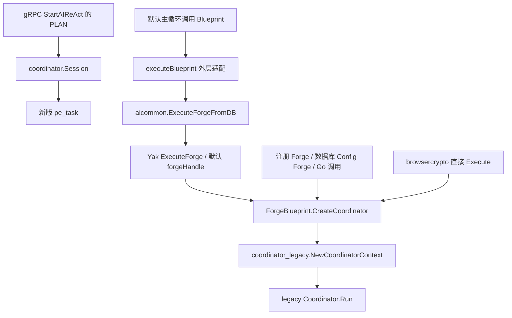
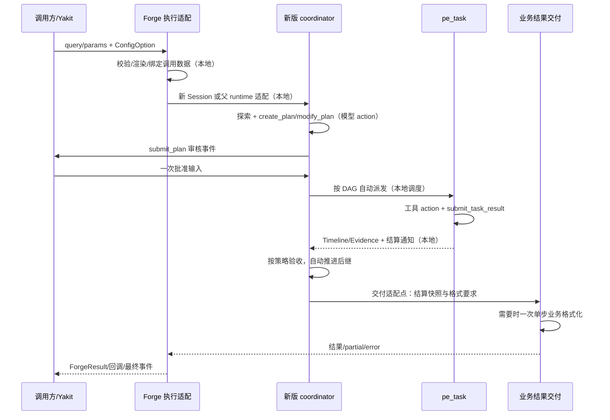
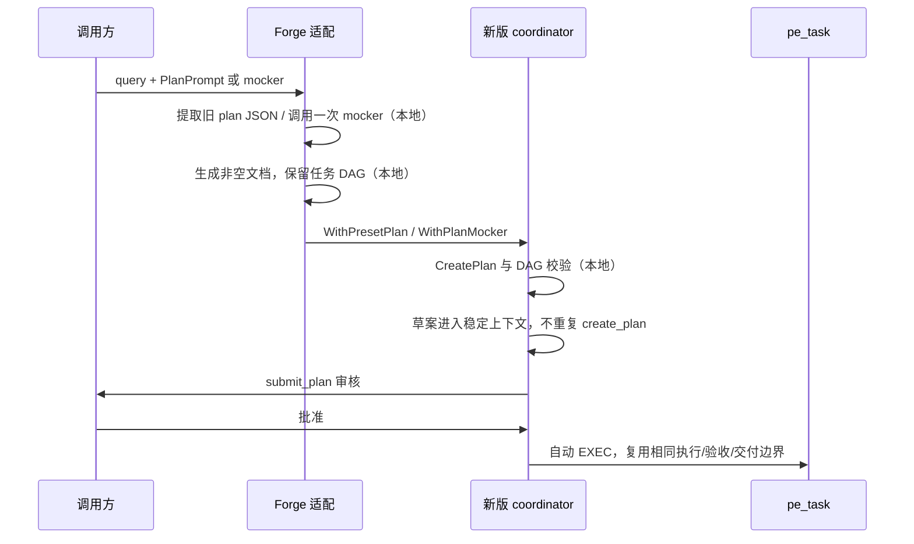

# Legacy 接口迁移：aiforge 底层与边缘兼容

> 状态：A/B 源码迁移已提交，PR #5240 的提交 `1cabc84cc` 已通过全部适用 CI。第 14 节保留迁移时的本地验收记录；第 15 节规定旧包整包保留、包外零导入的隔离边界。
>
> 基线：2026-10-04，提交 `f735dcc66f5b2b7f18e975f83734db991dae33b7`。
>
> 迁移分成两个可独立 review 的部分：**A. aiforge 底层迁移**；**B. 边缘 legacy coordinator 接口迁移**。A 替换实际执行体；B 保留需要兼容的入口、数据和行为，并切断外围对旧执行器的依赖。

## 1. 目标与阅读方式

目标是让需要规划执行的 Forge 使用新版 `coordinator.Session` 与 `pe_task`，同时保留既有 Forge、Yak、Yakit/Memfit 接入的业务契约。兼容保留在外层适配，不把旧协调器、旧任务状态机或旧上下文生成器搬入新版。

本文用以下状态区分现状和设计：

- **现状**：在基线源码中可直接核实的行为。
- **已有基础**：新版已经提供、迁移可以复用的能力。
- **迁移要求**：后续实现必须满足的契约。
- **建议设计**：拟采用的实现方向；类型名称不是已发布 API。
- **待审定**：实施前需要通过接口 review 固定的细节；不能默认为已实现。

两部分的验收不能互相替代。A 完成不表示全部 legacy 引用已移除；B 保住入口名称也不表示底层已经切换。

第 2～6 节保留迁移前基线与设计理由，其中“现状”“建议设计”“迁移缺口”描述基线提交，不能当作当前运行说明；第 7～12 节保留契约与验收标准。已实现的具体接口以第 14 节和当前源码为准。

## 2. 当前调用链与依赖规模

### 2.1 实际运行链路

普通 PLAN 入口已经使用新版。Forge 的默认 Blueprint 执行器仍创建旧协调器。



依据：

- [Blueprint 构造](../../aiforge/create_coordinator.go) 的实际返回类型和构造函数都是 legacy。
- [ReAct Blueprint 适配](../aireact/invoke_blueprint_execute.go) 转发到 `ExecuteForgeFromDB`；该适配自己不构造旧协调器，但其下游默认执行器会构造。
- [Forge 注册及数据库执行](../../aiforge/forges_register.go) 都通过 Blueprint 创建执行器。
- [Yak 执行](../../../yak/aiagent_executor.go) 保留脚本 `forgeHandle`，默认 handle 通过 Blueprint 创建执行器。
- [browsercrypto](../../aiforge/browsercrypto/forge.go) 的直接 `Execute` 仍走 Blueprint；其 gRPC `PrepareReAct` 是已有的另一条流式会话适配，不能混为一条调用链。

### 2.2 外部 legacy 导入清单

基线中排除测试文件和 `coordinator_legacy` 包内部后，19 个 Go 文件直接导入该包或其子包。文件数不是执行入口数。

| 归属 | 文件 | 现状及迁移归属 |
| --- | --- | --- |
| A | [create_coordinator.go](../../aiforge/create_coordinator.go) | Blueprint 实际构造旧执行体，A 的主要替换点 |
| A | [forge_blueprint.go](../../aiforge/forge_blueprint.go) | mocker、结果生成器、结果回调绑定旧类型 |
| A | [forge_blueprint_render.go](../../aiforge/forge_blueprint_render.go) | 结果模板直接接收旧 PromptContextProvider |
| A | [forge_blueprint_maker.go](../../aiforge/forge_blueprint_maker.go) | 预设计划用旧 ExtractPlan，结果写入配置对象 |
| B | [aiagent.go](../../../yak/aiagent.go) | Yak 导出的 plan、resultHandler、ExtractPlan 等指向旧接口 |
| B | [aiagent_options.go](../../../yak/aiagent_options.go) | NewExecutor 工厂返回旧类型，部分选项为旧别名 |
| B | [aiagent_utils.go](../../../yak/aiagent_utils.go) | 配置绑定的函数类型断言要求旧执行器返回类型 |
| B | [aireact/coordinator.go](../aireact/coordinator.go) | 新版路由中仍借用旧引擎名称常量判断历史记录 |
| B | `aireact/coordinator_legacy.go`（本次已删除） | 基线保留的旧 plan-and-execute 实现，公开路由已经停用 |
| B | [invoke_plan_and_execute.go](../aireact/invoke_plan_and_execute.go) | 旧构造与 Run 的适配变量，以及共享调用选项 |
| B | [invoke_plan_only.go](../aireact/invoke_plan_only.go) | 保留旧 planning-only / execute-only 实现 |
| B | [invoke_execute_plan.go](../aireact/invoke_execute_plan.go) | 保留旧已批准计划执行实现 |
| B | [invoke_plan_cod.go](../aireact/invoke_plan_cod.go) | 保留旧审批会话及计划结果转换 |
| B | [invoke_detached_plan.go](../aireact/invoke_detached_plan.go) | 旧 detached 发布、解析辅助函数；新版处理器仍借用旧常量 |
| B | [task_runtime_inspector.go](../aireact/task_runtime_inspector.go) | 从旧注册表收集运行计划快照 |
| B | [reactinit/init.go](../aireact/reactloops/reactinit/init.go) | blank import 注册旧 plan / task 循环 |
| B | [task_review.go](task_review.go) | 新版任务审核只借用旧 TaskReviewSuggestions 数据 |
| B | [aivizhttp/handler_live.go](../../../yakgrpc/aivizhttp/handler_live.go) | 活跃会话枚举仍读取旧协调器注册表 |
| A/B | [scannode/legion_ai_forge_result.go](../../../../scannode/legion_ai_forge_result.go) | Legion 自定义结果生成器显式依赖旧 Coordinator/provider |

旧库自己的命令入口、实现和测试不计入这 19 个外部导入。字符串、注释或过时错误中的 `coordinator_legacy` 也不应误算为旧执行器接入。

## 3. 两部分的职责与交接

| 项目 | A：aiforge 底层 | B：边缘接口 |
| --- | --- | --- |
| 主要目标 | Forge 实际执行不再构造旧 Coordinator | 既有客户端和脚本通过兼容入口进入新版 |
| 保留对象 | Blueprint、配置、参数、注册表、结果格式 | Yak 名称、必要方法、RPC、事件、存储外壳 |
| 新执行依赖 | coordinator + aicommon + 已注册 runtime | 新执行接口或公共数据契约 |
| 交接产物 | 新 Forge 执行体、计划输入、结果快照 | 工厂与回调适配、观测和历史记录处理 |
| 不应承担 | 复制全部旧协调器 API | 另建 planner 或恢复旧状态机 |
| 独立验收 | 直接 Go/注册表/数据库 Forge 链路 | Yak/Yakit/Memfit/观测/恢复边界 |

A 的目标是用一个小的 Forge 执行适配包住新版 Session；B 为原调用方适配该执行接口。类型形状必须一起 review，但不要让两个部分共享旧 runtime。

跨 A/B 的构造工厂与 Yak 配置绑定必须原子切换，或在中间提交保留明确可用的过渡适配。不能留下“新返回类型、旧类型断言”这种编译通过但配置继承失效的状态。

## 4. 共同原则

1. 新系统仍只有协调员和任务执行者两种 ReAct 循环；格式化单步结果不新建循环。
2. `EnableFunctionCallMode` 选择主循环协议；原生 function call 与文本流 JSON action 都支持，不因 Forge 或 PLAN 强行改写。
3. 原生调用按 aiprojection/主循环协议路径投影；不能一边保留文本 action 指令，一边私自注入另一套调用要求。
4. 用户输入、澄清答复、选项答案和审批意见进入 session Timeline。原文不在纯动态区重复展示。
5. 共享 Evidence 归 session，使用已有保存、去重、冻结和 SemiDynamic1 提升机制；不恢复 PLAN 私有 facts。
6. 新版拥有状态、attempt、调度和验收。兼容 DTO、模板视图和旧字段名称没有执行权。
7. 旧入口兼容不表示旧实现继续执行。不能以初始化旧 Coordinator 的方式获得模板数据、解析任务或兼容回调。
8. 工具、模型分层、预算、审批策略、取消和存储配置必须继承。不能用新默认配置静默覆盖调用方。
9. 修复已经确认的重复配置、丢结果或错误吞没问题，不把这些缺陷视为必须保留的业务契约。
10. “已入队”“worker 已退出”“任务已验收”“业务结果已交付”是不同边界，不能互相替代。

## 5. A：aiforge 底层迁移

### A1. 保留的 Blueprint 和配置能力

保留 [ForgeBlueprint](../../aiforge/forge_blueprint.go)、[YakForgeBlueprintConfig](../../aiforge/forge_blueprint_maker.go)、[schema.AIForge](../../../schema/ai_forge.go) 的业务意义。内部函数和回调类型可以调整，外部配置字段不应因为换执行体而改名。

| 字段或功能 | 迁移要求 |
| --- | --- |
| Name / VerboseName / Description / Tags / Author | 注册、查询、界面和导入导出语义不变 |
| InitPrompt / InitializePrompt | 保持模板渲染和参数规则，作为 Forge 业务指令输入 |
| PersistentPrompt | 保持参数渲染结果，沿已有上下文分区保存 |
| PlanPrompt | 对现有配置 Forge，仍表示可解析的预设计划内容，不能静默改成普通规划偏好 |
| ResultPrompt | 保持原业务输出要求，支持自由文本和结构化 action |
| Actions | 保持结果 action 名称与 alias 的提取契约 |
| CLIParameterRuleYaklangCode / ForgeContent | 保留 CLI 参数和自定义 Yak handle |
| Tools / ToolKeywords | 保留绑定工具与能力发现，不扩大工具范围 |
| AIOptions / AIDOptionsConfig | 保留配置覆写意图和模型预算 |
| ParamsUIConfig / UserPersistentData / FSBytes | 不因执行体迁移改动 UI、存储和资源封装契约 |
| ForgeResult | 返回每次执行独立的结果，不能复用另一调用留下的数据 |

LiteForge 应用已经归入 `aid/liteforge/liteforgeapp`。A 不把这些单步应用重新包装成 PLAN，也不恢复 aiforge 下面已经移走的 LiteForge 实现。

### A2. 执行接口与依赖方向

**已有基础**：[Session](session.go) 提供 `NewSession`、`FromRuntime`、`Run`、`RunPlanOnly`、`Snapshot` 和关闭能力。

**建议设计**：aiforge 提供一个小的 Forge 执行对象，内部持有新版 Session 与本次调用数据；对象名称暂称 `ForgeExecution`。这个名称尚未实现，不作为文档外的可调用 API。

它只负责：

- 已校验的 query/params、渲染后的模板和配置准备；
- 创建或适配新版 Session；
- 调用执行生命周期；
- 基于确定的快照交付 Forge 结果，保证一次性回调；
- 生命周期结束后释放本次调用资源。

它不负责计划状态机、DAG 调度、wait/inbox、重试、任务审核或 Evidence 实现。

独立调用使用 `NewSession`；嵌入现有 ReAct 时，优先显式接入父 runtime 与任务，复用 `FromRuntime` 的输入、事件和存储边界。当前通用 Forge 回调只传 ConfigOption，因此父 runtime 的传递形式还需要在实现 review 中固定，不能假定现有回调已经拥有它。

依赖方向保持：

```text
aiforge -> coordinator -> aicommon / reactloops
aireact -> aiforge
aireact -> 注册 aicommon runtime factory
```

aiforge 不能反向导入 aireact，否则会与 [aireact/register.go](../aireact/register.go) 形成循环。独立 Go 入口未加载 runtime 时要尽早失败，使用英文错误说明所需注册或 import；不能回退构造 legacy。

### A3. 构造入口的语义

当前三个入口必须分别覆盖：

| 入口 | 现状 | 迁移要求 |
| --- | --- | --- |
| CreateCoordinator(ctx, i, opts...) | 将参数转成 rawInput；渲染后的 InitPrompt 放入 Config.PlanPrompt | 保留 raw 参数与业务指令的区别 |
| CreateCoordinatorWithQuery(ctx, query, opts...) | 渲染 query 后，以 firstQuery 创建旧协调器 | 不丢 query；将新上下文的输入和指令归属明确化 |
| CreateCoordinatorWithQueryAndParams(ctx, query, validatedParams, opts...) | 使用已经验证的参数，不重新执行导入的 CLI 声明 | 保留这个校验边界，不能退回重新解析任意 CLI |

用户原始输入只进入一次 Timeline；渲染后的业务指令不是第二份用户输入。为了兼容模板允许出现的参数引用，不应对模板内容做不透明的删改。

模板渲染得到的调用数据可以随调用改变，不能被包装为全局 High Static。每轮不得重新生成 nonce、工具排列或参数序列，造成可避免的缓存前缀变化。

### A4. 配置合并和父会话继承

固定一次构造的配置顺序：Blueprint 基础配置和生成选项先应用，调用方覆写随后应用；限制工具范围等强约束以实际入口契约为准。同一个 ConfigOption 不能因为重复拼接而执行两次。

至少验证下列配置：

| 类别 | 必须保留 |
| --- | --- |
| 模型 | Original / Quality / Speed 回调和实际模型选择 |
| 协议与预算 | EnableFunctionCallMode、MaxTokens、重试及超时配置 |
| 生命周期 | ctx、取消、输入处理、关闭与 worker 实际退出 |
| 身份 | session_id、coordinator_id、父 ReAct/task 关联 |
| 状态存储 | 调用方 DB、checkpoint、工作区和 artifacts |
| 上下文 | Timeline、session prompt state、共享 Evidence、持久业务上下文 |
| 交互 | plan/task/tool 审核策略、force manual、detached 设置 |
| 能力 | 显式工具、工具 scope、MCP/skills/子 Agent 配置 |
| 事件 | 原始模型回调、事件 emitter、热更新和原传输封套 |

当前 Blueprint 构造先复制 AIOptions，而生成的 extraOpts 又包含 AIOptions。迁移应收敛为一次应用，并用追加型选项验证没有重复副作用。

### A5. PlanPrompt 与预设 DAG

**现状**：[Build](../../aiforge/forge_blueprint_maker.go) 为非空 PlanPrompt 生成旧 mocker；`ExtractPlan` 是本地 action/任务解析，不是模型调用。

例如现有输入：

```json
{
  "@action": "plan",
  "main_task": "检查执行链",
  "main_task_goal": "给出证据和结论",
  "tasks": [
    {"subtask_name": "收集证据", "subtask_goal": "保存可复核证据", "depends_on": []},
    {"subtask_name": "形成结论", "subtask_goal": "依据证据形成结论", "depends_on": ["收集证据"]}
  ]
}
```

**已有基础**：[ParsePlan](plan_wire.go) 兼容 main_task/tasks、嵌套子任务、root_task、名称/索引/语义标识/任务 ID 依赖，并校验 DAG；[WithPresetPlan](preset_plan.go) 加载草案。

迁移步骤：

1. 使用公共 action 提取能力处理裸 JSON、JSON 围栏或带说明文字的原有计划响应。
2. 提取完整任务定义，交给新版 ParsePlan；不创建旧 AiTask，不执行 legacy 的语义标识生成流程。
3. 保留嵌套任务组和依赖关系。父节点只组织任务，叶节点才执行；引用组的依赖等待该组全部相关叶任务。
4. 缺少旧可选语义标识时使用新版兼容解析；对冲突、未知引用、循环依赖明确失败。
5. 提供非空 PLAN DOCUMENT。旧数据只有任务树时，建议从目标、任务书和依赖生成确定性的初始文档，不能额外请求模型补一个空文档。
6. 通过预设接口创建未批准草案，再由 submit_plan 按策略审核；不能调用 LoadApproved/CommitApprovedPlan 假装用户已经批准。
7. 无效预设计划返回可定位错误；不要静默转为重新规划，更不能回退旧执行体。

计划输入的宽松兼容不放宽执行安全条件。运行态字段、旧 summary、tool 统计或 `progress=completed` 都不能把预设叶任务标为已验收。

### A6. PlanMocker

| 项目 | 迁移契约 |
| --- | --- |
| 新 Go 类型 | 使用已有 func(*Session) *PlanResponse |
| 结果 | RootTask 为新版 PlanNode，Document 为稳定计划文档 |
| 调用时机 | 新计划初始化时调用一次；恢复计划不重复调用 |
| 校验 | 与正常 create_plan 一样校验文档、定义和 DAG |
| 审核 | 与正常计划一样 submit；mocker 不具有审批权限 |
| 错误 | nil 回调、nil 结果或缺失任务返回明确错误 |
| 副作用 | 只提供计划数据；不能通过构造旧协调器取得工具或上下文 |
| Yak 兼容 | plan / forgePlanMocker 名称由 B 承接，最终产生相同新版草案 |

如果旧 Go 回调签名明确写着 `*coordinator_legacy.Coordinator`，它不能与新版签名直接赋值兼容。必须迁移调用代码；不能用类型别名掩盖执行体差异。

### A7. 结果生成与交付

**现状**：Blueprint ResultPrompt + ResultHandler 会替代旧协调器默认报告生成；默认 GenerateResult 发起一次结果请求，按原模型预算生成自由文本，最后提取配置要求的 action。自定义 ResultGenerator 可以替代默认请求。

需要保留：

- ResultPrompt 决定的业务格式，不强行改成 Markdown；
- `ForgeResult.Action`、`Formated` 和 Forge 身份；
- Actions 的首个名称与其余 alias；
- 自定义生成器的优先级和一次性调用；
- ResultHandler 的原参数数量和字符串/错误含义；
- 模型 token 预算与配置，不添加隐式截断；
- 流式展示；读取失败时保留 partial output 与 error；
- 业务结果必须归属本次调用，不能读取上一次执行的结果。

**迁移缺口**：新版 [Session.run](session.go) 要求 EXEC 有最新已提交报告和宿主完成状态。因此不能只删除 ResultHandler、直接 Run 后取 Markdown，也不能靠 GenerateReport=false 绕过收尾检查。

**建议设计**：给新版交付边界一个明确的适配点。它复用任务验收、待处理消息、用户修订和结束门禁；Forge 的业务输出与协调器的执行证明分别保存。原 ResultPrompt 是一次业务格式化步骤，不为它另建 report 循环，不先强制模型写一轮不需要的通用报告。

待审定的接口细节是：适配点如何表达“业务输出”和“执行证明”、如何提供给宿主的完成检查。接口确定后，必须保证：

1. 任务验收与关键消息处理完成后才生成当前结果。
2. 生成期间有新用户要求或影响结论的消息到达，旧结果不能直接授予最终完成。
3. 真正结束前确认当前结果已保存、已交付；外层完成事件不能早于这个边界。
4. 失败返回 error，不因已有部分结果就报告完整成功。
5. 取消、失败和 planning-only 不伪装成完整业务交付。
6. 同一执行的正常重复通知不重复格式化、回调或发布完成事件。

结构化业务结果复用独立 [LiteForge runtime](../liteforge/README.md) 的双协议和流式能力；自由文本使用现有流式 AI 请求。业务 schema 没有提供具体类型时，不擅自把开放 map 收窄为一套发明字段；最低业务要求仍按实际配置校验。

两种结构化协议必须保留流式字段处理：文本流读取原有 action 字段，function call 读取 arguments 增量。流式展示不等于结果已经可用；完整响应结束并通过协议/业务校验后才提交 Action 和回调，重试废弃的参数流不得成为最终结果。不能为展示 stream 再发一次格式化请求。

当前外层 executeBlueprint 忽略 ExecuteForgeFromDB 的返回结果，只把捕获到的 Yakit 日志追加到 Timeline。迁移时需要明确接住本次业务结果，将决定所需的正文或完整产物引用沿 Timeline/Evidence 交接给父会话；日志和流式展示不能充当唯一的业务结果存储。父会话交接不重复调用 ResultHandler，也不把输出重新写成用户输入。

### A8. 结果模板的内部只读视图

不再把旧 PromptContextProvider 传入模板。为本次结果渲染构建内部快照，数据从新版 Snapshot、Timeline、Evidence 和调用参数取得。

| 兼容读取 | 新数据来源与限制 |
| --- | --- |
| .Forge.UserQuery / UserParams / InitPrompt / PersistentPrompt | 本次调用的渲染输入；不能用另一调用或仅一段拼接文本反推参数 |
| .Memory / .ContextProvider | 必要时作为同一内部快照的两个模板名称；不是可配置的上下文回调 |
| Query | 原调用输入，不伪造“恢复执行”等用户消息 |
| OS / Arch / Now | 渲染环境信息；Now 只能进入需要它的结果部分，不进入共享稳定前缀 |
| Progress / RootTask | 新版状态映射和任务树只读显示，不携带旧执行方法 |
| CurrentTask.TaskSummary | 与既有结果读取相容的结算摘要，具体“当前任务”选择需固定并测试 |
| PersistentMemory | 合法持久业务上下文的快照，不恢复模型 memory_op |
| TimelineDump / FrozenOpen | 当前 session 的真实 Timeline，不重复拼接用户输入 |
| Evidence | session 共享证据及引用，保留来源和验收依据 |

历史 provider 的所有可变方法不自动成为新公共 API。模板名兼容、结果回调快照兼容和业务参数输入兼容是不同边界，不能用一个万能旧 Provider 承担全部职责。

当前结果渲染器只注入 `Memory`，部分内置 result.txt 却读取 `ContextProvider`。迁移必须验证模板字段实际有值，不能只验证模板 Execute 没报错。

### A9. 注册表、数据库和自定义 Yak 执行

保持以下入口的返回和路由意义：

- RegisterYakAiForge、RegisterForgeExecutor、RegisterYakForgeExecutor；
- ExecuteForge、ExecuteForgeAndAutoRegister、ForgeFactory.Execute；
- aicommon.ExecuteRegisteredForge、ExecuteForgeFromDB；
- 数据库 Config Forge 的默认执行；
- Yak ForgeContent、自定义 forgeHandle 和 __DEFAULT_FORGE_HANDLE__；
- __INIT_PROMPT__、__PERSISTENT_PROMPT__、__PLAN_PROMPT__、__RESULT_PROMPT__。

Yak 脚本仍可以在 handle 内修改模板变量、包装默认 handle 或返回自己的 any 值。换 PLAN 底层不应把任意脚本 handle 强行变成协调员 action，也不取消已有脚本处理能力。

注册时只保存定义或构造信息；每次调用独立持有结果、回调状态和执行资源。当前 Build 的回调写入 cfg.ForgeResult，注册闭包复用该对象，迁移时必须消除串结果和并发写入风险。

转换公共 ForgeResult 时，对合法但不附带 Blueprint 指针的执行器结果，从本次调用名称获得身份；不能无条件解引用 fr.Forge.Name。

### A10. Runtime Forge 和工具范围

[RuntimeForgeRegistry](../../aiforge/runtime_registry.go) 按服务器实例保存需要运行时桥接的 Forge，不能改成全进程共享状态。

browsercrypto 的两条入口分别处理：

- 直接 Execute：底层由 Blueprint 迁到新版执行体；工具 scope、设备和页面 target 绑定继续有效。
- PrepareReAct：保留现有长会话流式适配，不因为底层迁移强制改变调用方选择的交互方式。

新版 coordinator 的工具权限不能为兼容 Forge 被整体放宽。探索可使用的工具与 pe_task 的业务执行工具分开；自定义工具和桥接能力应在合法任务执行边界使用。工具 scope 必须继续传递到 worker，不能在派发时重新加载全套默认工具。

## 6. B：边缘 legacy coordinator 接口迁移

### B1. 兼容等级

| 等级 | 处理 | 示例 |
| --- | --- | --- |
| 入口保持、实现切换 | 名称、参数和业务行为保留，内部使用新版 | Yak NewExecutor / ExecuteForge |
| 数据形状适配 | 保留可读字段，不保留旧状态机 | root_task、审核面板、结果快照 |
| 原生接口迁移 | 旧 Go 具体类型调用方修改到新版 | typed mocker / ResultGenerator |
| 已过时入口 | 保持方法存在并明确返回过时错误 | StartAITask / StartAITriage |
| 已停用无效选项 | 仅在此前明确约定 dummy 的范围保留 no-op | 已过时 reducer memory 参数 |
| 内部清理 | 无公开调用后移除旧实现和注册 | invokeLegacy*、旧循环 blank import |

不能将仍有意义的 mocker、结果回调或输入配置一概变成 dummy。“默默失效”只适用于已经明确停用的无效兼容选项。

### B2. Yak 入口矩阵

| 入口 | 现状 | 目标行为 |
| --- | --- | --- |
| aiagent.ExecuteForge(name, input, opts...) | 执行脚本 handle，默认 handle 创建旧执行器 | 脚本行为不变，默认 AI 执行使用 A |
| aiagent.NewExecutor(name, input, opts...) | 返回旧 Coordinator | 返回具有必要兼容方法的新执行对象 |
| aiagent.NewExecutorFromJson(json, input, opts...) | JSON Blueprint + 旧 Coordinator | 同配置字段，使用 A，不要求客户端重写 JSON |
| Go NewExecutorFromForge | 返回旧 Coordinator | 使用新执行接口；Go 类型变更显式迁移 |
| aiagent.CreateForge | 创建 Blueprint | 保留定义创建语义，不在此时启动 PLAN |
| aiagent.plan | 旧 coordinator mocker ConfigOption | 同名适配新版预设接口 |
| aiagent.forgePlanMocker | 旧 Blueprint mocker | 同名适配 A 的 mocker |
| aiagent.resultHandler | 回调读取旧 Coordinator | 同参数数量，回调得到新执行视图，保持正常结束时机 |
| aiagent.resultHandlerForge | func(string, error) | 保持参数和 partial/error 契约 |
| aiagent.ExtractPlan | 旧 AiTask 解析 | 本地提取 + 新版计划解析；不额外请求模型、不创建执行器 |
| aiagent.ExtractAction | 公共 action 提取 | 保留 |
| aiagent.GetDefaultContextProvider | 构造旧 provider | 必要旧读取/输入数据以兼容视图承接，不恢复旧 prompt 系统 |
| aiagent.tools / forgeTools / toolKeywords | 工具与 Blueprint 定义 | 保持作用边界，不扩大工具库存 |
| initPrompt / persistentPrompt / resultPrompt 及现有 alias | 模板选项 | 保留名称及覆盖语义 |

仍使用旧具体参数类型的 Go API 不承诺无修改编译。Yak 的动态回调可以由边缘适配保持参数个数与必要读取字段，两者不能混淆。

### B3. 执行对象的方法与回调视图

至少覆盖已知使用方式：

| 读取或操作 | 目标 |
| --- | --- |
| Run() | 完整规划/审批/执行/交付；错误正常向外返回 |
| GetAIConfig() | 返回本次执行的实际配置，保留现有事件发射用法 |
| GetConfig() 的既有读取 | 明确兼容已有脚本的读取形状，避免嵌入类型造成意外差异 |
| GetContextProvider().CurrentTask.TaskSummary | 返回确定的结算摘要快照，不创建旧 AiTask |
| GetContextProvider() 的常用模板/结果读取 | 最小只读数据适配，禁止写入调度状态 |
| RunPlanOnly() | 到当前计划提交/审批边界；不执行业务、不触发完整结果回调 |
| RunExecuteApprovedPlan() | 仅使用已批准且归属正确的新版计划 |
| RunExecuteOnly() | 保留有效执行意图，不能将任意未审核任务输入直接派发 |
| BuildRootTaskFromPlanData / CommitApprovedPlan | 仅在确有边缘调用时提供数据适配；批准操作必须由宿主审核事实授权 |

兼容 getter 不允许设置 Accepted、修改 attempt 或通过改变 RootTask.Progress 推进 DAG。普通结果回调不能调用旧 rootTask.Execute 来绕过调度。

旧 resultHandler 的“执行结束”是业务交付边界，不是 submit_plan 边界，也不是 worker 线程返回边界。调用一次的保证归新执行体所有；ResultGenerator 替换默认生成器时不能再调用默认模型。

### B4. BindAIConfigToEngine：必须同批迁移

[BindAIConfigToEngine](../../../yak/aiagent_utils.go) 为 NewExecutor 与 NewExecutorFromJson 做函数类型断言，当前要求返回 `*coordinator_legacy.Coordinator`。

迁移工厂返回类型时必须同时更新绑定。否则断言失败后返回原函数，父 Agent 的模型、事件、context 等配置不会按原设计被注入，且不一定出现立即报错。

验收不只检查返回值，必须检查真正请求的模型、预算、协议、配置覆盖顺序、事件身份以及取消是否生效。

父 agentOptions 先注入，局部 opts 随后覆盖。非可变参数的 Yak handle 不直接接收 opts，但其内部调用通过 VM 绑定继承配置的行为仍需保留。

### B5. PromptContextProvider 同名接口的边界

要区分三件事：

1. 已经移除的 aid/aicommon 外部 prompt provider 回调：不重新引入。
2. legacy.WithPromptContextProvider 这个具体配置选项：当前会绑定 provider 的 Timeline 和持久内容，不是天然 no-op。
3. 结果模板/脚本读取的 provider 数据：由 A8/B3 的内部快照承接。

对于仍需兼容的输入配置，建议在边缘把合法 Timeline/持久业务数据导入一次，然后由 session 的原生机制管理。具体可支持的输入数据形式和方法清单需要 review；不能无提示忽略已有内容，也不能保留可随时重写主 prompt 的旧回调。

GetDefaultContextProvider 如果需要保留构造与存取普通键值数据，可由不含调度和模型能力的兼容数据容器承接；它不是新的全局上下文管理系统。仅供结果读取的快照与输入容器不能混用。

不移植 ApplyOp/operate_memory/memory_op 的模型操作协议。此前约定的 reducer dummy 兼容不因这次迁移恢复功能，也不改变已经保留的参数个数。

### B6. gRPC / Yakit / Memfit 入口

**现状**：StartAIReAct 是会话执行入口；StartAITask、StartAITriage 保留 protobuf 方法，立即返回 codes.Unimplemented。

迁移要求：

- 不修改 protobuf 方法签名，也不把两个过时方法重新启动起来。
- 过时错误继续使用英文，说明应使用 StartAIReAct。
- EnablePlan、Focus、审核策略和 EnableDetachedPlan 的意义保持。
- Focus 的 plan / coordinator_legacy 缓存别名继续在外层升级到 coordinator，不运行旧循环。
- EnablePlan=false 仍禁止 PLAN；提示词写“进入 PLAN”不能越过该能力开关。
- EnableDetachedPlan 只决定审核生命周期，不代表选择旧/新引擎。
- aiforge 底层迁移不要求前端新增审核面板或额外提交步骤。
- 首次用户批准后自动推进执行；模型质量验收与用户配置要求的人工任务审阅仍分别处理。

不得为了 Forge 兼容重新公开旧 PLAN focus、增加一层旧 planner，或把默认 ReAct 与 coordinator 的配置传递切断。

### B7. 审核、任务和结束事件

现有 [session_events.go](session_events.go) 与 [task_review.go](task_review.go) 是新版适配基础。

| 边界 | 必须保留的可观察契约 |
| --- | --- |
| 外层开始/结束 | start_plan_and_execution / end_plan_and_execution；关联 coordinator_id、re-act_id、re-act_task |
| 普通计划审核 | plan_review_require；plans.root_task、document 和既有 selectors |
| detached 审核 | detached_plan_require；coordinator/session 身份及持久化草案 |
| detached 点击执行 | execute_detached_plan 输入；同步 acknowledgement 与后台成功/拒绝可关联 |
| 任务树编辑 | 保留 description、tools 等前端初始化字段，未编辑的计划不能被误判为已编辑 |
| 任务生命周期 | push_task、update_task_status、pop_task 和既有结构化事件封套 |
| 任务审核 | task_review_require；实际结算 attempt、摘要和审核选择 |
| 输出 | 原有 stream 与 yakit_exec_result 封套，维持 node/task/coordinator 归属 |
| 报告交付 | report_finish 等已有协议由交付适配维护，业务 action 仍单独可读取 |
| 外层终态 | 不在审批后提前发送整个任务 completed，也不将中间取消显示成成功 |

客户端只点一次执行的路径必须覆盖：未编辑、编辑后提交、普通确认、detached 确认，以及客户端先结束规划展示再发批准事件。

重复批准不能重复入队。入队失败需要回滚并产生可见错误；started=true 只证明成功入队。首次执行继续显示“执行已批准计划”，不显示“恢复执行”。

手动策略原本要求的任务审核不能被 YOLO 代替；自动策略也不能被改为每个 task 都再要求用户确认。新协调员 review_task 的质量验收不额外改变用户审批次数。

### B8. 公共 DTO、常量和循环注册

新版 task_review.go 目前仅借用 legacy.TaskReviewSuggestions，不执行旧任务审核循环。把 suggestions/必要选择器数据放入公共协议层，由新旧边界引用同一份兼容数据；新版不再导入 legacy。

引擎历史名称、NotCompleted/plan_ready 等 wire 常量在边界解释。若需共用，放在 aicommon 的协议位置；不能让新版为了字符串常量导入旧状态机。

invokeLegacy*、beginLegacyPlanCoordinatorSession 和 publishLegacyDetachedPlan 的公开路由已经停用，后续按实际引用清理。不能连带删除仍被新版使用的 InvokePlanAndExecuteOption、审批解析、队列入口或公共事件辅助函数。

reactinit 对旧 loop_plan/loop_task 的 blank import 在确认新路径和测试不需要后移除。旧名称的外层映射不依赖这些旧循环继续注册。

### B9. 运行观测和注册表

**现状**：

- ReAct.CollectTaskRuntimeReport 调用旧 CollectPlanExecutionSnapshots。
- HTTP /live 从旧 GetRunningCoordinators 枚举协调器。

迁移不应只让执行成功而丢掉看板。需要由新版 Session 的注册/注销与 Snapshot 投影提供以下信息：

| 信息 | 要求 |
| --- | --- |
| 身份 | session、coordinator、父任务关联正确；不和父 ReAct 重复计数 |
| 生命周期 | 尚未 Run、运行、待审核、关闭区别清楚；关闭后注销 |
| 计划 | 当前 definition、当前 phase、待审核状态 |
| 任务 | pending/running/awaiting_review/accepted/failed/cancelled 等状态与当前 attempt |
| 结果 | 结算摘要、Evidence/artifact 引用及未完成范围 |
| 资源 | 运行与 cancelling 的真实 worker，不把取消请求当成实际退出 |
| 读取一致性 | 快照读取不修改 controller，不触发模型或推进任务 |

建议公开层消费公共运行快照接口或新版注册表；旧 TaskRuntimeReport 的 DTO 可以继续复用。不要先构造 legacy Coordinator 再塞入旧注册表供观测。

### B10. 持久化与恢复

兼容数据库表、TaskTree、TaskProgress 和外部关联字段，但执行状态必须归新引擎。

| 输入 | 处理 |
| --- | --- |
| 新版 schema 2 / coordinator_state | 按新版恢复，保留计划、attempt 历史、inbox 游标与结果 |
| 新版 schema 1 的旧双计划格式 | 仅通过已有 snapshot_compat 规则转换 |
| 静态 legacy 计划定义 | 可作为新草案导入；必须重新走新版校验和批准 |
| legacy 运行快照 / 已执行 AiTask | 继续明确拒绝在新调度器中执行，不自动迁移完成状态 |
| 引擎与状态标识冲突 | 明确错误，不按 UI 当前选择猜测 |
| 已批准计划的首次运行 | 复用队列跳过重新规划，保留批准数据，不重复记为用户输入 |
| 原生中断恢复 | 只重试或恢复明确可执行状态；保留历史失败和未完成范围 |

不能把静态计划可解析当成旧执行快照可恢复。不能把旧 progress=completed 转成新版 Accepted，从而直接释放后继任务。

## 7. 迁移后的关键时序

### 7.1 自由规划 Forge



模型 action 在 function call 模式中是 tool_calls，在文本流模式中是 JSON action；两者行为一致。本地调度、用户事件、通知及结果回调不是新增模型 function call。

### 7.2 预设或 mocker Forge



预设输入省略模型生成初始任务树的步骤，不省略校验、审批、执行和验收。

## 8. 上下文、Evidence 与缓存验收

| 分区 | Forge 迁移后的内容 | 禁止的退化 |
| --- | --- | --- |
| High Static | 主循环固定规则 | 加入 Forge query、时间、计划状态或兼容回调说明 |
| Frozen blocks | 既有稳定业务上下文及已冻结历史 | 每轮随机重排或复制同一段历史 |
| SemiDynamic1 | PLAN DOCUMENT/DEFINITION、共享 Evidence、当前交付文档 | 每轮插入完整 provider Dump；把状态混入无状态定义 |
| SemiDynamic2 | 中文角色指令、协议对应说明、Forge 规划偏好 | 重复同时注入 text stream 与 FC 指令 |
| Timeline Open | 输入、澄清、审批、action 结果、通知批次 | 用短暂 feedback 替代唯一事实存储 |
| Dynamic / PLAN STATUS / TODO | 当前状态、消息概览、微观 TODO | 重复原用户 query、完整任务结果或所有 Evidence |

兼容模板取快照不意味着把所有模板字段追加到主 prompt。用户输入保留原始来源；同一澄清、审核或 worker 结果不得被两层适配重复记录。

性能观测至少区分 coordinator、pe_task、业务格式化和现有辅助请求。旧 ExtractPlan 的本地解析不能在迁移后悄悄变成额外模型调用；mocker 不能被模型再生成同一初始计划替代。

缓存率以真实 provider 的 input/cached token 统计，各用途单独报告；没有 provider usage 时不发明缓存率。不能因模型行为不同而宣称严格 A/B 结论。

## 9. 错误与兼容处理

错误消息使用英文并标识入口与失败原因；日志保留能关联 session/coordinator/task 的信息，不输出密钥。

| 场景 | 必须做到 |
| --- | --- |
| 未注册新版 runtime | 构造前失败，提示所需注册/import，不回退 legacy |
| 无效 PlanPrompt | 指明预设解析或 DAG 错误，不静默自由规划 |
| 空文档/空 mocker | 明确指出缺失项，保证没有任务派发 |
| 配置绑定不匹配 | 测试直接失败；不接受静默丢父配置 |
| 工具超出 scope | 保留权限错误，不能为了兼容全部放开 |
| 原生响应与协议不符 | 遵循协议校验/重试，不悄悄接收另一个协议 |
| 结果生成/提取失败 | 交付 error，必要时保留 partial；不返回空成功或上一次结果 |
| 用户批准入队失败 | 可见错误、状态回滚、可关联同步结果 |
| 新消息使结果过时 | 不授权最终完成，按新版消息与修订机制继续处理 |
| 取消/stream 断开 | 按原会话生命周期处理，不留下无主 worker 或旧注册表记录 |
| legacy 快照恢复 | 明确过时或不兼容错误，不重启旧引擎 |

下列是需要修正的现状问题，不是继续保留的兼容承诺：AIOptions 重复应用、结果对象复用、模板字段缺失、结果错误仅记录日志后仍表现为成功、合法执行器结果缺少 Forge 指针时的解引用风险。

## 10. 实施顺序与 review 单元

### 10.1 A 的 review 单元

- [x] A-1：确定新 Forge 执行接口、调用数据和一次性结果所有权；固定 B 的方法/回调视图。
- [x] A-2：迁移 Blueprint 构造、配置合并和模板输入边界，覆盖独立及父会话调用。
- [x] A-3：迁移 PlanPrompt/mocker，验证旧嵌套 DAG、确定性文档和正常 submit。
- [x] A-4：实现交付适配与内部结果快照，保留自由文本/业务 action/自定义生成器。
- [x] A-5：统一注册表、数据库默认 Forge 和 runtime Forge 的实际执行路径。

### 10.2 B 的 review 单元

- [x] B-1：工厂返回值与 BindAIConfigToEngine 同批切换，保留 Yak 调用方法。
- [x] B-2：迁移 plan、forgePlanMocker、resultHandler、ExtractPlan 与必要 provider 数据兼容。
- [x] B-3：固定审核/任务/交付事件、detached 队列、取消和历史记录行为。
- [x] B-4：接入新版观测与运行注册表，迁移 selectors/公共常量。
- [x] B-5：移除已无引用的旧 ReAct 执行实现与旧循环注册，复查生产导入。

以上勾选表示源码已实现；客户端实机、完整 CI 等验收状态单独记录在第 14 节，不因勾选而视为全部已验证。

A 与 B 按职责拆分，但跨边界接口在中间状态也必须可用。每个单元先给出本地差异和验收结果，再按用户 review 节奏提交；本文本身不授权执行以上源码改动。

## 11. 测试与冒烟矩阵

以下是后续实现的验收要求，不是本轮测试结果。双协议表示 function call=true/false 都执行真实目标路径，不能统一强制降级让测试通过。

| 编号 | 部分 | 场景 | 关键断言 |
| --- | --- | --- | --- |
| A01 | A | 自由规划到 submit | 能探索、建文档和 DAG；submit 前没有业务执行 |
| A02 | A | 自由规划到完整交付 | 批准一次，任务全部验收，按业务格式返回 |
| A03 | A | 旧 @action PlanPrompt | 裸 JSON/围栏均解析；无额外计划解析模型请求 |
| A04 | A | 嵌套组与分支 DAG | 独立并发、前置验收后后继启动，组不被执行 |
| A05 | A | 无效预设 | 循环/未知依赖/标识冲突明确失败，不派发 |
| A06 | A | mocker 新建/恢复 | 新建一次，恢复不再调用；批准门禁一致 |
| A07 | A | query 与 validated params | 保留输入和模板数据，不重新执行导入 CLI |
| A08 | A | 配置追加与局部覆写 | AIOptions 仅一次，调用方配置优先级符合契约 |
| A09 | A | 自由文本结果 | 原格式、预算、stream、partial/error 保留 |
| A10 | A | 结构化结果和 alias | Action/Formated 正确，额外合法业务字段保留 |
| A11 | A | 自定义生成器 | 默认请求为零，生成器和回调各一次 |
| A12 | A | 并发与失败后重用 | 结果不串调用，失败不返回历史成功数据 |
| A13 | A | scope 与 runtime Forge | bridge/target 正确，worker 无越权工具 |
| B01 | B | Yak NewExecutor/FromJson | 名称和 Run/配置读取/回调视图可用 |
| B02 | B | 自定义 forgeHandle | 可变/非可变参数、默认 handle 包装和模板覆写可用 |
| B03 | B | VM 配置继承 | 实际模型、协议、预算、事件、context 一致 |
| B04 | B | 普通审核/编辑后审核 | 一次批准自动 EXEC，编辑数据不丢 |
| B05 | B | detached/重复点击/入队失败 | 正确队列、去重、回滚和可见错误 |
| B06 | B | task 审核策略 | manual/auto/AI/YOLO 保留策略，无额外隐式人工确认 |
| B07 | B | 用户补充/晚到通知 | Timeline 保留；过时结果不授予完成 |
| B08 | B | 取消/实际退出 | 后继不误启动，无遗留 worker，事件终态正确 |
| B09 | B | HTTP /live 与任务看板 | 看得到新版 Session/attempt，关闭后注销 |
| B10 | B | 新快照恢复/旧快照拒绝 | 不重复 mocker，不把旧已完成状态直接导入 |
| B11 | B | 旧 RPC / focus alias | RPC 继续过时错误，focus alias 只进入新版 |
| AB01 | A+B | 父会话 Timeline/Evidence | 输入只一次，共享证据正确去重、冻结和提升 |
| AB02 | A+B | cache/prompt 采样 | 稳定分区不抖动，协议模板匹配，无重复业务结果请求 |

原有业务断言继续有效：参数格式、数据库最新定义、导入导出、包装默认 handle、result action、预算、partial read failure 和一次回调。只把旧 mock 的响应方式迁到匹配协议，不能删断言、skip 或增加无界超时。

### 11.1 Yak 冒烟形式

业务验证写独立 .yak 文件，使用 `yak path/to/script.yak` 执行。通过 aim.InvokeReAct 验证父会话路径，同时在独立脚本中验证 aiagent.ExecuteForge/NewExecutor 的直接路径。

建议任务三类：

1. 只读分析：探索两个文件，收集证据，形成有依赖任务的业务结论。
2. 预设 DAG：A/B 独立，C 依赖 A，D 依赖 B/C，直接提交预设草案。
3. 结果交付：自定义 handle 或 mocker，返回结构化业务结果，验证别名、流式字段与回调。

每类任务交叉双协议；人工审核路径仅发送所需那一次计划批准，任务审核按实际策略处理。样本保存 submit 前、批准后派发、结算验收、最终交付几个 prompt 边界。

Go 测试可以调用独立 Yak 脚本作为断言入口，但不要在 Go 中拼接业务 Yak 代码或把业务变量散落在两种语言里。真实 provider 与本地 mock 的结果分开报告；本地 mock 无法证明真实模型质量或缓存命中率。

## 12. 完成标准与待审定事项

### 12.1 A 完成标准

- 所有默认 Blueprint 执行路径使用新版，不再构造旧 Coordinator/AiTask。
- 自由规划、PlanPrompt 和 mocker 复用同一 DAG、审批、调度和验收机制。
- ResultPrompt、Actions、stream、预算、自定义结果生成器和错误契约有验收证据。
- 注册、数据库、脚本和 runtime Forge 不漏迁；LiteForge 应用继续单步执行。
- 参数、配置和结果对象的所有权明确，无重复配置和跨调用结果。

### 12.2 B 完成标准

- Yak 核心名称、必要读取方法和动态回调行为兼容；Go 具体类型迁移有明确说明。
- BindAIConfigToEngine 继承经过实际请求验证。
- Yakit/Memfit 不需为这次底层迁移修改原有执行与审批协议。
- 新版看板、/live、任务快照和取消行为完整。
- 新生产路径不导入 legacy 的执行实现；必要历史名称和数据放在公共边界。
- 已过时 RPC/选项继续按各自明确契约处理，旧运行快照不隐式恢复。

### 12.3 实施前需要固定的细节

| 事项 | 建议方向 | 必须 review 的细节 |
| --- | --- | --- |
| Forge 执行返回接口 | 小执行适配 + 新 Session | Run/配置 getter/结果读取形状 |
| 父 runtime 传递 | 显式边界适配，复用 FromRuntime | 通用 Forge 回调如何传递宿主而不形成循环依赖 |
| 交付适配 | 一次业务输出 + 完成门禁 | 与现有 report.Submitted 的关系，避免重复通用报告 |
| provider 兼容范围 | 内部快照与边缘输入数据分离 | 具体 getter/字段，CurrentTask 摘要选择 |
| 外部旧 Go 签名 | 明确迁移 | 不承诺保留旧具体类型同时删除旧依赖 |
| 注册与观测 | 新 Session 快照或公共注册表 | 身份去重、生命周期、数据投影和注销 |

## 13. 源码索引与相关文档

- [新版架构和现有契约](README.md)、[第一阶段](README.plan-phase.md)、[执行阶段](README.exec-phase.md)。
- [新版 Session](session.go)、[预设与 mocker](preset_plan.go)、[计划数据与 DAG](plan_wire.go)、[文档校验](planning.go)。
- [结果与报告](report.go)、[事件/存储](session_events.go)、[任务审核](task_review.go)、[任务证据](task_results.go)。
- [aiforge 构造](../../aiforge/create_coordinator.go)、[Blueprint](../../aiforge/forge_blueprint.go)、[模板渲染](../../aiforge/forge_blueprint_render.go)、[配置 Build](../../aiforge/forge_blueprint_maker.go)。
- [注册与结果转换](../../aiforge/forges_register.go)、[runtime 注册](../../aiforge/runtime_registry.go)、[runtime ReAct 适配](../../aiforge/runtime_react.go)。
- [Yak 导出](../../../yak/aiagent.go)、[Yak 工厂](../../../yak/aiagent_options.go)、[配置绑定](../../../yak/aiagent_utils.go)、[脚本执行](../../../yak/aiagent_executor.go)。
- [新版 PLAN 路由](../aireact/coordinator.go)、[Blueprint 外层入口](../aireact/invoke_blueprint_execute.go)、[detached 审批](../aireact/invoke_detached_plan.go)。
- [旧任务观测适配](../aireact/task_runtime_inspector.go)、[活跃会话入口](../../../yakgrpc/aivizhttp/handler_live.go)。

本文是两部分迁移的共同 review 基线。每一项实现完成后更新相应状态、具体接口和验收记录，不用“文档已写”替代“源码已经迁移”。

## 14. 本次本地实现：接口、所有权与验收

### 14.1 实际执行链

```text
Blueprint / 注册 Forge / 数据库默认 handle / browsercrypto / Legion
  -> aiforge.ForgeExecution
  -> coordinator.NewForgeSession
  -> Session：PLAN -> submit_plan -> EXEC
  -> pe_task：执行 -> 提交结果 -> 实际退出
  -> 协调员或人工任务审核 -> DAG 自动推进
  -> ResultDelivery：业务格式化 -> 保存业务文件和执行证明
  -> FinalizeReport -> Session 完成 -> 本次结果与一次性回调
```

默认执行体不再构造 legacy Coordinator、AiTask 或 PromptContextProvider。原 Blueprint 工具和配置、自定义 Yak `forgeHandle`、数据库最新定义读取仍在外层处理。自定义 handle 自己提供业务实现，不会被强制包装成 PLAN。

LiteForge 的单步结构化结果仍通过独立 `aid/liteforge`；它只参与最终业务格式化，不持有或执行计划。整个 Forge 没有新增第三种 ReAct 循环。

### 14.2 新的具体 Go 接口

三种 Blueprint 工厂均返回 `(*aiforge.ForgeExecution, error)`：

```go
CreateCoordinator(ctx, input, options...)
CreateCoordinatorWithQuery(ctx, query, options...)
CreateCoordinatorWithQueryAndParams(ctx, query, validatedParams, options...)

execution.Run()                         // 同一调用只执行一次
execution.Close()
execution.GetConfig()                  // *aicommon.Config
execution.GetAIConfig()                // *aicommon.Config
execution.GetContextProvider()         // *coordinator.ContextSnapshot，只读数据视图
execution.Result()                     // *aiforge.ForgeResult，本次结果副本
execution.Snapshot()                   // 新版执行状态快照
```

`ForgeResult` 保留 `Action / Formated / Forge`；公共 `aicommon.ForgeResult` 增加 `Formated`，让自由文本结果也能交接给父会话。Action 读取返回数据副本，调用方修改它不修改执行器保存的结果；构建配置中的 ForgeResult 不再承担跨调用的可变结果存储。

类型明确依赖旧 Coordinator 的 Go 调用方需要改签名：

```go
PlanMocker      func(*coordinator.Session) *coordinator.PlanResponse
ResultGenerator func(*aiforge.ForgeExecution, string) (string, error)
WithExecutorResultHandler(func(*aiforge.ForgeExecution))
```

Blueprint 的 `ResultHandler func(string, error)` 保持参数形状。一次正常完成或失败只回调一次；planning-only 停在批准处，不触发完整业务交付回调。部分输出读取失败时，保留部分输出并返回错误，不假装成功。

独立 Go 入口需加载运行时注册：

```go
import _ "github.com/yaklang/yaklang/common/ai/aid/aireact"
```

标准 Yak 入口已经自动加载。缺注册时提前返回英文错误与 import 指引，不尝试旧运行体。

### 14.3 参数、上下文与配置

- 通用工厂将原始参数作为 Timeline 输入；query 工厂将原始 query 作为输入。渲染后的 InitPrompt 放在协调员的 PlanPrompt 中，不再伪装成第二条用户输入。
- validated params 工厂使用调用方已验证的数据，不重新执行导入的 CLI 声明；调用参数保存在本次执行对象中，结果渲染不反推用户参数。
- Blueprint 基础及生成选项先应用，调用方选项后应用。重复的 AIOptions 拼接已移除；Yak NewExecutor 也避免把同一调用配置同时存进 Blueprint 和执行器。
- Config 复制保留持久业务上下文。已有 `ConvertConfigToOptions` 保持订阅热更新的行为；新增 `ConvertConfigToOptionsWithoutHotPatch` 供已经拥有通道的适配器及单步结果请求使用。
- 模型原始回调、协议、并发数、工具、预算、审核、Timeline/Evidence、存储和工作区沿原会话配置继承。父 Blueprint 适配只拥有一条输入镜像与一个热更新订阅。

模板中的 `Memory` 与 `ContextProvider` 指向同一个 detached 数据快照，支持 Query、OS、Arch、Now、Progress、RootTask、CurrentTask、PersistentMemory、TimelineDump、FrozenOpen 和 Evidence。修改快照不会调度任务或写回状态。`CurrentTask` 明确定义为按计划树顺序遍历的最后一个有结算摘要的任务，并不表示并发任务的实际结束时间先后；RootTask.TaskSummary 聚合当前全部叶任务摘要。

保留的 Yak `GetDefaultContextProvider / promptContextProvider` 只对应 [ContextInput](context_input.go) 数据容器，接受 Timeline 和持久业务数据；StoreQuery 仅影响其数据视图，执行器 query 仍由显式调用输入决定。它没有 prompt 生成回调、任务状态机和 memory operations。

High Static、冻结块和 Evidence 提升机制保持原入口。结果快照与格式化材料只在交付边界读取，不在每轮动态反馈里追加整份执行历史。此轮没有真实 provider 缓存命中率测量。

Blueprint 的 PersistentPrompt 及其他 PersistentMemory 业务指令保存在稳定的 `persistent_context` 冻结分区，协调员与所有 worker 都能看到；只复制 Config 而不渲染这些内容不满足旧接口语义。子会话复制冻结分区 producer，使用固定 ID 替换继承的同名分区，避免重复追加及修改父会话的缓存前缀。持久指令不进入纯动态反馈。

### 14.4 业务交付与完成门禁

[WithResultDelivery](delivery.go) 是新版宿主交付适配点。它只在 ReportReady、任务已验收、阻塞消息及微观验证事项已处理后工作：

1. 记录 user revision 和消息序号作为生成基准，在 controller 锁外执行结果生成。
2. 有 Actions 时复用 LiteForge；没有 Actions 时用一次自由文本请求；没有 ResultPrompt 时直接交付聚合摘要。自定义 ResultGenerator 优先，不调用默认生成器。
3. 保存业务 `.json / .txt`，另保存 `*-execution.md`。执行证明由实际状态、结果、证据/产物引用、审核与失败/重试事实确定性生成，不增加模型请求。
4. 保存前后复核基准。新用户要求或消息令基准过时，就不能提交旧结果、不能授予完成；下一轮先处理变化。过时文件可能留作历史产物。
5. 发布既有 `report_finish`，再次通过 FinalizeReport 和 Session 完成检查后，交付本次结果并触发回调。

文本流接受配置的首个 action 及 alias，并归一化为业务名称。原生 function call 只声明一个确定的函数名，参数增量沿独立 LiteForge 的流式解析器处理。显式业务 schema 优先；未定义 schema 时保留开放对象及合法嵌套字段，不猜测业务类型。

### 14.5 父会话、事件与观测

[WithForgeParent](parent_runtime.go) 用 context 携带父 runtime、当前任务和新的 coordinator_id。外层 executeBlueprint 提供已复制的配置及其私有输入/热更新通道；NewForgeSession 不再次复制父选项、不再次镜像输入。显式 Forge 调用不依赖普通 PLAN action 的能力开关；这不为默认主循环增加未经授权的 PLAN action。

`ExecuteForgeFromDB` 到 Yak 的注册桥新增带显式 context 的注册形状，标准 Yak 注册把它转为 Agent 的 context 选项，确保父 runtime 标记和取消链能到达实际构造函数。原 `RegisterForgeYakEngineCallback` 保留适配形状，已有注册调用仍能使用；它不构造任何旧协调器。

Blueprint 外层仍拥有 `start_plan_and_execution / end_plan_and_execution`；内部 Session 标记 externalLifecycle，避免重复发布。审核、task push/pop、任务树更新、Evidence、快照和 report_finish 沿现有事件封套。外层接住 Action 或 Formated 并保存到父 Timeline，日志展示不再是唯一业务结果。

新版运行注册表同时覆盖实际 Run 和阻塞审核的 SubmitInput。关闭后等待所有 owned worker 实际退出，再注销。任务看板按所属父 ReAct 过滤，阶段来自 DAG 依赖，RecentTextOutputs 来自真实 worker Timeline；/live 改为枚举新版 Session，并按持久 session 身份去重。共享任务审核 suggestions/阶段常量已经放在 aicommon。

旧 ReAct 构造/执行/审批辅助代码已删除，reactinit 不再注册旧 plan/task 循环；旧库自身的测试入口仍单独注册自己的循环。新版恢复校验继续拒绝 legacy 引擎快照。`StartAITriage / StartAITask` 的既有过时错误及 protobuf 均未改变。

### 14.6 本地验证记录与实际限制

新增测试覆盖：

- [Forge 全流程](../../aiforge/forge_native_execution_test.go)：自由规划、preset、mocker × 两种协议；DAG 前置验收、共享 Evidence、一次业务格式化、一次回调、重复 Run 及父会话配置/通道。
- [结果兼容](../../aiforge/forge_execution_compat_test.go)：text alias、原生流式 arguments、开放嵌套业务对象、validated params 和自定义生成器。
- [交付门禁](delivery_test.go)：任务未验收、新消息使结果过时、产物失败和取消；保存真实业务文件及失败/重试证明。
- [注册表](registry_test.go)：父身份隔离、嵌套 DAG 阶段、真实 worker Timeline 和快照不可写回。
- [计划输入](plan_input_test.go)：裸 JSON、围栏和原 @action、嵌套组与 DAG，本地解析不请求模型。
- [配置复制](../aicommon/config_clone_hotpatch_test.go)：持久业务上下文、并发、协议以及通道所有权。
- [Yak 配置与数据库桥](../../aiforge/forge_yak_binding_test.go)：两个 VM 工厂的父配置继承与显式覆写；真实 submit 由独立 Yak 全流程和 Go 执行集成验证；数据库默认 handle 保留父 context、原所属任务、原生注册表身份及实际退出注销。
- [HTTP 活跃会话](../../../yakgrpc/aivizhttp/handler_live_native_test.go)：实际运行中的新版 Session 出现在 /live，取消并实际退出后不再出现在注册表。

[独立 Yak 冒烟](../../aismoking/forge.yak) 已直接通过 Yak CLI 运行：自由规划、preset、mocker × 双协议六条 Forge 链路，以及 `aim.InvokeReAct` 双协议。模型由本地 HTTP SSE fixture 提供，真实运行参数分片、计划提交、worker、审核、Evidence 和交付。每条 Forge 一次 formatter、一次结果回调；自由规划 11 次请求，preset/mocker 各 10 次。这个记录验证运行链路，不证明真实模型业务质量或服务端缓存命中率。

本地 coordinator、aiforge、独立 LiteForge、browsercrypto、aivizhttp 包回归已运行；原有参数、数据库最新定义、结果预算/partial/error 和自定义结果断言继续保留。ReAct 路由/恢复/detached 以及 Yak 适配执行了相关回归。

最终验证结果：

| 验证范围 | 结果 |
| --- | --- |
| coordinator / aiforge / liteforge / browsercrypto / aivizhttp 全包回归 | 全部通过 |
| 新交付、注册表、计划解析、Forge 全流程、VM 配置/数据库桥与 Config 复制的 `-race` 检查 | 全部通过 |
| ReAct 路由、恢复、detached 与 Yak 相关回归 | 通过；yakgrpc 另完成包编译，不将无匹配测试计作 RPC 行为验收 |
| 本次 Legion 计划、结果、发布及重试相关测试 | 显式源文件集通过，限制见下文 |
| 最新源码构建 Yak CLI，再直接执行独立 SSE 冒烟脚本 | 六种 Forge 组合和两种 aim 协议全部通过 |
| 文档本地链接与 `git diff --check` | 通过 |

Windows 上 scannode 的常规测试编译被两份原有测试引用仅 Linux 定义的 helper 阻塞；本次改动的 Legion 结果、计划和发布测试用显式源文件集验证，不声称整个 scannode suite 通过。common/yak 全套另有依赖本机 openrouter.txt 的原有测试，未把它改成 skip。测试数据库先通过正常 Yak CLI 初始化内置工具，避免无工具的空数据库产生探索假失败。

以上是迁移阶段的本地验收记录。该迁移随后已提交并推送，提交 `1cabc84cc` 的全部适用 CI 已通过，包括 Linux 上的完整 ScanNode 测试；未将这些结果计作 Yakit/Memfit 实机点击或真实模型质量验收。

## 15. 旧包保留与包外零导入

`coordinator_legacy` 整包保留，不删除其 Coordinator、AiTask、循环、提示词、恢复实现或独立命令入口。它属于隔离的旧源码：包外生产 Go 代码和测试均不得导入该包或其子包，不得用旧类型、旧辅助函数或 blank import 注册旧循环。

本节隔离调整已完成本地验收并获准提交；之前提交的 CI 成功不能替代本轮最新提交的验证。

- ReAct、Forge、Yak 工厂、扫描入口、任务看板和 `/live` 统一消费新版 Session、任务及运行注册表。
- 包外 detached 测试通过新版 PublishDetachedPlan 验证嵌套树、文档、快照和 Timeline 回执，不再构造旧 AiTask。
- 工具 schema 回归通过新版 NewWorkerLoop 构造 worker，不依赖旧包初始化时注册的 pe_task；文本与 function call 的 action 隔离断言继续有效。
- 旧目录中验证新版 Forge 的两项持久上下文回归迁到 `common/ai/aiforge/forge_prompt_markers_test.go`；两种协议、实际任务执行、原始 query、初始化内容和持久指令不重复的断言继续保留。
- 正式 CI 停止收集旧包及子包的测试，继续运行新版 coordinator、ReAct、Forge 和全部其他现有测试。旧包自己的测试可在其目录内单独运行；本地 Yak 冒烟仍不进入 CI。

旧 focus 名称、历史 `plan_engine` 值、旧 RPC 过时错误和迁移文档可以保留。它们是协议数据或说明，不是 Go 包依赖：focus 只映射到新版，历史旧执行快照明确拒绝恢复，不允许因此重新接入旧引擎。

本轮本地验证已通过：coordinator、ReAct、aiforge、LiteForge、liteforgeapp、aiengine 和 aivizhttp 全包回归；gRPC detached 双协议审核后执行及旧 RPC 过时错误回归。协调员测试使用正常 Yak 脚本启动初始化内置工具后的隔离数据库，未修改断言或跳过失败用例。保留的旧包及子包另完成独立编译检查，不将无匹配测试计作旧引擎行为验收。

全仓包外 Go 源文件扫描及主要执行入口连同测试的 go list 传递依赖检查均未发现 legacy 包依赖。CI 测试配置继续收集新版协调员、ReAct 和 Forge；未新增 Yak 冒烟 CI 任务。
