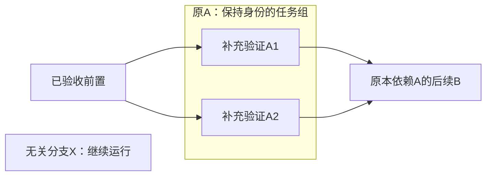
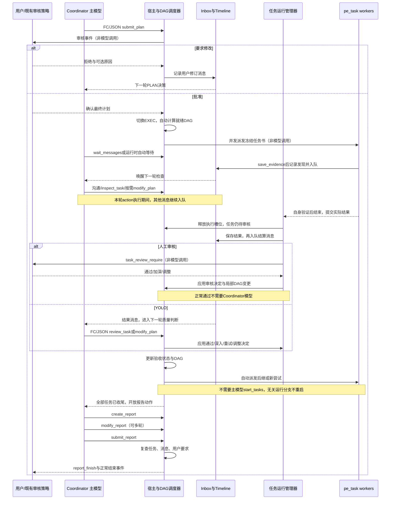

# Coordinator 第二阶段到结束任务书

> 状态：待实现的设计与验收要求，不代表当前功能已经完成。
>
> 配套文档：[第一阶段 PLAN 任务书](README.plan-phase.md)。本次第二阶段需求补充并修正此前的限制：进入 EXEC 后不回退 PLAN，但允许协调员根据执行事实修改当前任务与计划，不重新请求计划审批。
>
> 本文只要求实现新版 coordinator 的 EXEC、消息驱动、自动 DAG 调度、任务审核及报告收尾。复用现有公共设施与 Yakit/Memfit 契约，不恢复 legacy 运行体。实现后留在本地供 review，不擅自提交、push 或重启服务。

## 1. 角色与基本原则

系统仍只有 PLAN 与 EXEC 两个业务阶段，报告写作属于 EXEC 的收尾职责，不增加 REPORT 业务阶段或第三种 ReAct 循环。

- 协调员：沟通、处理关键消息、负责 YOLO 路径的质量判断、处理需要推理的调整与异常、编写最终报告；不是所有任务人工审核的必经关卡。
- DAG 调度器：决定哪些任务可执行、控制并发、自动派发、跟踪 worker 生命周期；不依赖模型逐项调用 start_tasks。
- pe_task：执行本次冻结任务书，使用业务工具，完成自身验证，保存 Evidence，提交实际结果。
- 任务运行管理器：负责该任务自身的审核生命周期；人工模式直接向用户发起审核并处理回复，YOLO 模式把判断交给协调员。这是既有任务生命周期的职责，不新增一种 ReAct 循环。
- 消息队列：保存执行期间的发现、结果、失败、用户消息和必要 review 提醒；协调员在安全边界集中处理。

自动派发不等于自动验收。任务业务执行结束后仍需要审核；只有通过审核的前置任务才能释放其后继。人工通过直接推进 DAG，不需要协调员再审一遍。YOLO 省去人工等待，把通过、继续深入或调整后续任务的判断交给协调员。

## 2. 从 submit_plan 到 EXEC

### 2.1 提交不是进入执行

`submit_plan` 锁定当前计划并通过既有审核事件提交。此时仍处于 PLAN，不能启动业务任务。

只有正常人工确认、用户编辑后确认，或既有审核策略明确自动同意，才能采用最终内容并切换 EXEC。普通/edited/detached 确认路径必须归一到一个批准与启动入口；重复确认不能启动第二组 worker。

批准顺序：校验确认端点和最终内容 → 保存批准事实与计划 → 原子切换 EXEC → 触发 DAG 调度。批准时的内容保存为 Timeline 历史事实，不恢复 Draft/Approved 两份可编辑计划。

### 2.2 用户不同意

审核明确要求调整时保持 PLAN，解除本次审核锁定，自动生成一条用户消息，例如：

> 用户认为当前方案有疏漏，请检查问题，修改或重新编写方案。用户说明：先补充失败路径验证，并说明任务依赖。

没有填写原因时，只保留明确拒绝及需要修订的要求，不编造原因。消息走原有用户输入 Timeline 与提升路径，同时唤醒协调员。优先使用已有审核回复的用户输入记录：已有同一条语义消息时补全/复用，不能重复追加两条拒绝消息。

明确区分拒绝修订、取消审核和整个运行被用户停止。用户关闭面板/停止运行不能被无限翻译成“继续规划”。旧卡回复或无效确认不能启动任务。

## 3. 无模型驱动的自动 DAG 调度

进入 EXEC 后，调度器立即扫描并派发全部满足条件的任务，遵守配置并发上限。模型无需 create_task、start_tasks 或逐项安排顺序。

可派发条件：

1. 运行处于 EXEC，未被停止或暂停派发。
2. 任务尚未执行，或已经明确获准进入新的尝试。
3. 所有前置叶任务已经审核通过。
4. 当前有空闲并发槽位。
5. 没有修改事务、取消退出或任务树调整阻止本任务启动。

以下变化都直接触发调度器推进，无需等待下一次主模型请求：

- 首次批准并进入 EXEC。
- 某任务审核通过，释放后继依赖。
- worker 退出，释放并发槽位，其他独立任务可以开始。
- 协调员调整任务/DAG，产生新的就绪任务。
- 协调员明确安排重试/继续执行。

派发操作需在调度状态锁下保证唯一性；实际 worker 构造和回调在适当边界进行，不在状态锁中调用模型、工具、用户审核或慢 I/O。恢复后不得重复派发已经实际完成或仍由当前运行拥有的尝试。

worker 派发材料：

- 当前 Plan Document 和无状态任务定义，以及必要的 DAG 上下文。
- 该叶任务的稳定 ID、名称、目标、约束、验收标准和本次 attempt_id。
- 直接前置任务的已验收结果及 Evidence/artifact 引用。
- 会话用户要求和 session Evidence，沿用既有 Timeline 上下文机制。

每次派发冻结本次任务书。后续修改当前 Plan 不在原 worker 背后悄悄替换它的输入；需要改变当前尝试时先停止并确认退出，再开始新尝试。任务组只组织叶任务，数组顺序不产生依赖，沿用当前 DAG 的组依赖展开语义。

## 4. 消息队列与通知

### 4.1 队列保存内容

至少支持下列结构化消息：

| 类型 | 来源 | 主协调员处理内容 |
| --- | --- | --- |
| task_discovery | worker 保存新的关键 Evidence | 判断是否需要调整、加深、复核或沟通 |
| task_settled | worker 实际退出，结果完成结算 | YOLO 进入协调员判断；人工路径由任务自身审核，已处理结果保留为事实，不强制二次主模型验收 |
| user_message | 用户补充、审核反馈、干预 | 更新要求，处理对应决策 |
| review_due | 明确到期且尚未处理的定时检查 | 检查长任务/阻塞/深度，不等于验收 |
| scheduler_blocked | 无可运行任务但仍有未解决任务 | 处理失败依赖或调度阻塞 |

每条任务消息携带消息 ID、协调实例 ID、task_id、attempt_id、类型、简短摘要及 Evidence/result/artifact 引用。消息顺序号用于队列消费与去重，不是 Plan Version，也不进入文档版本系统。

不复制完整计划或大结果到每条队列消息中。真实内容保存在共享 Timeline/Evidence 或任务结果存储，消息给出位置。队列可以引用已持久化的事件并保存必要消费位置，不创建第二份永久事实库。

### 4.2 发布顺序和生命周期

发现：确认 Evidence 保存成功且发生有效变化 → 持久化对应事件/引用 → 入队 → 通知等待方。

结算：worker 退出 → 完成必要 Timeline 交接与资源清理 → Controller 保存实际结果和终态 → 入队 → 唤醒协调员。初始化失败、panic、无结果、失败和取消都经过同一结算入口，不要求 worker 必须调用 submit_task_result 才有结束通知。

取消请求不等于实际退出。过期 attempt、关闭实例的回调不能推进当前任务状态；必要历史诊断留在 Timeline，不当成新尝试的结果。

重复 Evidence、token 流、普通工具数量变化不反复入队。不同的关键发现不能仅因同属一个任务就覆盖丢失。终态消息与用户消息不能因队列容量压力被静默淘汰；高频可合并的进度通知才允许合并。

消息到达不能在回调里直接启动另一轮主模型调用。主 Agent 同一时间只执行一轮决策，回调只保存信息和通知。

### 4.3 主循环正在执行 action 时

模型推理、工具调用、plan/task 修改、任务审核或报告写作期间到达的消息全部留在 inbox。不能中断当前工具，也不能同步执行另一个 review handler。

当前 action/batch 完成后，运行时在下一轮上下文边界批量交接消息，并恢复“刚才发生了什么”的检查。使用结构化批次与消费游标，不解析 prompt 来判定消息是否被模型看到。

批次进入上下文后可以推进投递游标，消息事实仍保留在 Timeline；这只是投递，不是业务处理完成。任务 awaiting_review、失败待决策等状态必须持续保留，直到真正处理，不能因为消息出队而自动验收或隐藏工作。

多条消息合并为一次检查。先处理用户控制、需要协调员决策的终态、需要调整的关键发现，再处理常规到期检查，避免高频发现饿死任务结算和用户指令。人工审核结果仍保存在队列/Timeline，但其正常通过和后继派发不等待协调员消费消息，不要求为每个已处理结果额外调用主模型。

## 5. wait_messages 与自动空闲等待

新增 `wait_messages` action，等待主协调员 inbox 的消息，默认 30 秒。参数只保留确有必要的等待超时设置；不把它变成等待某个任务的另一套调度接口。

- 调用时队列已有消息，立即交还本轮并安排下一轮处理。
- 队列为空时阻塞，消息、用户停止、上下文取消或等待超时可以解除阻塞。
- 等待超时不取消 worker，不判定任务失败，也不允许退出整个运行。
- 30 秒到期给运行时一次检查机会。有新的状态/消息或到期 review 需要判断，才恢复主模型；没有待处理工作则继续等待，不做无意义的空模型轮询。
- 正在调用 wait_messages 期间到达的消息仍必须先入队，再解除等待，避免丢信号。

运行时自动等待与该 action 共用同一实现。主 Agent 没有主动工作时自动进入 30 秒等待，不要求模型显式调用 wait_messages 才能挂起。

“有主动工作”包括未处理的关键消息、等待协调员判断的 YOLO 结果、用户请求、需要解决的失败/阻塞、到期检查或真实微观 TODO。人工任务正等待用户审核不等于协调员有必做工作；可以继续等待或处理其他事。不能只因还有 running worker 就强迫协调员不断发问，也不能把需要协调员决策的结果留在睡眠中不处理。

定时 review 由运行时产生一次明确的 review_due，合并同任务同尝试未处理提醒。时间到期只提供检查机会，不自动让任务通过，不每 30 秒重复插入同一大段 Evidence。定时器本身不调用辅助模型。

## 6. 任务审核与执行深度

任务业务执行和自身验证结束后，保存实际结果并进入 awaiting_review；释放执行并发槽位，但逻辑任务仍未通过验收。任务运行管理器负责继续该任务的审核流程，不由已退出 worker 的取消 context 承担后续人工等待。

人工路径：任务运行管理器 → `task_review_require` → 用户决定 → 公共审核处理/DAG 更新 → 自动派发后继。协调员模型不必调用 review_task，也不需要在用户通过后再次审查才能继续。

YOLO 路径：任务运行管理器 → 结果消息入队 → 协调员读取 Evidence、artifacts 与目标 → `review_task` 明确通过/深入/重试/调整 → 公共审核处理/DAG 更新。不要因为 YOLO 自动跳过了人工等待，就把浅结果或实际失败直接当成 accepted。

- 人工模式复用现有 selectors 和确认输入，允许用户提出更深入、不准确、调整等意见。能够直接解释的结构化决定由任务审核处理器应用；仅在反馈需要额外推理生成修订时，通知协调员处理，不把所有人工审核重新包成主模型请求。
- 两条路径共用结果校验、任务身份校验、修改事务和 DAG 推进代码，不复制两套验收状态机。
- 主模型 review_task 是 YOLO 判断及必要例外处理入口，不是每个任务人工审核的启动 action，也不能绕过已经明确选择的人工策略。
- 用户反馈同样进入 Timeline/消息链路，重复确认或旧 attempt 审核不能作用于新尝试。
- 人工审核等待不能占用执行槽位或阻塞其他独立任务、调度器及主循环。多个任务可分别等待自己的审核。
- 尚在执行时，发现和定时 review 可触发深入检查及干预，但不能把一个 running attempt 当成已经完成并验收。

审核后的处理：

| 结论 | 行为 |
| --- | --- |
| 通过 | 标记任务 accepted，调度器立即放行其就绪后继 |
| 深度不足/需进一步验证 | 保存缺口，局部拆分为验证叶任务或修正任务书，自动安排满足依赖的新尝试，不重启其他分支 |
| 执行失败但可修复 | 保留失败事实及原因，修正任务并明确重试 |
| 不准确或证据不足 | 不接受原结果，补充可验证的要求后继续执行 |
| 用户明确取消/确认无法完成 | 保留取消/失败事实和未完成目标，处理其后继影响 |

“避免 task 失败”是协调员发现问题后干预、修复并继续推进，不是把已经发生的错误覆盖成成功。可以让任务最终完成，但历史失败尝试必须留存。

审核时以 task_id + 当前 attempt_id 关联结果，不恢复 Plan Version 或 Seen。人工或 YOLO 任一路径通过后，后继自动启动；主模型无需再发 start_tasks，也不能成为人工通过后继续执行的额外门禁。

## 7. EXEC 中修改任务和计划

此处按本次最新要求：EXEC 不回退 PLAN，允许内部调整当前 Plan/任务，不重新弹出计划审核卡。原工具风险权限和用户明确约束仍由现有机制执行。

复用第一阶段的 `modify_plan(document/document_patch/tasks/tasks_patch)`，不新建 replan 循环或另一组文档动作。两阶段共用编辑和 DAG 校验代码，EXEC 增加对运行中任务及历史结果的保护。

单任务修改优先使用 tasks_patch 的 update；需要加深时可增补验证任务或拆分新的叶任务，仍遵守 DAG。正式任务由树定义产生并被自动调度，不再要求模型逐个 create_task。

### 7.1 局部拆分，不重启其他分支

任务 A 已结束但审核要求深入时，优先保留 A 的稳定身份，将其变为任务组，添加 A1/A2 等验证叶任务；原尝试和初步结果留在 Timeline，作为新任务的背景，不能直接算作 A 已通过。

- 子叶继承原 A 的必要前置条件、用户要求及相关结果/Evidence。
- 原来依赖 A 的后继仍引用 A；按现有组依赖语义，等待新叶任务全部审核通过。
- A 组的完成状态由新叶任务的验收结果聚合，不新增一次必需的协调员模型组审核。
- 尚未执行的后续任务也可以局部转为任务组，保留外部依赖身份并展开新的叶 DAG。
- 无关的 running 任务保持其 task_id、attempt_id、冻结输入和执行 context，不因拆分而取消、重新派发或重新验收。
- 原子提交修改后，调度器立即重算就绪集合；有有效前置和空闲槽位的新叶可以开始，不等待主模型再安排下一步。

修改仅涉及已停止的当前任务或未派发的后续任务时，不要求暂停整个 DAG。若变更确实影响正在执行的目标或其必要依赖，则对具体受影响范围走停止后重派发保护，不能把“局部修改不影响其他分支”理解为可以悄悄改写 running 输入。

### 7.2 公共修改规则

应用规则：

- 仅调整文档且未改变任务定义时，不重启未受影响 worker。
- 未派发任务可以直接调整，提交事务后调度器重新计算就绪关系。
- 未变化且未受依赖变化影响的任务保留状态及结果。
- 已运行任务需要修改输入/依赖或删除时，仅暂停对应受影响派发，取消相关 worker 并确认退出，再应用新定义及新尝试；不得为一个局部拆分全局取消其他 worker。
- 上游任务书/结论变化时计算受影响后继闭包，不能继续使用已经失效的验收结果；历史结果留在 Timeline，实时状态重新等待有效前置。
- worker 仍在运行时，不把其任务书悄悄替换成新内容；旧 attempt 的迟到回调不能污染新尝试。
- 修改失败原子回滚，不能部分删除任务或部分发布新 DAG。
- 全部修改与验收、派发竞争通过同一调度状态边界协调，避免验收刚放行后继却同时移除其前置。

不允许为了“可以执行中修改”而恢复旧的多版本草案/批准计划系统。保留现有 DAG 受影响关系算法，取消它与 plan_version、重新审批及 legacy replan 的耦合。

## 8. inspect_task 与结果查看

新增或收敛为按需 `inspect_task`，用于选择一个 task_id 查看其当前尝试、状态、等待原因、实际结果和 Evidence/artifact 引用。必要时允许明确指定历史 attempt；返回时标明它不是当前尝试。

默认返回有界状态与引用，明确要求详情时再给出对应结果。不能每轮自动复制全部任务结果或整份计划，也不能仅因 inspect 就标记审核通过。

这是本次明确允许的主动查询入口，不恢复过去靠 inspect 才能交接结果的流程。正常通知已经提供信息时，主协调员可以直接审核，不必先强制调用 inspect。查询也不证明模型理解了结果，不建立 Seen 或 AIRequest 反查机制。

PLAN STATUS 继续提供当前实时调度概览；完整事实使用 Timeline，inspect 只补充必要的主动查看。

## 9. 退出权限与收尾条件

EXEC 中主模型没有直接退出权。移除或屏蔽当前协调员 finish 的正常终止能力；空 action、directly_answer、wait 超时和工具输出结束也不能被视为整个任务完成。

系统仍必须响应用户停止、上下文取消、真实运行错误和配置的执行限制。这些属于中断/失败路径，不能伪装成正常完成，也不能因为“持续运行”忽略资源和超时控制。

调度没有进展但任务尚未解决时，保持运行并入队阻塞原因；主协调员修复、重试、调整或与用户沟通。不能将无 running worker 等同于全部完成。

报告可用门禁要求：

1. 当前任务图中没有未派发的必需任务、运行/取消退出中的尝试或待审核结果。
2. 所有要求完成的任务已审核通过，或其失败/取消/不再需要已被明确处理，相关 DAG 影响也已解决。
3. 没有未处理的关键用户指令、结果消息或需要任务调整的发现。

未解决失败、因失败阻塞的后继或仅“任务线程结束”不满足门禁。明确收尾的失败/取消必须在报告中记录未完成范围，不能产生虚假全成功报告。

正常运行只有在报告提交、上述门禁复查通过且没有新消息/用户要求需要处理时，由宿主自动结束。模型 submit_report 是提交报告，不是绕过门禁的 finish。

## 10. 报告写作动作

全部任务完成并满足收尾门禁后，在同一个 coordinator 内进入写作职责。创建及修改都在 artifacts 中保存实际文件，不新增写作 ReAct 循环。

| Action | 参数 | 行为 |
| --- | --- | --- |
| create_report | title、document | 创建 Markdown 报告草稿及确定的 artifacts 路径 |
| modify_report | document 或 document_patch | 覆盖或严格 patch 当前报告，互斥且原子写入 |
| submit_report | summary | 校验、发布当前报告，随后由宿主复查是否可正常结束 |

三个动作在门禁不成立前不声明可用，也在 handler 中再次检查。create_report 不重复创建已有草稿；modify_report 不修改其他 artifact 文件。patch 复用第一阶段严格 apply 机制和 patch artifact 记录。

报告包含：用户目标、实际任务与 DAG 调整、方法和证据、结果与验收、失败/重试/取消、未完成内容、限制和产物位置。结论必须与实际结果一致，不能将“尝试过”描述为“完成”。

提示词区分三个动作：

- create_report：先组织完整报告草稿，写入实际 artifacts，不宣称已经交付。
- modify_report：根据缺口继续编辑当前报告，不用新建报告来绕过修订。
- submit_report：确认事实、引用和未完成说明齐全后，发布最新已保存文件；只有系统允许才结束。

每次编辑后下一轮必须可以看到当前报告内容；大正文使用一个明确的当前报告视图或 artifact 读取，不重复塞进所有消息、feedback 和 Evidence。Timeline 保存写作操作、patch 引用和交付事实。

报告写作期间出现新的用户要求或任务变化，先保存草稿，重新检查并处理消息；需要执行的工作重新打开时，报告动作门禁关闭。不能提交旧草稿结束一个已经变化的任务。草稿保留供之后继续修订，不重新开始整套报告循环。

只有 submit_report 发布兼容的 report_finish（NodeId 保持 report-finish）、最终 report_path 和 summary_markdown。create/modify 可以发布现有 artifact 文件事件，但不能提前报告完成。

最后一次 submit 与正常结束之间必须再次核对 inbox、用户变化、任务状态，避免最后一个消息在提交期间到达却被丢弃。已提交、实际未正常结束的运行可以继续修订报告，不能重复制造结束事件。

## 11. Actions 收敛与复用

EXEC 模型动作围绕：

- `wait_messages`：可选的显式等待，运行时同时提供自动等待。
- `inspect_task`：按需主动查询，不是必需结果交接。
- `review_task`：YOLO 的协调员判断与必要例外处理；人工任务自行发起审核，正常通过不调用主模型动作。
- `modify_plan`：统一调整文档和任务树，内部不重复请求计划审批。
- `retry_task`/`cancel_tasks`：保留必要的明确重试和取消；调度器实际安排后续派发。
- `create_report/modify_report/submit_report`：收尾写作。
- 现有沟通、用户交互、save_evidence 和必要工具动作。

移除 EXEC 中的 create_plan/submit_plan、新建独立 task、模型必需的 start_tasks、按任务轮询的 wait_tasks 和一次性 write_report。正常模型 finish 不开放。内部调度方法可以保留，模型入口与内部方法不要混为一谈。

统一中文 schema/options 和 function-call 定义，复用主循环的协议选择、校验和 handler。每个 action 放在独立 action 文件与对应测试中；一个共享 DAG 调度器、一个共享 inbox，不写多个互相竞争的驱动循环。

## 12. Prompt、缓存和事件契约

- High Static 保持纯静态，阶段、进度、消息数量和动态角色不进入它。
- EXEC 指令通过 promptloader 加载，放在 SemiDynamic2；明确自动调度、消息检查、审核深度、调整权限和无主动退出权。
- 写作门禁打开时改变收尾角色指令，仍是 EXEC；工具集合只在真实能力边界改变，不因每条通知重建。
- SemiDynamic1 保留当前 Plan Document/Definition、共享 Evidence；计划真实改变时才更新对应内容。
- Timeline Open 保存用户信息、消息交接和调度/审核/编辑历史，冻结后沿既有机制提升。
- PLAN STATUS 提供实时任务状态、并发、阻塞和必要写作状态；不复制完整任务书或结果正文。
- 队列只交接新增消息批次，普通 wait 超时不追加 Evidence，不反复复制同一大结果。

继续兼容 start_plan_and_execution、plan、任务 push/pop、task_review_require、审核回复、artifact、report_finish 和 end_plan_and_execution。为新调度与消息内容做适配，不复制 legacy 的运行体和专注模式。人工审核由每个任务的运行管理器发起，YOLO 交给协调员质量判断；正常人工通过不经协调员模型二次门禁。

## 13. 关键时序

FC/JSON 标注的是模型动作；审核事件、队列通知、调度、worker 实际退出和根运行结束均为运行时行为，不调用额外辅助模型。worker 内部业务模型动作仍由 pe_task 执行，不在图中逐项展开。

## 14. 实施步骤与清理

1. 统一三种计划确认入口，补齐拒绝修订的用户消息；批准即自动触发调度。
2. 从模型 start_tasks 中抽出单一 DAG pump，挂到批准、槽位释放、验收、调整和重试入口。
3. 将现有生命周期通知连接到实际 inbox，先持久化后入队，再唤醒；保留取消和旧 attempt 保护。
4. 新增 wait_messages 及自动 30 秒空闲等待，接入定时 review 和消息批次上下文。
5. 将人工审核接入任务自身生命周期、YOLO 接入协调员 review_task；共用审核处理，接入 inspect_task、局部任务拆分及无版本 EXEC 修改。
6. 以收尾门禁控制报告三个动作和主循环退出；保留真实停止、错误和运行限制。
7. 清理被替代的 start/wait/write_report/finish 模型流程、重复通知/结果存储、提示词和测试。

每步都应保持能 review，不一次性重写通用任务/协议/Evidence 基础设施。现有第一阶段实现只做必要衔接，不借此次任务重写其 action 契约。

## 15. 冒烟与回归验收

[coordinator.yak](../../aismoking/coordinator.yak) 使用真实 Yak/aim、coordinator、workers、Evidence 和前端事件，直接执行 `yak common/ai/aismoking/coordinator.yak`。确定性 HTTP/SSE 模型、审核回复、材料和断言都在 Yak 脚本内；双协议通知由 [notifications.yak](../../aismoking/notifications.yak) 验证，拒绝/重试/取消由 [controls.yak](../../aismoking/controls.yak) 验证。细粒度屏障、权限、恢复和状态机另保留普通 Go 集成回归。

核心 DAG：A、B 独立并发，C 依赖 A，D 依赖 B/C。通过屏障检查任务启动、结束、验收及并发上限，模型脚本从不调用 start_tasks/create_task。

必须覆盖：

- 提交但未批准时 worker=0；拒绝产生一条用户修订消息，原因保留且不重复。
- 普通确认、编辑后确认、detached 确认都会自动启动；旧/重复确认不重复派发。
- A 结束但未验收时 C 不启动；A 验收通过后 C 自动启动，不再调用主模型安排它。
- 人工任务在业务执行结束后自行发起 task_review；让协调员模型停在无关工作/等待中，用户通过后后继仍立即启动，无二次主模型审核。
- 人工 task_review 能加深/拒绝，YOLO 无人工等待但仍由协调员判断结果质量；两条路径都不允许旧 attempt 或重复审核推进新尝试。
- 人工审核期间释放执行槽位，其他独立任务能继续派发与完成。
- worker 中途发现唤醒主循环；action 正在运行时到达多条消息，下一轮一次交接，不并发调用主模型。
- 明确失败、panic、初始化失败、取消退出、过期 attempt 回调、重试的新 attempt。
- EXEC 修改未开始任务、拆分验证任务、处理受影响闭包及运行中任务；不弹 plan_review，不污染原 worker 的冻结输入。
- A 审核后转成 A1/A2 任务组；新叶满足条件即自动启动，原后继等待全部新叶验收，无额外主模型组审核。
- 拆分尚未派发的后续任务，外部依赖引用仍有效；无关 running 分支保持相同 task/attempt/context，取消及重派发计数为0。
- 任务/依赖失败导致阻塞时，不能进入报告或静默完成。
- 显式 wait_messages 和不调用 wait 的自动等待；测试可注入时间推进，不必实际等待多轮30秒。
- 空等待不轮询模型；review_due 只触发必要检查，重复通知不产生请求风暴。
- 未全部收尾时报告动作拒绝；全部收尾后 create/modify/patch/submit 实际写入 artifacts。
- 报告只在 submit 发布 report_finish；提交期间新消息/用户要求阻止错误退出。
- 主模型 finish/空回答不能提前结束；用户停止及时取消 owned workers，正常结束事件只发送一次。
- 第一阶段旧格式计划、预设/mocker、前端任务树、人工/YOLO 确认、持久化与恢复没有回归。

输出实际时序、主要消息批次、两种协议 prompt 样本、任务启动计数与主/worker模型调用数。分别说明真实运行时行为与脚本化模型决策；稳定前缀字节比例不冒充供应商缓存命中率。

## 16. 实现前需要确认的解释

以下是为使系统可实现而明确的语义，用户 review 时重点核对：

1. EXEC 可修改当前计划，但不回退 PLAN、不重新进行计划审核；原用户约束和工具权限继续有效。
2. “任务完成”包含审核及失败/取消的明确处理，不仅是 worker 线程结束；未解决依赖不能开始报告。
3. 主模型不能正常退出，宿主在报告提交后依据真实收尾状态退出；用户停止和运行限制仍然有效。
4. 空闲每30秒给一次检查机会，不要求每次都调用主模型；只有必要消息/定时 review 才恢复决策。
5. report submit 默认是交付与宿主收尾，不额外新增用户报告审核卡；若需要报告人工审核，应另行确定，不能暗中加入。
6. 人工审核属于各任务生命周期，正常通过不依赖协调员模型；YOLO 的验收判断交给协调员。
7. 已结束任务和未派发后续任务可以局部拆分；调度器自动执行新就绪叶，其他正在执行的分支保持运行。

完成后提交本地 diff、实际测试结果、烟测时序与上述解释的实现情况，等待用户 review。
