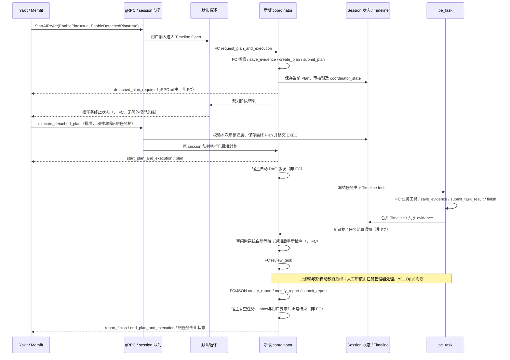

# Coordinator：PLAN 的协调运行体

`coordinator` 是新的 PLAN 引擎和专注模式。它负责探索、计划文档、用户审批、任务调度、等待、验收、重试和报告；`pe_task` 执行批准的任务书。新引擎只有这两种 ReAct 循环，沿用主循环的协议配置：文本流 JSON action 或原生 `tool_calls`。提示词按当前模式选择对应的中文指令及参数定义；不会回退到旧 PLAN/replan/task-review/report 循环。

这个目录独立拥有 [Session](session.go)、计划树与 DAG、控制对象、模型 actions、worker、工具权限、原生辅助调用，以及 [Yakit 事件和存储适配](session_events.go)。结构化辅助请求复用独立 LiteForge 执行器。

最上层 [coordinator.go](../aireact/coordinator.go) 统一进入此引擎；公共基础设施由 aicommon、reactloops、Timeline、事件封套和数据库表提供。父级 `aid` 只保留公共接口。

Forge、Yak、审核事件、恢复与双协议边界见 [接口契约](../coordinator_interface_contract.md)。

Forge 使用 [ForgeExecution](../../aiforge/forge_execution.go) 包装本次 Session；计划、审核、DAG 和 worker 仍由此目录负责。结果模板读取 [ContextSnapshot](context_snapshot.go)，不接入旧 provider 回调。任务全部验收、消息处理完成后，[ResultDelivery](delivery.go) 保存业务结果及确定性的执行证明，再通过完成门禁；不额外调用模型生成通用报告。独立入口和父 ReAct Blueprint 入口复用同一机制，协议由 `EnableFunctionCallMode` 决定。独立冒烟可运行 `yak common/ai/aismoking/forge.yak`。

## 第一阶段 PLAN

内部仅保存一份当前 `Plan` 和 `Phase = PLAN | EXEC`。PLAN 负责调查、文档、无状态任务定义与派生 DAG；只有 `create_plan / modify_plan / submit_plan` 三个计划动作。提交锁定内容，用户要求调整则恢复编辑，批准最终内容后保存批准历史并进入自动 EXEC。EXEC 复用 modify_plan 调整当前任务图，不回退 PLAN、不再次审批。

`modify_plan` 只有四个可选业务参数：`document / document_patch / tasks / tasks_patch`。同组件覆盖与 patch 互斥，至少提供一个。文档与任务树在副本上一次校验并提交；失败完全回滚，严格 diff 不使用 fuzz 或 shell。patch 目标只能是 `plan_document.md`，产物保存在工作区 `artifacts/coordinator-<实例ID>/plan-patches`，失败也可 review。任务 patch 按稳定 `task_id` 有序增删改，语义依赖必须在同批修正。

两种协议的 action 参数都允许附带额外字段；业务校验及组件编辑只读取已声明参数。`human_readable_thought`、`todo_delta` 等公共字段保留给主循环处理，不因业务 action 不声明它们而失败。必填字段、已声明字段的类型、任务身份、DAG 和事务互斥规则仍必须满足；额外字段不能替代必填字段或作为实际编辑内容。

`WithEnableSubagentsInPlan(true)` 显式开启只读调查，默认关闭。配置复制保留此开关，但通用 `EnableDispatchSubReactAgents` 仍不自动继承。调查复用 generic 子 Agent 管理器和结果通道；运行时权限阻止计划编辑、命令、写入、专注循环和递归派发。明确共享的 Evidence 与完成清理通知可唤醒协调员，私有 Timeline 不合并。所有调查实际退出且结果已经交接后才能审核。

持久化格式是 schema 2，保存 phase、plan、review_pending、当前/历史尝试、inbox 游标及当前报告。schema 1 的旧双计划读取集中在 `snapshot_compat.go`；旧记录有一份可确定计划时转换，有执行中的替换草案则明确拒绝。`Revision` 只为状态发布顺序服务，模型没有计划版本或 edit revision。

[第一阶段实际上下文、样本和验收](context_review.md)；新增 [Yak/aim 脚本](../../aismoking/planning.yak) 覆盖调查、preset、mocker × 双协议 × 探索开关，共 12 个组合。

## EXEC 自动调度、审核和报告

[scheduler.go](scheduler.go) 在批准、实际退出释放槽位、审核通过、修改事务和明确重试后自动推进 DAG。模型不再拥有 start_tasks / wait_tasks / write_report，EXEC 也不开放正常 finish。每次 pe_task 派发冻结当前 Plan、任务身份和已验收的直接前置结果；局部拆分仅停止受影响后继闭包，无关 running 分支保持原 attempt 与上下文。

[task_review.go](task_review.go) 在 worker 实际退出后管理人工审核，使用 Session context 和既有 task_review_require。用户通过直接释放 DAG；YOLO 才由协调员依据实际结果调用 review_task。历史失败、拒绝、取消和初步结果保留，不将线程退出当成验收。

原有 `ai / ai-auto / auto` 审阅偏好也走协调员质量判断，不被改成人工任务等待、不新增辅助 task-review 模型；工具风险审阅仍继承原配置。

[inbox.go](inbox.go) 持久化新增消息与投递/处理游标。回调只记录事实、入队和通知，不调用主模型。下一 prompt 边界批量交接，投递不代表验收；action 期间收到的消息留给下一轮。终态、用户消息和不同发现不被容量淘汰。结果正文沿原有 Timeline Evidence 保存，队列只带有界摘要和引用。

无可执行工作时运行时自动等待，未完成微观 TODO 仍阻止结束，但不阻止消息确认或睡眠。`wait_messages` 请求在整批动作结束后等待，前后顺序不掩盖本轮实际验收；工具结果仍交给下一轮处理。确认仅覆盖本轮 prompt 的消息，普通读取不会解决用户变更或验收任务；对应任务实际验收后旧结算通知收口，事实仍在 Timeline。晚到消息保留到下一轮。

普通 Evidence 发现与 review_due 从首条通知开始最多合并5秒，后续通知不延长截止时间。用户要求、失败和可验收结果提前放行，并携带整个已积累批次。空等待默认30秒检查运行时，不取消 worker、不调用模型、不生成新的 Evidence；已投递的普通旧通知不触发重复等待返回。人工正常通过推进 DAG，无需主模型二次检查。通知与处理回归见 [decision_boundary_test.go](decision_boundary_test.go) 和 [wait_convergence_test.go](wait_convergence_test.go)，覆盖双协议及同轮 wait/验收两种排列。

[report.go](report.go) 管理唯一当前 artifacts 草稿，create_report / modify_report 保存文件，submit_report 才发布 report_finish。计划、任务、关键消息和用户要求共同控制写作门禁；提交与宿主结束分别复查。草稿基于写作开始时的消息基准，新要求到达后需修订。报告写作仍属 EXEC，没有第三循环。

High Static 不变。PLAN DOCUMENT/DEFINITION、共享 Evidence 和 CURRENT REPORT 位于 SemiDynamic1；中文执行/写作角色从 promptloader 进入 SemiDynamic2。动态 PLAN STATUS 仅保存状态、消息和写作概览。观察批次走 Timeline Open，冻结后沿原有提升机制保留。

[execution_phase.yak](../../aismoking/coordinator.yak) 通过真实 Yak/aim 跑 A/B独立、C依赖A、D依赖B/C，覆盖 function call/text stream × 人工/YOLO。脚本化的是模型决策与用户回复，调度、worker、只读工具、Evidence、审核和 artifacts 写入均由实际运行时执行。快速通知屏障测试保留在 [task_notifications.yak](../../aismoking/notifications.yak)。

~~~powershell
go test ./common/ai/aid/coordinator -count=1
go test ./common/ai/aid/coordinator -run '^TestCoordinatorYakExecutionPhaseMatrix$' -count=1 -v
go test -race ./common/ai/aid/coordinator -run '^TestExecution|^TestCoordinatorYakExecutionPhaseMatrix$' -count=1
~~~

## 启用与替换

gRPC 设置 `EnablePlan=true` 即可开放新版 PLAN，无需手动选择专注模式，也不修改 protobuf 或前端。未指定 focus 时，默认循环接收用户输入，调用 `request_plan_and_execution` 后直接交给新版 Session；不再经过旧 `plan` 循环生成计划。显式 `coordinator` 直接进入新版；客户端缓存的 `plan` / `coordinator_legacy` 名称在最外层升级为新版。旧专注模式不再出现在公开列表。`EnablePlan` 表示允许规划，具体是否需要计划仍由默认循环根据用户请求决定。

客户端新建会话可能重置 `EnablePlan=false`。这时普通默认循环不会获得 PLAN 请求动作；prompt 中写“PLAN”不会覆盖能力开关。`EnableDetachedPlan=true` 只选择审核方式，不能替代 `EnablePlan`。不要把“开启 Plan 能力”和“手动选择 coordinator 专注模式”混为一项设置。

```go
// 显式构造新运行体；AIRuntimeInvokerGetter 由 aireact 注册。
c, err := coordinator.NewSession(ctx, query, options...)
if err != nil { return err }
return c.Run()
```

```yak
err = aim.InvokeReAct(
    "读取目录，规划并执行两个有依赖的验证任务，逐项验收后写报告。",
    aim.focus("coordinator"),
    aim.maxIteration(30),
    aim.reviewPolicy("yolo"),
)
die(err)
```

`aim.planEngine("coordinator")` 保留为 focus 的入口别名；旧 focus 别名现在也升级为新版，不再启用旧运行体。两个循环继承会话的 `EnableFunctionCallMode`，不因开启 PLAN 覆盖主循环协议。`EnablePlan=false` 禁止从该 focus 开启 PLAN。工具的原有人工/AI/YOLO 策略继续生效，AI 风险评估使用一次原生 `review_risk` 调用。LiteForge 辅助请求默认文本流；Timeline 压缩等直接使用结构化调度的请求按各自协议配置执行，不新增 ReAct 角色。

`plan_engine` 只保留在持久化协议中，与 `coordinator_state` 一起校验恢复数据。旧记录可供查看，但批准或恢复会返回明确的停用错误，需要重新生成新版计划；不隐式导入新调度器。

## 默认 gRPC 入口与 detached 时序

会话执行统一使用 `StartAIReAct`。旧 `StartAITask`、`StartAITriage` 保留 protobuf 方法签名，调用时立即返回 `codes.Unimplemented`，提示改用 `StartAIReAct`；不等待首条消息，不创建执行运行体。

`EnableDetachedPlan` 是审核生命周期设置，不是引擎选择开关。开启时先保存草案和 coordinator 快照，使用现有 `detached_plan_require` 面板审核；收到 `execute_detached_plan` 后，执行任务排入原 session 队列，使用批准后的任务树继续新版执行。关闭时，同一个 coordinator 使用 `plan_review_require` 等待交互回复，然后继续执行。

批准后的首次执行显示为“执行已批准计划”。内部复用 Recovery 类型来跳过重复规划，不代表发生了崩溃恢复；真正的中断恢复才显示“恢复执行计划”。这些内部任务的描述不追加为用户输入，嵌套协调员也不重复记录父会话已经接收的输入。

确认链路用同一 `SyncID` 关联 gRPC 的 `approval received` 与后台的 `approval queued` / `approval rejected` 日志。入队失败或校验失败同时返回同步错误和普通错误事件，兼容先关闭审核卡、未展示同步错误的客户端。收到 `started=true` 只证明入队成功；任务完成仍应以执行和终止事件为准。

`PlanNode` 必须保留审核组件所需的 `description: ""` 和 `tools: []`（不能省略或返回 null）。当前客户端挂载任务卡时会填充它们；缺少默认值会把未编辑计划误判为编辑，并走只带首个子任务的提交分支。gRPC 回归测试包含这个前端转换过程，不能只测试 `{coordinator_id}` 的直接确认。

规划尚未退出时，现有客户端先取消规划根任务，等待其终止状态，再提交批准。取消由外层队列处理并通过 context 传递给协调员，不能把根任务 ID 再交给子协调员取消。显式取消保留 `skipped` 和取消回执，不额外发送 `fail_react`，避免正常审核交接显示为红色失败卡。



默认循环只负责接收和转交请求，不是第三种 PLAN 内部角色；PLAN 内部仍只有 coordinator 与 pe_task。

默认循环原有的蓝图能力仍走独立的 `ExecuteForgeFromDB` 执行器，不经过新版 PLAN 的协调循环；coordinator / pe_task 不开放蓝图动作。外层保留 `HijackPERequest` 执行回调和既有开始/结束事件，用于集成方接管执行，不为回调构造任一规划引擎。

前端允许在规划尚未结束时点击确认：先发送 `react_cancel_task`，等根任务的 `skipped/completed/aborted`，再发送 `execute_detached_plan`。取消的只是当前规划任务上下文，批准后的恢复任务使用 session 上下文。必须保持根任务 ID 和父会话 CoordinatorId 的归属，不能把根终止事件归到子任务频道。

上述隔离不覆盖整个 session runtime 被关闭的情形。现有 `SetCurrentProject` 会退出当前 runtime 并关闭其流，即便客户端重新设置的是同一个项目；这类 EOF 需要与服务进程崩溃、单个规划任务结束分别诊断。

配置在 session 建立时解析：`PreferSessionCachedConfig` 控制是否合并缓存设置，然后应用引擎和协议约束。默认 Plan 的函数调用模式、新版引擎、DAG 依赖和批准门禁属于代码约束，不靠模型“偏好”。全局 `AIPlanPrompt` 与 `UserPlanPrompt` 属于规划偏好，只注入规划阶段协调员的 SemiDynamic2；worker 接收批准的任务书和共享上下文，不继承这份规划角色提示。

detached 不等于清空上下文，也不承诺自动提高缓存命中率。session Timeline 和 evidence 延续，批准的 Plan Document 进入 SemiDynamic1，最新状态在 `Timeline Open -> PLAN STATUS -> TODO` 展示。稳定部分留在前缀、变化部分放在末尾，有利于缓存；实际命中率仍需读取模型用量。

## 模型 actions

每个专属 action 注册两套中文定义：`Options/Description` 供主循环构建文本流 JSON Schema，`NativeOptions/NativeDescription` 供主循环构建 function call。两套使用相同参数语义与校验、执行处理。文本模式使用 `@action` 和声明的 AITAG；原生模式使用函数名和 `arguments`，不混用协议。JSON 还用于事件 Content 和存储。

`aicommon.WithEnableFunctionCallMode(false)` 选择文本流，`true` 选择原生调用；Session、嵌套 coordinator、worker 以及 gRPC 的 EnablePlan 转换不强制覆盖该配置。原生风险评估和单步辅助输出仍使用自己的独立函数调用契约。

主循环、coordinator、worker、子 Agent、原生风险评估及显式原生 LiteForge 的内部请求统一使用 `tool_choice: "auto"`。是否使用 Function call 由协议配置决定，与 `auto` 无关；原生模式只接纳声明的函数与合法 arguments，纯文本或缺少调用的响应仍走重试纠正。子 Agent 继承父协议；默认文本流的验证和 LiteForge 辅助请求不会改变其决策循环的协议。

| Action | 参数 | 作用 |
| --- | --- | --- |
| `create_plan` | `plan`, `plan_document` | PLAN 首次创建完整文档和任务树，返回小型回执；不执行 |
| `modify_plan` | `document`, `document_patch`, `tasks`, `tasks_patch` | PLAN/EXEC 原子编辑；EXEC 仅停止受影响尝试，无再次审批 |
| `submit_plan` | 无业务参数 | PLAN 锁定并提交审核；批准最终内容后移交 EXEC |
| `wait_messages` | `timeout_seconds` 可省略 | 本轮动作后等待；默认30、最多60秒检查运行时，普通发现最多合并5秒，空超时不轮询模型 |
| `inspect_task` | `task_id`, `attempt_id` 可省略, `details` 可省略 | 按需查看当前或历史尝试，默认有界状态与引用 |
| `review_task` | `task_id`, `attempt_id`, `decision`, `reason` | YOLO 对已结算结果接受/拒绝/深入/取消，不绕过人工策略 |
| `retry_task` | `task_id`, `attempt_id`, `reason` | 重试已结算的当前尝试，撤销下游旧结果；受影响 worker 必须先退出 |
| `cancel_tasks` | `task_ids` 可省略，`reason` | 请求停止；运行中的任务先进入 `cancelling`，退出后才是 `cancelled` |
| `create_report` | `title`, `document` | 收尾门禁通过后创建实例独立 Markdown artifact |
| `modify_report` | `document` 或 `document_patch` | 修改当前报告；严格 diff，当前正文位于 SemiDynamic1 |
| `submit_report` | `summary` | 发布 report_finish；宿主复查真实状态后结束 |
| `directly_answer` | 既有协议对应的答案参数 | 发布进展/答案，继续协调循环 |
| `finish` | 既有参数 | 仅 PLAN-only 适配保留；完整 EXEC 不开放正常退出 |

继续复用 `save_evidence`、`adjust_todolist`、`ask_for_clarification`、工具加载/调用、知识及技能检索 actions。不存在任意改状态的 `update_plan_status`：状态来自执行、观察、验收和取消的真实结果。

`create_plan` 和 `modify_plan` 的两套参数定义均沿用旧版嵌套任务书字段。任务组组织叶任务，实际调度仍是叶任务 DAG：

```json
{
  "main_task": "验证方案",
  "main_task_goal": "确认两个步骤的结果",
  "tasks": [
    {"subtask_name": "验证来源", "subtask_goal": "读取来源并保存 evidence", "subtask_identifier": "source", "depends_on": []},
    {"subtask_name": "验证结论", "subtask_goal": "依据来源检查结论", "subtask_identifier": "conclusion", "depends_on": ["source"]}
  ]
}
```

子节点放在 `sub_subtasks`，语义标识保持稳定且唯一，`depends_on` 引用这些标识。依赖一个组时等待该组全部叶任务验收；组自身的前置条件只传播到组内入口叶任务，沿用旧版 DAG 语义。列表顺序不产生隐含依赖。宿主分配稳定 `task_id`，拒绝重复标识、未知依赖和环。已有平面 `name/goal/identifier` 参数作为别名继续可用。客户端编辑及恢复仍接受原有嵌套 `root_task`，Yakit 任务树事件结构不变。修改可以覆盖完整定义或按稳定 ID 批量 patch；显示 index 不作为编辑身份。

新版提供自己的预设计划及 mocker 入口，不构造旧版运行体：

```go
// JSON 可以使用上面的旧版任务书字段，或现有 root_task/PlanNode。
option := coordinator.WithPresetPlan(planJSON, markdownDocument)
// 程序构造任务树；回调只生成草案，审批和执行仍走新版同一套门禁。
option = coordinator.WithPlanMocker(func(s *coordinator.Session) *coordinator.PlanResponse {
    return &coordinator.PlanResponse{RootTask: root, Document: markdownDocument}
})
c, err := coordinator.NewSession(ctx, query, option)
if err != nil { return err }
return c.Run()
```

预设草案进入上下文后，协调员通过 `submit_plan` 核对并提交；不能绕过用户批准。恢复已有草案时不重复调用 mocker。这里提供的是新版 Go 接口，旧版回调的类型不能直接混用；Forge 迁移另行处理。

## 任务与结果

```text
pending -> running -> awaiting_review -> accepted
                      └──────────────> rejected
           └────────> failed
running -> cancelling -> cancelled
settled -> retry -> running（新的 attempt_id）
```

worker 的 `submit_task_result(summary, artifacts?, evidence_ids?)` 提交结果，随后 `finish` 经过原有微观 TODO 门闩。实际退出释放执行槽位，但 awaiting_review 不放行依赖。人工审核由任务管理器自行发起，用户通过直接推进 DAG；YOLO 由协调员 review_task 判断证据质量。

任务书在每次派发时冻结。EXEC 可修改当前计划，无关 worker 不变；改变已派发目标或必要依赖时先确认受影响尝试实际退出。重试校验下游退出及依赖，撤销受影响旧验收，并以新 attempt 保存全部历史事实。恢复不暗中重启 running worker，先转为 failed 并通知决策。

`wait_messages` 与运行时自动等待复用同一消息链路。投递游标不等于业务处理，消息批次进入 Timeline 后状态仍保持待审核/失败，直到实际决策。正常人工通过无需主模型二次验收。

`user_intervention` 由会话宿主写入共享 Timeline 后通知协调员，不重复转交 worker 记录。普通 `FreeInput` 保持外层队列语义。完整 EXEC 必须提交最新报告后由宿主复查收尾；用户停止及真实错误仍中断运行。旧 `CoordinatorOption` / `ResultHandler` 只属于旧版。

## 工具边界与上下文

协调员只开放显式内置读取/目录/搜索工具；`write_file` 限制在工作目录 `artifacts` 下的 `.md` 文件，检查路径穿越和已有父目录的符号链接。未知工具、MCP 命令包装器、脚本执行和业务修改交给 worker。worker 继承原有工具审阅策略，但不能开启其他专注循环、蓝图、PLAN 或通用 sub-agent。

用户输入、澄清回答、选项和用户重做说明进入 session Timeline，经过 Open 的冻结/压缩提升；纯动态区域不重新附加 USER QUERY。任务派发书也记录在 Timeline，worker 使用既有 fork/merge。`save_evidence` 复用 session journal，所有 tasks 与协调员共享、去重并沿现有机制提升。

```text
High static：现有纯静态系统指令
Frozen：工具目录、固定分区、普通冻结 Timeline 历史
SemiDynamic1：工作区 / 提升后的用户信息 / session evidence / PLAN DOCUMENT / PLAN DEFINITION
SemiDynamic2：执行策略 / 中文 INSTRUCTION / 技能材料 / 当前协议的 action 参数定义
Timeline Open：近期事件 -> PLAN STATUS -> 微观 TODO
Dynamic：当前时间 / 自动观测上下文 / 本轮反馈 / 检索记忆等
```

PLAN DOCUMENT 和 PLAN DEFINITION 分别展示唯一当前正文与无状态任务树/叶 DAG，仅实际内容变化时更新各自分区。PLAN STATUS 在 PLAN 只展示阶段、是否已有计划、审核锁及必要调查状态；EXEC 沿用任务、尝试和依赖状态。详细实际样本、字段和工具边界见 [上下文 review](context_review.md)。

计划动作回执不复制文档和任务书。任务状态结算由 Controller 自动保存到 session Timeline Evidence；等待回执仅引用已有观测。Controller、存储和前端全量树保留原契约。缓存回归比较两种协议投影后的稳定 messages 和 tools；这不是 provider 的真实缓存命中率。

中文职责指令与 mainloop 一样通过 `promptloader.MustLoad` 加载；资源位于 `ai/aid/coordinator/planning.txt`、`instruction.txt`、`planning_only.txt`、`worker_instruction.txt`。不在纯静态 High Static 中添加条件或协调员专属变量。

## Yakit 与旧接口

| 通道 | 适配规则 |
| --- | --- |
| 启动/结束 | 保留 `start_plan_and_execution` / `end_plan_and_execution` 和 `coordinator_id`, `re-act_id`, `re-act_task`；外层 ReAct 终态仍由原入口发送 |
| 普通审批 | `plan_review_require` / `review-require`，保持 `id`, `selectors`, `plans.root_task`, `plans_id`，由现有端点释放 |
| Detached | `detached_plan_require` / `detached-plan`；提交后不会启动 worker；`execute_detached_plan` 接收并校验用户编辑树，再入会话恢复队列 |
| 任务卡 | 相同逻辑 task ID 只 push 一次；已关闭任务重做通过外层路由的 `react_task_status_changed` 重新显示处理状态；验收或取消结束时 pop |
| 任务状态 | `running/awaiting_review/cancelling` 映射 processing；`accepted` 映射 completed；`failed/rejected` 映射 aborted；`cancelled` 映射 skipped |
| 控制输入 | 保留 `plan`, `skip_subtask_in_plan`, `redo_subtask_in_plan`、原 SyncID 和返回格式；skip 在实际退出后回执；UI 重做只接受已完成任务，说明进入 Timeline |
| 恢复/历史 | 保留 `recovery_plan_and_exec` 请求及 `recover_plan_and_exec` 回复拼写；`task_tree/task_progress` 仍是 JSON 字符串 |
| 展示/观测 | 沿用 stream、status、能力、消耗、prompt profile、session snapshot、artifact 和 `report_finish` 通道 |

旧 `task_review_require` 面板的自动 continue 不是新的业务验收；新协调员通过 `review_task` 作出验收，利用已有 stream 展示理由。整个新流程不要求修改 Yakit。

用户对同一版计划只确认一次。普通 `continue` 和编辑器的 `freedom-review` + `reviewed-task-tree` 都直接采用合法的批准结果，随后协调员自动调度、验收并结束。审核期间及 EXEC 的重复 `submit_plan` 被拒绝，不弹出新审核或重置任务；用户要求修订后留在 PLAN，可修改再审核。编辑树里的 `isRemove` 会移除相应子树；已删除的依赖引用必须修正，不能默默执行原计划。Detached 的确认仍使用 `execute_detached_plan`，接入队列后直接执行批准树。

更多字段与依据见 [接口契约](../coordinator_interface_contract.md)，组件关系见 [架构文档](../coordinator_architecture.md)。

两个循环之外的辅助模型请求、实测开销和后续统一治理问题见 [TODO](TODO.md)。

## 测试与 Yak 冒烟

```powershell
go test ./common/ai/aid/coordinator -count=1
go test ./common/ai/aid/aireact -run 'TestCoordinator|TestPublishDetachedPlan|TestHandleSyncTypeExecuteDetachedPlanEvent|TestReAct_RecoveryPlanAndExec' -count=1
go test ./common/yakgrpc -run '^TestStartAIReActDetachedApprovalExecutesAndKeepsStreamOpen' -count=1
```

[coordinator.yak](../../aismoking/coordinator.yak) 在本地直接以 `yak common/ai/aismoking/coordinator.yak` 执行，调用 `aim.InvokeReAct`，覆盖原生/文本协议与人工/YOLO 策略四种组合。模型 provider 使用确定性 HTTP/SSE 响应；协调员、worker、审批、Timeline、报告和 Yakit 事件适配均运行实际代码。脚本核对真实文件读取、四个 DAG 任务、共享 Evidence、逐项验收、push/pop、报告文件及两种 loop_marker。统一入口为 [AI 冒烟测试](../../aismoking/README.md)，仅供本地开发，不进入 CI。另有普通 Go 集成测试覆盖 detached 提交、编辑、恢复、执行及通知时序。

[审核到执行测试](../aireact/coordinator_approval_execution_test.go) 通过真实输入事件和任务队列覆盖普通确认、编辑后提交、detached 确认、detached 编辑，以及 Yakit 先停止规划再提交执行的路径；每条路径只提供一次用户确认，验证两个依赖任务全部验收、事件闭合及完成状态持久化。Yak 冒烟也使用人工审批策略，由事件回调发送这一次确认。

[通道测试](../aireact/coordinator_channels_test.go) 拦截旧构造器，验证新版规划、人工审核编辑、detached 发布及恢复均不调用它；反向选择旧通道时不注入新版辅助执行器。恢复以存储归属为准，未知快照格式或旧引擎标记与新快照冲突会报错。新包的生产依赖图不包含父级 `aid` 或 `aiforge`。

[live/coordinator.yak](../../aismoking/live/coordinator.yak) 可使用本机配置的实际 provider/model 执行；凭据由外部配置，不写入脚本。确定性冒烟不衡量模型任务质量或真实 provider 的缓存命中率。

[规划提交冒烟](planning_submission_smoke_test.go) 对探索生成、预设计划和 mocker 各跑文本流与原生两种协议，共六个组合。探索实际执行 `read_file → save_evidence → create_plan → submit_plan`；预设/mocker 直接 `submit_plan`，不额外生成计划。所有组合通过真实交互事件确认一次，验证完整嵌套 DAG、Evidence/用户输入提升、上下文分区及未派发 worker。设置 `COORDINATOR_CONTEXT_REVIEW_DIR` 后，在其 `planning-submission` 子目录生成四份提交前完整 prompt 和对应 request JSON；预设样本代表已独立验证的两个附带计划入口。详情见 [上下文 review](context_review.md)。

新增 actions 应放在此包，状态变化通过 Controller，外部渠道通过 Host。不在 worker 中暗中恢复旧 review/replan 循环，也不新增第三种 ReAct 角色。

每个计划动作独立放在 `action_xxx.go`，配同名测试；`actions.go` 集中注册、双协议定义和参数校验。答复/finish 适配及 worker 的结果提交也有独立文件。动作观测通过 `action_outcome.go` 写入 session Timeline Evidence，Open 冻结后提升到 SemiDynamic1；feedback 只提供记录 ID。每个任务尝试独立保存完整结果，验收结论单独保留，wait 只引用已有观测，重复查询不重复写日志。计划与报告正文继续使用原有稳定分区和 artifacts，不复制到动作记录。

`TestCoordinatorAction*` 逐项检查原子编辑、审核锁定和审批幂等、依赖放行、先观察后验收、取消实际退出、结果提交与 finish/TODO 门闩；`TestCoordinatorActionOutcomeLifecycle` 验证冻结提升、跨任务结果保留和 Timeline 恢复。现有两种协议的探索/预设/mocker、完整任务执行、Yak + aim 和 Yakit/gRPC 链路继续运行。

任务完成、异常、取消、验收和恢复均自动维护 Timeline 结果。`review_task` 必须对应当前已结算 attempt 并提供证据支持的理由。空闲自动等待，wait_messages 仅为可选消息动作；inspect_task 不构成 Seen 门禁。Open 冻结后由共享 Evidence 提升到 SemiDynamic1。结果发布见 [task_results.go](task_results.go)，通知见 [task_notifications.go](task_notifications.go)，本轮时序和结果见 [执行验收记录](execution_review.md)。
