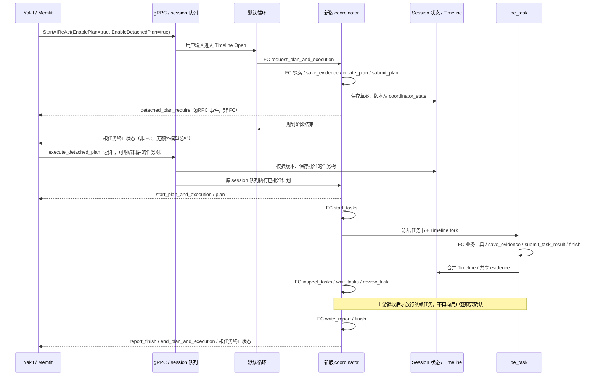

# Coordinator：PLAN 的协调运行体

`coordinator` 是新的 PLAN 引擎和专注模式。它负责探索、计划文档、用户审批、任务调度、等待、验收、重试和报告；`pe_task` 执行批准的任务书。新引擎只有这两种 ReAct 循环，均强制使用原生 `tool_calls`，不能通过配置切换到 JSON 响应动作，也不会回退到旧 PLAN/replan/task-review/report 循环。

这个目录独立拥有 [Session](session.go)、计划树与 DAG、控制对象、模型 actions、worker、工具权限、原生辅助调用，以及 [Yakit 事件和存储适配](session_events.go)。新运行体不构造或调用 `coordinator_legacy.Coordinator`、旧 `AiTask`、旧 PLAN runtime，也不借用旧 LiteForge 构造通道。

最上层 [coordinator.go](../aireact/coordinator.go) 默认使用新版。旧引擎的实现、任务和私有资源仍集中在同层 [coordinator_legacy](../coordinator_legacy/README.md)，供后续移除；ReAct 的 PLAN 入口不再调用它。两边共享 aicommon、reactloops、Timeline、事件封套和数据库表这些通用基础设施，不共享执行状态机。父级 `aid` 只保留公共接口，不提供旧类型的兼容别名。

## 启用与替换

gRPC 设置 `EnablePlan=true` 即可开放新版 PLAN，无需手动选择专注模式，也不修改 protobuf 或前端。未指定 focus 时，默认循环接收用户输入，调用 `request_plan_and_execution` 后直接交给新版 Session；不再经过旧 `plan` 循环生成计划。显式 `coordinator` 直接进入新版；客户端缓存的 `plan` / `coordinator_legacy` 名称在最外层升级为新版。旧专注模式不再出现在公开列表。`EnablePlan` 表示允许规划，具体是否需要计划仍由默认循环根据用户请求决定。

客户端新建会话可能重置 `EnablePlan=false`。这时普通默认循环不会获得 PLAN 请求动作；prompt 中写“PLAN”不会覆盖能力开关。`EnableDetachedPlan=true` 只选择审核方式，不能替代 `EnablePlan`。不要把“开启 Plan 能力”和“手动选择 coordinator 专注模式”混为一项设置。

```go
// 显式构造新运行体；AIRuntimeInvokerGetter 由 aireact 注册。
c, err := coordinator.NewSession(ctx, query, options...)
if err != nil { return err }
return c.Run()
```

```yak
err = aim.InvokeReAct(
    "读取目录，规划并执行两个有依赖的验证任务，逐项验收后写报告。",
    aim.focus("coordinator"),
    aim.maxIteration(30),
    aim.reviewPolicy("yolo"),
)
die(err)
```

`aim.planEngine("coordinator")` 保留为 focus 的入口别名；旧 focus 别名现在也升级为新版，不再启用旧运行体。新分支强制 native function call。`EnablePlan=false` 禁止从该 focus 开启 PLAN。工具的原有人工/AI/YOLO 策略继续生效，AI 风险评估使用一次原生 `review_risk` 调用。Timeline 压缩、附件提取等继承新引擎的单步辅助输出也使用原生函数调用，不新增 ReAct 角色。

旧 `coordinator_legacy.NewCoordinatorContext` 仍是隔离的旧库实现。ReAct 不开放其执行入口。`plan_engine` 只保留在持久化协议中，与 `coordinator_state` 一起校验恢复数据。旧记录可供查看，但批准或恢复会返回明确的停用错误，需要重新生成新版计划；不隐式导入新调度器。

## 默认 gRPC 入口与 detached 时序

会话执行统一使用 `StartAIReAct`。旧 `StartAITask`、`StartAITriage` 保留 protobuf 方法签名，调用时立即返回 `codes.Unimplemented`，提示改用 `StartAIReAct`；不等待首条消息，不创建执行运行体。

`EnableDetachedPlan` 是审核生命周期设置，不是引擎选择开关。开启时先保存草案和 coordinator 快照，使用现有 `detached_plan_require` 面板审核；收到 `execute_detached_plan` 后，执行任务排入原 session 队列，使用批准后的任务树继续新版执行。关闭时，同一个 coordinator 使用 `plan_review_require` 等待交互回复，然后继续执行。

批准后的首次执行显示为“执行已批准计划”。内部复用 Recovery 类型来跳过重复规划，不代表发生了崩溃恢复；真正的中断恢复才显示“恢复执行计划”。这些内部任务的描述不追加为用户输入，嵌套协调员也不重复记录父会话已经接收的输入。

确认链路用同一 `SyncID` 关联 gRPC 的 `approval received` 与后台的 `approval queued` / `approval rejected` 日志。入队失败或校验失败同时返回同步错误和普通错误事件，兼容先关闭审核卡、未展示同步错误的客户端。收到 `started=true` 只证明入队成功；任务完成仍应以执行和终止事件为准。

`PlanNode` 必须保留审核组件所需的 `description: ""` 和 `tools: []`（不能省略或返回 null）。当前客户端挂载任务卡时会填充它们；缺少默认值会把未编辑计划误判为编辑，并走只带首个子任务的提交分支。gRPC 回归测试包含这个前端转换过程，不能只测试 `{coordinator_id}` 的直接确认。

规划尚未退出时，现有客户端先取消规划根任务，等待其终止状态，再提交批准。取消由外层队列处理并通过 context 传递给协调员，不能把根任务 ID 再交给子协调员取消。显式取消保留 `skipped` 和取消回执，不额外发送 `fail_react`，避免正常审核交接显示为红色失败卡。



默认循环只负责接收和转交请求，不是第三种 PLAN 内部角色；PLAN 内部仍只有 coordinator 与 pe_task。

默认循环原有的蓝图能力仍走独立的 `ExecuteForgeFromDB` 执行器，不经过新版 PLAN 的协调循环；coordinator / pe_task 不开放蓝图动作。外层保留 `HijackPERequest` 执行回调和既有开始/结束事件，用于集成方接管执行，不为回调构造任一规划引擎。

前端允许在规划尚未结束时点击确认：先发送 `react_cancel_task`，等根任务的 `skipped/completed/aborted`，再发送 `execute_detached_plan`。取消的只是当前规划任务上下文，批准后的恢复任务使用 session 上下文。必须保持根任务 ID 和父会话 CoordinatorId 的归属，不能把根终止事件归到子任务频道。

上述隔离不覆盖整个 session runtime 被关闭的情形。现有 `SetCurrentProject` 会退出当前 runtime 并关闭其流，即便客户端重新设置的是同一个项目；这类 EOF 需要与服务进程崩溃、单个规划任务结束分别诊断。

配置在 session 建立时解析：`PreferSessionCachedConfig` 控制是否合并缓存设置，然后应用引擎和协议约束。默认 Plan 的函数调用模式、新版引擎、DAG 依赖和批准门禁属于代码约束，不靠模型“偏好”。全局 `AIPlanPrompt` 与 `UserPlanPrompt` 属于规划偏好，只注入规划阶段协调员的 SemiDynamic2；worker 接收批准的任务书和共享上下文，不继承这份规划角色提示。

detached 不等于清空上下文，也不承诺自动提高缓存命中率。session Timeline 和 evidence 延续，批准的 Plan Document 进入 SemiDynamic1，最新状态在 `Timeline Open -> PLAN STATUS -> TODO` 展示。稳定部分留在前缀、变化部分放在末尾，有利于缓存；实际命中率仍需读取模型用量。

## 模型 actions

参数 schema 是原生函数的参数定义。JSON 仍用于工具参数、事件 Content 和存储；模型的普通 JSON 响应不能选择或执行动作。

| Action | 参数 | 作用 |
| --- | --- | --- |
| `create_plan` | `plan`, `plan_document` | 校验并保存草稿，返回版本；不执行任务 |
| `modify_plan` | `plan_version`, `plan`, `plan_document` | 完整替换对应版本的草稿，批准版本继续有效 |
| `submit_plan` | `plan_version` | 进入现有用户审批；采用合法编辑树；detached 只发布待批准计划 |
| `start_tasks` | `task_ids` 可省略 | 原子检查并发、依赖、批准和当前状态，立即派发；省略时选择当前可执行任务 |
| `inspect_tasks` | `task_ids` 可省略 | 返回状态、尝试、结果和引用，并记录结果已被观察 |
| `wait_tasks` | `task_ids`, `mode`, `timeout_seconds` 均可省略 | `any` 默认等待更新；`all` 等选中的已派发尝试全部结算；默认 30、最多 60 秒，超时不取消 |
| `review_task` | `task_id`, `attempt_id`, `decision`, `reason` | 对已观察的 `awaiting_review` 尝试作出 `accept` 或 `reject` |
| `retry_task` | `task_id`, `attempt_id`, `reason` | 重试已结算的当前尝试，撤销下游旧结果；受影响 worker 必须先退出 |
| `cancel_tasks` | `task_ids` 可省略，`reason` | 请求停止；运行中的任务先进入 `cancelling`，退出后才是 `cancelled` |
| `write_report` | `title`, `markdown`, `summary` | 在当前协调循环写 Markdown artifact，发送既有 `report_finish` |
| `directly_answer` | 既有原生答案参数 | 发布进展/答案，继续协调循环 |
| `finish` | 既有参数 | 经过批准、验收、未读结果、worker、TODO、用户输入及报告门闩后结束 |

继续复用 `save_evidence`、`adjust_todolist`、`ask_for_clarification`、工具加载/调用、知识及技能检索 actions。不存在任意改状态的 `update_plan_status`：状态来自执行、观察、验收和取消的真实结果。

`plan` 的首版原生参数采用平面任务 DAG：

```json
{
  "name": "验证方案",
  "goal": "确认两个步骤的结果",
  "tasks": [
    {"name": "验证来源", "goal": "读取来源并保存 evidence", "identifier": "source", "depends_on": []},
    {"name": "验证结论", "goal": "依据来源检查结论", "identifier": "conclusion", "depends_on": ["source"]}
  ]
}
```

`identifier` 保持稳定且唯一，`depends_on` 使用这些语义标识。宿主分配稳定 `task_id`，解析依赖并拒绝重复标识、未知依赖和环。客户端编辑及恢复仍接受原有嵌套 `root_task`，不改变 Yakit 任务树协议。首版修改采用完整草稿替换，避免另造一套 delta 解释器。

## 任务与结果

```text
pending -> running -> awaiting_review -> accepted
                      └──────────────> rejected
           └────────> failed
running -> cancelling -> cancelled
settled -> retry -> running（新的 attempt_id）
```

worker 的 `submit_task_result(summary, artifacts?, evidence_ids?)` 提交结果，随后 `finish` 经过原有微观 TODO 门闩。worker 返回并不意味着验收通过，也不会自动放行依赖任务。协调员读取结果及引用，再调用 `review_task`；需要额外验证时派发批准范围内的验证 task。

任务书在派发时冻结。批准新版本前，改变任务书或上游输入的活动任务必须停止；改变输入后，下游已完成或待验收的旧结果也会失效。重试使用新尝试序号，保留 Timeline 中的调用、结果和审阅记录；快照保存当前尝试。恢复不自动重启曾在运行的 worker，先标记 interrupted/failed，交给协调员显式重试。

`wait_tasks` 使用通知等待。用户交互、计划修改或尝试替换会让等待返回，协调员重新评估。`all` 不能等待尚未派发的任务；不能把还未获验收的依赖当成已完成。

`user_intervention` 由会话宿主写入共享 Timeline 后再通知协调员，不重复转交给每个 worker 记录。普通 `FreeInput` 保持外层队列语义，供下一任务执行。新运行体要求报告时由 `write_report` 完成。旧 `CoordinatorOption` / `ResultHandler` 只属于旧版，不注入新运行体。

## 工具边界与上下文

协调员只开放显式内置读取/目录/搜索工具；`write_file` 限制在工作目录 `artifacts` 下的 `.md` 文件，检查路径穿越和已有父目录的符号链接。未知工具、MCP 命令包装器、脚本执行和业务修改交给 worker。worker 继承原有工具审阅策略，但不能开启其他专注循环、蓝图、PLAN 或通用 sub-agent。

用户输入、澄清回答、选项和用户重做说明进入 session Timeline，经过 Open 的冻结/压缩提升；纯动态区域不重新附加 USER QUERY。任务派发书也记录在 Timeline，worker 使用既有 fork/merge。`save_evidence` 复用 session journal，所有 tasks 与协调员共享、去重并沿现有机制提升。

```text
High static：现有纯静态系统指令
SemiDynamic1：提升后的用户信息 / session evidence / 批准的 PLAN DOCUMENT
SemiDynamic2：协调员或 worker 的稳定职责说明
Dynamic：Timeline Open -> PLAN STATUS -> 微观 TODO -> 运行状态
```

PLAN STATUS 包含草稿/批准版本、逻辑 task ID、状态、尝试和结果观察状态。它不复制用户输入或计划文档。无状态 PLAN TREE 的重新设计仍单独待定。

## Yakit 与旧接口

| 通道 | 适配规则 |
| --- | --- |
| 启动/结束 | 保留 `start_plan_and_execution` / `end_plan_and_execution` 和 `coordinator_id`, `re-act_id`, `re-act_task`；外层 ReAct 终态仍由原入口发送 |
| 普通审批 | `plan_review_require` / `review-require`，保持 `id`, `selectors`, `plans.root_task`, `plans_id`，由现有端点释放 |
| Detached | `detached_plan_require` / `detached-plan`；提交后不会启动 worker；`execute_detached_plan` 接收并校验用户编辑树，再入会话恢复队列 |
| 任务卡 | 相同逻辑 task ID 只 push 一次；已关闭任务重做通过外层路由的 `react_task_status_changed` 重新显示处理状态；验收或取消结束时 pop |
| 任务状态 | `running/awaiting_review/cancelling` 映射 processing；`accepted` 映射 completed；`failed/rejected` 映射 aborted；`cancelled` 映射 skipped |
| 控制输入 | 保留 `plan`, `skip_subtask_in_plan`, `redo_subtask_in_plan`、原 SyncID 和返回格式；skip 在实际退出后回执；UI 重做只接受已完成任务，说明进入 Timeline |
| 恢复/历史 | 保留 `recovery_plan_and_exec` 请求及 `recover_plan_and_exec` 回复拼写；`task_tree/task_progress` 仍是 JSON 字符串 |
| 展示/观测 | 沿用 stream、status、能力、消耗、prompt profile、session snapshot、artifact 和 `report_finish` 通道 |

旧 `task_review_require` 面板的自动 continue 不是新的业务验收；新协调员通过原生 `review_task` 作出验收，利用已有 stream 展示理由。整个新流程不要求修改 Yakit。

用户对同一版计划只确认一次。普通 `continue` 和编辑器的 `freedom-review` + `reviewed-task-tree` 都直接采用合法的批准结果，随后协调员自动调度、验收并结束。重复 `submit_plan` 不再弹出审核或重置任务；修改后产生的新版本仍需审批。编辑树里的 `isRemove` 会移除相应子树；已删除的依赖引用必须修正，不能默默执行原计划。Detached 的确认仍使用 `execute_detached_plan`，接入队列后直接执行批准树。

更多字段与依据见 [接口契约](../coordinator_interface_contract.md)，组件关系见 [架构文档](../coordinator_architecture.md)。

两个循环之外的辅助模型请求、实测开销和后续统一治理问题见 [TODO](TODO.md)。

## 测试与 Yak 冒烟

```powershell
go test ./common/ai/aid/coordinator -count=1
go test ./common/ai/aid/aireact -run 'TestCoordinator|TestPublishDetachedPlan|TestHandleSyncTypeExecuteDetachedPlanEvent|TestReAct_RecoveryPlanAndExec' -count=1
go test ./common/yakgrpc -run '^TestStartAIReActDetachedApprovalExecutesAndKeepsStreamOpen
```

[native_coordinator.yak](smoke/native_coordinator.yak) 由测试通过真实 Yak 引擎执行，调用 `aim.InvokeReAct`。只有模型 provider 使用可重复的原生函数调用响应；协调员、worker、审批、Timeline、报告和 Yakit 事件适配均运行实际代码。测试核对真实文件读取、两个有依赖的任务、共享 evidence、逐项验收、push/pop、报告文件及两种 loop_marker。另有独立 Session 的 detached 提交、编辑、引擎恢复及执行测试，以及干预入 Timeline 后通知的时序测试。

[审核到执行测试](../aireact/coordinator_approval_execution_test.go) 通过真实输入事件和任务队列覆盖普通确认、编辑后提交、detached 确认、detached 编辑，以及 Yakit 先停止规划再提交执行的路径；每条路径只提供一次用户确认，验证两个依赖任务全部验收、事件闭合及完成状态持久化。Yak 冒烟也使用人工审批策略，由事件回调发送这一次确认。

[通道测试](../aireact/coordinator_channels_test.go) 拦截旧构造器，验证新版规划、人工审核编辑、detached 发布及恢复均不调用它；反向选择旧通道时不注入新版辅助执行器。恢复以存储归属为准，未知版本或旧标记与新快照冲突会报错。新包的生产依赖图不包含父级 `aid` 或 `aiforge`。

[live_coordinator.yak](smoke/live_coordinator.yak) 可使用本机配置的实际 provider/model 执行；凭据由外部配置，不写入脚本。确定性冒烟不衡量模型任务质量或真实 provider 的缓存命中率。

新增 actions 应放在此包，状态变化通过 Controller，外部渠道通过 Host。不在 worker 中暗中恢复旧 review/replan 循环，也不新增第三种 ReAct 角色。
 -count=1
```

[native_coordinator.yak](smoke/native_coordinator.yak) 由测试通过真实 Yak 引擎执行，调用 `aim.InvokeReAct`。只有模型 provider 使用可重复的原生函数调用响应；协调员、worker、审批、Timeline、报告和 Yakit 事件适配均运行实际代码。测试核对真实文件读取、两个有依赖的任务、共享 evidence、逐项验收、push/pop、报告文件及两种 loop_marker。另有独立 Session 的 detached 提交、编辑、引擎恢复及执行测试，以及干预入 Timeline 后通知的时序测试。

[审核到执行测试](../aireact/coordinator_approval_execution_test.go) 通过真实输入事件和任务队列覆盖普通确认、编辑后提交、detached 确认、detached 编辑，以及 Yakit 先停止规划再提交执行的路径；每条路径只提供一次用户确认，验证两个依赖任务全部验收、事件闭合及完成状态持久化。Yak 冒烟也使用人工审批策略，由事件回调发送这一次确认。

[通道测试](../aireact/coordinator_channels_test.go) 拦截旧构造器，验证新版规划、人工审核编辑、detached 发布及恢复均不调用它；反向选择旧通道时不注入新版辅助执行器。恢复以存储归属为准，未知版本或旧标记与新快照冲突会报错。新包的生产依赖图不包含父级 `aid` 或 `aiforge`。

[live_coordinator.yak](smoke/live_coordinator.yak) 可使用本机配置的实际 provider/model 执行；凭据由外部配置，不写入脚本。确定性冒烟不衡量模型任务质量或真实 provider 的缓存命中率。

新增 actions 应放在此包，状态变化通过 Controller，外部渠道通过 Host。不在 worker 中暗中恢复旧 review/replan 循环，也不新增第三种 ReAct 角色。
