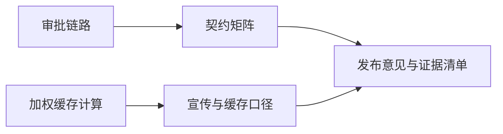

# Coordinator 综合真实模型实验（2026-10-03）

放宽 action 附加字段后，function call 与 text stream 都完成了「调查 → 生成 DAG → 一次计划确认 → 五项任务执行和验收 → 报告交付」。语义主体正确，但 function call 的等待、辅助请求和压缩开销明显偏大，不能据高缓存命中率认定系统已经足够高效。

## 实验与本地改动

使用 [Yak 脚本](smoke/comprehensive_live.yak) 调用 aim.NewAIEngine / SendMsg；[运行桥接](smoke/live_runner/main.go) 只构造一次带 endpoint ID 的真实 AIInputEvent，模拟计划卡确认。计划、执行、质量验收及报告决策均由真实模型产生，没有脚本化模型响应。主模型为 aibalance / deepseek-v4.1-flash，辅助模型为 memfit-light-free。每轮隔离 session、数据库和材料目录。

综合任务是离线「发布验收审计」：26 条审批事件、8 条缓存样本、C1-C8 契约和含六条错误/待验证主张的宣传稿。检查普通确认、编辑、detached、重复确认、旧卡、失败重试、取消证据与缓存口径。五叶任务、并发最多 2：

按用户补充要求，本地调整 action 校验：允许附加业务字段，只校验/使用已声明参数；human_readable_thought、todo_delta 保留给公共循环。必填字段、已知类型、null 任务列表、任务身份、DAG 和编辑互斥检查保留。modify_plan / modify_report 的附加字段不参与编辑事务，不能将无实际编辑的请求伪装成有效修改。两种协议共用此路径。新增兼容性和真实循环协议测试，Coordinator 全套测试通过（25.448 秒）；最终 Yak 脚本语法检查通过。未提交、推送或更新 8087。

## 实际完成情况

| 运行 | 结果 | 用时 | 主模型请求 | 附加字段拒绝 |
|---|---|---:|---:|---:|
| 修改前 function call | T1/T2 产出结果，审核参数非法，五次重试后中断；无最终报告 | 3分05秒 | 33 | 0 |
| 修改前 text stream | 五项执行，前四项验收，T5 审核反复拒绝公共字段，最终缺 reason 中断；无最终报告 | 6分44秒 | 113 | 26 |
| 修改后 function call | 五项全部 accepted，report_finish 一次，completed=true | 7分53秒 | 126 | 0 |
| 修改后 text stream | 五项全部 accepted，report_finish 一次，completed=true | 3分02秒 | 66 | 0 |

四轮各确认计划一次。成功轮每个任务仅执行一次；attempt_id 是全局尝试序号，T2 的 attempt=2 不表示 T2 重试过。输入材料六个文件的 SHA-256 均保持不变。

另有最初一次采样脚本将 map 传入要求 AIInputEvent 的接口而中断；修正桥接后重新运行，未将该次脚本错误计入上表。成功判断依据 report_finish 和 completed=true，不能仅依赖 engine.IsFinished()。

这是 aim/session 路径与模拟计划确认的验证，未运行真实 Yakit / Memfit 客户端点击或 gRPC 前端端到端测试。

## 主模型回答与语义

两轮成功报告都给出「有条件发布」，明确保留历史 failed/rejected，区分开始、退出和验收；取消记录只有 X01/X02，缺 worker_exit / cleanup，因此标为未知；没有声称已做真实 Electron UI 测试。后继执行上下文实际带有已验收的直接前置结果。

模型正确核算材料：coordinator=17100/20000=85.50%，worker=10400/15000=69.33%，auxiliary=100/1500=6.67%，总体=27600/36500=75.62%。正确拒绝以 (0%+90%+90%)/3=60% 代表总体，也区分本地前缀字节复用和 provider cached_tokens。**这里的 75.62% 是给定 CSV 材料的答案，不是本次真实模型调用的缓存利用率。**

实际交付摘要摘录：

> candidate-R2 离线发布验收审计报告已交付。五叶任务 T1-T5 全部 accepted……结论：有条件发布——C1-C5/C7/C8 计费口径已证实；C6 取消路径与前端兼容未证实。

仍需修正的语义/呈现问题：

- 记忆辅助调用在注入内容中曾写成「T1 → T2 → T3 → T4 → T5」，同条随后又列正确依赖。这与实际并行 DAG 冲突。正式 PLAN 和最终报告保留了正确依赖，但记忆已经带入错误关系。
- function call 报告对「跨角色前缀必不共享」「预热消除冷启动」的措辞过强。材料只给出样本命中率，不能证明完整共享策略，也不能以剔除冷启动样本估计预热收益；预热额外调用需要计入成本。
- text stream 的报告文件首尾残留 document 的 AITAG 包裹，内容正确但交付格式需要清理。产物索引有些使用相对路径，人工查看时应以实际 artifact 路径为准。

原始模型报告：[function call](C:/Users/V/AppData/Local/Temp/coordinator-comprehensive-compatible-fc-20261003/final-report.md)、[text stream](C:/Users/V/AppData/Local/Temp/coordinator-comprehensive-compatible-text-20261003/final-report.md)。这里保留原样，没有代替模型润色。

## 真实缓存与开销

使用 provider usage，按 sum(cached_tokens) / sum(prompt_tokens) 加权。主模型所有已记录响应均有 cached_tokens；包括重试和等待请求。下表排除辅助模型，分类不把辅助提示词中引用的主循环上下文误算为主循环。

| 成功轮 | coordinator | worker | 主模型合计 | 主模型输入 token | 已缓存 token | 未缓存 token |
|---|---:|---:|---:|---:|---:|---:|
| function call | 91.47%（98次） | 80.53%（28次） | **89.59%** | 6,784,649 | 6,078,080 | 706,569 |
| text stream | 79.78%（36次） | 86.06%（30次） | **82.89%** | 3,086,864 | 2,558,720 | 528,144 |

修改前 text stream 主模型输入 5,045,502 token、未缓存 583,038 token、命中率 88.44%。修改后虽增加最终报告阶段且百分比降低，实际请求由 113 降至 66，输入量约减 38.8%，未缓存量约减 9.4%，并且完成交付。不能把减少重复请求后的比例下降直接解释为缓存退化。单次样本不是严格控制的性能基准，provider 预热、模型输出与调度时机也会影响结果。

成功轮的 coordinator High Static 各只有一个 hash（98/98、36/36）。SemiDynamic1 分别 5/4 个 hash，SemiDynamic2 为 3/4 个；没有逐轮重写静态区。写报告阶段命中率只有 56.69% / 36.10%，是后续值得单独观测的缓存下降点。

| 辅助请求（均使用轻量模型，含重试） | function call | text stream |
|---|---:|---:|
| 标题 | 2 | 2 |
| 标签 | 1 | 3 |
| 工具原因 | 12 | 0 |
| value feedback | 66 | 51 |
| memory triage | 66 | 38 |
| memory 去重 | 3 | 3 |
| Timeline 压缩 | 16 | 1 |
| 合计 | **166** | **98** |

function call 有 71 次已执行 wait_messages，text stream 有 29 次；包括同一待检查消息尚在时的快速重复等待。function call 16 次压缩累计输入 **1,158,789 token**，已报告 cached_tokens 仅 5,565，且一次缺缓存字段；这是明显的额外开销。两轮仍分别有 37/19 条协议重试记录，涉及辅助 native 输出、数组类型和模型参数等，放宽附加字段不能修复非法 JSON 或错误的已声明类型。

text stream 最终保存 164 条有效 usage；另有 3 条缺 usage 的回调（含收尾取消），不能擅自按零 token 计账。辅助请求多条缺 cached_tokens，故不对整个系统给出伪精确的总体缓存率。模型响应次数统计来自最终 usage 文件，异步收尾可能晚于 result.json 的计数快照。

## 四份典型 prompt 与实际 action

以下是运行时 aicache 的实际组装 prompt；不是重建的展示模板，也不是完整 HTTP 请求体。采样桥接的 raw HTTP 回调被现有 SDK 通道覆盖，本次没有获取 wire 文件；已移除该无效采样代码。原始记录中的 wireCount=0 不能用于推断 provider 请求没有工具定义。

| 协议 | PLAN（草案/提交附近） | EXEC（任务消息/验收状态） |
|---|---|---|
| function call | [PLAN prompt](C:/Users/V/AppData/Local/Temp/coordinator-comprehensive-compatible-fc-20261003/samples/PLAN-prompt.txt) | [EXEC prompt](C:/Users/V/AppData/Local/Temp/coordinator-comprehensive-compatible-fc-20261003/samples/EXEC-prompt.txt) |
| text stream | [PLAN prompt](C:/Users/V/AppData/Local/Temp/coordinator-comprehensive-compatible-text-20261003/samples/PLAN-prompt.txt) | [EXEC prompt](C:/Users/V/AppData/Local/Temp/coordinator-comprehensive-compatible-text-20261003/samples/EXEC-prompt.txt) |

另外保存了写作阶段 [function call prompt](C:/Users/V/AppData/Local/Temp/coordinator-comprehensive-compatible-fc-20261003/samples/report-prompt.txt) / [text stream prompt](C:/Users/V/AppData/Local/Temp/coordinator-comprehensive-compatible-text-20261003/samples/report-prompt.txt)，以及 create_plan / submit_plan / review_task / create_report / submit_report 的实际参数：[function call action 采样](C:/Users/V/AppData/Local/Temp/coordinator-comprehensive-compatible-fc-20261003/samples/actions.md)、[text stream action 采样](C:/Users/V/AppData/Local/Temp/coordinator-comprehensive-compatible-text-20261003/samples/actions.md)。

[汇总指标与计数](C:/Users/V/AppData/Local/Temp/coordinator-comprehensive-review-20261003/metrics.json)；每轮原始日志、usage.json、events.json、Timeline/Evidence 和子任务产物均保存在上述独立运行目录。

## 下一步优先级

1. 修正通知确认与微观 TODO 的相互阻塞，降低相同消息导致的重复 wait；确认消息处理不应被当前写报告 TODO 阻止。
2. 收敛 memory triage / value feedback / Timeline 压缩的触发与失败重试，阻止将临时任务状态或错误 DAG 关系写入长期记忆。
3. 单独验证 native 参数生成及报告格式：附加字段兼容已通过，但 malformed JSON、错误数组类型、AITAG 泄漏仍应按各自链路处理。

本次仅落实附加参数兼容性；上面三项保留为实测发现，没有顺带扩大生产代码改动。
