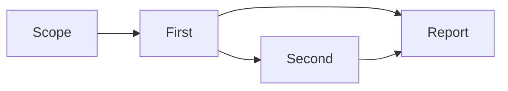

# 新版 coordinator 上下文与计划控制 review

本轮本地修改：中文职责说明通过 promptloader 加载；生成计划恢复旧版嵌套字段与 DAG 语义；新增 inspect_plan、原生预设计划与 mocker；将草案和已批准任务书放入 SemiDynamic1 的 PLAN DEFINITION。接口事件和执行状态机继续使用新版 coordinator，不引入旧运行体。

## 实际上下文顺序

coordinator 和 pe_task 复用 mainloop 的分区装配。以下列出可出现的材料；没有数据的可选字段不渲染。High Static 本轮未修改，保持纯静态。

| 分区 | 实际材料 | 变化来源 |
| --- | --- | --- |
| High Static | 工作方法论、Timeline 用户信息关注规则、TODO、Evidence、工具及完成规则 | 模板版本；不含本次用户输入、任务状态或角色条件 |
| Frozen Block | 强制技能、工具目录名称及说明、其他固定分区、普通冻结 Timeline 历史 | 工具配置、材料写入、Timeline 冻结/压缩 |
| SemiDynamic1 | WorkspaceContext、SkillsContext、PromotedRecentTools、PromotedUserInputHistory、PlanDocument、PlanDefinition、SessionEvidenceSemiDynamic | 工作区、技能及工具加载、用户输入/Evidence 提升、计划版本变更 |
| SemiDynamic2 | ExecutionPolicy、TaskInstruction、AutoLoadedSkills、Schema（文本流）或 FunctionCallSchemas（原生） | 执行策略、角色/规划阶段、技能、允许的 actions |
| Timeline Open | TimelineOpen → PLAN STATUS → TODO；还可包含旧执行上下文或 ReportedRisks | 最近事件、用户补充、工具调用、任务进度和微观待办 |
| Dynamic | CurrentTime、AutoContext、ExtraCapabilities、ReactiveData、InjectedMemory、TodoCheckpoint | 当前时间、观测提供器、本轮动作反馈和检索结果 |

Frozen 中的用户输入、Evidence、最近工具材料经过已有提升机制进入各自的 SemiDynamic1 字段。当前输入先进入 Open，冻结后提升；Dynamic 不额外复制 USER QUERY。环境观测等普通 Timeline 记录仍保留在冻结历史，未因本次拆分被丢弃。

计划定义经已有 FrozenBlockPartitionProducer 保存，装配主循环时分别提取 plan_document 和 plan_definition 到 SemiDynamic1；其余分区继续留在 Frozen。轻量提示也保留完整计划定义。观测树新增 section.semi_dynamic_1.plan_definition，可单独查看该材料的长度和位置。

## 中文职责说明

资源位置：

- [instruction.txt](../aicommon/promptloader/prompts/ai/aid/coordinator/instruction.txt)：协调员的计划、DAG、调度、验收、Evidence、工具范围及完成规则。
- [planning_only.txt](../aicommon/promptloader/prompts/ai/aid/coordinator/planning_only.txt)：仅规划或 detached 发布阶段的限制。
- [worker_instruction.txt](../aicommon/promptloader/prompts/ai/aid/coordinator/worker_instruction.txt)：执行批准的冻结任务书、提交结果，禁止另起规划循环。

使用 promptloader.MustLoad，与 mainloop 共用资源加载和发布归档机制。角色说明放在 SemiDynamic2；全局 AIPlanPrompt/UserPlanPrompt 仅附加在规划阶段，不传播为 worker 角色指令。两个循环沿用主循环的 EnableFunctionCallMode。中文指令按 FunctionCallMode 选择文本流 JSON action 或原生 function call；TODO 分别使用 JSON action.todo_delta 或 adjust_todolist.arguments.todo_delta。

协调员指令开头为：

```text
你是计划协调员，负责维护 PLAN、调度任务、验收结果和交付报告。关注 Timeline 中的用户输入及补充要求。
```

## 真实运行样本

新增 `TestCoordinatorPlanningSubmissionSmoke` 专门验证提交前的规划链路，覆盖探索、preset、mocker × function call/text stream，共六个运行组合。模型使用确定性响应，其他模块走真实 Session 和工具/交互通道；探索中的文件观测来自实际 `read_file`，附带计划中的已有 Evidence 则是测试夹具读取本地文件后提供的会话材料。测试显式调用已有 `FreezeAll` 来检验 Open 冻结后的用户输入和 Evidence 提升，不依赖生产默认桶恰好在短任务中到达阈值。

四份主样本捕获同一时点：`inspect_plan` 已完成、即将调用 `submit_plan`。测试随后通过 `plan_review_require` 收到审核事件，向输入通道只提交一次 `continue`，确认计划已批准且保留两项叶任务及依赖；仅规划运行不派发 worker。批准后的 prompt 另行验证 PLAN DOCUMENT、批准版本及派发门闩。预设/mocker 分别独立运行并核对相同的文档、任务结构与依赖；附带计划样本采用 preset 的请求代表两者。

设置 `COORDINATOR_CONTEXT_REVIEW_DIR` 后，在 `planning-submission` 子目录输出：

| 完整 prompt 文件 | 路径与协议 |
| --- | --- |
| exploration-function-call.prompt.txt | 真实读取 → Evidence → 创建计划 → 核对 → 提交，原生协议 |
| exploration-text-stream.prompt.txt | 同一探索提交链路，文本流协议 |
| preset-function-call.prompt.txt | 附带计划 → 核对 → 提交，原生协议 |
| preset-text-stream.prompt.txt | 同一附带计划提交链路，文本流协议 |

每个 prompt 的同名 `.request.json` 保存离线投影后的 messages、原生 tools（文本流为空）、实际 action 顺序、一次审核 payload 和最终批准的 plan。它们用于检查装配和协议，并非上游 provider 的 HTTP 抓包，不提供在线模型质量或缓存命中结论。

样本由 TestCoordinatorPresetPlanApprovalContext 和 TestCoordinatorPresetExecutesDependentWorkers 捕获实际模型请求；审批上下文样本使用确定性的原生 function call，依赖执行样本同时覆盖文本流与原生两种协议。用户约束和 source.location 是测试注入材料，不代表对真实 source.txt 做了检查。实际工具读取与 Yak/aim 执行另外由既有 native_coordinator.yak 冒烟覆盖。

设置 COORDINATOR_CONTEXT_REVIEW_DIR 后测试会输出：

| 文件 | 捕获时点 |
| --- | --- |
| 01-draft.txt | 草案已装载，尚未 inspect_plan |
| 02-inspected-draft.txt | inspect_plan 已核对版本；完整草案仍在 SemiDynamic1，尚未提交 |
| 03-approved.txt | 同步批准后，尚未派发任务 |
| 04-awaiting-review.txt | 后继任务已提交结果，协调员已观察，等待验收 |
| 05-dependent-worker.txt | 后继 worker，含前置 session Evidence |

03-approved 的 SemiDynamic1 实际内容包括以下片段，长任务树及路径省略：

```text
# Workspace Context
OS/Arch: windows/amd64
working dir: ...本次测试工作区...
AI Artifacts dir: ...本次测试工作区...

# Session User Input History
User Input: 已有约束：只读，不访问外部网络。

# PLAN DOCUMENT
Approved PLAN version 1
# 核对方案
只读检查来源，保存证据，交付报告。

# PLAN DEFINITION
Task briefs and prerequisite relationships. Runtime states are in PLAN STATUS.
## Approved version 1
...任务树：来源核对 -> 读取来源 / 复核来源...
...每个节点包含 task_id、index、name、goal、semantic_identifier、depends_on...
Executable leaf DAG (task_id <- prerequisite task_ids):
...读取来源 <- []...
...复核来源 <- [读取来源的 task_id]...

## 已知观测（Evidence）
[id: source.location]
主体：source.txt；动作：检查工作区；观测：文件位于当前工作区；控制含义：后续任务可在本地读取。
```

同一请求的 Open 中仍有当前用户输入“请核对 source.txt，计划确认一次后执行。”及 inspect_plan/submit_plan 调用记录。PLAN STATUS 在它们之后，微观 TODO 再后。下面保留实际任务 ID：

```text
# PLAN STATUS
Draft version: 1; approved version: 1
## PLAN 未开始任务
- 1 "读取来源" [plan-task4b494532-57f4-4feb-8e09-e65044211ce1]: pending; attempt=0; observed=false
  Dispatch: ready
- 2 "复核来源" [plan-task67fd7bea-4a54-4534-b793-fb93c780653a]: pending; attempt=0; observed=false
  Dispatch: blocked; waiting for accepted prerequisites [plan-task4b494532-57f4-4feb-8e09-e65044211ce1]

## 待办清单（TODO）
### CURRENT TASK [...协调员本轮任务标识...]
- (无 TODO；空清单不代表任务完成)
```

Dynamic 的完整有效材料为：

```text
# Current Time
2026-10-03 10:52:31
submit_plan: {"approved_version":1,"draft_version":1}
```

04-awaiting-review 则重点展示当前待验收任务，已验收的前置任务列在其他状态中：

```text
# PLAN STATUS
Draft version: 1; approved version: 1
## 当前执行 / 待验收
- 2 "Second" [plan-task2188505d-a255-4be7-a735-0761cc0d0001]: awaiting_review; attempt=2; observed=true
## 其他任务状态
- 1 "First" [plan-task80696a7f-037e-4357-b732-9f8ae55e30f4]: accepted; attempt=1; observed=true
```

这些 state/attempt/observed 变化不会改写 PLAN DEFINITION。任务结果、artifacts 和 evidence_ids 写入 session Timeline Evidence，冻结后进入 SemiDynamic1，供 review_task 决策；feedback 只提供记录位置，不复制结果正文。前置 Evidence 在 worker 合并时进入 session journal，后继 worker 的真实请求包含 preset.source.1。

## 计划维护与 DAG

两种协议的 create_plan/modify_plan 接受旧字段 main_task/main_task_goal/tasks，以及递归 subtask_name/subtask_goal/subtask_identifier/sub_subtasks；保留现有平面别名。root_task 编辑和恢复协议不变。

- 结构父节点不执行，只执行叶任务。
- 节点排列不产生依赖，depends_on 显式描述关系。
- 依赖一个任务组，等待该组全部叶任务被接受。
- 组的前置条件只作用于组内入口叶任务，组内已有依赖继续传递先后关系。
- 同一语义标识在修改时保留 task_id；重复标识、未知/歧义引用、循环依赖仍拒绝。

例如 Scope -> Sources 组 -> Report，组内 First -> Second，叶 DAG 为：



WithPresetPlan 和新版 WithPlanMocker 均只创建草案，随后通过 inspect_plan/submit_plan 和同一批准门禁执行。已有恢复草案不重复调用 mocker。modify_plan 产生新草案；获批前保留原已批准版本，SemiDynamic1 同时显示两份定义，PLAN STATUS 明确说明执行仍使用已批准版本。

## Actions 与工具边界

协调员专属 actions：create_plan、modify_plan、inspect_plan、submit_plan、start_tasks、inspect_tasks、wait_tasks、review_task、retry_task、cancel_tasks、write_report。

共享 actions：save_evidence、require_tool/directly_call_tool 的协议对应版本、ask_for_clarification、knowledge_enhance_answer、load_skills、change_skill_view_offset、load_skill_resources、search_capabilities、directly_answer、finish。原生模式提供 adjust_todolist，文本流使用主循环 todo_delta。worker 使用 submit_task_result 及允许的共享 actions，不开放协调员 actions、directly_answer、蓝图、其他专注循环或通用 sub-agent。

协调员执行工具白名单：read_file、read_file_lines、list_dir、list_files、find_file、find_files、tree、grep、grep_files、search_files、search_knowledge、query_knowledge_base、yakdoc；write_file 仅允许工作目录 artifacts 下的 .md，仍检查路径和符号链接。未知工具、MCP 命令包装器、脚本及业务修改拒绝，由 worker 执行。

尚需后续细化的控制点：当前 Frozen 工具目录来自共享 AiToolManager，可能展示协调员无权执行的工具。执行守卫已限制权限，但“目录可见”与“允许执行”尚未统一过滤。技能/能力搜索也不能等同于执行授权。本轮如实保留现状，没有扩大协调员权限。Forge 适配不在这次修改范围。

## 验证范围

缓存收敛：`inspect_plan` 的版本和正文位置、各动作的结果/拒绝原因与验收理由保存在 Timeline Evidence。每个任务尝试有独立观测记录，完整保留结果及 Evidence/artifact 引用；查询记录只引用这些观测，不重复任务书、依赖、报告正文或结果正文。feedback 仅返回动作处理状态和记录 ID。Controller 公开返回值、存储快照和 Yakit 事件结构保持原契约。

动作不强制触发冻结。相同查询使用稳定 ID，内容相同不新增 journal 项；Open 冻结后沿现有 Evidence 提升到 SemiDynamic1，后续变化先写 Open，冻结前不改已提升前缀。有副作用的版本操作和验收理由按内容保存独立记录，后续查询不能覆盖它们。所有记录沿用 session Evidence 的共享、恢复与现有容量策略。

`action_xxx.go` / `action_xxx_test.go` 分别承载 11 个计划动作、答复/完成适配及 worker 结果提交；`actions.go` 仅负责注册、双协议定义和公共校验，`action_outcome.go` 负责观测写入。`action_outcome_test.go` 验证 Open → 冻结/提升 → 新结果 Open → 再提升、独立任务结果保留、Timeline 恢复，以及写入失败不能返回成功。设置 `COORDINATOR_CONTEXT_REVIEW_DIR` 后，在 `action-observations` 输出四个实际阶段的上下文材料 JSON。

`TestCoordinatorPlanCacheStableAcrossRepeatedInspection` 在两种协议下各使用 32 项长任务书和长文档连续请求 18 次。它比较投影后的 High Static、Frozen、SemiDynamic1、SemiDynamic2 的实际消息和 native tools，要求同版本内稳定前缀逐字节不变；批准只允许改变 SemiDynamic1，不能扰动共享规则、工具或 schema。测试隔离时间/桶阈值引起的合法提升；另有状态变化测试核对计划分区正文和 nonce 不变，生命周期冒烟验证用户输入及 Evidence 的正常冻结提升。字节比例用于缓存回归门槛，不作为真实 provider 命中率。

专属 action 的中文说明与参数使用 Options/Description 和 NativeOptions/NativeDescription 分别生成两套定义，共用校验和处理函数。测试核对实际文本提示与 provider tools，确保不会混入另一协议的说明。

本地覆盖两种 action 协议的完整依赖执行链、历史嵌套参数校验、组依赖展开、稳定任务 ID、状态与定义分离、预设/mocker 草案审核、当前输入单次记录、两个依赖 worker 的执行与验收、session Evidence 传递。既有 Yak 引擎 + aim、ReAct 审核、detached、gRPC 和共享提示分区回归继续运行。

确定性 provider 验证代码和协议链路，不代表真实模型规划质量或真实缓存命中率；样本的字节数也不是 token 数或缓存用量。本轮不改 protobuf、不改前端、不提交或推送，等待用户本地 review。
