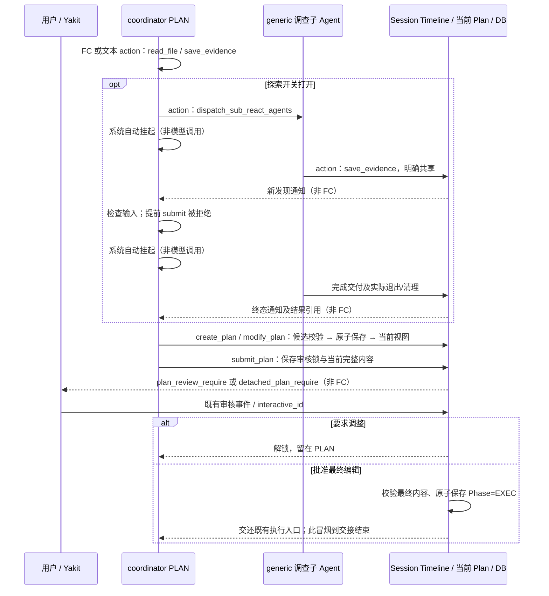

# Coordinator 第一阶段：上下文与本地验收

本文保留第一阶段 PLAN 完成时的采样与验收记录。第二阶段 EXEC 已继续实现，当前执行上下文、自动调度、审核和报告以 [执行验收记录](execution_review.md) 为准。两阶段修改均留在本地，没有提交、push 或重启服务。

## 当前结构

内部是一份 Plan：完整 Document、无状态嵌套任务定义树、由树派生的叶任务 DAG。PLAN 与 EXEC 为两个阶段；审核等待是 PLAN 的锁定状态。不存在 Draft/Approved 双份当前计划、计划版本参数或 edit revision。

| 分区 | 本轮实际内容 | 更新规则 |
| --- | --- | --- |
| High Static | 原主循环方法论、工具、用户信息、TODO、Evidence 规则 | 本轮没有修改，没有角色或阶段条件 |
| Frozen Block | 固定工具目录、材料、冻结的普通 Timeline 历史 | 沿既有冻结/压缩机制 |
| SemiDynamic1 / PLAN DOCUMENT | 唯一当前完整 Markdown 文档 | 只在正文实际改变时更新 |
| SemiDynamic1 / PLAN DEFINITION | 唯一当前嵌套定义及派生叶 DAG，稳定 task_id、语义标识、依赖 | 只在定义实际改变时更新；没有运行状态 |
| SemiDynamic1 / 会话材料 | 用户信息、环境/工作区材料、提升后的 session Evidence 与工具说明 | 沿既有会话提升机制，不丢失原材料 |
| SemiDynamic2 | promptloader 中文 PLAN 指令、规划偏好、当前协议声明 | 固定阶段与探索开关下保持字节稳定 |
| Timeline Open | 近期工具与 Evidence、变更/拒绝回执、patch 引用、用户交互、调查交付 | 不按动作强制 Freeze；大正文不复制到 action feedback/Evidence |
| PLAN STATUS → TODO | PLAN 阶段、是否已有计划、审核锁、必要调查状态 → 协调员微观事项 | 不把正式任务树复写为微观 TODO |
| Dynamic | 当前时间、运行状态、近期反馈、既有感知信息 | 没有永久 USER QUERY 或另一份计划正文 |

PLAN 角色从 [planning.txt](../aicommon/promptloader/prompts/ai/aid/coordinator/planning.txt) 加载；EXEC 保留 [instruction.txt](../aicommon/promptloader/prompts/ai/aid/coordinator/instruction.txt)，worker 保留原冻结任务书。两种协议共用中文参数、验证器和 handler；文本流用 JSON @action/AITAG，原生调用用 tool_calls。PLAN 只声明三个计划动作；EXEC 专属动作既不声明，也不能绕过 handler/Controller 执行。

## 实际文档与状态案例

```text
# PLAN DOCUMENT
# 检查计划
先核对来源。
记录来源路径与验证依据。

# PLAN DEFINITION
当前嵌套任务定义：来源检查 → 检查组 → 来源读取、来源复核
稳定 ID：从实际定义取 task_id；read 的语义标识改为 read_checked 后 ID 不变。
派生叶 DAG：来源复核 <- 来源读取

# PLAN STATUS
阶段：PLAN；已有计划：true；等待审核：false
业务任务尚未获批，不可执行。
```

这段为完整样本的节选，完整 JSON、UUID 和传输 marker 以导出的 provider 请求为准。文档覆盖、严格 diff 和任务 patch 后，下一次请求看到实际新内容。无效依赖导致组合事务回滚，当前文档与定义仍为原内容。原生协议历史里可能包含被拒绝调用的原始参数，它是传输审计历史，不能解释为当前文档。

modify_plan 仅有 document/document_patch/tasks/tasks_patch 四个业务参数，支持覆盖、严格单文件 unified diff，以及有序 add/delete/update。成功回执只有 updated/unchanged、组件、必要 ID 与 patch artifact；无效调用保留明确拒绝理由。待审核期间不可编辑或重复 submit，用户要求修订后恢复编辑，批准用户最终编辑的内容后才移交 EXEC。

## 三类 Yak／aim 冒烟

脚本：[planning_phase.yak](../../aismoking/planning.yak)；harness：[planning_phase_integration_test.go](planning_phase_integration_test.go)。实际运行 Yak、aim、coordinator、读取工具、session Evidence、generic 调查 Agent、审核端点及持久化；只有模型决策使用确定性 provider。业务 worker 启动数始终为 0。

| 任务入口 | native/text × 探索关闭/开启 | 验收 |
| --- | --- | --- |
| 调查生成 | 4 种 | 实际 read_file → save_evidence → create_plan → 文档/任务编辑 → submit_plan → 编辑后批准 |
| preset | 4 种 | 原嵌套计划与文档初始化 → 调查/局部修改 → submit；不调用 create_plan，不丢已有 Evidence |
| mocker | 4 种 | 同 preset，回调只初始化一次；单独测试恢复不重复构建 |

每个组合包含文档覆盖、tasks 覆盖、文档 diff + 任务更新的组合事务、任务增删改、稳定 ID、最终 DAG、无效依赖回滚、unchanged、重复 Evidence 和一次最终批准。探索打开时另有一次提前提交：调查尚未退出时拒绝，不能弹审核卡。

调查子 Agent 先交付新 Evidence，再继续调查，最后退出；协调员自动挂起两次。屏障期间模型计数不增加，重复 Evidence 不唤醒，新发现/真实退出会唤醒。父级只有明确共享的 Evidence 与结果引用，没有 CHILD_PRIVATE_REASON_SENTINEL 私有 Timeline。调查实际执行权限阻止写文件、命令、递归派发、计划编辑和专注循环。generic 取消/超时及 cleanup_pending 回归继续覆盖真实退出保护。

新增真实审核回归在两种协议下验证：要求调整 → 解锁 → 修改 → 新端点审核；旧端点回复不批准新内容，重复回复不重复移交；最终采用用户编辑文档。另覆盖持久化失败、并发严格 patch、定义/DAG 一致性、实际 handler 绕过 verifier 时的拒绝和默认关闭配置继承。

## 采样和缓存

```powershell
$env:COORDINATOR_CONTEXT_REVIEW_DIR = '<本地采样目录>'
go test ./common/ai/aid/coordinator -run '^TestPlanPhaseYakSmoke$' -count=2 -v
```

输出位于 planning-phase/<source>-native-<bool>-explore-<bool>/。每组提供创建/加载后、修改后、提交前的 prompt.txt、实际 native tools 或文本 schema JSON、投影 messages.json 与 summary.json。preset/mocker 额外采样初始化首轮。相应 JSON 记录模型/辅助调用数、自动等待数及运行轨迹。

缓存验收比较真实 provider-visible messages：所有 PLAN 轮的 High Static、Frozen、SemiDynamic2 和 tools/schema 字节稳定；编辑只更新有变化的当前文档/定义；普通 Evidence 探针的前四条 message 保持相同。summary 的比例是这些可复用 message 与原生 tools 的字节占本轮输入的比例；文本 schema 已在 message 中，不重复计入。它不是模型网关缓存命中率，不能由此推断真实命中或 token 花费。

## 时序与批准边界



普通审核沿 existing checkpoint/interactive_id；detached 先发布并结束规划，确认后通过原 session 队列执行。最终批准树及 EXEC 快照在入队前保存；失败按原机制回滚。两条路径保留原事件、选择器、前端 description/tools 默认值和 protobuf。

本地回归证明接口和执行契约，不证明外部模型规划质量或真实缓存命中率；没有进行 Electron UI 的手动验收。EXEC 的后续设计另行 review，本轮没有实现自动 DAG 调度的新方案或执行期间编辑。
