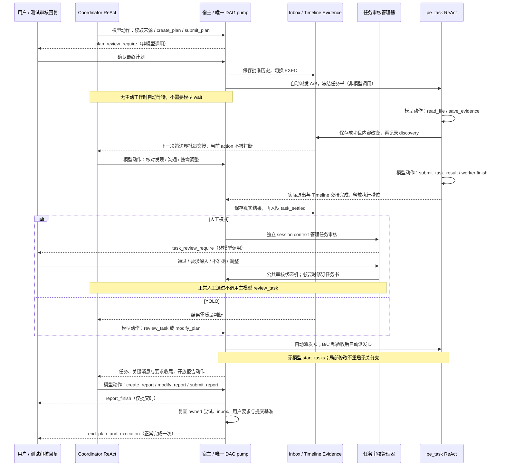

# Coordinator 第二阶段：本地实现与验收

2026-10-03。本轮按第二阶段任务书实现 EXEC 至报告收尾。修改留在本地供 review；本轮没有执行 commit、push 或重启 8087。第一阶段记录见 [context_review.md](context_review.md)，当前接口见 [接口契约](../coordinator_interface_contract.md)。

## 当前实现

| 组件 | 真实行为 | 源码与回归 |
| --- | --- | --- |
| 批准与自动 DAG | 未批准不启动；普通、编辑和 detached 确认采用最终内容；批准、退出、验收、修改和重试自动重算就绪任务 | [planning.go](planning.go)、[scheduler.go](scheduler.go)、[scheduler_test.go](scheduler_test.go) |
| 任务生命周期 | 派发冻结任务书、直接前置验收结果和相关历史；实际退出后统一结算，失败/panic/无结果/取消均保留事实 | [controller.go](controller.go)、[session.go](session.go) |
| 人工 / 自动策略 | 人工审核由任务自身管理器等待，使用 session context；通过直接释放后继。YOLO、ai 和 ai-auto 由协调员判断质量；不能绕过人工策略 | [task_review.go](task_review.go)、[task_review_test.go](task_review_test.go) |
| EXEC 修改 | 四参数 modify_plan，不回退、不再次审批；只停止受影响闭包，等待实际退出再采用新图；无关分支保持原 attempt/context | [execution_edit.go](execution_edit.go)、[execution_edit_test.go](execution_edit_test.go) |
| 消息交接 | 有界摘要与 canonical 引用；先持久化后通知，回调不调用主模型；投递与处理游标分离，旧 attempt 不推进当前状态 | [inbox.go](inbox.go)、[inbox_test.go](inbox_test.go) |
| 自动等待 | 默认30秒运行时检查，空超时不调用模型；人工正常通过不要求主模型二次检查；review_due 去重且不自动验收 | [task_notifications.go](task_notifications.go)、[action_wait_messages_test.go](action_wait_messages_test.go) |
| 主动查询 | inspect_task 可选，默认限制摘要、错误、理由和引用数量；显式 details 返回完整结果，历史尝试标明 historical | [action_inspect_task.go](action_inspect_task.go)、[action_inspect_task_test.go](action_inspect_task_test.go) |
| 报告与退出 | create/modify 实际原子写 artifacts，submit 才发布 report_finish；任务、关键消息和用户要求门禁复查通过后宿主结束；无正常模型 finish | [report.go](report.go)、[report_test.go](report_test.go) |

A 转成 A1/A2 组时，原 A 身份与初步结果保留；外部依赖继续引用 A，等待所有新叶验收。组状态自动聚合，不增加一次模型组审核。取消或失败的未完成目标必须明确解决；报告自动附上失败、拒绝、取消与重试事实，不能用线程退出冒充全成功。

## 实际时序

`模型动作` 使用当前配置的 function call 或 text stream JSON；其他箭头是实际运行时行为，没有额外辅助模型。



## Yak/aim 四种执行组合

下面保留的是此前实验的历史采样数据。当前 [coordinator.yak](../../aismoking/coordinator.yak) 直接由 Yak CLI 执行，HTTP/SSE 模型、用户点击与断言写在 Yak 中；[Go 集成回归](execution_phase_integration_test.go) 另验证同一 DAG 的内部同步和缓存边界。DAG 为 A/B 独立、C 依赖 A、D 依赖 B/C，并发上限2；循环、调度、工具、Evidence、审核与报告均使用实际实现。

最后一次采样运行如下；消息合并时机可能使主模型次数小幅变化，不代表额外调度循环。

| 协议 | 任务审核 | 主协调员模型调用 | worker 模型调用 | 人工任务审核 | 模型 review_task | A/B/C/D 启动次数 | 报告 / 正常结束 |
| --- | --- | ---: | ---: | ---: | ---: | --- | --- |
| Function call | 人工 | 12 | 16 | 4 | 0 | 各1次 | 1 / 1 |
| Function call | YOLO | 16 | 16 | 0 | 4 | 各1次 | 1 / 1 |
| Text stream | 人工 | 13 | 16 | 4 | 0 | 各1次 | 1 / 1 |
| Text stream | YOLO | 16 | 16 | 0 | 4 | 各1次 | 1 / 1 |

每组还有一次计划审核；worker 各4次模型调用，对应实际 read_file、save_evidence、submit_task_result 和 finish。C 的冻结输入包含已验收 A；D 包含已验收 B/C。主模型从不调用 start_tasks/create_task。

人工“不准确”反馈的双协议集成回归另行验证：首次结果不接受，反馈要求进入新冻结目标，自动产生第二个 attempt，原拒绝事实保留；只出现一次计划审核、两次任务审核，无再次审批。局部 A→A1/A2 拆分、无关 B 保持运行与外部依赖释放由同步屏障测试验证，不冒充这四组端到端脚本已经覆盖全部异常路径。

另补 `ai / ai-auto` × 双协议的兼容回归：计划仍可强制人工确认一次，任务不新增人工审核卡，每个结果有一次主协调员质量审核。保留自动偏好，不复活旧辅助 task-review 循环；工具风险审阅继续按原配置执行。

## Prompt 与消息样本

| 分区 | 内容 | 更新条件 |
| --- | --- | --- |
| High Static | 既有主循环静态规则 | 无阶段或进度条件 |
| Frozen | 固定工具目录与既有冻结历史 | 不因本次通知或报告编辑变化 |
| SemiDynamic1 | 当前 Plan Document/Definition、提升后的 session Evidence、当前报告 | 实际编辑或正常 Timeline 提升 |
| SemiDynamic2 | promptloader 中文 PLAN/EXEC/收尾指令、当前协议和真实能力声明 | 阶段 / 写作门禁边界 |
| Timeline Open | 用户要求、工具事实、新消息批次、动作及审核历史 | 只追加新增交接，沿既有机制冻结提升 |
| PLAN STATUS → TODO | 实时调度、并发、待审核、失败/阻塞、写作状态 → 微观 TODO | 不复制完整任务书和结果正文 |
| Dynamic | 当前时间与短反馈等系统状态 | 无永久 USER QUERY |

新报告分区已显式从共享 partition 存储提取到 SemiDynamic1，并纳入上下文观测树。创建或修改报告不会把正文放进 Frozen；双协议完整执行测试同时校验这一点。

下面是执行采样的缩写，逻辑 ID 省略 UUID 尾部，结构与真实样本一致：

```text
[COORDINATOR_INBOX_BATCH]
[
  {"id":"coordinator:message:2","sequence":2,"type":"task_discovery",
   "task_id":"A","attempt_id":1,"summary":"任务保存了新的关键 Evidence，请核对发现及影响。",
   "references":["execution.A"],"needs_decision":true}
]

# PLAN STATUS
阶段：EXEC；已有计划：true；等待审核：false
运行/退出中：2；待审核：0；未开始：2；已审核：0；失败/拒绝：0
待检查关键消息：2；报告草稿：false；报告已提交：false
## 当前执行 / 待验收
- 1 "A" [A]: running; attempt=1
- 2 "B" [B]: running; attempt=2
## PLAN 未开始任务
- 3 "C" [C]: pending; attempt=0
  Dispatch: blocked; waiting for accepted prerequisites [A]
- 4 "D" [D]: pending; attempt=0
  Dispatch: blocked; waiting for accepted prerequisites [B, C]

## 待办清单（TODO）
- (无 TODO；空清单不代表任务完成)
```

完整原文与 provider 投影保存在本地 [采样目录](C:/Users/V/AppData/Local/Temp/coordinator-exec-phase-review-final-20261003)。每组包含 prompt、provider-messages、run.json 与真实报告：

- [Function call / 人工 EXEC prompt](C:/Users/V/AppData/Local/Temp/coordinator-exec-phase-review-final-20261003/fc-true-manual-true/prompt-04.txt)
- [Function call / YOLO EXEC prompt](C:/Users/V/AppData/Local/Temp/coordinator-exec-phase-review-final-20261003/fc-true-manual-false/prompt-04.txt)
- [Text stream / 人工 EXEC prompt](C:/Users/V/AppData/Local/Temp/coordinator-exec-phase-review-final-20261003/fc-false-manual-true/prompt-04.txt)
- [Text stream / YOLO EXEC prompt](C:/Users/V/AppData/Local/Temp/coordinator-exec-phase-review-final-20261003/fc-false-manual-false/prompt-04.txt)

## 缓存验证

四组所有主模型请求的 High Static 与 Frozen 投影哈希各只有一个值，包括批准、并发通知、人工/模型审核和报告覆盖/patch。Function call 的工具声明有 PLAN、EXEC、EXEC 收尾三组，角色内哈希不变；text stream 的声明位于对应 SemiDynamic2，指令按能力边界变化。

run.json 的 permanent_message_byte_ratio 只统计 High Static + Frozen 占所有投影消息字节的比例，四组范围约29.66%～60.22%。它没有把同样可复用的 SemiDynamic 内容算进永久部分，也不是供应商缓存命中率。真实用量未调用外部 provider，provider_cache_hit_rate 保持 null。另有第一阶段大计划稳定前缀回归，不能把其比例替换成本次执行的模型缓存命中率。

并发检测发现并修复 worker 共用 EnhanceKnowledgeManager 事件出口的问题。协调员/worker 现在复制既有知识来源与任务集合，事件出口独立；session Evidence 仍共享。发现去重比较本条规范化 Evidence，不因其他 worker 的并发保存产生虚假通知。

## 实际验证结果

- `go test ./common/ai/aid/coordinator -count=1 -timeout 180s`：通过，24.484秒；包含第一阶段三来源 × 双协议 × 探索开关、执行矩阵和本轮边界回归。
- `go test -race ./common/ai/aid/coordinator -run '^TestExecution|^TestCoordinatorYakExecutionPhaseMatrix$|^TestCoordinatorYakAutomaticTaskNotifications$|^TestCoordinatorAction' -count=1 -timeout 120s`：通过，48.667秒。
- 查询最后补充的有界返回：单独 `-race` 回归通过，2.601秒。
- `ai / ai-auto` 兼容与人工“不准确”反馈双协议回归：单独 `-race` 通过，10.556秒。
- aireact + yakgrpc 审核/恢复/detached/上下文回归：通过，分别36.787秒、21.589秒。
- aicommon + reactloops + aiprojection 的 Evidence/Timeline/prompt 投影回归：通过，分别6.037秒、31.531秒、0.450秒。
- `go test ./common/ai/aid/... -run '^$'`：全部包编译通过；这是编译检查，不声称运行了整个仓库测试。

日志在本地 Temp 下：coordinator-exec-all-final-with-policy.log、coordinator-exec-race-final.log、coordinator-exec-adapters-reviewed.log、coordinator-exec-shared-regression.log、coordinator-exec-aid-compile.log。未执行远端 CI，未对真实 Electron UI 或外部模型缓存作命中率结论。

## 任务书七项解释的落实

1. EXEC 可编辑当前计划，保持 EXEC，原约束与工具权限继续生效，无再次计划审核。
2. 完成包含实际退出、验收及失败/取消的明确解决，未解决依赖阻止报告。
3. 正常退出由宿主决定，完整 EXEC 的模型 finish 被屏蔽且 handler 防守；停止/错误仍有效。
4. 默认30秒只给运行时检查机会，空等待不请求主模型。
5. submit_report 直接交付与宿主收尾，不新增报告审核卡。
6. 人工审核由任务自身管理；YOLO 判断由协调员完成，共用审核/DAG状态机。
7. 已结束或未派发任务可局部拆分，自动派发新就绪叶，无关分支保持原尝试。
