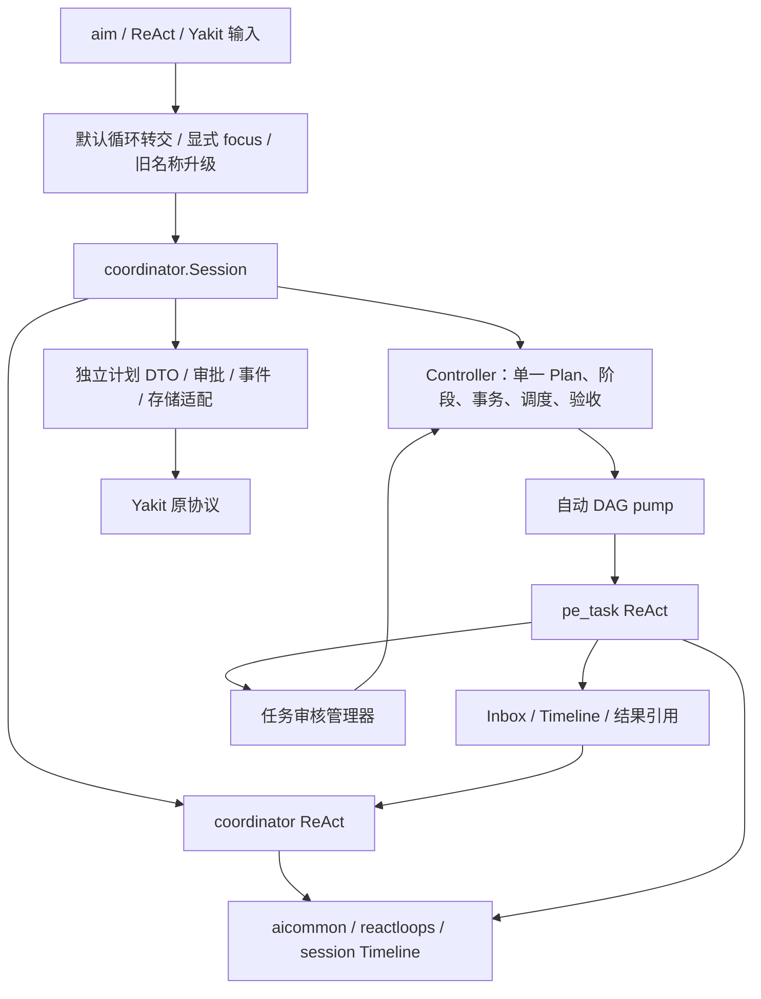

# AID Coordinator 新架构：Planner + Tasks

本文描述本次实现。新包位于 [coordinator](coordinator/README.md)，专注模式名为 coordinator，中文名为“任务协调”。接口字段和 Yakit 契约见 [接口文档](coordinator_interface_contract.md)。

旧引擎集中在同层 [coordinator_legacy](coordinator_legacy/README.md)，包含旧 Coordinator、任务、规划/执行循环、提示词、测试和示例。`aid` 根包只保留公共能力，不再承载旧实现或兼容别名。Go 调用方显式导入对应引擎，运行时事件和 Yakit 契约保持不变。

核对基线：yaklang main a0d6763d0d20a2c307f8e116ee3c1d45ceaad400；Yakit master 87904ea55a4af130b4fa8c22dc806405f62e3332。当前 ReAct / gRPC PLAN 入口统一使用新版；旧 focus 隐藏，历史旧计划停止执行。

## 1. 角色与协议

新系统只有两种 ReAct 循环：

| 角色 | 职责 | 不能自行做的事 |
| --- | --- | --- |
| coordinator | PLAN 调查、证据、文档及审批；EXEC 消息检查、YOLO 审核、调整和报告 | 执行业务命令/脚本、逐项派发、接受人工待审结果、主动正常退出 |
| pe_task | 执行批准的冻结任务书，产出 artifacts/evidence，提交结果 | 批准计划、接受自己的结果、修改调度、开启其他循环 |

两种循环均继承主循环的协议配置。文本模式使用流式 JSON @action 和声明的 AITAG，原生模式使用 tool_calls；中文指令按模式渲染，专属动作分别提供中文 Options 与 NativeOptions，由共享主循环构建对应参数定义。两种协议共用执行、校验与权限门禁；原生模式不接受文本 JSON action。客户端 Content 与存储格式保持不变。

旧 plan/replan/task-review JSON 循环不进入新路径。报告通过 create_report、modify_report、submit_report 完成，属于 EXEC 收尾，不增加第三种循环或阶段。调度、消息通知、人工任务审核管理与定时器不调用辅助模型。

## 2. 组件与依赖

入口约束位于 [aireact/coordinator.go](aireact/coordinator.go)。旧适配 [aireact/coordinator_legacy.go](aireact/coordinator_legacy.go) 不再被 PLAN 路由调用。[Session](coordinator/session.go) 实现 [Host](coordinator/controller.go) 的 Prepare、Approve、Execute、Changed，独立持有新调度器、任务运行体、输入镜像和生命周期。[PlanNode](coordinator/plan_wire.go) 只复用 Yakit JSON 字段，不继承旧 AiTask。

旧 coordinator_legacy.Coordinator、计划阶段和进度结构均不包含新版本判断、桥或 Snapshot 字段。辅助调用通过每个 Config 的执行器接口注入；新执行器直接使用原生 function call，旧 aiforge.LiteForge 保持原实现。共同基础设施只负责工具、消息、Timeline、观测与模型调用，不解释 PLAN 版本。

模型只能请求操作。状态由校验后的操作和实际 worker 退出更新；没有任意设置 completed 的 update_plan_status。状态快照按 revision 顺序发布，宿主获得独立副本，异步 worker 不持有可变草稿。

## 3. 计划与派发

create_plan 首次保存完整 Document 和无状态定义树，叶任务 DAG 从树派生。modify_plan 使用 document/document_patch/tasks/tasks_patch 对当前 Plan 的拷贝进行严格覆盖或 patch，最后校验并原子保存；没有双份 Draft/Approved 或计划版本。submit_plan 锁定审核内容，用户要求修订则恢复编辑，用户批准最终内容后才切换为 EXEC。

计划参数沿用旧版嵌套任务书及 sub_subtasks，使用稳定 identifier 和 depends_on；组的前置条件作用于入口叶任务，依赖组时等待其全部叶任务验收。旧客户端的嵌套 root_task 与逻辑 task_id 继续支持。宿主解析依赖，校验重复、未知引用及环，并保留未变任务的逻辑 ID。

批准即触发唯一 DAG pump，原子检查并发配额、状态和已验收依赖，登记 attempt_id，再在状态锁外构造 worker。批准、实际退出、审核通过、编辑与重试都自动重算就绪任务；模型没有 start_tasks。worker 冻结本次 Plan、任务书、直接前置的已验收结果和相关历史初步结果，受 PlanExecTaskConcurrency 限制。

EXEC 复用 modify_plan 的四参数编辑，不回退 PLAN、不再次请求计划审批。事务计算新旧 DAG 的受影响闭包，仅取消受影响尝试并等待实际退出，再原子采用新定义。未受影响 worker 保留 context、attempt 和冻结输入。拆分 A 为 A1/A2 时保留 A 的组身份；依赖 A 的后继等待全部新叶验收，无额外组审核。

PLAN 的调查子 Agent 复用 generic 管理器，默认关闭。只读调查权限同时约束声明和 handler；明确共享的新 Evidence 与终态清理通知唤醒空闲协调员，普通流式输出不唤醒。提交审核要求全部调查退出且结果已进入下一轮输入。私有 Timeline 不 MergeBack。

## 4. 消息、验收与恢复

worker 用 submit_task_result 提交摘要和实际 artifacts/evidence 引用，再通过既有 TODO 门闩结束。实际退出、Timeline 交接和清理完成后，统一保存结果并释放执行槽位。成功进入 awaiting_review；初始化失败、panic、无结果和取消走同一结算入口。只有 accepted 能放行依赖。

人工任务审核管理器用 session context 独立等待 task_review_require。用户通过直接进入公共审核状态机并推进 DAG；YOLO 由 inbox 通知协调员，以 review_task 判断实际证据、接受或要求深入。正常人工结果不强制唤醒主模型二次验收。

inbox 保存 task_discovery、task_settled、user_message、review_due 和 scheduler_blocked 的有界摘要与引用。关键消息不被淘汰；游标区分投递与决策边界，不等同于验收。回调只持久化与通知，当前 action/batch 完成后才交接下一批。inspect_task 是可选的单任务查询，默认有界状态与引用，需要时再读取详情或历史尝试。

wait_messages 与自动空闲等待共用实现，默认 30 秒、上限 60 秒。显式调用在已有消息时立即返回；自动等待不为已处理的普通人工结果反复调用模型。空超时仅检查运行时；review_due 对同任务同尝试的未处理提醒去重，不自动验收、不调用辅助模型。

retry_task 检查当前已结算尝试，原子分配下一尝试，并撤销受影响下游结果。若配额不足或依赖不满足，不部分改变旧验收。Timeline 保留历史调用和审阅，快照保存当前尝试及其身份。

cancel_tasks 先进入 cancelling，实际退出后才进入 cancelled，并明确处理依赖它的后继。旧 skip 回执同样等待真正退出。未解决失败或阻塞不能进入报告；明确取消/不再需要的目标可以收尾，但报告必须保留失败、重试和未完成范围。

schema 2 恢复保存当前 Plan、PLAN/EXEC、审核锁、当前及历史尝试、结果、inbox、投递/处理游标与当前报告。中断的 running/cancelling 恢复为 failed 并通知决策，不暗中重启；损坏游标被拒绝。旧 PLAN 不隐式导入新运行体。指定 start_task_id 只重置该任务及受影响后继，保留独立已完成工作。

EXEC 不开放正常 finish。全部任务已验收或明确解决、无 owned active/待审尝试及未处理关键消息时才开放报告动作。报告原子写入实例 artifacts，当前正文放入 SemiDynamic1。submit_report 交付最新正文；宿主再次检查用户要求与消息，包括完成快照发布期间到达的事件，然后自动结束。用户停止、取消及真实错误仍及时中断。

## 5. PLAN-only 与 detached

RunPlanOnly 使用同一个 coordinator 循环。完成批准后停在 plan_ready，不创建执行者，也不生成执行完成报告。

EnableDetachedPlan 使用旧 detached_plan_require 面板。submit_plan 保存待批准草稿并发布面板，不能启动 worker；协调员可结束本次规划。execute_detached_plan 接收 Yakit 的 plans.root_task 编辑，验证 session、计划阶段和 DAG，然后进入既有恢复队列执行批准内容。

持久化的 plan_engine 明确执行引擎归属；coordinator_state 保存后台快照。旧客户端仍发送原恢复消息，不需要知道新 actions 或状态枚举。

## 6. 上下文与权限

已有上下文结构继续生效：

1. 用户输入、澄清回答、选项及重做说明进入 session Timeline Open，再经冻结/压缩提升。
2. evidence 绑定 session journal，协调员与所有 worker 共享、去重并沿已有机制提升。
3. 当前 PLAN DOCUMENT 和无状态 PLAN DEFINITION 独立放入 SemiDynamic1；动态状态不写进文档。
4. Dynamic 顺序为 Timeline Open → PLAN STATUS → 微观 TODO → 系统运行状态，不附加永久 USER QUERY。
5. 定义树只含任务定义、稳定 ID 和依赖；前端显示所需的 description/tools/progress 由适配器提供。
6. 中文 PLAN/EXEC/报告角色经 promptloader 放入 SemiDynamic2；High Static 与 Frozen 不携带调度状态。新增消息批次进入 Timeline Open，工具声明只随真实阶段或报告能力边界变化。

协调员的工具调用经过显式内置读取/搜索 allowlist；文件写入限定在工作目录 artifacts 下的 Markdown，检查路径和符号链接。业务工具保留在 worker，继续继承会话的工具权限及审阅策略。不能通过动态加载或未知 MCP 工具绕过角色边界。

状态、消耗、prompt profile、能力 inventory、session snapshot 和 streams 继续由现有基础设施发送。调度和验收理由通过原有可见 stream 展示，不要求前端增加组件。

当前任务的 `user_intervention` 先写入共享 Timeline，再通知协调员；worker 不重复记录同一条输入。普通 `FreeInput` 保留外层队列的下一任务语义。关键词检索等继承新引擎的辅助调用也使用原生函数，不进入 JSON 响应动作路径。

## 7. 接入与验证

Go 显式使用 coordinator.NewSession 构造新运行体，提供 Run、RunPlanOnly、RunExecuteApprovedPlan、RunExecuteOnly。coordinator_legacy.NewCoordinatorContext 永远是旧版。ReAct 默认使用新版，aim.focus("coordinator") 可直接进入；旧 focus 名称在最上层升级为新版。aim.planEngine 是 focus 的兼容别名。Config 不携带 plan_engine；只有持久化保留该标记供恢复路由使用。RPC 消息定义不变。

测试覆盖自动 DAG、人工/YOLO 审核、局部拆分、受影响闭包、实际取消退出、重试历史、消息批次及游标、定时去重、报告门禁、真实 artifact、晚到用户消息、恢复、两种协议及原生参数校验。Yak/aim 四种执行组合使用 A/B 独立、C 依赖 A、D 依赖 B/C，运行实际读取工具、Evidence、任务与报告事件。采样、时序与验证记录见 [执行验收记录](coordinator/execution_review.md)。

确定性 provider 测试验证运行契约。实际模型任务质量、网关缓存命中率及完整 Yakit 人工交互仍需使用实际 provider 与前端进行后续探索。
