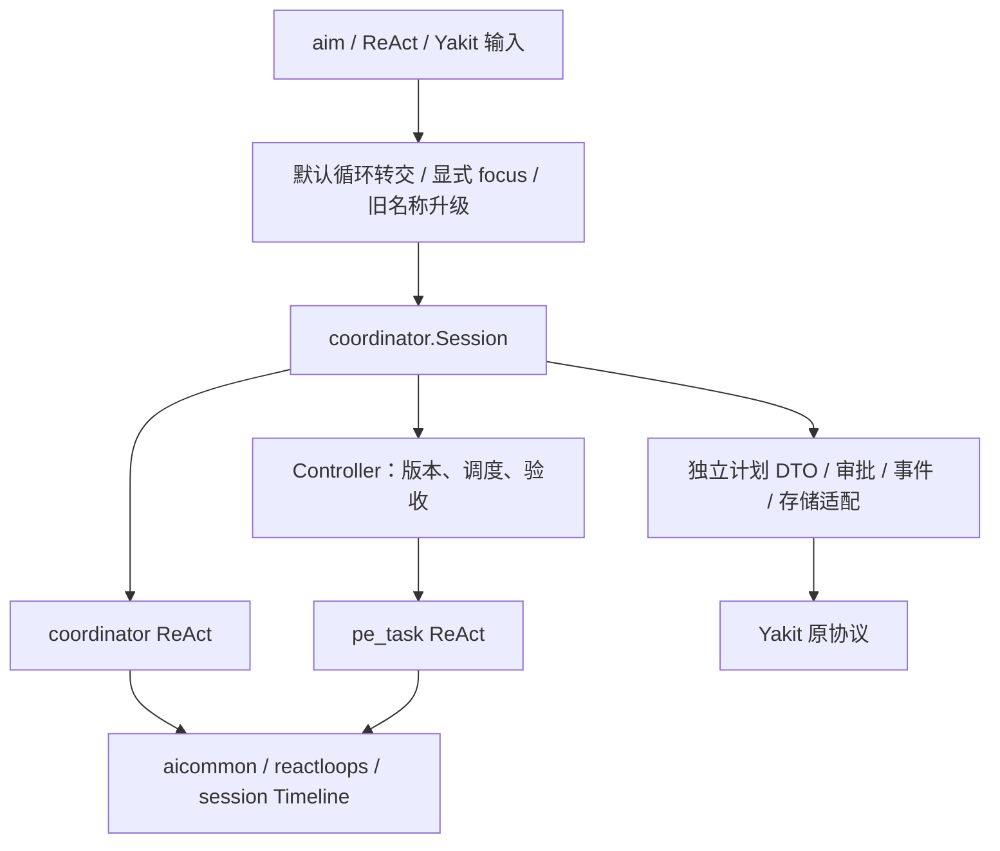

# AID Coordinator 新架构：Planner + Tasks

本文描述本次实现。新包位于 [coordinator](coordinator/README.md)，专注模式名为 coordinator，中文名为“任务协调”。接口字段和 Yakit 契约见 [接口文档](coordinator_interface_contract.md)。

旧引擎集中在同层 [coordinator_legacy](coordinator_legacy/README.md)，包含旧 Coordinator、任务、规划/执行循环、提示词、测试和示例。`aid` 根包只保留公共能力，不再承载旧实现或兼容别名。Go 调用方显式导入对应引擎，运行时事件和 Yakit 契约保持不变。

核对基线：yaklang main a0d6763d0d20a2c307f8e116ee3c1d45ceaad400；Yakit master 87904ea55a4af130b4fa8c22dc806405f62e3332。当前 ReAct / gRPC PLAN 入口统一使用新版；旧 focus 隐藏，历史旧计划停止执行。

## 1. 角色与协议

新系统只有两种 ReAct 循环：

| 角色 | 职责 | 不能自行做的事 |
| --- | --- | --- |
| coordinator | 探索、证据、计划文档、审批、调度、等待、验收、调整计划、报告 | 执行业务命令/脚本，递归开启其他 PLAN、专注循环或 sub-agent |
| pe_task | 执行批准的冻结任务书，产出 artifacts/evidence，提交结果 | 批准计划、接受自己的结果、修改调度、开启其他循环 |

两种循环均继承主循环的协议配置。文本模式使用流式 JSON @action 和声明的 AITAG，原生模式使用 tool_calls；中文指令按模式渲染，专属动作分别提供中文 Options 与 NativeOptions，由共享主循环构建对应参数定义。两种协议共用执行、校验与权限门禁；原生模式不接受文本 JSON action。客户端 Content 与存储格式保持不变。

旧 plan/replan/task-review JSON 循环不进入新路径。报告由协调员 write_report 完成；AI 风险评估和继承新引擎的压缩/附件等单步基础设施输出使用原生函数调用，不新增 ReAct 循环。

## 2. 组件与依赖

入口约束位于 [aireact/coordinator.go](aireact/coordinator.go)。旧适配 [aireact/coordinator_legacy.go](aireact/coordinator_legacy.go) 不再被 PLAN 路由调用。[Session](coordinator/session.go) 实现 [Host](coordinator/controller.go) 的 Prepare、Approve、Execute、Changed，独立持有新调度器、任务运行体、输入镜像和生命周期。[PlanNode](coordinator/plan_wire.go) 只复用 Yakit JSON 字段，不继承旧 AiTask。

旧 coordinator_legacy.Coordinator、计划阶段和进度结构均不包含新版本判断、桥或 Snapshot 字段。辅助调用通过每个 Config 的执行器接口注入；新执行器直接使用原生 function call，旧 aiforge.LiteForge 保持原实现。共同基础设施只负责工具、消息、Timeline、观测与模型调用，不解释 PLAN 版本。

模型只能请求操作。状态由校验后的操作和实际 worker 退出更新；没有任意设置 completed 的 update_plan_status。状态快照按 revision 顺序发布，宿主获得独立副本，异步 worker 不持有可变草稿。

## 3. 计划与派发

create_plan 保存完整候选文档和任务 DAG。modify_plan 使用确切草稿版本完整替换候选计划。草稿不会自动替换批准执行内容；submit_plan 通过独立审批适配器发出兼容事件，取得用户批准后才采用批准树。

计划参数沿用旧版嵌套任务书及 sub_subtasks，使用稳定 identifier 和 depends_on；组的前置条件作用于入口叶任务，依赖组时等待其全部叶任务验收。旧客户端的嵌套 root_task 与逻辑 task_id 继续支持。宿主解析依赖，校验重复、未知引用及环，并保留未变任务的逻辑 ID。

start_tasks 原子检查批准、并发配额、状态和依赖，登记新的 attempt_id 后立即返回。它只派发指定的可执行任务，不调用旧 runtime.Invoke 推进整棵树。省略 task_ids 时选择当前 ready 的 tasks，受 PlanExecTaskConcurrency 限制。

修改或删除活动任务，以及改变其上游输入，都必须先取消并等待实际退出。采用新的批准版本后，受影响的下游结果失效；未变且无受影响输入的结果保留。

## 4. 观察、验收与恢复

worker 用 submit_task_result 提交摘要和实际 artifacts/evidence 引用，再通过既有 TODO 完成门闩结束。执行成功进入 awaiting_review。inspect_tasks 和 wait_tasks 交付结果并登记已观察；协调员再以目标、结果及证据决定 accept/reject。只有 accepted 能放行依赖。

wait_tasks 使用状态通知。any 返回更新；all 等选中的已派发尝试全部结算；用户介入、批准版本改变或尝试替换会返回控制权。默认 30 秒，上限 60 秒，超时不取消 worker。

retry_task 检查当前已结算尝试，原子分配下一尝试，并撤销受影响下游结果。若配额不足或依赖不满足，不部分改变旧验收。Timeline 保留历史调用和审阅，快照保存当前尝试及其版本。

cancel_tasks 先进入 cancelling，worker 退出后才进入 cancelled。旧 skip 回执同样等待真正退出。取消未完成的必需任务不等于 PLAN 成功；协调员需要根据用户意图调整并重新批准计划，或由外层停止流程结束运行。

恢复保存草稿/批准/提交版本、状态、当前尝试、结果、观察和验收理由。中断的 running/cancelling 尝试恢复为 failed，不暗中重启。旧 PLAN 记录在恢复入队前返回停用错误；不隐式导入新运行体。指定 start_task_id 恢复时，只重置该任务及依赖它的结果，保留独立已完成工作。

正常 finish 检查当前草稿已批准、所有必需任务已观察并验收、无活跃 worker、微观 TODO 已解决，以及要求的报告已保存。prompt 构造后到达的新用户信息会阻止本轮 finish，必须先读取 Timeline。

## 5. PLAN-only 与 detached

RunPlanOnly 使用同一个 coordinator 循环。完成批准后停在 plan_ready，不创建执行者，也不生成执行完成报告。

EnableDetachedPlan 使用旧 detached_plan_require 面板。submit_plan 保存待批准草稿并发布面板，不能启动 worker；协调员可结束本次规划。execute_detached_plan 接收 Yakit 的 plans.root_task 编辑，验证 session、计划阶段和 DAG，然后进入既有恢复队列执行批准内容。

持久化的 plan_engine 明确执行引擎归属；coordinator_state 保存后台快照。旧客户端仍发送原恢复消息，不需要知道新 actions 或状态枚举。

## 6. 上下文与权限

已有上下文结构继续生效：

1. 用户输入、澄清回答、选项及重做说明进入 session Timeline Open，再经冻结/压缩提升。
2. evidence 绑定 session journal，协调员与所有 worker 共享、去重并沿已有机制提升。
3. 批准的 PLAN DOCUMENT 放入 SemiDynamic1；动态状态不写进文档。
4. Dynamic 顺序为 Timeline Open → PLAN STATUS → 微观 TODO → 系统运行状态，不附加永久 USER QUERY。
5. 无状态 PLAN TREE 的重新设计继续待定，放在后续独立步骤，不影响本次调度实现。

协调员的工具调用经过显式内置读取/搜索 allowlist；文件写入限定在工作目录 artifacts 下的 Markdown，检查路径和符号链接。业务工具保留在 worker，继续继承会话的工具权限及审阅策略。不能通过动态加载或未知 MCP 工具绕过角色边界。

状态、消耗、prompt profile、能力 inventory、session snapshot 和 streams 继续由现有基础设施发送。调度和验收理由通过原有可见 stream 展示，不要求前端增加组件。

当前任务的 `user_intervention` 先写入共享 Timeline，再通知协调员；worker 不重复记录同一条输入。普通 `FreeInput` 保留外层队列的下一任务语义。关键词检索等继承新引擎的辅助调用也使用原生函数，不进入 JSON 响应动作路径。

## 7. 接入与验证

Go 显式使用 coordinator.NewSession 构造新运行体，提供 Run、RunPlanOnly、RunExecuteApprovedPlan、RunExecuteOnly。coordinator_legacy.NewCoordinatorContext 永远是旧版。ReAct 默认使用新版，aim.focus("coordinator") 可直接进入；旧 focus 名称在最上层升级为新版。aim.planEngine 是 focus 的兼容别名。Config 不携带 plan_engine；只有持久化保留该标记供恢复路由使用。RPC 消息定义不变。

本次测试覆盖批准/依赖、重复派发、观察与验收、重试失效、版本冲突、活动下游保护、取消真实退出、通知等待、any/all、快照恢复、panic、两种协议继承、原生模式拒绝文本 JSON 动作及错误参数校验、worker 结果门闩、PLAN-only、detached 编辑恢复、干预记录时序、风险评估及辅助原生输出。真实 Yak 引擎执行 aim 脚本，核对真实文件读取、两个依赖任务、共享 evidence、报告和 Yakit push/pop/loop_marker 事件。

确定性 provider 测试验证运行契约。实际模型任务质量、网关缓存命中率及完整 Yakit 人工交互仍需使用实际 provider 与前端进行后续探索。
