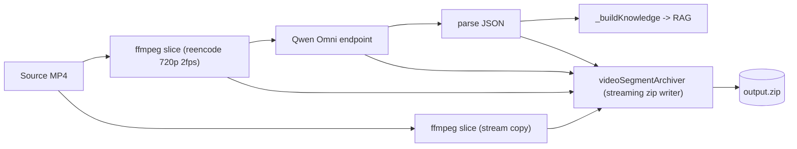

# Video Omni Pipeline 开发者文档

> 关键词：视频知识清洗 视频知识库 omni 视频理解 qwen-omni ffmpeg 切片 RAG zip 归档
>
> 适用对象：yaklang 仓库的 Go 开发者；二次开发 yak 脚本/插件的工程师；想接入新多模态模型的扩展者。
>
> 适用场景：把课程录屏 / 渗透实战录像 / 安全研究视频 / 演讲投影录制等"视频学习材料"
> 转化为可被检索、可被再加工（蒸馏 skills、生成卷宗、跨段聚合）的知识资产。

本文档覆盖：

1. 我们要解决的问题
2. 整体架构与数据流
3. 代码组织（哪个文件干什么）
4. 关键 API 速查（Go 与 yak 两套表）
5. 端到端使用方式（yak 脚本与 Go 调用）
6. 三个 omni 模型的实测 token 与时延对比
7. 调优要点（绕开多模态报错、控制 token 与体积）
8. 从 zip 出发：如何离线蒸馏 skills
9. 已知坑与故障排查
10. 扩展指引（如何加新多模态模型）
11. 后续路线

## 1. 我们要解决的问题

视频是密度极高的学习材料：人眼看一遍 5 分钟的安全实战录像，胜读十页文章。
但视频本身不可被搜索、不可被聚合、不可被复用。我们需要一条管线，
把"看视频"这件事变成"得到一组结构化、可索引、可再蒸馏的知识条目"，并且：

-   全程 **可控成本**：token 不爆、单段不超模型上限、API 限速可被反压。
-   全程 **可追溯**：原始切片、模型原始返回、解析 JSON 都要落盘，
    后续调整 prompt / 换模型 / 蒸馏 skills 时不必再花一遍模型钱。
-   **不破坏旧链路**：图片帧抽取 + 多模态分析的旧路径完全保留；
    新增 video-direct 路径作为可选项，旧脚本与签名都不动。

## 2. 整体架构



三层结构：

-   **ffmpeg 层**：`ffmpegutils.ExtractVideoSliceFromVideo`，输出 `*VideoSliceResult` 实时 channel
    与回调，支持 stream copy（再加工友好）与 720p/2fps 重编码（送模型友好）双模式。
-   **aispec / 千问 omni 通路**：`aispec.WithVideoUrl` / `WithVideoBase64` / `WithVideoRaw`，
    在 ChatMessage 内自动设置 `modalities=["text"]`、`stream_options.include_usage=true`、
    把 `video_url` 排在 `text` 之前，并对相同 URL 做去重，规避 "Multiple inputs of the same modality"。
-   **aiforge 知识管线**：`AnalyzeVideoOmni` -> `*VideoOmniSegmentResult` ->
    `BuildVideoKnowledgeFromOmni` -> `_buildKnowledge` -> RAG 入库。
    可选的 `videoSegmentArchiver` 把整条流的所有素材落入一个 zip。

zip 内部固定结构：

```
{kbName}-{model}-{yyyymmdd_HHMMSS}.zip
├── manifest.json
├── README.md
└── segments/
    ├── slice_00000/
    │   ├── streamcopy.mp4
    │   ├── reencoded.mp4
    │   ├── omni_raw_response.txt
    │   ├── analysis.json
    │   └── dump.md
    └── slice_00001/...
```

## 3. 代码组织

```
common/utils/ffmpegutils/
    ffmpeg_segment.go              # ExtractVideoSliceFromVideo 实现
    ffmpeg_segment_test.go         # smoke 测试
    ffmpeg_options.go              # WithSlice* / WithSlicePresetForOmni 等选项

common/ai/aispec/
    config.go                      # WithVideoUrl/Base64/Raw、AIConfig.Videos
    base.go                        # chatBaseChatCompletions：视频 url 注入 + 去重 + 顺序
    msg.go                         # ChatMessage.Modalities / StreamOptions / Content.VideoUrl

common/ai/tongyi/gateway.go        # 把 g.config.Videos 注入到 chat options
common/ai/gateway.go               # AIChatExports：videoUrl/videoBase64/videoRaw 三个 yak 导出
common/mediautils/ffmpeg.go        # 把 ExtractVideoSliceFromVideo + WithSlice* 暴露给 yak

common/aiforge/
    liteforge_analyze_video_omni.go    # AnalyzeVideoOmni、VideoOmniConfig、VideoOmniSegmentResult
    liteforge_video_archiver.go        # videoSegmentArchiver：流式 zip 归档
    liteforge_refine.go                # BuildVideoKnowledgeFromOmni：注入 kbName + 接 RAG
    liteforge_exports.go               # liteforge.* yak 导出
    example/
        build-video-knowledge-omni.yak           # KB 入库样例
        build-video-knowledge-omni-with-zip.yak  # KB + zip 归档样例
    VIDEO_OMNI_PIPELINE.md         # 本文档
```

## 4. 关键 API 速查

### 4.1 ffmpeg 切片层

| Go API | yak 名 | 作用 |
| --- | --- | --- |
| `ffmpegutils.ExtractVideoSliceFromVideo` | `ffmpeg.ExtractVideoSliceFromVideo` | 实时返回 `chan *VideoSliceResult` |
| `WithSliceDurationSeconds(s)` | `ffmpeg.withSliceDurationSeconds` | 段长（秒） |
| `WithSliceReencode(b)` | `ffmpeg.withSliceReencode` | true: 重编码；false: stream copy |
| `WithSliceMaxHeight(h)` | `ffmpeg.withSliceMaxHeight` | 重编码最大高度（默认 720） |
| `WithSliceTargetFPS(f)` | `ffmpeg.withSliceTargetFPS` | 重编码目标帧率（默认 2，贴合 omni 抽样率） |
| `WithSliceLoadRawData(b)` | `ffmpeg.withSliceLoadRawData` | 是否同步把 mp4 字节带进 result |
| `WithSliceCallback(fn)` | `ffmpeg.withSliceCallback` | 每段一次的回调 |
| `WithSliceOutputDir(dir)` | `ffmpeg.withSliceOutputDir` | 切片落盘目录（默认临时目录） |
| `WithSlicePresetForOmni(name)` | `ffmpeg.withSlicePresetForOmni` | turbo=30s / flash=120s / plus=120s 预设 |

`VideoSliceResult` 字段：`Index / FilePath / StartTime / EndTime / SizeBytes / RawData / Error`。

### 4.2 aiforge omni 视频通路

| Go API | yak 名 | 返回值 |
| --- | --- | --- |
| `aiforge.AnalyzeVideoOmni(video, opts...)` | `liteforge.AnalyzeVideoOmni` | `<-chan AnalysisResult`（每段一条 `*VideoOmniSegmentResult`） |
| `aiforge.BuildVideoKnowledgeFromOmni(kbName, video, opts...)` | `liteforge.BuildVideoKnowledgeFromOmni` | `<-chan *schema.KnowledgeBaseEntry`（直接接入 RAG） |

可用选项：

| Go option | yak 名 | 说明 |
| --- | --- | --- |
| `VideoOmniPresetTurbo / Flash / Plus` | `liteforge.omniPresetTurbo() / Flash() / Plus()` | 一键预设模型 + 段长 |
| `WithVideoOmniType` | `liteforge.omniType` | 默认 tongyi |
| `WithVideoOmniModel` | `liteforge.omniModel` | 覆盖模型名（preset 之后调用以覆盖） |
| `WithVideoOmniAPIKey` | `liteforge.omniAPIKey` | DashScope key |
| `WithVideoOmniBaseURL` | `liteforge.omniBaseURL` | 自定义 endpoint |
| `WithVideoOmniSegmentSeconds` | `liteforge.omniSegmentSeconds` | 覆盖段长 |
| `WithVideoOmniReencode` | `liteforge.omniReencode` | 是否重编码（默认 true） |
| `WithVideoOmniMaxHeight` | `liteforge.omniMaxHeight` | 重编码最大高度 |
| `WithVideoOmniTargetFPS` | `liteforge.omniTargetFPS` | 重编码目标 fps |
| `WithVideoOmniMaxBase64Bytes` | `liteforge.omniMaxBase64Bytes` | 单段字节上限（默认 7MB） |
| `WithVideoOmniMaxSegments` | `liteforge.omniMaxSegments` | 最多分析多少段（=0 表示不限） |
| `WithVideoOmniProgressCallback` | `liteforge.omniProgressCallback` | 段产出回调 |
| `WithVideoOmniSystemPrompt` | `liteforge.omniSystemPrompt` | 自定义系统提示 |
| `WithVideoOmniQueryPrompt` | `liteforge.omniQueryPrompt` | 自定义查询 |
| `WithVideoOmniTimeout` | `liteforge.omniTimeout` | 单段调用超时 |
| `WithVideoOmniContext` | `liteforge.omniContext` | 取消上下文 |
| `WithVideoOmniZipFile` | `liteforge.omniZipFile` | 显式 zip 文件路径（优先级最高） |
| `WithVideoOmniZipDir` | `liteforge.omniZipDir` | zip 输出目录，运行时按 `{kbName}-{model}-{ts}.zip` 自动命名 |

### 4.3 aispec 多模态原语

一般场景不用直接接触，但写自定义 forge 时可能用到：

| Go option | yak 名 | 作用 |
| --- | --- | --- |
| `aispec.WithVideoUrl(url)` | `ai.videoUrl` | 视频 URL（http / data:;base64） |
| `aispec.WithVideoBase64(b64)` | `ai.videoBase64` | 自动拼成 `data:;base64,...` |
| `aispec.WithVideoRaw(bytes)` | `ai.videoRaw` | 字节流自动 base64 |

## 5. 端到端使用方式

### 5.1 yak 脚本：仅 KB 入库（无 zip 归档）

参见 [`example/build-video-knowledge-omni.yak`](./example/build-video-knowledge-omni.yak)：

```shell
# 优先 env，回退到本地 key 文件
export DASHSCOPE_API_KEY=sk-***
yak example/build-video-knowledge-omni.yak \
    --video /path/to/lecture.mp4 \
    --model flash \
    --kb-name my-lecture-flash \
    --max-segments 3
```

### 5.2 yak 脚本：KB + zip 归档（推荐生产用）

参见 [`example/build-video-knowledge-omni-with-zip.yak`](./example/build-video-knowledge-omni-with-zip.yak)：

```shell
export DASHSCOPE_API_KEY=sk-***
yak example/build-video-knowledge-omni-with-zip.yak \
    --video /path/to/lecture.mp4 \
    --model plus \
    --max-segments 1 \
    --zip-dir /tmp/video-omni-zips
```

执行结束后，`/tmp/video-omni-zips/` 下会得到一个 zip，
用 `unzip -l` 即可看到清晰的 `manifest.json + segments/slice_*/` 结构。

### 5.3 yak 脚本：纯切片自检（不走模型）

```yak
ch, _ = ffmpeg.ExtractVideoSliceFromVideo("/path/lecture.mp4",
    ffmpeg.withSliceReencode(true),
    ffmpeg.withSliceDurationSeconds(60),
)
for s in ch {
    log.info("slice idx=%v path=%v size=%v", s.Index, s.FilePath, s.SizeBytes)
}
```

### 5.4 Go 调用：直接在仓库里写一个工具

```go
package main

import (
    "fmt"
    "os"

    "github.com/yaklang/yaklang/common/aiforge"
)

func main() {
    apiKey := os.Getenv("DASHSCOPE_API_KEY")
    if apiKey == "" {
        panic("DASHSCOPE_API_KEY not set")
    }

    entries, err := aiforge.BuildVideoKnowledgeFromOmni(
        "demo-kb",
        "/path/to/lecture.mp4",
        aiforge.VideoOmniPresetPlus(),
        aiforge.WithVideoOmniAPIKey(apiKey),
        aiforge.WithVideoOmniMaxSegments(1),
        aiforge.WithVideoOmniZipDir("/tmp/video-omni-zips"),
    )
    if err != nil {
        panic(err)
    }

    for entry := range entries {
        fmt.Printf("[kb] title=%s\n", entry.KnowledgeTitle)
    }
}
```

## 6. 三个 omni 模型实测对比

测试源：约 1080p / 5 fps、含中文配音 + 屏幕代码的安全教学录屏；
单段 reencode 后落到 720p / 2 fps。

| 模型 | 段长预设 | 段大小（base64 后） | omni 单段时延 | 备注 |
| --- | --- | --- | --- | --- |
| `qwen-omni-turbo` | 30 s | ~2 MB | ~200 s | 标称上限 40 s，必须切短 |
| `qwen3-omni-flash` | 120 s | ~4 MB | ~200 s | 标称上限 150 s |
| `qwen3.5-omni-plus` | 120 s | ~4 MB | ~15~30 s | 文档写 1 h，但 base64 实际 < 150 s 才稳 |

> 所有数值是单 API 调用墙钟，真实 KB 入库还要叠加 RAG embedding 写入。
> `plus` 速度优势显著，是当前生产首选；`flash` 为成本平衡选项；`turbo` 只在不能用前两者时使用。

token 估算（来自百炼公开文档）：

-   视觉 token ≈ `ceil(actual_frames × resized_h × resized_w / (32×32))`，其中
    `actual_frames = min(time_sec × 2, model_max_frames)`。
-   音频 token：`plus 7 / s`、`flash 12.5 / s`、`turbo 25 / s`。
-   1080p / 5 fps 源直接 stream copy 时，base64 容易把单段做到 > 10 MB，必须重编码。

## 7. 调优要点

1. **`reencode=true` 默认开**：720p / 2 fps 是 omni 的"经济舱"，token 与体积都最优。
2. **`MaxBase64Bytes` 默认 7 MB**：留出阿里云 10 MB 上限的余量，单段超过会自动跳过并打日志。
3. **段长不能贴限值**：实测 `plus` 标称 1 h 实则 base64 大于约 150 s 就会触发 "video file is too long"；
    现已默认到 120 s。
4. **`modalities=["text"]` 必须显式**：否则 omni 会按多模态输出走 sse 流，
    `aispec.chatBaseChatCompletions` 已自动设置。
5. **`stream_options.include_usage=true`**：omni 多模态调用强制要求，
    缺失会被 DashScope 直接拒。
6. **`video_url` 必须在 `text` 之前**：omni 内部解析顺序敏感。
7. **重复 `WithVideoUrl` 必须去重**：内部 `LoadOption` 会被多次调用，
    若不在 ChatContent 组装阶段按 URL 去重就会变成"同模态多输入"被拒。
8. **`data:;base64,...` 不带 mime**：与 image base64 不同；带 mime 的 video 会被 omni 当作非法。

## 8. 从 zip 出发：离线蒸馏 skills

`zip` 不是终点而是"原料库"。建议的下一步：

1. **重新跑模型不花切片钱**：解压 `streamcopy.mp4` 后用 `aiforge.AnalyzeVideoOmni`
    + 自定义 prompt 直接对其再跑一遍，例如把 prompt 换成"把这一段视频压缩成 cybersecurity skill"，
    省去重新切片 / 重编码 / I/O 的开销。
2. **人工审校再回灌 RAG**：编辑 `dump.md`，把不准确的 storyline 修正后通过
    `aiforge.BuildKnowledgeFromBytes` 重新进 KB；原 KB 不动，作为新版本平滑迭代。
3. **跨段 storyline 聚合**：合并所有 `analysis.json`，按时间序构造大纲与因果链，
    再灌入 KB 作为 "meta knowledge"。
4. **批量化离线作业**：用一个 yak 脚本读 `manifest.json`，并行对多 zip 做加工，
    写回新的 zip / KB。

## 9. 已知坑与故障排查

| 现象 | 排查 |
| --- | --- |
| `Multiple inputs of the same modality or mixed modality inputs are currently not applicable to the omni model` | 同 URL 视频被加了多次，确认 `aispec` 内部已做 URL 去重；自定义代码不要手动 append 重复 video |
| `The video modality input does not meet the requirements because: The video file is too long` | 段长太长。`plus` 段长降到 ≤ 120 s |
| `streaming output is required` | 没设置 `modalities=["text"]` 或 `stream_options.include_usage=true`，已在 base.go 自动注入 |
| 切片 channel 卡死 | 检查源视频是否损坏；ffmpeg 日志看 stderr；`MaxSegments` 触发后会自动 cancel |
| zip 大小为 0 | 大概率 archiver 没拿到任何分片：先用 `--only-slice` 自检分片正常 |
| RAG 入库为 0 | 可能 omni 段全部超 `MaxBase64Bytes`；放大限制或减小段长再跑 |
| API key 不能进 git | yak 脚本走 `os.Getenv("DASHSCOPE_API_KEY")` 优先，回退本地 key 文件；不要把 key 文件 commit 进仓库 |

## 10. 扩展指引：如何接入新的多模态视频模型

以接入"另一家厂商的多模态 chat-completions"为例：

1. **gateway 层**：在 `common/ai/<vendor>/gateway.go` 的 `Chat` 函数中追加
    `aispec.WithChatBase_VideoRawInstance(g.config.Videos...)`，复用 aispec 已有的视频通路。
2. **数据格式差异**：如果对方要求 `data:video/mp4;base64,...`（带 mime），
    可以在 vendor gateway 里自己拦一层把 dataURI 改写；不要去动 `aispec.WithVideoBase64` 的默认实现。
3. **modalities / stream_options**：如果对方不需要这些字段，
    可以在 vendor gateway 里清掉 ChatMessage 上的对应字段后再发出。
4. **aiforge 层**：扩展 `VideoOmniConfig.AIType` 支持新 type 名（同 `aispec.WithType`）；
    `WithVideoOmniType("<vendor>")` 即可切换。
5. **预设**：如果新模型也想要 preset，仿照 `VideoOmniPresetPlus` 加一个 `VideoOmniPresetXxx`，
    强制覆盖 `c.Model`，并在 `liteforge_exports.go` 暴露。

## 11. 后续路线

-   **多视频合并 KB**：脚本统一管理多个 zip 与多个 source video，按统一 kbName 入库。
-   **跨段 storyline 关联图**：在 `_buildKnowledge` 之后再追加一层结构化 meta 知识。
-   **审核回灌闭环**：人工修订 `dump.md` 后回灌 RAG，KB 版本化管理。
-   **更细粒度的成本预算**：把 omni usage 字段（`include_usage` 已开启）落到 manifest，
    给后续蒸馏决策提供可观测性。
-   **接入更多模型**：在 `aispec.VideoDescription` 上扩展，支持本地多模态模型 / 其他云厂商。

## 12. 安全与合规提醒

-   **API key 只放本地或环境变量**：仓库内任何 yak 脚本 / 文档 / 测试 不允许出现真实 key；
    例子统一以 `os.Getenv("DASHSCOPE_API_KEY")` 或 `~/yakit-projects/tongyi-apikey.txt`
    （用户自己机器上的占位文件）作为来源。
-   **视频内容版权与隐私**：本管线只做技术演示，使用方需自行确认上传到云端模型的视频版权
    与隐私合规（含人脸 / 商标 / 内部代码等）。
-   **zip 归档可能含敏感画面**：`zip-dir` / `zip-file` 应放置在受控目录，
    避免与第三方共享时无意泄漏。
