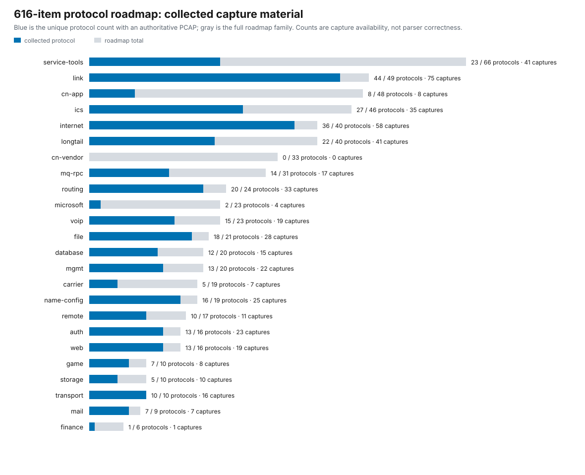

# Protocol corpus evidence report

This report is generated from `sources.json`, the pinned capture bytes and `protocol_roadmap.go`. It reports material availability only; it does not promote any roadmap status.

- Roadmap: **616** protocols; 211 `done`, 0 `partial`, 405 `todo`.
- Corpus: **384 capture files**, **58044 packets**, **10450469 bytes**.
- Direct roadmap material: **337 unique protocols**; outside-roadmap candidates: **24 captures**.
- Evidence classes: 204 positive upstream, 16 negative/boundary upstream, 3 official educational challenge, 161 locally generated.

## Source distribution

| Source | Captures | Packets |
| --- | ---: | ---: |
| `generated-local` | 161 | 349 |
| `google-challenges` | 3 | 17747 |
| `iti-ics` | 4 | 18 |
| `mgadelha-sv` | 1 | 10161 |
| `mrhenrike-pcap` | 1 | 986 |
| `ndpi` | 176 | 27761 |
| `scapy` | 6 | 264 |
| `tcpdump` | 14 | 13 |
| `wireshark-tests` | 18 | 745 |

## Roadmap family distribution

| Family | Roadmap protocols | With collected capture | Capture files |
| --- | ---: | ---: | ---: |
| `service-tools` | 66 | 35 | 36 |
| `link` | 49 | 36 | 36 |
| `cn-app` | 48 | 9 | 9 |
| `ics` | 46 | 30 | 36 |
| `internet` | 40 | 34 | 35 |
| `longtail` | 40 | 7 | 8 |
| `cn-vendor` | 33 | 1 | 1 |
| `mq-rpc` | 31 | 14 | 14 |
| `routing` | 24 | 19 | 20 |
| `microsoft` | 23 | 2 | 2 |
| `voip` | 23 | 16 | 17 |
| `file` | 21 | 18 | 21 |
| `database` | 20 | 12 | 12 |
| `mgmt` | 20 | 15 | 17 |
| `carrier` | 19 | 4 | 5 |
| `name-config` | 19 | 17 | 21 |
| `remote` | 17 | 9 | 9 |
| `auth` | 16 | 15 | 16 |
| `web` | 16 | 13 | 14 |
| `game` | 10 | 7 | 7 |
| `storage` | 10 | 6 | 6 |
| `transport` | 10 | 10 | 10 |
| `mail` | 9 | 7 | 7 |
| `finance` | 6 | 1 | 1 |

**Figure 1 | Authoritative capture material by roadmap family.** Blue marks unique roadmap protocols with at least one collected file; the gray extent is the full family backlog. Exact values are printed, so color is not the only encoding.

## Interpretation limits

A capture mapped to a roadmap item establishes available test material, not complete protocol coverage. A single PCAP may exercise only one PDU, direction or version. Negative captures are kept separately because malformed input and false-positive resistance are part of parser robustness. `outside-roadmap-candidates.csv` records useful discoveries without pretending they were already among the 616 items.
