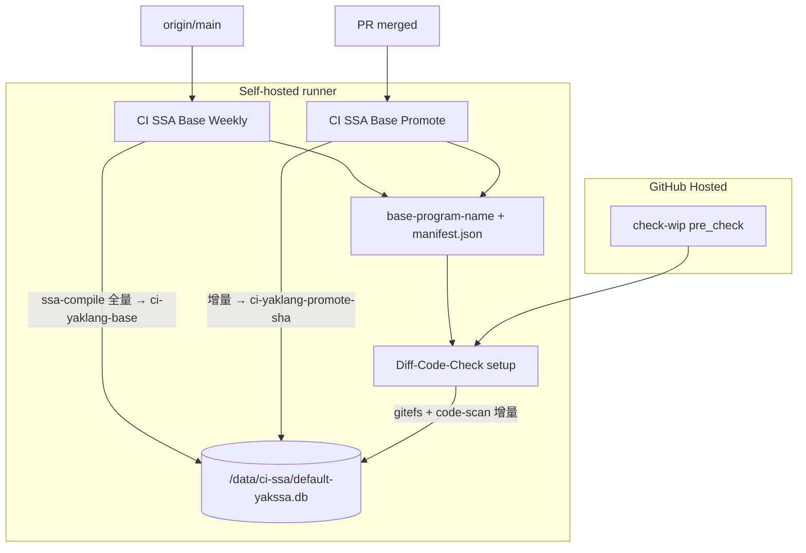

# CI 基础设施（SSA 增量扫描）

在 **GitHub Self-hosted Runner** 上维护持久 SSA 数据库，实现：

- **每周五**：对 `main` 分支做 **yaklang 全量** golang 编译，写入基线 program `ci-yaklang-base`，并压平 overlay
- **每个 PR**：基于当前有效基线做 **增量编译 + SyntaxFlow 扫描**（`diff-code-check`）
- **PR 合并后**：相对上次 `manifest.main_sha` 做 **增量 promote**，切换有效基线 pointer，清理该 PR 的 diff program

`check-wip` 等轻量步骤仍在 GitHub 托管 runner（`ubuntu-22.04`）上执行；**编译与扫描**在自建机上执行。

---

## 架构概览



| 角色 | 名称 | 含义 |
|------|------|------|
| 全量基线 program | `ci-yaklang-base` | 每周五全量编译；weekly 后 pointer 指向它 |
| 有效基线 | `$SSA_CI_DATA_DIR/base-program-name` | 当前 PR 扫描 / 下次 promote 使用的 program 名（可能是 promote overlay） |
| Promote program | `ci-yaklang-promote-{sha8}` | PR 合并后相对旧 tip 增量编译出的新基线 |
| PR diff program | `ci-yaklang-diff-pr-{N}-{sha8}` | 每次 PR 扫描生成的增量 layer |
| SSA 库文件 | `$SSA_CI_DATA_DIR/default-yakssa.db` | 默认 `/data/ci-ssa/default-yakssa.db` |
| 本地 manifest | `$SSA_CI_DATA_DIR/manifest.json` | 记录 `main_sha` / 有效 `base_program_name`（promote 依赖） |

Weekly 与 Promote 共用 concurrency group **`ci-ssa-database`**，避免并发写库。

---

## Workflows

| Workflow | 文件 | 触发 | Runner | 说明 |
|----------|------|------|--------|------|
| CI Infra Smoke | [ci-infra-smoke.yml](../../.github/workflows/ci-infra-smoke.yml) | PR（改 ci 相关路径）、手动 | `ubuntu-22.04` + 可选 self-hosted | 连通性探测；`self-hosted-smoke` **仅**手动 |
| CI SSA Base Weekly | [ci-ssa-base-weekly.yml](../../.github/workflows/ci-ssa-base-weekly.yml) | **周五 20:00 UTC**、`workflow_dispatch` | `[self-hosted, linux, ssa-ci]` | 全量编译、重置 pointer、清理 stale overlay |
| CI SSA Base Promote | [ci-ssa-base-promote.yml](../../.github/workflows/ci-ssa-base-promote.yml) | PR **merged**（路径过滤）、手动 | `[self-hosted, linux, ssa-ci]` | 增量更新有效基线 |
| Diff-Code-Check | [diff-code-check.yml](../../.github/workflows/diff-code-check.yml) | PR → `main`（路径过滤） | `check-wip`: hosted；`setup`: self-hosted | 安全扫描与 PR 评论 |

### Diff-Code-Check / Promote 路径过滤（会触发）

- `common/**`
- `.github/workflows/diff-code-check.yml`、`ci-ssa-base-weekly.yml`、`ci-ssa-base-promote.yml`
- `scripts/ci-ssa/**`、`scripts/ssa-risk-tools/**`、`scripts/get-yak-version.sh`
- `common/ssa_bootstrapping/ci_rule/**`

### 安全策略

- self-hosted job **不对 fork PR 运行**（`head.repo.full_name == github.repository`）
- Promote 仅在 `merged == true` 时执行
- 自建机会执行 PR / main 代码，请勿对不可信 fork 放开 self-hosted job

---

## 与 Git 的对应关系（重要）

| 阶段 | Git 语义 | CI 行为 |
|------|----------|---------|
| 周五基线 | `main` 当前 tip | 全量编译 → `ci-yaklang-base`；pointer 重置；清理 `promote-*` / `diff-pr-*` |
| PR 变更集 | `merge-base(main, PR_HEAD) .. PR_HEAD` | `yak gitefs` → `fs.zip`；相对 **pointer 有效基线** 增量扫描 |
| PR 合并 promote | `manifest.main_sha .. origin/main` | `gitefs` + 增量编译 → `ci-yaklang-promote-{sha8}`；更新 pointer 与 manifest |

说明：合并后有效基线会跟随 main tip；周五全量仍是纠偏锚点（压平 overlay 链、回收磁盘）。

---

## 一次性部署（自建机）

### 1. 机器与系统

| 场景 | CPU | 内存 | 磁盘 | 系统 |
|------|-----|------|------|------|
| 试跑 weekly | 4C | 16G | ≥100G | Ubuntu **22.04** amd64 |
| 推荐生产 | 8C | 32G | ≥200G 数据盘 | Ubuntu 22.04 amd64 |

需稳定 **出站**：`github.com`、`aliyun-oss.yaklang.com`（下载 yak 二进制）。建议安装 **`unzip` / `jq`**（promote 空 diff 检测与 manifest 写入依赖）。

### 2. 安装 GitHub Actions Runner

1. 仓库 **Settings → Actions → Runners → New self-hosted runner**
2. 按官方说明在 Linux 上安装 [actions-runner](https://github.com/actions/runner)
3. 注册时添加 labels（与 workflow 一致）：
   - `self-hosted`
   - `linux`
   - `ssa-ci`
4. 建议用 **systemd** 托管 runner，保证重启后在线

### 3. SSA 数据目录

```bash
sudo mkdir -p /data/ci-ssa
sudo chown "$(whoami):$(whoami)" /data/ci-ssa
```

可选：在仓库 **Settings → Variables** 新增 `SSA_CI_DATA_DIR`（例如 `/data/ci-ssa`）。  
未设置时脚本默认 `/data/ci-ssa`，数据库文件为：

```text
/data/ci-ssa/default-yakssa.db
/data/ci-ssa/manifest.json
/data/ci-ssa/base-program-name
```

环境变量（由 [export-ssa-db-env.sh](../../scripts/ci-ssa/export-ssa-db-env.sh) 导出）：

| 变量 | 含义 |
|------|------|
| `SSA_CI_DATA_DIR` | 数据根目录 |
| `SSA_DATABASE_RAW` | SQLite SSA 库完整路径 |
| `CI_SSA_BASE_PROGRAM` | 有效基线 program 名（优先读 pointer 文件） |

### 4. 首次生成基线（必做）

1. Actions → **CI SSA Base Weekly** → **Run workflow**
2. 等待完成（全仓 golang 编译，可能 **数小时**，视机器而定）
3. 确认步骤 **Verify base program** 通过
4. 确认自建机存在 `/data/ci-ssa/manifest.json` 与 `base-program-name`
5. 在 Artifacts 下载 **ci-ssa-manifest**，核对 `main_sha`、`size_bytes`

未完成此步前，PR 的 **Diff-Code-Check** / **Promote** 会失败并提示先跑 weekly。

### 5. 验证（可选）

| 步骤 | 操作 |
|------|------|
| 托管 smoke | 开 PR 改 `docs/ci-infra` 或 `scripts/ci-ssa`，看 **hosted-smoke** / **storage-probe** |
| 自建 smoke | 手动 Run **CI Infra Smoke**，看 **self-hosted-smoke** |
| PR 扫描 | 开修改 `common/**` 的 PR，看 **Diff-Code-Check** |
| Promote | 合并该 PR 后看 **CI SSA Base Promote**；或手动 `workflow_dispatch` |

---

## 每周五全量 job 做了什么

[ci-ssa-base-weekly.yml](../../.github/workflows/ci-ssa-base-weekly.yml) 步骤摘要：

1. `checkout` **`main`**
2. `install-yak-ci.sh` — 从 OSS 拉取与 diff-check 相同策略的 yak 版本
3. `yak sf-import` — 导入 `common/ssa_bootstrapping/ci_rule/`
4. `yak ssa-compile --config ci-yaklang-base-compile.json --database $SSA_DATABASE_RAW --re-compile`
5. `ensure-base-program.sh` — 确认 `ci-yaklang-base` 已写入 DB
6. `write-local-manifest.sh` — 写入数据目录 manifest + 重置 pointer 为 `ci-yaklang-base`
7. `cleanup-stale-overlay-programs.sh` — 删除 `ci-yaklang-promote-*` / `ci-yaklang-diff-pr-*`
8. 上传 artifact **ci-ssa-manifest**

全量配置见 [ci-yaklang-base-compile.json](../../scripts/ci-ssa/ci-yaklang-base-compile.json)。

---

## PR 增量扫描做了什么

[diff-code-check.yml](../../.github/workflows/diff-code-check.yml) 的 `setup` job（self-hosted）：

1. 安装 yak、设置 `SSA_DATABASE_RAW` / `CI_SSA_BASE_PROGRAM`（来自 pointer）
2. `git checkout` PR head，`gitefs` 生成 `fs.zip`
3. `ensure-base-program.sh`
4. `generate-diff-scan-config.sh` → `scan-config.json`（program 名 `ci-yaklang-diff-pr-{PR}-{sha8}`，`base_program_name` = 有效基线）
5. `yak code-scan --config scan-config.json --database $SSA_DATABASE_RAW`

---

## PR 合并 Promote 做了什么

[ci-ssa-base-promote.yml](../../.github/workflows/ci-ssa-base-promote.yml)：

1. `checkout` / 同步 `origin/main`
2. 读取 `$SSA_CI_DATA_DIR/manifest.json` 的 `main_sha`
3. `yak gitefs --start $OLD_SHA --end $NEW_SHA`
4. 若 diff 非空：`yak ssa-compile` 增量写入 `ci-yaklang-promote-{sha8}`（base = 当前 pointer）
5. 更新 pointer + 本地 manifest
6. `cleanup-pr-diff-programs.sh` 删除该 PR 的 `ci-yaklang-diff-pr-{N}-*`

空 diff（仅文档等）时只推进 `main_sha`，不新建 overlay。

---

## `scripts/ci-ssa/` 文件说明

| 文件 | 类型 | 说明 |
|------|------|------|
| [export-ssa-db-env.sh](../../scripts/ci-ssa/export-ssa-db-env.sh) | Shell | `source` 后设置路径与有效 `CI_SSA_BASE_PROGRAM` |
| [install-yak-ci.sh](../../scripts/ci-ssa/install-yak-ci.sh) | Shell | 下载安装 yak |
| [ensure-base-program.sh](../../scripts/ci-ssa/ensure-base-program.sh) | Shell | 检查 DB 与有效基线 program |
| [generate-diff-scan-config.sh](../../scripts/ci-ssa/generate-diff-scan-config.sh) | Shell | 生成 PR 扫描 config（含动态 base） |
| [write-local-manifest.sh](../../scripts/ci-ssa/write-local-manifest.sh) | Shell | 写本地 manifest + pointer |
| [promote-base-on-merge.sh](../../scripts/ci-ssa/promote-base-on-merge.sh) | Shell | 合并后增量 promote |
| [cleanup-pr-diff-programs.sh](../../scripts/ci-ssa/cleanup-pr-diff-programs.sh) | Shell | 清理某 PR 的 diff program |
| [cleanup-stale-overlay-programs.sh](../../scripts/ci-ssa/cleanup-stale-overlay-programs.sh) | Shell | weekly 后清理 promote/diff |
| [ci-yaklang-base-compile.json](../../scripts/ci-ssa/ci-yaklang-base-compile.json) | 配置 | 周五全量编译 |
| [ci-yaklang-promote-compile.json](../../scripts/ci-ssa/ci-yaklang-promote-compile.json) | 配置 | Promote 增量编译模板 |
| [diff-code-scan.json](../../scripts/ci-ssa/diff-code-scan.json) | 配置 | PR 增量扫描模板 |
| [manifest.json](../../scripts/ci-ssa/manifest.json) | 元数据 | 仓库内占位；**真实** 以数据目录 / artifact 为准 |
| [manifest.example.json](../../scripts/ci-ssa/manifest.example.json) | 示例 | OSS 分发场景字段示例 |

### manifest 字段

```json
{
  "version": "1",
  "base_program_name": "ci-yaklang-base",
  "main_sha": "<有效基线对应的 main git SHA>",
  "yak_version": "<yak version 输出>",
  "database": {
    "url": "local:///data/ci-ssa/default-yakssa.db",
    "sha256": "",
    "size_bytes": 123456789,
    "compression": "none"
  },
  "updated_at": "2026-01-01T00:00:00Z"
}
```

`database.url` 以 `local://` 开头表示库在自建机本地；[ci-infra-smoke](../../.github/workflows/ci-infra-smoke.yml) 的 storage-probe 会跳过此类 URL。

---

## 故障排查

| 现象 | 可能原因 | 处理 |
|------|----------|------|
| Job 一直 **pending** | Runner 离线或缺少 label | 检查 `self-hosted` / `linux` / `ssa-ci` |
| `Base program ... not found` | 未跑 weekly 或 pointer 指向已删 program | 手动 **CI SSA Base Weekly**；检查 `base-program-name` |
| `Local manifest not found` | 未跑过新版 weekly（未写本地 manifest） | 跑一次 **CI SSA Base Weekly** |
| `SSA database not found` | `/data/ci-ssa` 未创建 | 建目录并赋权 runner 用户 |
| Promote 失败 / ancestor 检查失败 | main 历史改写或基线过旧 | 跑 weekly 全量纠偏 |
| 全量 **OOM** / 被杀 | 内存不足 | 升到 32G+ 或减小编译范围 |
| 磁盘满 | DB + overlay 过大 | 扩盘；跑 weekly 清理 stale；或手动清 diff |
| PR 扫描编译失败 | 空 diff、yak 版本、基线问题 | 看日志；重跑 weekly；确认 `fs.zip` |
| fork PR 不跑 | 故意限制 | 预期行为 |

---

## 可选演进（未默认启用）

| 方向 | 说明 |
|------|------|
| **OSS / R2 备份** | 将 `default-yakssa.db.zst` 上传对象存储，manifest 改为 HTTPS |
| **托管 runner + cache** | 无自建机时从 OSS 拉库 |
| **缩小全量范围** | 将 `local_file` 从 `.` 改为子目录 |
| **manifest 入仓** | bot commit `manifest.json`，便于审计 `main_sha` |
| **真正 rename/flatten API** | 引擎侧把 overlay 压成单 program，减少层数（当前靠周五全量压平） |

---

## 相关代码（引擎行为）

增量编译由 SSA 配置驱动，见 `common/yak/ssaapi/ssaconfig/compile.go` 中 `enable_incremental_compile`、`base_program_name`。  
`code-scan --config` 走 `preferConfigCompile` 路径（`common/yak/cmd/yakcmds/ssacli_sfscan.go`），需同时指定 `--database` 指向持久库。  
Promote 复用同一增量路径：有效基线可以是 overlay，引擎会加载多层后再算 diff。

---

## 维护清单（建议）

- [ ] Runner 进程健康、磁盘使用率 &lt; 80%
- [ ] 每周五确认 **CI SSA Base Weekly** 成功（pointer 回到 `ci-yaklang-base`）
- [ ] 合并含 `common/**` 的 PR 后确认 **CI SSA Base Promote** 成功
- [ ] main 有大版本变更后，可手动 trigger weekly
- [ ] 升级 yak 版本策略时，同步观察 diff-check / promote / weekly 日志
